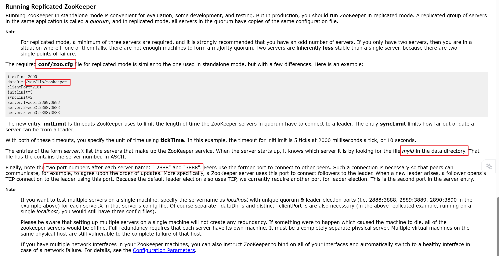
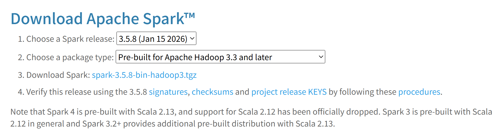
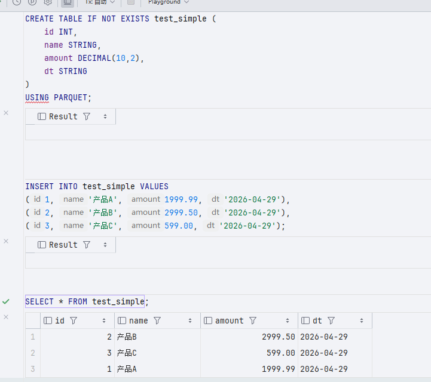

## 传统大数据集群配置

### 环境说明

传统大数据集群，即 Hadoop 那一套集群配置，HDFS + Spark + Yarn

但是考虑到真实场景，还需要其余组件，所以暂定为

Hadoop + Spark + Flink + Hive + Kafka + DolphinScheduler + Zookeeper + Doris + MySQL 版本对应关系定为

| 分类     | 组件             | 版本   | 说明                                                                                                                                 |
| -------- | ---------------- | ------ | ------------------------------------------------------------------------------------------------------------------------------------ |
| 基础     | Hadoop           | 3.3.6  | 包含 Yarn                                                                                                                            |
| 批处理   | Spark            | 3.4.2  | 需下载 pre-built for hadoop 3.3 来支持 spark                                                                                         |
| 流处理   | Flink            | 1.17.2 | x                                                                                                                                    |
| 数仓     | Hive             | 3.1.3  | 采用最成熟的版本，不使用 4.0 版本，某些支持还不成熟，注意当前 hive 3.1.3 版本是基于 JDK8 编译的，如果想使用 JDK17+ 那么需要 hive 4.x |
| 消息队列 | Kafka            | 3.6.1  | 支持 KRaft 模式，逐步去 Zookeeper 化                                                                                                 |
| 调度工具 | DolphinScheduler | 3.2.2  | x                                                                                                                                    |
| 注册中心 | Zookeeper        | 3.8.4  | Kafka 和 Hadoop HA 使用                                                                                                              |
| 数据库   | MySQL            | 8.0.x  | x                                                                                                                                    |
| OLAP     | Doris            | 2.0.x  | x                                                                                                                                    |
| 环境     | JDK              | 8      | x                                                                                                                                    |

### 机器配置说明

考虑到大数据环境需求资源较高，想要达成生产环境下的 HA 模式至少需要 4 台 4c8g 机器，其中一两台机器用来干活其余三台机器用来部署环境，可以说比较极限

想要流畅运行需要调大每台机器的内存，以及增加新机器

### 资源配置说明

8G 内存确实不够，为了保证运行正常，需要限制 hadoop 和 yarn 内存使用

NameNode 和 ResourceManager 的内存限制为 2GB，Yarn 单节点可用内存限制为 4GB，Doris BE 内存设置为 2GB

| 服务组件                         |            Node 1             |             Node 2             |      Node 3      |      Node 4      | 服务职能说明                                              |
| :------------------------------- | :---------------------------: | :----------------------------: | :--------------: | :--------------: | :-------------------------------------------------------- |
| Zookeeper                        |               ✅               |               ✅                |        ✅         |        ❌         | 集群协调服务，用于 HA 选举与状态监控，3 节点构成法定多数  |
| JournalNode                      |               ✅               |               ✅                |        ✅         |        ❌         | HDFS 高可用日志同步组件，确保 NN 主备元数据一致           |
| Hive Metastore                   |               ✅               |               ✅                |        ❌         |        ❌         | 管理 Hive 表结构、分区等元数据，双节点实现高可用          |
| HDFS                             |    ✅<br>NameNode (Active)     |    ✅<br>NameNode (Standby)     |  ✅<br>DataNode   |  ✅<br>DataNode   | HDFS 分布式文件系统核心，NN 管理元数据，DN 存储实际数据块 |
| Doris FE                         |          ✅<br>Leader          |         ✅<br>Observer          |        ❌         |        ❌         | Doris 前端节点，负责 SQL 解析、查询规划与元数据管理       |
| YARN                             | ✅<br>ResourceManager (Active) | ✅<br>ResourceManager (Standby) | ✅<br>NodeManager | ✅<br>NodeManager | YARN 资源调度框架，RM 分配资源，NM 执行任务容器           |
| MySQL                            |               ✅               |               ❌                |        ❌         |        ❌         | 元数据中枢：存储 Hive、Doris、DS 等组件的配置与表结构     |
| HiveServer2                      |               ❌               |               ❌                |        ✅         |        ✅         | 提供 JDBC/ODBC 接口，解析 SQL 并提交执行任务              |
| Doris BE                         |               ❌               |               ❌                |        ✅         |        ✅         | Doris 后端节点，负责数据存储、查询执行与计算              |
| Kafka Broker                     |               ❌               |               ❌                |        ✅         |        ✅         | 消息队列，用于缓冲实时数据流（如 Flink 消费源）           |
| DolphinScheduler Master          |               ✅               |               ❌                |        ❌         |        ❌         | 调度主节点，负责任务解析、分发与工作流编排                |
| DolphinScheduler Worker          |               ❌               |               ❌                |        ✅         |        ✅         | 调度执行节点，实际运行 Shell、Spark、Flink 等任务         |
| DolphinScheduler Alert/ApiServer |               ✅               |               ❌                |        ❌         |        ❌         | 提供 Web 接口与告警服务，通常与 Master 同节点部署         |

---

如果可用 5 台 4C16G 的节点来配置，则可为

| 服务组件         | Node 1 (Master) | Node 2 (Master) | Node 3 (Master) | Node 4 (Worker) | Node 5 (Worker) | 服务职能与部署理由                                               |
| :--------------- | :-------------: | :-------------: | :-------------: | :-------------: | :-------------: | :--------------------------------------------------------------- |
| 基础协调         |                 |                 |                 |                 |                 |                                                                  |
| Zookeeper        |        ✅        |        ✅        |        ✅        |        ❌        |        ❌        | 集群大脑。3节点部署满足高可用选举，不占用 Worker 资源。          |
| JournalNode      |        ✅        |        ✅        |        ✅        |        ❌        |        ❌        | HA 日志同步。配合 ZK 保证 NameNode 元数据一致性。                |
| Hadoop HA        |                 |                 |                 |                 |                 |                                                                  |
| NameNode         |   ✅ (Active)    |   ✅ (Standby)   |        ❌        |        ❌        |        ❌        | HDFS 核心。主备分离，Node 3 不部署 NN 以减轻负载。               |
| ResourceManager  |   ✅ (Active)    |   ✅ (Standby)   |        ❌        |        ❌        |        ❌        | YARN 核心。主备分离，确保调度高可用。                            |
| 数据存储与计算   |                 |                 |                 |                 |                 |                                                                  |
| DataNode         |        ✅        |        ✅        |        ✅        |        ✅        |        ✅        | HDFS 存储。5台全部署，利用所有磁盘空间，副本数设为 3。           |
| NodeManager      |        ✅        |        ✅        |        ✅        |        ✅        |        ✅        | YARN 计算。5台全部署，充分利用 5台机器的 CPU 跑任务。            |
| 数据仓库 (Hive)  |                 |                 |                 |                 |                 |                                                                  |
| Hive Metastore   |        ✅        |        ✅        |        ❌        |        ❌        |        ❌        | 元数据管理。部署在 Node 1, 2 实现双活，互为主备。                |
| HiveServer2      |        ✅        |        ✅        |        ❌        |        ❌        |        ❌        | SQL 接口。部署在 Node 1, 2，配合 Metastore 减少网络跳转。        |
| OLAP (Doris)     |                 |                 |                 |                 |                 |                                                                  |
| Doris FE         |   ✅ (Leader)    |  ✅ (Observer)   |  ✅ (Observer)   |        ❌        |        ❌        | Doris 前端。3节点部署，完美满足 FE 的高可用推荐架构。            |
| Doris BE         |        ❌        |        ❌        |        ✅        |        ✅        |        ✅        | Doris 后端。3节点部署 (Node 3,4,5)，数据分片存储，查询性能极强。 |
| 调度与消息       |                 |                 |                 |                 |                 |                                                                  |
| DolphinScheduler | ✅ (Master/API)  |        ❌        |        ❌        |   ✅ (Worker)    |   ✅ (Worker)    | 任务调度。Master 在 Node 1，Worker 在 Node 4, 5 执行具体任务。   |
| Kafka Broker     |        ❌        |        ❌        |        ✅        |        ✅        |        ✅        | 消息队列。3节点部署 (Node 3,4,5)，保证数据高可靠不丢失。         |
| 元数据库         |                 |                 |                 |                 |                 |                                                                  |
| MySQL            |        ✅        |        ❌        |        ❌        |        ❌        |        ❌        | 元数据中心。独占 Node 1，存储 Hive/DS/Doris 的元数据。           |

### 启动顺序

1. 所有 Zookeeper
1. 所有 JournalNode
1. HDFS 的 NameNode 和 DataNode
1. Yarn 的 ResourceManager 和 NodeManager
1. MySQL
1. Hive、Spark、Flink
1. Kafka
1. Doris FE 和 Doris BE
1. DolphinScheduler

### 模板机

#### 通用模板机

模板机需要配置好

1. 静态 ip
1. 主机名修改
1. hosts 与主机名映射正确
1. 大数据专有用户创建
1. ssh 配置，以及配置本机免密登录，之后任何节点都基于模板机的密钥

    采用大数据专有用户

    生成密钥对 `ssh-keygen -t rsa -b 4096 -m PEM -f ~/.ssh/id_rsa`

    公钥给自己本机 `cat ~/.ssh/id_rsa.pub >> ~/.ssh/authorized_keys`

    给文件当前用户的读写权限 `chmod 600 ~/.ssh/authorized_keys`

    测试是否能够 ssh 登录 `ssh template`

    root 用户也需要进行当前项的配置，因为之后要进行分发环境变量等内容

2. JDK 环境配置
3. 防火墙关闭（内网关闭即可）

    `sudo ufw disable`

    `sudo systemctl stop ufw`

4. 关闭 swap 分区

    临时关闭 `sudo swapoff -a`

    永久关闭 `sudo vim /etc/fstab` 注释掉包含 swap 的那一行

    `free -h` 中，swap 应该为 0

5. 时间同步

    `sudo apt install -y chrony`

    `sudo systemctl enable --now chrony`

6. 安装常用工具

    `sudo apt install -y vim net-tools curl wget sshpass rsync`

7. 将 xsync 和 xcall 脚本放到 `/usr/local/bin` 目录下，并且给执行权限

    <details>

    ```bash
    #!/bin/bash

    if [ $# -lt 1 ]; then
        echo "Error: Not enough arguments."
        echo "Usage: $0 <all | node1 [node2 ...]> <file/folder>"
        exit 1
    fi

    CLUSTER_NODES=("node1" "node2" "node3" "node4")

    TARGET_NODES=()

    # 获取最后一个参数作为文件路径
    FILE_RELATIVE="${@: -1}"

    # 将相对路径转换为绝对路径
    FILE=$(realpath "$FILE_RELATIVE")

    # 检查文件是否真的存在
    if [ ! -e "$FILE" ]; then
        echo "Error: File or Directory '$FILE_RELATIVE' does not exist."
        exit 1
    fi

    # 提取节点列表
    if [ "$1" == "all" ]; then
        TARGET_NODES=("${CLUSTER_NODES[@]}")
    else
        # 循环提取除最后一个参数外的所有参数作为节点
        for ((i=1; i<=$#; i++)); do
            if [ $i -lt $# ]; then
                TARGET_NODES+=("${!i}")
            fi
        done
    fi

    echo "------------------------------------------------"
    echo "Source File: $FILE"
    echo "Target Nodes: ${TARGET_NODES[*]}"
    echo "------------------------------------------------"

    for node in "${TARGET_NODES[@]}"; do
        # 获取文件所在的父目录路径
        PARENT_DIR=$(dirname "$FILE")

        # 获取文件名
        FILE_NAME=$(basename "$FILE")

        echo ">> Syncing to $node ..."

        # 先在远程创建父目录 (防止目录不存在报错)，使用双引号包裹变量，防止路径中有空格
        ssh "$node" "mkdir -p \"$PARENT_DIR\""

        # 目标路径写成 user@host:path 的形式最稳妥
        rsync -av "$FILE" "$node:$PARENT_DIR"

        if [ $? -eq 0 ]; then
            echo ">> [$node] Success"
        else
            echo ">> [$node] Failed"
        fi
    done

    echo "------------------------------------------------"
    echo "Done."
    ```

    </details>

    <details>

    ```bash
     #!/bin/bash

     if [ $# -lt 2 ]; then
        echo "错误：参数不足"
        echo "用法: $0 <all | node1 [node2 ...]> <要执行的命令>"
        echo "示例: $0 all 'jps'"
        echo "示例: $0 node2 'ls /opt/module'"
        exit 1
     fi

     CLUSTER_NODES=("node1" "node2" "node3" "node4")

     TARGET_NODES=()

     if [ "$1" == "all" ]; then
        # 如果是 all，目标列表就是整个集群列表
        TARGET_NODES=("${CLUSTER_NODES[@]}")
        shift
     else
        # 如果不是 all，提取节点名和命令，最后一个参数是命令，前面的是节点
        args=("$@")
        count=${#args[@]}

        # 提取命令 (最后一个参数)
        CMD="${args[count-1]}"

        # 提取节点名 (从第 0 个到倒数第 2 个)
        for ((i=0; i<count-1; i++)); do
            TARGET_NODES+=("${args[i]}")
        done
     fi

     # 如果 CMD 变量为空（说明是走的 if all 分支）
     if [ -z "$CMD" ]; then
         # 此时 $@ 里剩下的就是命令部分，将其转为字符串
         CMD="$*"
     fi

     echo "开始在集群执行命令: $CMD"
     echo "目标节点: ${TARGET_NODES[*]}"

     for node in "${TARGET_NODES[@]}"; do
        echo "--------------------------------"
        echo "正在节点 [$node] 执行 [$CMD]"

        # 使用 ssh 执行命令，命令需要用引号包裹，防止本地 shell 提前解析，并且先加载环境变量再执行命令
        ssh "$node" "source /etc/profile; $CMD"

        if [ $? -eq 0 ]; then
            echo "[$node] 执行成功"
        else
            echo "[$node] 执行失败 (请检查命令或网络连接)"
        fi
     done

     echo "命令执行完毕"
    ```

    </details>

8. 通用用户

    ```bash
    sudo groupadd hadoop

    -- 创建用户
    -- -g 指定用户组为 hadoop
    -- -r 代表创建的是系统账户（不能被普通用户 su 切换过去，除了 root 强制切换）
    -- -s 指定 shell
    sudo useradd -g hadoop -s /bin/bash hdfs
    sudo useradd -r -g hadoop -s /bin/bash yarn
    sudo useradd -r -g hadoop -s /bin/bash mapred

    -- 给其他用户添加一个新的用户组
    -- a 代表追加，不加此条会退出别的用户组
    -- G 代表附加组
    sudo usermod -aG hadoop causes
    ```

### 环境搭建

#### Zookeeper

本次 zookeeper 采用 3.8.6，虽然推荐为 3.8.4，但事实上小版本之间无太大差异

根据[官方文档](https://zookeeper.apache.org/doc/r3.8.6/zookeeperStarted.html)记载



1. zookeeper 需要在 `conf/zoo.cfg` 中配置 `dataDir` 作为数据存储，并且在此文件夹中配置一个 `myid` 的文件作为标识符，标识自己在集群模式下到底属于哪台服务器

    这里根据之前的规划，选择 node1 node2 node3 节点作为 zookeeper 服务器

    并且将 `/opt/data/zookeeper` 作为 `dataDir`

    另外根据网络资料，`myid` 文件中的 id 只能在 `1 - 255` 之间

    `xcall node1 node2 node3 "cat /etc/hostname | awk '{print substr(\$1,5,6)}' > /opt/data/zookeeper/myid "`

    这个读取的是 node1 的数字然后放到 myid 中

1. zookeeper 的 `conf/zoo.cfg` 中需要配置好所有服务器的地址

    当前四节点为

    ```text
    dataDir=/opt/data/zookeeper
    server.1=node1:2888:3888
    server.2=node2:2888:3888
    server.3=node3:2888:3888
    server.4=node4:2888:3888
    server.5=node4:2888:3888
    ```

1. 启动 zookeeper

    `xcall node1 node2 node3 "/opt/module/apache-zookeeper-3.8.6-bin/bin/zkServer.sh start"`

    `xcall node1 node2 node3 "/opt/module/apache-zookeeper-3.8.6-bin/bin/zkServer.sh status"`

#### Hadoop HA

为了保证高可用性和权限隔离效果，Hadoop 在进行部署之前必须要划分权限来进行调整

这其中包括 HDFS 的权限以及 Yarn 的权限，生产环境下不建议直接配置 root

hadoop 推荐为不同用户配置不同权限，可以拆分为 hdfs、yarn，也可以一个 hadoop 走天下

所以推荐是创建一个用户组为 hadoop，另外分别创建 hdfs 和 yarn 用户，hdfs 和 yarn 用户都属于用户组 hadoop

这样做的好处是，可以根据 linux 的权限系统划分为当前人和当前用户组和其他人的读写执行操作

1. 下载 [hadoop 3.3.6](https://hadoop.apache.org/release/3.3.6.html)，解压缩到服务器上并且配置环境变量
1. 给定 hadoop env 环境变量 `$HADOOP_HOME/etc/hadoop/hadoop-env.sh`

    ```bash
    export JAVA_HOME=/opt/module/jdk1.8.0_202
    # Java 9+ 的一个启动参数，强制打开一个模块给外部访问，负责 WEB-UI 上看文件会报错，如果是使用 JDK8 那么就没问题了，注意 JDK8 不要用这个，会报错
    # export HADOOP_OPTS="$HADOOP_OPTS --add-opens java.base/java.lang=ALL-UNNAMED --add-opens java.base/java.util=ALL-UNNAMED --add-opens java.base/java.nio=ALL-UNNAMED"
    ```

1. 配置 hadoop 主要配置文件，配置 HA `$HADOOP_HOME/etc/hadoop`

    创建 hadoop 存储文件的目录，这里设置为 `/opt/data/hadoop/{hdfs,journal}`

    `core-site.xml`

    这一步需要注意，一些教程会配置 `hadoop.http.staticuser.user` 为 `root`，这个代表使用超级管理员去查看 WebUI，随意删除，这个不允许

    不配置 `hadoop.http.staticuser.user` 的话会使用匿名用户来进行查看，也就是无论谁来都不能修改

    <details>

    ```xml
    <configuration>
        <!-- 定义 HDFS 的逻辑名称 -->
        <property>
            <name>fs.defaultFS</name>
            <value>hdfs://hadoop</value>
        </property>

        <!-- 数据目录 给定之前准备好的目录，生产需要指定到独立磁盘 -->
        <property>
            <name>hadoop.tmp.dir</name>
            <value>/opt/data/hadoop/hdfs</value>
        </property>

        <!-- ZooKeeper 集群地址 给定之前配置 zookeeper 的节点 用于 HA 协调 -->
        <property>
            <name>ha.zookeeper.quorum</name>
            <value>node1:2181,node2:2181,node3:2181</value>
        </property>

        <!-- 开启 hdfs 的代理身份 -->
        <property>
            <name>hadoop.proxyuser.hdfs.hosts</name>
            <value>*</value>
        </property>
        <property>
            <name>hadoop.proxyuser.hdfs.groups</name>
            <value>*</value>
        </property>

        <!-- 开启回收站，保留 1 天 -->
        <property>
            <name>fs.trash.interval</name>
            <value>1440</value>
        </property>
    </configuration>
    ```

    </details>

    `hdfs-site.xml`

    这里注意，需要首先创建 hdfs 用户，给到密钥对，才能使用 `dfs.ha.fencing.ssh.private-key-files`

    <details>

    ```xml
    <configuration>
       <!-- 副本数 -->
       <property>
          <name>dfs.replication</name>
          <value>3</value>
       </property>

       <!-- 定义 Nameservice ID (需与 core-site.xml 中的 fs.defaultFS 对应) -->
       <property>
          <name>dfs.nameservices</name>
          <value>hadoop</value>
       </property>

       <!-- 定义两个 NameNode 的别名 (nn1, nn2) -->
       <property>
          <name>dfs.ha.namenodes.hadoop</name>
          <value>nn1,nn2</value>
       </property>

       <!-- nn 的 RPC 地址 -->
       <property>
          <name>dfs.namenode.rpc-address.hadoop.nn1</name>
          <value>node1:8020</value>
       </property>
       <property>
          <name>dfs.namenode.rpc-address.hadoop.nn2</name>
          <value>node2:8020</value>
       </property>

       <!-- NameNode 的 Web UI 地址 -->
       <property>
          <name>dfs.namenode.http-address.hadoop.nn1</name>
          <value>node1:9870</value>
       </property>
       <property>
          <name>dfs.namenode.http-address.hadoop.nn2</name>
          <value>node2:9870</value>
       </property>

       <!-- 集群 NameNode 元数据在 JournalNode 存放位置 目录 hadoop 为集群 id -->
       <property>
          <name>dfs.namenode.shared.edits.dir</name>
          <value>qjournal://node1:8485;node2:8485;node3:8485/hadoop</value>
       </property>
       <!-- NameNode 元数据在 JournalNode 的物理磁盘存放位置，生产需要指定独立磁盘 -->
       <property>
          <name>dfs.journalnode.edits.dir</name>
          <value>/opt/data/hadoop/journal</value>
       </property>

       <!-- 配置自动故障转移 -->
       <property>
          <name>dfs.ha.automatic-failover.enabled</name>
          <value>true</value>
       </property>

       <!-- 客户端故障转移代理 -->
       <property>
          <name>dfs.client.failover.proxy.provider.hadoop</name>
          <value>org.apache.hadoop.hdfs.server.namenode.ha.ConfiguredFailoverProxyProvider</value>
       </property>

       <!-- 
        使用 SSH 隔离防止 NameNode 脑裂
        shell 用于兜底（比如机器崩溃无法 ssh 过去的时候） 
        注意 sshfence 和 shell 都需要新启动一行，用于表示为一个列表
        arping 需要提前安装 iputils-arping 并且位置可能不同，需要谨慎，另外网络可能不同，需要修改
        意思是 arping 进行流量转发，将 target_host 的流量全都转移到自己身上来，这样可以防止脑裂
       -->
       <property>
          <name>dfs.ha.fencing.methods</name>
          <value>
    sshfence
    shell(/usr/bin/arping -D -c 3 -A ${target_host})
          </value>
       </property>
       <property>
          <name>dfs.ha.fencing.ssh.private-key-files</name>
          <value>/home/hdfs/.ssh/id_rsa</value>
       </property>
    </configuration>
    ```

    </details>

    `yarn-site.xml`

    <details>

    ```xml
    <configuration>
        <!-- 开启 YARN HA -->
        <property>
            <name>yarn.resourcemanager.ha.enabled</name>
            <value>true</value>
        </property>

        <!-- 定义 RM 集群 ID -->
        <property>
            <name>yarn.resourcemanager.cluster-id</name>
            <value>yarn-cluster</value>
        </property>

        <!-- 定义 RM 节点 ID -->
        <property>
            <name>yarn.resourcemanager.ha.rm-ids</name>
            <value>rm1,rm2</value>
        </property>

        <!-- 指定 RM 地址 -->
        <property>
            <name>yarn.resourcemanager.hostname.rm1</name>
            <value>node1</value>
        </property>
        <property>
            <name>yarn.resourcemanager.hostname.rm2</name>
            <value>node2</value>
        </property>

        <!-- 为 rm1 指定 Web UI 地址 -->
        <property>
            <name>yarn.resourcemanager.webapp.address.rm1</name>
            <value>node1:8088</value>
        </property>
        <property>
            <name>yarn.resourcemanager.webapp.https.address.rm1</name>
            <value>node1:8090</value>
        </property>

        <!-- 为 rm2 指定 Web UI 地址 -->
        <property>
            <name>yarn.resourcemanager.webapp.https.address.rm2</name>
            <value>node2:8090</value>
        </property>
        <property>
            <name>yarn.resourcemanager.webapp.address.rm2</name>
            <value>node2:8088</value>
        </property>

        <!-- 指定 ZK 地址 -->
        <property>
            <name>yarn.resourcemanager.zk-address</name>
            <value>node1:2181,node2:2181,node3:2181</value>
        </property>

        <!--启用自动恢复-->
        <property>
            <name>yarn.resourcemanager.recovery.enabled</name>
            <value>true</value>
        </property>

        <!--指定 resourcemanager 的状态信息存储在zookeeper集群-->
        <property>
            <name>yarn.resourcemanager.store.class</name>
            <value>org.apache.hadoop.yarn.server.resourcemanager.recovery.ZKRMStateStore</value>
        </property>

        <!-- 环境白名单 -->
        <property>
            <name>yarn.nodemanager.env-whitelist</name>
            <value>JAVA_HOME,HADOOP_COMMON_HOME,HADOOP_HDFS_HOME,HADOOP_CONF_DIR,CLASSPATH_PREPEND_DISTCACHE,HADOOP_YARN_HOME,HADOOP_MAPRED_HOME,HADOOP_HOME,PATH,LANG,TZ,FLINK_HOME</value>
        </property>

        <!-- 辅助服务：mapreduce_shuffle -->
        <property>
            <name>yarn.nodemanager.aux-services</name>
            <value>mapreduce_shuffle</value>
        </property>
        <property>
            <name>yarn.nodemanager.aux-services.mapreduce_shuffle.class</name>
            <value>org.apache.hadoop.mapred.ShuffleHandler</value>
        </property>

        <!-- 日志聚合存储 HDFS 路径 -->
        <property>
            <name>yarn.nodemanager.remote-app-log-dir</name>
            <value>/tmp/logs</value>
        </property>
    </configuration>
    ```

    </details>

    `mapred-site.xml`

    <details>

    ```xml
    <configuration>
        <!-- 指定 MapReduce 运行在 YARN 上 -->
        <property>
            <name>mapreduce.framework.name</name>
            <value>yarn</value>
        </property>

        <!-- 开启 MapReduce 的历史服务器 -->
        <property>
            <name>mapreduce.jobhistory.address</name>
            <value>node1:10020</value>
        </property>

        <!-- 历史服务器 Web UI 地址 -->
        <property>
            <name>mapreduce.jobhistory.webapp.address</name>
            <value>node1:19888</value>
        </property>

        <!-- 启用 Shuffle 服务（YARN 需要这个来混洗 Map 输出的数据） -->
        <property>
            <name>yarn.nodemanager.aux-services</name>
            <value>mapreduce_shuffle</value>
        </property>
    </configuration>
    ```

    </details>

1. 启动集群

    启动 zookeeper 集群 `xcall node1 node2 node3 "/opt/module/apache-zookeeper-3.8.6-bin/bin/zkServer.sh start"`

    在 node1、node2、node3 上启动 JournalNode `xcall node1 node2 node3 "$HADOOP_HOME/sbin/hadoop-daemon.sh start journalnode"` 格式化向 JournalNode 写入元数据

    node1 上格式化 NameNode: `hdfs namenode -format` 格式化会产生新的集群 ID，假如需要重新格式化一定要删除 data 和 logs 目录，格式化完成后查看存放数据的文件夹下是否有了 dfs 目录

    启动主 NameNode node1: `hadoop-daemon.sh start namenode`

    格式化从 NameNode node2: 将元数据同步 `hdfs namenode -bootstrapStandby`

    启动从 NameNode node2: `hadoop-daemon.sh start namenode`

    在其中一个 NameNode 中运行 `hdfs zkfc -formatZK` 来初始化

    停止已经启动的 dfs `stop-dfs.sh`

    全面启动 dfs `start-dfs.sh`

    启动 yarn `start-yarn.sh`

1. 验证认证

    `hdfs dfs -ls /`

    这个命令其实等同于先去寻找 zookeeper 谁是 active 节点，然后直接连上去执行

1. 一键启停脚本 `hadoop-ha-manage.sh`

    <details>

    ```bash
    #!/bin/bash
    
    # ================= 配置区域 =================
    # 主机名/ip
    NODE1="node1"
    NODE2="node2"
    NODE3="node3"
    NODE4="node4"
    NODE5="node5"
    
    # 角色分配
    NN_NODES=("$NODE1" "$NODE2")               # NameNode 节点
    JN_NODES=("$NODE1" "$NODE2" "$NODE3")      # JournalNode 节点（奇数个）
    ZK_NODES=("$NODE1" "$NODE2" "$NODE3")      # ZooKeeper 节点
    WORKER_NODES=("$NODE4" "$NODE5")           # DataNode / NodeManager
    HS_NODE="$NODE1"                           # MapReduce HistoryServer
    
    # ⚠️ 重要：必须与 hdfs-site.xml 中 dfs.ha.namenodes.<nameservice> 配置一致
    # 例如 nameservice 为 mycluster，则 nn1、nn2 的逻辑名称为 nn1、nn2
    NN1_HOST="$NODE1"
    NN1_ID="nn1"
    NN2_HOST="$NODE2"
    NN2_ID="nn2"
    
    # Hadoop 安装目录（通过环境变量获取）
    if [ -z "$HADOOP_HOME" ]; then
        source /etc/profile 2>/dev/null
        HADOOP_HOME=$HADOOP_HOME
    fi
    if [ -z "$HADOOP_HOME" ]; then
        echo "错误: 未找到 HADOOP_HOME 环境变量！"
        exit 1
    fi
    
    # 去重函数（用于状态检查等）
    unique_nodes() {
        printf "%s\n" "$@" | sort -u
    }
    
    # 颜色定义
    RED='\033[0;31m'
    GREEN='\033[0;32m'
    YELLOW='\033[1;33m'
    NC='\033[0m'
    
    # ================= 函数定义 =================
    print_msg()  { echo -e "${GREEN}[$1]${NC} $2"; }
    print_warn() { echo -e "${YELLOW}[$1]${NC} $2"; }
    print_error(){ echo -e "${RED}[$1]${NC} $2"; }
    
    # SSH 远程执行命令（自动加载环境变量）
    ssh_exec() {
        local node=$1
        local cmd=$2
        ssh -o StrictHostKeyChecking=no -o UserKnownHostsFile=/dev/null -o LogLevel=ERROR "$node" \
            "source /etc/profile 2>/dev/null; export JAVA_HOME=${JAVA_HOME}; export PATH=\$JAVA_HOME/bin:\$PATH; $cmd"
    }
    
    # ---------- 启动 ----------
    start_all() {
        print_msg "START" "========== 启动 Hadoop HA 集群 =========="
    
        # 1. ZooKeeper
        print_msg "ZK" "启动 ZooKeeper..."
        for node in "${ZK_NODES[@]}"; do
            ssh_exec "$node" "zkServer.sh start"
        done
        sleep 3
    
        # 2. JournalNode
        print_msg "JN" "启动 JournalNode..."
        for node in "${JN_NODES[@]}"; do
            ssh_exec "$node" "$HADOOP_HOME/bin/hdfs --daemon start journalnode"
        done
        sleep 2
    
        # 3. NameNode
        print_msg "NN" "启动 NameNode..."
        for node in "${NN_NODES[@]}"; do
            ssh_exec "$node" "$HADOOP_HOME/bin/hdfs --daemon start namenode"
        done
        sleep 2
    
        # 4. ZKFC
        print_msg "ZKFC" "启动 ZKFC..."
        for node in "${NN_NODES[@]}"; do
            ssh_exec "$node" "$HADOOP_HOME/bin/hdfs --daemon start zkfc"
        done
        sleep 2
    
        # 5. DataNode
        print_msg "WORKER" "启动 DataNode..."
        for node in "${WORKER_NODES[@]}"; do
            ssh_exec "$node" "$HADOOP_HOME/bin/hdfs --daemon start datanode"
        done
        sleep 2
    
        # 6. ResourceManager（先于 NodeManager）
        print_msg "RM" "启动 ResourceManager..."
        for node in "${NN_NODES[@]}"; do
            ssh_exec "$node" "$HADOOP_HOME/bin/yarn --daemon start resourcemanager"
        done
        sleep 2
    
        # 7. NodeManager
        print_msg "WORKER" "启动 NodeManager..."
        for node in "${WORKER_NODES[@]}"; do
            ssh_exec "$node" "$HADOOP_HOME/bin/yarn --daemon start nodemanager"
        done
        sleep 2
    
        # 8. MapReduce HistoryServer
        print_msg "HS" "启动 HistoryServer..."
        ssh_exec "$HS_NODE" "$HADOOP_HOME/bin/mapred --daemon start historyserver"
        sleep 2
    
        print_msg "DONE" "所有启动命令已发送，请执行 '$0 status' 检查状态。"
    }
    
    # ---------- 停止 ----------
    stop_all() {
        print_msg "STOP" "========== 关闭 Hadoop HA 集群 =========="
    
        # 1. ResourceManager
        print_msg "RM" "停止 ResourceManager..."
        for node in "${NN_NODES[@]}"; do
            ssh_exec "$node" "$HADOOP_HOME/bin/yarn --daemon stop resourcemanager"
        done
    
        # 2. NodeManager
        print_msg "NM" "停止 NodeManager..."
        for node in "${WORKER_NODES[@]}"; do
            ssh_exec "$node" "$HADOOP_HOME/bin/yarn --daemon stop nodemanager"
        done
    
        # 3. HistoryServer
        print_msg "HS" "停止 HistoryServer..."
        ssh_exec "$HS_NODE" "$HADOOP_HOME/bin/mapred --daemon stop historyserver"
    
        # 4. ZKFC（先于 NameNode 以避免误切换）
        print_msg "ZKFC" "停止 ZKFC..."
        for node in "${NN_NODES[@]}"; do
            ssh_exec "$node" "$HADOOP_HOME/bin/hdfs --daemon stop zkfc"
        done
    
        # 5. NameNode
        print_msg "NN" "停止 NameNode..."
        for node in "${NN_NODES[@]}"; do
            ssh_exec "$node" "$HADOOP_HOME/bin/hdfs --daemon stop namenode"
        done
    
        # 6. DataNode
        print_msg "DN" "停止 DataNode..."
        for node in "${WORKER_NODES[@]}"; do
            ssh_exec "$node" "$HADOOP_HOME/bin/hdfs --daemon stop datanode"
        done
    
        # 7. JournalNode
        print_msg "JN" "停止 JournalNode..."
        for node in "${JN_NODES[@]}"; do
            ssh_exec "$node" "$HADOOP_HOME/bin/hdfs --daemon stop journalnode"
        done
    
        # 8. ZooKeeper
        print_msg "ZK" "停止 ZooKeeper..."
        for node in "${ZK_NODES[@]}"; do
            ssh_exec "$node" "zkServer.sh stop"
        done
    
        print_msg "DONE" "所有停止命令已发送。"
    }
    
    # ---------- 状态 ----------
    check_status() {
        print_msg "STATUS" "========== 集群进程状态 =========="
    
        # 所有节点去重
        ALL_NODES=("${NN_NODES[@]}" "${JN_NODES[@]}" "${ZK_NODES[@]}" "${WORKER_NODES[@]}")
        mapfile -t UNIQUE_NODES < <(unique_nodes "${ALL_NODES[@]}")
    
        for node in "${UNIQUE_NODES[@]}"; do
            echo "----------------------------------------"
            print_msg "HOST" "$node"
            ssh_exec "$node" "jps 2>/dev/null | grep -E 'NameNode|DataNode|JournalNode|QuorumPeerMain|ResourceManager|NodeManager|DFSZKFailoverController' || echo '无相关 Java 进程'"
        done
        echo "----------------------------------------"
    
        # HA 状态（需要正确的 ids）
        print_msg "HA" "NameNode HA 状态:"
        ssh_exec "${NN1_HOST}" "$HADOOP_HOME/bin/hdfs haadmin -getServiceState $NN1_ID 2>/dev/null" || \
            print_error "NN" "无法获取 ${NN1_HOST} 的状态"
        ssh_exec "${NN2_HOST}" "$HADOOP_HOME/bin/hdfs haadmin -getServiceState $NN2_ID 2>/dev/null" || \
            print_error "NN" "无法获取 ${NN2_HOST} 的状态"
    }
    
    # ================= 主程序 =================
    case "$1" in
        start)   start_all     ;;
        stop)    stop_all      ;;
        status)  check_status  ;;
        restart) stop_all
                 sleep 5
                 start_all     ;;
        *)       echo "用法: $0 {start|stop|status|restart}"
                 exit 1        ;;
    esac
    ```

    </details>

1. 验证 HA 高可用

    需要注意，namenode 之前首先要 `ssh node` 一次，因为配置中是需要使用 ssh 进去另外的 node kill 进程的

    然后一定要安装 `sudo apt-get install -y psmisc` 里面包含了 Hadoop 的隔离机制依赖 Linux 的 fuser 或 killall

    第一次 ssh 会确认握手，添加到自己的 know_hosts 中，但是控制台不能自己输入，最终日志会表示 ssh 失败

    另外需要注意，id_rsa 是否能够有权限去读取，不要以其他用户去启动 hdfs，否则读取不到就会失败

    另外发现一个问题，密钥对 hadoop 对于新的格式 `BEGIN OPENSSH PRIVATE KEY` 读取不了，只能用老的密钥对 `BEGIN RSA PRIVATE KEY`

    所以密钥对生成应该使用 `ssh-keygen -t rsa -b 4096 -m PEM -f ~/.ssh/id_rsa` 命令，然后 `ssh-copy-id -i ~/.ssh/id_rsa.pub node` 到其他机器上

    而且权限必须是 600，如果是其他的就会拒绝读取

    首先进入网页可以查看 `Overview` 这一栏中，一个 node 应该展示 Active，另一个应该展示 Standby

    然后进入到 active 的那个 node 中，Jps 查看 namenode 的进程，然后 kill 掉，等待 10-20s 查看是否自动切换

1. 执行 mapreduce 验证 `hadoop jar $HADOOP_HOME/share/hadoop/mapreduce/hadoop-mapreduce-examples-*.jar pi 2 2`

#### Spark

1. 下载 spark，直接去[官网](https://spark.apache.org/downloads.html)下载，虽然我们之前说的是版本对应 3.4.2，但其实能和 hadoop 版本对应（即 3.3 版本）对应即可

    <details>

    

    </details>

    这里下载的是 3.5.8 [版本](https://dlcdn.apache.org/spark/spark-3.5.8/spark-3.5.8-bin-hadoop3.tgz)

1. 将 spark 解压到目录下，给出配置复制

    `$SPARK_HOME/conf/spark-env.sh`

    <details>

    ```bash
    # 指定 Hadoop 配置文件目录
    export HADOOP_CONF_DIR=/opt/module/hadoop-3.3.6/etc/hadoop
    export YARN_CONF_DIR=/opt/module/hadoop-3.3.6/etc/hadoop

    # 指定 Java 路径
    export JAVA_HOME=/opt/module/jdk1.8.0_202

    # 指定 Driver 内存，防止默认值太小
    export SPARK_DRIVER_MEMORY=2G
    ```

    `$SPARK_HOME/conf/spark-defaults.conf`

    ```conf
    # 运行模式
    spark.master yarn

    # 历史服务器配置
    # 让 Spark 把日志写到 HDFS 上，这样你可以在 Web UI 看到历史任务
    spark.eventLog.enabled true
    spark.eventLog.dir hdfs:///bigdata/spark/logs

    # kryo 序列化
    spark.serializer org.apache.spark.serializer.KryoSerializer

    # 内存管理，默认值为配置文件内容，命令行与代码中指定的优先级更高
    spark.driver.memory 2g
    spark.executor.memory 1g

    # hadoop 配置位置
    spark.yarn.dist.confDir /opt/module/hadoop-3.3.6/etc/hadoop

    # spark libs 包位置
    spark.yarn.jars hdfs:///bigdata/spark/libs/*
    ```

    </details>

    配置 `log4j2.properties` 可以将日志级别改为 `rootLogger.level = ERROR` 但是也可以为 `INFO` `WARN`，但是生产建议保留 `INFO` 用来排查问题

    HDFS 文件目录准备

    ```bash
    hdfs dfs -chown hdfs:hadoop /tmp
    hdfs dfs -chmod 755 /tmp
    hdfs dfs -chmod -R 755 /tmp
    hdfs dfs -chown -R hdfs:hadoop /tmp
    hdfs dfs -mkdir -p /bigdata/spark/logs
    hdfs dfs -chown -R hdfs:hadoop /bigdata
    hdfs dfs -chmod -R 755 /bigdata
    hdfs dfs -mkdir -p /bigdata/spark/libs
    hdfs dfs -put $SPARK_HOME/jars/* /bigdata/spark/libs
    ```

1. 执行命令运行

    ```bash
    spark-submit \
        --master yarn \
        --deploy-mode cluster \
        --class org.apache.spark.examples.SparkPi \
        $SPARK_HOME/examples/jars/spark-examples_2.12-3.5.8.jar \
    100
    ```

#### Hive

##### MySQL

要安装 Hive，首先需要安装关系型数据库做元数据

1. 更新 `sudo apt update`
1. 安装 MySQL 服务端 `sudo apt install -y mysql-server` 默认安装为最新版
1. 检查状态 `sudo systemctl status mysql`
1. 安全设置

    `sudo mysql -u root`

    修改 root 用户的认证方式为密码认证，并设置密码

    ```sql
    -- 修改 root 用户为密码认证，并给到密码
    ALTER USER 'root'@'localhost' IDENTIFIED WITH mysql_native_password BY 'Ab@123';
    FLUSH PRIVILEGES;
    ```

1. 创建 hive 专用用户

    ```sql
    -- 创建 Hive 元数据库
    CREATE DATABASE hive_metastore CHARACTER SET utf8mb4 COLLATE utf8mb4_general_ci;

    -- 创建 Hive 专用用户并授权
    -- 这里允许所有节点(%)连接，这样配置最方便
    CREATE USER 'hive'@'%' IDENTIFIED WITH mysql_native_password BY 'Ab@123';

    -- 授予该用户对 hive_metastore 库的所有权限
    GRANT ALL PRIVILEGES ON hive_metastore.* TO 'hive'@'%';

    --  刷新权限
    FLUSH PRIVILEGES;
    EXIT;
    ```

1. 配置远程访问

    配置文件 `/etc/mysql/mysql.conf.d/mysqld.cnf`

    注释掉绑定地址，令其监听所有 IP: `# bind-address = 127.0.0.1`

    重启 MYSQL 服务 `sudo systemctl restart mysql`

    配置测试链接

##### Hive Metastore && Hive Server 2

1. 下载 [hive](https://archive.apache.org/dist/hive/hive-3.1.3/apache-hive-3.1.3-bin.tar.gz)
1. 解压缩，配置环境变量
1. 将 MySQL [驱动包](https://repo1.maven.org/maven2/com/mysql/mysql-connector-j/8.3.0/mysql-connector-j-8.3.0.jar)复制到 `$HIVE_HOME/lib` 路径下，版本无所谓，MySQL 驱动包在高版本兼容低版本
1. 给 hive 准备文件

    ```bash
    hdfs dfs -mkdir -p /bigdata/hive/warehouse
    hdfs dfs -mkdir -p /bigdata/hive/scratchdir
    hdfs dfs -mkdir -p /bigdata/hive/resources

    hdfs dfs -chown -R hdfs:hadoop /bigdata
    hdfs dfs -chown -R hive:hadoop /bigdata/hive
    hdfs dfs -chmod -R 755 /bigdata

    sudo mkdir -p /tmp/hive/resources
    sudo mkdir -p /tmp/hive/scratchdir
    sudo chown -R hdfs:hadoop /tmp/hive
    ```

    准备新用户 hive:hadoop，此时不用，之后准备 Kerberos 认证的时候使用

    ```bash
    xcall all "sudo useradd -r -g hadoop -s /bin/bash hive"
    ```

1. `hive-site.xml` 设置

    <details>

    ```xml
    <configuration>
        <!-- 基础配置：HDFS 仓库目录 -->
        <property>
            <name>hive.metastore.warehouse.dir</name>
            <value>/bigdata/hive/warehouse</value>
        </property>

        <!-- 元数据库连接 (所有节点连同一个 MySQL) -->
        <property>
            <name>javax.jdo.option.ConnectionURL</name>
            <value>
                jdbc:mysql://node1:3306/hive_metastore?createDatabaseIfNotExist=true&amp;useSSL=false&amp;serverTimezone=Asia/Shanghai
            </value>
        </property>
        <property>
            <name>javax.jdo.option.ConnectionDriverName</name>
            <value>com.mysql.cj.jdbc.Driver</value>
        </property>
        <property>
            <name>javax.jdo.option.ConnectionUserName</name>
            <value>hive</value>
        </property>
        <property>
            <name>javax.jdo.option.ConnectionPassword</name>
            <value>Ab@123</value>
        </property>

        <!-- Metastore HA 配置 -->
        <!-- Hive Metastore 服务应该监听哪个地址 -->
        <property>
            <name>hive.metastore.uris</name>
            <value>thrift://node1:9083,thrift://node2:9083</value>
        </property>

        <!-- HiveServer2 HA 配置 (基于 ZooKeeper) -->
        <!-- HiveServer2 监听的主机地址 -->
        <property>
            <name>hive.server2.thrift.bind.host</name>
            <value>0.0.0.0</value>
        </property>
        <!-- HiveServer2 监听的端口 -->
        <property>
            <name>hive.server2.thrift.port</name>
            <value>10000</value>
        </property>
        <!-- 开启 HS2 的 ZooKeeper 注册 -->
        <property>
            <name>hive.server2.support.dynamic.service.discovery</name>
            <value>true</value>
        </property>
        <!-- 配置 ZooKeeper 命名空间 -->
        <!-- 所有 HS2 实例会在 ZK 的这个目录下注册临时节点 -->
        <property>
            <name>hive.zookeeper.namespace</name>
            <value>hiveserver2</value>
        </property>
        <!-- 指定 ZooKeeper 集群 -->
        <property>
            <name>hive.zookeeper.quorum</name>
            <value>node1:2181,node2:2181,node3:2181</value>
        </property>
        <!-- ZooKeeper 命名空间 -->
        <property>
            <name>hive.zookeeper.client.port</name>
            <value>2181</value>
        </property>

        <!-- Java 虚拟机临时目录，本地磁盘 -->
        <property>
            <name>java.io.tmpdir</name>
            <value>/tmp/hive</value>
        </property>
        <!-- Hive 临时使用的 Hadoop 地址，尝试使用过 hdfs，但是它直接读取了本地文件目录，很离谱，所以直接采用本地系统得了 -->
        <property>
            <name>hive.exec.scratchdir</name>
            <value>/tmp/hive/scratchdir</value>
        </property>
        <!-- Hive 存放资源文件的 Hadoop 地址 -->
        <property>
            <name>hive.downloaded.resources.dir</name>
            <value>/tmp/hive/resources</value>
        </property>

        <!-- 认证方式：待添加 KERBEROS 认证 -->
        <property>
            <name>hive.server2.authentication</name>
            <value>NONE</value>
        </property>
        <!-- 直接禁用掉 hive 本身安全认证，之后直接上 kerberos -->
        <property>
            <name>hive.security.authorization.enabled</name>
            <value>false</value>
        </property>
        <property>
            <name>hive.security.authorization.createtable.owner.grants</name>
            <value>ALL</value>
        </property>

        <!-- 开启并发支持（多会话），查询时以用户身份执行 -->
        <property>
            <name>hive.server2.enable.doAs</name>
            <value>true</value>
        </property>
        <!-- 开启多线程模式（提高并发性能） -->
        <property>
            <name>hive.server2.thrift.max.worker.threads</name>
            <value>500</value>
        </property>
        <!-- 直接关掉 hive 的轮询功能，因为 HS2 启动时会强制初始化 NotificationEventPoll，如果初始化失败，HS2 就直接报错退出，这个未来版本的功能直接禁用也没问题，HA 不受影响-->
        <property>
            <name>hive.metastore.event.db.notification.api.auth</name>
            <value>false</value>
        </property>
        <property>
            <name>hive.metastore.notifications</name>
            <value>false</value>
        </property>

        <!-- 执行引擎改为 spark -->
        <property>
            <name>hive.execution.engine</name>
            <value>spark</value>
        </property>
        <property>
            <name>spark.home</name>
            <value>/opt/module/spark-3.5.8-bin-hadoop3</value>
        </property>
        <property>
            <name>spark.master</name>
            <value>yarn</value>
        </property>
        <property>
            <name>spark.submit.deployMode</name>
            <value>client</value>
        </property>
        <property>
            <name>spark.yarn.jars</name>
            <value>hdfs://hadoop/bigdata/spark/lib/*</value>
        </property>
        <property>
            <name>spark.executor.memory</name>
            <value>2g</value>
        </property>
        <property>
            <name>spark.executor.cores</name>
            <value>2</value>
        </property>

        <!-- 打印表头 -->
        <property>
            <name>hive.cli.print.header</name>
            <value>true</value>
        </property>
        <!-- 打印库名称 -->
        <property>
            <name>hive.cli.print.current.db</name>
            <value>true</value>
        </property>

    </configuration>
    ```

    </details>

1. hive 到 hadoop 的软链接

    hive 直接复用 hadoop 的配置文件即可

    ```bash
    cd $HIVE_HOME/conf
    ln -s $HADOOP_HOME/etc/hadoop/core-site.xml $HIVE_HOME/conf/core-site.xml
    ln -s $HADOOP_HOME/etc/hadoop/hdfs-site.xml $HIVE_HOME/conf/hdfs-site.xml
    ln -s $HADOOP_HOME/etc/hadoop/yarn-site.xml $HIVE_HOME/conf/yarn-site.xml
    ```

    配置 `hive-env.sh`

    ```bash
    export HADOOP_HOME=/opt/module/hadoop-3.3.6
    export HIVE_CONF_DIR=/opt/module/apache-hive-3.1.3-bin/conf
    export HIVE_AUX_JARS_PATH=/opt/module/apache-hive-3.1.3-bin/lib
    ```

1. hive 与 hadoop 的包冲突问题

    hadoop 和 hive 以来的 guava 包版本不同，直接删掉 hadoop 用 hive 的

    ```bash
    rm $HIVE_HOME/lib/guava-*.jar
    cp $HADOOP_HOME/share/hadoop/common/lib/guava-*.jar $HIVE_HOME/lib/
    ```

1. 分发，并且给 hive 文件夹授权

    ```bash
    xsync all apache-hive-3.1.3-bin
    sudo xcall all "chown hdfs:hadoop -R /opt/module/apache-hive-3.1.3-bin/"
    sudo xcall all "sudo chmod 755 -R /opt/module/apache-hive-3.1.3-bin/"
    ```

1. 初始化 hive，注意，只需要在一个节点（管理节点）上执行当前命令 `schematool -dbType mysql -initSchema` 如果是升级则使用 `schematool -dbType mysql -upgradeSchema`

1. 新的群启集群脚本

    <details>

    ```bash
    #!/bin/bash
    
    # ======================== 集群配置（按实际情况修改） ========================
    NODE1="node1"
    NODE2="node2"
    NODE3="node3"
    NODE4="node4"
    NODE5="node5"
    
    # Hadoop 角色
    NN_NODES=("$NODE1" "$NODE2")            # NameNode 节点
    JN_NODES=("$NODE1" "$NODE2" "$NODE3")   # JournalNode 节点
    ZK_NODES=("$NODE1" "$NODE2" "$NODE3")   # ZooKeeper 节点
    DN_NODES=("$NODE4" "$NODE5")            # DataNode 节点
    NM_NODES=("$NODE4" "$NODE5")            # NodeManager 节点
    RM_NODES=("$NODE1" "$NODE2")            # ResourceManager 节点
    HS_NODE="$NODE1"                        # MapReduce JobHistoryServer
    
    # NameNode 逻辑名称（必须与 hdfs-site.xml 一致）
    NN1_HOST="$NODE1"
    NN1_ID="nn1"
    NN2_HOST="$NODE2"
    NN2_ID="nn2"
    
    # Hive 角色
    METASTORE_NODES=("$NODE1" "$NODE2")
    HS2_NODES=("$NODE1" "$NODE2")
    
    # 颜色
    RED='\033[0;31m'
    GREEN='\033[0;32m'
    YELLOW='\033[1;33m'
    NC='\033[0m'
    
    print_msg()  { echo -e "${GREEN}[$1]${NC} $2"; }
    print_warn() { echo -e "${YELLOW}[$1]${NC} $2"; }
    print_error(){ echo -e "${RED}[$1]${NC} $2"; }
    
    # SSH 执行（source /etc/profile 获取环境变量）
    ssh_exec() {
        local node=$1; shift
        ssh -o StrictHostKeyChecking=no -o UserKnownHostsFile=/dev/null -o LogLevel=ERROR "$node" "
            source /etc/profile 2>/dev/null
            $*
        "
    }
    
    # ======================== ZooKeeper ========================
    start_zookeeper() {
        print_msg "ZK" "启动 ZooKeeper..."
        for node in "${ZK_NODES[@]}"; do
            ssh_exec "$node" "
                if [ -n \"\$ZK_HOME\" ]; then
                    \$ZK_HOME/bin/zkServer.sh start
                else
                    zkServer.sh start
                fi
            "
        done
        sleep 2
        print_msg "ZK" "ZooKeeper 启动完成"
    }
    
    stop_zookeeper() {
        print_msg "ZK" "停止 ZooKeeper..."
        for node in "${ZK_NODES[@]}"; do
            ssh_exec "$node" "
                if [ -n \"\$ZK_HOME\" ]; then
                    \$ZK_HOME/bin/zkServer.sh stop
                else
                    zkServer.sh stop
                fi
            "
        done
        print_msg "ZK" "ZooKeeper 已停止"
    }
    
    # ======================== HDFS ========================
    start_hdfs() {
        print_msg "HDFS" "启动 HDFS 组件..."
        print_msg "JN" "启动 JournalNode..."
        for node in "${JN_NODES[@]}"; do
            ssh_exec "$node" "\$HADOOP_HOME/bin/hdfs --daemon start journalnode"
        done
        sleep 2
    
        print_msg "NN" "启动 NameNode..."
        for node in "${NN_NODES[@]}"; do
            ssh_exec "$node" "\$HADOOP_HOME/bin/hdfs --daemon start namenode"
        done
        sleep 2
    
        print_msg "ZKFC" "启动 ZKFC..."
        for node in "${NN_NODES[@]}"; do
            ssh_exec "$node" "\$HADOOP_HOME/bin/hdfs --daemon start zkfc"
        done
        sleep 2
    
        print_msg "DN" "启动 DataNode..."
        for node in "${DN_NODES[@]}"; do
            ssh_exec "$node" "\$HADOOP_HOME/bin/hdfs --daemon start datanode"
        done
        sleep 2
    
        print_msg "HDFS" "HDFS 组件启动完成"
    }
    
    stop_hdfs() {
        print_msg "HDFS" "停止 HDFS 组件..."
        print_msg "ZKFC" "停止 ZKFC..."
        for node in "${NN_NODES[@]}"; do
            ssh_exec "$node" "\$HADOOP_HOME/bin/hdfs --daemon stop zkfc"
        done
    
        print_msg "NN" "停止 NameNode..."
        for node in "${NN_NODES[@]}"; do
            ssh_exec "$node" "\$HADOOP_HOME/bin/hdfs --daemon stop namenode"
        done
    
        print_msg "DN" "停止 DataNode..."
        for node in "${DN_NODES[@]}"; do
            ssh_exec "$node" "\$HADOOP_HOME/bin/hdfs --daemon stop datanode"
        done
    
        print_msg "JN" "停止 JournalNode..."
        for node in "${JN_NODES[@]}"; do
            ssh_exec "$node" "\$HADOOP_HOME/bin/hdfs --daemon stop journalnode"
        done
    
        print_msg "HDFS" "HDFS 组件已停止"
    }
    
    # ======================== YARN ========================
    start_yarn() {
        print_msg "YARN" "启动 YARN 组件..."
        print_msg "RM" "启动 ResourceManager..."
        for node in "${RM_NODES[@]}"; do
            ssh_exec "$node" "\$HADOOP_HOME/bin/yarn --daemon start resourcemanager"
        done
        sleep 2
    
        print_msg "NM" "启动 NodeManager..."
        for node in "${NM_NODES[@]}"; do
            ssh_exec "$node" "\$HADOOP_HOME/bin/yarn --daemon start nodemanager"
        done
        sleep 2
        print_msg "YARN" "YARN 组件启动完成"
    }
    
    stop_yarn() {
        print_msg "YARN" "停止 YARN 组件..."
        print_msg "RM" "停止 ResourceManager..."
        for node in "${RM_NODES[@]}"; do
            ssh_exec "$node" "\$HADOOP_HOME/bin/yarn --daemon stop resourcemanager"
        done
    
        print_msg "NM" "停止 NodeManager..."
        for node in "${NM_NODES[@]}"; do
            ssh_exec "$node" "\$HADOOP_HOME/bin/yarn --daemon stop nodemanager"
        done
        print_msg "YARN" "YARN 组件已停止"
    }
    
    # ======================== MapReduce HistoryServer ========================
    start_historyserver() {
        print_msg "HS" "启动 HistoryServer..."
        ssh_exec "$HS_NODE" "\$HADOOP_HOME/bin/mapred --daemon start historyserver"
        print_msg "HS" "HistoryServer 启动完成"
    }
    
    stop_historyserver() {
        print_msg "HS" "停止 HistoryServer..."
        ssh_exec "$HS_NODE" "\$HADOOP_HOME/bin/mapred --daemon stop historyserver"
        print_msg "HS" "HistoryServer 已停止"
    }
    
    # ======================== Hive ========================
    start_metastore() {
        print_msg "METASTORE" "启动 Metastore..."
        for node in "${METASTORE_NODES[@]}"; do
            ssh_exec "$node" "nohup \$HIVE_HOME/bin/hive --service metastore >/dev/null 2>&1 &"
        done
        sleep 4
        print_msg "METASTORE" "Metastore 启动完成"
    }
    
    stop_metastore() {
        print_msg "METASTORE" "停止 Metastore..."
        for node in "${METASTORE_NODES[@]}"; do
            ssh_exec "$node" "pkill -f 'org.apache.hadoop.hive.metastore.HiveMetaStore'"
        done
        print_msg "METASTORE" "Metastore 已停止"
    }
    
    start_hiveserver2() {
        print_msg "HS2" "启动 HiveServer2..."
        for node in "${HS2_NODES[@]}"; do
            ssh_exec "$node" "nohup \$HIVE_HOME/bin/hive --service hiveserver2 >/dev/null 2>&1 &"
        done
        sleep 4
        print_msg "HS2" "HiveServer2 启动完成"
    }
    
    stop_hiveserver2() {
        print_msg "HS2" "停止 HiveServer2..."
        for node in "${HS2_NODES[@]}"; do
            ssh_exec "$node" "pkill -f 'org.apache.hive.service.server.HiveServer2'"
        done
        print_msg "HS2" "HiveServer2 已停止"
    }
    
    # ======================== 全局启停 ========================
    start_all() {
        start_zookeeper
        start_hdfs
        start_yarn
        start_historyserver
        start_metastore
        start_hiveserver2
        print_msg "ALL" "全部服务已启动"
    }
    
    stop_all() {
        stop_hiveserver2
        stop_metastore
        stop_historyserver
        stop_yarn
        stop_hdfs
        stop_zookeeper
        print_msg "ALL" "全部服务已停止"
    }
    
    # ======================== 状态检查（按节点展示，无重复）======================
    check_status() {
        echo -e "${GREEN}==================== 集群状态 ====================${NC}"
    
        # --- ZooKeeper ---
        print_msg "ZK" "ZooKeeper:"
        echo -e "${ZK_NODES[@]}"
        for node in "${ZK_NODES[@]}"; do
            out=$(ssh_exec "$node" "jps 2>/dev/null | grep QuorumPeerMain")
            if [ -n "$out" ]; then
                echo -e "  $node : ${GREEN}$out${NC}"
            else
                echo -e "  $node : ${RED}未运行${NC}"
            fi
        done
    
        # --- HDFS（去重节点，一次列出该节点所有HDFS进程）---
        print_msg "HDFS" "HDFS 进程:"
        # 生成去重节点列表
        all_hdfs_nodes=($(printf "%s\n" "${NN_NODES[@]}" "${JN_NODES[@]}" "${DN_NODES[@]}" | sort -u))
        echo -e "${all_hdfs_nodes[@]}"
        for node in "${all_hdfs_nodes[@]}"; do
            out=$(ssh_exec "$node" "jps 2>/dev/null | grep -E 'NameNode|DataNode|JournalNode|DFSZKFailoverController'")
            if [ -n "$out" ]; then
                echo -e "  ${GREEN}$node${NC}:"
                echo "$out" | while read line; do echo -e "    ${GREEN}$line${NC}"; done
            else
                echo -e "  ${RED}$node${NC}: 无 HDFS 进程"
            fi
        done
    
        # HA 状态
        print_msg "HA" "NameNode HA 状态:"
        nn1_state=$(ssh_exec "${NN1_HOST}" "\$HADOOP_HOME/bin/hdfs haadmin -getServiceState $NN1_ID 2>/dev/null")
        nn2_state=$(ssh_exec "${NN2_HOST}" "\$HADOOP_HOME/bin/hdfs haadmin -getServiceState $NN2_ID 2>/dev/null")
        if [ "$nn1_state" == "active" ]; then
            echo -e "  $NN1_HOST ($NN1_ID) : ${GREEN}active${NC}"
            echo -e "  $NN2_HOST ($NN2_ID) : ${YELLOW}standby${NC}"
        elif [ "$nn2_state" == "active" ]; then
            echo -e "  $NN1_HOST ($NN1_ID) : ${YELLOW}standby${NC}"
            echo -e "  $NN2_HOST ($NN2_ID) : ${GREEN}active${NC}"
        else
            echo -e "  ${RED}无法获取 HA 状态（集群可能未初始化）${NC}"
        fi
    
        # --- YARN（去重节点，一次列出该节点所有YARN进程）---
        print_msg "YARN" "YARN 进程:"
        all_yarn_nodes=($(printf "%s\n" "${RM_NODES[@]}" "${NM_NODES[@]}" | sort -u))
        echo -e "${all_yarn_nodes[@]}"
        for node in "${all_yarn_nodes[@]}"; do
            out=$(ssh_exec "$node" "jps 2>/dev/null | grep -E 'ResourceManager|NodeManager'")
            if [ -n "$out" ]; then
                echo -e "  ${GREEN}$node${NC}:"
                echo "$out" | while read line; do echo -e "    ${GREEN}$line${NC}"; done
            else
                echo -e "  ${RED}$node${NC}: 无 YARN 进程"
            fi
        done
    
        # --- MapReduce HistoryServer ---
        print_msg "HS" "MapReduce HistoryServer:"
        out=$(ssh_exec "$HS_NODE" "jps 2>/dev/null | grep JobHistoryServer")
        if [ -n "$out" ]; then
            echo -e "  $HS_NODE : ${GREEN}$out${NC}"
        else
            echo -e "  $HS_NODE : ${RED}未运行${NC}"
        fi
    
        # --- Hive Metastore（ps 检查）---
        print_msg "META" "Hive Metastore:"
        echo -e "${METASTORE_NODES[@]}"
        for node in "${METASTORE_NODES[@]}"; do
            out=$(ssh_exec "$node" "ps -ef | grep -v grep | grep 'org.apache.hadoop.hive.metastore.HiveMetaStore'")
            if [ -n "$out" ]; then
                echo -e "  $node : ${GREEN}运行中${NC}"
            else
                echo -e "  $node : ${RED}未运行${NC}"
            fi
        done
    
        # --- HiveServer2（ps 检查）---
        print_msg "HS2" "HiveServer2:"
        echo -e "${HS2_NODES[@]}"
        for node in "${HS2_NODES[@]}"; do
            out=$(ssh_exec "$node" "ps -ef | grep -v grep | grep 'org.apache.hive.service.server.HiveServer2'")
            if [ -n "$out" ]; then
                echo -e "  $node : ${GREEN}运行中${NC}"
            else
                echo -e "  $node : ${RED}未运行${NC}"
            fi
        done
    
        echo -e "${GREEN}===================================================${NC}"
    }
    
    # ======================== 命令入口 ========================
    case "$1" in
        start-zookeeper)    start_zookeeper    ;;
        stop-zookeeper)     stop_zookeeper     ;;
        start-hdfs)         start_hdfs         ;;
        stop-hdfs)          stop_hdfs          ;;
        start-yarn)         start_yarn         ;;
        stop-yarn)          stop_yarn          ;;
        start-historyserver) start_historyserver ;;
        stop-historyserver)  stop_historyserver  ;;
        start-metastore)    start_metastore    ;;
        stop-metastore)     stop_metastore     ;;
        start-hiveserver2)  start_hiveserver2  ;;
        stop-hiveserver2)   stop_hiveserver2   ;;
        start-all)          start_all          ;;
        stop-all)           stop_all           ;;
        restart-all)        stop_all; sleep 3; start_all ;;
        status)             check_status       ;;
        *)
            echo "用法: $0 <命令>"
            echo "  分组件启停:"
            echo "    start-zookeeper | stop-zookeeper"
            echo "    start-hdfs | stop-hdfs"
            echo "    start-yarn | stop-yarn"
            echo "    start-historyserver | stop-historyserver"
            echo "    start-metastore | stop-metastore"
            echo "    start-hiveserver2 | stop-hiveserver2"
            echo "  全局管理:"
            echo "    start-all | stop-all | restart-all"
            echo "    status"
            exit 1
            ;;
    esac
    ```

    </details>

1. 完成后，测试能否链接 beeline `beeline -u "jdbc:hive2://node1:2181,node2:2181,node3:2181/;serviceDiscoveryMode=zooKeeper;zooKeeperNamespace=hiveserver2" -n hdfs`
1. 如果成功，那么需要解决另一个问题，即在 datagrip 外界链接时的高可用

    因为 datagrip 等无法识别 zookeeper 串，所以需要在服务器增加流量控制

    ```bash
    sudo apt update
    sudo apt install -y haproxy
    sudo cp /etc/haproxy/haproxy.cfg /etc/haproxy/haproxy.cfg.bak
    ```

    ```bash
    sudo tee /etc/haproxy/haproxy.cfg << 'EOF'
    global
        log /dev/log local0
        maxconn 4000

    defaults
        log global
        mode tcp
        timeout connect 5s
        timeout client 30s
        timeout server 30s

    frontend hive_front
        bind *:10001
        default_backend hive_back

    backend hive_back
        balance roundrobin
        server node1 192.168.100.131:10000 check
        server node2 192.168.100.132:10000 check
    EOF
    ```

    ```bash
    sudo systemctl enable haproxy
    sudo systemctl restart haproxy
    sudo netstat -tlnp | grep 10001
    ```

    在 datagrip 中使用连接串 `jdbc:hive2://192.168.100.131:10001/default;user=hdfs`

    使用这种方式之后，插入暂时不可用，因为还没做完

##### Spark On Hive

Hive On Spark 和 Spark On Hive 是两套完全不同的方案

在 Hive On Spark 中，hive 是入口，spark 只是执行引擎，使用的方言是 HQL，编程入口是 beeline，而且只能跑 SQL

但是 Spark On Hive 来说，hive 只是它的元数据入口，执行的是 Spark SQL，入口包括 spark-sql、spark-shell、pyspark、Scala/Java API，可以混合 SQL + DataFrame + MLlib + Streaming

在 Spark On Hive 中，根本用不到 hiveserver2，直接使用 spark thrift server

1. 修改 `$SPARK_HOME/conf/spark-defaults.conf`，替换为下面配置

    ```bash
    # 运行模式
    spark.master                     yarn

    # 历史服务器
    spark.eventLog.enabled           true
    spark.eventLog.dir               hdfs:///bigdata/spark/logs

    # 序列化
    spark.serializer                 org.apache.spark.serializer.KryoSerializer

    # 内存（Thrift Server 场景建议调大）
    spark.driver.memory              4g
    spark.executor.memory             2g

    # Hadoop 配置位置
    spark.yarn.dist.confDir          /opt/module/hadoop-3.3.6/etc/hadoop

    # Spark 与 Hive 集成（关键）
    spark.sql.catalogImplementation  hive
    ```

1. 做 `hive-site.xml` 与 spark 的软连接 `ln -sf $HIVE_HOME/conf/hive-site.xml $SPARK_HOME/conf/hive-site.xml` 至于 hive-site 的配置不需要做修改
1. 新的集群脚本，删除了 hiveserver2 增加了 spark 组件

    <details>

    ```bash
    #!/bin/bash
    
    # ======================== 集群配置（按实际情况修改） ========================
    NODE1="node1"
    NODE2="node2"
    NODE3="node3"
    NODE4="node4"
    NODE5="node5"
    
    # Hadoop 角色
    NN_NODES=("$NODE1" "$NODE2")            # NameNode 节点
    JN_NODES=("$NODE1" "$NODE2" "$NODE3")   # JournalNode 节点
    ZK_NODES=("$NODE1" "$NODE2" "$NODE3")   # ZooKeeper 节点
    DN_NODES=("$NODE4" "$NODE5")            # DataNode 节点
    NM_NODES=("$NODE4" "$NODE5")            # NodeManager 节点
    RM_NODES=("$NODE1" "$NODE2")            # ResourceManager 节点
    HS_NODE="$NODE1"                        # MapReduce JobHistoryServer 节点
    
    # Spark 角色
    SPARK_MASTER_NODE="$NODE1"              # Spark Master 节点（单点，可按需扩展）
    SPARK_WORKER_NODES=("$NODE4" "$NODE5") # Spark Worker 节点
    SPARK_THRIFT_SERVER_NODES=("$NODE1" "$NODE2") # Spark Thrift Server 节点
    
    # NameNode 逻辑名称（必须与 hdfs-site.xml 一致）
    NN1_HOST="$NODE1"
    NN1_ID="nn1"
    NN2_HOST="$NODE2"
    NN2_ID="nn2"
    
    # Hive 角色
    METASTORE_NODES=("$NODE1" "$NODE2")
    
    # 颜色
    RED='\033[0;31m'
    GREEN='\033[0;32m'
    YELLOW='\033[1;33m'
    NC='\033[0m'
    
    print_msg()  { echo -e "${GREEN}[$1]${NC} $2"; }
    print_warn() { echo -e "${YELLOW}[$1]${NC} $2"; }
    print_error(){ echo -e "${RED}[$1]${NC} $2"; }
    
    # SSH 执行（source /etc/profile 获取环境变量）
    ssh_exec() {
        local node=$1; shift
        ssh -o StrictHostKeyChecking=no -o UserKnownHostsFile=/dev/null -o LogLevel=ERROR "$node" "
            source /etc/profile 2>/dev/null
            $*
        "
    }
    
    # ======================== ZooKeeper ========================
    start_zookeeper() {
        print_msg "ZK" "启动 ZooKeeper..."
        for node in "${ZK_NODES[@]}"; do
            ssh_exec "$node" "
                if [ -n \"\$ZK_HOME\" ]; then
                    \$ZK_HOME/bin/zkServer.sh start
                else
                    zkServer.sh start
                fi
            "
        done
        sleep 2
        print_msg "ZK" "ZooKeeper 启动完成"
    }
    
    stop_zookeeper() {
        print_msg "ZK" "停止 ZooKeeper..."
        for node in "${ZK_NODES[@]}"; do
            ssh_exec "$node" "
                if [ -n \"\$ZK_HOME\" ]; then
                    \$ZK_HOME/bin/zkServer.sh stop
                else
                    zkServer.sh stop
                fi
            "
        done
        print_msg "ZK" "ZooKeeper 已停止"
    }
    
    # ======================== HDFS ========================
    start_hdfs() {
        print_msg "HDFS" "启动 HDFS 组件..."
        print_msg "JN" "启动 JournalNode..."
        for node in "${JN_NODES[@]}"; do
            ssh_exec "$node" "\$HADOOP_HOME/bin/hdfs --daemon start journalnode"
        done
        sleep 2
    
        print_msg "NN" "启动 NameNode..."
        for node in "${NN_NODES[@]}"; do
            ssh_exec "$node" "\$HADOOP_HOME/bin/hdfs --daemon start namenode"
        done
        sleep 2
    
        print_msg "ZKFC" "启动 ZKFC..."
        for node in "${NN_NODES[@]}"; do
            ssh_exec "$node" "\$HADOOP_HOME/bin/hdfs --daemon start zkfc"
        done
        sleep 2
    
        print_msg "DN" "启动 DataNode..."
        for node in "${DN_NODES[@]}"; do
            ssh_exec "$node" "\$HADOOP_HOME/bin/hdfs --daemon start datanode"
        done
        sleep 2
    
        print_msg "HDFS" "HDFS 组件启动完成"
    }
    
    stop_hdfs() {
        print_msg "HDFS" "停止 HDFS 组件..."
        print_msg "ZKFC" "停止 ZKFC..."
        for node in "${NN_NODES[@]}"; do
            ssh_exec "$node" "\$HADOOP_HOME/bin/hdfs --daemon stop zkfc"
        done
    
        print_msg "NN" "停止 NameNode..."
        for node in "${NN_NODES[@]}"; do
            ssh_exec "$node" "\$HADOOP_HOME/bin/hdfs --daemon stop namenode"
        done
    
        print_msg "DN" "停止 DataNode..."
        for node in "${DN_NODES[@]}"; do
            ssh_exec "$node" "\$HADOOP_HOME/bin/hdfs --daemon stop datanode"
        done
    
        print_msg "JN" "停止 JournalNode..."
        for node in "${JN_NODES[@]}"; do
            ssh_exec "$node" "\$HADOOP_HOME/bin/hdfs --daemon stop journalnode"
        done
    
        print_msg "HDFS" "HDFS 组件已停止"
    }
    
    # ======================== YARN ========================
    start_yarn() {
        print_msg "YARN" "启动 YARN 组件..."
        print_msg "RM" "启动 ResourceManager..."
        for node in "${RM_NODES[@]}"; do
            ssh_exec "$node" "\$HADOOP_HOME/bin/yarn --daemon start resourcemanager"
        done
        sleep 2
    
        print_msg "NM" "启动 NodeManager..."
        for node in "${NM_NODES[@]}"; do
            ssh_exec "$node" "\$HADOOP_HOME/bin/yarn --daemon start nodemanager"
        done
        sleep 2
        print_msg "YARN" "YARN 组件启动完成"
    }
    
    stop_yarn() {
        print_msg "YARN" "停止 YARN 组件..."
        print_msg "RM" "停止 ResourceManager..."
        for node in "${RM_NODES[@]}"; do
            ssh_exec "$node" "\$HADOOP_HOME/bin/yarn --daemon stop resourcemanager"
        done
    
        print_msg "NM" "停止 NodeManager..."
        for node in "${NM_NODES[@]}"; do
            ssh_exec "$node" "\$HADOOP_HOME/bin/yarn --daemon stop nodemanager"
        done
        print_msg "YARN" "YARN 组件已停止"
    }
    
    # ======================== MapReduce HistoryServer ========================
    start_historyserver() {
        print_msg "HS" "启动 MapReduce HistoryServer..."
        ssh_exec "$HS_NODE" "\$HADOOP_HOME/bin/mapred --daemon start historyserver"
        print_msg "HS" "HistoryServer 启动完成"
    }
    
    stop_historyserver() {
        print_msg "HS" "停止 MapReduce HistoryServer..."
        ssh_exec "$HS_NODE" "\$HADOOP_HOME/bin/mapred --daemon stop historyserver"
        print_msg "HS" "HistoryServer 已停止"
    }
    
    # ======================== Hive Metastore ========================
    start_metastore() {
        print_msg "METASTORE" "启动 Metastore..."
        for node in "${METASTORE_NODES[@]}"; do
            ssh_exec "$node" "nohup \$HIVE_HOME/bin/hive --service metastore >/dev/null 2>&1 &"
        done
        sleep 4
        print_msg "METASTORE" "Metastore 启动完成"
    }
    
    stop_metastore() {
        print_msg "METASTORE" "停止 Metastore..."
        for node in "${METASTORE_NODES[@]}"; do
            ssh_exec "$node" "pkill -f 'org.apache.hadoop.hive.metastore.HiveMetaStore'"
        done
        print_msg "METASTORE" "Metastore 已停止"
    }
    
    # ======================== Spark ========================
    start_spark() {
        print_msg "SPARK" "启动 Spark 组件..."
        # 这里假设你的 Spark 以 Standalone 或 YARN 方式运行 Worker
        # 如果不需要单独启动 Worker（依赖 YARN），可以注释掉
        # 启动 Spark Master
        # ssh_exec "$SPARK_MASTER_NODE" "\$SPARK_HOME/sbin/start-master.sh"
        # 启动 Spark Workers
        # for node in "${SPARK_WORKER_NODES[@]}"; do
        #     ssh_exec "$node" "\$SPARK_HOME/sbin/start-worker.sh spark://$SPARK_MASTER_NODE:7077"
        # done
        print_msg "SPARK" "Spark 组件启动完成（若需独立 Worker 请取消注释）"
    }
    
    stop_spark() {
        print_msg "SPARK" "停止 Spark 组件..."
        # ssh_exec "$SPARK_MASTER_NODE" "\$SPARK_HOME/sbin/stop-master.sh"
        # for node in "${SPARK_WORKER_NODES[@]}"; do
        #     ssh_exec "$node" "\$SPARK_HOME/sbin/stop-worker.sh"
        # done
        print_msg "SPARK" "Spark 组件已停止"
    }
    
    start_spark_thrift_server() {
        print_msg "SPARK THRIFT" "启动 Spark Thrift Server..."
        for node in "${SPARK_THRIFT_SERVER_NODES[@]}"; do
            ssh_exec "$node" "
                nohup \$SPARK_HOME/sbin/start-thriftserver.sh \
                    --master yarn \
                    --deploy-mode client \
                    --hiveconf hive.server2.thrift.port=10000 \
                    --hiveconf hive.server2.thrift.bind.host=0.0.0.0 >/dev/null 2>&1 &
            "
            sleep 3
        done
        sleep 5
        print_msg "SPARK THRIFT" "Spark Thrift Server 启动完成"
    }
    
    stop_spark_thrift_server() {
        print_msg "SPARK THRIFT" "停止 Spark Thrift Server..."
        for node in "${SPARK_THRIFT_SERVER_NODES[@]}"; do
            ssh_exec "$node" "pkill -f 'org.apache.spark.sql.hive.thriftserver.HiveThriftServer2'"
        done
        print_msg "SPARK THRIFT" "Spark Thrift Server 已停止"
    }
    
    # ======================== 全局启停 ========================
    start_all() {
        start_zookeeper
        start_hdfs
        start_yarn
        start_historyserver
        start_metastore
        start_spark
        start_spark_thrift_server
        print_msg "ALL" "全部服务已启动"
    }
    
    stop_all() {
        stop_spark_thrift_server
        stop_spark
        stop_metastore
        stop_historyserver
        stop_yarn
        stop_hdfs
        stop_zookeeper
        print_msg "ALL" "全部服务已停止"
    }
    
    # ======================== 状态检查 ========================
    check_status() {
        echo -e "${GREEN}==================== 集群状态 ====================${NC}"
    
        # --- ZooKeeper ---
        print_msg "ZK" "ZooKeeper:"
        for node in "${ZK_NODES[@]}"; do
            out=$(ssh_exec "$node" "jps 2>/dev/null | grep QuorumPeerMain")
            if [ -n "$out" ]; then
                echo -e "  $node : ${GREEN}$out${NC}"
            else
                echo -e "  $node : ${RED}未运行${NC}"
            fi
        done
    
        # --- HDFS ---
        print_msg "HDFS" "HDFS 进程:"
        all_hdfs_nodes=($(printf "%s\n" "${NN_NODES[@]}" "${JN_NODES[@]}" "${DN_NODES[@]}" | sort -u))
        for node in "${all_hdfs_nodes[@]}"; do
            out=$(ssh_exec "$node" "jps 2>/dev/null | grep -E 'NameNode|DataNode|JournalNode|DFSZKFailoverController'")
            if [ -n "$out" ]; then
                echo -e "  ${GREEN}$node${NC}:"
                echo "$out" | while read line; do echo -e "    ${GREEN}$line${NC}"; done
            else
                echo -e "  ${RED}$node${NC}: 无 HDFS 进程"
            fi
        done
    
        # HA 状态
        print_msg "HA" "NameNode HA 状态:"
        nn1_state=$(ssh_exec "${NN1_HOST}" "\$HADOOP_HOME/bin/hdfs haadmin -getServiceState $NN1_ID 2>/dev/null")
        nn2_state=$(ssh_exec "${NN2_HOST}" "\$HADOOP_HOME/bin/hdfs haadmin -getServiceState $NN2_ID 2>/dev/null")
        if [ "$nn1_state" == "active" ]; then
            echo -e "  $NN1_HOST ($NN1_ID) : ${GREEN}active${NC}"
            echo -e "  $NN2_HOST ($NN2_ID) : ${YELLOW}standby${NC}"
        elif [ "$nn2_state" == "active" ]; then
            echo -e "  $NN1_HOST ($NN1_ID) : ${YELLOW}standby${NC}"
            echo -e "  $NN2_HOST ($NN2_ID) : ${GREEN}active${NC}"
        else
            echo -e "  ${RED}无法获取 HA 状态（集群可能未初始化）${NC}"
        fi
    
        # --- YARN ---
        print_msg "YARN" "YARN 进程:"
        all_yarn_nodes=($(printf "%s\n" "${RM_NODES[@]}" "${NM_NODES[@]}" | sort -u))
        for node in "${all_yarn_nodes[@]}"; do
            out=$(ssh_exec "$node" "jps 2>/dev/null | grep -E 'ResourceManager|NodeManager'")
            if [ -n "$out" ]; then
                echo -e "  ${GREEN}$node${NC}:"
                echo "$out" | while read line; do echo -e "    ${GREEN}$line${NC}"; done
            else
                echo -e "  ${RED}$node${NC}: 无 YARN 进程"
            fi
        done
    
        # --- MapReduce HistoryServer ---
        print_msg "HS" "MapReduce HistoryServer:"
        out=$(ssh_exec "$HS_NODE" "jps 2>/dev/null | grep JobHistoryServer")
        if [ -n "$out" ]; then
            echo -e "  $HS_NODE : ${GREEN}$out${NC}"
        else
            echo -e "  $HS_NODE : ${RED}未运行${NC}"
        fi
    
        # --- Hive Metastore ---
        print_msg "META" "Hive Metastore:"
        for node in "${METASTORE_NODES[@]}"; do
            out=$(ssh_exec "$node" "ps -ef | grep -v grep | grep 'org.apache.hadoop.hive.metastore.HiveMetaStore'")
            if [ -n "$out" ]; then
                echo -e "  $node : ${GREEN}运行中${NC}"
            else
                echo -e "  $node : ${RED}未运行${NC}"
            fi
        done
    
        # --- Spark Thrift Server ---
        print_msg "SPARK THRIFT" "Spark Thrift Server:"
        for node in "${SPARK_THRIFT_SERVER_NODES[@]}"; do
            out=$(ssh_exec "$node" "jps 2>/dev/null | grep SparkSubmit")
            if [ -n "$out" ]; then
                echo -e "  $node : ${GREEN}运行中${NC}"
            else
                echo -e "  $node : ${RED}未运行${NC}"
            fi
        done
    
    }
    
    # ======================== 命令入口 ========================
    case "$1" in
        start-zookeeper)    start_zookeeper    ;;
        stop-zookeeper)     stop_zookeeper     ;;
        start-hdfs)         start_hdfs         ;;
        stop-hdfs)          stop_hdfs          ;;
        start-yarn)         start_yarn         ;;
        stop-yarn)          stop_yarn          ;;
        start-historyserver) start_historyserver ;;
        stop-historyserver)  stop_historyserver  ;;
        start-metastore)    start_metastore    ;;
        stop-metastore)     stop_metastore     ;;
        start-spark)        start_spark        ;;   # 已保留，但默认不启动独立 Worker
        stop-spark)         stop_spark         ;;
        start-spark-thrift) start_spark_thrift_server ;;
        stop-spark-thrift)  stop_spark_thrift_server  ;;
        start-all)          start_all          ;;
        stop-all)           stop_all           ;;
        restart-all)        stop_all; sleep 3; start_all ;;
        status)             check_status       ;;
        *)
            echo "用法: $0 <命令>"
            echo "  分组件启停:"
            echo "    start-zookeeper | stop-zookeeper"
            echo "    start-hdfs | stop-hdfs"
            echo "    start-yarn | stop-yarn"
            echo "    start-historyserver | stop-historyserver"
            echo "    start-metastore | stop-metastore"
            echo "    start-spark | stop-spark"
            echo "    start-spark-thrift | stop-spark-thrift"
            echo "  全局管理:"
            echo "    start-all | stop-all | restart-all"
            echo "    status"
            exit 1
            ;;
    esac
    ```

    </details>

1. `/etc/haproxy/haproxy.cfg` 做修改，启用 spark thrift ha
1. 重启 `sudo systemctl restart haproxy`
1. datagrip 连接串 `jdbc:hive2://192.168.100.131:10001/default;user=hdfs`

    