## 传统大数据集群配置

### 环境说明

传统大数据集群，即 Hadoop 那一套集群配置，HDFS + Spark + Yarn

但是考虑到真实场景，还需要其余组件，所以暂定为

Hadoop + Spark + Flink + Hive + Kafka + DolphinScheduler + Zookeeper + Doris + MySQL 版本对应关系定为

| 分类     | 组件             | 版本   | 说明                                                                                                                                 |
| -------- | ---------------- | ------ | ------------------------------------------------------------------------------------------------------------------------------------ |
| 基础     | Hadoop           | 3.3.6  | 包含 Yarn                                                                                                                            |
| 批处理   | Spark            | 3.4.2  | 需下载 pre-built for hadoop 3.3 来支持 spark                                                                                         |
| 流处理   | Flink            | 1.17.2 | x                                                                                                                                    |
| 数仓     | Hive             | 3.1.3  | 采用最成熟的版本，不使用 4.0 版本，某些支持还不成熟，注意当前 hive 3.1.3 版本是基于 JDK8 编译的，如果想使用 JDK17+ 那么需要 hive 4.x |
| 消息队列 | Kafka            | 3.6.1  | 支持 KRaft 模式，逐步去 Zookeeper 化                                                                                                 |
| 调度工具 | DolphinScheduler | 3.2.2  | x                                                                                                                                    |
| 注册中心 | Zookeeper        | 3.8.4  | Kafka 和 Hadoop HA 使用                                                                                                              |
| 数据库   | MySQL            | 8.0.x  | x                                                                                                                                    |
| OLAP     | Doris            | 2.0.x  | x                                                                                                                                    |
| 环境     | JDK              | 8      | x                                                                                                                                    |
| 环境     | Python           | 3.11   | x                                                                                                                                    |

### 资源配置说明

如果可用 5 台 4C16G 的节点来配置，则可为

| 服务组件         | Node 1 (Master) | Node 2 (Master) | Node 3 (Master) | Node 4 (Worker) | Node 5 (Worker) | 服务职能与部署理由                                               |
| :--------------- | :-------------: | :-------------: | :-------------: | :-------------: | :-------------: | :--------------------------------------------------------------- |
| 基础协调         |                 |                 |                 |                 |                 |                                                                  |
| Zookeeper        |        ✅        |        ✅        |        ✅        |        ❌        |        ❌        | 集群大脑。3节点部署满足高可用选举，不占用 Worker 资源。          |
| JournalNode      |        ✅        |        ✅        |        ✅        |        ❌        |        ❌        | HA 日志同步。配合 ZK 保证 NameNode 元数据一致性。                |
| Hadoop HA        |                 |                 |                 |                 |                 |                                                                  |
| NameNode         |   ✅ (Active)    |   ✅ (Standby)   |        ❌        |        ❌        |        ❌        | HDFS 核心。主备分离，Node 3 不部署 NN 以减轻负载。               |
| ResourceManager  |   ✅ (Active)    |   ✅ (Standby)   |        ❌        |        ❌        |        ❌        | YARN 核心。主备分离，确保调度高可用。                            |
| 数据存储与计算   |                 |                 |                 |                 |                 |                                                                  |
| DataNode         |        ✅        |        ✅        |        ✅        |        ✅        |        ✅        | HDFS 存储。5台全部署，利用所有磁盘空间，副本数设为 3。           |
| NodeManager      |        ✅        |        ✅        |        ✅        |        ✅        |        ✅        | YARN 计算。5台全部署，充分利用 5台机器的 CPU 跑任务。            |
| 数据仓库 (Hive)  |                 |                 |                 |                 |                 |                                                                  |
| Hive Metastore   |        ✅        |        ✅        |        ❌        |        ❌        |        ❌        | 元数据管理。部署在 Node 1, 2 实现双活，互为主备。                |
| OLAP (Doris)     |                 |                 |                 |                 |                 |                                                                  |
| Doris FE         |   ✅ (Leader)    |  ✅ (Observer)   |  ✅ (Observer)   |        ❌        |        ❌        | Doris 前端。3节点部署，完美满足 FE 的高可用推荐架构。            |
| Doris BE         |        ❌        |        ❌        |        ✅        |        ✅        |        ✅        | Doris 后端。3节点部署 (Node 3,4,5)，数据分片存储，查询性能极强。 |
| 调度与消息       |                 |                 |                 |                 |                 |                                                                  |
| DolphinScheduler | ✅ (Master/API)  | ✅ (Master/API)  |    ✅ (Alter)    |   ✅ (Worker)    |   ✅ (Worker)    | 任务调度。Master 在 Node 1，Worker 在 Node 4, 5 执行具体任务。   |
| Kafka Controller |        ❌        |        ❌        |        ✅        |        ✅        |        ✅        | 消息队列。3节点部署 (Node 3,4,5)，保证数据高可靠不丢失。         |
| Kafka Broker     |        ❌        |        ❌        |        ✅        |        ✅        |        ✅        | 消息队列。3节点部署 (Node 3,4,5)，保证数据高可靠不丢失。         |
| 元数据库         |                 |                 |                 |                 |                 |                                                                  |
| MySQL            |        ✅        |        ❌        |        ❌        |        ❌        |        ❌        | 元数据中心。独占 Node 1，存储 Hive/DS/Doris 的元数据。           |

### 启动顺序

1. 所有 Zookeeper
1. 所有 JournalNode
1. HDFS 的 NameNode 和 DataNode
1. Yarn 的 ResourceManager 和 NodeManager
1. MySQL
1. Hive、Spark、Flink
1. Kafka
1. Doris FE 和 Doris BE
1. DolphinScheduler

### 模板机

#### 通用模板机

模板机需要配置好

1. 静态 ip
1. 主机名修改
1. hosts 与主机名映射正确
1. 大数据专有用户创建
1. ssh 配置，以及配置本机免密登录，之后任何节点都基于模板机的密钥

    采用大数据专有用户

    生成密钥对 `ssh-keygen -t rsa -b 4096 -m PEM -f ~/.ssh/id_rsa`

    公钥给自己本机 `cat ~/.ssh/id_rsa.pub >> ~/.ssh/authorized_keys`

    给文件当前用户的读写权限 `chmod 600 ~/.ssh/authorized_keys`

    测试是否能够 ssh 登录 `ssh template`

    root 用户也需要进行当前项的配置，因为之后要进行分发环境变量等内容

2. JDK 环境配置
3. 防火墙关闭（内网关闭即可）

    `sudo ufw disable`

    `sudo systemctl stop ufw`

4. 关闭 swap 分区

    临时关闭 `sudo swapoff -a`

    永久关闭 `sudo vim /etc/fstab` 注释掉包含 swap 的那一行

    `free -h` 中，swap 应该为 0

5. 时间同步

    `sudo apt install -y chrony`

    `sudo systemctl enable --now chrony`

6. 安装常用工具

    `sudo apt install -y vim net-tools curl wget sshpass rsync`

7. 将 xsync 和 xcall 脚本放到 `/usr/local/bin` 目录下，并且给执行权限

    <details>

    ```bash
    #!/bin/bash

    if [ $# -lt 1 ]; then
        echo "Error: Not enough arguments."
        echo "Usage: $0 <all | node1 [node2 ...]> <file/folder>"
        exit 1
    fi

    CLUSTER_NODES=("node1" "node2" "node3" "node4")

    TARGET_NODES=()

    # 获取最后一个参数作为文件路径
    FILE_RELATIVE="${@: -1}"

    # 将相对路径转换为绝对路径
    FILE=$(realpath "$FILE_RELATIVE")

    # 检查文件是否真的存在
    if [ ! -e "$FILE" ]; then
        echo "Error: File or Directory '$FILE_RELATIVE' does not exist."
        exit 1
    fi

    # 提取节点列表
    if [ "$1" == "all" ]; then
        TARGET_NODES=("${CLUSTER_NODES[@]}")
    else
        # 循环提取除最后一个参数外的所有参数作为节点
        for ((i=1; i<=$#; i++)); do
            if [ $i -lt $# ]; then
                TARGET_NODES+=("${!i}")
            fi
        done
    fi

    echo "------------------------------------------------"
    echo "Source File: $FILE"
    echo "Target Nodes: ${TARGET_NODES[*]}"
    echo "------------------------------------------------"

    for node in "${TARGET_NODES[@]}"; do
        # 获取文件所在的父目录路径
        PARENT_DIR=$(dirname "$FILE")

        # 获取文件名
        FILE_NAME=$(basename "$FILE")

        echo ">> Syncing to $node ..."

        # 先在远程创建父目录 (防止目录不存在报错)，使用双引号包裹变量，防止路径中有空格
        ssh "$node" "mkdir -p \"$PARENT_DIR\""

        # 目标路径写成 user@host:path 的形式最稳妥
        rsync -av "$FILE" "$node:$PARENT_DIR"

        if [ $? -eq 0 ]; then
            echo ">> [$node] Success"
        else
            echo ">> [$node] Failed"
        fi
    done

    echo "------------------------------------------------"
    echo "Done."
    ```

    </details>

    <details>

    ```bash
     #!/bin/bash

     if [ $# -lt 2 ]; then
        echo "错误：参数不足"
        echo "用法: $0 <all | node1 [node2 ...]> <要执行的命令>"
        echo "示例: $0 all 'jps'"
        echo "示例: $0 node2 'ls /opt/module'"
        exit 1
     fi

     CLUSTER_NODES=("node1" "node2" "node3" "node4")

     TARGET_NODES=()

     if [ "$1" == "all" ]; then
        # 如果是 all，目标列表就是整个集群列表
        TARGET_NODES=("${CLUSTER_NODES[@]}")
        shift
     else
        # 如果不是 all，提取节点名和命令，最后一个参数是命令，前面的是节点
        args=("$@")
        count=${#args[@]}

        # 提取命令 (最后一个参数)
        CMD="${args[count-1]}"

        # 提取节点名 (从第 0 个到倒数第 2 个)
        for ((i=0; i<count-1; i++)); do
            TARGET_NODES+=("${args[i]}")
        done
     fi

     # 如果 CMD 变量为空（说明是走的 if all 分支）
     if [ -z "$CMD" ]; then
         # 此时 $@ 里剩下的就是命令部分，将其转为字符串
         CMD="$*"
     fi

     echo "开始在集群执行命令: $CMD"
     echo "目标节点: ${TARGET_NODES[*]}"

     for node in "${TARGET_NODES[@]}"; do
        echo "--------------------------------"
        echo "正在节点 [$node] 执行 [$CMD]"

        # 使用 ssh 执行命令，命令需要用引号包裹，防止本地 shell 提前解析，并且先加载环境变量再执行命令
        ssh "$node" "source /etc/profile; $CMD"

        if [ $? -eq 0 ]; then
            echo "[$node] 执行成功"
        else
            echo "[$node] 执行失败 (请检查命令或网络连接)"
        fi
     done

     echo "命令执行完毕"
    ```

    </details>

8. 通用用户

    ```bash
    sudo groupadd hadoop

    -- 创建用户
    -- -g 指定用户组为 hadoop
    -- -r 代表创建的是系统账户（不能被普通用户 su 切换过去，除了 root 强制切换）
    -- -s 指定 shell
    sudo useradd -g hadoop -s /bin/bash hdfs
    sudo useradd -r -g hadoop -s /bin/bash yarn
    sudo useradd -r -g hadoop -s /bin/bash mapred

    -- 给其他用户添加一个新的用户组
    -- a 代表追加，不加此条会退出别的用户组
    -- G 代表附加组
    sudo usermod -aG hadoop causes
    ```

### 环境搭建

#### Zookeeper

本次 zookeeper 采用 3.8.6，虽然推荐为 3.8.4，但事实上小版本之间无太大差异

根据[官方文档](https://zookeeper.apache.org/doc/r3.8.6/zookeeperStarted.html)记载

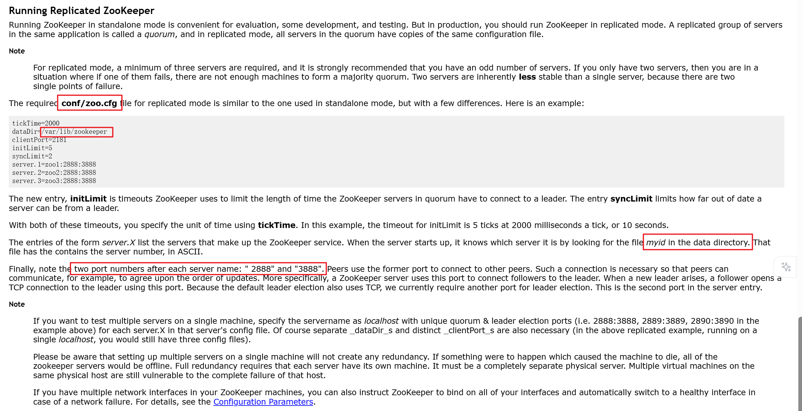

1. zookeeper 需要在 `conf/zoo.cfg` 中配置 `dataDir` 作为数据存储，并且在此文件夹中配置一个 `myid` 的文件作为标识符，标识自己在集群模式下到底属于哪台服务器

    这里根据之前的规划，选择 node1 node2 node3 节点作为 zookeeper 服务器

    并且将 `/opt/data/zookeeper` 作为 `dataDir`

    另外根据网络资料，`myid` 文件中的 id 只能在 `1 - 255` 之间

    `xcall node1 node2 node3 "cat /etc/hostname | awk '{print substr(\$1,5,6)}' > /opt/data/zookeeper/myid "`

    这个读取的是 node1 的数字然后放到 myid 中

1. zookeeper 的 `conf/zoo.cfg` 中需要配置好所有服务器的地址

    当前四节点为

    ```text
    dataDir=/opt/data/zookeeper
    server.1=node1:2888:3888
    server.2=node2:2888:3888
    server.3=node3:2888:3888
    server.4=node4:2888:3888
    server.5=node4:2888:3888
    ```

1. 启动 zookeeper

    `xcall node1 node2 node3 "/opt/module/apache-zookeeper-3.8.6-bin/bin/zkServer.sh start"`

    `xcall node1 node2 node3 "/opt/module/apache-zookeeper-3.8.6-bin/bin/zkServer.sh status"`

#### Hadoop HA

为了保证高可用性和权限隔离效果，Hadoop 在进行部署之前必须要划分权限来进行调整

这其中包括 HDFS 的权限以及 Yarn 的权限，生产环境下不建议直接配置 root

hadoop 推荐为不同用户配置不同权限，可以拆分为 hdfs、yarn，也可以一个 hadoop 走天下

所以推荐是创建一个用户组为 hadoop，另外分别创建 hdfs 和 yarn 用户，hdfs 和 yarn 用户都属于用户组 hadoop

这样做的好处是，可以根据 linux 的权限系统划分为当前人和当前用户组和其他人的读写执行操作

1. 下载 [hadoop 3.3.6](https://hadoop.apache.org/release/3.3.6.html)，解压缩到服务器上并且配置环境变量
1. 给定 hadoop env 环境变量 `$HADOOP_HOME/etc/hadoop/hadoop-env.sh`

    ```bash
    export JAVA_HOME=/opt/module/jdk1.8.0_202
    # Java 9+ 的一个启动参数，强制打开一个模块给外部访问，负责 WEB-UI 上看文件会报错，如果是使用 JDK8 那么就没问题了，注意 JDK8 不要用这个，会报错
    # export HADOOP_OPTS="$HADOOP_OPTS --add-opens java.base/java.lang=ALL-UNNAMED --add-opens java.base/java.util=ALL-UNNAMED --add-opens java.base/java.nio=ALL-UNNAMED"
    ```

1. 配置 hadoop 主要配置文件，配置 HA `$HADOOP_HOME/etc/hadoop`

    创建 hadoop 存储文件的目录，这里设置为 `/opt/data/hadoop/{hdfs,journal}`

    `core-site.xml`

    这一步需要注意，一些教程会配置 `hadoop.http.staticuser.user` 为 `root`，这个代表使用超级管理员去查看 WebUI，随意删除，这个不允许

    不配置 `hadoop.http.staticuser.user` 的话会使用匿名用户来进行查看，也就是无论谁来都不能修改

    <details>

    ```xml
    <configuration>
        <!-- 定义 HDFS 的逻辑名称 -->
        <property>
            <name>fs.defaultFS</name>
            <value>hdfs://hadoop</value>
        </property>

        <!-- 数据目录 给定之前准备好的目录，生产需要指定到独立磁盘 -->
        <property>
            <name>hadoop.tmp.dir</name>
            <value>/opt/data/hadoop/hdfs</value>
        </property>

        <!-- ZooKeeper 集群地址 给定之前配置 zookeeper 的节点 用于 HA 协调 -->
        <property>
            <name>ha.zookeeper.quorum</name>
            <value>node1:2181,node2:2181,node3:2181</value>
        </property>

        <!-- 开启 hdfs 的代理身份 -->
        <property>
            <name>hadoop.proxyuser.hdfs.hosts</name>
            <value>*</value>
        </property>
        <property>
            <name>hadoop.proxyuser.hdfs.groups</name>
            <value>*</value>
        </property>

        <!-- 开启回收站，保留 1 天 -->
        <property>
            <name>fs.trash.interval</name>
            <value>1440</value>
        </property>
    </configuration>
    ```

    </details>

    `hdfs-site.xml`

    这里注意，需要首先创建 hdfs 用户，给到密钥对，才能使用 `dfs.ha.fencing.ssh.private-key-files`

    <details>

    ```xml
    <configuration>
       <!-- 副本数 -->
       <property>
          <name>dfs.replication</name>
          <value>3</value>
       </property>

       <!-- 定义 Nameservice ID (需与 core-site.xml 中的 fs.defaultFS 对应) -->
       <property>
          <name>dfs.nameservices</name>
          <value>hadoop</value>
       </property>

       <!-- 定义两个 NameNode 的别名 (nn1, nn2) -->
       <property>
          <name>dfs.ha.namenodes.hadoop</name>
          <value>nn1,nn2</value>
       </property>

       <!-- nn 的 RPC 地址 -->
       <property>
          <name>dfs.namenode.rpc-address.hadoop.nn1</name>
          <value>node1:8020</value>
       </property>
       <property>
          <name>dfs.namenode.rpc-address.hadoop.nn2</name>
          <value>node2:8020</value>
       </property>

       <!-- NameNode 的 Web UI 地址 -->
       <property>
          <name>dfs.namenode.http-address.hadoop.nn1</name>
          <value>node1:9870</value>
       </property>
       <property>
          <name>dfs.namenode.http-address.hadoop.nn2</name>
          <value>node2:9870</value>
       </property>

       <!-- 集群 NameNode 元数据在 JournalNode 存放位置 目录 hadoop 为集群 id -->
       <property>
          <name>dfs.namenode.shared.edits.dir</name>
          <value>qjournal://node1:8485;node2:8485;node3:8485/hadoop</value>
       </property>
       <!-- NameNode 元数据在 JournalNode 的物理磁盘存放位置，生产需要指定独立磁盘 -->
       <property>
          <name>dfs.journalnode.edits.dir</name>
          <value>/opt/data/hadoop/journal</value>
       </property>

       <!-- 配置自动故障转移 -->
       <property>
          <name>dfs.ha.automatic-failover.enabled</name>
          <value>true</value>
       </property>

       <!-- 客户端故障转移代理 -->
       <property>
          <name>dfs.client.failover.proxy.provider.hadoop</name>
          <value>org.apache.hadoop.hdfs.server.namenode.ha.ConfiguredFailoverProxyProvider</value>
       </property>

       <!-- 
        使用 SSH 隔离防止 NameNode 脑裂
        shell 用于兜底（比如机器崩溃无法 ssh 过去的时候） 
        注意 sshfence 和 shell 都需要新启动一行，用于表示为一个列表
        arping 需要提前安装 iputils-arping 并且位置可能不同，需要谨慎，另外网络可能不同，需要修改
        意思是 arping 进行流量转发，将 target_host 的流量全都转移到自己身上来，这样可以防止脑裂
       -->
       <property>
          <name>dfs.ha.fencing.methods</name>
          <value>
    sshfence
    shell(/usr/bin/arping -D -c 3 -A ${target_host})
          </value>
       </property>
       <property>
          <name>dfs.ha.fencing.ssh.private-key-files</name>
          <value>/home/hdfs/.ssh/id_rsa</value>
       </property>
    </configuration>
    ```

    </details>

    `yarn-site.xml`

    <details>

    ```xml
    <configuration>
        <!-- 开启 YARN HA -->
        <property>
            <name>yarn.resourcemanager.ha.enabled</name>
            <value>true</value>
        </property>

        <!-- 定义 RM 集群 ID -->
        <property>
            <name>yarn.resourcemanager.cluster-id</name>
            <value>yarn-cluster</value>
        </property>

        <!-- 定义 RM 节点 ID -->
        <property>
            <name>yarn.resourcemanager.ha.rm-ids</name>
            <value>rm1,rm2</value>
        </property>

        <!-- 指定 RM 地址 -->
        <property>
            <name>yarn.resourcemanager.hostname.rm1</name>
            <value>node1</value>
        </property>
        <property>
            <name>yarn.resourcemanager.hostname.rm2</name>
            <value>node2</value>
        </property>

        <!-- 为 rm1 指定 Web UI 地址 -->
        <property>
            <name>yarn.resourcemanager.webapp.address.rm1</name>
            <value>node1:8088</value>
        </property>
        <property>
            <name>yarn.resourcemanager.webapp.https.address.rm1</name>
            <value>node1:8090</value>
        </property>

        <!-- 为 rm2 指定 Web UI 地址 -->
        <property>
            <name>yarn.resourcemanager.webapp.https.address.rm2</name>
            <value>node2:8090</value>
        </property>
        <property>
            <name>yarn.resourcemanager.webapp.address.rm2</name>
            <value>node2:8088</value>
        </property>

        <!-- 指定 ZK 地址 -->
        <property>
            <name>yarn.resourcemanager.zk-address</name>
            <value>node1:2181,node2:2181,node3:2181</value>
        </property>

        <!--启用自动恢复-->
        <property>
            <name>yarn.resourcemanager.recovery.enabled</name>
            <value>true</value>
        </property>

        <!--指定 resourcemanager 的状态信息存储在zookeeper集群-->
        <property>
            <name>yarn.resourcemanager.store.class</name>
            <value>org.apache.hadoop.yarn.server.resourcemanager.recovery.ZKRMStateStore</value>
        </property>

        <!-- 环境白名单 -->
        <property>
            <name>yarn.nodemanager.env-whitelist</name>
            <value>JAVA_HOME,HADOOP_COMMON_HOME,HADOOP_HDFS_HOME,HADOOP_CONF_DIR,CLASSPATH_PREPEND_DISTCACHE,HADOOP_YARN_HOME,HADOOP_MAPRED_HOME,HADOOP_HOME,PATH,LANG,TZ,FLINK_HOME</value>
        </property>

        <!-- 辅助服务：mapreduce_shuffle -->
        <property>
            <name>yarn.nodemanager.aux-services</name>
            <value>mapreduce_shuffle</value>
        </property>
        <property>
            <name>yarn.nodemanager.aux-services.mapreduce_shuffle.class</name>
            <value>org.apache.hadoop.mapred.ShuffleHandler</value>
        </property>

        <!-- 日志聚合存储 HDFS 路径 -->
        <property>
            <name>yarn.nodemanager.remote-app-log-dir</name>
            <value>/tmp/logs</value>
        </property>
    </configuration>
    ```

    </details>

    `mapred-site.xml`

    <details>

    ```xml
    <configuration>
        <!-- 指定 MapReduce 运行在 YARN 上 -->
        <property>
            <name>mapreduce.framework.name</name>
            <value>yarn</value>
        </property>

        <!-- 开启 MapReduce 的历史服务器 -->
        <property>
            <name>mapreduce.jobhistory.address</name>
            <value>node1:10020</value>
        </property>

        <!-- 历史服务器 Web UI 地址 -->
        <property>
            <name>mapreduce.jobhistory.webapp.address</name>
            <value>node1:19888</value>
        </property>

        <!-- 启用 Shuffle 服务（YARN 需要这个来混洗 Map 输出的数据） -->
        <property>
            <name>yarn.nodemanager.aux-services</name>
            <value>mapreduce_shuffle</value>
        </property>
    </configuration>
    ```

    </details>

1. 启动集群

    启动 zookeeper 集群 `xcall node1 node2 node3 "/opt/module/apache-zookeeper-3.8.6-bin/bin/zkServer.sh start"`

    在 node1、node2、node3 上启动 JournalNode `xcall node1 node2 node3 "$HADOOP_HOME/sbin/hadoop-daemon.sh start journalnode"` 格式化向 JournalNode 写入元数据

    node1 上格式化 NameNode: `hdfs namenode -format` 格式化会产生新的集群 ID，假如需要重新格式化一定要删除 data 和 logs 目录，格式化完成后查看存放数据的文件夹下是否有了 dfs 目录

    启动主 NameNode node1: `hadoop-daemon.sh start namenode`

    格式化从 NameNode node2: 将元数据同步 `hdfs namenode -bootstrapStandby`

    启动从 NameNode node2: `hadoop-daemon.sh start namenode`

    在其中一个 NameNode 中运行 `hdfs zkfc -formatZK` 来初始化

    停止已经启动的 dfs `stop-dfs.sh`

    全面启动 dfs `start-dfs.sh`

    启动 yarn `start-yarn.sh`

1. 验证认证

    `hdfs dfs -ls /`

    这个命令其实等同于先去寻找 zookeeper 谁是 active 节点，然后直接连上去执行

1. 一键启停脚本 `hadoop-ha-manage.sh`

    <details>

    ```bash
    #!/bin/bash
    
    # ================= 配置区域 =================
    # 主机名/ip
    NODE1="node1"
    NODE2="node2"
    NODE3="node3"
    NODE4="node4"
    NODE5="node5"
    
    # 角色分配
    NN_NODES=("$NODE1" "$NODE2")               # NameNode 节点
    JN_NODES=("$NODE1" "$NODE2" "$NODE3")      # JournalNode 节点（奇数个）
    ZK_NODES=("$NODE1" "$NODE2" "$NODE3")      # ZooKeeper 节点
    WORKER_NODES=("$NODE4" "$NODE5")           # DataNode / NodeManager
    HS_NODE="$NODE1"                           # MapReduce HistoryServer
    
    # ⚠️ 重要：必须与 hdfs-site.xml 中 dfs.ha.namenodes.<nameservice> 配置一致
    # 例如 nameservice 为 mycluster，则 nn1、nn2 的逻辑名称为 nn1、nn2
    NN1_HOST="$NODE1"
    NN1_ID="nn1"
    NN2_HOST="$NODE2"
    NN2_ID="nn2"
    
    # Hadoop 安装目录（通过环境变量获取）
    if [ -z "$HADOOP_HOME" ]; then
        source /etc/profile 2>/dev/null
        HADOOP_HOME=$HADOOP_HOME
    fi
    if [ -z "$HADOOP_HOME" ]; then
        echo "错误: 未找到 HADOOP_HOME 环境变量！"
        exit 1
    fi
    
    # 去重函数（用于状态检查等）
    unique_nodes() {
        printf "%s\n" "$@" | sort -u
    }
    
    # 颜色定义
    RED='\033[0;31m'
    GREEN='\033[0;32m'
    YELLOW='\033[1;33m'
    NC='\033[0m'
    
    # ================= 函数定义 =================
    print_msg()  { echo -e "${GREEN}[$1]${NC} $2"; }
    print_warn() { echo -e "${YELLOW}[$1]${NC} $2"; }
    print_error(){ echo -e "${RED}[$1]${NC} $2"; }
    
    # SSH 远程执行命令（自动加载环境变量）
    ssh_exec() {
        local node=$1
        local cmd=$2
        ssh -o StrictHostKeyChecking=no -o UserKnownHostsFile=/dev/null -o LogLevel=ERROR "$node" \
            "source /etc/profile 2>/dev/null; export JAVA_HOME=${JAVA_HOME}; export PATH=\$JAVA_HOME/bin:\$PATH; $cmd"
    }
    
    # ---------- 启动 ----------
    start_all() {
        print_msg "START" "========== 启动 Hadoop HA 集群 =========="
    
        # 1. ZooKeeper
        print_msg "ZK" "启动 ZooKeeper..."
        for node in "${ZK_NODES[@]}"; do
            ssh_exec "$node" "zkServer.sh start"
        done
        sleep 3
    
        # 2. JournalNode
        print_msg "JN" "启动 JournalNode..."
        for node in "${JN_NODES[@]}"; do
            ssh_exec "$node" "$HADOOP_HOME/bin/hdfs --daemon start journalnode"
        done
        sleep 2
    
        # 3. NameNode
        print_msg "NN" "启动 NameNode..."
        for node in "${NN_NODES[@]}"; do
            ssh_exec "$node" "$HADOOP_HOME/bin/hdfs --daemon start namenode"
        done
        sleep 2
    
        # 4. ZKFC
        print_msg "ZKFC" "启动 ZKFC..."
        for node in "${NN_NODES[@]}"; do
            ssh_exec "$node" "$HADOOP_HOME/bin/hdfs --daemon start zkfc"
        done
        sleep 2
    
        # 5. DataNode
        print_msg "WORKER" "启动 DataNode..."
        for node in "${WORKER_NODES[@]}"; do
            ssh_exec "$node" "$HADOOP_HOME/bin/hdfs --daemon start datanode"
        done
        sleep 2
    
        # 6. ResourceManager（先于 NodeManager）
        print_msg "RM" "启动 ResourceManager..."
        for node in "${NN_NODES[@]}"; do
            ssh_exec "$node" "$HADOOP_HOME/bin/yarn --daemon start resourcemanager"
        done
        sleep 2
    
        # 7. NodeManager
        print_msg "WORKER" "启动 NodeManager..."
        for node in "${WORKER_NODES[@]}"; do
            ssh_exec "$node" "$HADOOP_HOME/bin/yarn --daemon start nodemanager"
        done
        sleep 2
    
        # 8. MapReduce HistoryServer
        print_msg "HS" "启动 HistoryServer..."
        ssh_exec "$HS_NODE" "$HADOOP_HOME/bin/mapred --daemon start historyserver"
        sleep 2
    
        print_msg "DONE" "所有启动命令已发送，请执行 '$0 status' 检查状态。"
    }
    
    # ---------- 停止 ----------
    stop_all() {
        print_msg "STOP" "========== 关闭 Hadoop HA 集群 =========="
    
        # 1. ResourceManager
        print_msg "RM" "停止 ResourceManager..."
        for node in "${NN_NODES[@]}"; do
            ssh_exec "$node" "$HADOOP_HOME/bin/yarn --daemon stop resourcemanager"
        done
    
        # 2. NodeManager
        print_msg "NM" "停止 NodeManager..."
        for node in "${WORKER_NODES[@]}"; do
            ssh_exec "$node" "$HADOOP_HOME/bin/yarn --daemon stop nodemanager"
        done
    
        # 3. HistoryServer
        print_msg "HS" "停止 HistoryServer..."
        ssh_exec "$HS_NODE" "$HADOOP_HOME/bin/mapred --daemon stop historyserver"
    
        # 4. ZKFC（先于 NameNode 以避免误切换）
        print_msg "ZKFC" "停止 ZKFC..."
        for node in "${NN_NODES[@]}"; do
            ssh_exec "$node" "$HADOOP_HOME/bin/hdfs --daemon stop zkfc"
        done
    
        # 5. NameNode
        print_msg "NN" "停止 NameNode..."
        for node in "${NN_NODES[@]}"; do
            ssh_exec "$node" "$HADOOP_HOME/bin/hdfs --daemon stop namenode"
        done
    
        # 6. DataNode
        print_msg "DN" "停止 DataNode..."
        for node in "${WORKER_NODES[@]}"; do
            ssh_exec "$node" "$HADOOP_HOME/bin/hdfs --daemon stop datanode"
        done
    
        # 7. JournalNode
        print_msg "JN" "停止 JournalNode..."
        for node in "${JN_NODES[@]}"; do
            ssh_exec "$node" "$HADOOP_HOME/bin/hdfs --daemon stop journalnode"
        done
    
        # 8. ZooKeeper
        print_msg "ZK" "停止 ZooKeeper..."
        for node in "${ZK_NODES[@]}"; do
            ssh_exec "$node" "zkServer.sh stop"
        done
    
        print_msg "DONE" "所有停止命令已发送。"
    }
    
    # ---------- 状态 ----------
    check_status() {
        print_msg "STATUS" "========== 集群进程状态 =========="
    
        # 所有节点去重
        ALL_NODES=("${NN_NODES[@]}" "${JN_NODES[@]}" "${ZK_NODES[@]}" "${WORKER_NODES[@]}")
        mapfile -t UNIQUE_NODES < <(unique_nodes "${ALL_NODES[@]}")
    
        for node in "${UNIQUE_NODES[@]}"; do
            echo "----------------------------------------"
            print_msg "HOST" "$node"
            ssh_exec "$node" "jps 2>/dev/null | grep -E 'NameNode|DataNode|JournalNode|QuorumPeerMain|ResourceManager|NodeManager|DFSZKFailoverController' || echo '无相关 Java 进程'"
        done
        echo "----------------------------------------"
    
        # HA 状态（需要正确的 ids）
        print_msg "HA" "NameNode HA 状态:"
        ssh_exec "${NN1_HOST}" "$HADOOP_HOME/bin/hdfs haadmin -getServiceState $NN1_ID 2>/dev/null" || \
            print_error "NN" "无法获取 ${NN1_HOST} 的状态"
        ssh_exec "${NN2_HOST}" "$HADOOP_HOME/bin/hdfs haadmin -getServiceState $NN2_ID 2>/dev/null" || \
            print_error "NN" "无法获取 ${NN2_HOST} 的状态"
    }
    
    # ================= 主程序 =================
    case "$1" in
        start)   start_all     ;;
        stop)    stop_all      ;;
        status)  check_status  ;;
        restart) stop_all
                 sleep 5
                 start_all     ;;
        *)       echo "用法: $0 {start|stop|status|restart}"
                 exit 1        ;;
    esac
    ```

    </details>

1. 验证 HA 高可用

    需要注意，namenode 之前首先要 `ssh node` 一次，因为配置中是需要使用 ssh 进去另外的 node kill 进程的

    然后一定要安装 `sudo apt-get install -y psmisc` 里面包含了 Hadoop 的隔离机制依赖 Linux 的 fuser 或 killall

    第一次 ssh 会确认握手，添加到自己的 know_hosts 中，但是控制台不能自己输入，最终日志会表示 ssh 失败

    另外需要注意，id_rsa 是否能够有权限去读取，不要以其他用户去启动 hdfs，否则读取不到就会失败

    另外发现一个问题，密钥对 hadoop 对于新的格式 `BEGIN OPENSSH PRIVATE KEY` 读取不了，只能用老的密钥对 `BEGIN RSA PRIVATE KEY`

    所以密钥对生成应该使用 `ssh-keygen -t rsa -b 4096 -m PEM -f ~/.ssh/id_rsa` 命令，然后 `ssh-copy-id -i ~/.ssh/id_rsa.pub node` 到其他机器上

    而且权限必须是 600，如果是其他的就会拒绝读取

    首先进入网页可以查看 `Overview` 这一栏中，一个 node 应该展示 Active，另一个应该展示 Standby

    然后进入到 active 的那个 node 中，Jps 查看 namenode 的进程，然后 kill 掉，等待 10-20s 查看是否自动切换

1. 执行 mapreduce 验证 `hadoop jar $HADOOP_HOME/share/hadoop/mapreduce/hadoop-mapreduce-examples-*.jar pi 2 2`

#### Spark

1. 下载 spark，直接去[官网](https://spark.apache.org/downloads.html)下载，虽然我们之前说的是版本对应 3.4.2，但其实能和 hadoop 版本对应（即 3.3 版本）对应即可

    <details>

    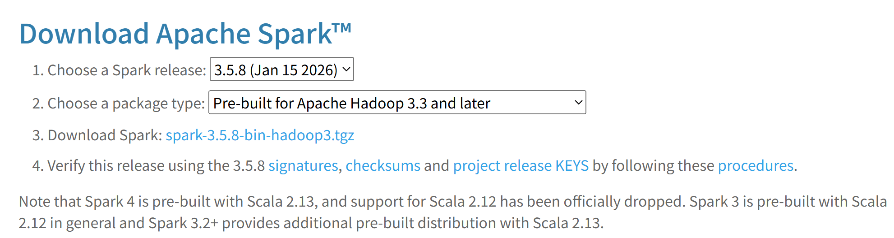

    </details>

    这里下载的是 3.5.8 [版本](https://dlcdn.apache.org/spark/spark-3.5.8/spark-3.5.8-bin-hadoop3.tgz)

1. 将 spark 解压到目录下，给出配置复制

    `$SPARK_HOME/conf/spark-env.sh`

    <details>

    ```bash
    # 指定 Hadoop 配置文件目录
    export HADOOP_CONF_DIR=/opt/module/hadoop-3.3.6/etc/hadoop
    export YARN_CONF_DIR=/opt/module/hadoop-3.3.6/etc/hadoop

    # 指定 Java 路径
    export JAVA_HOME=/opt/module/jdk1.8.0_202

    # 指定 Driver 内存，防止默认值太小
    export SPARK_DRIVER_MEMORY=2G
    ```

    `$SPARK_HOME/conf/spark-defaults.conf`

    ```conf
    # 运行模式
    spark.master yarn

    # 历史服务器配置
    # 让 Spark 把日志写到 HDFS 上，这样你可以在 Web UI 看到历史任务
    spark.eventLog.enabled true
    spark.eventLog.dir hdfs:///bigdata/spark/logs

    # kryo 序列化
    spark.serializer org.apache.spark.serializer.KryoSerializer

    # 内存管理，默认值为配置文件内容，命令行与代码中指定的优先级更高
    spark.driver.memory 2g
    spark.executor.memory 1g

    # hadoop 配置位置
    spark.yarn.dist.confDir /opt/module/hadoop-3.3.6/etc/hadoop

    # spark libs 包位置
    spark.yarn.jars hdfs:///bigdata/spark/libs/*
    ```

    </details>

    配置 `log4j2.properties` 可以将日志级别改为 `rootLogger.level = ERROR` 但是也可以为 `INFO` `WARN`，但是生产建议保留 `INFO` 用来排查问题

    HDFS 文件目录准备

    ```bash
    hdfs dfs -chown hdfs:hadoop /tmp
    hdfs dfs -chmod 755 /tmp
    hdfs dfs -chmod -R 755 /tmp
    hdfs dfs -chown -R hdfs:hadoop /tmp
    hdfs dfs -mkdir -p /bigdata/spark/logs
    hdfs dfs -chown -R hdfs:hadoop /bigdata
    hdfs dfs -chmod -R 755 /bigdata
    hdfs dfs -mkdir -p /bigdata/spark/libs
    hdfs dfs -put $SPARK_HOME/jars/* /bigdata/spark/libs
    ```

1. 执行命令运行

    ```bash
    spark-submit \
        --master yarn \
        --deploy-mode cluster \
        --class org.apache.spark.examples.SparkPi \
        $SPARK_HOME/examples/jars/spark-examples_2.12-3.5.8.jar \
    100
    ```

#### Hive

##### MySQL

要安装 Hive，首先需要安装关系型数据库做元数据

1. 更新 `sudo apt update`
1. 安装 MySQL 服务端 `sudo apt install -y mysql-server` 默认安装为最新版
1. 检查状态 `sudo systemctl status mysql`
1. 安全设置

    `sudo mysql -u root`

    修改 root 用户的认证方式为密码认证，并设置密码

    ```sql
    -- 修改 root 用户为密码认证，并给到密码
    ALTER USER 'root'@'localhost' IDENTIFIED WITH mysql_native_password BY 'Ab@123';
    FLUSH PRIVILEGES;
    ```

1. 创建 hive 专用用户

    ```sql
    -- 创建 Hive 元数据库
    CREATE DATABASE hive_metastore CHARACTER SET utf8mb4 COLLATE utf8mb4_general_ci;

    -- 创建 Hive 专用用户并授权
    -- 这里允许所有节点(%)连接，这样配置最方便
    CREATE USER 'hive'@'%' IDENTIFIED WITH mysql_native_password BY 'Ab@123';

    -- 授予该用户对 hive_metastore 库的所有权限
    GRANT ALL PRIVILEGES ON hive_metastore.* TO 'hive'@'%';

    --  刷新权限
    FLUSH PRIVILEGES;
    EXIT;
    ```

1. 配置远程访问

    配置文件 `/etc/mysql/mysql.conf.d/mysqld.cnf`

    注释掉绑定地址，令其监听所有 IP: `# bind-address = 127.0.0.1`

    重启 MYSQL 服务 `sudo systemctl restart mysql`

    配置测试链接

##### Hive Metastore && Hive Server 2

1. 下载 [hive](https://archive.apache.org/dist/hive/hive-3.1.3/apache-hive-3.1.3-bin.tar.gz)
1. 解压缩，配置环境变量
1. 将 MySQL [驱动包](https://repo1.maven.org/maven2/com/mysql/mysql-connector-j/8.0.33/mysql-connector-j-8.0.33.jar)复制到 `$HIVE_HOME/lib` 路径下，版本无所谓，MySQL 驱动包在高版本兼容低版本
1. 给 hive 准备文件

    ```bash
    hdfs dfs -mkdir -p /bigdata/hive/warehouse
    hdfs dfs -mkdir -p /bigdata/hive/scratchdir
    hdfs dfs -mkdir -p /bigdata/hive/resources

    hdfs dfs -chown -R hdfs:hadoop /bigdata
    hdfs dfs -chown -R hive:hadoop /bigdata/hive
    hdfs dfs -chmod -R 755 /bigdata

    sudo mkdir -p /tmp/hive/resources
    sudo mkdir -p /tmp/hive/scratchdir
    sudo chown -R hdfs:hadoop /tmp/hive
    ```

    准备新用户 hive:hadoop，此时不用，之后准备 Kerberos 认证的时候使用

    ```bash
    xcall all "sudo useradd -r -g hadoop -s /bin/bash hive"
    ```

1. `hive-site.xml` 设置

    <details>

    ```xml
    <configuration>
        <!-- 基础配置：HDFS 仓库目录 -->
        <property>
            <name>hive.metastore.warehouse.dir</name>
            <value>/bigdata/hive/warehouse</value>
        </property>

        <!-- 元数据库连接 (所有节点连同一个 MySQL) -->
        <property>
            <name>javax.jdo.option.ConnectionURL</name>
            <value>
                jdbc:mysql://node1:3306/hive_metastore?createDatabaseIfNotExist=true&amp;useSSL=false&amp;serverTimezone=Asia/Shanghai
            </value>
        </property>
        <property>
            <name>javax.jdo.option.ConnectionDriverName</name>
            <value>com.mysql.cj.jdbc.Driver</value>
        </property>
        <property>
            <name>javax.jdo.option.ConnectionUserName</name>
            <value>hive</value>
        </property>
        <property>
            <name>javax.jdo.option.ConnectionPassword</name>
            <value>Ab@123</value>
        </property>

        <!-- Metastore HA 配置 -->
        <!-- Hive Metastore 服务应该监听哪个地址 -->
        <property>
            <name>hive.metastore.uris</name>
            <value>thrift://node1:9083,thrift://node2:9083</value>
        </property>

        <!-- HiveServer2 HA 配置 (基于 ZooKeeper) -->
        <!-- HiveServer2 监听的主机地址 -->
        <property>
            <name>hive.server2.thrift.bind.host</name>
            <value>0.0.0.0</value>
        </property>
        <!-- HiveServer2 监听的端口 -->
        <property>
            <name>hive.server2.thrift.port</name>
            <value>10000</value>
        </property>
        <!-- 开启 HS2 的 ZooKeeper 注册 -->
        <property>
            <name>hive.server2.support.dynamic.service.discovery</name>
            <value>true</value>
        </property>
        <!-- 配置 ZooKeeper 命名空间 -->
        <!-- 所有 HS2 实例会在 ZK 的这个目录下注册临时节点 -->
        <property>
            <name>hive.zookeeper.namespace</name>
            <value>hiveserver2</value>
        </property>
        <!-- 指定 ZooKeeper 集群 -->
        <property>
            <name>hive.zookeeper.quorum</name>
            <value>node1:2181,node2:2181,node3:2181</value>
        </property>
        <!-- ZooKeeper 命名空间 -->
        <property>
            <name>hive.zookeeper.client.port</name>
            <value>2181</value>
        </property>

        <!-- Java 虚拟机临时目录，本地磁盘 -->
        <property>
            <name>java.io.tmpdir</name>
            <value>/tmp/hive</value>
        </property>
        <!-- Hive 临时使用的 Hadoop 地址，尝试使用过 hdfs，但是它直接读取了本地文件目录，很离谱，所以直接采用本地系统得了 -->
        <property>
            <name>hive.exec.scratchdir</name>
            <value>/tmp/hive/scratchdir</value>
        </property>
        <!-- Hive 存放资源文件的 Hadoop 地址 -->
        <property>
            <name>hive.downloaded.resources.dir</name>
            <value>/tmp/hive/resources</value>
        </property>

        <!-- 认证方式：待添加 KERBEROS 认证 -->
        <property>
            <name>hive.server2.authentication</name>
            <value>NONE</value>
        </property>
        <!-- 直接禁用掉 hive 本身安全认证，之后直接上 kerberos -->
        <property>
            <name>hive.security.authorization.enabled</name>
            <value>false</value>
        </property>
        <property>
            <name>hive.security.authorization.createtable.owner.grants</name>
            <value>ALL</value>
        </property>

        <!-- 开启并发支持（多会话），查询时以用户身份执行 -->
        <property>
            <name>hive.server2.enable.doAs</name>
            <value>true</value>
        </property>
        <!-- 开启多线程模式（提高并发性能） -->
        <property>
            <name>hive.server2.thrift.max.worker.threads</name>
            <value>500</value>
        </property>
        <!-- 直接关掉 hive 的轮询功能，因为 HS2 启动时会强制初始化 NotificationEventPoll，如果初始化失败，HS2 就直接报错退出，这个未来版本的功能直接禁用也没问题，HA 不受影响-->
        <property>
            <name>hive.metastore.event.db.notification.api.auth</name>
            <value>false</value>
        </property>
        <property>
            <name>hive.metastore.notifications</name>
            <value>false</value>
        </property>

        <!-- 执行引擎改为 spark -->
        <property>
            <name>hive.execution.engine</name>
            <value>spark</value>
        </property>
        <property>
            <name>spark.home</name>
            <value>/opt/module/spark-3.5.8-bin-hadoop3</value>
        </property>
        <property>
            <name>spark.master</name>
            <value>yarn</value>
        </property>
        <property>
            <name>spark.submit.deployMode</name>
            <value>client</value>
        </property>
        <property>
            <name>spark.yarn.jars</name>
            <value>hdfs://hadoop/bigdata/spark/lib/*</value>
        </property>
        <property>
            <name>spark.executor.memory</name>
            <value>2g</value>
        </property>
        <property>
            <name>spark.executor.cores</name>
            <value>2</value>
        </property>

        <!-- 打印表头 -->
        <property>
            <name>hive.cli.print.header</name>
            <value>true</value>
        </property>
        <!-- 打印库名称 -->
        <property>
            <name>hive.cli.print.current.db</name>
            <value>true</value>
        </property>

    </configuration>
    ```

    </details>

1. hive 到 hadoop 的软链接

    hive 直接复用 hadoop 的配置文件即可

    ```bash
    cd $HIVE_HOME/conf
    ln -s $HADOOP_HOME/etc/hadoop/core-site.xml $HIVE_HOME/conf/core-site.xml
    ln -s $HADOOP_HOME/etc/hadoop/hdfs-site.xml $HIVE_HOME/conf/hdfs-site.xml
    ln -s $HADOOP_HOME/etc/hadoop/yarn-site.xml $HIVE_HOME/conf/yarn-site.xml
    ```

    配置 `hive-env.sh`

    ```bash
    export HADOOP_HOME=/opt/module/hadoop-3.3.6
    export HIVE_CONF_DIR=/opt/module/apache-hive-3.1.3-bin/conf
    export HIVE_AUX_JARS_PATH=/opt/module/apache-hive-3.1.3-bin/lib
    ```

1. hive 与 hadoop 的包冲突问题

    hadoop 和 hive 以来的 guava 包版本不同，直接删掉 hadoop 用 hive 的

    ```bash
    rm $HIVE_HOME/lib/guava-*.jar
    cp $HADOOP_HOME/share/hadoop/common/lib/guava-*.jar $HIVE_HOME/lib/
    ```

1. 分发，并且给 hive 文件夹授权

    ```bash
    xsync all apache-hive-3.1.3-bin
    sudo xcall all "chown hdfs:hadoop -R /opt/module/apache-hive-3.1.3-bin/"
    sudo xcall all "sudo chmod 755 -R /opt/module/apache-hive-3.1.3-bin/"
    ```

1. 初始化 hive，注意，只需要在一个节点（管理节点）上执行当前命令 `schematool -dbType mysql -initSchema` 如果是升级则使用 `schematool -dbType mysql -upgradeSchema`

1. 新的群启集群脚本

    <details>

    ```bash
    #!/bin/bash
    
    # ======================== 集群配置（按实际情况修改） ========================
    NODE1="node1"
    NODE2="node2"
    NODE3="node3"
    NODE4="node4"
    NODE5="node5"
    
    # Hadoop 角色
    NN_NODES=("$NODE1" "$NODE2")            # NameNode 节点
    JN_NODES=("$NODE1" "$NODE2" "$NODE3")   # JournalNode 节点
    ZK_NODES=("$NODE1" "$NODE2" "$NODE3")   # ZooKeeper 节点
    DN_NODES=("$NODE4" "$NODE5")            # DataNode 节点
    NM_NODES=("$NODE4" "$NODE5")            # NodeManager 节点
    RM_NODES=("$NODE1" "$NODE2")            # ResourceManager 节点
    HS_NODE="$NODE1"                        # MapReduce JobHistoryServer
    
    # NameNode 逻辑名称（必须与 hdfs-site.xml 一致）
    NN1_HOST="$NODE1"
    NN1_ID="nn1"
    NN2_HOST="$NODE2"
    NN2_ID="nn2"
    
    # Hive 角色
    METASTORE_NODES=("$NODE1" "$NODE2")
    HS2_NODES=("$NODE1" "$NODE2")

    # 颜色
    RED='\033[0;31m'
    GREEN='\033[0;32m'
    YELLOW='\033[1;33m'
    NC='\033[0m'
    
    print_msg()  { echo -e "${GREEN}[$1]${NC} $2"; }
    print_warn() { echo -e "${YELLOW}[$1]${NC} $2"; }
    print_error(){ echo -e "${RED}[$1]${NC} $2"; }
    
    # SSH 执行（source /etc/profile 获取环境变量）
    ssh_exec() {
        local node=$1; shift
        ssh -o StrictHostKeyChecking=no -o UserKnownHostsFile=/dev/null -o LogLevel=ERROR "$node" "
            source /etc/profile 2>/dev/null
            $*
        "
    }
    
    # ======================== ZooKeeper ========================
    start_zookeeper() {
        print_msg "ZK" "启动 ZooKeeper..."
        for node in "${ZK_NODES[@]}"; do
            ssh_exec "$node" "
                if [ -n \"\$ZOOKEEPER_HOME\" ]; then
                    \$ZOOKEEPER_HOME/bin/zkServer.sh start
                else
                    zkServer.sh start
                fi
            "
        done
        sleep 2
        print_msg "ZK" "ZooKeeper 启动完成"
    }
    
    stop_zookeeper() {
        print_msg "ZK" "停止 ZooKeeper..."
        for node in "${ZK_NODES[@]}"; do
            ssh_exec "$node" "
                if [ -n \"\$ZOOKEEPER_HOME\" ]; then
                    \$ZOOKEEPER_HOME/bin/zkServer.sh stop
                else
                    zkServer.sh stop
                fi
            "
        done
        print_msg "ZK" "ZooKeeper 已停止"
    }
    
    # ======================== HDFS ========================
    start_hdfs() {
        print_msg "HDFS" "启动 HDFS 组件..."
        print_msg "JN" "启动 JournalNode..."
        for node in "${JN_NODES[@]}"; do
            ssh_exec "$node" "\$HADOOP_HOME/bin/hdfs --daemon start journalnode"
        done
        sleep 2
    
        print_msg "NN" "启动 NameNode..."
        for node in "${NN_NODES[@]}"; do
            ssh_exec "$node" "\$HADOOP_HOME/bin/hdfs --daemon start namenode"
        done
        sleep 2
    
        print_msg "ZKFC" "启动 ZKFC..."
        for node in "${NN_NODES[@]}"; do
            ssh_exec "$node" "\$HADOOP_HOME/bin/hdfs --daemon start zkfc"
        done
        sleep 2
    
        print_msg "DN" "启动 DataNode..."
        for node in "${DN_NODES[@]}"; do
            ssh_exec "$node" "\$HADOOP_HOME/bin/hdfs --daemon start datanode"
        done
        sleep 2
    
        print_msg "HDFS" "HDFS 组件启动完成"
    }
    
    stop_hdfs() {
        print_msg "HDFS" "停止 HDFS 组件..."
        print_msg "ZKFC" "停止 ZKFC..."
        for node in "${NN_NODES[@]}"; do
            ssh_exec "$node" "\$HADOOP_HOME/bin/hdfs --daemon stop zkfc"
        done
    
        print_msg "NN" "停止 NameNode..."
        for node in "${NN_NODES[@]}"; do
            ssh_exec "$node" "\$HADOOP_HOME/bin/hdfs --daemon stop namenode"
        done
    
        print_msg "DN" "停止 DataNode..."
        for node in "${DN_NODES[@]}"; do
            ssh_exec "$node" "\$HADOOP_HOME/bin/hdfs --daemon stop datanode"
        done
    
        print_msg "JN" "停止 JournalNode..."
        for node in "${JN_NODES[@]}"; do
            ssh_exec "$node" "\$HADOOP_HOME/bin/hdfs --daemon stop journalnode"
        done
    
        print_msg "HDFS" "HDFS 组件已停止"
    }
    
    # ======================== YARN ========================
    start_yarn() {
        print_msg "YARN" "启动 YARN 组件..."
        print_msg "RM" "启动 ResourceManager..."
        for node in "${RM_NODES[@]}"; do
            ssh_exec "$node" "\$HADOOP_HOME/bin/yarn --daemon start resourcemanager"
        done
        sleep 2
    
        print_msg "NM" "启动 NodeManager..."
        for node in "${NM_NODES[@]}"; do
            ssh_exec "$node" "\$HADOOP_HOME/bin/yarn --daemon start nodemanager"
        done
        sleep 2
        print_msg "YARN" "YARN 组件启动完成"
    }
    
    stop_yarn() {
        print_msg "YARN" "停止 YARN 组件..."
        print_msg "RM" "停止 ResourceManager..."
        for node in "${RM_NODES[@]}"; do
            ssh_exec "$node" "\$HADOOP_HOME/bin/yarn --daemon stop resourcemanager"
        done
    
        print_msg "NM" "停止 NodeManager..."
        for node in "${NM_NODES[@]}"; do
            ssh_exec "$node" "\$HADOOP_HOME/bin/yarn --daemon stop nodemanager"
        done
        print_msg "YARN" "YARN 组件已停止"
    }
    
    # ======================== MapReduce HistoryServer ========================
    start_historyserver() {
        print_msg "HS" "启动 HistoryServer..."
        ssh_exec "$HS_NODE" "\$HADOOP_HOME/bin/mapred --daemon start historyserver"
        print_msg "HS" "HistoryServer 启动完成"
    }
    
    stop_historyserver() {
        print_msg "HS" "停止 HistoryServer..."
        ssh_exec "$HS_NODE" "\$HADOOP_HOME/bin/mapred --daemon stop historyserver"
        print_msg "HS" "HistoryServer 已停止"
    }
    
    # ======================== Hive ========================
    start_metastore() {
        print_msg "METASTORE" "启动 Metastore..."
        for node in "${METASTORE_NODES[@]}"; do
            ssh_exec "$node" "nohup \$HIVE_HOME/bin/hive --service metastore >/dev/null 2>&1 &"
        done
        sleep 4
        print_msg "METASTORE" "Metastore 启动完成"
    }
    
    stop_metastore() {
        print_msg "METASTORE" "停止 Metastore..."
        for node in "${METASTORE_NODES[@]}"; do
            ssh_exec "$node" "pkill -f 'org.apache.hadoop.hive.metastore.HiveMetaStore'"
        done
        print_msg "METASTORE" "Metastore 已停止"
    }
    
    start_hiveserver2() {
        print_msg "HS2" "启动 HiveServer2..."
        for node in "${HS2_NODES[@]}"; do
            ssh_exec "$node" "nohup \$HIVE_HOME/bin/hive --service hiveserver2 >/dev/null 2>&1 &"
        done
        sleep 4
        print_msg "HS2" "HiveServer2 启动完成"
    }
    
    stop_hiveserver2() {
        print_msg "HS2" "停止 HiveServer2..."
        for node in "${HS2_NODES[@]}"; do
            ssh_exec "$node" "pkill -f 'org.apache.hive.service.server.HiveServer2'"
        done
        print_msg "HS2" "HiveServer2 已停止"
    }

    # ======================== 全局启停 ========================
    start_all() {
        start_zookeeper
        start_hdfs
        start_yarn
        start_historyserver
        start_metastore
        start_hiveserver2
        print_msg "ALL" "全部服务已启动"
    }
    
    stop_all() {
        stop_hiveserver2
        stop_metastore
        stop_historyserver
        stop_yarn
        stop_hdfs
        stop_zookeeper
        print_msg "ALL" "全部服务已停止"
    }
    
    # ======================== 状态检查（按节点展示，无重复）======================
    check_status() {
        echo -e "${GREEN}==================== 集群状态 ====================${NC}"
    
        # --- ZooKeeper ---
        print_msg "ZK" "ZooKeeper:"
        echo -e "${ZK_NODES[@]}"
        for node in "${ZK_NODES[@]}"; do
            out=$(ssh_exec "$node" "jps 2>/dev/null | grep QuorumPeerMain")
            if [ -n "$out" ]; then
                echo -e "  $node : ${GREEN}$out${NC}"
            else
                echo -e "  $node : ${RED}未运行${NC}"
            fi
        done
    
        # --- HDFS（去重节点，一次列出该节点所有HDFS进程）---
        print_msg "HDFS" "HDFS 进程:"
        # 生成去重节点列表
        all_hdfs_nodes=($(printf "%s\n" "${NN_NODES[@]}" "${JN_NODES[@]}" "${DN_NODES[@]}" | sort -u))
        echo -e "${all_hdfs_nodes[@]}"
        for node in "${all_hdfs_nodes[@]}"; do
            out=$(ssh_exec "$node" "jps 2>/dev/null | grep -E 'NameNode|DataNode|JournalNode|DFSZKFailoverController'")
            if [ -n "$out" ]; then
                echo -e "  ${GREEN}$node${NC}:"
                echo "$out" | while read line; do echo -e "    ${GREEN}$line${NC}"; done
            else
                echo -e "  ${RED}$node${NC}: 无 HDFS 进程"
            fi
        done
    
        # HA 状态
        print_msg "HA" "NameNode HA 状态:"
        nn1_state=$(ssh_exec "${NN1_HOST}" "\$HADOOP_HOME/bin/hdfs haadmin -getServiceState $NN1_ID 2>/dev/null")
        nn2_state=$(ssh_exec "${NN2_HOST}" "\$HADOOP_HOME/bin/hdfs haadmin -getServiceState $NN2_ID 2>/dev/null")
        if [ "$nn1_state" == "active" ]; then
            echo -e "  $NN1_HOST ($NN1_ID) : ${GREEN}active${NC}"
            echo -e "  $NN2_HOST ($NN2_ID) : ${YELLOW}standby${NC}"
        elif [ "$nn2_state" == "active" ]; then
            echo -e "  $NN1_HOST ($NN1_ID) : ${YELLOW}standby${NC}"
            echo -e "  $NN2_HOST ($NN2_ID) : ${GREEN}active${NC}"
        else
            echo -e "  ${RED}无法获取 HA 状态（集群可能未初始化）${NC}"
        fi
    
        # --- YARN（去重节点，一次列出该节点所有YARN进程）---
        print_msg "YARN" "YARN 进程:"
        all_yarn_nodes=($(printf "%s\n" "${RM_NODES[@]}" "${NM_NODES[@]}" | sort -u))
        echo -e "${all_yarn_nodes[@]}"
        for node in "${all_yarn_nodes[@]}"; do
            out=$(ssh_exec "$node" "jps 2>/dev/null | grep -E 'ResourceManager|NodeManager'")
            if [ -n "$out" ]; then
                echo -e "  ${GREEN}$node${NC}:"
                echo "$out" | while read line; do echo -e "    ${GREEN}$line${NC}"; done
            else
                echo -e "  ${RED}$node${NC}: 无 YARN 进程"
            fi
        done
    
        # --- MapReduce HistoryServer ---
        print_msg "HS" "MapReduce HistoryServer:"
        out=$(ssh_exec "$HS_NODE" "jps 2>/dev/null | grep JobHistoryServer")
        if [ -n "$out" ]; then
            echo -e "  $HS_NODE : ${GREEN}$out${NC}"
        else
            echo -e "  $HS_NODE : ${RED}未运行${NC}"
        fi
    
        # --- Hive Metastore（ps 检查）---
        print_msg "META" "Hive Metastore:"
        echo -e "${METASTORE_NODES[@]}"
        for node in "${METASTORE_NODES[@]}"; do
            out=$(ssh_exec "$node" "ps -ef | grep -v grep | grep 'org.apache.hadoop.hive.metastore.HiveMetaStore'")
            if [ -n "$out" ]; then
                echo -e "  $node : ${GREEN}运行中${NC}"
            else
                echo -e "  $node : ${RED}未运行${NC}"
            fi
        done

        # --- HiveServer2（ps 检查）---
        print_msg "HS2" "HiveServer2:"
        echo -e "${HS2_NODES[@]}"
        for node in "${HS2_NODES[@]}"; do
            out=$(ssh_exec "$node" "ps -ef | grep -v grep | grep 'org.apache.hive.service.server.HiveServer2'")
            if [ -n "$out" ]; then
                echo -e "  $node : ${GREEN}运行中${NC}"
            else
                echo -e "  $node : ${RED}未运行${NC}"
            fi
        done
    
        echo -e "${GREEN}===================================================${NC}"
    }
    
    # ======================== 命令入口 ========================
    case "$1" in
        start-zookeeper)    start_zookeeper    ;;
        stop-zookeeper)     stop_zookeeper     ;;
        start-hdfs)         start_hdfs         ;;
        stop-hdfs)          stop_hdfs          ;;
        start-yarn)         start_yarn         ;;
        stop-yarn)          stop_yarn          ;;
        start-historyserver) start_historyserver ;;
        stop-historyserver)  stop_historyserver  ;;
        start-metastore)    start_metastore    ;;
        stop-metastore)     stop_metastore     ;;
        start-hiveserver2)  start_hiveserver2  ;;
        stop-hiveserver2)   stop_hiveserver2   ;;
        start-all)          start_all          ;;
        stop-all)           stop_all           ;;
        restart-all)        stop_all; sleep 3; start_all ;;
        status)             check_status       ;;
        *)
            echo "用法: $0 <命令>"
            echo "  分组件启停:"
            echo "    start-zookeeper | stop-zookeeper"
            echo "    start-hdfs | stop-hdfs"
            echo "    start-yarn | stop-yarn"
            echo "    start-historyserver | stop-historyserver"
            echo "    start-metastore | stop-metastore"
            echo "    start-hiveserver2 | stop-hiveserver2"
            echo "  全局管理:"
            echo "    start-all | stop-all | restart-all"
            echo "    status"
            exit 1
            ;;
    esac
    ```

    </details>

1. 完成后，测试能否链接 beeline `beeline -u "jdbc:hive2://node1:2181,node2:2181,node3:2181/;serviceDiscoveryMode=zooKeeper;zooKeeperNamespace=hiveserver2" -n hdfs`
1. 如果成功，那么需要解决另一个问题，即在 datagrip 外界链接时的高可用

    因为 datagrip 等无法识别 zookeeper 串，所以需要在服务器增加流量控制

    ```bash
    sudo apt update
    sudo apt install -y haproxy
    sudo cp /etc/haproxy/haproxy.cfg /etc/haproxy/haproxy.cfg.bak
    ```

    ```bash
    sudo tee /etc/haproxy/haproxy.cfg << 'EOF'
    global
        log /dev/log local0
        maxconn 4000

    defaults
        log global
        mode tcp
        timeout connect 5s
        timeout client 30s
        timeout server 30s

    frontend hive_front
        bind *:10001
        default_backend hive_back

    backend hive_back
        balance roundrobin
        server node1 192.168.100.131:10000 check
        server node2 192.168.100.132:10000 check
    EOF
    ```

    ```bash
    sudo systemctl enable haproxy
    sudo systemctl restart haproxy
    sudo netstat -tlnp | grep 10001
    ```

    在 datagrip 中使用连接串 `jdbc:hive2://192.168.100.131:10001/default;user=hdfs`

    使用这种方式之后，插入暂时不可用，因为还没做完

    另外，namenode 的 webui 也能用这种方式

    ```bash
    # NameNode Web UI 统一入口
    frontend namenode_web
        bind *:9871
        default_backend nn_web_servers

    backend nn_web_servers
        balance roundrobin
        server node1 192.168.100.131:9870 check
        server node2 192.168.100.132:9870 check
    ```

    完成后重启 `sudo systemctl restart haproxy`

##### Spark On Hive

Hive On Spark 和 Spark On Hive 是两套完全不同的方案

在 Hive On Spark 中，hive 是入口，spark 只是执行引擎，使用的方言是 HQL，编程入口是 beeline，而且只能跑 SQL

但是 Spark On Hive 来说，hive 只是它的元数据入口，执行的是 Spark SQL，入口包括 spark-sql、spark-shell、pyspark、Scala/Java API，可以混合 SQL + DataFrame + MLlib + Streaming

在 Spark On Hive 中，根本用不到 hiveserver2，直接使用 spark thrift server

1. 修改 `$SPARK_HOME/conf/spark-defaults.conf`，替换为下面配置

    ```bash
    # spark.eventLog.dir               hdfs://namenode:8021/directory
    spark.serializer                 org.apache.spark.serializer.KryoSerializer

    # 内存（Thrift Server 场景建议调大）
    # 动态内存分配
    spark.dynamicAllocation.enabled              true

    # 必须有 External Shuffle Service（让 Executor 退出时不丢数据）
    spark.shuffle.service.enabled                true

    # 设置 Executor 数量的上下边界
    spark.dynamicAllocation.minExecutors         1
    spark.dynamicAllocation.maxExecutors         10

    # 闲置多久后回收 Executor
    spark.dynamicAllocation.executorIdleTimeout         60s

    # 有多少任务积压时申请新 Executor
    spark.dynamicAllocation.schedulerBacklogTimeout     1s

    # Hadoop 配置位置
    spark.yarn.dist.confDir          /opt/module/hadoop-3.3.6/etc/hadoop

    # Spark 与 Hive 集成
    spark.sql.catalogImplementation  hive

    # SQL 自适应执行（可根据数据量自动优化，动态合并小分区、切换 JOIN 策略、优化倾斜 JOIN）
    spark.sql.adaptive.enabled               true
    spark.sql.adaptive.coalescePartitions.enabled  true

    # 使用钨丝计划提升计算效率，绕过 JVM 低效机制，直接操纵内存
    spark.sql.tungsten.enabled               true

    # 关闭推测执行避免重复计算，测试资源紧张关闭，若任务跑的特别慢，spark 会在另一个节点再启动一个完全相同副本跑
    spark.speculation                false

    # 并行度设置（根据集群总核心数调整，公式：集群总核数 * 2~3）
    spark.default.parallelism         8
    spark.sql.shuffle.partitions      8
    ```

1. 做 `hive-site.xml` 与 spark 的软连接 `ln -sf $HIVE_HOME/conf/hive-site.xml $SPARK_HOME/conf/hive-site.xml` 至于 hive-site 的配置不需要做修改
1. 新的集群脚本，删除了 hiveserver2 增加了 spark 组件

    <details>

    ```bash
    #!/bin/bash
    
    # ======================== 集群配置（按实际情况修改） ========================
    NODE1="node1"
    NODE2="node2"
    NODE3="node3"
    NODE4="node4"
    NODE5="node5"
    
    # Hadoop 角色
    NN_NODES=("$NODE1" "$NODE2")            # NameNode 节点
    JN_NODES=("$NODE1" "$NODE2" "$NODE3")   # JournalNode 节点
    ZK_NODES=("$NODE1" "$NODE2" "$NODE3")   # ZooKeeper 节点
    DN_NODES=("$NODE4" "$NODE5")            # DataNode 节点
    NM_NODES=("$NODE4" "$NODE5")            # NodeManager 节点
    RM_NODES=("$NODE1" "$NODE2")            # ResourceManager 节点
    HS_NODE="$NODE1"                        # MapReduce JobHistoryServer 节点
    
    # Spark 角色
    SPARK_MASTER_NODE="$NODE1"              # Spark Master 节点（单点，可按需扩展）
    SPARK_WORKER_NODES=("$NODE4" "$NODE5") # Spark Worker 节点
    SPARK_THRIFT_SERVER_NODES=("$NODE1" "$NODE2") # Spark Thrift Server 节点
    
    # NameNode 逻辑名称（必须与 hdfs-site.xml 一致）
    NN1_HOST="$NODE1"
    NN1_ID="nn1"
    NN2_HOST="$NODE2"
    NN2_ID="nn2"
    
    # Hive 角色
    METASTORE_NODES=("$NODE1" "$NODE2")
    
    # 颜色
    RED='\033[0;31m'
    GREEN='\033[0;32m'
    YELLOW='\033[1;33m'
    NC='\033[0m'
    
    print_msg()  { echo -e "${GREEN}[$1]${NC} $2"; }
    print_warn() { echo -e "${YELLOW}[$1]${NC} $2"; }
    print_error(){ echo -e "${RED}[$1]${NC} $2"; }
    
    # SSH 执行（source /etc/profile 获取环境变量）
    ssh_exec() {
        local node=$1; shift
        ssh -o StrictHostKeyChecking=no -o UserKnownHostsFile=/dev/null -o LogLevel=ERROR "$node" "
            source /etc/profile 2>/dev/null
            $*
        "
    }
    
    # ======================== ZooKeeper ========================
    start_zookeeper() {
        print_msg "ZK" "启动 ZooKeeper..."
        for node in "${ZK_NODES[@]}"; do
            ssh_exec "$node" "
                if [ -n \"\$ZOOKEEPER_HOME\" ]; then
                    \$ZOOKEEPER_HOME/bin/zkServer.sh start
                else
                    zkServer.sh start
                fi
            "
        done
        sleep 2
        print_msg "ZK" "ZooKeeper 启动完成"
    }
    
    stop_zookeeper() {
        print_msg "ZK" "停止 ZooKeeper..."
        for node in "${ZK_NODES[@]}"; do
            ssh_exec "$node" "
                if [ -n \"\$ZOOKEEPER_HOME\" ]; then
                    \$ZOOKEEPER_HOME/bin/zkServer.sh stop
                else
                    zkServer.sh stop
                fi
            "
        done
        print_msg "ZK" "ZooKeeper 已停止"
    }
    
    # ======================== HDFS ========================
    start_hdfs() {
        print_msg "HDFS" "启动 HDFS 组件..."
        print_msg "JN" "启动 JournalNode..."
        for node in "${JN_NODES[@]}"; do
            ssh_exec "$node" "\$HADOOP_HOME/bin/hdfs --daemon start journalnode"
        done
        sleep 2
    
        print_msg "NN" "启动 NameNode..."
        for node in "${NN_NODES[@]}"; do
            ssh_exec "$node" "\$HADOOP_HOME/bin/hdfs --daemon start namenode"
        done
        sleep 2
    
        print_msg "ZKFC" "启动 ZKFC..."
        for node in "${NN_NODES[@]}"; do
            ssh_exec "$node" "\$HADOOP_HOME/bin/hdfs --daemon start zkfc"
        done
        sleep 2
    
        print_msg "DN" "启动 DataNode..."
        for node in "${DN_NODES[@]}"; do
            ssh_exec "$node" "\$HADOOP_HOME/bin/hdfs --daemon start datanode"
        done
        sleep 2
    
        print_msg "HDFS" "HDFS 组件启动完成"
    }
    
    stop_hdfs() {
        print_msg "HDFS" "停止 HDFS 组件..."
        print_msg "ZKFC" "停止 ZKFC..."
        for node in "${NN_NODES[@]}"; do
            ssh_exec "$node" "\$HADOOP_HOME/bin/hdfs --daemon stop zkfc"
        done
    
        print_msg "NN" "停止 NameNode..."
        for node in "${NN_NODES[@]}"; do
            ssh_exec "$node" "\$HADOOP_HOME/bin/hdfs --daemon stop namenode"
        done
    
        print_msg "DN" "停止 DataNode..."
        for node in "${DN_NODES[@]}"; do
            ssh_exec "$node" "\$HADOOP_HOME/bin/hdfs --daemon stop datanode"
        done
    
        print_msg "JN" "停止 JournalNode..."
        for node in "${JN_NODES[@]}"; do
            ssh_exec "$node" "\$HADOOP_HOME/bin/hdfs --daemon stop journalnode"
        done
    
        print_msg "HDFS" "HDFS 组件已停止"
    }
    
    # ======================== YARN ========================
    start_yarn() {
        print_msg "YARN" "启动 YARN 组件..."
        print_msg "RM" "启动 ResourceManager..."
        for node in "${RM_NODES[@]}"; do
            ssh_exec "$node" "\$HADOOP_HOME/bin/yarn --daemon start resourcemanager"
        done
        sleep 2
    
        print_msg "NM" "启动 NodeManager..."
        for node in "${NM_NODES[@]}"; do
            ssh_exec "$node" "\$HADOOP_HOME/bin/yarn --daemon start nodemanager"
        done
        sleep 2
        print_msg "YARN" "YARN 组件启动完成"
    }
    
    stop_yarn() {
        print_msg "YARN" "停止 YARN 组件..."
        print_msg "RM" "停止 ResourceManager..."
        for node in "${RM_NODES[@]}"; do
            ssh_exec "$node" "\$HADOOP_HOME/bin/yarn --daemon stop resourcemanager"
        done
    
        print_msg "NM" "停止 NodeManager..."
        for node in "${NM_NODES[@]}"; do
            ssh_exec "$node" "\$HADOOP_HOME/bin/yarn --daemon stop nodemanager"
        done
        print_msg "YARN" "YARN 组件已停止"
    }
    
    # ======================== MapReduce HistoryServer ========================
    start_historyserver() {
        print_msg "HS" "启动 MapReduce HistoryServer..."
        ssh_exec "$HS_NODE" "\$HADOOP_HOME/bin/mapred --daemon start historyserver"
        print_msg "HS" "HistoryServer 启动完成"
    }
    
    stop_historyserver() {
        print_msg "HS" "停止 MapReduce HistoryServer..."
        ssh_exec "$HS_NODE" "\$HADOOP_HOME/bin/mapred --daemon stop historyserver"
        print_msg "HS" "HistoryServer 已停止"
    }
    
    # ======================== Hive Metastore ========================
    start_metastore() {
        print_msg "METASTORE" "启动 Metastore..."
        for node in "${METASTORE_NODES[@]}"; do
            ssh_exec "$node" "nohup \$HIVE_HOME/bin/hive --service metastore >/dev/null 2>&1 &"
        done
        sleep 4
        print_msg "METASTORE" "Metastore 启动完成"
    }
    
    stop_metastore() {
        print_msg "METASTORE" "停止 Metastore..."
        for node in "${METASTORE_NODES[@]}"; do
            ssh_exec "$node" "pkill -f 'org.apache.hadoop.hive.metastore.HiveMetaStore'"
        done
        print_msg "METASTORE" "Metastore 已停止"
    }
    
    # ======================== Spark ========================
    start_spark() {
        print_msg "SPARK" "启动 Spark 组件..."
        # 这里假设你的 Spark 以 Standalone 或 YARN 方式运行 Worker
        # 如果不需要单独启动 Worker（依赖 YARN），可以注释掉
        # 启动 Spark Master
        # ssh_exec "$SPARK_MASTER_NODE" "\$SPARK_HOME/sbin/start-master.sh"
        # 启动 Spark Workers
        # for node in "${SPARK_WORKER_NODES[@]}"; do
        #     ssh_exec "$node" "\$SPARK_HOME/sbin/start-worker.sh spark://$SPARK_MASTER_NODE:7077"
        # done
        print_msg "SPARK" "Spark 组件启动完成（若需独立 Worker 请取消注释）"
    }
    
    stop_spark() {
        print_msg "SPARK" "停止 Spark 组件..."
        # ssh_exec "$SPARK_MASTER_NODE" "\$SPARK_HOME/sbin/stop-master.sh"
        # for node in "${SPARK_WORKER_NODES[@]}"; do
        #     ssh_exec "$node" "\$SPARK_HOME/sbin/stop-worker.sh"
        # done
        print_msg "SPARK" "Spark 组件已停止"
    }
    
    start_spark_thrift_server() {
        print_msg "SPARK THRIFT" "启动 Spark Thrift Server..."
        for node in "${SPARK_THRIFT_SERVER_NODES[@]}"; do
            ssh_exec "$node" "
                nohup \$SPARK_HOME/sbin/start-thriftserver.sh \
                    --master yarn \
                    --deploy-mode client \
                    --hiveconf hive.server2.thrift.port=10000 \
                    --hiveconf hive.server2.thrift.bind.host=0.0.0.0 >/dev/null 2>&1 &
            "
            sleep 3
        done
        sleep 5
        print_msg "SPARK THRIFT" "Spark Thrift Server 启动完成"
    }
    
    stop_spark_thrift_server() {
        print_msg "SPARK THRIFT" "停止 Spark Thrift Server..."
        for node in "${SPARK_THRIFT_SERVER_NODES[@]}"; do
            ssh_exec "$node" "pkill -f 'org.apache.spark.sql.hive.thriftserver.HiveThriftServer2'"
        done
        print_msg "SPARK THRIFT" "Spark Thrift Server 已停止"
    }
    
    # ======================== 全局启停 ========================
    start_all() {
        start_zookeeper
        start_hdfs
        start_yarn
        start_historyserver
        start_metastore
        start_spark
        start_spark_thrift_server
        print_msg "ALL" "全部服务已启动"
    }
    
    stop_all() {
        stop_spark_thrift_server
        stop_spark
        stop_metastore
        stop_historyserver
        stop_yarn
        stop_hdfs
        stop_zookeeper
        print_msg "ALL" "全部服务已停止"
    }
    
    # ======================== 状态检查 ========================
    check_status() {
        echo -e "${GREEN}==================== 集群状态 ====================${NC}"
    
        # --- ZooKeeper ---
        print_msg "ZK" "ZooKeeper:"
        for node in "${ZK_NODES[@]}"; do
            out=$(ssh_exec "$node" "jps 2>/dev/null | grep QuorumPeerMain")
            if [ -n "$out" ]; then
                echo -e "  $node : ${GREEN}$out${NC}"
            else
                echo -e "  $node : ${RED}未运行${NC}"
            fi
        done
    
        # --- HDFS ---
        print_msg "HDFS" "HDFS 进程:"
        all_hdfs_nodes=($(printf "%s\n" "${NN_NODES[@]}" "${JN_NODES[@]}" "${DN_NODES[@]}" | sort -u))
        for node in "${all_hdfs_nodes[@]}"; do
            out=$(ssh_exec "$node" "jps 2>/dev/null | grep -E 'NameNode|DataNode|JournalNode|DFSZKFailoverController'")
            if [ -n "$out" ]; then
                echo -e "  ${GREEN}$node${NC}:"
                echo "$out" | while read line; do echo -e "    ${GREEN}$line${NC}"; done
            else
                echo -e "  ${RED}$node${NC}: 无 HDFS 进程"
            fi
        done
    
        # HA 状态
        print_msg "HA" "NameNode HA 状态:"
        nn1_state=$(ssh_exec "${NN1_HOST}" "\$HADOOP_HOME/bin/hdfs haadmin -getServiceState $NN1_ID 2>/dev/null")
        nn2_state=$(ssh_exec "${NN2_HOST}" "\$HADOOP_HOME/bin/hdfs haadmin -getServiceState $NN2_ID 2>/dev/null")
        if [ "$nn1_state" == "active" ]; then
            echo -e "  $NN1_HOST ($NN1_ID) : ${GREEN}active${NC}"
            echo -e "  $NN2_HOST ($NN2_ID) : ${YELLOW}standby${NC}"
        elif [ "$nn2_state" == "active" ]; then
            echo -e "  $NN1_HOST ($NN1_ID) : ${YELLOW}standby${NC}"
            echo -e "  $NN2_HOST ($NN2_ID) : ${GREEN}active${NC}"
        else
            echo -e "  ${RED}无法获取 HA 状态（集群可能未初始化）${NC}"
        fi
    
        # --- YARN ---
        print_msg "YARN" "YARN 进程:"
        all_yarn_nodes=($(printf "%s\n" "${RM_NODES[@]}" "${NM_NODES[@]}" | sort -u))
        for node in "${all_yarn_nodes[@]}"; do
            out=$(ssh_exec "$node" "jps 2>/dev/null | grep -E 'ResourceManager|NodeManager'")
            if [ -n "$out" ]; then
                echo -e "  ${GREEN}$node${NC}:"
                echo "$out" | while read line; do echo -e "    ${GREEN}$line${NC}"; done
            else
                echo -e "  ${RED}$node${NC}: 无 YARN 进程"
            fi
        done
    
        # --- MapReduce HistoryServer ---
        print_msg "HS" "MapReduce HistoryServer:"
        out=$(ssh_exec "$HS_NODE" "jps 2>/dev/null | grep JobHistoryServer")
        if [ -n "$out" ]; then
            echo -e "  $HS_NODE : ${GREEN}$out${NC}"
        else
            echo -e "  $HS_NODE : ${RED}未运行${NC}"
        fi
    
        # --- Hive Metastore ---
        print_msg "META" "Hive Metastore:"
        for node in "${METASTORE_NODES[@]}"; do
            out=$(ssh_exec "$node" "ps -ef | grep -v grep | grep 'org.apache.hadoop.hive.metastore.HiveMetaStore'")
            if [ -n "$out" ]; then
                echo -e "  $node : ${GREEN}运行中${NC}"
            else
                echo -e "  $node : ${RED}未运行${NC}"
            fi
        done
    
        # --- Spark Thrift Server ---
        print_msg "SPARK THRIFT" "Spark Thrift Server:"
        for node in "${SPARK_THRIFT_SERVER_NODES[@]}"; do
            out=$(ssh_exec "$node" "jps 2>/dev/null | grep SparkSubmit")
            if [ -n "$out" ]; then
                echo -e "  $node : ${GREEN}运行中${NC}"
            else
                echo -e "  $node : ${RED}未运行${NC}"
            fi
        done
    
    }
    
    # ======================== 命令入口 ========================
    case "$1" in
        start-zookeeper)    start_zookeeper    ;;
        stop-zookeeper)     stop_zookeeper     ;;
        start-hdfs)         start_hdfs         ;;
        stop-hdfs)          stop_hdfs          ;;
        start-yarn)         start_yarn         ;;
        stop-yarn)          stop_yarn          ;;
        start-historyserver) start_historyserver ;;
        stop-historyserver)  stop_historyserver  ;;
        start-metastore)    start_metastore    ;;
        stop-metastore)     stop_metastore     ;;
        start-spark)        start_spark        ;;   # 已保留，但默认不启动独立 Worker
        stop-spark)         stop_spark         ;;
        start-spark-thrift) start_spark_thrift_server ;;
        stop-spark-thrift)  stop_spark_thrift_server  ;;
        start-all)          start_all          ;;
        stop-all)           stop_all           ;;
        restart-all)        stop_all; sleep 3; start_all ;;
        status)             check_status       ;;
        *)
            echo "用法: $0 <命令>"
            echo "  分组件启停:"
            echo "    start-zookeeper | stop-zookeeper"
            echo "    start-hdfs | stop-hdfs"
            echo "    start-yarn | stop-yarn"
            echo "    start-historyserver | stop-historyserver"
            echo "    start-metastore | stop-metastore"
            echo "    start-spark | stop-spark"
            echo "    start-spark-thrift | stop-spark-thrift"
            echo "  全局管理:"
            echo "    start-all | stop-all | restart-all"
            echo "    status"
            exit 1
            ;;
    esac
    ```

    </details>

1. `/etc/haproxy/haproxy.cfg` 做修改，启用 spark thrift ha
1. 重启 `sudo systemctl restart haproxy`
1. datagrip 连接串 `jdbc:hive2://192.168.100.131:10001/default;user=hdfs`

    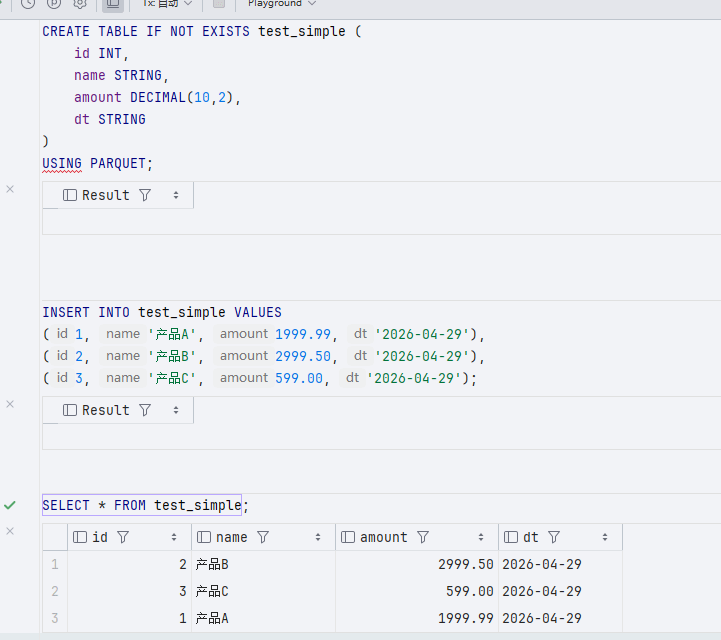

1. python 3.11 环境配置

    python 3.11 是 spark 3.5 的比较好的组合，所以直接使用 python [3.11](https://github.com/astral-sh/python-build-standalone/releases/download/20241002/cpython-3.11.10+20241002-x86_64-unknown-linux-gnu-pgo+lto-full.tar.zst) 即可，分发到每个节点上

    ```bash
    # 下载 zstd 解压工具
    sudo apt update && sudo apt install -y zstd
    mkdir -p /opt/module/python3.11
    # 解压到对应位置
    tar -I zstd -xf cpython-3.11.10+20241002-x86_64-unknown-linux-gnu-pgo+lto-full.tar.zst -C /opt/module/python3.11
    ```

    配置环境变量到 `/opt/module/python3.11/python/install/bin`

    ```bash
    PYTHON_HOME=/opt/module/python3.11/python/install
    export PATH=$PATH:$JAVA_HOME/bin:$HIVE_HOME/bin:$ZOOKEEPER_HOME/bin:$HADOOP_HOME/bin:$HADOOP_HOME/sbin:$SPARK_HOME/bin:$SPARK_HOME/sbin:$DS_HOME/bin:$PYTHON_HOME/bin
    ```

#### DolphinScheduler

[DolphinScheduler](https://dolphinscheduler.apache.org/zh-cn/docs/3.2.2) 部署，需求 JDK 8 / JDK 11，在当前集群环境中当然是使用 JDK8

1. 下载[压缩包](https://archive.apache.org/dist/dolphinscheduler/3.2.2/apache-dolphinscheduler-3.2.2-bin.tar.gz)
1. 使用的数据库为 MySQL，需要 JDBC Driver 

    `/opt/module/apache-dolphinscheduler-3.4.1-bin/libs` 中下载 [JDBC Driver](https://repo1.maven.org/maven2/com/mysql/mysql-connector-j/8.3.0/mysql-connector-j-8.3.0.jar)

    然后将这个链接到 cd li  
    
    - master `/opt/module/apache-dolphinscheduler-3.4.1-bin/master-server/libs`
    - api `/opt/module/apache-dolphinscheduler-3.4.1-bin/api-server/libs`
    - alter `/opt/module/apache-dolphinscheduler-3.4.1-bin/alert-server/libs`
    - worker `/opt/module/apache-dolphinscheduler-3.4.1-bin/worker-server/libs`
    - tools `/opt/module/apache-dolphinscheduler-3.4.1-bin/tools`

    ```bash
    xcall all ln -s $DS_HOME/libs/mysql-connector-j-8.3.0.jar $DS_HOME/master-server/libs/mysql-connector-j-8.3.0.jar 
    xcall all ln -s $DS_HOME/libs/mysql-connector-j-8.3.0.jar $DS_HOME/api-server/libs/mysql-connector-j-8.3.0.jar 
    xcall all ln -s $DS_HOME/libs/mysql-connector-j-8.3.0.jar $DS_HOME/alert-server/libs/mysql-connector-j-8.3.0.jar 
    xcall all ln -s $DS_HOME/libs/mysql-connector-j-8.3.0.jar $DS_HOME/worker-server/libs/mysql-connector-j-8.3.0.jar 
    xcall all ln -s $DS_HOME/libs/mysql-connector-j-8.3.0.jar $DS_HOME/tools/libs/mysql-connector-j-8.3.0.jar 
    ```
1. 配置环境变量
1. 修改配置文件 `bin/env/dolphinscheduler_env.sh`，所有节点都需要编辑 `bin/env/dolphinscheduler_env.sh`，确保内容一致。

    <details>

    ```bash
    # JAVA_HOME, will use it to start DolphinScheduler server
    export JAVA_HOME=/opt/module/jdk1.8.0_202

    # Database related configuration, set database type, username and password
    export DATABASE=mysql
    export SPRING_PROFILES_ACTIVE=mysql
    export SPRING_DATASOURCE_URL="jdbc:mysql://node1:3306/dolphinscheduler?useUnicode=true&characterEncoding=UTF-8&useSSL=false&serverTimezone=Asia/Shanghai&allowPublicKeyRetrieval=true"
    export SPRING_DATASOURCE_USERNAME=ds
    export SPRING_DATASOURCE_PASSWORD=Ab@123

    # DolphinScheduler server related configuration
    export SPRING_CACHE_TYPE=none
    export SPRING_JACKSON_TIME_ZONE=Asia/Shanghai

    # Registry center configuration, determines the type and link of the registry center
    export REGISTRY_TYPE=zookeeper
    export REGISTRY_ZOOKEEPER_CONNECT_STRING=node1:2181,node2:2181,node3:2181

    # Tasks related configurations, need to change the configuration if you use the related tasks.
    export HADOOP_HOME=/opt/module/hadoop-3.3.6
    export HADOOP_CONF_DIR=${HADOOP_CONF_DIR:-/opt/soft/hadoop/etc/hadoop}
    export SPARK_HOME=/opt/module/hadoop-3.3.6/etc/hadoop
    export PYTHON_LAUNCHER=/opt/module/python3.11/python/install/bin/python3.11
    export HIVE_HOME=/opt/module/apache-hive-3.1.3-bin
    # Flink 等部署了再说
    # export FLINK_HOME=${FLINK_HOME:-/opt/soft/flink}
    # export DATAX_LAUNCHER=${DATAX_LAUNCHER:-/opt/soft/datax/bin/python3}

    export PATH=$HADOOP_HOME/bin:$SPARK_HOME/bin:$PYTHON_LAUNCHER:$JAVA_HOME/bin:$HIVE_HOME/bin
    ```

    </details>

1. 创建 dolphinscheduler 专有数据库

    ```sql
    CREATE DATABASE dolphinscheduler DEFAULT CHARACTER SET utf8 DEFAULT COLLATE utf8_general_ci;
    CREATE USER 'ds'@'%' IDENTIFIED BY 'Ab@123';
    GRANT ALL PRIVILEGES ON dolphinscheduler.* TO 'ds'@'%';
    FLUSH PRIVILEGES;
    ```

    初始化数据库

    ```bash
    bash $DS_HOME/tools/bin/upgrade-schema.sh
    ```

1. 修改 ha proxy

    ```bash
    sudo vim /etc/haproxy/haproxy.cfg
    ```

    ```bash
    # DolphinScheduler Web UI 负载均衡
    frontend dolphinscheduler_web
        bind *:12346
        default_backend ds_api_servers

    backend ds_api_servers
        balance roundrobin
        server node1 192.168.100.131:12345 check
        server node2 192.168.100.132:12345 check
    ```

    ```
    sudo systemctl restart haproxy
    ```

1. 如果要登录，则

    

    如果使用了 ha proxy，那么端口应该是 12346

1. 新的群起集群脚本

    <details>

    ```bash
    #!/bin/bash
    
    # ======================== 集群配置（按实际情况修改） ========================
    NODE1="node1"
    NODE2="node2"
    NODE3="node3"
    NODE4="node4"
    NODE5="node5"
    
    # Hadoop 角色
    NN_NODES=("$NODE1" "$NODE2")            # NameNode 节点
    JN_NODES=("$NODE1" "$NODE2" "$NODE3")   # JournalNode 节点
    ZK_NODES=("$NODE1" "$NODE2" "$NODE3")   # ZooKeeper 节点
    DN_NODES=("$NODE4" "$NODE5")            # DataNode 节点
    NM_NODES=("$NODE4" "$NODE5")            # NodeManager 节点
    RM_NODES=("$NODE1" "$NODE2")            # ResourceManager 节点
    HS_NODE="$NODE1"                        # MapReduce JobHistoryServer 节点
    
    # Spark 角色
    SPARK_MASTER_NODE="$NODE1"              # Spark Master 节点（单点，可按需扩展）
    SPARK_WORKER_NODES=("$NODE4" "$NODE5") # Spark Worker 节点
    SPARK_THRIFT_SERVER_NODES=("$NODE1" "$NODE2") # Spark Thrift Server 节点
    
    # NameNode 逻辑名称（必须与 hdfs-site.xml 一致）
    NN1_HOST="$NODE1"
    NN1_ID="nn1"
    NN2_HOST="$NODE2"
    NN2_ID="nn2"
    
    # Hive 角色
    METASTORE_NODES=("$NODE1" "$NODE2")
    
    # DolphinScheduler 角色
    DS_MASTER_NODES=("$NODE1" "$NODE2")         # Master 节点
    DS_API_NODES=("$NODE1" "$NODE2")            # API Server 节点
    DS_ALERT_NODES=("$NODE3")                   # Alert Server 节点
    DS_WORKER_NODES=("$NODE4" "$NODE5")         # Worker 节点
    
    # 颜色
    RED='\033[0;31m'
    GREEN='\033[0;32m'
    YELLOW='\033[1;33m'
    NC='\033[0m'
    
    print_msg()  { echo -e "${GREEN}[$1]${NC} $2"; }
    print_warn() { echo -e "${YELLOW}[$1]${NC} $2"; }
    print_error(){ echo -e "${RED}[$1]${NC} $2"; }
    
    # SSH 执行（source /etc/profile 获取环境变量）
    ssh_exec() {
        local node=$1; shift
        ssh -o StrictHostKeyChecking=no -o UserKnownHostsFile=/dev/null -o LogLevel=ERROR "$node" "
            source /etc/profile 2>/dev/null
            $*
        "
    }
    
    # ======================== ZooKeeper ========================
    start_zookeeper() {
        print_msg "ZK" "启动 ZooKeeper..."
        for node in "${ZK_NODES[@]}"; do
            ssh_exec "$node" "
                if [ -n \"\$ZOOKEEPER_HOME\" ]; then
                    \$ZOOKEEPER_HOME/bin/zkServer.sh start
                else
                    zkServer.sh start
                fi
            "
        done
        sleep 2
        print_msg "ZK" "ZooKeeper 启动完成"
    }
    
    stop_zookeeper() {
        print_msg "ZK" "停止 ZooKeeper..."
        for node in "${ZK_NODES[@]}"; do
            ssh_exec "$node" "
                if [ -n \"\$ZOOKEEPER_HOME\" ]; then
                    \$ZOOKEEPER_HOME/bin/zkServer.sh stop
                else
                    zkServer.sh stop
                fi
            "
        done
        print_msg "ZK" "ZooKeeper 已停止"
    }
    
    # ======================== HDFS ========================
    start_hdfs() {
        print_msg "HDFS" "启动 HDFS 组件..."
        print_msg "JN" "启动 JournalNode..."
        for node in "${JN_NODES[@]}"; do
            ssh_exec "$node" "\$HADOOP_HOME/bin/hdfs --daemon start journalnode"
        done
        sleep 2
    
        print_msg "NN" "启动 NameNode..."
        for node in "${NN_NODES[@]}"; do
            ssh_exec "$node" "\$HADOOP_HOME/bin/hdfs --daemon start namenode"
        done
        sleep 2
    
        print_msg "ZKFC" "启动 ZKFC..."
        for node in "${NN_NODES[@]}"; do
            ssh_exec "$node" "\$HADOOP_HOME/bin/hdfs --daemon start zkfc"
        done
        sleep 2
    
        print_msg "DN" "启动 DataNode..."
        for node in "${DN_NODES[@]}"; do
            ssh_exec "$node" "\$HADOOP_HOME/bin/hdfs --daemon start datanode"
        done
        sleep 2
    
        print_msg "HDFS" "HDFS 组件启动完成"
    }
    
    stop_hdfs() {
        print_msg "HDFS" "停止 HDFS 组件..."
        print_msg "ZKFC" "停止 ZKFC..."
        for node in "${NN_NODES[@]}"; do
            ssh_exec "$node" "\$HADOOP_HOME/bin/hdfs --daemon stop zkfc"
        done
    
        print_msg "NN" "停止 NameNode..."
        for node in "${NN_NODES[@]}"; do
            ssh_exec "$node" "\$HADOOP_HOME/bin/hdfs --daemon stop namenode"
        done
    
        print_msg "DN" "停止 DataNode..."
        for node in "${DN_NODES[@]}"; do
            ssh_exec "$node" "\$HADOOP_HOME/bin/hdfs --daemon stop datanode"
        done
    
        print_msg "JN" "停止 JournalNode..."
        for node in "${JN_NODES[@]}"; do
            ssh_exec "$node" "\$HADOOP_HOME/bin/hdfs --daemon stop journalnode"
        done
    
        print_msg "HDFS" "HDFS 组件已停止"
    }
    
    # ======================== YARN ========================
    start_yarn() {
        print_msg "YARN" "启动 YARN 组件..."
        print_msg "RM" "启动 ResourceManager..."
        for node in "${RM_NODES[@]}"; do
            ssh_exec "$node" "\$HADOOP_HOME/bin/yarn --daemon start resourcemanager"
        done
        sleep 2
    
        print_msg "NM" "启动 NodeManager..."
        for node in "${NM_NODES[@]}"; do
            ssh_exec "$node" "\$HADOOP_HOME/bin/yarn --daemon start nodemanager"
        done
        sleep 2
        print_msg "YARN" "YARN 组件启动完成"
    }
    
    stop_yarn() {
        print_msg "YARN" "停止 YARN 组件..."
        print_msg "RM" "停止 ResourceManager..."
        for node in "${RM_NODES[@]}"; do
            ssh_exec "$node" "\$HADOOP_HOME/bin/yarn --daemon stop resourcemanager"
        done
    
        print_msg "NM" "停止 NodeManager..."
        for node in "${NM_NODES[@]}"; do
            ssh_exec "$node" "\$HADOOP_HOME/bin/yarn --daemon stop nodemanager"
        done
        print_msg "YARN" "YARN 组件已停止"
    }
    
    # ======================== MapReduce HistoryServer ========================
    start_historyserver() {
        print_msg "HS" "启动 MapReduce HistoryServer..."
        ssh_exec "$HS_NODE" "\$HADOOP_HOME/bin/mapred --daemon start historyserver"
        print_msg "HS" "HistoryServer 启动完成"
    }
    
    stop_historyserver() {
        print_msg "HS" "停止 MapReduce HistoryServer..."
        ssh_exec "$HS_NODE" "\$HADOOP_HOME/bin/mapred --daemon stop historyserver"
        print_msg "HS" "HistoryServer 已停止"
    }
    
    # ======================== Hive Metastore ========================
    start_metastore() {
        print_msg "METASTORE" "启动 Metastore..."
        for node in "${METASTORE_NODES[@]}"; do
            ssh_exec "$node" "nohup \$HIVE_HOME/bin/hive --service metastore >/dev/null 2>&1 &"
        done
        sleep 4
        print_msg "METASTORE" "Metastore 启动完成"
    }
    
    stop_metastore() {
        print_msg "METASTORE" "停止 Metastore..."
        for node in "${METASTORE_NODES[@]}"; do
            ssh_exec "$node" "pkill -f 'org.apache.hadoop.hive.metastore.HiveMetaStore'"
        done
        print_msg "METASTORE" "Metastore 已停止"
    }
    
    # ======================== Spark ========================
    start_spark() {
        print_msg "SPARK" "启动 Spark 组件..."
        # 这里假设你的 Spark 以 Standalone 或 YARN 方式运行 Worker
        # 如果不需要单独启动 Worker（依赖 YARN），可以注释掉
        # 启动 Spark Master
        # ssh_exec "$SPARK_MASTER_NODE" "\$SPARK_HOME/sbin/start-master.sh"
        # 启动 Spark Workers
        # for node in "${SPARK_WORKER_NODES[@]}"; do
        #     ssh_exec "$node" "\$SPARK_HOME/sbin/start-worker.sh spark://$SPARK_MASTER_NODE:7077"
        # done
        print_msg "SPARK" "Spark 组件启动完成（若需独立 Worker 请取消注释）"
    }
    
    stop_spark() {
        print_msg "SPARK" "停止 Spark 组件..."
        # ssh_exec "$SPARK_MASTER_NODE" "\$SPARK_HOME/sbin/stop-master.sh"
        # for node in "${SPARK_WORKER_NODES[@]}"; do
        #     ssh_exec "$node" "\$SPARK_HOME/sbin/stop-worker.sh"
        # done
        print_msg "SPARK" "Spark 组件已停止"
    }
    
    start_spark_thrift_server() {
        print_msg "SPARK THRIFT" "启动 Spark Thrift Server..."
        for node in "${SPARK_THRIFT_SERVER_NODES[@]}"; do
            ssh_exec "$node" "
                nohup \$SPARK_HOME/sbin/start-thriftserver.sh \
                    --master yarn \
                    --deploy-mode client \
                    --hiveconf hive.server2.thrift.port=10000 \
                    --hiveconf hive.server2.thrift.bind.host=0.0.0.0 >/dev/null 2>&1 &
            "
            sleep 3
        done
        sleep 5
        print_msg "SPARK THRIFT" "Spark Thrift Server 启动完成"
    }
    
    stop_spark_thrift_server() {
        print_msg "SPARK THRIFT" "停止 Spark Thrift Server..."
        for node in "${SPARK_THRIFT_SERVER_NODES[@]}"; do
            ssh_exec "$node" "pkill -f 'org.apache.spark.sql.hive.thriftserver.HiveThriftServer2'"
        done
        print_msg "SPARK THRIFT" "Spark Thrift Server 已停止"
    }
    
    # ======================== DolphinScheduler ========================
    start_ds_master() {
        print_msg "DS-MASTER" "启动 DolphinScheduler Master..."
        for node in "${DS_MASTER_NODES[@]}"; do
            ssh_exec "$node" "\$DS_HOME/bin/dolphinscheduler-daemon.sh start master-server"
        done
        sleep 2
        print_msg "DS-MASTER" "Master 启动完成"
    }
    
    stop_ds_master() {
        print_msg "DS-MASTER" "停止 DolphinScheduler Master..."
        for node in "${DS_MASTER_NODES[@]}"; do
            ssh_exec "$node" "\$DS_HOME/bin/dolphinscheduler-daemon.sh stop master-server"
        done
        print_msg "DS-MASTER" "Master 已停止"
    }
    
    start_ds_api() {
        print_msg "DS-API" "启动 DolphinScheduler API Server..."
        for node in "${DS_API_NODES[@]}"; do
            ssh_exec "$node" "\$DS_HOME/bin/dolphinscheduler-daemon.sh start api-server"
        done
        sleep 2
        print_msg "DS-API" "API Server 启动完成"
    }
    
    stop_ds_api() {
        print_msg "DS-API" "停止 DolphinScheduler API Server..."
        for node in "${DS_API_NODES[@]}"; do
            ssh_exec "$node" "\$DS_HOME/bin/dolphinscheduler-daemon.sh stop api-server"
        done
        print_msg "DS-API" "API Server 已停止"
    }
    
    start_ds_alert() {
        print_msg "DS-ALERT" "启动 DolphinScheduler Alert Server..."
        for node in "${DS_ALERT_NODES[@]}"; do
            ssh_exec "$node" "\$DS_HOME/bin/dolphinscheduler-daemon.sh start alert-server"
        done
        sleep 2
        print_msg "DS-ALERT" "Alert Server 启动完成"
    }
    
    stop_ds_alert() {
        print_msg "DS-ALERT" "停止 DolphinScheduler Alert Server..."
        for node in "${DS_ALERT_NODES[@]}"; do
            ssh_exec "$node" "\$DS_HOME/bin/dolphinscheduler-daemon.sh stop alert-server"
        done
        print_msg "DS-ALERT" "Alert Server 已停止"
    }
    
    start_ds_worker() {
        print_msg "DS-WORKER" "启动 DolphinScheduler Worker..."
        for node in "${DS_WORKER_NODES[@]}"; do
            ssh_exec "$node" "\$DS_HOME/bin/dolphinscheduler-daemon.sh start worker-server"
        done
        sleep 2
        print_msg "DS-WORKER" "Worker 启动完成"
    }
    
    stop_ds_worker() {
        print_msg "DS-WORKER" "停止 DolphinScheduler Worker..."
        for node in "${DS_WORKER_NODES[@]}"; do
            ssh_exec "$node" "\$DS_HOME/bin/dolphinscheduler-daemon.sh stop worker-server"
        done
        print_msg "DS-WORKER" "Worker 已停止"
    }
    
    # 全局启停 DolphinScheduler（按照启动顺序）
    start_ds() {
        start_ds_master
        start_ds_api
        start_ds_alert
        start_ds_worker
        print_msg "DS-ALL" "DolphinScheduler 全部组件启动完成"
    }
    
    stop_ds() {
        stop_ds_worker
        stop_ds_alert
        stop_ds_api
        stop_ds_master
        print_msg "DS-ALL" "DolphinScheduler 全部组件已停止"
    }
    
    # ======================== 全局启停 ========================
    start_all() {
        start_zookeeper
        start_hdfs
        start_yarn
        start_historyserver
        start_metastore
        start_spark
        start_spark_thrift_server
        start_ds
        print_msg "ALL" "全部服务已启动"
    }
    
    stop_all() {
        stop_spark_thrift_server
        stop_spark
        stop_metastore
        stop_historyserver
        stop_yarn
        stop_hdfs
        stop_zookeeper
        stop_ds
        print_msg "ALL" "全部服务已停止"
    }
    
    # ======================== 状态检查 ========================
    check_status() {
        echo -e "${GREEN}==================== 集群状态 ====================${NC}"
    
        # --- ZooKeeper ---
        print_msg "ZK" "ZooKeeper:"
        for node in "${ZK_NODES[@]}"; do
            out=$(ssh_exec "$node" "jps 2>/dev/null | grep QuorumPeerMain")
            if [ -n "$out" ]; then
                echo -e "  $node : ${GREEN}$out${NC}"
            else
                echo -e "  $node : ${RED}未运行${NC}"
            fi
        done
    
        # --- HDFS ---
        print_msg "HDFS" "HDFS 进程:"
        all_hdfs_nodes=($(printf "%s\n" "${NN_NODES[@]}" "${JN_NODES[@]}" "${DN_NODES[@]}" | sort -u))
        for node in "${all_hdfs_nodes[@]}"; do
            out=$(ssh_exec "$node" "jps 2>/dev/null | grep -E 'NameNode|DataNode|JournalNode|DFSZKFailoverController'")
            if [ -n "$out" ]; then
                echo -e "  ${GREEN}$node${NC}:"
                echo "$out" | while read line; do echo -e "    ${GREEN}$line${NC}"; done
            else
                echo -e "  ${RED}$node${NC}: 无 HDFS 进程"
            fi
        done
    
        # HA 状态
        print_msg "HA" "NameNode HA 状态:"
        nn1_state=$(ssh_exec "${NN1_HOST}" "\$HADOOP_HOME/bin/hdfs haadmin -getServiceState $NN1_ID 2>/dev/null")
        nn2_state=$(ssh_exec "${NN2_HOST}" "\$HADOOP_HOME/bin/hdfs haadmin -getServiceState $NN2_ID 2>/dev/null")
        if [ "$nn1_state" == "active" ]; then
            echo -e "  $NN1_HOST ($NN1_ID) : ${GREEN}active${NC}"
            echo -e "  $NN2_HOST ($NN2_ID) : ${YELLOW}standby${NC}"
        elif [ "$nn2_state" == "active" ]; then
            echo -e "  $NN1_HOST ($NN1_ID) : ${YELLOW}standby${NC}"
            echo -e "  $NN2_HOST ($NN2_ID) : ${GREEN}active${NC}"
        else
            echo -e "  ${RED}无法获取 HA 状态（集群可能未初始化）${NC}"
        fi
    
        # --- YARN ---
        print_msg "YARN" "YARN 进程:"
        all_yarn_nodes=($(printf "%s\n" "${RM_NODES[@]}" "${NM_NODES[@]}" | sort -u))
        for node in "${all_yarn_nodes[@]}"; do
            out=$(ssh_exec "$node" "jps 2>/dev/null | grep -E 'ResourceManager|NodeManager'")
            if [ -n "$out" ]; then
                echo -e "  ${GREEN}$node${NC}:"
                echo "$out" | while read line; do echo -e "    ${GREEN}$line${NC}"; done
            else
                echo -e "  ${RED}$node${NC}: 无 YARN 进程"
            fi
        done
    
        # --- MapReduce HistoryServer ---
        print_msg "HS" "MapReduce HistoryServer:"
        out=$(ssh_exec "$HS_NODE" "jps 2>/dev/null | grep JobHistoryServer")
        if [ -n "$out" ]; then
            echo -e "  $HS_NODE : ${GREEN}$out${NC}"
        else
            echo -e "  $HS_NODE : ${RED}未运行${NC}"
        fi
    
        # --- Hive Metastore ---
        print_msg "META" "Hive Metastore:"
        for node in "${METASTORE_NODES[@]}"; do
            out=$(ssh_exec "$node" "ps -ef | grep -v grep | grep 'org.apache.hadoop.hive.metastore.HiveMetaStore'")
            if [ -n "$out" ]; then
                echo -e "  $node : ${GREEN}运行中${NC}"
            else
                echo -e "  $node : ${RED}未运行${NC}"
            fi
        done
    
        # --- Spark Thrift Server ---
        print_msg "SPARK THRIFT" "Spark Thrift Server:"
        for node in "${SPARK_THRIFT_SERVER_NODES[@]}"; do
            out=$(ssh_exec "$node" "jps 2>/dev/null | grep SparkSubmit")
            if [ -n "$out" ]; then
                echo -e "  $node : ${GREEN}运行中${NC}"
            else
                echo -e "  $node : ${RED}未运行${NC}"
            fi
        done
    
        # --- DolphinScheduler ---
        print_msg "DS" "DolphinScheduler 进程:"
        # 合并所有 DS 节点并去重
        all_ds_nodes=($(printf "%s\n" "${DS_MASTER_NODES[@]}" "${DS_API_NODES[@]}" "${DS_ALERT_NODES[@]}" "${DS_WORKER_NODES[@]}" | sort -u))
        for node in "${all_ds_nodes[@]}"; do
            out=$(ssh_exec "$node" "jps 2>/dev/null | grep -E 'MasterServer|ApiApplicationServer|AlertServer|WorkerServer'")
            if [ -n "$out" ]; then
                echo -e "  ${GREEN}$node${NC}:"
                echo "$out" | while read line; do echo -e "    ${GREEN}$line${NC}"; done
            else
                echo -e "  ${RED}$node${NC}: 无 DS 进程"
            fi
        done
    }
    
    # ======================== 命令入口 ========================
    case "$1" in
        start-zookeeper)    start_zookeeper    ;;
        stop-zookeeper)     stop_zookeeper     ;;
        start-hdfs)         start_hdfs         ;;
        stop-hdfs)          stop_hdfs          ;;
        start-yarn)         start_yarn         ;;
        stop-yarn)          stop_yarn          ;;
        start-historyserver) start_historyserver ;;
        stop-historyserver)  stop_historyserver  ;;
        start-metastore)    start_metastore    ;;
        stop-metastore)     stop_metastore     ;;
        start-spark)        start_spark        ;;   # 已保留，但默认不启动独立 Worker
        stop-spark)         stop_spark         ;;
        start-spark-thrift) start_spark_thrift_server ;;
        stop-spark-thrift)  stop_spark_thrift_server  ;;
        start-ds-master)    start_ds_master    ;;
        stop-ds-master)     stop_ds_master     ;;
        start-ds-api)       start_ds_api       ;;
        stop-ds-api)        stop_ds_api        ;;
        start-ds-alert)     start_ds_alert     ;;
        stop-ds-alert)      stop_ds_alert      ;;
        start-ds-worker)    start_ds_worker    ;;
        stop-ds-worker)     stop_ds_worker     ;;
        start-ds)           start_ds           ;;
        stop-ds)            stop_ds            ;;
        start-all)          start_all          ;;
        stop-all)           stop_all           ;;
        restart-all)        stop_all; sleep 3; start_all ;;
        status)             check_status       ;;
        *)
            echo "用法: $0 <命令>"
            echo "  分组件启停:"
            echo "    start-zookeeper | stop-zookeeper"
            echo "    start-hdfs | stop-hdfs"
            echo "    start-yarn | stop-yarn"
            echo "    start-historyserver | stop-historyserver"
            echo "    start-metastore | stop-metastore"
            echo "    start-spark | stop-spark"
            echo "    start-spark-thrift | stop-spark-thrift"
            echo "    start-ds-master | stop-ds-master"
            echo "    start-ds-api | stop-ds-api"
            echo "    start-ds-alert | stop-ds-alert"
            echo "    start-ds-worker | stop-ds-worker"
            echo "    start-ds | stop-ds"
            echo "  全局管理:"
            echo "    start-all | stop-all | restart-all"
            echo "    status"
            exit 1
            ;;
    esac
    ```

    </details>

1. 配置

    - 安全中心 (Security Center) → 租户管理 (Tenant Management)

        租户对应着 Linux 系统的用户（比如 hdfs）
        
        需要新建一个租户，选择对应的用户，并指定这个用户有权限使用的 YARN 队列（一般先用 default 队列）
        
        这样，DolphinScheduler 提交的任务才知道以哪个用户身份在机器上执行

        
    
    - 安全中心 → 队列管理 (Queue Management)

        如果在 YARN 里配置了专用的资源队列（比如 spark_jobs），可以在这里添加
        
        如果都是用的默认队列，直接使用已有的 default 队列就行

        
    
    - 安全中心 → 告警实例管理 (Alert Instance Management)
  
        可以在这里配置告警通道（比如钉钉、邮件）
        
        这样当任务失败时，系统才能通过你配置的实例自动通知
        
        现在可以先只配置一个测试用的告警实例
    
    - 安全中心 → 用户管理 (User Management)
    
        创建完租户后，需要编辑 admin 用户，将其分配到你创建的租户，并授予 管理员 角色
        
        这样才能正常创建工作流

        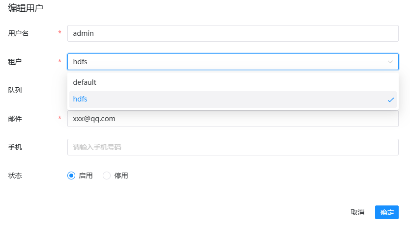

    如果内存不够，可能会触发自动保护机制

    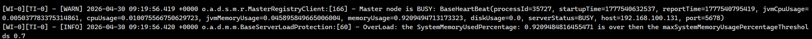

    这个时候要么加内存，要么把当前的 master 和 worker 的 application.yaml 配置中的 overload 设置为 false

    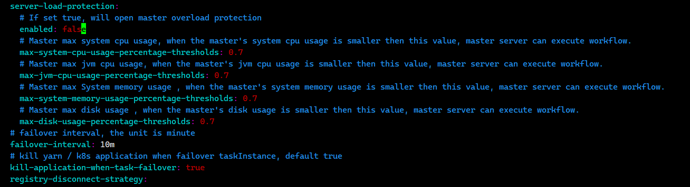

    安装 coreutils，否则之后 dolphinscheduler 会报错
    
    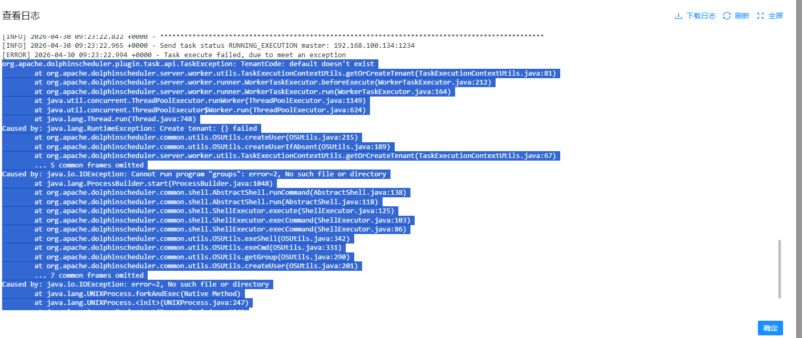

    ```bash
    sudo apt update
    sudo apt install -y coreutils
    ```

    

    之后下载 sudo 命令

    ```bash
    sudo apt update
    sudo apt install -y sudo
    ```

    然后查看 sudo 位置 `which sudo`，一般是 `/usr/bin/sudo`，给 `$DS_HOME/bin/env/dolphinscheduler_env.sh` 的 `export PATH=...` 再拼上 `/usr/bin`，分发重启

    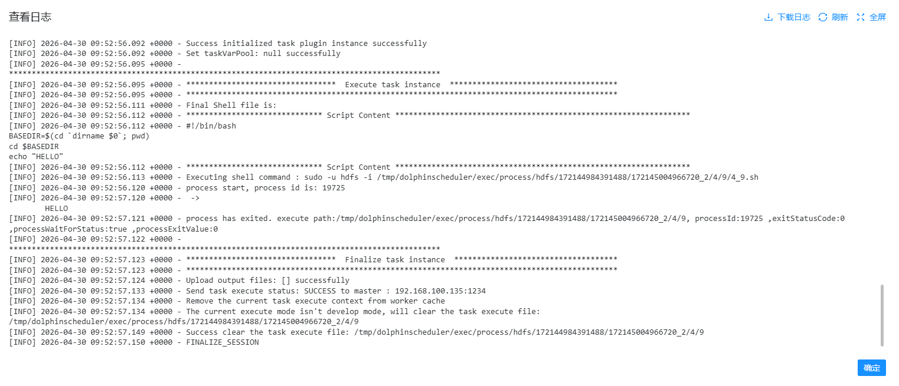

#### Kafka

Kafka 在 node3 node4 node5 上分别搭建，形成一个 HA 集群，因为测试资源少，所以在三个节点上同时搭建 controller 和 broker

1. 准备数据目录，虽然是 node3 4 5 搭建，但是为了之后方便切换，直接切换即可

    ```bash
    xcall all sudo mkdir -p /opt/data/kafka
    xcall all sudo chown -R hdfs:hadoop /opt/data/kafka
    ```

1. 准备 kafka [3.6.1](https://archive.apache.org/dist/kafka/3.6.1/kafka_2.13-3.6.1.tgz)
1. 解压、配置环境变量
1. 在 Node3 节点生成集群 ID 并记住，比如输出为 `rQmSOXOZRyG9_4RTBdzWuw`

    ```bash
    cd $KAFKA_HOME && bin/kafka-storage.sh random-uuid
    ```

1. 配置 KRaft，每个节点都不同，配置文件位于 `$KAFKA_HOME/config/kraft/server.properties`

    node3 中修改为

    <details>

    ```bash
    # 节点唯一 ID
    node.id=3

    # 同时担任 Controller 和 Broker 角色
    process.roles=broker,controller

    # 控制器 Quorum 投票者（三节点）
    controller.quorum.voters=3@node3:9093,4@node4:9093,5@node5:9093

    # 监听器配置
    listeners=PLAINTEXT://node3:9092,CONTROLLER://node3:9093
    advertised.listeners=PLAINTEXT://node3:9092

    # 控制器间通信协议
    controller.listener.names=CONTROLLER
    listener.security.protocol.map=CONTROLLER:PLAINTEXT,PLAINTEXT:PLAINTEXT

    # 数据存储目录
    log.dirs=/opt/data/kafka

    # 以下为高可用推荐配置[citation:2]
    num.partitions=3
    # 每个 Topic 分区默认的副本数
    default.replication.factor=3
    # 生产消息时，至少需要多少个副本确认写入
    min.insync.replicas=2

    # 保证 kafka 内部高可用
    # kafka 内部 topic __consumer_offsets 记录消费位置的副本数
    offsets.topic.replication.factor=3
    # kafka 内部 topic __transaction_state 记录事务状态的副本数
    transaction.state.log.replication.factor=3
    # 约束事务日志 Topic，它要求写入事务状态时，至少要有 2 个 副本都确认完成才算成功
    transaction.state.log.min.isr=2
    ```

    </details>

    在 node4 中修改以上内容为

    ```bash
    node.id=4
    listeners=PLAINTEXT://node4:9092,CONTROLLER://node4:9093
    advertised.listeners=PLAINTEXT://node4:9092
    ```

    在 node5 中修改以上内容为

    ```bash
    node.id=5
    listeners=PLAINTEXT://node5:9092,CONTROLLER://node5:9093
    advertised.listeners=PLAINTEXT://node5:9092
    ```

1. 格式化存储目录

    在三个节点中格式化存储目录，使用刚刚生成的 UUID 在三个节点上分别执行

    ```bash
    cd $KAFKA_HOME && bin/kafka-storage.sh format -t <你的UUID> -c config/kraft/server.properties
    ```

    成功后输出 `Formatting /opt/data/kafka with metadata.version 3.6-IV2`

1. 以守护进程启动所有节点

    ```bash
    # 启动节点
    cd $KAFKA_HOME && bin/kafka-server-start.sh -daemon config/kraft/server.properties
    # 验证进程
    jps | grep Kafka
    # 查看控制器 quorum 状态，输出中应该包含 `CurrentVoters: [3,4,5]`，且 `LeaderId` 为三者之一
    bin/kafka-metadata-quorum.sh --bootstrap-server node3:9092 describe --status
    ```

1. 创建测试 topic 并验证高可用

    ```bash
    # 创建 topic
    bin/kafka-topics.sh --create \
        --topic test-ha \
        --bootstrap-server node3:9092 \
        --partitions 3 \
        --replication-factor 3
    # 查看 topic 详情，应看到 ReplicationFactor: 3，每个分区有 Leader、Replicas、Isr
    bin/kafka-topics.sh --describe --topic test-ha --bootstrap-server node3:9092
    # 生产消息
    echo "Hello Kafka on node3!" | bin/kafka-console-producer.sh \
        --topic test-ha \
        --bootstrap-server node3:9092
    # 在另外的节点上消费消息，能够收到消息说明集群工作正常
    bin/kafka-console-consumer.sh \
        --topic test-ha \
        --from-beginning \
        --bootstrap-server node4:9092
    ```

1. 测试 HA

    ```bash
    # 查当前 Leader
    bin/kafka-metadata-quorum.sh --bootstrap-server node3:9092 describe --status
    # 在 Leader 节点上停掉 Kafka
    pkill -f kafka
    # 在其他节点再次检查：Leader 应该会自动切换到另一个节点 
    bin/kafka-metadata-quorum.sh --bootstrap-server node4:9092 describe --status
    # 消费消息：仍然能正常消费
    bin/kafka-console-consumer.sh \
        --topic test-ha \
        --from-beginning \
        --bootstrap-server node4:9092,node5:9092
    ```
1. 新的群起脚本

    <details>

    ```bash
    #!/bin/bash
    
    # ======================== 集群配置（按实际情况修改） ========================
    NODE1="node1"
    NODE2="node2"
    NODE3="node3"
    NODE4="node4"
    NODE5="node5"
    
    # Hadoop 角色
    NN_NODES=("$NODE1" "$NODE2")            # NameNode 节点
    JN_NODES=("$NODE1" "$NODE2" "$NODE3")   # JournalNode 节点
    ZK_NODES=("$NODE1" "$NODE2" "$NODE3")   # ZooKeeper 节点
    DN_NODES=("$NODE4" "$NODE5")            # DataNode 节点
    NM_NODES=("$NODE4" "$NODE5")            # NodeManager 节点
    RM_NODES=("$NODE1" "$NODE2")            # ResourceManager 节点
    HS_NODE="$NODE1"                        # MapReduce JobHistoryServer 节点
    
    # Spark 角色
    SPARK_MASTER_NODE="$NODE1"              # Spark Master 节点（单点，可按需扩展）
    SPARK_WORKER_NODES=("$NODE4" "$NODE5") # Spark Worker 节点
    SPARK_THRIFT_SERVER_NODES=("$NODE1" "$NODE2") # Spark Thrift Server 节点
    
    # NameNode 逻辑名称（必须与 hdfs-site.xml 一致）
    NN1_HOST="$NODE1"
    NN1_ID="nn1"
    NN2_HOST="$NODE2"
    NN2_ID="nn2"
    
    # Hive 角色
    METASTORE_NODES=("$NODE1" "$NODE2")
    
    # DolphinScheduler 角色
    DS_MASTER_NODES=("$NODE1" "$NODE2")         # Master 节点
    DS_API_NODES=("$NODE1" "$NODE2")            # API Server 节点
    DS_ALERT_NODES=("$NODE3")                   # Alert Server 节点
    DS_WORKER_NODES=("$NODE4" "$NODE5")         # Worker 节点
    
    # Kafka KRaft 集群所有节点
    KAFKA_NODES=("$NODE3" "$NODE4" "$NODE5")
    
    # 颜色
    RED='\033[0;31m'
    GREEN='\033[0;32m'
    YELLOW='\033[1;33m'
    NC='\033[0m'
    
    print_msg()  { echo -e "${GREEN}[$1]${NC} $2"; }
    print_warn() { echo -e "${YELLOW}[$1]${NC} $2"; }
    print_error(){ echo -e "${RED}[$1]${NC} $2"; }
    
    # SSH 执行（source /etc/profile 获取环境变量）
    ssh_exec() {
        local node=$1; shift
        ssh -o StrictHostKeyChecking=no -o UserKnownHostsFile=/dev/null -o LogLevel=ERROR "$node" "
            source /etc/profile 2>/dev/null
            $*
        "
    }
    
    # ======================== ZooKeeper ========================
    start_zookeeper() {
        print_msg "ZK" "启动 ZooKeeper..."
        for node in "${ZK_NODES[@]}"; do
            ssh_exec "$node" "
                if [ -n \"\$ZOOKEEPER_HOME\" ]; then
                    \$ZOOKEEPER_HOME/bin/zkServer.sh start
                else
                    zkServer.sh start
                fi
            "
        done
        sleep 2
        print_msg "ZK" "ZooKeeper 启动完成"
    }
    
    stop_zookeeper() {
        print_msg "ZK" "停止 ZooKeeper..."
        for node in "${ZK_NODES[@]}"; do
            ssh_exec "$node" "
                if [ -n \"\$ZOOKEEPER_HOME\" ]; then
                    \$ZOOKEEPER_HOME/bin/zkServer.sh stop
                else
                    zkServer.sh stop
                fi
            "
        done
        print_msg "ZK" "ZooKeeper 已停止"
    }
    
    # ======================== HDFS ========================
    start_hdfs() {
        print_msg "HDFS" "启动 HDFS 组件..."
        print_msg "JN" "启动 JournalNode..."
        for node in "${JN_NODES[@]}"; do
            ssh_exec "$node" "\$HADOOP_HOME/bin/hdfs --daemon start journalnode"
        done
        sleep 2
    
        print_msg "NN" "启动 NameNode..."
        for node in "${NN_NODES[@]}"; do
            ssh_exec "$node" "\$HADOOP_HOME/bin/hdfs --daemon start namenode"
        done
        sleep 2
    
        print_msg "ZKFC" "启动 ZKFC..."
        for node in "${NN_NODES[@]}"; do
            ssh_exec "$node" "\$HADOOP_HOME/bin/hdfs --daemon start zkfc"
        done
        sleep 2
    
        print_msg "DN" "启动 DataNode..."
        for node in "${DN_NODES[@]}"; do
            ssh_exec "$node" "\$HADOOP_HOME/bin/hdfs --daemon start datanode"
        done
        sleep 2
    
        print_msg "HDFS" "HDFS 组件启动完成"
    }
    
    stop_hdfs() {
        print_msg "HDFS" "停止 HDFS 组件..."
        print_msg "ZKFC" "停止 ZKFC..."
        for node in "${NN_NODES[@]}"; do
            ssh_exec "$node" "\$HADOOP_HOME/bin/hdfs --daemon stop zkfc"
        done
    
        print_msg "NN" "停止 NameNode..."
        for node in "${NN_NODES[@]}"; do
            ssh_exec "$node" "\$HADOOP_HOME/bin/hdfs --daemon stop namenode"
        done
    
        print_msg "DN" "停止 DataNode..."
        for node in "${DN_NODES[@]}"; do
            ssh_exec "$node" "\$HADOOP_HOME/bin/hdfs --daemon stop datanode"
        done
    
        print_msg "JN" "停止 JournalNode..."
        for node in "${JN_NODES[@]}"; do
            ssh_exec "$node" "\$HADOOP_HOME/bin/hdfs --daemon stop journalnode"
        done
    
        print_msg "HDFS" "HDFS 组件已停止"
    }
    
    # ======================== YARN ========================
    start_yarn() {
        print_msg "YARN" "启动 YARN 组件..."
        print_msg "RM" "启动 ResourceManager..."
        for node in "${RM_NODES[@]}"; do
            ssh_exec "$node" "\$HADOOP_HOME/bin/yarn --daemon start resourcemanager"
        done
        sleep 2
    
        print_msg "NM" "启动 NodeManager..."
        for node in "${NM_NODES[@]}"; do
            ssh_exec "$node" "\$HADOOP_HOME/bin/yarn --daemon start nodemanager"
        done
        sleep 2
        print_msg "YARN" "YARN 组件启动完成"
    }
    
    stop_yarn() {
        print_msg "YARN" "停止 YARN 组件..."
        print_msg "RM" "停止 ResourceManager..."
        for node in "${RM_NODES[@]}"; do
            ssh_exec "$node" "\$HADOOP_HOME/bin/yarn --daemon stop resourcemanager"
        done
    
        print_msg "NM" "停止 NodeManager..."
        for node in "${NM_NODES[@]}"; do
            ssh_exec "$node" "\$HADOOP_HOME/bin/yarn --daemon stop nodemanager"
        done
        print_msg "YARN" "YARN 组件已停止"
    }
    
    # ======================== MapReduce HistoryServer ========================
    start_historyserver() {
        print_msg "HS" "启动 MapReduce HistoryServer..."
        ssh_exec "$HS_NODE" "\$HADOOP_HOME/bin/mapred --daemon start historyserver"
        print_msg "HS" "HistoryServer 启动完成"
    }
    
    stop_historyserver() {
        print_msg "HS" "停止 MapReduce HistoryServer..."
        ssh_exec "$HS_NODE" "\$HADOOP_HOME/bin/mapred --daemon stop historyserver"
        print_msg "HS" "HistoryServer 已停止"
    }
    
    # ======================== Hive Metastore ========================
    start_metastore() {
        print_msg "METASTORE" "启动 Metastore..."
        for node in "${METASTORE_NODES[@]}"; do
            ssh_exec "$node" "nohup \$HIVE_HOME/bin/hive --service metastore >/dev/null 2>&1 &"
        done
        sleep 4
        print_msg "METASTORE" "Metastore 启动完成"
    }
    
    stop_metastore() {
        print_msg "METASTORE" "停止 Metastore..."
        for node in "${METASTORE_NODES[@]}"; do
            ssh_exec "$node" "pkill -f 'org.apache.hadoop.hive.metastore.HiveMetaStore'"
        done
        print_msg "METASTORE" "Metastore 已停止"
    }
    
    # ======================== Spark ========================
    start_spark() {
        print_msg "SPARK" "启动 Spark 组件..."
        # 这里假设你的 Spark 以 Standalone 或 YARN 方式运行 Worker
        # 如果不需要单独启动 Worker（依赖 YARN），可以注释掉
        # 启动 Spark Master
        # ssh_exec "$SPARK_MASTER_NODE" "\$SPARK_HOME/sbin/start-master.sh"
        # 启动 Spark Workers
        # for node in "${SPARK_WORKER_NODES[@]}"; do
        #     ssh_exec "$node" "\$SPARK_HOME/sbin/start-worker.sh spark://$SPARK_MASTER_NODE:7077"
        # done
        print_msg "SPARK" "Spark 组件启动完成（若需独立 Worker 请取消注释）"
    }
    
    stop_spark() {
        print_msg "SPARK" "停止 Spark 组件..."
        # ssh_exec "$SPARK_MASTER_NODE" "\$SPARK_HOME/sbin/stop-master.sh"
        # for node in "${SPARK_WORKER_NODES[@]}"; do
        #     ssh_exec "$node" "\$SPARK_HOME/sbin/stop-worker.sh"
        # done
        print_msg "SPARK" "Spark 组件已停止"
    }
    
    start_spark_thrift_server() {
        print_msg "SPARK THRIFT" "启动 Spark Thrift Server..."
        for node in "${SPARK_THRIFT_SERVER_NODES[@]}"; do
            ssh_exec "$node" "
                nohup \$SPARK_HOME/sbin/start-thriftserver.sh \
                    --master yarn \
                    --deploy-mode client \
                    --hiveconf hive.server2.thrift.port=10000 \
                    --hiveconf hive.server2.thrift.bind.host=0.0.0.0 >/dev/null 2>&1 &
            "
            sleep 3
        done
        sleep 5
        print_msg "SPARK THRIFT" "Spark Thrift Server 启动完成"
    }
    
    stop_spark_thrift_server() {
        print_msg "SPARK THRIFT" "停止 Spark Thrift Server..."
        for node in "${SPARK_THRIFT_SERVER_NODES[@]}"; do
            ssh_exec "$node" "pkill -f 'org.apache.spark.sql.hive.thriftserver.HiveThriftServer2'"
        done
        print_msg "SPARK THRIFT" "Spark Thrift Server 已停止"
    }
    
    # ======================== DolphinScheduler ========================
    start_ds_master() {
        print_msg "DS-MASTER" "启动 DolphinScheduler Master..."
        for node in "${DS_MASTER_NODES[@]}"; do
            ssh_exec "$node" "\$DS_HOME/bin/dolphinscheduler-daemon.sh start master-server"
        done
        sleep 2
        print_msg "DS-MASTER" "Master 启动完成"
    }
    
    stop_ds_master() {
        print_msg "DS-MASTER" "停止 DolphinScheduler Master..."
        for node in "${DS_MASTER_NODES[@]}"; do
            ssh_exec "$node" "\$DS_HOME/bin/dolphinscheduler-daemon.sh stop master-server"
        done
        print_msg "DS-MASTER" "Master 已停止"
    }
    
    start_ds_api() {
        print_msg "DS-API" "启动 DolphinScheduler API Server..."
        for node in "${DS_API_NODES[@]}"; do
            ssh_exec "$node" "\$DS_HOME/bin/dolphinscheduler-daemon.sh start api-server"
        done
        sleep 2
        print_msg "DS-API" "API Server 启动完成"
    }
    
    stop_ds_api() {
        print_msg "DS-API" "停止 DolphinScheduler API Server..."
        for node in "${DS_API_NODES[@]}"; do
            ssh_exec "$node" "\$DS_HOME/bin/dolphinscheduler-daemon.sh stop api-server"
        done
        print_msg "DS-API" "API Server 已停止"
    }
    
    start_ds_alert() {
        print_msg "DS-ALERT" "启动 DolphinScheduler Alert Server..."
        for node in "${DS_ALERT_NODES[@]}"; do
            ssh_exec "$node" "\$DS_HOME/bin/dolphinscheduler-daemon.sh start alert-server"
        done
        sleep 2
        print_msg "DS-ALERT" "Alert Server 启动完成"
    }
    
    stop_ds_alert() {
        print_msg "DS-ALERT" "停止 DolphinScheduler Alert Server..."
        for node in "${DS_ALERT_NODES[@]}"; do
            ssh_exec "$node" "\$DS_HOME/bin/dolphinscheduler-daemon.sh stop alert-server"
        done
        print_msg "DS-ALERT" "Alert Server 已停止"
    }
    
    start_ds_worker() {
        print_msg "DS-WORKER" "启动 DolphinScheduler Worker..."
        for node in "${DS_WORKER_NODES[@]}"; do
            ssh_exec "$node" "\$DS_HOME/bin/dolphinscheduler-daemon.sh start worker-server"
        done
        sleep 2
        print_msg "DS-WORKER" "Worker 启动完成"
    }
    
    stop_ds_worker() {
        print_msg "DS-WORKER" "停止 DolphinScheduler Worker..."
        for node in "${DS_WORKER_NODES[@]}"; do
            ssh_exec "$node" "\$DS_HOME/bin/dolphinscheduler-daemon.sh stop worker-server"
        done
        print_msg "DS-WORKER" "Worker 已停止"
    }
    
    # 全局启停 DolphinScheduler（按照启动顺序）
    start_ds() {
        start_ds_master
        start_ds_api
        start_ds_alert
        start_ds_worker
        print_msg "DS-ALL" "DolphinScheduler 全部组件启动完成"
    }
    
    stop_ds() {
        stop_ds_worker
        stop_ds_alert
        stop_ds_api
        stop_ds_master
        print_msg "DS-ALL" "DolphinScheduler 全部组件已停止"
    }
    
    # ======================== Kafka ========================
    start_kafka() {
        print_msg "KAFKA" "启动 Kafka 集群..."
        for node in "${KAFKA_NODES[@]}"; do
            print_msg "KAFKA" "启动 $node 上的 Kafka Broker"
            ssh_exec "$node" "\$KAFKA_HOME/bin/kafka-server-start.sh -daemon \$KAFKA_HOME/config/kraft/server.properties"
        done
        sleep 5
        print_msg "KAFKA" "Kafka 集群启动完成"
    }
    
    stop_kafka() {
        print_msg "KAFKA" "停止 Kafka 集群..."
        for node in "${KAFKA_NODES[@]}"; do
            print_msg "KAFKA" "停止 $node 上的 Kafka Broker"
            ssh_exec "$node" "pkill -f 'kafka.Kafka'"
        done
        sleep 3
        print_msg "KAFKA" "Kafka 集群已停止"
    }
    
    # ======================== 全局启停 ========================
    start_all() {
        start_zookeeper
        start_hdfs
        start_yarn
        start_historyserver
        start_metastore
        start_spark
        start_spark_thrift_server
        start_kafka
        start_ds
        print_msg "ALL" "全部服务已启动"
    }
    
    stop_all() {
        stop_spark_thrift_server
        stop_spark
        stop_metastore
        stop_historyserver
        stop_kafka
        stop_yarn
        stop_hdfs
        stop_zookeeper
        stop_ds
        print_msg "ALL" "全部服务已停止"
    }
    
    # ======================== 状态检查 ========================
    check_status() {
        echo -e "${GREEN}==================== 集群状态 ====================${NC}"
    
        # --- ZooKeeper ---
        print_msg "ZK" "ZooKeeper:"
        for node in "${ZK_NODES[@]}"; do
            out=$(ssh_exec "$node" "jps 2>/dev/null | grep QuorumPeerMain")
            if [ -n "$out" ]; then
                echo -e "  $node : ${GREEN}$out${NC}"
            else
                echo -e "  $node : ${RED}未运行${NC}"
            fi
        done
    
        # --- HDFS ---
        print_msg "HDFS" "HDFS 进程:"
        all_hdfs_nodes=($(printf "%s\n" "${NN_NODES[@]}" "${JN_NODES[@]}" "${DN_NODES[@]}" | sort -u))
        for node in "${all_hdfs_nodes[@]}"; do
            out=$(ssh_exec "$node" "jps 2>/dev/null | grep -E 'NameNode|DataNode|JournalNode|DFSZKFailoverController'")
            if [ -n "$out" ]; then
                echo -e "  ${GREEN}$node${NC}:"
                echo "$out" | while read line; do echo -e "    ${GREEN}$line${NC}"; done
            else
                echo -e "  ${RED}$node${NC}: 无 HDFS 进程"
            fi
        done
    
        # HA 状态
        print_msg "HA" "NameNode HA 状态:"
        nn1_state=$(ssh_exec "${NN1_HOST}" "\$HADOOP_HOME/bin/hdfs haadmin -getServiceState $NN1_ID 2>/dev/null")
        nn2_state=$(ssh_exec "${NN2_HOST}" "\$HADOOP_HOME/bin/hdfs haadmin -getServiceState $NN2_ID 2>/dev/null")
        if [ "$nn1_state" == "active" ]; then
            echo -e "  $NN1_HOST ($NN1_ID) : ${GREEN}active${NC}"
            echo -e "  $NN2_HOST ($NN2_ID) : ${YELLOW}standby${NC}"
        elif [ "$nn2_state" == "active" ]; then
            echo -e "  $NN1_HOST ($NN1_ID) : ${YELLOW}standby${NC}"
            echo -e "  $NN2_HOST ($NN2_ID) : ${GREEN}active${NC}"
        else
            echo -e "  ${RED}无法获取 HA 状态（集群可能未初始化）${NC}"
        fi
    
        # --- YARN ---
        print_msg "YARN" "YARN 进程:"
        all_yarn_nodes=($(printf "%s\n" "${RM_NODES[@]}" "${NM_NODES[@]}" | sort -u))
        for node in "${all_yarn_nodes[@]}"; do
            out=$(ssh_exec "$node" "jps 2>/dev/null | grep -E 'ResourceManager|NodeManager'")
            if [ -n "$out" ]; then
                echo -e "  ${GREEN}$node${NC}:"
                echo "$out" | while read line; do echo -e "    ${GREEN}$line${NC}"; done
            else
                echo -e "  ${RED}$node${NC}: 无 YARN 进程"
            fi
        done
    
        # --- MapReduce HistoryServer ---
        print_msg "HS" "MapReduce HistoryServer:"
        out=$(ssh_exec "$HS_NODE" "jps 2>/dev/null | grep JobHistoryServer")
        if [ -n "$out" ]; then
            echo -e "  $HS_NODE : ${GREEN}$out${NC}"
        else
            echo -e "  $HS_NODE : ${RED}未运行${NC}"
        fi
    
        # --- Hive Metastore ---
        print_msg "META" "Hive Metastore:"
        for node in "${METASTORE_NODES[@]}"; do
            out=$(ssh_exec "$node" "ps -ef | grep -v grep | grep 'org.apache.hadoop.hive.metastore.HiveMetaStore'")
            if [ -n "$out" ]; then
                echo -e "  $node : ${GREEN}运行中${NC}"
            else
                echo -e "  $node : ${RED}未运行${NC}"
            fi
        done
    
        # --- Spark Thrift Server ---
        print_msg "SPARK THRIFT" "Spark Thrift Server:"
        for node in "${SPARK_THRIFT_SERVER_NODES[@]}"; do
            out=$(ssh_exec "$node" "jps 2>/dev/null | grep SparkSubmit")
            if [ -n "$out" ]; then
                echo -e "  $node : ${GREEN}运行中${NC}"
            else
                echo -e "  $node : ${RED}未运行${NC}"
            fi
        done
    
        # --- Kafka ---
        print_msg "KAFKA" "Kafka 进程:"
        for node in "${KAFKA_NODES[@]}"; do
            out=$(ssh_exec "$node" "jps 2>/dev/null | grep Kafka")
            if [ -n "$out" ]; then
                echo -e "  $node : ${GREEN}$out${NC}"
            else
                echo -e "  $node : ${RED}未运行${NC}"
            fi
        done
    
        # --- DolphinScheduler ---
        print_msg "DS" "DolphinScheduler 进程:"
        # 合并所有 DS 节点并去重
        all_ds_nodes=($(printf "%s\n" "${DS_MASTER_NODES[@]}" "${DS_API_NODES[@]}" "${DS_ALERT_NODES[@]}" "${DS_WORKER_NODES[@]}" | sort -u))
        for node in "${all_ds_nodes[@]}"; do
            out=$(ssh_exec "$node" "jps 2>/dev/null | grep -E 'MasterServer|ApiApplicationServer|AlertServer|WorkerServer'")
            if [ -n "$out" ]; then
                echo -e "  ${GREEN}$node${NC}:"
                echo "$out" | while read line; do echo -e "    ${GREEN}$line${NC}"; done
            else
                echo -e "  ${RED}$node${NC}: 无 DS 进程"
            fi
        done
    }
    
    # ======================== 命令入口 ========================
    case "$1" in
        start-zookeeper)    start_zookeeper    ;;
        stop-zookeeper)     stop_zookeeper     ;;
        start-hdfs)         start_hdfs         ;;
        stop-hdfs)          stop_hdfs          ;;
        start-yarn)         start_yarn         ;;
        stop-yarn)          stop_yarn          ;;
        start-historyserver) start_historyserver ;;
        stop-historyserver)  stop_historyserver  ;;
        start-metastore)    start_metastore    ;;
        stop-metastore)     stop_metastore     ;;
        start-spark)        start_spark        ;;   # 已保留，但默认不启动独立 Worker
        stop-spark)         stop_spark         ;;
        start-spark-thrift) start_spark_thrift_server ;;
        stop-spark-thrift)  stop_spark_thrift_server  ;;
        start-ds-master)    start_ds_master    ;;
        stop-ds-master)     stop_ds_master     ;;
        start-ds-api)       start_ds_api       ;;
        stop-ds-api)        stop_ds_api        ;;
        start-ds-alert)     start_ds_alert     ;;
        stop-ds-alert)      stop_ds_alert      ;;
        start-ds-worker)    start_ds_worker    ;;
        stop-ds-worker)     stop_ds_worker     ;;
        start-ds)           start_ds           ;;
        stop-ds)            stop_ds            ;;
        start-kafka)        start_kafka        ;;
        stop-kafka)         stop_kafka         ;;
        start-all)          start_all          ;;
        stop-all)           stop_all           ;;
        restart-all)        stop_all; sleep 3; start_all ;;
        status)             check_status       ;;
        *)
            echo "用法: $0 <命令>"
            echo "  分组件启停:"
            echo "    start-zookeeper | stop-zookeeper"
            echo "    start-hdfs | stop-hdfs"
            echo "    start-yarn | stop-yarn"
            echo "    start-historyserver | stop-historyserver"
            echo "    start-metastore | stop-metastore"
            echo "    start-spark | stop-spark"
            echo "    start-spark-thrift | stop-spark-thrift"
            echo "    start-ds-master | stop-ds-master"
            echo "    start-ds-api | stop-ds-api"
            echo "    start-ds-alert | stop-ds-alert"
            echo "    start-ds-worker | stop-ds-worker"
            echo "    start-ds | stop-ds"
            echo "    start-kafka | stop-kafka"
            echo "  全局管理:"
            echo "    start-all | stop-all | restart-all"
            echo "    status"
            exit 1
            ;;
    esac
    ```

    </details>

#### Flink

[Flink](https://nightlies.apache.org/flink/flink-docs-release-1.17/zh/) 虽然有自己单独部署的状态，但是在生产状态下还是 flink on yarn，即不需要自己管理资源，只需要管理 job 即可


1. 下载 flink [1.17.2](https://archive.apache.org/dist/flink/flink-1.17.2/flink-1.17.2-bin-scala_2.12.tgz)
1. 解压缩，配置环境变量

    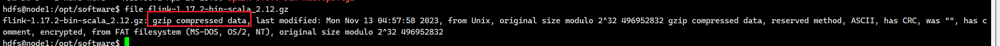

    可以看到输出是 compressed data，说明压缩包被重新命名过，需要首先使用 gzip 来解压，然后再解压 tar 包

    ```bash
    gunzip flink-1.17.2-bin-scala_2.12.gz
    tar -xf flink-1.17.2-bin-scala_2.12
    ```

    ```bash
    FLINK_HOME=/opt/module/flink-1.17.2
    # 给定 flink 和 hadoop 链接的环境变量
    export HADOOP_CLASSPATH=$($HADOOP_HOME/bin/hadoop classpath)
    export HADOOP_CONF_DIR=$HADOOP_HOME/etc/hadoop
    ```

1. 准备 hadoop 和本地文件目录地址

    ```bash
    xcall all mkdir -p /opt/data/flink/tmp
    hdfs dfs -mkdir -p /bigdata/flink/ha/
    hdfs dfs -mkdir -p /bigdata/flink/checkpoints
    hdfs dfs -mkdir -p /bigdata/flink/savepoints
    hdfs dfs -mkdir -p /bigdata/flink/completed-jobs/
    ```

1. 修改配置文件 `$FLINK_HOME/conf/flink-conf.yaml`

    <details>

    ```bash
    ################################################################################
    #  Licensed to the Apache Software Foundation (ASF) under one
    #  or more contributor license agreements.  See the NOTICE file
    #  distributed with this work for additional information
    #  regarding copyright ownership.  The ASF licenses this file
    #  to you under the Apache License, Version 2.0 (the
    #  "License"); you may not use this file except in compliance
    #  with the License.  You may obtain a copy of the License at
    #
    #      http://www.apache.org/licenses/LICENSE-2.0
    #
    #  Unless required by applicable law or agreed to in writing, software
    #  distributed under the License is distributed on an "AS IS" BASIS,
    #  WITHOUT WARRANTIES OR CONDITIONS OF ANY KIND, either express or implied.
    #  See the License for the specific language governing permissions and
    # limitations under the License.
    ################################################################################


    #==============================================================================
    # Common
    #==============================================================================

    # JobManager RPC 地址（YARN 模式下会被覆盖，但保留有助于调试）
    jobmanager.rpc.address: node3

    # JobManager RPC 端口
    jobmanager.rpc.port: 6123

    # 绑定到所有网络接口（接受来自其他节点的连接）
    jobmanager.bind-host: 0.0.0.0

    # JobManager 进程总内存
    jobmanager.memory.process.size: 1024m

    # TaskManager 绑定地址
    taskmanager.bind-host: 0.0.0.0

    # TaskManager 主机名（YARN 会自动分配，此处可注释掉）
    # taskmanager.host: localhost

    # TaskManager 进程总内存
    taskmanager.memory.process.size: 1024m

    # 每个 TaskManager 提供的任务槽位数
    taskmanager.numberOfTaskSlots: 4

    # 默认并行度
    parallelism.default: 4

    #==============================================================================
    # High Availability (基于 ZooKeeper)
    #==============================================================================

    # 高可用模式
    high-availability.type: zookeeper

    # ZooKeeper 仲裁地址
    high-availability.zookeeper.quorum: node1:2181,node2:2181,node3:2181

    # 高可用元数据存储路径（HDFS）
    high-availability.storageDir: hdfs://hadoop/bigdata/flink/ha/

    # ZooKeeper 根路径
    high-availability.zookeeper.path.root: /flink

    # 集群 ID（用于 ZK 中区分多个 Flink 集群）
    high-availability.cluster-id: /flink-yarn-cluster

    # ZK ACL 模式（默认开放）
    high-availability.zookeeper.client.acl: open

    #==============================================================================
    # Fault tolerance and checkpointing
    #==============================================================================

    # 检查点间隔（每 3 分钟一次）
    execution.checkpointing.interval: 3min

    # 检查点模式（精确一次）
    execution.checkpointing.mode: EXACTLY_ONCE

    # 检查点超时时间
    execution.checkpointing.timeout: 10min

    # 同时进行的最大检查点数
    execution.checkpointing.max-concurrent-checkpoints: 1

    # 外部化检查点保留策略（任务取消时保留检查点）
    execution.checkpointing.externalized-checkpoint-retention: RETAIN_ON_CANCELLATION

    # 状态后端（使用 RocksDB）
    state.backend.type: rocksdb

    # 检查点存储路径
    state.checkpoints.dir: hdfs://hadoop/bigdata/flink/checkpoints

    # 保存点存储路径
    state.savepoints.dir: hdfs://hadoop/bigdata/flink/savepoints

    # 增量检查点（减少检查点开销）
    state.backend.incremental: true

    # 故障转移策略（只重启受影响的任务）
    jobmanager.execution.failover-strategy: region

    #==============================================================================
    # Rest & web frontend
    #==============================================================================

    # REST 端口
    rest.port: 8081

    # REST 客户端连接地址
    rest.address: 0.0.0.0

    # REST 绑定地址（接受来自外部的连接）
    rest.bind-address: 0.0.0.0

    # 允许从 Web UI 提交作业
    web.submit.enable: true

    # 允许从 Web UI 取消作业
    web.cancel.enable: true

    #==============================================================================
    # YARN
    #==============================================================================

    # 执行目标（YARN 应用模式）
    execution.target: yarn-application

    # YARN 应用名称
    yarn.application.name: FlinkCluster

    # 每个 YARN 容器的 vcores
    yarn.containers.vcores: 2

    # ApplicationMaster 最大重试次数（防止无限重试）
    yarn.application-attempts: 5

    # YARN 队列
    yarn.application.queue: default

    #==============================================================================
    # Advanced
    #==============================================================================

    # 临时文件目录
    io.tmp.dirs: /opt/data/flink/tmp

    # 类加载顺序（子优先，允许应用使用自己的依赖）
    classloader.resolve-order: child-first

    # 网络内存占比
    taskmanager.memory.network.fraction: 0.1
    taskmanager.memory.network.min: 64mb
    taskmanager.memory.network.max: 1gb

    #==============================================================================
    # HistoryServer
    #==============================================================================

    # 已完成的作业存档目录
    jobmanager.archive.fs.dir: hdfs://hadoop/bigdata/flink/completed-jobs/

    # HistoryServer Web 地址
    historyserver.web.address: 0.0.0.0

    # HistoryServer Web 端口
    historyserver.web.port: 8082

    # HistoryServer 监控的归档目录
    historyserver.archive.fs.dir: hdfs://hadoop/bigdata/flink/completed-jobs/

    # 刷新归档目录的间隔
    historyserver.archive.fs.refresh-interval: 10000
    ```

    </details>

1. 分发项目到节点上
1. 给定软连接

    ```bash
    ln -sf $HADOOP_HOME/share/hadoop/yarn/*.jar $FLINK_HOME/lib/
    ln -sf $HADOOP_HOME/share/hadoop/hdfs/*.jar $FLINK_HOME/lib/
    ln -sf $HADOOP_HOME/share/hadoop/common/*.jar $FLINK_HOME/lib/
    ln -sf $HADOOP_HOME/share/hadoop/common/lib/*.jar $FLINK_HOME/lib/
    ln -sf $HADOOP_HOME/share/hadoop/mapreduce/*.jar $FLINK_HOME/lib/
    ```

1. 在 node3 节点上执行命令，开启一个常驻的 flink 集群

    ```bash
    cd $FLINK_HOME && bin/yarn-session.sh -d
    ```

    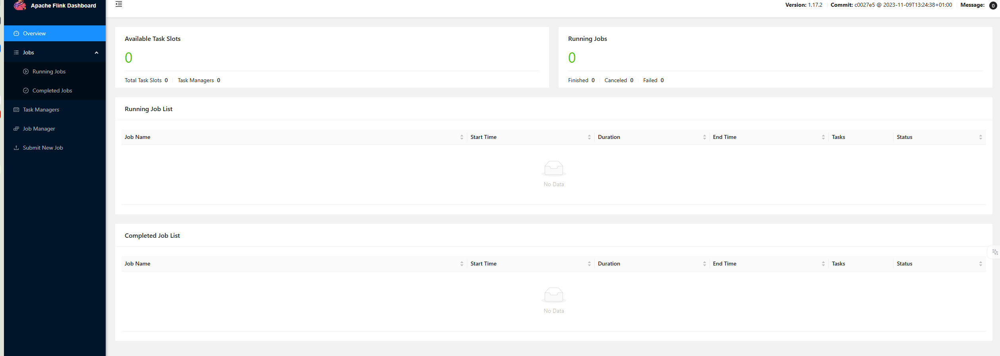

1. 新的群起脚本

    <details>

    ```bash
    #!/bin/bash
    
    # ======================== 集群配置（按实际情况修改） ========================
    NODE1="node1"
    NODE2="node2"
    NODE3="node3"
    NODE4="node4"
    NODE5="node5"
    
    # Hadoop 角色
    NN_NODES=("$NODE1" "$NODE2")            # NameNode 节点
    JN_NODES=("$NODE1" "$NODE2" "$NODE3")   # JournalNode 节点
    ZK_NODES=("$NODE1" "$NODE2" "$NODE3")   # ZooKeeper 节点
    DN_NODES=("$NODE4" "$NODE5")            # DataNode 节点
    NM_NODES=("$NODE4" "$NODE5")            # NodeManager 节点
    RM_NODES=("$NODE1" "$NODE2")            # ResourceManager 节点
    HS_NODE="$NODE1"                        # MapReduce JobHistoryServer 节点
    
    # Spark 角色
    SPARK_THRIFT_SERVER_NODES=("$NODE1" "$NODE2") # Spark Thrift Server 节点
    
    # NameNode 逻辑名称（必须与 hdfs-site.xml 一致）
    NN1_HOST="$NODE1"
    NN1_ID="nn1"
    NN2_HOST="$NODE2"
    NN2_ID="nn2"
    
    # Hive 角色
    METASTORE_NODES=("$NODE1" "$NODE2")
    
    # DolphinScheduler 角色
    DS_MASTER_NODES=("$NODE1" "$NODE2")         # Master 节点
    DS_API_NODES=("$NODE1" "$NODE2")            # API Server 节点
    DS_ALERT_NODES=("$NODE3")                   # Alert Server 节点
    DS_WORKER_NODES=("$NODE4" "$NODE5")         # Worker 节点
    
    # Flink 角色
    FLINK_NODES=("$NODE3")                       # Flink 提交节点（通常选一个即可）
    
    # Kafka KRaft 集群所有节点
    KAFKA_NODES=("$NODE3" "$NODE4" "$NODE5")
    
    # 颜色
    RED='\033[0;31m'
    GREEN='\033[0;32m'
    YELLOW='\033[1;33m'
    NC='\033[0m'
    
    print_msg()  { echo -e "${GREEN}[$1]${NC} $2"; }
    print_warn() { echo -e "${YELLOW}[$1]${NC} $2"; }
    print_error(){ echo -e "${RED}[$1]${NC} $2"; }
    
    # SSH 执行（source /etc/profile 获取环境变量）
    ssh_exec() {
        local node=$1; shift
        ssh -o StrictHostKeyChecking=no -o UserKnownHostsFile=/dev/null -o LogLevel=ERROR "$node" "
            source /etc/profile 2>/dev/null
            $*
        "
    }
    
    # ======================== ZooKeeper ========================
    start_zookeeper() {
        print_msg "ZK" "启动 ZooKeeper..."
        for node in "${ZK_NODES[@]}"; do
            ssh_exec "$node" "
                if [ -n \"\$ZOOKEEPER_HOME\" ]; then
                    \$ZOOKEEPER_HOME/bin/zkServer.sh start
                else
                    zkServer.sh start
                fi
            "
        done
        sleep 2
        print_msg "ZK" "ZooKeeper 启动完成"
    }
    
    stop_zookeeper() {
        print_msg "ZK" "停止 ZooKeeper..."
        for node in "${ZK_NODES[@]}"; do
            ssh_exec "$node" "
                if [ -n \"\$ZOOKEEPER_HOME\" ]; then
                    \$ZOOKEEPER_HOME/bin/zkServer.sh stop
                else
                    zkServer.sh stop
                fi
            "
        done
        print_msg "ZK" "ZooKeeper 已停止"
    }
    
    # ======================== HDFS ========================
    start_hdfs() {
        print_msg "HDFS" "启动 HDFS 组件..."
        print_msg "JN" "启动 JournalNode..."
        for node in "${JN_NODES[@]}"; do
            ssh_exec "$node" "\$HADOOP_HOME/bin/hdfs --daemon start journalnode"
        done
        sleep 2
    
        print_msg "NN" "启动 NameNode..."
        for node in "${NN_NODES[@]}"; do
            ssh_exec "$node" "\$HADOOP_HOME/bin/hdfs --daemon start namenode"
        done
        sleep 2
    
        print_msg "ZKFC" "启动 ZKFC..."
        for node in "${NN_NODES[@]}"; do
            ssh_exec "$node" "\$HADOOP_HOME/bin/hdfs --daemon start zkfc"
        done
        sleep 2
    
        print_msg "DN" "启动 DataNode..."
        for node in "${DN_NODES[@]}"; do
            ssh_exec "$node" "\$HADOOP_HOME/bin/hdfs --daemon start datanode"
        done
        sleep 2
    
        print_msg "HDFS" "HDFS 组件启动完成"
    }
    
    stop_hdfs() {
        print_msg "HDFS" "停止 HDFS 组件..."
        print_msg "ZKFC" "停止 ZKFC..."
        for node in "${NN_NODES[@]}"; do
            ssh_exec "$node" "\$HADOOP_HOME/bin/hdfs --daemon stop zkfc"
        done
    
        print_msg "NN" "停止 NameNode..."
        for node in "${NN_NODES[@]}"; do
            ssh_exec "$node" "\$HADOOP_HOME/bin/hdfs --daemon stop namenode"
        done
    
        print_msg "DN" "停止 DataNode..."
        for node in "${DN_NODES[@]}"; do
            ssh_exec "$node" "\$HADOOP_HOME/bin/hdfs --daemon stop datanode"
        done
    
        print_msg "JN" "停止 JournalNode..."
        for node in "${JN_NODES[@]}"; do
            ssh_exec "$node" "\$HADOOP_HOME/bin/hdfs --daemon stop journalnode"
        done
    
        print_msg "HDFS" "HDFS 组件已停止"
    }
    
    # ======================== YARN ========================
    start_yarn() {
        print_msg "YARN" "启动 YARN 组件..."
        print_msg "RM" "启动 ResourceManager..."
        for node in "${RM_NODES[@]}"; do
            ssh_exec "$node" "\$HADOOP_HOME/bin/yarn --daemon start resourcemanager"
        done
        sleep 2
    
        print_msg "NM" "启动 NodeManager..."
        for node in "${NM_NODES[@]}"; do
            ssh_exec "$node" "\$HADOOP_HOME/bin/yarn --daemon start nodemanager"
        done
        sleep 2
        print_msg "YARN" "YARN 组件启动完成"
    }
    
    stop_yarn() {
        print_msg "YARN" "停止 YARN 组件..."
        print_msg "RM" "停止 ResourceManager..."
        for node in "${RM_NODES[@]}"; do
            ssh_exec "$node" "\$HADOOP_HOME/bin/yarn --daemon stop resourcemanager"
        done
    
        print_msg "NM" "停止 NodeManager..."
        for node in "${NM_NODES[@]}"; do
            ssh_exec "$node" "\$HADOOP_HOME/bin/yarn --daemon stop nodemanager"
        done
        print_msg "YARN" "YARN 组件已停止"
    }
    
    # ======================== MapReduce HistoryServer ========================
    start_historyserver() {
        print_msg "HS" "启动 MapReduce HistoryServer..."
        ssh_exec "$HS_NODE" "\$HADOOP_HOME/bin/mapred --daemon start historyserver"
        print_msg "HS" "HistoryServer 启动完成"
    }
    
    stop_historyserver() {
        print_msg "HS" "停止 MapReduce HistoryServer..."
        ssh_exec "$HS_NODE" "\$HADOOP_HOME/bin/mapred --daemon stop historyserver"
        print_msg "HS" "HistoryServer 已停止"
    }
    
    # ======================== Hive Metastore ========================
    start_metastore() {
        print_msg "METASTORE" "启动 Metastore..."
        for node in "${METASTORE_NODES[@]}"; do
            ssh_exec "$node" "nohup \$HIVE_HOME/bin/hive --service metastore >/dev/null 2>&1 &"
        done
        sleep 4
        print_msg "METASTORE" "Metastore 启动完成"
    }
    
    stop_metastore() {
        print_msg "METASTORE" "停止 Metastore..."
        for node in "${METASTORE_NODES[@]}"; do
            ssh_exec "$node" "pkill -f 'org.apache.hadoop.hive.metastore.HiveMetaStore'"
        done
        print_msg "METASTORE" "Metastore 已停止"
    }
    
    # ======================== Spark ========================
    start_spark_thrift_server() {
        print_msg "SPARK THRIFT" "启动 Spark Thrift Server..."
        for node in "${SPARK_THRIFT_SERVER_NODES[@]}"; do
            ssh_exec "$node" "
                nohup \$SPARK_HOME/sbin/start-thriftserver.sh \
                    --master yarn \
                    --deploy-mode client \
                    --hiveconf hive.server2.thrift.port=10000 \
                    --hiveconf hive.server2.thrift.bind.host=0.0.0.0 >/dev/null 2>&1 &
            "
            sleep 3
        done
        sleep 5
        print_msg "SPARK THRIFT" "Spark Thrift Server 启动完成"
    }
    
    stop_spark_thrift_server() {
        print_msg "SPARK THRIFT" "停止 Spark Thrift Server..."
        for node in "${SPARK_THRIFT_SERVER_NODES[@]}"; do
            ssh_exec "$node" "pkill -f 'org.apache.spark.sql.hive.thriftserver.HiveThriftServer2'"
        done
        print_msg "SPARK THRIFT" "Spark Thrift Server 已停止"
    }
    
    # ======================== DolphinScheduler ========================
    start_ds_master() {
        print_msg "DS-MASTER" "启动 DolphinScheduler Master..."
        for node in "${DS_MASTER_NODES[@]}"; do
            ssh_exec "$node" "\$DS_HOME/bin/dolphinscheduler-daemon.sh start master-server"
        done
        sleep 2
        print_msg "DS-MASTER" "Master 启动完成"
    }
    
    stop_ds_master() {
        print_msg "DS-MASTER" "停止 DolphinScheduler Master..."
        for node in "${DS_MASTER_NODES[@]}"; do
            ssh_exec "$node" "\$DS_HOME/bin/dolphinscheduler-daemon.sh stop master-server"
        done
        print_msg "DS-MASTER" "Master 已停止"
    }
    
    start_ds_api() {
        print_msg "DS-API" "启动 DolphinScheduler API Server..."
        for node in "${DS_API_NODES[@]}"; do
            ssh_exec "$node" "\$DS_HOME/bin/dolphinscheduler-daemon.sh start api-server"
        done
        sleep 2
        print_msg "DS-API" "API Server 启动完成"
    }
    
    stop_ds_api() {
        print_msg "DS-API" "停止 DolphinScheduler API Server..."
        for node in "${DS_API_NODES[@]}"; do
            ssh_exec "$node" "\$DS_HOME/bin/dolphinscheduler-daemon.sh stop api-server"
        done
        print_msg "DS-API" "API Server 已停止"
    }
    
    start_ds_alert() {
        print_msg "DS-ALERT" "启动 DolphinScheduler Alert Server..."
        for node in "${DS_ALERT_NODES[@]}"; do
            ssh_exec "$node" "\$DS_HOME/bin/dolphinscheduler-daemon.sh start alert-server"
        done
        sleep 2
        print_msg "DS-ALERT" "Alert Server 启动完成"
    }
    
    stop_ds_alert() {
        print_msg "DS-ALERT" "停止 DolphinScheduler Alert Server..."
        for node in "${DS_ALERT_NODES[@]}"; do
            ssh_exec "$node" "\$DS_HOME/bin/dolphinscheduler-daemon.sh stop alert-server"
        done
        print_msg "DS-ALERT" "Alert Server 已停止"
    }
    
    start_ds_worker() {
        print_msg "DS-WORKER" "启动 DolphinScheduler Worker..."
        for node in "${DS_WORKER_NODES[@]}"; do
            ssh_exec "$node" "\$DS_HOME/bin/dolphinscheduler-daemon.sh start worker-server"
        done
        sleep 2
        print_msg "DS-WORKER" "Worker 启动完成"
    }
    
    stop_ds_worker() {
        print_msg "DS-WORKER" "停止 DolphinScheduler Worker..."
        for node in "${DS_WORKER_NODES[@]}"; do
            ssh_exec "$node" "\$DS_HOME/bin/dolphinscheduler-daemon.sh stop worker-server"
        done
        print_msg "DS-WORKER" "Worker 已停止"
    }
    
    # ======================== Flink on YARN ========================
    start_flink() {
        print_msg "FLINK" "启动 Flink YARN Session..."
    
        # 检查是否已经存在运行中的 Flink Session
        existing=$(yarn application -list -appStates RUNNING 2>/dev/null | grep "FlinkCluster" | awk '{print $1}')
        if [ -n "$existing" ]; then
            print_warn "FLINK" "Flink YARN Session 已在运行中 (Application ID: $existing)，跳过启动"
            return
        fi
    
        # 提交 Flink YARN Session
        ssh_exec "${FLINK_NODES[0]}" "\$FLINK_HOME/bin/yarn-session.sh -d"
        sleep 5
    
        # 验证是否启动成功
        app_id=$(yarn application -list -appStates RUNNING 2>/dev/null | grep "FlinkCluster" | awk '{print $1}')
        if [ -n "$app_id" ]; then
            print_msg "FLINK" "Flink YARN Session 启动成功 (Application ID: $app_id)"
        else
            print_error "FLINK" "Flink YARN Session 启动失败，请检查日志"
        fi
    }
    
    stop_flink() {
        print_msg "FLINK" "停止 Flink YARN Session..."
    
        # 查找运行中的 Flink Session
        app_id=$(yarn application -list -appStates RUNNING 2>/dev/null | grep "FlinkCluster" | awk '{print $1}')
    
        if [ -z "$app_id" ]; then
            print_warn "FLINK" "未找到运行中的 Flink YARN Session"
            return
        fi
    
        # 停止 Flink Session
        yarn application -kill "$app_id"
        sleep 3
    
        # 验证是否已停止
        still_running=$(yarn application -list -appStates RUNNING 2>/dev/null | grep "$app_id")
        if [ -z "$still_running" ]; then
            print_msg "FLINK" "Flink YARN Session 已停止 (Application ID: $app_id)"
        else
            print_error "FLINK" "Flink YARN Session 停止失败，请手动执行: yarn application -kill $app_id"
        fi
    }
    
    
    # ======================== DolphinScheduler ========================
    start_ds() {
        start_ds_master
        start_ds_api
        start_ds_alert
        start_ds_worker
        print_msg "DS-ALL" "DolphinScheduler 全部组件启动完成"
    }
    
    stop_ds() {
        stop_ds_worker
        stop_ds_alert
        stop_ds_api
        stop_ds_master
        print_msg "DS-ALL" "DolphinScheduler 全部组件已停止"
    }
    
    # ======================== Kafka ========================
    start_kafka() {
        print_msg "KAFKA" "启动 Kafka 集群..."
        for node in "${KAFKA_NODES[@]}"; do
            print_msg "KAFKA" "启动 $node 上的 Kafka Broker"
            ssh_exec "$node" "\$KAFKA_HOME/bin/kafka-server-start.sh -daemon \$KAFKA_HOME/config/kraft/server.properties"
        done
        sleep 5
        print_msg "KAFKA" "Kafka 集群启动完成"
    }
    
    stop_kafka() {
        print_msg "KAFKA" "停止 Kafka 集群..."
        for node in "${KAFKA_NODES[@]}"; do
            print_msg "KAFKA" "停止 $node 上的 Kafka Broker"
            ssh_exec "$node" "pkill -f 'kafka.Kafka'"
        done
        sleep 3
        print_msg "KAFKA" "Kafka 集群已停止"
    }
    
    # ======================== 全局启停 ========================
    start_all() {
        start_zookeeper
        start_hdfs
        start_yarn
        start_historyserver
        start_metastore
        start_spark
        start_spark_thrift_server
        start_kafka
        start_flink
        start_ds
        print_msg "ALL" "全部服务已启动"
    }
    
    stop_all() {
        stop_spark_thrift_server
        stop_spark
        stop_metastore
        stop_historyserver
        stop_flink
        stop_kafka
        stop_yarn
        stop_hdfs
        stop_zookeeper
        stop_ds
        print_msg "ALL" "全部服务已停止"
    }
    
    # ======================== 状态检查 ========================
    check_status() {
        echo -e "${GREEN}==================== 集群状态 ====================${NC}"
    
        # --- ZooKeeper ---
        print_msg "ZK" "ZooKeeper:"
        for node in "${ZK_NODES[@]}"; do
            out=$(ssh_exec "$node" "jps 2>/dev/null | grep QuorumPeerMain")
            if [ -n "$out" ]; then
                echo -e "  $node : ${GREEN}$out${NC}"
            else
                echo -e "  $node : ${RED}未运行${NC}"
            fi
        done
    
        # --- HDFS ---
        print_msg "HDFS" "HDFS 进程:"
        all_hdfs_nodes=($(printf "%s\n" "${NN_NODES[@]}" "${JN_NODES[@]}" "${DN_NODES[@]}" | sort -u))
        for node in "${all_hdfs_nodes[@]}"; do
            out=$(ssh_exec "$node" "jps 2>/dev/null | grep -E 'NameNode|DataNode|JournalNode|DFSZKFailoverController'")
            if [ -n "$out" ]; then
                echo -e "  ${GREEN}$node${NC}:"
                echo "$out" | while read line; do echo -e "    ${GREEN}$line${NC}"; done
            else
                echo -e "  ${RED}$node${NC}: 无 HDFS 进程"
            fi
        done
    
        # HA 状态
        print_msg "HA" "NameNode HA 状态:"
        nn1_state=$(ssh_exec "${NN1_HOST}" "\$HADOOP_HOME/bin/hdfs haadmin -getServiceState $NN1_ID 2>/dev/null")
        nn2_state=$(ssh_exec "${NN2_HOST}" "\$HADOOP_HOME/bin/hdfs haadmin -getServiceState $NN2_ID 2>/dev/null")
        if [ "$nn1_state" == "active" ]; then
            echo -e "  $NN1_HOST ($NN1_ID) : ${GREEN}active${NC}"
            echo -e "  $NN2_HOST ($NN2_ID) : ${YELLOW}standby${NC}"
        elif [ "$nn2_state" == "active" ]; then
            echo -e "  $NN1_HOST ($NN1_ID) : ${YELLOW}standby${NC}"
            echo -e "  $NN2_HOST ($NN2_ID) : ${GREEN}active${NC}"
        else
            echo -e "  ${RED}无法获取 HA 状态（集群可能未初始化）${NC}"
        fi
    
        # --- YARN ---
        local yarn_online=false
        print_msg "YARN" "YARN 进程:"
        all_yarn_nodes=($(printf "%s\n" "${RM_NODES[@]}" "${NM_NODES[@]}" | sort -u))
        for node in "${all_yarn_nodes[@]}"; do
            out=$(ssh_exec "$node" "jps 2>/dev/null | grep -E 'ResourceManager|NodeManager'")
            if [ -n "$out" ]; then
                yarn_online=true
                echo -e "  ${GREEN}$node${NC}:"
                echo "$out" | while read line; do echo -e "    ${GREEN}$line${NC}"; done
            else
                echo -e "  ${RED}$node${NC}: 无 YARN 进程"
            fi
        done
    
        # --- MapReduce HistoryServer ---
        print_msg "HS" "MapReduce HistoryServer:"
        out=$(ssh_exec "$HS_NODE" "jps 2>/dev/null | grep JobHistoryServer")
        if [ -n "$out" ]; then
            echo -e "  $HS_NODE : ${GREEN}$out${NC}"
        else
            echo -e "  $HS_NODE : ${RED}未运行${NC}"
        fi
    
        # --- Hive Metastore ---
        print_msg "META" "Hive Metastore:"
        for node in "${METASTORE_NODES[@]}"; do
            out=$(ssh_exec "$node" "ps -ef | grep -v grep | grep 'org.apache.hadoop.hive.metastore.HiveMetaStore'")
            if [ -n "$out" ]; then
                echo -e "  $node : ${GREEN}运行中${NC}"
            else
                echo -e "  $node : ${RED}未运行${NC}"
            fi
        done
    
        # --- Spark Thrift Server ---
        print_msg "SPARK THRIFT" "Spark Thrift Server:"
        for node in "${SPARK_THRIFT_SERVER_NODES[@]}"; do
            out=$(ssh_exec "$node" "jps 2>/dev/null | grep SparkSubmit")
            if [ -n "$out" ]; then
                echo -e "  $node : ${GREEN}运行中${NC}"
            else
                echo -e "  $node : ${RED}未运行${NC}"
            fi
        done
    
        # --- Flink on YARN ---
        print_msg "FLINK" "Flink on YARN:"
        if $yarn_online; then
            flink_app=$(timeout 10 yarn application -list -appStates RUNNING 2>/dev/null | grep "FlinkCluster")
            if [ -n "$flink_app" ]; then
                app_id=$(echo "$flink_app" | awk '{print $1}')
                app_status=$(echo "$flink_app" | awk '{print $6}')
                web_ui=$(echo "$flink_app" | awk '{print $10}')
                echo -e "  Application ID : ${GREEN}$app_id${NC}"
                echo -e "  状态           : ${GREEN}$app_status${NC}"
                echo -e "  Web UI         : ${GREEN}$web_ui${NC}"
            else
                echo -e "  ${YELLOW}Flink Session 未启动${NC}"
            fi
        else
            echo -e "  ${YELLOW}YARN 离线，跳过 Flink 状态检查${NC}"
        fi
    
    
        # --- Kafka ---
        print_msg "KAFKA" "Kafka 进程:"
        for node in "${KAFKA_NODES[@]}"; do
            out=$(ssh_exec "$node" "jps 2>/dev/null | grep Kafka")
            if [ -n "$out" ]; then
                echo -e "  $node : ${GREEN}$out${NC}"
            else
                echo -e "  $node : ${RED}未运行${NC}"
            fi
        done
    
        # --- DolphinScheduler ---
        print_msg "DS" "DolphinScheduler 进程:"
        # 合并所有 DS 节点并去重
        all_ds_nodes=($(printf "%s\n" "${DS_MASTER_NODES[@]}" "${DS_API_NODES[@]}" "${DS_ALERT_NODES[@]}" "${DS_WORKER_NODES[@]}" | sort -u))
        for node in "${all_ds_nodes[@]}"; do
            out=$(ssh_exec "$node" "jps 2>/dev/null | grep -E 'MasterServer|ApiApplicationServer|AlertServer|WorkerServer'")
            if [ -n "$out" ]; then
                echo -e "  ${GREEN}$node${NC}:"
                echo "$out" | while read line; do echo -e "    ${GREEN}$line${NC}"; done
            else
                echo -e "  ${RED}$node${NC}: 无 DS 进程"
            fi
        done
    }
    
    # ======================== 命令入口 ========================
    case "$1" in
        start-zookeeper)    start_zookeeper    ;;
        stop-zookeeper)     stop_zookeeper     ;;
        start-hdfs)         start_hdfs         ;;
        stop-hdfs)          stop_hdfs          ;;
        start-yarn)         start_yarn         ;;
        stop-yarn)          stop_yarn          ;;
        start-historyserver) start_historyserver ;;
        stop-historyserver)  stop_historyserver  ;;
        start-metastore)    start_metastore    ;;
        stop-metastore)     stop_metastore     ;;
        start-spark)        start_spark        ;;   # 已保留，但默认不启动独立 Worker
        stop-spark)         stop_spark         ;;
        start-spark-thrift) start_spark_thrift_server ;;
        stop-spark-thrift)  stop_spark_thrift_server  ;;
        start-ds-master)    start_ds_master    ;;
        stop-ds-master)     stop_ds_master     ;;
        start-ds-api)       start_ds_api       ;;
        stop-ds-api)        stop_ds_api        ;;
        start-ds-alert)     start_ds_alert     ;;
        stop-ds-alert)      stop_ds_alert      ;;
        start-ds-worker)    start_ds_worker    ;;
        stop-ds-worker)     stop_ds_worker     ;;
        start-ds)           start_ds           ;;
        stop-ds)            stop_ds            ;;
        start-kafka)        start_kafka        ;;
        stop-kafka)         stop_kafka         ;;
        start-flink)        start_flink        ;;
        stop-flink)         stop_flink         ;;
        start-all)          start_all          ;;
        stop-all)           stop_all           ;;
        restart-all)        stop_all; sleep 3; start_all ;;
        status)             check_status       ;;
        *)
            echo "用法: $0 <命令>"
            echo "  分组件启停:"
            echo "    start-zookeeper | stop-zookeeper"
            echo "    start-hdfs | stop-hdfs"
            echo "    start-yarn | stop-yarn"
            echo "    start-historyserver | stop-historyserver"
            echo "    start-metastore | stop-metastore"
            echo "    start-spark | stop-spark"
            echo "    start-spark-thrift | stop-spark-thrift"
            echo "    start-ds-master | stop-ds-master"
            echo "    start-ds-api | stop-ds-api"
            echo "    start-ds-alert | stop-ds-alert"
            echo "    start-ds-worker | stop-ds-worker"
            echo "    start-ds | stop-ds"
            echo "    start-kafka | stop-kafka"
            echo "    start-flink | stop-flink"
            echo "  全局管理:"
            echo "    start-all | stop-all | restart-all"
            echo "    status"
            exit 1
            ;;
    esac
    ```

    </details>

### Kerberos 鉴权（单用户 HDFS 测试验证）

kerberos 鉴权是生产环境中重要的安全机制

1. 搭建 kdc 并且创建测试用户，并且使用 kinit 验证
1. zookeeper 集成 kerberos
1. hdfs 集成 kerberos (NameNode + DataNode)
1. yarn 集成 kerberos (ResourceManager + NodeManager)
1. hive metastore 集成 kerberos
1. spark thrift server 集成 kerberos
1. kafka 集成 kerberos (Kraft)
1. flink on yarn 集成 kerberos
1. dolphin scheduler 集成 kerberos
1. 验证链路

#### kerberos kdc

KDC（密钥分发中心）是 kerberos 的认证服务器，后续所有的配置都依赖它存在

没有 kdc，那么 hadoop、hive、spark 的 kerberos 集成都无法验证，而且 kdc 配置简单，跑起来之后就是按部就班给各个服务生成 keytab 并且修改配置

角色分配：

- node1: KDC 主服务器
- node2 - node5：kerberos 客户端

关键信息规划:

| 项目       | 值            | 说明                                                 |
| ---------- | ------------- | ---------------------------------------------------- |
| Realm      | HADOOP.COM    | 域名，相当于“认证域”，生产用公司域名，测试自定义即可 |
| KDC 主机   | node1         | KDC 服务器所在节点                                   |
| Admin 主体 | hdfs/admin    | 管理员账号，用现有的 hdfs 用户                       |
| 域内主机   | node1 ~ node5 | 需要参与认证的所有节点                               |


1. 在 node1 上安装 KDC 服务

    ```bash
    # 安装 Kerberos 服务端和客户端
    sudo apt update
    sudo apt install -y krb5-kdc krb5-admin-server krb5-user

    # 安装过程中会弹出配置界面，按以下填写：
    # Default Kerberos version 5 realm: HADOOP.COM
    # Kerberos servers for your realm: node1
    # Administrative server for your Kerberos realm: node1
    ```

    若填写错误，后续可编辑 `/etc/krb5.conf` 做配置

    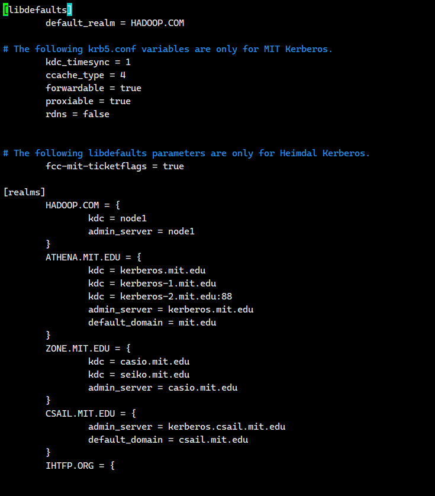

1. 配置 `/etc/krb5.conf`

    修改为以下内容，之前的默认配置全部删除不要，注意，这个配置不需要注释，所以真实不要加上这个注释

    <details>

    ```bash
    [libdefaults]
        # 允许 Kerberos 协议层面的时间同步校准
        kdc_timesync = 1
        # 默认的认证域，不指定时自动使用这个
        default_realm = HADOOP.COM
        # 是否通过 DNS 查找 Realm，内网测试关闭
        dns_lookup_realm = false
        # 是否通过 DNS 查找 KDC 地址，内网测试关闭
        dns_lookup_kdc = false
        # 票据有效期，24小时
        ticket_lifetime = 24h
        # 票据可续期的最大时长，7天，之后必须重新 kinit
        renew_lifetime = 7d
        # 票据是否可转发（SSH 跳板需要），后续 SSH 跳板、Spark 任务提交都需要
        forwardable = true
        # 是否反向解析主机名，关闭可避免 DNS 问题，避免 DNS 没配好导致认证失败
        rdns = false
    
    [realms]
        HADOOP.COM = {
            # KDC 服务器的地址和端口，88 是标准端口
            kdc = node1:88
            # 管理服务器的地址和端口，749 是标准端口，用于 kadmin 远程管理
            admin_server = node1:749
            # 默认域名
            default_domain = HADOOP.COM
        }
    
    [domain_realm]
        # 将域名映射到 Realm，自动映射，不用每个节点单独配置
        .hadoop.com = HADOOP.COM
        # 精确域名映射
        hadoop.com = HADOOP.COM
    
    [logging]
        kdc = FILE:/var/log/krb5kdc.log
        admin_server = FILE:/var/log/kadmin.log
        default = FILE:/var/log/krb5lib.log
    ```

    </details>

1. 仅仅 node1 这个 KDC 服务器节点配置 `/etc/krb5kdc/kdc.conf`

    注意，配置文件不支持注释，所以真实配置文件中不要加注释

    <details>

    ```bash
    [kdcdefaults]
        # KDC 监听的端口号，88 是 Kerberos 标准端口（IANA 分配给 Kerberos 的官方端口）
        kdc_ports = 88
    
    [realms]
        HADOOP.COM = {
            # KDC 数据库文件的存放路径
            # 这个文件里存着所有用户主体（Principal）和密码的哈希值，是 KDC 的核心数据文件
            database_name = /var/lib/krb5kdc/principal
    
            # KDC 自己的管理员 keytab 文件路径
            # keytab 相当于密码文件，KDC 自己也需要用这个文件来认证自己的身份
            admin_keytab = FILE:/etc/krb5kdc/kadm5.keytab
    
            # 管理员 ACL（访问控制列表）文件路径
            # 这个文件决定了哪些 Principal 有权限远程管理 KDC（创建主体、修改密码等）
            acl_file = /etc/krb5kdc/kadm5.acl
    
            # 主密钥缓存文件路径
            # 初始化 KDC 数据库时，会设置一个 Master Password，它被缓存到这个文件里
            # 有了这个文件，KDC 启动时不需要人工输入密码，自动解密数据库
            key_stash_file = /etc/krb5kdc/stash
    
            # KDC 监听的端口号（与 [kdcdefaults] 中一致）
            kdc_ports = 88
    
            # 票据的最大有效期
            # 一个 TGT（票据授予票据）最多能活多久，超过这个时间必须重新 kinit
            # 24h 表示 24 小时，生产环境通常设 24h，太长了不安全，太短了频繁重认证
            max_life = 24h
    
            # 票据的最大可续期时长
            # 如果票据过期了，但还没超过这个时间，可以拿旧票据去续期，不用重新输入密码
            # 7d 表示 7 天，超过 7 天就必须重新 kinit
            max_renewable_life = 7d
    
            # 支持的加密算法列表
            # 必须显式指定，否则 JDK 8 可能降级到不安全的 DES 算法（已经被破解）
            # aes256-cts 是目前最安全的，aes128-cts 是备用方案
            # :normal 表示这是常规加密，不是特殊用途的加密
            supported_enctypes = aes256-cts:normal aes128-cts:normal
    
            # 默认的主体标志
            # +preauth 表示启用“预认证”（Pre-authentication）
            # 简单说：客户端必须先证明自己知道密码，才能申请票据
            # 这能防止攻击者离线暴力破解用户的密码哈希
            default_principal_flags = +preauth
        }
    ```

    </details>

1. 在 KDC 服务器节点上配置管理员权限

    ```bash
    sudo vim /etc/krb5kdc/kadm5.acl
    # 内容如下，表示所有 /admin 结尾的主题都有完整管理权限
    */admin@HADOOP.COM    *
    ```

1. KDC 服务器节点上初始化 KDC 数据库

    ```bash
    # 创建 KDC 数据库，设置主密码（请记住，后续需用到），这里设置为了 `hdfs123`
    sudo krb5_newrealm
    ```

1. KDC 服务器节点上启动 KDC 服务

    ```bash
    # 启动 KDC 服务
    sudo systemctl enable krb5-kdc
    sudo systemctl start krb5-kdc

    # 启动管理服务
    sudo systemctl enable krb5-admin-server
    sudo systemctl start krb5-admin-server

    # 检查服务状态
    sudo systemctl status krb5-kdc
    sudo systemctl status krb5-admin-server
    ```

1. KDC 服务器节点上创建管理员主体

    ```bash
    # 进入 kadmin.local 交互式命令行
    sudo kadmin.local

    # 在 kadmin 命令行中执行：
    addprinc hdfs/admin
    # 输入密码两次（建议设为 hdfs123，测试用）

    addprinc root/admin
    # 输入密码两次

    # 查看已创建的主体
    listprincs

    # 退出
    quit
    ```

1. 验证 KDC 是否正常工作

    ```bash
    # 获取 hdfs/admin 的 TGT（票据授予票据）
    kinit hdfs/admin
    # 输入密码

    # 查看当前持有的票据
    # 如果 klist 显示了票据信息，说明 KDC 搭建成功。
    klist

    # 销毁当前票据
    kdestroy
    ```

    ```bash
    hdfs@node1:/opt/module/flink-1.17.2/conf$ sudo kadmin.local -q "listprincs"
    Authenticating as principal root/admin@HADOOP.COM with password.
    K/M@HADOOP.COM
    hdfs/admin@HADOOP.COM
    kadmin/admin@HADOOP.COM
    kadmin/changepw@HADOOP.COM
    krbtgt/HADOOP.COM@HADOOP.COM
    root/admin@HADOOP.COM
    hdfs@node1:/opt/module/flink-1.17.2/conf$ 
    ```

    | 主体                         | 用途                                     |
    | ---------------------------- | ---------------------------------------- |
    | K/M@HADOOP.COM               | KDC 主密钥主体，自动创建，不用管         |
    | hdfs/admin@HADOOP.COM        | 管理员主体，后续所有 Kerberos 管理都用它 |
    | kadmin/admin@HADOOP.COM      | KDC管理服务自己的主体，自动创建          |
    | kadmin/changepw@HADOOP.COM   | 密码修改服务主体，自动创建               |
    | krbtgt/HADOOP.COM@HADOOP.COM | TGT 签发主体，KDC  核心，自动创建        |
    | root/admin@HADOOP.COM        | 备用管理员主体                           |

1. 验证 kdc 是否正常工作

    ```bash
    # 获取 hdfs/admin 的 TGT 票据
    kinit hdfs/admin

    # 查看当前持有的票据
    klist

    # 销毁当前票据
    kdestroy
    ```

1. 在 node2 - node5 上安装 kerberos client

    ```bash
    # 在 node2 ~ node5 上分别执行
    sudo apt update
    sudo apt install -y krb5-user
    ```

    安装过程中会弹出配置界面，按以下填写：

    Default Kerberos version 5 realm: HADOOP.COM

    Kerberos servers for your realm: node1

    Administrative server for your Kerberos realm: node1

    或者可以先跳过，之后直接下发 `/etc/krb5.conf` 到各个节点

1. 同步 `/etc/krb5.conf` 配置到所有节点
1. 在每个客户端上分别验证

    ```bash
    kinit hdfs/admin
    # 输入密码

    klist
    kdestroy
    ```

    验证完毕后，服务就已经装完了，下一步就是集成

#### Zookeeper 集成 Kerberos

1. 在 KDC 服务器上执行 

    ```bash
    # 进入 kdadmin.local
    sudo kadmin.local

    # 在交互式命令行中，为每个 zk 节点创建主体 principal
    addprinc -randkey zookeeper/node1@HADOOP.COM
    addprinc -randkey zookeeper/node2@HADOOP.COM
    addprinc -randkey zookeeper/node3@HADOOP.COM

    # 导出 keytab 文件
    ktadd -k /tmp/zookeeper-node1.keytab zookeeper/node1@HADOOP.COM
    ktadd -k /tmp/zookeeper-node2.keytab zookeeper/node2@HADOOP.COM
    ktadd -k /tmp/zookeeper-node3.keytab zookeeper/node3@HADOOP.COM

    # 退出
    quit
    ```

    -randkey：随机生成密钥（比手动输入密码更安全）

    zookeeper/node1：主体的命名格式为 服务名/主机名

1. 将 keytab 分发给对应的各个节点

    ```bash
    sudo xcall all mkdir -p /etc/security/keytabs
    
    # 分发给各个 zookeeper 节点
    sudo scp /tmp/zookeeper-node1.keytab node1:/etc/security/keytabs/zookeeper.keytab
    sudo scp /tmp/zookeeper-node2.keytab node2:/etc/security/keytabs/zookeeper.keytab
    sudo scp /tmp/zookeeper-node3.keytab node3:/etc/security/keytabs/zookeeper.keytab

    # 修改权限
    sudo chown -R hdfs:hadoop /etc/security/keytabs
    
    # 文件必须是 400，否则会报错
    sudo chmod 400 /etc/security/keytabs/zookeeper.keytab
    ```

1. 配置 zookeeper JAAS 配置认证文件

    ```bash
    sudo vim $ZOOKEEPER/conf/zk_server_jaas.conf
    ```

    内容如下，注意：这里的 principal 给到的是 node1 主体，而每个 zookeeper 节点上都需要进行修改其为对应的主体，比如 `zookeeper/node2@HADOOP.COM` `zookeeper/node3@HADOOP.COM`

    <details>

    ```bash
    Server {
        com.sun.security.auth.module.Krb5LoginModule required
        useKeyTab=true
        keyTab="/etc/security/keytabs/zookeeper.keytab"
        storeKey=true
        useTicketCache=false
        principal="zookeeper/node1@HADOOP.COM";
    };

    Client {
        com.sun.security.auth.module.Krb5LoginModule required
        useKeyTab=true
        keyTab="/etc/security/keytabs/zookeeper.keytab"
        principal="zookeeper/node1@HADOOP.COM";
    };
    ```

    </details>

1. 在 zookeeper 中启用临时性的 `zk_server_jaas.conf`

    ```bash
    sudo vim $ZOOKEEPER_HOME/conf/zookeeper-env.sh
    ```

    内容如下，SERVER_JVMFLAGS 和 CLIENT_JVMFLAGS 为方便调试使用

    ```bash
    source /etc/profile
    export SERVER_JVMFLAGS="-Djava.security.auth.login.config=${ZOOKEEPER_HOME}/conf/zk_server_jaas.conf"
    export CLIENT_JVMFLAGS="-Djava.security.auth.login.config=${ZOOKEEPER_HOME}/conf/zk_server_jaas.conf"
    export SERVER_JVMFLAGS="$SERVER_JVMFLAGS -Dsun.security.krb5.debug=true"
    export CLIENT_JVMFLAGS="$CLIENT_JVMFLAGS -Dsun.security.krb5.debug=true"
    ```

    这里的配置文件必须和之前的 `$ZOOKEEPER/conf/zk_server_jaas.conf` 路径一致

    ```bash
    sudo xsync node1 node2 node3 /opt/module/apache-zookeeper-3.8.6-bin/conf/zookeeper-env.sh
    xcall node1 node2 node3 "sudo chown hdfs:hadoop /opt/module/apache-zookeeper-3.8.6-bin/conf/zookeeper-env.sh"
    ```

    `zoo.cfg` 为

    <details>

    ```text
    dataDir=/opt/data/zookeeper
    server.1=node1:2888:3888
    server.2=node2:2888:3888
    server.3=node3:2888:3888
    # the port at which the clients will connect
    clientPort=2181

    # ==================== Kerberos 认证配置 ====================
    # 启用 Kerberos 认证，每个节点上都写 authProvider.1 即可
    authProvider.1=org.apache.zookeeper.server.auth.SASLAuthenticationProvider
    jaasLoginRenew=3600000
    kerberos.removeHostFromPrincipal=true
    kerberos.removeRealmFromPrincipal=true
    ```

    </details>

1. 启动 zookeeper `hadoop-ha-manage.sh start-zookeeper`
1. 分别在 zookeeper 节点上进行如下内容检验，若能执行，则说明 kerberos 认证已生效

    ```bash
    # 先获取 Kerberos 票据
    kinit hdfs/admin

    # 连接 ZK
    $ZOOKEEPER_HOME/bin/zkCli.sh -server node1:2181

    # 在 ZK 客户端中执行
    ls /

    # 退出
    quit
    ```

#### HADOOP 集成 kerberos

##### HDFS 集成 kerberos

1. 在 KDC 服务器上执行

    ```bash
    sudo kadmin.local

    # 为 NameNode 生成 keytab（包含两个 NameNode 节点的 principal）
    addprinc -randkey hdfs-nn/node1@HADOOP.COM
    addprinc -randkey hdfs-nn/node2@HADOOP.COM
    ktadd -k /etc/security/keytabs/hdfs-nn.keytab hdfs-nn/node1@HADOOP.COM hdfs-nn/node2@HADOOP.COM

    # 为 DataNode 生成 keytab（包含所有 DataNode 节点）
    addprinc -randkey hdfs-dn/node1@HADOOP.COM
    addprinc -randkey hdfs-dn/node2@HADOOP.COM
    addprinc -randkey hdfs-dn/node3@HADOOP.COM
    addprinc -randkey hdfs-dn/node4@HADOOP.COM
    addprinc -randkey hdfs-dn/node5@HADOOP.COM
    ktadd -k /etc/security/keytabs/hdfs-dn.keytab hdfs-dn/node1@HADOOP.COM hdfs-dn/node2@HADOOP.COM hdfs-dn/node3@HADOOP.COM hdfs-dn/node4@HADOOP.COM hdfs-dn/node5@HADOOP.COM

    # 为 JournalNode 生成 keytab（包含三个 JournalNode 节点）
    addprinc -randkey hdfs-jn/node1@HADOOP.COM
    addprinc -randkey hdfs-jn/node2@HADOOP.COM
    addprinc -randkey hdfs-jn/node3@HADOOP.COM
    ktadd -k /etc/security/keytabs/hdfs-jn.keytab hdfs-jn/node1@HADOOP.COM hdfs-jn/node2@HADOOP.COM hdfs-jn/node3@HADOOP.COM

    # 为 WEB UI HTTP 生成 keytab
    addprinc -randkey HTTP/node1@HADOOP.COM
    addprinc -randkey HTTP/node2@HADOOP.COM
    ktadd -k /etc/security/keytabs/http.keytab HTTP/node1@HADOOP.COM HTTP/node2@HADOOP.COM

    quit
    ```

    同步到所有节点，并给予权限

    ```bash
    sudo xsync node1 node2 node3 /etc/security/keytabs/hdfs-jn.keytab
    sudo xsync node1 node2 node3 /etc/security/keytabs/hdfs-nn.keytab
    sudo xsync node1 node2 /etc/security/keytabs/http.keytab
    sudo xsync all ls -la /etc/security/keytabs/hdfs-dn.keytab

    xcall all sudo chown hdfs:hadoop /etc/security/keytabs/hdfs-*.keytab
    xcall node1 node2 "sudo chown hdfs:hadoop /etc/security/keytabs/http*.keytab"
    xcall all sudo ls -la /etc/security/keytabs
    ```


1. 给每个节点上都生成 SSL 证书，用于 HTTPS

    使用 `sudo` 权限执行脚本，分发 SSL 证书，真实环境下可以直接使用企业内部发放的证书

    <details>

    ```
    #!/bin/bash
    # ======================== 配置变量 ========================
    CA_DIR="/etc/security/ca"
    KEYSTORE_DIR="/etc/security/keytabs"
    PASSWORD="hdfs123"
    VALIDITY_DAYS=3650
    BASE_CN="Hadoop Cluster CA"
    JAVA_HOME=/opt/module/jdk1.8.0_202

    NODES=("node1" "node2" "node3" "node4" "node5")

    sudo mkdir -p $CA_DIR $KEYSTORE_DIR
    cd $CA_DIR

    # 1. 生成根 CA（如果不存在才生成，避免重复）
    if [ ! -f ca.key ]; then
        echo "生成根 CA..."
        sudo openssl genrsa -out ca.key 2048
        sudo openssl req -new -x509 -days $VALIDITY_DAYS -key ca.key -out ca.crt -subj "/CN=$BASE_CN/O=Hadoop/C=CN"
    else
        echo "根 CA 已存在，跳过生成"
    fi

    # 2. 为每个节点生成 PKCS12 格式的 keystore（直接就是 PKCS12，不再转换 JKS）
    for node in "${NODES[@]}"; do
        echo "生成 $node 证书..."
        sudo openssl req -new -newkey rsa:2048 -nodes \
            -keyout $KEYSTORE_DIR/${node}.key \
            -out $CA_DIR/${node}.csr \
            -subj "/CN=$node/O=Hadoop/C=CN"

        sudo openssl x509 -req -days $VALIDITY_DAYS \
            -in $CA_DIR/${node}.csr \
            -CA ca.crt -CAkey ca.key \
            -set_serial 0x$(openssl rand -hex 8) \
            -out $KEYSTORE_DIR/${node}.crt

        # 直接生成 PKCS12 keystore（不再经过 JKS）
        sudo openssl pkcs12 -export -legacy \
            -in $KEYSTORE_DIR/${node}.crt \
            -inkey $KEYSTORE_DIR/${node}.key \
            -out $KEYSTORE_DIR/${node}.keystore.p12 \
            -password pass:$PASSWORD \
            -name $node

        rm -f $CA_DIR/${node}.csr
    done

    # 3. 创建 PKCS12 信任库，如果已存在则先删除 cacert 别名再导入
    TRUSTSTORE="$KEYSTORE_DIR/truststore.p12"
    # 如果 truststore 文件已存在，先删除旧的 cacert 条目（如果有）
    if [ -f "$TRUSTSTORE" ]; then
        sudo $JAVA_HOME/bin/keytool -delete -alias cacert -keystore "$TRUSTSTORE" -storepass $PASSWORD -storetype PKCS12 2>/dev/null
    fi
    # 导入根 CA 证书
    sudo $JAVA_HOME/bin/keytool -import -trustcacerts \
        -alias cacert \
        -file ca.crt \
        -keystore "$TRUSTSTORE" \
        -storepass $PASSWORD \
        -storetype PKCS12 \
        -noprompt

    # 4. 设置权限
    sudo chown -R hdfs:hdfs $KEYSTORE_DIR
    sudo chmod 640 $KEYSTORE_DIR/*.p12 $KEYSTORE_DIR/*.key $KEYSTORE_DIR/*.crt

    echo "✅ 所有证书生成完成（PKCS12 格式）"
    echo "各节点的 keystore 文件："
    for node in "${NODES[@]}"; do
        echo "   $node : $KEYSTORE_DIR/${node}.keystore.p12"
    done
    echo "所有节点共用 truststore： $TRUSTSTORE"
    ```

    </details>

    设置权限

    ```bash
    xcall all sudo chown hdfs:hadoop /etc/security/keytabs/truststore.p12
    xcall all sudo chown hdfs:hadoop /etc/security/keytabs/keystore.p12
    ```

1. 修改配置文件

    `core-site.xml`

    <details>

    ```xml
    <?xml version="1.0" encoding="UTF-8"?>
    <?xml-stylesheet type="text/xsl" href="configuration.xsl"?>
    <!--
        Licensed under the Apache License, Version 2.0 (the "License");
        you may not use this file except in compliance with the License.
        You may obtain a copy of the License at

        http://www.apache.org/licenses/LICENSE-2.0

        Unless required by applicable law or agreed to in writing, software
        distributed under the License is distributed on an "AS IS" BASIS,
        WITHOUT WARRANTIES OR CONDITIONS OF ANY KIND, either express or implied.
        See the License for the specific language governing permissions and
        limitations under the License. See accompanying LICENSE file.
    -->

    <!-- Put site-specific property overrides in this file. -->
    <configuration>
        <!-- 定义 HDFS 的逻辑名称 -->
        <property>
            <name>fs.defaultFS</name>
            <value>hdfs://hadoop</value>
        </property>

        <!-- 数据目录 给定之前准备好的目录，生产需要指定到独立磁盘 -->
        <property>
            <name>hadoop.tmp.dir</name>
            <value>/opt/data/hadoop/hdfs</value>
        </property>

        <!-- ZooKeeper 集群地址 给定之前配置 zookeeper 的节点 用于 HA 协调 -->
        <property>
            <name>ha.zookeeper.quorum</name>
            <value>node1:2181,node2:2181,node3:2181</value>
        </property>

        <!-- 开启 hdfs 的代理身份 -->
        <property>
            <name>hadoop.proxyuser.hdfs.hosts</name>
            <value>*</value>
        </property>
        <property>
            <name>hadoop.proxyuser.hdfs.groups</name>
            <value>*</value>
        </property>
        <!-- 允许 HTTP 用户代理所有主机和用户组 -->
        <property>
            <name>hadoop.proxyuser.HTTP.hosts</name>
            <value>*</value>
        </property>
        <property>
            <name>hadoop.proxyuser.HTTP.groups</name>
            <value>*</value>
        </property>
        <!-- 允许 spark 用户代理任何主机上的任何用户 -->
        <property>
            <name>hadoop.proxyuser.spark.hosts</name>
            <value>*</value>
        </property>
        <property>
            <name>hadoop.proxyuser.spark.groups</name>
            <value>*</value>
        </property>
        <!-- 用户映射规则：将 HTTP 主体映射为 hdfs 用户 -->
        <property>
            <name>hadoop.security.auth_to_local</name>
            <value>
                RULE:[2:$1/$2@$0](hdfs/.*@HADOOP.COM)s/.*/hdfs/
                RULE:[2:$1/$2@$0](HTTP/.*@HADOOP.COM)s/.*/hdfs/
                RULE:[2:$1/$2@$0](yarn/.*@HADOOP.COM)s/.*/yarn/
                RULE:[2:$1/$2@$0](mapred/.*@HADOOP.COM)s/.*/mapred/
                RULE:[2:$1/$2@$0](jn/.*@HADOOP.COM)s/.*/hdfs/
                RULE:[2:$1/$2@$0](spark/.*@HADOOP.COM)s/.*/spark/
                DEFAULT
            </value>
        </property>

        <!-- 开启回收站，保留 1 天 -->
        <property>
            <name>fs.trash.interval</name>
            <value>1440</value>
        </property>

        <!-- Kerberos 认证 -->
        <property>
            <name>hadoop.security.authentication</name>
            <value>kerberos</value>
        </property>
        <property>
            <name>hadoop.security.authorization</name>
            <value>true</value>
        </property>

        <!-- 允许 hdfs 用户代理其他用户 -->
        <property>
            <name>hadoop.proxyuser.hdfs.hosts</name>
            <value>*</value>
        </property>
        <property>
            <name>hadoop.proxyuser.hdfs.groups</name>
            <value>*</value>
        </property>

        <!-- 启用 SSL -->
        <property>
            <name>hadoop.ssl.enabled</name>
            <value>true</value>
        </property>
        <property>
            <name>hadoop.ssl.server.conf</name>
            <value>ssl-server.xml</value>
        </property>
        <property>
            <name>hadoop.ssl.client.conf</name>
            <value>ssl-client.xml</value>
        </property>

    </configuration>
    ```

    </details>

    `hdfs-site.xml`

    <details>
    
    ```xml
    <?xml version="1.0" encoding="UTF-8"?>
    <?xml-stylesheet type="text/xsl" href="configuration.xsl"?>
    <!--
    Licensed under the Apache License, Version 2.0 (the "License");
    you may not use this file except in compliance with the License.
    You may obtain a copy of the License at

    http://www.apache.org/licenses/LICENSE-2.0

    Unless required by applicable law or agreed to in writing, software
    distributed under the License is distributed on an "AS IS" BASIS,
    WITHOUT WARRANTIES OR CONDITIONS OF ANY KIND, either express or implied.
    See the License for the specific language governing permissions and
    limitations under the License. See accompanying LICENSE file.
    -->

    <!-- Put site-specific property overrides in this file. -->
    <configuration>

    <!-- ==================== 基础配置 ==================== -->

    <!-- 副本数 -->
    <property>
        <name>dfs.replication</name>
        <value>3</value>
    </property>

    <!-- 定义 Nameservice ID (需与 core-site.xml 中的 fs.defaultFS 对应) -->
    <property>
        <name>dfs.nameservices</name>
        <value>hadoop</value>
    </property>

    <!-- 定义两个 NameNode 的别名 (nn1, nn2) -->
    <property>
        <name>dfs.ha.namenodes.hadoop</name>
        <value>nn1,nn2</value>
    </property>

    <!-- nn 的 RPC 地址 -->
    <property>
        <name>dfs.namenode.rpc-address.hadoop.nn1</name>
        <value>node1:8020</value>
    </property>
    <property>
        <name>dfs.namenode.rpc-address.hadoop.nn2</name>
        <value>node2:8020</value>
    </property>

    <!-- 集群 NameNode 元数据在 JournalNode 存放位置 目录 hadoop 为集群 id -->
    <property>
        <name>dfs.namenode.shared.edits.dir</name>
        <value>qjournal://node1:8485;node2:8485;node3:8485/hadoop</value>
    </property>

    <!-- NameNode 元数据在 JournalNode 的物理磁盘存放位置，生产需要指定独立磁盘 -->
    <property>
        <name>dfs.journalnode.edits.dir</name>
        <value>/opt/data/hadoop/journal</value>
    </property>

    <!-- 配置自动故障转移 -->
    <property>
        <name>dfs.ha.automatic-failover.enabled</name>
        <value>true</value>
    </property>

    <!-- 客户端故障转移代理 -->
    <property>
        <name>dfs.client.failover.proxy.provider.hadoop</name>
        <value>org.apache.hadoop.hdfs.server.namenode.ha.ConfiguredFailoverProxyProvider</value>
    </property>

    <!-- 
    使用 SSH 隔离防止 NameNode 脑裂
    shell 用于兜底（比如机器崩溃无法 ssh 过去的时候） 
    注意 sshfence 和 shell 都需要新启动一行，用于表示为一个列表
    arping 需要提前安装 iputils-arping 并且位置可能不同，需要谨慎，另外网络可能不同，需要修改
    意思是 arping 进行流量转发，将 target_host 的流量全都转移到自己身上来，这样可以防止脑裂
    -->
    <property>
        <name>dfs.ha.fencing.methods</name>
        <value>
    sshfence
    shell(/usr/bin/arping -D -c 3 -A ${target_host})
        </value>
    </property>
    <property>
        <name>dfs.ha.fencing.ssh.private-key-files</name>
        <value>/home/hdfs/.ssh/id_rsa</value>
    </property>


    <!-- ==================== NameNode Web UI (HTTPS 模式) ==================== -->
    <!-- HTTP 策略 -->
    <property>
        <name>dfs.http.policy</name>
        <value>HTTPS_ONLY</value>
    </property>

    <!-- NameNode HTTPS 地址 -->
    <property>
        <name>dfs.namenode.https-address.hadoop.nn1</name>
        <value>node1:9872</value>
    </property>
    <property>
        <name>dfs.namenode.https-address.hadoop.nn2</name>
        <value>node2:9872</value>
    </property>

    <!-- ==================== DataNode 安全配置 ==================== -->
    <!-- DataNode 数据传输监听的地址和端口 -->
    <property>
        <name>dfs.datanode.address</name>
        <value>0.0.0.0:9866</value>
    </property>

    <!-- DataNode IPC 地址 -->
    <property>
        <name>dfs.datanode.ipc.address</name>
        <value>0.0.0.0:9867</value>
    </property>

    <!-- DataNode HTTPS 地址 -->
    <property>
        <name>dfs.datanode.https.address</name>
        <value>0.0.0.0:9865</value>
    </property>
    <!-- DataNode HTTP 地址（HTTPS_ONLY 下可保留但不会被使用） -->
    <property>
        <name>dfs.datanode.http.address</name>
        <value>0.0.0.0:9864</value>
    </property>

    <!-- DataNode 数据目录权限 -->
    <property>
        <name>dfs.datanode.data.dir.perm</name>
        <value>700</value>
    </property>

    <!-- 数据传输保护级别 （authentication 仅认证 integrity 数据完整性 privacy 额外加密） -->
    <property>
        <name>dfs.data.transfer.protection</name>
        <value>integrity</value>
    </property>

    <!-- ==================== 启用 WebHDFS ==================== -->
    <property>
        <name>dfs.webhdfs.enabled</name>
        <value>true</value>
    </property>

    <!-- ==================== Kerberos 认证 ==================== -->
    <!-- NameNode Kerberos 主体 -->
    <property>
        <name>dfs.namenode.kerberos.principal</name>
        <value>hdfs-nn/_HOST@HADOOP.COM</value>
    </property>

    <!-- NameNode Keytab 文件 -->
    <property>
        <name>dfs.namenode.keytab.file</name>
        <value>/etc/security/keytabs/hdfs-nn.keytab</value>
    </property>

    <!-- DataNode Kerberos 主体 -->
    <property>
        <name>dfs.datanode.kerberos.principal</name>
        <value>hdfs-dn/_HOST@HADOOP.COM</value>
    </property>

    <!-- DataNode Keytab 文件 -->
    <property>
        <name>dfs.datanode.keytab.file</name>
        <value>/etc/security/keytabs/hdfs-dn.keytab</value>
    </property>

    <!-- JournalNode Kerberos 主体 -->
    <property>
        <name>dfs.journalnode.kerberos.principal</name>
        <value>hdfs-jn/_HOST@HADOOP.COM</value>
    </property>

    <!-- JournalNode Keytab 文件 -->
    <property>
        <name>dfs.journalnode.keytab.file</name>
        <value>/etc/security/keytabs/hdfs-jn.keytab</value>
    </property>

    <!-- Web UI Kerberos 认证 -->
    <property>
        <name>dfs.web.authentication.kerberos.principal</name>
        <value>HTTP/_HOST@HADOOP.COM</value>
    </property>
    <property>
        <name>dfs.web.authentication.kerberos.keytab</name>
        <value>/etc/security/keytabs/http.keytab</value>
    </property>

    <!-- 块访问令牌 -->
    <property>
        <name>dfs.block.access.token.enable</name>
        <value>true</value>
    </property>

    <!-- NameNode WebUI Kerberos 认证（只对 NameNode 生效） -->
    <property>
        <name>dfs.namenode.http-authentication.type</name>
        <value>kerberos</value>
    </property>
    <property>
        <name>dfs.namenode.http-authentication.kerberos.principal</name>
        <value>HTTP/_HOST@HADOOP.COM</value>
    </property>
    <property>
        <name>dfs.namenode.http-authentication.kerberos.keytab</name>
        <value>/etc/security/keytabs/http.keytab</value>
    </property>
    <property>
        <name>dfs.namenode.http-authentication.token.validity</name>
        <value>36000</value>
    </property>

    </configuration>
    ```
    
    </details>

    `ssl-server.xml`

    <details>
    
    ```xml
    <configuration>
        <property>
            <name>ssl.server.keystore.location</name>
            <value>/etc/security/keytabs/keystore.p12</value>
        </property>
        <property>
            <name>ssl.server.keystore.password</name>
            <value>hdfs123</value>
        </property>
        <property>
            <name>ssl.server.keystore.keypassword</name>
            <value>hdfs123</value>
        </property>
        <property>
            <name>ssl.server.keystore.type</name>
            <value>pkcs12</value>
        </property>
        <property>
            <name>ssl.server.truststore.location</name>
            <value>/etc/security/keytabs/truststore.p12</value>
        </property>
        <property>
            <name>ssl.server.truststore.password</name>
            <value>hdfs123</value>
        </property>
        <property>
            <name>ssl.server.truststore.type</name>
            <value>pkcs12</value>
        </property>
    </configuration>
    ```
    
    </details>

    `ssl-client.xml`

    <details>
    
    ```xml
    <configuration>
        <property>
            <name>ssl.client.truststore.location</name>
            <value>/etc/security/keytabs/truststore.p12</value>
        </property>
        <property>
            <name>ssl.client.truststore.password</name>
            <value>hdfs123</value>
        </property>
        <property>
            <name>ssl.client.truststore.type</name>
            <value>pkcs12</value>
        </property>
    </configuration>
    ```
    
    </details>


1. 重启 HDFS 集群
1. 验证 kerberos 认证
1. 在 WEB 页面上查看 HDFS

    注意端口已经改为了 `https://node1:9872/`，但是由于 kerberos 认证的原因，直接访问会出现 `Failed to obtain user group information: java.io.IOException: Security enabled but user not authenticated by filter`

    所以访问直接给一个参数 `?user.name=hdfs`，也就是 `https://node1:9872/?user.name=hdfs` 这样可以直接访问，但是需要注意，这样会把删除权限也给到，需要注意这一点

##### Yarn

1. 创建 yarn 相关 principal

    ```bash
    sudo kadmin.local

    # ResourceManager principal（运行在 node1 和 node2）
    addprinc -randkey yarn-rm/node1@HADOOP.COM
    addprinc -randkey yarn-rm/node2@HADOOP.COM

    # NodeManager principal（运行在所有节点 node1~node5）
    addprinc -randkey yarn-nm/node1@HADOOP.COM
    addprinc -randkey yarn-nm/node2@HADOOP.COM
    addprinc -randkey yarn-nm/node3@HADOOP.COM
    addprinc -randkey yarn-nm/node4@HADOOP.COM
    addprinc -randkey yarn-nm/node5@HADOOP.COM

    # 生成 keytab（可以单独文件，也可以合并）
    ktadd -k /etc/security/keytabs/yarn-rm.keytab yarn-rm/node1@HADOOP.COM yarn-rm/node2@HADOOP.COM
    ktadd -k /etc/security/keytabs/yarn-nm.keytab yarn-nm/node1@HADOOP.COM yarn-nm/node2@HADOOP.COM yarn-nm/node3@HADOOP.COM yarn-nm/node4@HADOOP.COM yarn-nm/node5@HADOOP.COM

    quit
    ```

    同步到所有节点，并给予权限

    ```bash
    sudo xsync node1 node2 node3 /etc/security/keytabs/yarn-rm.keytab
    sudo xsync all /etc/security/keytabs/yarn-nm.keytab
    
    xcall node1 node2 node3 "sudo ls -la /etc/security/keytabs/yarn-rm.keytab"
    xcall all "sudo ls -la /etc/security/keytabs/yarn-nm.keytab"

    xcall all sudo chown hdfs:hadoop /etc/security/keytabs/yarn-*.keytab
    xcall all sudo ls -la /etc/security/keytabs
    ```

1. 修改配置文件

    `yarn-site.xml`

    <details>

    ```xml
    <?xml version="1.0"?>
    <!--
        Licensed under the Apache License, Version 2.0 (the "License");
        you may not use this file except in compliance with the License.
        You may obtain a copy of the License at

        http://www.apache.org/licenses/LICENSE-2.0

        Unless required by applicable law or agreed to in writing, software
        distributed under the License is distributed on an "AS IS" BASIS,
        WITHOUT WARRANTIES OR CONDITIONS OF ANY KIND, either express or implied.
        See the License for the specific language governing permissions and
        limitations under the License. See accompanying LICENSE file.
    -->
    <configuration>
        <!-- 开启 YARN HA -->
        <property>
            <name>yarn.resourcemanager.ha.enabled</name>
            <value>true</value>
        </property>

        <!-- 定义 RM 集群 ID -->
        <property>
            <name>yarn.resourcemanager.cluster-id</name>
            <value>yarn-cluster</value>
        </property>

        <!-- 定义 RM 节点 ID -->
        <property>
            <name>yarn.resourcemanager.ha.rm-ids</name>
            <value>rm1,rm2</value>
        </property>

        <!-- 指定 RM 地址 -->
        <property>
            <name>yarn.resourcemanager.hostname.rm1</name>
            <value>node1</value>
        </property>
        <property>
            <name>yarn.resourcemanager.hostname.rm2</name>
            <value>node2</value>
        </property>

        <!-- 为 rm1 指定 Web UI 地址 -->
        <property>
            <name>yarn.resourcemanager.webapp.address.rm1</name>
            <value>node1:8088</value>
        </property>
        <property>
            <name>yarn.resourcemanager.webapp.https.address.rm1</name>
            <value>node1:8090</value>
        </property>

        <!-- 为 rm2 指定 Web UI 地址 -->
        <property>
            <name>yarn.resourcemanager.webapp.https.address.rm2</name>
            <value>node2:8090</value>
        </property>
        <property>
            <name>yarn.resourcemanager.webapp.address.rm2</name>
            <value>node2:8088</value>
        </property>

        <!-- 指定 ZK 地址 -->
        <property>
            <name>yarn.resourcemanager.zk-address</name>
            <value>node1:2181,node2:2181,node3:2181</value>
        </property>

        <!--启用自动恢复-->
        <property>
            <name>yarn.resourcemanager.recovery.enabled</name>
            <value>true</value>
        </property>

        <!--指定 resourcemanager 的状态信息存储在zookeeper集群-->
        <property>
            <name>yarn.resourcemanager.store.class</name>
            <value>org.apache.hadoop.yarn.server.resourcemanager.recovery.ZKRMStateStore</value>
        </property>

        <!-- 环境白名单 -->
        <property>
            <name>yarn.nodemanager.env-whitelist</name>
            <value>JAVA_HOME,HADOOP_COMMON_HOME,HADOOP_HDFS_HOME,HADOOP_CONF_DIR,CLASSPATH_PREPEND_DISTCACHE,HADOOP_YARN_HOME,HADOOP_MAPRED_HOME,HADOOP_HOME,PATH,LANG,TZ,FLINK_HOME</value>
        </property>

        <!-- 辅助服务：mapreduce_shuffle -->
        <property>
            <name>yarn.nodemanager.aux-services</name>
            <value>mapreduce_shuffle</value>
        </property>
        <property>
            <name>yarn.nodemanager.aux-services.mapreduce_shuffle.class</name>
            <value>org.apache.hadoop.mapred.ShuffleHandler</value>
        </property>

        <!-- 日志聚合存储 HDFS 路径 -->
        <property>
            <name>yarn.nodemanager.remote-app-log-dir</name>
            <value>/tmp/logs</value>
        </property>

        <!-- ==================== YARN HA Kerberos 配置 ==================== -->
        <!-- ResourceManager Kerberos 认证 -->
        <property>
            <name>yarn.resourcemanager.principal</name>
            <value>yarn-rm/_HOST@HADOOP.COM</value>
        </property>
        <property>
            <name>yarn.resourcemanager.keytab</name>
            <value>/etc/security/keytabs/yarn-rm.keytab</value>
        </property>

        <!-- NodeManager Kerberos 认证 -->
        <property>
            <name>yarn.nodemanager.principal</name>
            <value>yarn-nm/_HOST@HADOOP.COM</value>
        </property>
        <property>
            <name>yarn.nodemanager.keytab</name>
            <value>/etc/security/keytabs/yarn-nm.keytab</value>
        </property>
    </configuration>
    ```

    </details>

##### MapReduce

1. 创建 mapreduce 相关 principal

    ```bash
    sudo kadmin.local
    
    addprinc -randkey mapred-jhs/node1@HADOOP.COM
    
    ktadd -k /etc/security/keytabs/mapred.keytab mapred-jhs/node1@HADOOP.COM
    
    quit
    ```

    ```bash
    sudo xsync all mapred.keytab
    xcall all "sudo chown hdfs:hadoop /etc/security/keytabs/mapred.keytab"
    ```

1. 修改配置文件

    `mapred-site.xml` 添加

    ```xml
        <!-- MapReduce JobHistory Server Kerberos 认证 -->
        <property>
            <name>mapreduce.jobhistory.principal</name>
            <value>mapred-jhs/_HOST@HADOOP.COM</value>
        </property>
        <property>
            <name>mapreduce.jobhistory.keytab</name>
            <value>/etc/security/keytabs/hdfs.keytab</value>
        </property>
    ```

##### 新的群起集群脚本


<details>

```bash
#!/bin/bash

# ======================== 集群配置（按实际情况修改） ========================
NODE1="node1"
NODE2="node2"
NODE3="node3"
NODE4="node4"
NODE5="node5"

# Hadoop 角色
NN_NODES=("$NODE1" "$NODE2")            # NameNode 节点
JN_NODES=("$NODE1" "$NODE2" "$NODE3")   # JournalNode 节点
ZK_NODES=("$NODE1" "$NODE2" "$NODE3")   # ZooKeeper 节点
DN_NODES=("$NODE4" "$NODE5")            # DataNode 节点
NM_NODES=("$NODE4" "$NODE5")            # NodeManager 节点
RM_NODES=("$NODE1" "$NODE2")            # ResourceManager 节点
HS_NODE="$NODE1"                        # MapReduce JobHistoryServer 节点

# Spark 角色
SPARK_THRIFT_SERVER_NODES=("$NODE1" "$NODE2") # Spark Thrift Server 节点

# NameNode 逻辑名称（必须与 hdfs-site.xml 一致）
NN1_HOST="$NODE1"
NN1_ID="nn1"
NN2_HOST="$NODE2"
NN2_ID="nn2"

# Hive 角色
METASTORE_NODES=("$NODE1" "$NODE2")

# DolphinScheduler 角色
DS_MASTER_NODES=("$NODE1" "$NODE2")         # Master 节点
DS_API_NODES=("$NODE1" "$NODE2")            # API Server 节点
DS_ALERT_NODES=("$NODE3")                   # Alert Server 节点
DS_WORKER_NODES=("$NODE4" "$NODE5")         # Worker 节点

# Flink 角色
FLINK_NODES=("$NODE3")                       # Flink 提交节点（通常选一个即可）

# Kafka KRaft 集群所有节点
KAFKA_NODES=("$NODE3" "$NODE4" "$NODE5")

# 颜色
RED='\033[0;31m'
GREEN='\033[0;32m'
YELLOW='\033[1;33m'
NC='\033[0m'

print_msg()  { echo -e "${GREEN}[$1]${NC} $2"; }
print_warn() { echo -e "${YELLOW}[$1]${NC} $2"; }
print_error(){ echo -e "${RED}[$1]${NC} $2"; }

# SSH 执行（source /etc/profile 获取环境变量）
ssh_exec() {
    local node=$1; shift
    ssh -o StrictHostKeyChecking=no -o UserKnownHostsFile=/dev/null -o LogLevel=ERROR "$node" "
        source /etc/profile 2>/dev/null
        $*
    "
}

# ======================== ZooKeeper ========================
start_zookeeper() {
    print_msg "ZK" "启动 ZooKeeper..."
    for node in "${ZK_NODES[@]}"; do
        ssh_exec "$node" "
            if [ -n \"\$ZOOKEEPER_HOME\" ]; then
                \$ZOOKEEPER_HOME/bin/zkServer.sh start
            else
                zkServer.sh start
            fi
        "
    done
    sleep 2
    print_msg "ZK" "ZooKeeper 启动完成"
}

stop_zookeeper() {
    print_msg "ZK" "停止 ZooKeeper..."
    for node in "${ZK_NODES[@]}"; do
        ssh_exec "$node" "
            if [ -n \"\$ZOOKEEPER_HOME\" ]; then
                \$ZOOKEEPER_HOME/bin/zkServer.sh stop
            else
                zkServer.sh stop
            fi
        "
    done
    print_msg "ZK" "ZooKeeper 已停止"
}

# ======================== HDFS ========================
start_hdfs() {
    print_msg "HDFS" "启动 HDFS 组件..."
    
    # 启动 JournalNode（使用 hdfs-jn.keytab，principal 为 hdfs/_HOST）
    print_msg "JN" "启动 JournalNode..."
    for node in "${JN_NODES[@]}"; do
        ssh_exec "$node" "
            kinit -kt /etc/security/keytabs/hdfs-jn.keytab hdfs-jn/$node@HADOOP.COM
            \$HADOOP_HOME/bin/hdfs --daemon start journalnode
        "
    done
    sleep 2

    # 启动 NameNode（使用 hdfs-nn.keytab）
    print_msg "NN" "启动 NameNode..."
    for node in "${NN_NODES[@]}"; do
        ssh_exec "$node" "
            kinit -kt /etc/security/keytabs/hdfs-nn.keytab hdfs-nn/$node@HADOOP.COM
            \$HADOOP_HOME/bin/hdfs --daemon start namenode
        "
    done
    sleep 2

    # 启动 ZKFC（使用 NameNode 的 keytab 即可，因为 ZKFC 复用 NameNode 的 principal）
    print_msg "ZKFC" "启动 ZKFC..."
    for node in "${NN_NODES[@]}"; do
        ssh_exec "$node" "
            kinit -kt /etc/security/keytabs/hdfs-nn.keytab hdfs-nn/$node@HADOOP.COM
            \$HADOOP_HOME/bin/hdfs --daemon start zkfc
        "
    done
    sleep 2

    # 启动 DataNode（使用 hdfs-dn.keytab）
    print_msg "DN" "启动 DataNode..."
    for node in "${DN_NODES[@]}"; do
        ssh_exec "$node" "
            kinit -kt /etc/security/keytabs/hdfs-dn.keytab hdfs-dn/$node@HADOOP.COM
            \$HADOOP_HOME/bin/hdfs --daemon start datanode
        "
    done
    sleep 2

    print_msg "HDFS" "HDFS 组件启动完成"
}

stop_hdfs() {
    print_msg "HDFS" "停止 HDFS 组件..."
    print_msg "ZKFC" "停止 ZKFC..."
    for node in "${NN_NODES[@]}"; do
        ssh_exec "$node" "\$HADOOP_HOME/bin/hdfs --daemon stop zkfc"
    done

    print_msg "NN" "停止 NameNode..."
    for node in "${NN_NODES[@]}"; do
        ssh_exec "$node" "\$HADOOP_HOME/bin/hdfs --daemon stop namenode"
    done

    print_msg "DN" "停止 DataNode..."
    for node in "${DN_NODES[@]}"; do
        ssh_exec "$node" "\$HADOOP_HOME/bin/hdfs --daemon stop datanode"
    done

    print_msg "JN" "停止 JournalNode..."
    for node in "${JN_NODES[@]}"; do
        ssh_exec "$node" "\$HADOOP_HOME/bin/hdfs --daemon stop journalnode"
    done

    print_msg "HDFS" "HDFS 组件已停止"
}

# ======================== YARN ========================
start_yarn() {
    print_msg "YARN" "启动 YARN 组件..."
    print_msg "RM" "启动 ResourceManager..."
    for node in "${RM_NODES[@]}"; do
        ssh_exec "$node" "\$HADOOP_HOME/bin/yarn --daemon start resourcemanager"
    done
    sleep 2

    print_msg "NM" "启动 NodeManager..."
    for node in "${NM_NODES[@]}"; do
        ssh_exec "$node" "\$HADOOP_HOME/bin/yarn --daemon start nodemanager"
    done
    sleep 2
    print_msg "YARN" "YARN 组件启动完成"
}

stop_yarn() {
    print_msg "YARN" "停止 YARN 组件..."
    print_msg "RM" "停止 ResourceManager..."
    for node in "${RM_NODES[@]}"; do
        ssh_exec "$node" "\$HADOOP_HOME/bin/yarn --daemon stop resourcemanager"
    done

    print_msg "NM" "停止 NodeManager..."
    for node in "${NM_NODES[@]}"; do
        ssh_exec "$node" "\$HADOOP_HOME/bin/yarn --daemon stop nodemanager"
    done
    print_msg "YARN" "YARN 组件已停止"
}

# ======================== MapReduce HistoryServer ========================
start_historyserver() {
    print_msg "HS" "启动 MapReduce HistoryServer..."
    ssh_exec "$HS_NODE" "\$HADOOP_HOME/bin/mapred --daemon start historyserver"
    print_msg "HS" "HistoryServer 启动完成"
}

stop_historyserver() {
    print_msg "HS" "停止 MapReduce HistoryServer..."
    ssh_exec "$HS_NODE" "\$HADOOP_HOME/bin/mapred --daemon stop historyserver"
    print_msg "HS" "HistoryServer 已停止"
}

# ======================== Hive Metastore ========================
start_metastore() {
    print_msg "METASTORE" "启动 Metastore..."
    for node in "${METASTORE_NODES[@]}"; do
        ssh_exec "$node" "
            kinit -kt /etc/security/keytabs/hive.keytab hive/$node@HADOOP.COM
            nohup \$HIVE_HOME/bin/hive --service metastore >/dev/null 2>&1 &
        "
    done
    sleep 4
    print_msg "METASTORE" "Metastore 启动完成"
}

stop_metastore() {
    print_msg "METASTORE" "停止 Metastore..."
    for node in "${METASTORE_NODES[@]}"; do
        ssh_exec "$node" "pkill -f 'org.apache.hadoop.hive.metastore.HiveMetaStore'"
    done
    print_msg "METASTORE" "Metastore 已停止"
}

# ======================== Spark ========================
start_spark_thrift_server() {
    print_msg "SPARK THRIFT" "启动 Spark Thrift Server..."
    for node in "${SPARK_THRIFT_SERVER_NODES[@]}"; do
        ssh_exec "$node" "
            kinit -kt /etc/security/keytabs/spark.keytab spark/$node@HADOOP.COM
            nohup \$SPARK_HOME/sbin/start-thriftserver.sh \
                --master yarn \
                --deploy-mode client \
                --principal spark/$node@HADOOP.COM \
                --keytab /etc/security/keytabs/spark.keytab \
                --conf spark.driver.extraJavaOptions=-Dsun.security.krb5.debug=true \
                --hiveconf hive.server2.thrift.port=10000 \
                --hiveconf hive.server2.thrift.bind.host=0.0.0.0 >/dev/null 2>&1 &
        "
        sleep 3
    done
    sleep 5
    print_msg "SPARK THRIFT" "Spark Thrift Server 启动完成"
}

stop_spark_thrift_server() {
    print_msg "SPARK THRIFT" "停止 Spark Thrift Server..."
    for node in "${SPARK_THRIFT_SERVER_NODES[@]}"; do
        ssh_exec "$node" "pkill -f 'org.apache.spark.sql.hive.thriftserver.HiveThriftServer2'"
    done
    print_msg "SPARK THRIFT" "Spark Thrift Server 已停止"
}

# ======================== DolphinScheduler ========================
start_ds_master() {
    print_msg "DS-MASTER" "启动 DolphinScheduler Master..."
    for node in "${DS_MASTER_NODES[@]}"; do
        ssh_exec "$node" "\$DS_HOME/bin/dolphinscheduler-daemon.sh start master-server"
    done
    sleep 2
    print_msg "DS-MASTER" "Master 启动完成"
}

stop_ds_master() {
    print_msg "DS-MASTER" "停止 DolphinScheduler Master..."
    for node in "${DS_MASTER_NODES[@]}"; do
        ssh_exec "$node" "\$DS_HOME/bin/dolphinscheduler-daemon.sh stop master-server"
    done
    print_msg "DS-MASTER" "Master 已停止"
}

start_ds_api() {
    print_msg "DS-API" "启动 DolphinScheduler API Server..."
    for node in "${DS_API_NODES[@]}"; do
        ssh_exec "$node" "\$DS_HOME/bin/dolphinscheduler-daemon.sh start api-server"
    done
    sleep 2
    print_msg "DS-API" "API Server 启动完成"
}

stop_ds_api() {
    print_msg "DS-API" "停止 DolphinScheduler API Server..."
    for node in "${DS_API_NODES[@]}"; do
        ssh_exec "$node" "\$DS_HOME/bin/dolphinscheduler-daemon.sh stop api-server"
    done
    print_msg "DS-API" "API Server 已停止"
}

start_ds_alert() {
    print_msg "DS-ALERT" "启动 DolphinScheduler Alert Server..."
    for node in "${DS_ALERT_NODES[@]}"; do
        ssh_exec "$node" "\$DS_HOME/bin/dolphinscheduler-daemon.sh start alert-server"
    done
    sleep 2
    print_msg "DS-ALERT" "Alert Server 启动完成"
}

stop_ds_alert() {
    print_msg "DS-ALERT" "停止 DolphinScheduler Alert Server..."
    for node in "${DS_ALERT_NODES[@]}"; do
        ssh_exec "$node" "\$DS_HOME/bin/dolphinscheduler-daemon.sh stop alert-server"
    done
    print_msg "DS-ALERT" "Alert Server 已停止"
}

start_ds_worker() {
    print_msg "DS-WORKER" "启动 DolphinScheduler Worker..."
    for node in "${DS_WORKER_NODES[@]}"; do
        ssh_exec "$node" "\$DS_HOME/bin/dolphinscheduler-daemon.sh start worker-server"
    done
    sleep 2
    print_msg "DS-WORKER" "Worker 启动完成"
}

stop_ds_worker() {
    print_msg "DS-WORKER" "停止 DolphinScheduler Worker..."
    for node in "${DS_WORKER_NODES[@]}"; do
        ssh_exec "$node" "\$DS_HOME/bin/dolphinscheduler-daemon.sh stop worker-server"
    done
    print_msg "DS-WORKER" "Worker 已停止"
}

# ======================== Flink on YARN ========================
start_flink() {
    print_msg "FLINK" "启动 Flink YARN Session..."

    # 检查是否已经存在运行中的 Flink Session
    existing=$(yarn application -list -appStates RUNNING 2>/dev/null | grep "FlinkCluster" | awk '{print $1}')
    if [ -n "$existing" ]; then
        print_warn "FLINK" "Flink YARN Session 已在运行中 (Application ID: $existing)，跳过启动"
        return
    fi

    # 提交 Flink YARN Session
    ssh_exec "${FLINK_NODES[0]}" "\$FLINK_HOME/bin/yarn-session.sh -d"
    sleep 5

    # 验证是否启动成功
    app_id=$(yarn application -list -appStates RUNNING 2>/dev/null | grep "FlinkCluster" | awk '{print $1}')
    if [ -n "$app_id" ]; then
        print_msg "FLINK" "Flink YARN Session 启动成功 (Application ID: $app_id)"
    else
        print_error "FLINK" "Flink YARN Session 启动失败，请检查日志"
    fi
}

stop_flink() {
    print_msg "FLINK" "停止 Flink YARN Session..."

    # 查找运行中的 Flink Session
    app_id=$(yarn application -list -appStates RUNNING 2>/dev/null | grep "FlinkCluster" | awk '{print $1}')

    if [ -z "$app_id" ]; then
        print_warn "FLINK" "未找到运行中的 Flink YARN Session"
        return
    fi

    # 停止 Flink Session
    yarn application -kill "$app_id"
    sleep 3

    # 验证是否已停止
    still_running=$(yarn application -list -appStates RUNNING 2>/dev/null | grep "$app_id")
    if [ -z "$still_running" ]; then
        print_msg "FLINK" "Flink YARN Session 已停止 (Application ID: $app_id)"
    else
        print_error "FLINK" "Flink YARN Session 停止失败，请手动执行: yarn application -kill $app_id"
    fi
}


# ======================== DolphinScheduler ========================
start_ds() {
    start_ds_master
    start_ds_api
    start_ds_alert
    start_ds_worker
    print_msg "DS-ALL" "DolphinScheduler 全部组件启动完成"
}

stop_ds() {
    stop_ds_worker
    stop_ds_alert
    stop_ds_api
    stop_ds_master
    print_msg "DS-ALL" "DolphinScheduler 全部组件已停止"
}

# ======================== Kafka ========================
start_kafka() {
    print_msg "KAFKA" "启动 Kafka 集群..."
    for node in "${KAFKA_NODES[@]}"; do
        print_msg "KAFKA" "启动 $node 上的 Kafka Broker"
        ssh_exec "$node" "\$KAFKA_HOME/bin/kafka-server-start.sh -daemon \$KAFKA_HOME/config/kraft/server.properties"
    done
    sleep 5
    print_msg "KAFKA" "Kafka 集群启动完成"
}

stop_kafka() {
    print_msg "KAFKA" "停止 Kafka 集群..."
    for node in "${KAFKA_NODES[@]}"; do
        print_msg "KAFKA" "停止 $node 上的 Kafka Broker"
        ssh_exec "$node" "pkill -f 'kafka.Kafka'"
    done
    sleep 3
    print_msg "KAFKA" "Kafka 集群已停止"
}

# ======================== 全局启停 ========================
start_all() {
    start_zookeeper
    start_hdfs
    start_yarn
    start_historyserver
    start_metastore
    start_spark
    start_spark_thrift_server
    start_kafka
    start_flink
    start_ds
    print_msg "ALL" "全部服务已启动"
}

stop_all() {
    stop_spark_thrift_server
    stop_spark
    stop_metastore
    stop_historyserver
    stop_flink
    stop_kafka
    stop_yarn
    stop_hdfs
    stop_zookeeper
    stop_ds
    print_msg "ALL" "全部服务已停止"
}

# ======================== 状态检查 ========================
check_status() {
    echo -e "${GREEN}==================== 集群状态 ====================${NC}"

    # --- ZooKeeper ---
    print_msg "ZK" "ZooKeeper:"
    for node in "${ZK_NODES[@]}"; do
        out=$(ssh_exec "$node" "jps 2>/dev/null | grep QuorumPeerMain")
        if [ -n "$out" ]; then
            echo -e "  $node : ${GREEN}$out${NC}"
        else
            echo -e "  $node : ${RED}未运行${NC}"
        fi
    done

    # --- HDFS ---
    print_msg "HDFS" "HDFS 进程:"
    all_hdfs_nodes=($(printf "%s\n" "${NN_NODES[@]}" "${JN_NODES[@]}" "${DN_NODES[@]}" | sort -u))
    for node in "${all_hdfs_nodes[@]}"; do
        out=$(ssh_exec "$node" "jps 2>/dev/null | grep -E 'NameNode|DataNode|JournalNode|DFSZKFailoverController'")
        if [ -n "$out" ]; then
            echo -e "  ${GREEN}$node${NC}:"
            echo "$out" | while read line; do echo -e "    ${GREEN}$line${NC}"; done
        else
            echo -e "  ${RED}$node${NC}: 无 HDFS 进程"
        fi
    done

    # HA 状态
    print_msg "HA" "NameNode HA 状态:"
    nn1_state=$(ssh_exec "${NN1_HOST}" "\$HADOOP_HOME/bin/hdfs haadmin -getServiceState $NN1_ID 2>/dev/null")
    nn2_state=$(ssh_exec "${NN2_HOST}" "\$HADOOP_HOME/bin/hdfs haadmin -getServiceState $NN2_ID 2>/dev/null")
    if [ "$nn1_state" == "active" ]; then
        echo -e "  $NN1_HOST ($NN1_ID) : ${GREEN}active${NC}"
        echo -e "  $NN2_HOST ($NN2_ID) : ${YELLOW}standby${NC}"
    elif [ "$nn2_state" == "active" ]; then
        echo -e "  $NN1_HOST ($NN1_ID) : ${YELLOW}standby${NC}"
        echo -e "  $NN2_HOST ($NN2_ID) : ${GREEN}active${NC}"
    else
        echo -e "  ${RED}无法获取 HA 状态（集群可能未初始化）${NC}"
    fi

    # --- YARN ---
    local yarn_online=false
    print_msg "YARN" "YARN 进程:"
    all_yarn_nodes=($(printf "%s\n" "${RM_NODES[@]}" "${NM_NODES[@]}" | sort -u))
    for node in "${all_yarn_nodes[@]}"; do
        out=$(ssh_exec "$node" "jps 2>/dev/null | grep -E 'ResourceManager|NodeManager'")
        if [ -n "$out" ]; then
            yarn_online=true
            echo -e "  ${GREEN}$node${NC}:"
            echo "$out" | while read line; do echo -e "    ${GREEN}$line${NC}"; done
        else
            echo -e "  ${RED}$node${NC}: 无 YARN 进程"
        fi
    done

    # --- MapReduce HistoryServer ---
    print_msg "HS" "MapReduce HistoryServer:"
    out=$(ssh_exec "$HS_NODE" "jps 2>/dev/null | grep JobHistoryServer")
    if [ -n "$out" ]; then
        echo -e "  $HS_NODE : ${GREEN}$out${NC}"
    else
        echo -e "  $HS_NODE : ${RED}未运行${NC}"
    fi

    # --- Hive Metastore ---
    print_msg "META" "Hive Metastore:"
    for node in "${METASTORE_NODES[@]}"; do
        out=$(ssh_exec "$node" "ps -ef | grep -v grep | grep 'org.apache.hadoop.hive.metastore.HiveMetaStore'")
        if [ -n "$out" ]; then
            echo -e "  $node : ${GREEN}运行中${NC}"
        else
            echo -e "  $node : ${RED}未运行${NC}"
        fi
    done

    # --- Spark Thrift Server ---
    print_msg "SPARK THRIFT" "Spark Thrift Server:"
    for node in "${SPARK_THRIFT_SERVER_NODES[@]}"; do
        out=$(ssh_exec "$node" "jps 2>/dev/null | grep SparkSubmit")
        if [ -n "$out" ]; then
            echo -e "  $node : ${GREEN}运行中${NC}"
        else
            echo -e "  $node : ${RED}未运行${NC}"
        fi
    done

    # --- Flink on YARN ---
    print_msg "FLINK" "Flink on YARN:"
    if $yarn_online; then
        flink_app=$(timeout 10 yarn application -list -appStates RUNNING 2>/dev/null | grep "FlinkCluster")
        if [ -n "$flink_app" ]; then
            app_id=$(echo "$flink_app" | awk '{print $1}')
            app_status=$(echo "$flink_app" | awk '{print $6}')
            web_ui=$(echo "$flink_app" | awk '{print $10}')
            echo -e "  Application ID : ${GREEN}$app_id${NC}"
            echo -e "  状态           : ${GREEN}$app_status${NC}"
            echo -e "  Web UI         : ${GREEN}$web_ui${NC}"
        else
            echo -e "  ${YELLOW}Flink Session 未启动${NC}"
        fi
    else
        echo -e "  ${YELLOW}YARN 离线，跳过 Flink 状态检查${NC}"
    fi


    # --- Kafka ---
    print_msg "KAFKA" "Kafka 进程:"
    for node in "${KAFKA_NODES[@]}"; do
        out=$(ssh_exec "$node" "jps 2>/dev/null | grep Kafka")
        if [ -n "$out" ]; then
            echo -e "  $node : ${GREEN}$out${NC}"
        else
            echo -e "  $node : ${RED}未运行${NC}"
        fi
    done

    # --- DolphinScheduler ---
    print_msg "DS" "DolphinScheduler 进程:"
    # 合并所有 DS 节点并去重
    all_ds_nodes=($(printf "%s\n" "${DS_MASTER_NODES[@]}" "${DS_API_NODES[@]}" "${DS_ALERT_NODES[@]}" "${DS_WORKER_NODES[@]}" | sort -u))
    for node in "${all_ds_nodes[@]}"; do
        out=$(ssh_exec "$node" "jps 2>/dev/null | grep -E 'MasterServer|ApiApplicationServer|AlertServer|WorkerServer'")
        if [ -n "$out" ]; then
            echo -e "  ${GREEN}$node${NC}:"
            echo "$out" | while read line; do echo -e "    ${GREEN}$line${NC}"; done
        else
            echo -e "  ${RED}$node${NC}: 无 DS 进程"
        fi
    done
}

# ======================== 命令入口 ========================
case "$1" in
    start-zookeeper)    start_zookeeper    ;;
    stop-zookeeper)     stop_zookeeper     ;;
    start-hdfs)         start_hdfs         ;;
    stop-hdfs)          stop_hdfs          ;;
    start-yarn)         start_yarn         ;;
    stop-yarn)          stop_yarn          ;;
    start-historyserver) start_historyserver ;;
    stop-historyserver)  stop_historyserver  ;;
    start-metastore)    start_metastore    ;;
    stop-metastore)     stop_metastore     ;;
    start-spark)        start_spark        ;;   # 已保留，但默认不启动独立 Worker
    stop-spark)         stop_spark         ;;
    start-spark-thrift) start_spark_thrift_server ;;
    stop-spark-thrift)  stop_spark_thrift_server  ;;
    start-ds-master)    start_ds_master    ;;
    stop-ds-master)     stop_ds_master     ;;
    start-ds-api)       start_ds_api       ;;
    stop-ds-api)        stop_ds_api        ;;
    start-ds-alert)     start_ds_alert     ;;
    stop-ds-alert)      stop_ds_alert      ;;
    start-ds-worker)    start_ds_worker    ;;
    stop-ds-worker)     stop_ds_worker     ;;
    start-ds)           start_ds           ;;
    stop-ds)            stop_ds            ;;
    start-kafka)        start_kafka        ;;
    stop-kafka)         stop_kafka         ;;
    start-flink)        start_flink        ;;
    stop-flink)         stop_flink         ;;
    start-all)          start_all          ;;
    stop-all)           stop_all           ;;
    restart-all)        stop_all; sleep 3; start_all ;;
    status)             check_status       ;;
    *)
        echo "用法: $0 <命令>"
        echo "  分组件启停:"
        echo "    start-zookeeper | stop-zookeeper"
        echo "    start-hdfs | stop-hdfs"
        echo "    start-yarn | stop-yarn"
        echo "    start-historyserver | stop-historyserver"
        echo "    start-metastore | stop-metastore"
        echo "    start-spark | stop-spark"
        echo "    start-spark-thrift | stop-spark-thrift"
        echo "    start-ds-master | stop-ds-master"
        echo "    start-ds-api | stop-ds-api"
        echo "    start-ds-alert | stop-ds-alert"
        echo "    start-ds-worker | stop-ds-worker"
        echo "    start-ds | stop-ds"
        echo "    start-kafka | stop-kafka"
        echo "    start-flink | stop-flink"
        echo "  全局管理:"
        echo "    start-all | stop-all | restart-all"
        echo "    status"
        exit 1
        ;;
esac
```

</details>

#### Hive Metastore 集成 Kerberos

1. 在 KDC 服务器上为 Hive 创建主体并导出 keytab

    ```bash
    sudo kadmin.local

    addprinc -randkey hive/node1@HADOOP.COM
    addprinc -randkey hive/node2@HADOOP.COM

    ktadd -k /etc/security/keytabs/hive.keytab hive/node1@HADOOP.COM hive/node2@HADOOP.COM

    quit
    ```

    同步到所有节点，并给予权限

    ```bash
    sudo xsync node1 node2 /etc/security/keytabs/hive.keytab
    
    xcall node1 node2 "sudo ls -la /etc/security/keytabs/hive.keytab"

    xcall node1 node2 sudo chown hdfs:hadoop /etc/security/keytabs/hive.keytab
    xcall node1 node2 "sudo ls -la /etc/security/keytabs/hive.keytab"
    ```

1. 修改 `hive-site.xml`，同步配置并重启 metastore

    增加 kerberos 认证

    <details>

    ```xml
    <configuration>
        <!-- 基础配置：HDFS 仓库目录 -->
        <property>
            <name>hive.metastore.warehouse.dir</name>
            <value>/bigdata/hive/warehouse</value>
        </property>

        <!-- 元数据库连接 (所有节点连同一个 MySQL) 需要注意 lib 目录下存在 mysql-connector 的 jar -->
        <property>
            <name>javax.jdo.option.ConnectionURL</name>
            <value>
                jdbc:mysql://node1:3306/hive_metastore?createDatabaseIfNotExist=true&amp;useSSL=false&amp;serverTimezone=Asia/Shanghai
            </value>
        </property>
        <property>
            <name>javax.jdo.option.ConnectionDriverName</name>
            <value>com.mysql.cj.jdbc.Driver</value>
        </property>
        <property>
            <name>javax.jdo.option.ConnectionUserName</name>
            <value>hive</value>
        </property>
        <property>
            <name>javax.jdo.option.ConnectionPassword</name>
            <value>Ab@123</value>
        </property>

        <!-- Metastore HA 配置 -->
        <!-- Hive Metastore 服务应该监听哪个地址 -->
        <property>
            <name>hive.metastore.uris</name>
            <value>thrift://node1:9083,thrift://node2:9083</value>
        </property>

        <!-- HiveServer2 HA 配置 (基于 ZooKeeper) -->
        <!-- HiveServer2 监听的主机地址 -->
        <property>
            <name>hive.server2.thrift.bind.host</name>
            <value>0.0.0.0</value>
        </property>
        <!-- HiveServer2 监听的端口 -->
        <property>
            <name>hive.server2.thrift.port</name>
            <value>10000</value>
        </property>
        <!-- 开启 HS2 的 ZooKeeper 注册 -->
        <property>
            <name>hive.server2.support.dynamic.service.discovery</name>
            <value>true</value>
        </property>
        <!-- 配置 ZooKeeper 命名空间 -->
        <!-- 所有 HS2 实例会在 ZK 的这个目录下注册临时节点 -->
        <property>
            <name>hive.zookeeper.namespace</name>
            <value>hiveserver2</value>
        </property>
        <!-- 指定 ZooKeeper 集群 -->
        <property>
            <name>hive.zookeeper.quorum</name>
            <value>node1:2181,node2:2181,node3:2181</value>
        </property>
        <!-- ZooKeeper 命名空间 -->
        <property>
            <name>hive.zookeeper.client.port</name>
            <value>2181</value>
        </property>

        <!-- Java 虚拟机临时目录，本地磁盘 -->
        <property>
            <name>java.io.tmpdir</name>
            <value>/tmp/hive</value>
        </property>
        <!-- Hive HDFS 的目录，需要确保目录存在并且启动用户可以写入，可以直接给个 777 或者改变所属人 -->
        <property>
            <name>hive.exec.scratchdir</name>
            <value>hdfs:///bigdata/hive/scratchdir</value>
        </property>
        <!-- Hive 存放资源文件的 Hadoop 地址 -->
        <property>
            <name>hive.downloaded.resources.dir</name>
            <value>/tmp/hive/resources</value>
        </property>

        <!-- KERBEROS 认证 -->
        <property>
            <name>hive.server2.authentication</name>
            <value>KERBEROS</value>
        </property>
        <!-- 直接禁用掉 hive 本身安全认证，之后直接上 kerberos -->
        <property>
            <name>hive.security.authorization.enabled</name>
            <value>false</value>
        </property>
        <property>
            <name>hive.security.authorization.createtable.owner.grants</name>
            <value>ALL</value>
        </property>

        <!-- 开启并发支持（多会话），查询时以用户身份执行 -->
        <property>
            <name>hive.server2.enable.doAs</name>
            <value>true</value>
        </property>
        <!-- 开启多线程模式（提高并发性能） -->
        <property>
            <name>hive.server2.thrift.max.worker.threads</name>
            <value>500</value>
        </property>
        <!-- 直接关掉 hive 的轮询功能，因为 HS2 启动时会强制初始化 NotificationEventPoll，如果初始化失败，HS2 就直接报错退出，这个未来版本的功能直接禁用也没问题，HA 不受影响-->
        <property>
            <name>hive.metastore.event.db.notification.api.auth</name>
            <value>false</value>
        </property>
        <property>
            <name>hive.metastore.notifications</name>
            <value>false</value>
        </property>

        <!-- 执行引擎改为 spark -->
        <property>
            <name>hive.execution.engine</name>
            <value>spark</value>
        </property>
        <property>
            <name>spark.home</name>
            <value>/opt/module/spark-3.5.8-bin-hadoop3</value>
        </property>
        <property>
            <name>spark.master</name>
            <value>yarn</value>
        </property>
        <property>
            <name>spark.submit.deployMode</name>
            <value>client</value>
        </property>
        <property>
            <name>spark.yarn.jars</name>
            <value>hdfs://hadoop/bigdata/spark/lib/*</value>
        </property>
        <property>
            <name>spark.executor.memory</name>
            <value>2g</value>
        </property>
        <property>
            <name>spark.executor.cores</name>
            <value>2</value>
        </property>

        <!-- 打印表头 -->
        <property>
            <name>hive.cli.print.header</name>
            <value>true</value>
        </property>
        <!-- 打印库名称 -->
        <property>
            <name>hive.cli.print.current.db</name>
            <value>true</value>
        </property>

        <!-- Hive Metastore Kerberos 认证 -->
        <property>
            <name>hive.metastore.sasl.enabled</name>
            <value>true</value>
        </property>
        <property>
            <name>hive.metastore.kerberos.principal</name>
            <value>hive/_HOST@HADOOP.COM</value>
        </property>
        <property>
            <name>hive.metastore.kerberos.keytab.file</name>
            <value>/etc/security/keytabs/hive.keytab</value>
        </property>
    </configuration>
    ```

    </details>

1. 验证

    启动 metastore，然后使用命令 `hive` 进入到命令行，执行 `show databases;` 查看输出结果，如果可以则成功

#### 使用 Kyuubi 并集成 Kerberos

[Kyuubi](https://archive.apache.org/dist/kyuubi/kyuubi-1.9.1/apache-kyuubi-1.9.1-bin.tgz) 也是一个查询网关，比 spark thrift server 更好用，他的设计目标就是兼容 hiveserver2 生态

1. 将安装包复制到目标节点（node1、node2、nod3）并设置环境变量
1. 为 kyuubi 生成 kerberos 凭证

    ```bash
    sudo kadmin.local

    addprinc -randkey kyuubi/node1@HADOOP.COM
    addprinc -randkey kyuubi/node2@HADOOP.COM
    addprinc -randkey kyuubi/node3@HADOOP.COM

    ktadd -k /tmp/kyuubi-node1.keytab kyuubi/node1@HADOOP.COM
    ktadd -k /tmp/kyuubi-node2.keytab kyuubi/node2@HADOOP.COM
    ktadd -k /tmp/kyuubi-node3.keytab kyuubi/node3@HADOOP.COM

    quit
    ```


    ```bash
    sudo scp /tmp/kyuubi-node1.keytab node1:/etc/security/keytabs/kyuubi.keytab
    sudo scp /tmp/kyuubi-node2.keytab node2:/etc/security/keytabs/kyuubi.keytab
    sudo scp /tmp/kyuubi-node3.keytab node3:/etc/security/keytabs/kyuubi.keytab

    xcall all "sudo chown hdfs:hdfs /etc/security/keytabs/kyuubi.keytab"
    xcall all "sudo chmod 400 /etc/security/keytabs/kyuubi.keytab"
    ```

1. 配置 `$KYUUBI_HOME/conf/kyuubi-env.sh`

    ```bash
    #!/usr/bin/env bash

    export JAVA_HOME=/opt/module/jdk1.8.0_202
    export HADOOP_HOME=/opt/module/hadoop-3.3.6
    export SPARK_HOME=/opt/module/spark-3.5.8-bin-hadoop3
    export KYUUBI_JAVA_OPTS="-Dsun.security.krb5.debug=true"
    ```

1. 配置 `$KYUUBI_HOME/conf/kyuubi-defaults.conf`

    删除原有数据，配置

    ```bash
    # Kyuubi 服务前端绑定配置
    kyuubi.frontend.bind.host 0.0.0.0
    kyuubi.frontend.port 10009

    # Kerberos 认证配置
    kyuubi.authentication KERBEROS
    kyuubi.kinit.principal kyuubi/_HOST@HADOOP.COM
    kyuubi.kinit.keytab /etc/security/keytabs/kyuubi.keytab

    # 高可用 HA 配置 (基于 ZooKeeper)
    kyuubi.ha.addresses node1:2181,node2:2181,node3:2181
    kyuubi.ha.namespace kyuubi

    # 后端 Spark 引擎配置 (客户端模式、YARN)
    kyuubi.engine.type SPARK_SQL
    kyuubi.engine.share.level USER
    kyuubi.session.engine.initialize.timeout 120000
    kyuubi.engine.spark.master yarn
    kyuubi.engine.spark.deploy-mode client

    # 与 Hive Metastore 集成 (以便获取元数据)
    kyuubi.frontend.thrift.binary.hive.metastore.uris thrift://node1:9083,thrift://node2:9083
    # 超时时间
    kyuubi.session.engine.initialize.timeout 300000

    kyuubi.engine.spark.proxy.user=
    ```

    - kyuubi.frontend.bind.host 0.0.0.0: 让 Kyuubi 监听所有网络接口
    - kyuubi.frontend.port 10009: 指定 Kyuubi 服务的 JDBC 端口，方便客户端连接
    - kyuubi.authentication KERBEROS: 为 Kyuubi 前端开启 Kerberos 认证，使外部客户端必须通过 Kerberos 票据才能访问
    - kyuubi.kinit.principal: 设置 Kyuubi 服务的 Kerberos 主体，_HOST 会自动替换为节点的实际主机名
    - kyuubi.kinit.keytab: 指定与主体对应的 Keytab 文件路径

    - kyuubi.ha.addresses: 生产环境必须配置的 HA 集群地址
    - kyuubi.ha.namespace: Kyuubi 服务在 ZooKeeper 上用于注册的根路径

    - kyuubi.engine.type SPARK_SQL: 指定 Kyuubi 使用的后端计算引擎
    - kyuubi.engine.share.level CONNECTION: 
      - 引擎共享级别，CONNECTION 模式下，每个客户端连接会启动一个独立的 Spark 应用，实现了最彻底的资源隔离，避免一个故障影响所有用户
      - USER 模式下，一个用户会共享一个引擎
      - SERVER 模式下，整个 Kyuubi 服务共享一个引擎

    - kyuubi.engine.spark.master yarn & kyuubi.engine.spark.deploy-mode client: 指定将 Spark SQL 任务提交到 YARN 集群，并使用 client 模式运行 Driver

1. 修改 hadoop `core-site.xml` 代理配置


    ```xml
    <property>
        <name>hadoop.proxyuser.kyuubi.hosts</name>
        <value>*</value>
    </property>
    <property>
        <name>hadoop.proxyuser.kyuubi.groups</name>
        <value>*</value>
    </property>
    ```

1. 修改 `yarn-site.xml`

    ```xml
    <property>
        <name>yarn.nodemanager.aux-services</name>
        <value>mapreduce_shuffle,spark_shuffle</value>
        <description>逗号分隔的辅助服务列表，新增 spark_shuffle</description>
    </property>

    <property>
        <name>yarn.nodemanager.aux-services.spark_shuffle.class</name>
        <value>org.apache.spark.network.yarn.YarnShuffleService</value>
        <description>Spark Shuffle 服务的实现类</description>
    </property>
    ```

1. 注意修改 `spark-defaults.conf` 要一致

    <details>

    ```text
    # 运行模式
    spark.master                     yarn

    # 历史服务器
    spark.eventLog.enabled           true
    spark.eventLog.dir               hdfs:///bigdata/spark/logs

    # 序列化
    spark.serializer                 org.apache.spark.serializer.KryoSerializer

    # 内存（Thrift Server 场景建议调大）
    spark.driver.memory              4g
    spark.executor.memory             2g

    # 动态内存分配
    spark.dynamicAllocation.enabled              true

    # 必须有 External Shuffle Service（让 Executor 退出时不丢数据）
    spark.shuffle.service.enabled                true

    # 设置 Executor 数量的上下边界
    spark.dynamicAllocation.minExecutors         1
    spark.dynamicAllocation.maxExecutors         10

    # 闲置多久后回收 Executor
    spark.dynamicAllocation.executorIdleTimeout         60s

    # 有多少任务积压时申请新 Executor
    spark.dynamicAllocation.schedulerBacklogTimeout     1s

    # Hadoop 配置位置
    spark.yarn.dist.confDir          /opt/module/hadoop-3.3.6/etc/hadoop

    # Spark 与 Hive 集成
    spark.sql.catalogImplementation  hive

    # SQL 自适应执行（可根据数据量自动优化，动态合并小分区、切换 JOIN 策略、优化倾斜 JOIN）
    spark.sql.adaptive.enabled               true
    spark.sql.adaptive.coalescePartitions.enabled  true

    # 使用钨丝计划提升计算效率，绕过 JVM 低效机制，直接操纵内存
    spark.sql.tungsten.enabled               true

    # 关闭推测执行避免重复计算，测试资源紧张关闭，若任务跑的特别慢，spark 会在另一个节点再启动一个完全相同副本跑
    spark.speculation                false

    # 并行度设置（根据集群总核心数调整，公式：集群总核数 * 2~3）
    spark.default.parallelism         8
    spark.sql.shuffle.partitions      8

    spark.sql.hive.metastore.kerberos.principal hive/_HOST@HADOOP.COM
    spark.sql.hive.metastore.sasl.enabled true
    ```

    </details>

1. 使用 `$KYUUBI_HOME/bin/kyuubi start` 启动
1. 链接

    ```bash
    kinit -kt /etc/security/keytabs/hdfs.keytab hdfs/node1@HADOOP.COM
    beeline -u "jdbc:hive2://node1:10009/default;principal=kyuubi/node1@HADOOP.COM"
    ```