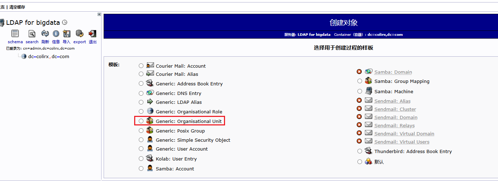
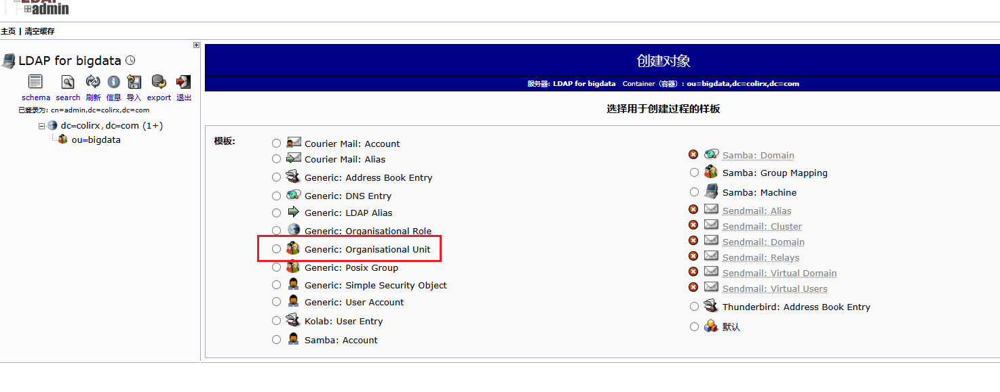
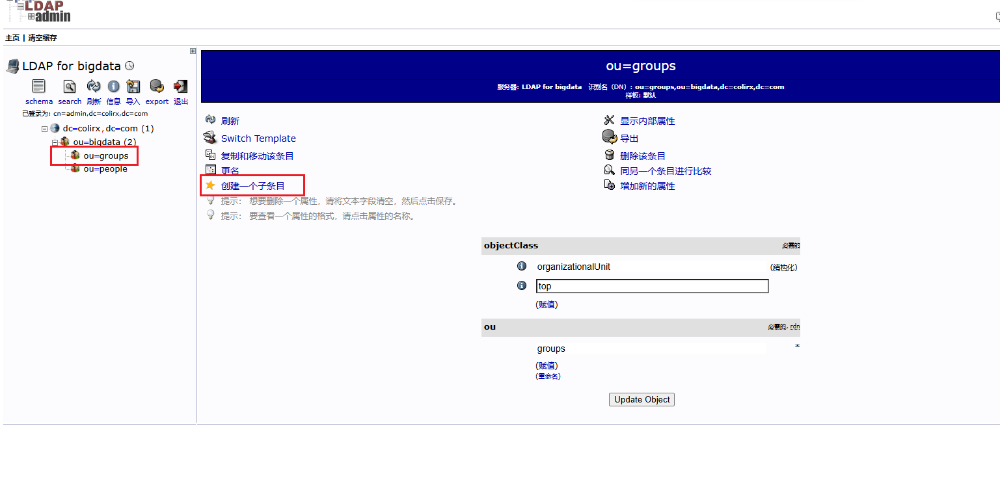
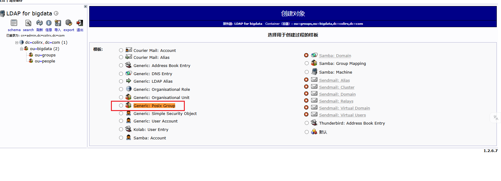
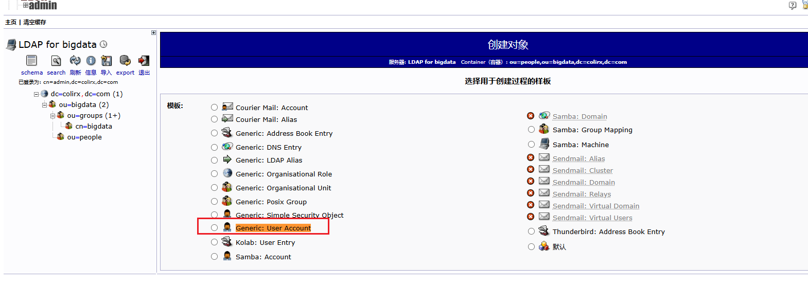
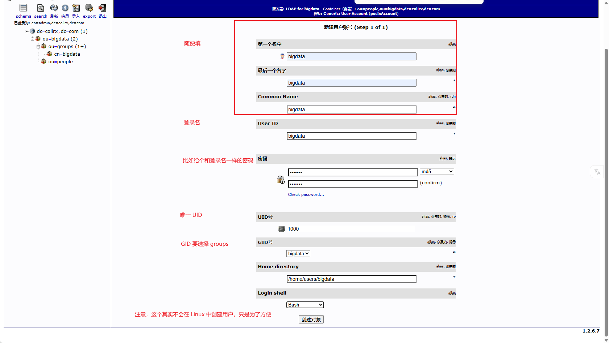
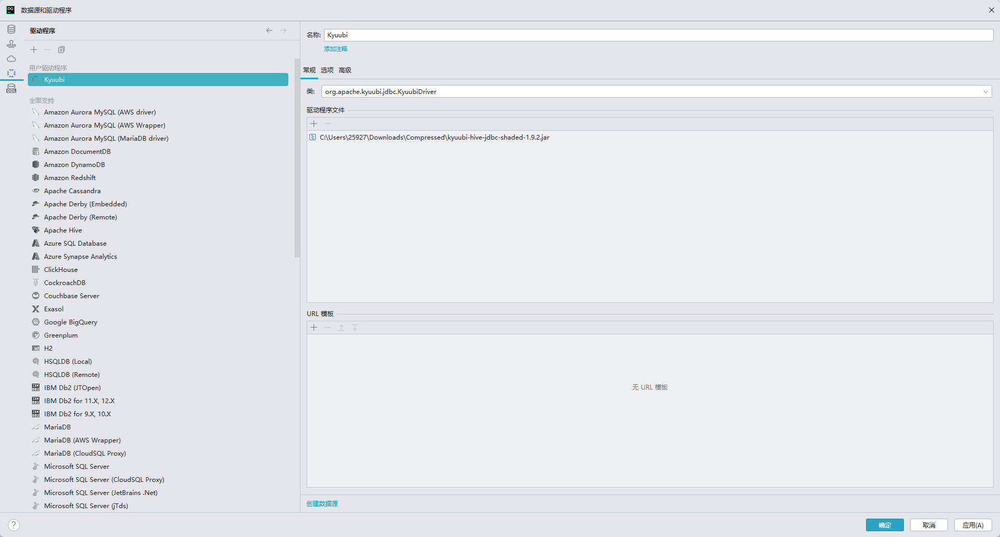
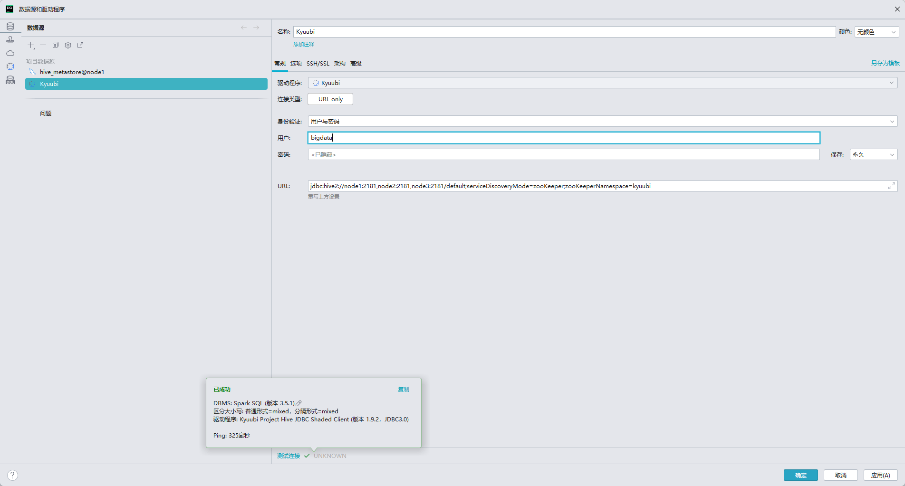

## 组件配置清单


| 组件             | 版本   | 说明                                                            |
| ---------------- | ------ | --------------------------------------------------------------- |
| JDK              | 11 LTS | 满足 Doris 2.x、Hadoop 3.3、Spark 3.5 等全部组件需求，统一用 11 |
| MySQL            | 8.0    | Hive Metastore、DolphinScheduler、Doris 外部目录等共用          |
| Zookeeper        | 3.8.x  | Hadoop HA、Kafka、Kyuubi、Flink 等共用                          |
| Hadoop           | 3.3.6  | HDFS 作为基础存储，YARN 作为资源调度                            |
| Hive Metastore   | 3.1.3  | 只部署 metastore 服务，向下对接 MySQL                           |
| Spark            | 3.5.x  | 与 Kyuubi 1.9 / Hive 3.1.3 兼容                                 |
| Kyuubi           | 1.9.0  | 作为 Spark 的 Thrift + JDBC 的桥梁                              |
| Kafka            | 3.7.0  | KRaft 模式                                                      |
| Flink            | 1.18.x | 支持 HiveCatalog 直接读取 Metastore                             |
| DolphinScheduler | 3.2.1  | 需要 JDK 11，支持上述任务类型                                   |
| Doris            | 2.1.x  | FE/BE 均需 JDK 11，兼容 MySQL 协议                              |

## 资源配置说明

最低推荐组合 5 x 4C/32G/50G SSD

注：

- MySQL 暂时不做高可用，在生产条件下应该已经存在数据库高可用才对
- JDK、DataNode、NodeManager、Spark、Flink Manager 由 Yarn 动态调度，但需要每个节点都配置

| 组件                    | Node1 | Nod2 | Node3  | Node4    | Node5    |
| ----------------------- | ----- | ---- | ------ | -------- | -------- |
| JDK                     | ✅     | ✅    | ✅      | ✅        | ✅        |
| MySQL                   | ✅     | /    | /      | /        | /        |
| Zookeeper               | ✅     | ✅    | ✅      | /        | /        |
| JournalNode             | ✅     | ✅    | ✅      | /        | /        |
| NameNode                | /     | /    | /      | Active   | Standby  |
| DataNode                | ✅     | ✅    | ✅      | ✅        | ✅        |
| ResourceManager         | /     | /    | /      | Active   | Standby  |
| NodeManager             | ✅     | ✅    | ✅      | ✅        | ✅        |
| Hive Metastore          | /     | /    | /      | 实例 1   | 实例 2   |
| Spark                   | ✅     | ✅    | ✅      | ✅        | ✅        |
| Kafka Broker            | ✅     | ✅    | ✅      | /        | /        |
| Flink JobManager        | /     | /    | /      | 实例 1   | 实例 2   |
| Flink TaskManager       | ✅     | ✅    | ✅      | ✅        | ✅        |
| Doris FE                | /     | /    | Leader | Follower | Observer |
| Doris BE                | ✅     | ✅    | ✅      | /        | /        |
| Kyuubi                  | /     | /    | /      | 实例 1   | 实例 2   |
| DolphinScheduler Master | /     | /    | /      | 实例 1   | 实例 2   |
| DolphinScheduler Worker | ✅     | ✅    | ✅      | /        | /        |

## 环境搭建

### 前置准备环境

- 静态 IP

    ubuntu 24 修改 `vim /etc/netplan/50-cloud-init.yaml`

    案例为

    <details>

    ```yaml
    network:
      version: 2
      ethernets:
        ens33:
          dhcp4: no
          addresses:
            - 192.168.100.130/24
          routes:
            - to: default
              via: 192.168.100.2
          nameservers:
            addresses:
              - 8.8.8.8
              - 114.114.114.114
    ```

    </details>

- 主机名修改
- hosts 与主机名映射正确
- ssh 配置，配置本机免密登录、root 用户与 bigdata 用户免密登录

    ```bash
    sudo useradd -m -s /bin/bash bigdata
    sudo passwd bigdata
    ```

    ```bash
    bigdata ALL=(ALL:ALL) NOPASSWD:ALL
    ```

    ```bash
    # 生成 ssh 密钥
    ssh-keygen -t rsa -b 4096 -m PEM -f ~/.ssh/id_rsa
    # 复制到对应的机器上
    # root 用户不能直接复制 可以使用 cat ~/.ssh/id_rsa.pub >> ~/.ssh/authorized_keys
    # 然后使用 sudo echo "xxx" > /root/.ssh/authorized_keys 到每个节点上
    ssh-copy-id X
    # 修改权限
    chmod 600 ~/.ssh/authorized_keys
    ```

- 防火墙关闭（内网条件下一般是有一个统一对外的防火墙）

    ```bash
    sudo ufw disable
    sudo systemctl stop ufw
    ```

- swap 分区关闭

    ```bash
    # 临时关闭
    sudo swapoff -a

    # 注释掉包含 swap 的那一行
    sudo vim /etc/fstab

    # free -h 中 swap 应该为 0
    ```

- 时间同步

    ```bash
    sudo apt install -y chrony
    sudo systemctl enable --now chrony
    ```

- 常用工具安装

    ```bash
    sudo apt install -y vim net-tools curl wget sshpass rsync
    ```

- xsync 和 xcall 脚本

    `xsync` 脚本同步

    <details>

    ```bash
    #!/bin/bash
    
    if [ $# -lt 1 ]; then
        echo "Error: Not enough arguments."
        echo "Usage: $0 <all | node1 [node2 ...]> <file/folder>"
        exit 1
    fi
    
    CLUSTER_NODES=("node5" "node4" "node3" "node2" "node1")
    
    TARGET_NODES=()
    
    # 获取最后一个参数作为文件路径
    FILE_RELATIVE="${@: -1}"
    
    # 将相对路径转换为绝对路径
    FILE=$(realpath "$FILE_RELATIVE")
    
    # 检查文件是否真的存在
    if [ ! -e "$FILE" ]; then
        echo "Error: File or Directory '$FILE_RELATIVE' does not exist."
        exit 1
    fi
    
    # 提取节点列表
    if [ "$1" == "all" ]; then
        TARGET_NODES=("${CLUSTER_NODES[@]}")
    else
        # 循环提取除最后一个参数外的所有参数作为节点
        for ((i=1; i<=$#; i++)); do
            if [ $i -lt $# ]; then
                TARGET_NODES+=("${!i}")
            fi
        done
    fi
    
    echo "------------------------------------------------"
    echo "Source File: $FILE"
    echo "Target Nodes: ${TARGET_NODES[*]}"
    echo "------------------------------------------------"
    
    for node in "${TARGET_NODES[@]}"; do
        # 获取文件所在的父目录路径
        PARENT_DIR=$(dirname "$FILE")
    
        # 获取文件名
        FILE_NAME=$(basename "$FILE")
    
        echo ">> Syncing to $node ..."
    
        # 先在远程创建父目录 (防止目录不存在报错)，使用双引号包裹变量，防止路径中有空格
        ssh "$node" "mkdir -p \"$PARENT_DIR\""
    
        # 目标路径写成 user@host:path 的形式最稳妥
        rsync -av "$FILE" "$node:$PARENT_DIR"
    
        if [ $? -eq 0 ]; then
            echo ">> [$node] Success"
        else
            echo ">> [$node] Failed"
        fi
    done
    
    echo "------------------------------------------------"
    echo "Done."
    ```

    </details>

    `xcall` 脚本命令

    <details>

    ```bash
    #!/bin/bash
    
    if [ $# -lt 2 ]; then
      echo "错误：参数不足"
      echo "用法: $0 <all | node1 [node2 ...]> <要执行的命令>"
      echo "示例: $0 all 'jps'"
      echo "示例: $0 node2 'ls /opt/module'"
      exit 1
    fi
    
    CLUSTER_NODES=("node5" "node4" "node3" "node2" "node1")
    
    TARGET_NODES=()
    
    if [ "$1" == "all" ]; then
      # 如果是 all，目标列表就是整个集群列表
      TARGET_NODES=("${CLUSTER_NODES[@]}")
      shift
    else
      # 如果不是 all，提取节点名和命令，最后一个参数是命令，前面的是节点
      args=("$@")
      count=${#args[@]}
    
      # 提取命令 (最后一个参数)
      CMD="${args[count-1]}"
    
      # 提取节点名 (从第 0 个到倒数第 2 个)
      for ((i=0; i<count-1; i++)); do
          TARGET_NODES+=("${args[i]}")
      done
    fi
    
    # 如果 CMD 变量为空（说明是走的 if all 分支）
    if [ -z "$CMD" ]; then
       # 此时 $@ 里剩下的就是命令部分，将其转为字符串
       CMD="$*"
    fi
    
    echo "开始在集群执行命令: $CMD"
    echo "目标节点: ${TARGET_NODES[*]}"
    
    for node in "${TARGET_NODES[@]}"; do
      echo "--------------------------------"
      echo "正在节点 [$node] 执行 [$CMD]"
    
      # 使用 ssh 执行命令，命令需要用引号包裹，防止本地 shell 提前解析，并且先加载环境变量再执行命令
      ssh "$node" "source /etc/profile; $CMD"
    
      if [ $? -eq 0 ]; then
          echo "[$node] 执行成功"
      else
          echo "[$node] 执行失败 (请检查命令或网络连接)"
      fi
    done
    
    echo "命令执行完毕"
    ```

    </details>

- 准备文件夹
    
    `mkdir -p /opt/{data,module,script,software}`

    - data 作为组件存放数据的位置
    - module 作为组件存放的位置
    - script 作为脚本存放位置
    - software 作为软件存放位置

### JDK

- [JDK 11](https://www.oracle.com/java/technologies/javase/jdk11-archive-downloads.html) 下载
- 配置环境变量

    修改 `/etc/profile.d` 下的 shell 脚本，`/etc/profile` 中会读取文件夹下的所有 shell 脚本

    ```bash
    vim /etc/profile.d/custom_profile.sh
    ```

    ```bash
    JAVA_HOME=/opt/module/jdk-11.0.30
    export PATH=$PATH:$JAVA_HOME/bin
    ```

    ```bash
    source /etc/profile
    java -version
    ```

### MySQL

MySQL 安装 8.0+ 即可

- 安装 MySQL

    如果镜像源安装不了，可以修改 `/etc/apt/sources.list.d/ubuntu.sources` 为国内镜像源

    ```bash
    Types: deb
    URIs: http://mirrors.aliyun.com/ubuntu/
    Suites: noble noble-updates noble-backports
    Components: main restricted universe multiverse
    Signed-By: /usr/share/keyrings/ubuntu-archive-keyring.gpg

    Types: deb
    URIs: http://mirrors.aliyun.com/ubuntu/
    Suites: noble-security
    Components: main restricted universe multiverse
    Signed-By: /usr/share/keyrings/ubuntu-archive-keyring.gpg
    ```

    ```bash
    sudo apt update
    sudo apt install mysql-server-8.0
    ```

- 设置权限

    ```bash
    mysql -u root -p
    # 设置 root 账户限制从本地改为任意地址
    use mysql;
    update user set host = '%' where user = 'root';
    # 刷新权限
    flush privileges;
    # 修改 root 用户密码
    ALTER USER 'root'@'%' IDENTIFIED WITH mysql_native_password BY 'root';
    flush privileges;
    ```

- 修改配置文件 `/etc/mysql/mysql.conf.d/mysqld.cnf`

    注释 `bind-address` 这一行，令任意远程地址都可以链接 MySQL

- 重启 MySQL `sudo systemctl restart mysql`

### Zookeeper

- 下载 [zookeeper 3.8.x](https://dlcdn.apache.org/zookeeper/zookeeper-3.8.6/apache-zookeeper-3.8.6-bin.tar.gz)
- 配置环境变量
- 修改 `conf/zoo.cfg`

    准备文件夹

    ```bash
    xcall node1 node2 node3 "mkdir -p /opt/data/zookeeper"
    ```

    修改 dataDir 为准备好的文件夹

    ```bash
    dataDir=/opt/data/zookeeper
    server.1=node1:2888:3888
    server.2=node2:2888:3888
    server.3=node3:2888:3888
    ```

    ```bash
    xsync node1 node2 node3 /opt/module/apache-zookeeper-3.8.6-bin/
    ```

    在 `${dataDir}` 文件夹下创建一个 `myid` 的文件作为标识符，表示在集群模式下到底属于哪个机器

    根据之前的规划，设置为 node1、node2、node3 为机器，所以 myid 分别设置为 1、2、3

    ```bash
    xcall node1 node2 node3 "cat /etc/hostname | awk '{print substr(\$1,5,6)}' > /opt/data/zookeeper/myid "
    xcall node1 node2 node3 "cat /opt/data/zookeeper/myid"
    ```

- 启动 zookeeper

    查看状态后，应该能看到 一个 leader 两个 follower

    ```bash
    xcall node1 node2 node3 "/opt/module/apache-zookeeper-3.8.6-bin/bin/zkServer.sh start"
    xcall node1 node2 node3 "/opt/module/apache-zookeeper-3.8.6-bin/bin/zkServer.sh status"
    ```

### Hadoop

- 下载 [hadoop 3.3.6](https://hadoop.apache.org/release/3.3.6.html)
- 解压缩，配置环境变量

    ```bash
    vim /etc/profile.d/custom_profile.sh
    ```

    ```bash
    HADOOP_HOME=/opt/module/hadoop-3.3.6
    export PATH=$PATH:$JAVA_HOME/bin:$ZK_HOME/bin:$HADOOP_HOME/bin:$HADOOP_HOME/sbin
    ```

- 修改 `$HADOOP_HOME/etc/hadoop/hadoop-env.sh`

    ```bash
    export JAVA_HOME=/opt/module/jdk-11.0.30
    # Java 9+ 的一个启动参数，强制打开一个模块给外部访问，负责 WEB-UI 上看文件会报错，如果是使用 JDK8 那么就没问题了，注意 JDK8 不要用这个，会报错
    export HADOOP_OPTS="$HADOOP_OPTS --add-opens java.base/java.lang=ALL-UNNAMED --add-opens java.base/java.util=ALL-UNNAMED --add-opens java.base/java.nio=ALL-UNNAMED"
    ```

- 配置 `$HADOOP_HOME/etc/hadoop/core-site.xml`

    配置本地文件夹

    ```bash
    xcall all mkdir -p /opt/data/hadoop/hdfs
    ```

    <details>

    ```xml
    <configuration>
        <!-- ==================== 基础配置 ==================== -->
        <property>
            <name>fs.defaultFS</name>
            <value>hdfs://hadoop</value>
            <description>定义 HDFS 的逻辑名称</description>
        </property>
        <property>
            <name>hadoop.tmp.dir</name>
            <value>/opt/data/hadoop/hdfs</value>
            <description>数据目录 给定之前准备好的目录 生产需要指定到独立磁盘</description>
        </property>
        <property>
            <name>hadoop.proxyuser.bigdata.hosts</name>
            <value>*</value>
            <description>开启 bigdata 用户的身份代理</description>
        </property>
        <property>
            <name>hadoop.proxyuser.bigdata.groups</name>
            <value>*</value>
        </property>
        <property>
            <name>fs.trash.interval</name>
            <value>1440</value>
            <description>开启回收站 保留 1 天</description>
        </property>
    
        <!-- ==================== HA 配置 ==================== -->
        <property>
            <name>ha.zookeeper.quorum</name>
            <value>node1:2181,node2:2181,node3:2181</value>
            <description>ZooKeeper 集群地址 给定之前配置 zookeeper 的节点 用于 HA 协调</description>
        </property>
    </configuration>
    ```

    </details>

- 配置 `$HADOOP_HOME/etc/hadoop/hdfs-site.xml`

    根据规划 
    - JournalNode 划分在 node1 node2 node3
    - NameNode 划分在 node4 和 node5

    为了方便理解，nn 的名字就直接和节点名称一致了，分别叫做 nn4 和 nn5

    ```bash
    # 对于不需要的节点来说，可以先创建文件夹，但是不配置的话就没有数据进去
    xcall all mkdir -p /opt/data/hadoop/journal
    # 流量转移控制
    xcall all "sudo apt install -y iputils-arping"
    ```

    <details>

    ```xml
    <configuration>
        <!-- ==================== 基础配置 ==================== -->
        <property>
            <name>dfs.replication</name>
            <value>3</value>
            <description>副本数</description>
        </property>
        <property>
            <name>dfs.nameservices</name>
            <value>hadoop</value>
            <description>定义 Nameservice ID (需与 core-site.xml 中的 fs.defaultFS 对应)</description>
        </property>
    
        <!-- ==================== NameNode HA ==================== -->
        <property>
            <name>dfs.namenode.shared.edits.dir</name>
            <value>qjournal://node1:8485;node2:8485;node3:8485/hadoop</value>
            <description>集群 NameNode 元数据在 JournalNode 存放位置 目录 hadoop 为集群 id</description>
        </property>
        <property>
            <name>dfs.journalnode.edits.dir</name>
            <value>/opt/data/hadoop/journal</value>
            <description>NameNode 元数据在 JournalNode 的物理磁盘存放位置 生产最好指定独立磁盘</description>
        </property>
        <property>
            <name>dfs.ha.namenodes.hadoop</name>
            <value>nn4,nn5</value>
            <description>定义两个 NameNode 的别名 (nn4, nn5)</description>
        </property>
        <property>
            <name>dfs.namenode.rpc-address.hadoop.nn4</name>
            <value>node4:8020</value>
            <description>nn4 的 RPC 地址</description>
        </property>
        <property>
            <name>dfs.namenode.http-address.hadoop.nn4</name>
            <value>node4:9870</value>
            <description>NameNode 的 Web UI 地址</description>
        </property>
        <property>
            <name>dfs.namenode.rpc-address.hadoop.nn5</name>
            <value>node5:8020</value>
            <description>nn5 的 RPC 地址</description>
        </property>
        <property>
            <name>dfs.namenode.http-address.hadoop.nn5</name>
            <value>node5:9870</value>
            <description>NameNode 的 Web UI 地址</description>
        </property>
        <property>
            <name>dfs.ha.automatic-failover.enabled</name>
            <value>true</value>
            <description>配置自动故障转移</description>
        </property>
        <property>
            <name>dfs.client.failover.proxy.provider.hadoop</name>
            <value>org.apache.hadoop.hdfs.server.namenode.ha.ConfiguredFailoverProxyProvider</value>
            <description>客户端故障转移代理</description>
        </property>
    
        <!-- ==================== 防脑裂机制 ==================== -->
        <!--
            使用 SSH 隔离防止 NameNode 脑裂 shell 用于兜底 (比如机器崩溃无法 ssh 过去的时候)
            注意 sshfence 和 shell 都需要新启动一行 用于表示为一个列表
            arping 需要提前安装 iputils-arping 并且位置可能不同 需要谨慎 另外网络可能不同 需要修改
            意思是 arping 进行流量转发 将 target_host 的流量全都转移到自己身上来 这样可以防止脑裂
        -->
        <property>
            <name>dfs.ha.fencing.methods</name>
            <value>
    sshfence
    shell(/usr/bin/arping -D -c 3 -A ${target_host})
            </value>
        </property>
        <property>
            <name>dfs.ha.fencing.ssh.private-key-files</name>
            <value>/home/bigdata/.ssh/id_rsa</value>
        </property>
    </configuration>
    ```

    </details>

- 配置 `$HADOOP_HOME/etc/hadoop/yarn-site.xml`

    根据规划 ResourceManager 划分在 node4 和 node5

    为了方便理解，就也叫做 rm4 和 rm5

    <details>

    ```xml
    <configuration>
        <!-- ==================== 基础配置 ==================== -->
        <property>
            <name>yarn.resourcemanager.recovery.enabled</name>
            <value>true</value>
            <description>启用自动恢复</description>
        </property>
        <property>
            <name>yarn.nodemanager.env-whitelist</name>
            <value>JAVA_HOME,HADOOP_COMMON_HOME,HADOOP_HDFS_HOME,HADOOP_CONF_DIR,CLASSPATH_PREPEND_DISTCACHE,HADOOP_YARN_HOME,HADOOP_MAPRED_HOME,HADOOP_HOME,PATH,LANG,TZ,FLINK_HOME</value>
            <description>环境白名单 注意不要换行 否则读取会失败</description>
        </property>
        <property>
            <name>yarn.nodemanager.aux-services</name>
            <value>mapreduce_shuffle</value>
            <description>辅助服务 mapreduce_shuffle</description>
        </property>
        <property>
            <name>yarn.nodemanager.aux-services.mapreduce_shuffle.class</name>
            <value>org.apache.hadoop.mapred.ShuffleHandler</value>
        </property>
        <property>
            <name>yarn.nodemanager.remote-app-log-dir</name>
            <value>hdfs://hadoop/tmp/logs</value>
            <description>日志聚合存储 HDFS 路径</description>
        </property>
        <property>
            <name>yarn.nodemanager.resource.cpu-vcores</name>
            <value>16</value>
            <description>设置每个 NodeManager 节点上可用的 vCore 总数 建议配置为物理 CPU 核心数的 1 到 5 倍</description>
        </property>
        <property>
            <name>yarn.scheduler.minimum-allocation-vcores</name>
            <value>1</value>
            <description>单个容器可申请的最小 vCore 数</description>
        </property>
        <property>
            <name>yarn.scheduler.maximum-allocation-vcores</name>
            <value>32</value>
            <description>单个容器可申请的最大 vCore 数</description>
        </property>

        <!-- ==================== Yarn HA ==================== -->
        <property>
            <name>yarn.resourcemanager.ha.enabled</name>
            <value>true</value>
            <description>开启 YARN HA</description>
        </property>
        <property>
            <name>yarn.resourcemanager.cluster-id</name>
            <value>yarn-cluster</value>
            <description>定义 RM 集群 ID</description>
        </property>
        <property>
            <name>yarn.resourcemanager.zk-address</name>
            <value>node1:2181,node2:2181,node3:2181</value>
            <description>指定 ZK 地址</description>
        </property>
        <property>
            <name>yarn.resourcemanager.store.class</name>
            <value>org.apache.hadoop.yarn.server.resourcemanager.recovery.ZKRMStateStore</value>
            <description>指定 resourcemanager 的状态信息存储在 zookeeper 集群</description>
        </property>
        <property>
            <name>yarn.resourcemanager.ha.rm-ids</name>
            <value>rm4,rm5</value>
            <description>定义 RM 节点 ID</description>
        </property>
        <property>
            <name>yarn.resourcemanager.hostname.rm4</name>
            <value>node4</value>
            <description>指定 RM 地址</description>
        </property>
        <property>
            <name>yarn.resourcemanager.webapp.address.rm4</name>
            <value>node4:8088</value>
            <description>指定 Web UI 地址</description>
        </property>
        <property>
            <name>yarn.resourcemanager.hostname.rm5</name>
            <value>node5</value>
        </property>
        <property>
            <name>yarn.resourcemanager.webapp.address.rm5</name>
            <value>node5:8088</value>
            <description>指定 Web UI 地址</description>
        </property>
    </configuration>
    ```

    </details>

- 配置 `$HADOOP_HOME/etc/hadoop/capacity-scheduler.xml`

    <details>

    ```xml
    <property>
        <name>yarn.scheduler.capacity.resource-calculator</name>
        <value>org.apache.hadoop.yarn.util.resource.DominantResourceCalculator</value>
        <description>yarn 调度资源从只考虑内存变为同时考虑内存和 CPU</description>
    </property>
    ```

    </details>

- 配置 `$HADOOP_HOME/etc/hadoop/mapred-site.xml`

    mapreduce 的历史服务器位置无所谓，反正之后也不需要用

    <details>

    ```xml
    <configuration>
        <!-- ==================== 基础配置 ==================== -->
        <property>
            <name>mapreduce.framework.name</name>
            <value>yarn</value>
            <description>指定 MapReduce 运行在 YARN 上</description>
        </property>
        <property>
            <name>mapreduce.jobhistory.address</name>
            <value>node1:10020</value>
            <description>开启 MapReduce 的历史服务器</description>
        </property>
        <property>
            <name>mapreduce.jobhistory.webapp.address</name>
            <value>node1:19888</value>
            <description>历史服务器 Web UI 地址</description>
        </property>
    </configuration>
    ```

    </details>

- 启动集群

    初始化

    ```bash
    # 首先启动 zookeeper 集群
    xcall node1 node2 node3 "/opt/module/apache-zookeeper-3.8.6-bin/bin/zkServer.sh start"
    # 启动 JournalNode，注意 hdfs 的 logs 和 data 都需要确认为空
    xcall node1 node2 node3 "$HADOOP_HOME/sbin/hadoop-daemon.sh start journalnode"
    # 如果是第一次启动，需要首先在主节点 node4 上进行格式化
    hdfs namenode -format
    # 启动主节点 node4
    hadoop-daemon.sh start namenode
    # 从节点 node5 进行元数据同步
    hdfs namenode -bootstrapStandby
    # 从节点启动 node5
    hadoop-daemon.sh start namenode
    # 在其中一个 namenode 中运行 zookeeper 初始化
    hdfs zkfc -formatZK
    # 停止已经启动的 dfs
    stop-dfs.sh
    ```

    之后可以使用脚本执行

    ```bash
    sudo vim /usr/local/bin/bigdata-ctr.sh
    ```

    <details>

    ```bash
    #!/bin/bash
    
    # ======================== 集群配置（按实际情况修改） ========================
    NODE1="node1"
    NODE2="node2"
    NODE3="node3"
    NODE4="node4"
    NODE5="node5"
    
    # =================== Zookeeper 角色 ===================
    ZK_NODES=("$NODE1" "$NODE2" "$NODE3")
    # =================== Hadoop 角色 ===================
    JN_NODES=("$NODE1" "$NODE2" "$NODE3")
    NN_NODES=("$NODE4" "$NODE5")
    DN_NODES=("$NODE1" "$NODE2" "$NODE3" "$NODE4" "$NODE5")
    RM_NODES=("$NODE4" "$NODE5")
    NM_NODES=("$NODE1" "$NODE2" "$NODE3" "$NODE4" "$NODE5")
    HS_NODE=("$NODE1")
    
    # NameNode HA
    NN4_HOST="$NODE4"
    NN4_ID="nn4"
    NN5_HOST="$NODE5"
    NN5_ID="nn5"
    
    # Yarn HA
    RM4_HOST="$NODE4"
    RM4_ID="rm4"
    RM5_HOST="$NODE5"
    RM5_ID="rm5"
    
    # 颜色
    RED='\033[0;31m'
    GREEN='\033[0;32m'
    YELLOW='\033[1;33m'
    NC='\033[0m'
    
    print_msg()  { echo -e "${GREEN}[$1]${NC} $2"; }
    print_warn() { echo -e "${YELLOW}[$1]${NC} $2"; }
    print_error(){ echo -e "${RED}[$1]${NC} $2"; }
    
    # SSH 执行（source /etc/profile 获取环境变量）
    ssh_exec() {
        local node=$1; shift
        ssh -o StrictHostKeyChecking=no -o UserKnownHostsFile=/dev/null -o LogLevel=ERROR "$node" "
            source /etc/profile 2>/dev/null
            $*
        "
    }
    
    # ======================== ZooKeeper ========================
    start_zookeeper() {
        print_msg "ZK" "启动 ZooKeeper..."
        for node in "${ZK_NODES[@]}"; do
            ssh_exec "$node" "
                if [ -n \"\$ZK_HOME\" ]; then
                    \$ZK_HOME/bin/zkServer.sh start
                else
                    zkServer.sh start
                fi
            "
        done
        sleep 2
        print_msg "ZK" "ZooKeeper 启动完成"
    }
    
    stop_zookeeper() {
        print_msg "ZK" "停止 ZooKeeper..."
        for node in "${ZK_NODES[@]}"; do
            ssh_exec "$node" "
                if [ -n \"\$ZK_HOME\" ]; then
                    \$ZK_HOME/bin/zkServer.sh stop
                else
                    zkServer.sh stop
                fi
            "
        done
        print_msg "ZK" "ZooKeeper 已停止"
    }
    
    status_zookeeper() {
        print_msg "ZK" "ZooKeeper:"
        for node in "${ZK_NODES[@]}"; do
            out=$(ssh_exec "$node" "jps 2>/dev/null | grep QuorumPeerMain")
            if [ -n "$out" ]; then
                echo -e "  $node : ${GREEN}$out${NC}"
            else
                echo -e "  $node : ${RED}未运行${NC}"
            fi
        done
    }
    
    # ======================== HDFS ========================
    start_hdfs() {
        print_msg "HDFS" "启动 HDFS 组件..."
        print_msg "JN" "启动 JournalNode..."
        for node in "${JN_NODES[@]}"; do
            ssh_exec "$node" "\$HADOOP_HOME/bin/hdfs --daemon start journalnode"
        done
        sleep 2
    
        print_msg "NN" "启动 NameNode..."
        for node in "${NN_NODES[@]}"; do
            ssh_exec "$node" "\$HADOOP_HOME/bin/hdfs --daemon start namenode"
        done
        sleep 2
    
        print_msg "ZKFC" "启动 ZKFC..."
        for node in "${NN_NODES[@]}"; do
            ssh_exec "$node" "\$HADOOP_HOME/bin/hdfs --daemon start zkfc"
        done
        sleep 2
    
        print_msg "DN" "启动 DataNode..."
        for node in "${DN_NODES[@]}"; do
            ssh_exec "$node" "\$HADOOP_HOME/bin/hdfs --daemon start datanode"
        done
        sleep 2
    
        print_msg "HDFS" "HDFS 组件启动完成"
    }
    
    stop_hdfs() {
        print_msg "HDFS" "停止 HDFS 组件..."
        print_msg "ZKFC" "停止 ZKFC..."
        for node in "${NN_NODES[@]}"; do
            ssh_exec "$node" "\$HADOOP_HOME/bin/hdfs --daemon stop zkfc"
        done
    
        print_msg "NN" "停止 NameNode..."
        for node in "${NN_NODES[@]}"; do
            ssh_exec "$node" "\$HADOOP_HOME/bin/hdfs --daemon stop namenode"
        done
    
        print_msg "DN" "停止 DataNode..."
        for node in "${DN_NODES[@]}"; do
            ssh_exec "$node" "\$HADOOP_HOME/bin/hdfs --daemon stop datanode"
        done
    
        print_msg "JN" "停止 JournalNode..."
        for node in "${JN_NODES[@]}"; do
            ssh_exec "$node" "\$HADOOP_HOME/bin/hdfs --daemon stop journalnode"
        done
    
        print_msg "HDFS" "HDFS 组件已停止"
    }
    
    status_hdfs() {
        print_msg "HDFS" "HDFS 进程:"
        all_hdfs_nodes=($(printf "%s\n" "${NN_NODES[@]}" "${JN_NODES[@]}" "${DN_NODES[@]}" | sort -u))
        for node in "${all_hdfs_nodes[@]}"; do
            out=$(ssh_exec "$node" "jps 2>/dev/null | grep -E 'NameNode|DataNode|JournalNode|DFSZKFailoverController'")
            if [ -n "$out" ]; then
                echo -e "  ${GREEN}$node${NC}:"
                echo "$out" | while read line; do echo -e "    ${GREEN}$line${NC}"; done
            else
                echo -e "  ${RED}$node${NC}: 无 HDFS 进程"
            fi
        done
    
        # HA 状态
        print_msg "HA" "NameNode HA 状态:"
        nn4_state=$(ssh_exec "${NN4_HOST}" "\$HADOOP_HOME/bin/hdfs haadmin -getServiceState $NN4_ID 2>/dev/null")
        nn5_state=$(ssh_exec "${NN5_HOST}" "\$HADOOP_HOME/bin/hdfs haadmin -getServiceState $NN5_ID 2>/dev/null")
        if [ "$nn4_state" == "active" ]; then
            echo -e "  $NN4_HOST ($NN4_ID) : ${GREEN}active${NC}"
            echo -e "  $NN5_HOST ($NN5_ID) : ${YELLOW}standby${NC}"
        elif [ "$nn5_state" == "active" ]; then
            echo -e "  $NN4_HOST ($NN4_ID) : ${YELLOW}standby${NC}"
            echo -e "  $NN5_HOST ($NN5_ID) : ${GREEN}active${NC}"
        else
            echo -e "  ${RED}无法获取 HA 状态（集群可能未初始化）${NC}"
        fi
    }
    
    # ======================== YARN ========================
    start_yarn() {
        print_msg "YARN" "启动 YARN 组件..."
        print_msg "RM" "启动 ResourceManager..."
        for node in "${RM_NODES[@]}"; do
            ssh_exec "$node" "\$HADOOP_HOME/bin/yarn --daemon start resourcemanager"
        done
        sleep 2
    
        print_msg "NM" "启动 NodeManager..."
        for node in "${NM_NODES[@]}"; do
            ssh_exec "$node" "\$HADOOP_HOME/bin/yarn --daemon start nodemanager"
        done
        sleep 2
        print_msg "YARN" "YARN 组件启动完成"
    }
    
    stop_yarn() {
        print_msg "YARN" "停止 YARN 组件..."
        print_msg "RM" "停止 ResourceManager..."
        for node in "${RM_NODES[@]}"; do
            ssh_exec "$node" "\$HADOOP_HOME/bin/yarn --daemon stop resourcemanager"
        done
    
        print_msg "NM" "停止 NodeManager..."
        for node in "${NM_NODES[@]}"; do
            ssh_exec "$node" "\$HADOOP_HOME/bin/yarn --daemon stop nodemanager"
        done
        print_msg "YARN" "YARN 组件已停止"
    }
    
    status_yarn() {
        print_msg "YARN" "YARN 进程:"
        all_yarn_nodes=($(printf "%s\n" "${RM_NODES[@]}" "${NM_NODES[@]}" | sort -u))
        for node in "${all_yarn_nodes[@]}"; do
            out=$(ssh_exec "$node" "jps 2>/dev/null | grep -E 'ResourceManager|NodeManager'")
            if [ -n "$out" ]; then
                echo -e "  ${GREEN}$node${NC}:"
                echo "$out" | while read line; do echo -e "    ${GREEN}$line${NC}"; done
            else
                echo -e "  ${RED}$node${NC}: 无 YARN 进程"
            fi
        done
    
        # HA 状态
        print_msg "HA" "Yarn HA 状态:"
        rm4_state=$(ssh_exec "${RM4_HOST}" "\$HADOOP_HOME/bin/yarn rmadmin -getServiceState $RM4_ID 2>/dev/null")
        rm5_state=$(ssh_exec "${RM5_HOST}" "\$HADOOP_HOME/bin/yarn rmadmin -getServiceState $RM5_ID 2>/dev/null")
        if [ "$rm4_state" == "active" ]; then
            echo -e "  $RM4_HOST ($RM4_ID) : ${GREEN}active${NC}"
            echo -e "  $RM5_HOST ($RM5_ID) : ${YELLOW}standby${NC}"
        elif [ "$rm5_state" == "active" ]; then
            echo -e "  $RM4_HOST ($RM4_ID) : ${YELLOW}standby${NC}"
            echo -e "  $RM5_HOST ($RM5_ID) : ${GREEN}active${NC}"
        else
            echo -e "  ${RED}无法获取 HA 状态（集群可能未初始化）${NC}"
        fi
    }
    
    # ======================== MapReduce HistoryServer ========================
    start_historyserver() {
        print_msg "HS" "启动 MapReduce HistoryServer..."
        ssh_exec "$HS_NODE" "\$HADOOP_HOME/bin/mapred --daemon start historyserver"
        print_msg "HS" "HistoryServer 启动完成"
    }
    
    stop_historyserver() {
        print_msg "HS" "停止 MapReduce HistoryServer..."
        ssh_exec "$HS_NODE" "\$HADOOP_HOME/bin/mapred --daemon stop historyserver"
        print_msg "HS" "HistoryServer 已停止"
    }
    
    status_historyserver() {
        print_msg "HS" "MapReduce HistoryServer:"
        out=$(ssh_exec "$HS_NODE" "jps 2>/dev/null | grep JobHistoryServer")
        if [ -n "$out" ]; then
            echo -e "  $HS_NODE : ${GREEN}$out${NC}"
        else
            echo -e "  $HS_NODE : ${RED}未运行${NC}"
        fi
    }
    
    # ======================== 全局启停 ========================
    start_all() {
        start_zookeeper
        start_hdfs
        start_yarn
        start_historyserver
        print_msg "ALL" "全部服务已启动"
    }
    
    stop_all() {
        stop_historyserver
        stop_yarn
        stop_hdfs
        stop_zookeeper
        print_msg "ALL" "全部服务已停止"
    }
    
    # ======================== 状态检查 ========================
    status_status() {
        echo -e "${GREEN}==================== 集群状态 ====================${NC}"
        # zookeeper
        status_zookeeper
        # hadoop
        status_hdfs
        status_yarn
        status_historyserver
    }
    
    # ======================== 命令入口 ========================
    case "$1" in
        start-zookeeper)      start_zookeeper    ;;
        stop-zookeeper)       stop_zookeeper     ;;
        status-zookeeper)      status_zookeeper     ;;
        start-hdfs)           start_hdfs         ;;
        stop-hdfs)            stop_hdfs          ;;
        status-hdfs)           status_hdfs          ;;
        start-yarn)           start_yarn         ;;
        stop-yarn)            stop_yarn          ;;
        status-yarn)           status_yarn          ;;
        start-historyserver)  start_historyserver ;;
        stop-historyserver)   stop_historyserver  ;;
        status-historyserver)  status_historyserver  ;;
        start-all)            start_all          ;;
        stop-all)             stop_all           ;;
        restart-all)          stop_all; sleep 3; start_all ;;
        status)               status_status       ;;
        *)
            echo "用法: $0 <命令>"
            echo "  分组件启停:"
            echo "    start-zookeeper | stop-zookeeper | status-zookeeper"
            echo "    start-hdfs | stop-hdfs | status-hdfs"
            echo "    start-yarn | stop-yarn | status-yarn"
            echo "    start-historyserver | stop-historyserver | status-historyserver"
            echo "  全局管理:"
            echo "    start-all | stop-all | restart-all"
            echo "    status"
            exit 1
            ;;
    esac
    ```

    </details>

    ```bash
    sudo chown bigdata:bigdata /usr/local/bin/bigdata-ctr.sh
    sudo chmod +x /usr/local/bin/bigdata-ctr.sh
    ```

- 验证

    这个命令其实等同于先去寻找 zookeeper 谁是 active 节点，然后直接连上去执行

    ```bash
    hdfs dfs -ls /
    ```

- 验证 HA 高可用

    首先确认好已经安装完成了 `iputils-arping` 

    然后确认好已经做好了 ssh 可以到其他机器上，首次 ssh 会确认握手，所以需要首先 ssh 全部机器

    然后需要确认 id_rsa 文件是否可以有权限读取并且权限必须为 600

    准备完成后，kill 掉 active 的 namenode，然后看是否会切换到另一个上

- 执行 mapreduce 验证是否可行

    ```bash
    hadoop jar $HADOOP_HOME/share/hadoop/mapreduce/hadoop-mapreduce-examples-*.jar pi 2 2
    ```

### Hive Metastore

根据集群规划，Hive Metastore 放置在 Node4 Node5

需要注意一点的是，Hive 3.1.3 只支持 JDK8，不支持 JDK11

但是经过测试，如果只是启动 hive metastore 服务的话是完全可以使用的，因为只用元数据不跑 CLI 的话根本不会触发这个错误

- 在 MySQL 中准备专用的 hive 用户

    ```sql
    -- 创建 Hive 元数据库
    CREATE DATABASE hive_metastore CHARACTER SET utf8mb4 COLLATE utf8mb4_general_ci;

    -- 创建 Hive 专用用户并授权
    -- 这里允许所有节点(%)连接，这样配置最方便
    CREATE USER 'hive'@'%' IDENTIFIED WITH mysql_native_password BY 'Ab@123';

    -- 授予该用户对 hive_metastore 库的所有权限
    GRANT ALL PRIVILEGES ON hive_metastore.* TO 'hive'@'%';

    --  刷新权限
    FLUSH PRIVILEGES;
    EXIT;
    ```

- 下载 hive [3.1.3](https://archive.apache.org/dist/hive/hive-3.1.3/apache-hive-3.1.3-bin.tar.gz)
- 解压缩，配置环境变量
- 下载 [JDBC Driver](https://repo1.maven.org/maven2/com/mysql/mysql-connector-j/8.3.0/mysql-connector-j-8.3.0.jar) 给 lib 文件夹
- 给 hive 准备 hdfs 中的文件路径

    ```bash
    hdfs dfs -mkdir -p /bigdata/hive/warehouse
    hdfs dfs -chown -R bigdata:bigdata /bigdata
    hdfs dfs -chmod -R 755 /bigdata
    mkdir -p /opt/data/hive/{scratchdir,resources}
    ```

- 修改 `$HIVE_HOME/conf/hive-site.xml` 文件

    <details>

    ```xml
    <configuration>
        <!-- ==================== 基础配置 ==================== -->
        <property>
            <name>hive.metastore.warehouse.dir</name>
            <value>/bigdata/hive/warehouse</value>
            <description>HDFS 仓库目录</description>
        </property>
        <property>
            <name>javax.jdo.option.ConnectionURL</name>
            <value>jdbc:mysql://node1:3306/hive_metastore?createDatabaseIfNotExist=true&amp;useSSL=false&amp;serverTimezone=Asia/Shanghai</value>
            <description>元数据库连接</description>
        </property>
        <property>
            <name>javax.jdo.option.ConnectionDriverName</name>
            <value>com.mysql.cj.jdbc.Driver</value>
        </property>
        <property>
            <name>javax.jdo.option.ConnectionUserName</name>
            <value>hive</value>
        </property>
        <property>
            <name>javax.jdo.option.ConnectionPassword</name>
            <value>Ab@123</value>
        </property>
        <property>
            <name>java.io.tmpdir</name>
            <value>/tmp/hive</value>
            <description>Java 虚拟机临时目录 本地磁盘</description>
        </property>
        <property>
            <name>hive.exec.scratchdir</name>
            <value>/opt/data/hive/scratchdir</value>
            <description>Hive 临时使用的本地临时目录</description>
        </property>
        <property>
            <name>hive.downloaded.resources.dir</name>
            <value>/opt/data/hive/resources</value>
            <description>Hive 存放资源文件的本地临时目录</description>
        </property>
        <property>
            <name>hive.security.authorization.createtable.owner.grants</name>
            <value>ALL</value>
            <description>创建表时给予所有者相应的权限</description>
        </property>
        <property>
            <name>hive.server2.enable.doAs</name>
            <value>true</value>
            <description>开启并发支持 多会话 查询时以用户身份执行</description>
        </property>
        <property>
            <name>hive.server2.thrift.max.worker.threads</name>
            <value>500</value>
            <description>开启多线程模式 提高并发性能</description>
        </property>
        <property>
            <name>hive.metastore.event.db.notification.api.auth</name>
            <value>false</value>
            <description>关掉 hive 的轮询功能</description>
        </property>
        <property>
            <name>hive.cli.print.header</name>
            <value>true</value>
            <description>打印表头</description>
        </property>
        <property>
            <name>hive.cli.print.current.db</name>
            <value>true</value>
            <description>打印库名称</description>
        </property>
    
        <!-- ==================== 安全认证 ==================== -->
        <property>
            <name>hive.server2.authentication</name>
            <value>NONE</value>
            <description>认证方式无 之后可以添加 Kerberos</description>
        </property>
        <property>
            <name>hive.security.authorization.enabled</name>
            <value>false</value>
            <description>直接禁用掉 hive 本身安全认证 有条件可以上 Kerberos</description>
        </property>
    
        <!-- ==================== HA 配置 ==================== -->
        <property>
            <name>hive.zookeeper.quorum</name>
            <value>node1:2181,node2:2181,node3:2181</value>
            <description>指定 ZooKeeper 集群</description>
        </property>
        <property>
            <name>hive.zookeeper.client.port</name>
            <value>2181</value>
            <description>ZooKeeper port</description>
        </property>
        <property>
            <name>hive.metastore.uris</name>
            <value>thrift://node4:9083,thrift://node5:9083</value>
            <description>Hive Metastore 服务应该监听哪个地址</description>
        </property>
    </configuration>
    ```

    </details>

- 准备 hive 到 hadoop 的软链接

    ```bash
    cd $HIVE_HOME/conf
    ln -s $HADOOP_HOME/etc/hadoop/core-site.xml $HIVE_HOME/conf/core-site.xml
    ln -s $HADOOP_HOME/etc/hadoop/hdfs-site.xml $HIVE_HOME/conf/hdfs-site.xml
    ln -s $HADOOP_HOME/etc/hadoop/yarn-site.xml $HIVE_HOME/conf/yarn-site.xml
    ```

- 配置 `hive-env.sh`

    ```bash
    export HADOOP_HOME=/opt/module/hadoop-3.3.6
    export HIVE_CONF_DIR=/opt/module/apache-hive-3.1.3-bin/conf
    export HIVE_AUX_JARS_PATH=/opt/module/apache-hive-3.1.3-bin/lib
    ```

- 处理 hive 和 hadoop 的包冲突问题

    hadoop 和 hive 以来的 guava 包版本不同，直接删掉 hadoop 用 hive 的

    ```bash
    rm $HIVE_HOME/lib/guava-*.jar
    cp $HADOOP_HOME/share/hadoop/common/lib/guava-*.jar $HIVE_HOME/lib/
    ```

- hive metastore 初始化

    在管理节点 node4 上执行

    ```bash
    schematool -dbType mysql -initSchema
    ```

- 修改群起集群脚本

    在原有基础上增加

    <details>

    ```bash
    # =================== Hive 角色 ===================
    METASTORE_NODES=("$NODE4" "$NODE5")
    HS2_NODES=("$NODE4" "$NODE5")

    # ======================== Hive ========================
    start_metastore() {
        print_msg "METASTORE" "启动 Metastore..."
        for node in "${METASTORE_NODES[@]}"; do
            ssh_exec "$node" "nohup \$HIVE_HOME/bin/hive --service metastore >/dev/null 2>&1 &"
        done
        sleep 4
        print_msg "METASTORE" "Metastore 启动完成"
    }
    
    stop_metastore() {
        print_msg "METASTORE" "停止 Metastore..."
        for node in "${METASTORE_NODES[@]}"; do
            ssh_exec "$node" "pkill -f 'org.apache.hadoop.hive.metastore.HiveMetaStore'"
        done
        print_msg "METASTORE" "Metastore 已停止"
    }
    
    status_metastore() {
        print_msg "META" "Hive Metastore:"
        echo -e "${METASTORE_NODES[@]}"
        for node in "${METASTORE_NODES[@]}"; do
            out=$(ssh_exec "$node" "ps -ef | grep -v grep | grep 'org.apache.hadoop.hive.metastore.HiveMetaStore'")
            if [ -n "$out" ]; then
                echo -e "  $node : ${GREEN}运行中${NC}"
            else
                echo -e "  $node : ${RED}未运行${NC}"
            fi
        done
    }

    # ======================== 全局启停 ========================
    start_all() {
        start_zookeeper
        start_hdfs
        start_yarn
        start_historyserver
        start_metastore
        print_msg "ALL" "全部服务已启动"
    }
    
    stop_all() {
        stop_metastore
        stop_historyserver
        stop_yarn
        stop_hdfs
        stop_zookeeper
        print_msg "ALL" "全部服务已停止"
    }

    # ======================== 状态检查 ========================
    status_status() {
        echo -e "${GREEN}==================== 集群状态 ====================${NC}"
        # zookeeper
        status_zookeeper
        # hadoop
        status_hdfs
        status_yarn
        status_historyserver
        # hive
        status_metastore
    }

    # ======================== 命令入口 ========================
    case "$1" in
        start-zookeeper)        start_zookeeper    ;;
        stop-zookeeper)         stop_zookeeper     ;;
        status-zookeeper)       status_zookeeper     ;;
        start-hdfs)             start_hdfs         ;;
        stop-hdfs)              stop_hdfs          ;;
        status-hdfs)            status_hdfs          ;;
        start-yarn)             start_yarn         ;;
        stop-yarn)              stop_yarn          ;;
        status-yarn)            status_yarn          ;;
        start-historyserver)    start_historyserver ;;
        stop-historyserver)     stop_historyserver  ;;
        status-historyserver)   status_historyserver  ;;
        start-metastore)        start_metastore    ;;
        stop-metastore)         stop_metastore     ;;
        status-metastore)       status_metastore     ;;
        start-all)              start_all          ;;
        stop-all)               stop_all           ;;
        restart-all)            stop_all; sleep 3; start_all ;;
        status)                 status_status       ;;
        *)
            echo "用法: $0 <命令>"
            echo "  分组件启停:"
            echo "    start-zookeeper | stop-zookeeper | status-zookeeper"
            echo "    start-hdfs | stop-hdfs | status-hdfs"
            echo "    start-yarn | stop-yarn | status-yarn"
            echo "    start-historyserver | stop-historyserver | status-historyserver"
            echo "    start-metastore | stop-metastore | status-metastore"
            echo "  全局管理:"
            echo "    start-all | stop-all | restart-all"
            echo "    status"
            exit 1
            ;;
    esac
    ```

    </details>

- 测试连接

    ```bash
    netstat -tlnp | grep 9083
    ```

### Spark

- 下载 spark [3.5.1](https://archive.apache.org/dist/spark/spark-3.5.1/)
- 解压缩，配置环境变量

    ```bash
    export SPARK_HOME=/opt/modules/spark
    export PATH=$PATH:$SPARK_HOME/bin:$SPARK_HOME/sbin:$PATH
    export SPARK_DIST_CLASSPATH=$(hadoop classpath)
    export HADOOP_CLASSPATH=$($HADOOP_HOME/bin/hadoop classpath)
    export HADOOP_CONF_DIR=$HADOOP_HOME/etc/hadoop
    ```

- 配置 `$SPARK_HOME/conf/spark-env.sh`

    ```bash
    #!/usr/bin/env bash

    export JAVA_HOME=/opt/module/jdk-11.0.30
    export HADOOP_CONF_DIR=/opt/module/hadoop-3.3.6/etc/hadoop
    export YARN_CONF_DIR=/opt/module/hadoop-3.3.6/etc/hadoop
    ```

- 配置 `$SPARK_HOME/conf/spark-defaults.conf`

    ```bash
    sudo cp $SPARK_HOME/yarn/spark-*-yarn-shuffle.jar $HADOOP_HOME/share/hadoop/yarn/lib/
    ```

    ```bash
    hdfs dfs -put /home/bigdata/.ivy2/jars/* /bigdata/spark/lib
    ```

    <details>

    ```properties
    # 指定使用 YARN 作为资源管理器
    spark.master yarn
    # 部署模式 client ( 提交节点作为 Driver )
    # 注意 测试阶段可以使用 client 但是生产需要转为 cluster
    spark.submit.deployMode client
    #------------------ Hive Metastore 连接配置 ------------------
    # 独立 Metastore 服务地址 ( 双节点HA )
    spark.sql.hive.metastore.uris thrift://node4:9083,thrift://node5:9083
    # 指定 Metastore 版本 ( 与集群一致 )
    spark.sql.hive.metastore.version 3.1.3
    # 指定直接使用已下载的 jar 目录
    spark.sql.hive.metastore.jars maven
    spark.jars.repositories=https://maven.aliyun.com/repository/public
    #------------------ YARN 高可用配置 ------------------
    spark.yarn.maxAppAttempts 1
    spark.yarn.am.attemptFailuresValidityInterval 1h
    #------------------ Spark History Server ------------------
    spark.eventLog.enabled true
    spark.eventLog.dir hdfs://hadoop/bigdata/spark/logs
    spark.history.fs.logDirectory hdfs://hadoop/bigdata/spark/logs
    #------------------ 其他优化 ------------------
    # SQL 自适应执行 可根据数据量自动优化 动态合并小分区 切换 JOIN 策略 优化倾斜 JOIN
    spark.sql.adaptive.enabled true
    spark.sql.adaptive.coalescePartitions.enabled true
    # 序列化
    spark.serializer org.apache.spark.serializer.KryoSerializer
    # 动态内存分配
    spark.dynamicAllocation.enabled true
    spark.dynamicAllocation.shuffleTracking.enabled=true
    # 必须有 External Shuffle Service 让 Executor 退出时不丢数据
    spark.shuffle.service.enabled true
    # 闲置多久后回收 Executor
    spark.dynamicAllocation.executorIdleTimeout 60s
    # 有多少任务积压时申请新 Executor
    spark.dynamicAllocation.schedulerBacklogTimeout 1s
    # 初始 Executor 数量
    spark.dynamicAllocation.initialExecutors 1
    # 最少保留 Executor 数量
    spark.dynamicAllocation.minExecutors 1
    # 最大 Executor 数量 根据集群资源设定，不能超过 YARN 总容量
    spark.dynamicAllocation.maxExecutors 5
    # 单个 Executor 资源量
    spark.executor.memory 2g
    spark.executor.cores 1
    spark.yarn.am.memory 512m
    # 使用钨丝计划提升计算效率 绕过 JVM 低效机制 直接操纵内存
    spark.sql.tungsten.enabled true
    # 关闭推测执行避免重复计算 测试资源紧张关闭 若任务跑的特别慢 spark 会在另一个节点再启动一个完全相同副本跑
    spark.speculation true
    # 检测周期 单位毫秒
    spark.speculation.interval=10000
    # 任务完成的百分比 比如同一个 stage 中 task 的完成占比
    # 比如该 stage 有 100 个 task 已完成 75 个及以上 task
    spark.speculation.quantile=0.75
    # 任务延迟的比例 比如当 75% 的 task 都完成 那么取他们的中位数跟还未执行完的任务作对比 如果超过 1.5 倍 则开启推测执行
    spark.speculation.multiplier=1.5
    # 并行度设置（根据集群总核心数调整，公式：集群总核数 * 2~3）
    spark.default.parallelism 120
    spark.sql.shuffle.partitions 120
    ```

    </details>

    spark history server 一般使用 `$SPARK_HOME/sbin/start-history-server.sh` 启动，非必需，只是用于事后查看已完成任务

- 修改 `$HADOOP_HOME/etc/hadoop/yarn-site.xml`

    ```xml
    <property>
        <name>yarn.nodemanager.aux-services</name>
        <value>spark_shuffle,mapreduce_shuffle</value>
        <description>辅助服务 mapreduce_shuffle spark_shuffle</description>
    </property>
    <property>
        <name>yarn.nodemanager.aux-services.spark_shuffle.class</name>
        <value>org.apache.spark.network.yarn.YarnShuffleService</value>
        <description>spark shuffle 需求类</description>
    </property>
    ```

- 软连接 hadoop 配置文件到 `$SPARK_HOME/conf/` 下

    这里需要注意了，因为使用了 HIVE 的配置文件，所以每个节点上必须要有 hive 的配置，但是 metastore 在运行的时候也可以不运行

    ```bash
    ln -s $HADOOP_HOME/etc/hadoop/core-site.xml $SPARK_HOME/conf/core-site.xml
    ln -s $HADOOP_HOME/etc/hadoop/hdfs-site.xml $SPARK_HOME/conf/hdfs-site.xml
    ln -s $HADOOP_HOME/etc/hadoop/yarn-site.xml $SPARK_HOME/conf/yarn-site.xml
    ln -s $HIVE_HOME/conf/hive-site.xml $SPARK_HOME/conf/hive-site.xml
    ```

- 在 hdfs 中创建 spark 使用的文件目录

    ```bash
    hdfs dfs -mkdir -p /bigdata/spark/{logs}
    hdfs dfs -chown bigdata:bigdata /bigdata
    ```

- 验证

    ```bash
    spark-sql --master yarn --deploy-mode client -e "show databases;"
    ```

    首次运行会有一段时间，因为是使用的 maven 模式，要下载到本地的 ~/.ivy2 下，所以建议下载完成之后将这个目录同步到所有 spark 节点，调度到其他的节点上就不用再下载了

### Kafka

根据规划，kafka 位置位于 Node1 Node2 Node3

- 下载 [kafka](https://archive.apache.org/dist/kafka/3.7.0/) kafka_2.13-3.6.1.tgz
- 解压并配置环境变量
- 创建 kafka 存储路径

    ```bash
    xcall all mkdir -p /opt/data/kafka
    ```

- 在 Node1 节点生成集群 ID 并记住，比如 IFJIRFxtTyuZsvXrqeMfHg

    ```bash
    cd $KAFKA_HOME && bin/kafka-storage.sh random-uuid
    ```

- 配置 KRaft（不需要 Zookeeper），每个节点都不同，配置文件位于 `$KAFKA_HOME/config/kraft/server.properties`

    <details>

    ```bash
    # 节点唯一 ID
    node.id=1

    # 同时担任 Controller 和 Broker 角色
    process.roles=broker,controller

    # 控制器 Quorum 投票者（三节点）
    controller.quorum.voters=1@node1:9093,2@node2:9093,3@node3:9093

    # 监听器配置
    listeners=PLAINTEXT://0.0.0.0:9092,CONTROLLER://0.0.0.0:9093
    # 每个节点不同
    advertised.listeners=PLAINTEXT://node1:9092

    # 控制器间通信协议 与 listeners 中的名称一致
    controller.listener.names=CONTROLLER
    listener.security.protocol.map=CONTROLLER:PLAINTEXT,PLAINTEXT:PLAINTEXT

    # 数据存储目录
    log.dirs=/opt/data/kafka

    # 高可用推荐配置
    num.partitions=3
    # 每个 Topic 分区默认的副本数
    default.replication.factor=3
    # 生产消息时，至少需要多少个副本确认写入
    min.insync.replicas=2

    # 保证 kafka 内部高可用
    # kafka 内部 topic 的分区数
    offsets.topic.num.partitions=3
    transaction.state.log.num.partitions=3

    # 日志保留策略
    log.retention.hours=168
    log.segment.bytes=1073741824
    log.retention.check.interval.ms=300000
    ```

    </details>

- 格式化存储目录

    在所有节点中格式化存储目录

    ```bash
    cd $KAFKA_HOME && bin/kafka-storage.sh format -t <UUID> -c config/kraft/server.properties
    ```

- 设置 JVM 堆内存（可选）

    ```bash
    export KAFKA_HEAP_OPTS="-Xmx2g -Xms2g"
    ```

- 以守护进程启用所有节点

    ```bash
    # 启动节点
    cd $KAFKA_HOME && bin/kafka-server-start.sh -daemon config/kraft/server.properties
    # 验证进程
    jps | grep Kafka
    # 查看控制器 quorum 状态，输出中应该包含 `CurrentVoters: [1,2,3]`，且 `LeaderId` 为三者之一
    kafka-metadata-quorum.sh --bootstrap-server node1:9092 describe --status
    ```

- 创建测试 topic 并验证高可用

    ```bash
    # 在 Leader 节点上停掉 Kafka
    pkill -f kafka
    # 在其他节点再次检查：Leader 应该会自动切换到另一个节点 
    kafka-metadata-quorum.sh --bootstrap-server node2:9092 describe --status
    # 创建 topic
    kafka-topics.sh --create \
        --topic test \
        --bootstrap-server node1:9092 \
        --partitions 3 \
        --replication-factor 3
    # 查看 topic 详情，应看到 ReplicationFactor: 3，每个分区有 Leader、Replicas、Isr
    kafka-topics.sh --describe --topic test --bootstrap-server node1:9092
    # 生产消息
    echo "Hello Kafka on node1!" | kafka-console-producer.sh \
        --topic test \
        --bootstrap-server node1:9092
    # 在另外的节点上消费消息，能够收到消息说明集群工作正常
    kafka-console-consumer.sh \
        --topic test \
        --from-beginning \
        --bootstrap-server node2:9092
    ```

- 修改群起集群脚本

    <details>

    ```bash    
    # =================== Kafka 角色 (KRaft) ===================
    KAFKA_NODES=("$NODE1" "$NODE2" "$NODE3")

    # ======================== Kafka ========================
    start_kafka() {
        print_msg "KAFKA" "启动 Kafka (KRaft)..."
        for node in "${KAFKA_NODES[@]}"; do
            ssh_exec "$node" "nohup \$KAFKA_HOME/bin/kafka-server-start.sh \$KAFKA_HOME/config/kraft/server.properties >/dev/null 2>&1 &"
        done
        sleep 5
        print_msg "KAFKA" "Kafka 启动完成"
    }

    stop_kafka() {
        print_msg "KAFKA" "停止 Kafka..."
        for node in "${KAFKA_NODES[@]}"; do
            ssh_exec "$node" "\$KAFKA_HOME/bin/kafka-server-stop.sh"
        done
        sleep 3
        print_msg "KAFKA" "Kafka 已停止"
    }
    
    status_kafka() {
        print_msg "KAFKA" "Kafka Broker (KRaft):"
        # 1. 进程存活检查，同时记录运行中的节点
        local running_nodes=()
        for node in "${KAFKA_NODES[@]}"; do
            out=$(ssh_exec "$node" "jps 2>/dev/null | grep -i kafka | grep -v QuorumPeerMain")
            if [ -n "$out" ]; then
                echo -e "  $node : ${GREEN}运行中${NC}"
                running_nodes+=("$node")
            else
                echo -e "  $node : ${RED}未运行${NC}"
            fi
        done
    
        # 2. 如果没有节点在运行，直接返回
        if [ ${#running_nodes[@]} -eq 0 ]; then
            print_msg "KRAFT QUORUM" "KRaft 集群状态: 所有节点均未运行，无法获取集群状态"
            return
        fi
    
        # 3. 选取第一个运行中的节点作为查询目标
        local first_node="${running_nodes[0]}"
        local bootstrap="${first_node}:9092"
    
        print_msg "KRAFT QUORUM" "KRaft 集群状态 (通过 $bootstrap):"
        local cmd="\$KAFKA_HOME/bin/kafka-metadata-quorum.sh --bootstrap-server $bootstrap describe --status 2>&1"
        local raw=$(ssh_exec "$first_node" "$cmd")
    
        # 4. 提取关键信息
        local cluster_id=$(echo "$raw" | grep -oP 'ClusterId:\s+\K.*' | head -1)
        local leader_id=$(echo "$raw" | grep -oP 'LeaderId:\s+\K.*' | head -1)
        local leader_epoch=$(echo "$raw" | grep -oP 'LeaderEpoch:\s+\K.*' | head -1)
        local high_watermark=$(echo "$raw" | grep -oP 'HighWatermark:\s+\K.*' | head -1)
    
        if [ -n "$cluster_id" ] && [ -n "$leader_id" ]; then
            echo -e "  集群 ID        : ${GREEN}$cluster_id${NC}"
            echo -e "  当前 Leader    : ${GREEN}node${leader_id}${NC} (Epoch $leader_epoch)"
            echo -e "  HighWatermark  : $high_watermark"
        else
            echo -e "  ${RED}无法解析集群状态，可能 KRaft 未正常启动或命令版本不匹配${NC}"
            echo "$raw" | head -5
        fi
    }

    # ======================== 全局启停 ========================
    start_all() {
        start_zookeeper
        start_kafka
        start_hdfs
        start_yarn
        start_historyserver
        start_metastore
        start_kyuubi
        print_msg "ALL" "全部服务已启动"
    }
    
    stop_all() {
        stop_kyuubi
        stop_metastore
        stop_historyserver
        stop_yarn
        stop_hdfs
        stop_kafka
        stop_zookeeper
        print_msg "ALL" "全部服务已停止"
    }
    
    # ======================== 状态检查 ========================
    status_status() {
        echo -e "${GREEN}==================== 集群状态 ====================${NC}"
        # zookeeper
        status_zookeeper
        # kafka
        status_kafka
        # hadoop
        status_hdfs
        status_yarn
        status_historyserver
        # hive
        status_metastore
        # kyuubi
        status_kyuubi
    }
    
    # ======================== 命令入口 ========================
    case "$1" in
        start-zookeeper)        start_zookeeper    ;;
        stop-zookeeper)         stop_zookeeper     ;;
        status-zookeeper)       status_zookeeper     ;;
        start-kafka)            start_kafka ;;
        stop-kafka)             stop_kafka  ;;
        status-kafka)           status_kafka  ;;
        start-hdfs)             start_hdfs         ;;
        stop-hdfs)              stop_hdfs          ;;
        status-hdfs)            status_hdfs          ;;
        start-yarn)             start_yarn         ;;
        stop-yarn)              stop_yarn          ;;
        status-yarn)            status_yarn          ;;
        start-historyserver)    start_historyserver ;;
        stop-historyserver)     stop_historyserver  ;;
        status-historyserver)   status_historyserver  ;;
        start-metastore)        start_metastore    ;;
        stop-metastore)         stop_metastore     ;;
        status-metastore)       status_metastore     ;;
        start-kyuubi)           start_kyuubi     ;;
        stop-kyuubi)            stop_kyuubi      ;;
        status-kyuubi)       status_kyuubi      ;;
        start-all)              start_all          ;;
        stop-all)               stop_all           ;;
        restart-all)            stop_all; sleep 3; start_all ;;
        status)                 status_status       ;;
        *)
            echo "用法: $0 <命令>"
            echo "  分组件启停:"
            echo "    start-zookeeper | stop-zookeeper | status-zookeeper"
            echo "    start-kafka | stop-kafka | status-kafka"
            echo "    start-hdfs | stop-hdfs | status-hdfs"
            echo "    start-yarn | stop-yarn | status-yarn"
            echo "    start-historyserver | stop-historyserver | status-historyserver"
            echo "    start-metastore | stop-metastore | status-metastore"
            echo "  全局管理:"
            echo "    start-all | stop-all | restart-all"
            echo "    status"
            exit 1
            ;;
    esac
    ```

    </details>

### Flink

根据之前的配置架构，flink job manager 放到 node4 和 node5，flink task manager 放到所有 yarn 管理节点

- 下载 flink [1.18.0](https://archive.apache.org/dist/flink/flink-1.18.0/)
- 解压缩，配置环境变量
- 准备 hadoop 和本地文件目录地址

    ```bash
    hdfs dfs -mkdir -p /bigdata/flink/session/{ha,checkpoints,savepoints,completed-jobs}
    xcall all mkdir -p /opt/data/flink/tmp
    ```

- 修改配置文件 `$FLINK_HOME/conf/flink-conf.yaml`

    <details>

    ```bash
    #==============================================================================
    # Common
    #==============================================================================

    # JobManager RPC 地址（YARN 模式下会被覆盖，但保留有助于调试）
    jobmanager.rpc.address: node3

    # JobManager RPC 端口
    jobmanager.rpc.port: 6123

    # 绑定到所有网络接口（接受来自其他节点的连接）
    jobmanager.bind-host: 0.0.0.0

    # JobManager 进程总内存
    jobmanager.memory.process.size: 1024m

    # TaskManager 绑定地址
    taskmanager.bind-host: 0.0.0.0

    # TaskManager 主机名（YARN 会自动分配，此处可注释掉）
    # taskmanager.host: localhost

    # TaskManager 进程总内存
    taskmanager.memory.process.size: 1024m

    # 每个 TaskManager 提供的任务槽位数
    taskmanager.numberOfTaskSlots: 4

    # 默认并行度
    parallelism.default: 4

    #==============================================================================
    # High Availability (基于 ZooKeeper)
    #==============================================================================

    # 高可用模式
    high-availability.type: zookeeper

    # ZooKeeper 仲裁地址
    high-availability.zookeeper.quorum: node1:2181,node2:2181,node3:2181

    # 高可用元数据存储路径（HDFS）
    high-availability.storageDir: hdfs://hadoop/bigdata/flink/session/ha/

    # ZooKeeper 根路径
    high-availability.zookeeper.path.root: /flink

    # 集群 ID（用于 ZK 中区分多个 Flink 集群）
    high-availability.cluster-id: /flink-yarn-cluster

    # ZK ACL 模式（默认开放）
    high-availability.zookeeper.client.acl: open

    #==============================================================================
    # Fault tolerance and checkpointing
    #==============================================================================

    # 检查点间隔（每 3 分钟一次）
    execution.checkpointing.interval: 3min

    # 检查点模式（精确一次）
    execution.checkpointing.mode: EXACTLY_ONCE

    # 检查点超时时间
    execution.checkpointing.timeout: 10min

    # 同时进行的最大检查点数
    execution.checkpointing.max-concurrent-checkpoints: 1

    # 外部化检查点保留策略（任务取消时保留检查点）
    execution.checkpointing.externalized-checkpoint-retention: RETAIN_ON_CANCELLATION

    # 状态后端（使用 RocksDB）
    state.backend.type: rocksdb

    # 检查点存储路径
    state.checkpoints.dir: hdfs://hadoop/bigdata/flink/session/checkpoints/

    # 保存点存储路径
    state.savepoints.dir: hdfs://hadoop/bigdata/flink/session/savepoints/

    # 增量检查点（减少检查点开销）
    state.backend.incremental: true

    # 故障转移策略（只重启受影响的任务）
    jobmanager.execution.failover-strategy: region

    #==============================================================================
    # Rest & web frontend
    #==============================================================================

    # REST 端口
    rest.port: 8081

    # REST 客户端连接地址
    rest.address: 0.0.0.0

    # REST 绑定地址（接受来自外部的连接）
    rest.bind-address: 0.0.0.0

    # 允许从 Web UI 提交作业
    web.submit.enable: true

    # 允许从 Web UI 取消作业
    web.cancel.enable: true

    #==============================================================================
    # YARN
    #==============================================================================

    # 执行目标（YARN session 模式）
    # 注意这里有 yarn-session 和 yarn-application 模式 这两种模式可以共存在 yarn 中
    # session 模式是长期存在于集群中的 application 模式是使用的时候动态启用 但是 kyuubi 的查询需要 session 模式
    execution.target: yarn-session

    # YARN 应用名称
    # yarn.application.name: FlinkCluster

    # 每个 YARN 容器的 vcores
    yarn.containers.vcores: 2

    # ApplicationMaster 最大重试次数（防止无限重试）
    yarn.application-attempts: 5

    # YARN 队列
    yarn.application.queue: default

    #==============================================================================
    # Advanced
    #==============================================================================

    # 临时文件目录
    io.tmp.dirs: /opt/data/flink/tmp

    # 类加载顺序
    classloader.resolve-order: parent-first

    # 网络内存占比
    taskmanager.memory.network.fraction: 0.1
    taskmanager.memory.network.min: 64mb
    taskmanager.memory.network.max: 1gb

    #==============================================================================
    # HistoryServer
    #==============================================================================

    # 已完成的作业存档目录
    jobmanager.archive.fs.dir: hdfs://hadoop/bigdata/flink/session/completed-jobs/

    # HistoryServer Web 地址
    historyserver.web.address: 0.0.0.0

    # HistoryServer Web 端口
    historyserver.web.port: 8082

    # HistoryServer 监控的归档目录
    historyserver.archive.fs.dir: hdfs://hadoop/bigdata/flink/session/completed-jobs/

    # 刷新归档目录的间隔
    historyserver.archive.fs.refresh-interval: 10000
    ```

    </details>

- 配置环境变量

    ```bash
    export HADOOP_CONF_DIR=/opt/module/hadoop-3.3.6/etc/hadoop
    ```

- 复制 hive jars 到 flink 目录下

    ```bash
    cp $HIVE_HOME/lib/hive-metastore-3.1.3.jar $FLINK_HOME/lib/
    cp $HIVE_HOME/lib/hive-common-3.1.3.jar $FLINK_HOME/lib/
    cp $HIVE_HOME/lib/hive-exec-*.jar $FLINK_HOME/lib/
    cp $HIVE_HOME/lib/libthrift-*.jar $FLINK_HOME/lib/
    cp $HIVE_HOME/lib/libfb303-*.jar $FLINK_HOME/lib/
    cp $HIVE_HOME/lib/datanucleus-*.jar $FLINK_HOME/lib/
    cp $HIVE_HOME/lib/jdo-api-*.jar $FLINK_HOME/lib/
    cp $HIVE_HOME/lib/mysql-connector-*.jar $FLINK_HOME/lib/
    ```


### Doris

TODO: 未完成验证，doris 压缩包过大

对于 Doris，Doris 2.1 及之前推荐使用的是 JDK8+，Doris 3.0 及之后推荐的是 JDK17

所以因为不使用最新特性，这个架构中只能使用 JDK11 配置 Doris 2.1

按照之前的配置，Doris FE 配置在 Node3 Node4 Node5 节点，Doris BE 配置在 Node1 Node2 Node3 节点

FE 节点用于用户请求、元数据管理、节点管理和查询解析及规划，BE 节点用于数据存储与计算，按照官方文档，FE 和 BE 都建议使用三节点部署

其中 FE 三节点部署用于高可用，BE 三副本存储

- 下载 doris [2.1.x](https://doris.apache.org/download-next)
- 解压缩，配置环境变量
- 配置 doris 文件存储

    ```bash
    xcall all mkdir -p /opt/data/doris/{fe,be}
    ```

- 配置 FE 

    <details>

    ```properties
    # 元数据存储目录
    meta_dir = /opt/data/doris/fe

    # 内网 IP 段，用于 FE 间通信 根据实际网段修改
    priority_networks = 192.168.100.0/24

    # 设置内存 FE 是 Java 进程 通过 JAVA_OPTS 设置堆大小
    JAVA_OPTS = -Xmx2048m -XX:+UseG1GC

    # 日志目录
    LOG_DIR = /opt/logs/doris/fe

    # 集成 Hadoop 环境
    JAVA_OPTS_FOR_JDK_11 = -Xmx2048m -Djava.security.krb5.conf=/dev/null
    HADOOP_CONF_DIR = /opt/module/hadoop-3.3.6/etc/hadoop
    ```

    </details>

- 配置 DE 

    <details>

    ```properties
    # BE 存储路径，可多个目录逗号分隔
    storage_root_path = /opt/data/doris/be

    # 内存限制，按照我们规划 BE 用 6GB，这里显式限制
    mem_limit = 6G

    # 内网 IP 段
    priority_networks = 192.168.100.0/24

    # 日志目录
    LOG_DIR = /opt/logs/doris/be
    ```

    </details>

- 分发
- 启动

    ```bash
    # 在 FE leader 即 Node3 上执行
    $DORIS_HOME/fe/bin/start_fe.sh --daemon
    # 验证启动
    jps | grep PaloFe
    # 在其他节点上启动其他 FE
    $DORIS_HOME/fe/bin/start_fe.sh --helper node3:9010 --daemon
    # 再任意节点执行检查 FE 集群状态 应看到三个 FE，IsMaster 仅有一个为 true，Alive 全为 true。
    mysql -h node3 -P 9030 -u root -e "SHOW PROC '/frontends';"
    ```

    ```bash
    # 在 BE 节点上都启动 BE
    $DORIS_HOME/be/bin/start_be.sh --daemon
    # 在任意节点执行 SQL
    # 9050 是 BE 的 heartbeat 端口。
    ALTER SYSTEM ADD BACKEND "node1:9050";
    ALTER SYSTEM ADD BACKEND "node2:9050";
    ALTER SYSTEM ADD BACKEND "node3:9050";
    # 验证 BE 状态
    SHOW PROC '/backends';
    ```

- 设置默认密码

    这里给到的密码是 doris

    ```bash
    SET PASSWORD FOR 'root'@'%' = PASSWORD('doris');
    ```
- 验证 Doris

    使用 mysql 链接 doris

    ```bash
    mysql -h node3 -P 9030 -u root -e "SELECT 1;"

    -- 在 Doris 中创建 Hive Catalog
    CREATE CATALOG hive_catalog PROPERTIES (
        'type' = 'hms',
        'hive.metastore.uris' = 'thrift://node4:9083,thrift://node5:9083'
    );

    -- 切换到该 Catalog
    SWITCH hive_catalog;

    -- 查询 Hive 表
    SELECT * FROM staging.your_hive_table;
    ```

- 群起集群脚本

### Kyuubi

根据规划，kyuubi 配置在 node4 和 node5 上

- 下载 [kyuubi](https://www.apache.org/dyn/closer.lua/kyuubi/kyuubi-1.9.0/apache-kyuubi-1.9.0-bin.tgz)
- 解压缩，配置环境变量
- 配置 `kyuubi-env.sh`

    ```bash
    #!/usr/bin/env bash

    source /etc/profile
    export JAVA_HOME=/opt/module/jdk-11.0.30
    export SPARK_HOME=/opt/module/spark-3.5.1-bin-hadoop3
    export HADOOP_CONF_DIR=/opt/module/hadoop-3.3.6/etc/hadoop
    export YARN_CONF_DIR=/opt/module/hadoop-3.3.6/etc/hadoop
    ```

- 配置 `kyuubi-defaults.conf`

    ```properties
    # ---------- 服务端口与绑定地址 ----------
    kyuubi.frontend.bind.host   node4
    kyuubi.frontend.bind.port   10009

    # ---------- ZooKeeper 服务发现（启用 HA）----------
    kyuubi.ha.zookeeper.quorum                    node1:2181,node2:2181,node3:2181
    kyuubi.ha.zookeeper.namespace                 kyuubi

    # ---------- Spark 引擎配置 默认引擎 ----------
    kyuubi.engine.type                             SPARK_SQL
    # CONNECTION 表示每个链接都会启动一个应用，USER 表示每个用户用一个
    kyuubi.engine.share.level                      USER
    kyuubi.engine.spark.main.resource              org.apache.kyuubi.engine.spark.SparkSQLEngine

    # ---------- 启动时初始化（可选，便于验证） ----------
    kyuubi.engine.initialize.sql                   show databases

    # ---------- 会话空闲超时 ----------
    # 毫秒值 超过空闲时间会自动释放资源
    kyuubi.session.engine.idle.timeout             60000

    # ---------- 正式环境中需要使用 LDAP 认证来获取对应的用户 ----------
    kyuubi.authentication                          NONE
    ```

    注意这里的 `kyuubi.frontend.bind.host` 在每个服务器上都不一致

- 搭建 LDAP（可选）

    如果搭建了 LDAP 服务，那么 `kyuubi.authentication` 就可以选择为 LDAP 了，默认为 NONE 的情况只会拿到 linux 本地的用户来进行访问

    ```bash
    sudo apt-get install -y slapd ldap-utils
    ```

    运行过程中会有几个问题，如果没有可以之后执行 `sudo dpkg-reconfigure slapd` 重新配置

    - DNS domain name: 公司域名 比如 colirx.com
    - Organization name: 输入组织名 比如 bigdata
    - Administrator password: 设置LDAP的管理员密码 bigdata

    ```text
    省略OpenLDAP服务器配置？    选择：No。我们要配置服务器，当然选“否”。

    DNS域名：   输入：这个域名就是你LDAP目录的“根”（Base DN）。比如，如果你填 colirx.com，那么Base DN就会是 dc=colirx,dc=com。

    组织名：    输入：一个简单的名字即可，比如 MyOrg 或 BigDataTeam。

    管理员密码：    这里会再次让你输入并确认LDAP管理员cn=admin,dc=...,dc=...的密码，强烈建议和刚才安装时设置的一样，避免混乱。

    数据库后端：    选择：直接选推荐的 MDB 就行，它是现在的主力后端，性能好也稳定。

    是否在清除slapd时删除数据库？   选择：No。选择“否”可以防止误操作导致数据丢失。

    是否移动旧的数据库？    因为我们是第一次完整配置，这个界面通常不会出现。如果出现了，选择 Yes 即可。

    完成这个向导后，你的LDAP服务器就用“例：colirx.com”这个域名和对应的Base DN配置好了。
    ```

    ```bash
    sudo systemctl start slapd
    sudo systemctl enable slapd
    ```

    在 `kyuubi-defaults.conf` 中配置

    ```bash
    # ---------- 正式环境中需要使用 LDAP 认证来获取对应的用户 ----------
    # 启用LDAP认证方式
    kyuubi.authentication                          LDAP
    # LDAP服务器地址和端口 默认389 加密636
    kyuubi.authentication.ldap.url                 ldap://node1:389
    # LDAP 目录树的根，必须和配置 OpenLDAP 时的域名一致
    # 例如 DNS 域名是 colirx.com 这里就是 dc=colirx,dc=com 如果真实创建用户的组为 people.bigdata.colirx.com 那么其实就是有一个 bigdata 组，然后 bigdata 组下有一个 people 组，在 people 组下创建的用户
    kyuubi.authentication.ldap.baseDN              ou=people,ou=bigdata,dc=colirx,dc=com
    ```

    测试 LDAP 服务

    ```bash
    ldapsearch -x -b "dc=colirx,dc=com"
    ```

    下载 LDAP Admin 图形化页面
    - [windows LDAP](http://www.ldapadmin.org/)
    - linux LDAP

        ```bash
        # http://你的服务器地址/phpldapadmin
        sudo apt install apache2 php php-cgi libapache2-mod-php php-ldap php-xml php-mbstring phpldapadmin -y
        sudo apt-get install language-pack-zh-hans
        ```

        修改 `sudo vim /etc/phpldapadmin/config.php` 为

        ```php
        $servers->setValue('server','name','LDAP for bigdata');
        $servers->setValue('server','host','127.0.0.1');    // 去某个地址找 LDAP 服务
        $servers->setValue('server','base',array('dc=colirx,dc=com'));  // 根定位到 bigdata 组织下
        $servers->setValue('login','auth_type','session');
        $servers->setValue('login','bind_id','cn=admin,dc=colirx,dc=com');
        $config->custom->appearance['language'] = 'zh_CN';
        ```

        修改 `sudo vim /etc/apache2/conf-available/phpldapadmin.conf` 在 <Directory> 块内添加一行 `Require all granted` 最后如

        ```apache
        <Directory /usr/share/phpldapadmin/htdocs/>

            DirectoryIndex index.php
            Options +FollowSymLinks
            AllowOverride None

            # 添加这一行，允许所有IP访问
            Require all granted

            # 下面的 PHP 配置保持原样
            <IfModule mod_php7.c>
                php_admin_value open_basedir /tmp:/usr/share/phpldapadmin/:/usr/share/doc/phpldapadmin:/etc/phpldapadmin/
            </IfModule>
            ...
        </Directory>
        ```

        修改 `sudo vim /etc/phpldapadmin/templates/creation/posixAccount.xml`

        ```xml
        <rdn>uid</rdn>
        ```

        重启 apache `sudo systemctl restart apache2`

    <details>

    

    </details>

    <details>

    

    </details>

    <details>

    

    </details>

    <details>

    

    </details>

    <details>

    

    </details>

    <details>

    

    </details>

    <details>

    

    </details>

    <details>

    

    </details>

    <details>

    

    </details>

    <details>

    

    </details>

    <details>

    

    </details>

    <details>

    

    </details>

    <details>

    

    </details>

    <details>

    

    </details>

    <details>

    

    </details>

    <details>

    

    </details>

    配置完成后，还需要配置 hdfs 的权限，需要在 hadoop 中 `core-site.xml` 中添加对 LDAP 的组映射服务

    所有节点安装

    ```bash
    xcall all sudo apt update
    xcall all sudo apt install -y sssd sssd-tools ldap-utils
    ```

    创建 `/etc/sssd/sssd.conf`，并写入以下内容

    <details>

    ```ini
    [sssd]
    config_file_version = 2
    # nss: 负责用户和组的基本信息查询
    # pam: 负责认证和会话管理
    services = nss, pam
    domains = colirx.com

    [domain/colirx.com]
    id_provider = ldap
    auth_provider = ldap

    # LDAP 服务器地址
    ldap_uri = ldap://node1

    # LDAP 目录根
    ldap_search_base = dc=colirx,dc=com

    # ldap_default_authtok 配置管理员密码
    ldap_default_bind_dn = cn=admin,dc=colirx,dc=com
    ldap_default_authtok = bigdata

    # 核心属性映射：告诉 SSSD 从 LDAP 的哪些属性中读取信息
    # 用户条目中包含这些属性和值
    ldap_user_name = uid
    ldap_user_uid_number = uidNumber
    ldap_user_gid_number = gidNumber
    ldap_user_home_directory = homeDirectory
    ldap_user_shell = loginShell

    ldap_group_name = cn
    ldap_group_gid_number = gidNumber
    ```

    </details>

    ```bash
    sudo chmod 600 /etc/sssd/sssd.conf
    sudo systemctl enable --now sssd
    ```

    修改 `/etc/nsswitch.conf` 文件，确保以下两行的末尾有 "sss"

    ```bash
    passwd:         compat systemd sss
    group:          compat systemd sss
    shadow:         compat sss
    ```

    验证 SSSD 是否成功，在任意已配置的节点上执行命令，测试能否从 LDAP 拉取用户和组信息。

    ```bash
    # 查看 hadoop 用户的信息，应该返回 LDAP 中的记录
    id hadoop
    # 查看 hadoop 用户所属的组
    groups hadoop
    ```

    修改 `core-site.xml`

    ```xml
    <!-- ==================== LDAP 配置 ==================== -->
    <property>
        <name>hadoop.security.group.mapping</name>
        <value>org.apache.hadoop.security.JniBasedUnixGroupsMappingWithFallback</value>
        <description>直接使用操作系统的 NSS 接口来获取用户组信息</description>
    </property>
    ```


- 确保 `hive-site.xml` 可以被 flink 引擎读取

    ```bash
    ln -s $HIVE_HOME/conf/hive-site.xml $KYUUBI_HOME/conf/hive-site.xml
    ```

- 启动，修改启动脚本

    <details>

    ```bash
    # =================== Kyuubi 角色 ===================
    KYUUBI_NODES=("$NODE4" "$NODE5")

    # ======================== Kyuubi ========================
    start_kyuubi() {
        print_msg "KYUUBI" "启动 Kyuubi..."
        for node in "${KYUUBI_NODES[@]}"; do
            ssh_exec "$node" "nohup \$KYUUBI_HOME/bin/kyuubi start >/dev/null 2>&1 &"
        done
        sleep 4
        print_msg "KYUUBI" "Kyuubi 启动完成"
    }

    stop_kyuubi() {
        print_msg "KYUUBI" "停止 Kyuubi..."
        for node in "${KYUUBI_NODES[@]}"; do
            ssh_exec "$node" "\$KYUUBI_HOME/bin/kyuubi stop"
        done
        sleep 2
        print_msg "KYUUBI" "Kyuubi 已停止"
    }

    status_kyuubi() {
        print_msg "KYUUBI" "Kyuubi Server:"
        # 进程状态
        for node in "${KYUUBI_NODES[@]}"; do
            out=$(ssh_exec "$node" "jps 2>/dev/null | grep KyuubiServer")
            if [ -n "$out" ]; then
                echo -e "  $node : ${GREEN}进程运行中${NC}"
            else
                echo -e "  $node : ${RED}进程未运行${NC}"
            fi
        done
    }

    # ======================== 全局启停 ========================
    start_all() {
        start_zookeeper
        start_hdfs
        start_yarn
        start_historyserver
        start_metastore
        start_kyuubi
        print_msg "ALL" "全部服务已启动"
    }

    stop_all() {
        stop_kyuubi
        stop_metastore
        stop_historyserver
        stop_yarn
        stop_hdfs
        stop_zookeeper
        print_msg "ALL" "全部服务已停止"
    }

    # ======================== 状态检查 ========================
    status_status() {
        echo -e "${GREEN}==================== 集群状态 ====================${NC}"
        # zookeeper
        status_zookeeper
        # hadoop
        status_hdfs
        status_yarn
        status_historyserver
        # hive
        status_metastore
        # kyuubi
        status_kyuubi
    }

    # ======================== 命令入口 ========================
    case "$1" in
        start-zookeeper)        start_zookeeper    ;;
        stop-zookeeper)         stop_zookeeper     ;;
        status-zookeeper)       status_zookeeper     ;;
        start-hdfs)             start_hdfs         ;;
        stop-hdfs)              stop_hdfs          ;;
        status-hdfs)            status_hdfs          ;;
        start-yarn)             start_yarn         ;;
        stop-yarn)              stop_yarn          ;;
        status-yarn)            status_yarn          ;;
        start-historyserver)    start_historyserver ;;
        stop-historyserver)     stop_historyserver  ;;
        status-historyserver)   status_historyserver  ;;
        start-metastore)        start_metastore    ;;
        stop-metastore)         stop_metastore     ;;
        status-metastore)       status_metastore     ;;
        start-kyuubi)        start_kyuubi     ;;
        stop-kyuubi)         stop_kyuubi      ;;
        status-kyuubi)       status_kyuubi      ;;
        start-all)              start_all          ;;
        stop-all)               stop_all           ;;
        restart-all)            stop_all; sleep 3; start_all ;;
        status)                 status_status       ;;
        *)
            echo "用法: $0 <命令>"
            echo "  分组件启停:"
            echo "    start-zookeeper | stop-zookeeper | status-zookeeper"
            echo "    start-hdfs | stop-hdfs | status-hdfs"
            echo "    start-yarn | stop-yarn | status-yarn"
            echo "    start-historyserver | stop-historyserver | status-historyserver"
            echo "    start-metastore | stop-metastore | status-metastore"
            echo "  全局管理:"
            echo "    start-all | stop-all | restart-all"
            echo "    status"
            exit 1
            ;;
    esac
    ```

    </details>

- 验证 Kyuubi

    进入 `http://node4:10099/ui` 查看 server 中，是否已经启动了多个节点，kyuubi 是多节点的，zookeeper 会自动负载均衡

    使用命令 `$KYUUBI_HOME/bin/beeline -u "jdbc:hive2://node1:2181,node2:2181,node3:2181/default;serviceDiscoveryMode=zooKeeper;zooKeeperNamespace=kyuubi" -n bigdata -e "show databases;"`

- spark datagrip 链接

    需要使用专有的 [kyuubi-hive-jdbc-shaded](https://mvnrepository.com/artifact/org.apache.kyuubi/kyuubi-hive-jdbc-shaded/1.9.2) 驱动，可以在 maven 仓库下载

    datagrip 或者其他就可以使用连接串 `jdbc:hive2://node1:2181,node2:2181,node3:2181/default;serviceDiscoveryMode=zooKeeper;zooKeeperNamespace=kyuubi`

    - 主机：填写 Kyuubi 服务器的 IP 地址（如 192.168.1.134）
    - 端口：默认为 10009
    - 用户：如果不使用 LDAP，可以填写 bigdata 即 linux 的用户，如果使用了 LDAP 则写 LDAP 的用户
    - 密码：不使用 LDAP 则不填，使用 LDAP 则使用 LDAP 的密码

    <details>

    

    

    </details>

### DolphinScheduler

TODO: TODO