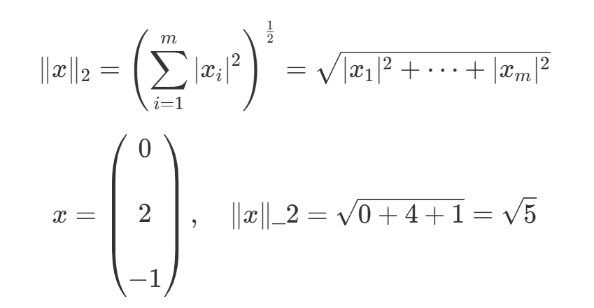
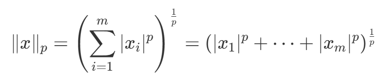
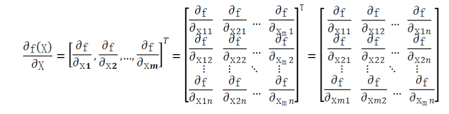
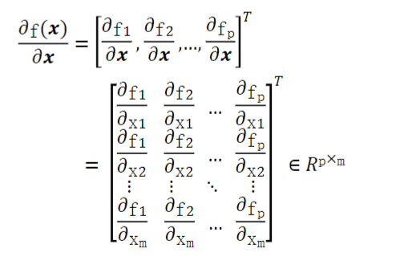
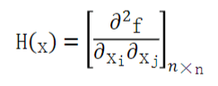
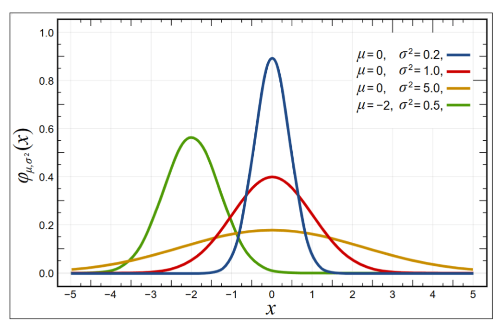

## 高数

### 导数

#### 导数概念

数学函数 $f(x) = y$ 指的是在直角坐标系内对于在某个点附近的变化率, 简单来说就是斜率（变化率）。这个所谓的变化率就是我们所谓的导数。


在微积分内, 导数的本质更加明确了。

即针对一个函数 $f(x)$, 他的自变量 $x_0$ 产生了一个极其微小的增量 $\Delta x$ 的时候, 函数的增量的输出值即为 $\Delta y$, 增加增量后的总输出值为 $f(x_0 + \Delta x)$

那么此时微小增量 $\Delta x 、\Delta y$ 与之前的 $x、y$ 相比较就会出现一个微小斜率（即导数）记作 $f'(x)$ 或者 $\frac{dy}{dx} x_0$ 或者 $\frac{df}{dx} | _{x=x_0}$

那么导数公式如下

$$f'(x_0) = \lim_{\Delta x \to 0} \frac{f(x_0 + \Delta x) - f(x_0)}{\Delta x}$$

解释为: 当 $x$ 变量的增量 $\Delta x$ 无限趋近于 0 的时候, 就相当于一个点的切线, 我们将其叫做函数 $f$ 在 $x_0$ 的导数


#### 基本函数的导数

| 说明           | 公式                                              | 例子                                            |
| -------------- | ------------------------------------------------- | ----------------------------------------------- |
| 常数的导数     | $(C)' = 0$                                        | $(3)' = 0$                                      |
| 幂函数的导数   | $(x^\alpha)' = \alpha x^ {\alpha-1}$              | $(x^3) = 3x^2$                                  |
| 指数函数的导数 | $(a^x)' = a^x \ln a$                              | $(3^x)' = 3^x \ln3$                             |
|                | $(e^x)' = e^x$                                    | $(e^x)' = e^x \ln e = e^x \log_ee = e^x$        |
| 对数函数的导数 | $(log_ax)' = \frac {1} {xlna}$ = ($x \ln a)^{-1}$ | $(log_3x)' = \frac {1} {xln_3}$ = $(x \ln3)^-1$ |
|                | $log_ex = (\ln x)' = \frac{1}{xlog_ee} = x^{-1}$  | -                                               |
| 三角函数的导数 | $(sinx)' = cosx$                                  | -                                               |
|                | $(cosx)' = -sinx$                                 | -                                               |
|                | $(tanx)' = sec^2x = \frac{1}{cos^2x}$             | -                                               |
|                | $(cotx)' = -csc^2x = \frac{-1}{sin^2x}$           | -                                               |

（$\ln a$ 指的是以 e 为底, a 的对数, 即 $\log_ea$）

-   [查看原函数与导数的图像](https://www.bilibili.com/video/BV1rD4y1g75U/?vd_source=138493e0e9f83502fed31a2a56970130)
-   指数函数与对数函数关系: $log_aN = b <=> a^b = N$

    

-   [三角函数](https://www.bilibili.com/video/BV1NS411w7ha/?spm_id_from=333.337.search-card.all.click&vd_source=138493e0e9f83502fed31a2a56970130)

#### 导数的求导法则

| 说明           | 公式                                           |
| -------------- | ---------------------------------------------- |
| 两函数之和求导 | $(f + g)' = f' + g'$                           |
| 两函数之积求导 | $(fg)' = f'g + fg'$                            |
| 两函数之商求导 | $(\frac{f}{g}) = \frac{f'g-fg'}{g^2}'$         |
| 复合函数求导   | 若$f(x)=h[g(x)]$, 则 f'(x) = h'(g(x)) \* g'(x) |

例: 求导函数 $f(x) = x^4 + sin(x^2) - \ln(x)e^x + 7$ 在 x = 3 处的导数

$$
\begin{aligned}
f(x) &= x^4 + sin(x^2) - \ln(x)e^x + 7\\\\
f(x)' &= (x^4)' + (sin(x^2)) - ((log_ex) * e^x)' + (7)'\\\\
      &= 4x^3 + cos(x^2) * 2x - ((\frac{1}{x \ln e} * e^x) + (log_ex * e^x )) + 0\\\\
      &= 4x^3 + 2xcos(x^2) - ((\frac{e^x}{x}) + (log_ex * x^e )) + 0\\\\
      &= 4x^3 + 2xcos(x^2) - ((\frac{e^x}{x}) + (\ln(x) * e^x)) + 0\\\\
      &= 4x^3 + 2xcos(x^2) - \frac{e^x}{x} - \ln(x)e^x\\\\
f(3) &= {4*3}^3 + {2 * 3} * cos(3^2) - \frac{e^3}{3} - \ln(3)e^3\\\\
      &= 108 + 6cos(6) - \frac{e^3}{3} - \ln(3)e^3
\end{aligned}
$$

#### 利用导数求极值

导数在数学上的图像含义, 其实就是一个函数在一个点上的切线的斜率, 有一个非常经典的案例就是利用导数来求取极值

对于机器学习而言, 很多时候都会把一个模型的求解转换为一个目标函数 $f(x)$ 进而求取极值, 这就是最优化问题

对于导数等于 0 的点来说（驻点）, 可能会取值为极大值或者极小值, 也可能都不是, 进一步判断驻点类型则需要查看导数在附近的符号

不能叫做最大值最小值, 而是叫极大值极小值, 因为可能有多个极值

例如 $f(x) = x^3$, 导数在 $x = 0$ 处为 0, 但是也不是极大值和极小值


#### 二阶导数

二阶导数, 顾名思义, 即导数的导数

一阶导数的意义是描述函数在某个点的变化率（斜率）, 那么二阶导数就是描述导函数在某个点的变化率, 也就是描述原函数在某个点的变化率的快慢

最为经典的就是速度与加速度公式, 速度公式为 $v = \frac{dx}{dt}$ 描述的是路程与时间之比, 也就是在某个点上的瞬时速度, 加速度公式为 $a = \frac{dv}{dt}$, 即瞬时速度在某个点上的加速度大小

二阶导数记为 $f''(x)$ 或者 $\frac{d^2y}{dx^2}$ 或者 $\frac{d}{dx} (\frac{dy}{dx})$

#### 二阶导数描述原函数凹凸性

简单来说, 二阶导数可以描述原函数的变化率快慢

我们首先以极端案例作为例子, 二阶导数全为正和全为负的情况

-   二阶导数全为正

    则说明原函数的曲线变化率持续增大, 并且是向上增大

    这个意味着如果一开始函数是向下衰减, 那么后续衰减幅度会下降直到为 0, 之后不断进行上升并加快上升

    用数学公式来表达, 即原函数 $f(\frac{x1 + x2}{2}) <= \frac{f(x1) + f(x2)}{2}$

    这样的函数称为下凸函数

    

-   二阶导数全为负

    则说明原函数的曲线变化率持续增大, 并且是向下增大

    这个意味着如果一开始函数是向上上升, 那么后续上升幅度会下降直到为 0, 之后不断进行下降并加快下降

    用数学公式来表达, 即原函数 $f(\frac{x1 + x2}{2}) >= \frac{f(x1) + f(x2)}{2}$

    这样的函数称为上凸函数

    

除了以上的极端情况, 还有一般情况, 即二阶导数有时候为正, 有时候为负, 有时候为 0

如果在某个点左边为正右边为负, 则函数从该点为上凸转下凸, 反之为下凸转上凸, 我们称为改点为拐点, $f''(x)=0$

但是需要注意, 函数连续则必定可导, 但是函数可导不一定连续, $f''(x)=0$ 的点不一定都是拐点

比如 $f(x) = x^4$, 导数为 $f'(x) = 4x^3$, 二阶导为 $f''(x) = 12x^2$, 二阶导永远 >= 0, 所以没有拐点

---

使用二阶导和导数可以判断某个函数在某个点上的驻点是否为极大值点或者极小值点

-   若 $f'(x) = 0$ 且 $f''(x) < 0$, 则该点为极大值点
-   若 $f'(x) = 0$ 且 $f''(x) > 0$, 则该点为极小值点
-   若 $f'(x) = 0$ 且 $f''(x) = 0$, 则该点可能为极大值点或者极小值点或者拐点

#### 函数描绘导数

<details>

```python
import numpy as np
import matplotlib.pyplot as plt

# 定义函数 y = sin(x)
# 圆的周长为 2π, 所以基本上 x 的值在 6 以内就可以完成整个 sin 函数的完整图像了, 步长给个 0.1
x = np.arange(0, 7, 0.1)
y = np.sin(x)
# 定义导函数 y' = cos(x)
y1 = np.cos(x)
# 函数和导函数图像放到一张图中
plt.plot(x, y, label="y = sin(x)")
plt.plot(x, y1, label="y' = cos(x)", linestyle="--")
plt.xlabel("x")
plt.ylabel("y")
plt.title("y1 = sin(x)")
# 添加图例
plt.legend()
plt.show()
```

</details>


### 偏导数和梯度

#### 偏导数

如果函数 $f$ 的变量不仅只有一个元素 $x$, 而是有多个元素

那么其实对于这种函数, 结果的值就在另一个纬度了, 比如 $f(x, y)$, $x、y$ 本身就是二维坐标轴 x、y 的点, 那么对于 $f(x, y)$ 的结果就应该是新的轴


那么对于多个变量的导数求解, 最简单的想法就是让其他变量先看成一个常数, 先对一个变量进行求导, 对于一个元素求导完成之后再看其他

这样求出的导数称之为偏导数, 比如

$$
\begin{aligned}
f(x, y) &= x^2 + xy + y^2\\\\
        &= 0 + x * 1 * y^0 + 2y\\\\
        &= x + 2y
\end{aligned}
$$

那么此时对于 y 的偏导数记作 $ \frac{\partial f}{\partial y} (x,y) = x + 2y$

抽象为数学公式, 即针对一个多元函数 $f(x_1,...,x_i,...,x_n)$, 在点 $a_1,...,a_i,...,a_n$ 上, 针对一个变量 $a_i$ 的偏导数定义为

$$
\frac{\partial f}{\partial x_i} (a_1,...,a_i,...,a_n) = \lim _{\Delta x_i \to 0} \frac{f(a_1 + ... + a_i + \Delta x_i + ... + a_n) - f(a_1 + ... + a_i + ... + a_n)}{\Delta x_i}
$$

在偏导数定义中, 除了 $x_i、\Delta x_i$ 外, 其他变量 $x_n$ 都保持不变, 看作常数。

#### 方向导数

在偏导数中, 其实固定其他变量而留有一个变量, 那么其实就是按照某个变量的方向进行的求导, 是一种特殊的方向导数

那么如果不按照某个变量的方向求导, 而是随便挑选一个方向 $l$ 求导, 那么就是一般的方向导数


以上图为例, 当前自变量只有 $x、y$, 也就是说函数 $f(x, y)$ 的最终结果取决于 $x、y$

在这样一个函数图像上随机取一个方向 $l$, 肯定会向 x 轴和 y 轴形成一个长度的投影

我们将投影的长度记为 $\Delta x = l * cos \alpha、\Delta y = l * cos \beta$

并且对于上图中的二元函数, 变化率的极限定义可以为

$$
\frac{\delta f}{\delta l} (x_0, y_0) = \lim_{l \to 0} \frac{f(x_0 + \Delta x, y_0 + \Delta y) - f(x_0, y_0)}{\Delta l}
$$

根据全微分公式 $\Delta z \approx f_x \Delta x + f_y \Delta y$, 即 $dz = f(x)dx + f(y)dy$, 可以将上面的极限公式推导为

$$
\frac{\delta f}{\delta l} (x_0, y_0) = f_x(x_0, y_0)\cos \alpha + f_y(x_0, y_0) \cos \beta
$$

$l$ 方向向量可以表示为 $l_0 = (\cos \alpha, \cos \beta)$

沿某个方向的变化率, 就被称为 𝑓(𝑥,𝑦) 沿方向 l 的方向导数

---

注意, 在这里有一个可能导致误解的错误

在多元函数的方向导数时, 方向 $\Delta l、\Delta x、\Delta y$ 的关系不能用勾股定理 $ \Delta l = \sqrt{\Delta x^2 + \Delta y^2}$ 来解释

因为我们在使用函数求导时是对一个标量进行计算, 而不是对一个向量进行计算

取一个具体的函数: $z = f(x, y) = 2x + 3y$

如果我们在零点进行一次微小变化, $\Delta x = 1$ 并且 $\Delta y = 1$。

-   新坐标: $(1, 1)$
-   新结果: $f(1, 1) = 2*1 + 3*1 = 5$
-   总的结果变化 $\Delta z_{\text{total}}$: $5 - 0 = 5$

如果采用勾股定理, 那么总的升高 = $\sqrt{(x引起的变化)^2 + (y引起的变化)^2} = \sqrt{(2)^2 + (3)^2} = \sqrt{4 + 9} = \sqrt{13} \approx 3.6$

很明显完全不对

这就是标量和向量的区别, 标量和向量的属性从根本上决定了我们处理它们变化的方式

-   在标量中, 最终的结果是由多个独立的变量的独立的微小变化叠加的, 每个变量之间全部独立没有任何对其他变量的影响。

    例如 温度、价格、海拔高度、密度、能量

-   在向量中, 不同原因导致的向量变化, 需要按向量加法（平行四边形法则或三角形法则） 来合成, 本质就是各个分量分别相加

    例如 位移、速度、力、电场强度

总结:

对于任何可微的标量场, 其输出的微小变化都可以用全微分公式（一种线性叠加）来近似计算。

而对于向量场的输出, 其变化则需要用更复杂的规则（通常是雅可比矩阵）来描述, 不能简单地进行标量相加。

---

方向导数推导逻辑

站在点 $P_0(x_0, y_0)$。

沿着一个单位向量 $\vec{l_0}$ 移动一个微小的距离。在你的图片中, 单位向量被表示为 $\vec{l_0} = (\cos \alpha, \cos \beta)$。这里的 $\cos \alpha$ 和 $\cos \beta$ 就是方向余弦, 它们就是这个单位向量的 x 分量和 y 分量。

移动的微小步长记为 $t$ ($t$ 是一个很小的数)。

计算位移:

当沿着方向 $\vec{l_0}$ 移动步长 $t$ 时, 的坐标变化 $(\Delta x, \Delta y)$ 是多少？

根据向量运算: $(\Delta x, \Delta y) = t \cdot \vec{l_0} = (t \cos \alpha,\ t \cos \beta)$

所以, $\Delta x = t \cos \alpha$

所以, $\Delta y = t \cos \beta$

代入全微分公式:

现在将这个特定的位移 $(\Delta x = t \cos \alpha, \Delta y = t \cos \beta)$ 代入全微分公式:

$$
\begin{aligned}
\Delta z &= f_x(x_0, y_0) \Delta x + f_y(x_0, y_0) \Delta y\\\\
        &= fx(x_0, y_0)(t \cos \alpha) + f_y(x_0, y_0) (t \cos \beta)
\end{aligned}
$$

求变化率（即方向导数）:

方向导数的定义是单位长度上的变化率。移动的总距离是步长 $t$。

所以, 沿方向 $\vec{l}$ 的平均变化率 = $\frac{\text{函数值变化量}}{\text{移动距离}} = \frac{\Delta z}{t}$

将上面 $\Delta z$ 的表达式代入:

$$
\begin{aligned}
\frac{\Delta z}{t} &= \frac{fx(x_0, y_0)(t \cos \alpha) + f_y(x_0, y_0) (t \cos \beta)}{t}\\\\
\frac{\Delta z}{t} &= fx(x_0, y_0)(\cos \alpha) + f_y(x_0, y_0) (\cos \beta)\\\\
\end{aligned}
$$

当的步长 $t$ 无限趋近于 0 时, 这个平均变化率就变成了瞬时变化率, 也就是方向导数。所以:

$$
\begin{aligned}
\frac{\delta f}{\delta l} = fx(x_0, y_0)(\cos \alpha) + f_y(x_0, y_0) (\cos \beta)
\end{aligned}
$$

其中 $fx(x_0, y_0)$ 代表着在点 $x_0, y_0$ 的偏导数, $\cos \alpha、\cos \beta$ 代表着单位微小变化 $l$ 的方向余弦, 即 $l_0 = (\cos \alpha, \cos \beta)$

也就是说, 上面的公式表达为: 方向导数即为微小变化 $l$ 所对应的所有纬度的偏导数与其投影乘积的和, 也就是沿着 $l$ 方向的变化率

#### 梯度

对于多元函数 $f(x_1, x_2, ..., x_n)$, 在点 a 处, 每个方向都有其偏导数, 即 $\frac{\delta f}{\delta x_1}(a)、...、\frac{\delta f}{\delta x_n}(a)$

所有的在点 a 处的偏导数即为梯度, 记为 $\nabla f(a)$ 或者 $grad f(a)$, 即

$$
\nabla f(a) = \left( \frac{\delta f}{\delta x_1}(a), ..., \frac{\delta f}{\delta x_n}(a) \right)
$$

例如, 对于函数 $f(x, y) = x^2 + xy + y^2$, 在点 $(1, 1)$ 的梯度为 $[3, 3]$

$$
\begin{aligned}
\nabla f(x, y) &= \left( \frac{\delta f}{\delta x}(x, y), \frac{\delta f}{\delta y}(x, y) \right)\\\\
               &= [(x^2 + xy + y^2)' , (x^2 + xy + y^2)']\\\\
               &= [(2x + y) , (x + 2y)]\\\\
\nabla f(1, 1) &= [(2x + y) , (x + 2y)]\\\\
               &= [(2 + 1) , (1 + 2)]\\\\
               &= [3, 3]\\\\
\end{aligned}
$$

梯度向量表示还有一层含义, 对于每个方向导数来说, 它的最大值（最大斜率、最大变化率）就是偏导数（因为其他方向的角度都是 0）

所以梯度向量的方向是函数值变化最快的方向

---

梯度向量十分重要, 因为在机器学习中, 很多时候都需要求取最大值, 那么对于一个函数 $f$, 可能十分复杂, 导数很可能变得不可取或者有时候根本不可导

那么这个时候求取最大值就很麻烦了, 但是我们仍然有梯度这个工具

梯度这个工具好就好在它可以选择任意一个点, 然后判断在这个点上变化最快的方向是什么, 然后无论是想要上升还是下降, 都可以沿着这个方向或者相反方向移动

这样循环往复, 逐步逼近最大值点

有一个著名的方法就叫做梯度下降法, 用的就是这个数学原理。梯度下降法往往会用到最小损失的方法中

## 线性代数

### 标量与向量

#### 标量与向量概念

-   标量（scalar）: 只有大小, 没有方向
-   向量（vector）: 有大小有方向, 在标量的基础上增加了方向

向量可以分为行向量与列向量

$$
\begin{pmatrix}
a\\\\
b
\end{pmatrix}
$$

$$
\begin{pmatrix}
a b
\end{pmatrix}
$$

不过在一般情况下, 数学中一般都用列向量表示, 而在程序中就更没有横和列的概念了, 有的只是一串序列

这个向量可以看成在坐标系中的一个射线, 比如 $x = \begin{pmatrix} 1 2 3 \end{pmatrix}$ 就可以看作在三维坐标系中, 从原点出发到坐标为 $x = (1, 2, 3)$ 的射线

#### 向量运算

-   向量转置: 列向量和行向量相互转化, 用 $^T$ 来表达

    $$
    x =
    \begin{pmatrix}
    2\\\\
    5\\\\
    8
    \end{pmatrix}
    $$

    $$
    x^T =
    \begin{pmatrix}
    2 & 5 & 8
    \end{pmatrix}
    $$

-   向量相加: 对应元素相加

    $\begin{pmatrix} 2\\\\ 5\\\\ 8 \end{pmatrix} + \begin{pmatrix} 1\\\\ 3\\\\ 7 \end{pmatrix} = \begin{pmatrix} 3\\\\ 8\\\\ 15 \end{pmatrix}$

-   向量与标量相乘: 向量中的每个元素与标量的乘积

    $3 * \begin{pmatrix} 2\\\\ 5\\\\ 8 \end{pmatrix} = \begin{pmatrix} 6\\\\ 15\\\\ 24 \end{pmatrix}$

-   向量内积: 两个向量对应元素乘积之和, 结果为一个标量, 也叫做向量点乘

    $$
    \langle \mathbf{x}, \mathbf{y} \rangle\\\\
    = \left\langle \begin{pmatrix} 2\\\\ 5\\\\ 8 \end{pmatrix}, \begin{pmatrix} 1\\\\ 3\\\\ 7 \end{pmatrix} \right\rangle\\\\
    = 2 \times 1 + 5 \times 3 + 8 \times 7 = 2 + 15 + 56 = 73
    $$

-   两个向量之间的夹角

    $$
    \cos \theta = \frac{\langle \mathbf{x}, \mathbf{y} \rangle}{\sqrt{\langle \mathbf{x}, \mathbf{x} \rangle} \sqrt{\langle \mathbf{y}, \mathbf{y} \rangle}}
    $$

#### 向量范数

向量范数（norm）其实就是一类函数, 这类函数存在长度的概念

向量范数这类函数必须满足三个条件:

-   非负性: 向量范数必须大于等于 0
-   满足齐次性:

    假如存在一个范数 $\mathbf{x}$, 那么此范数的向量范数乘以一个标量 $c \|\mathbf{x}\|$ 就等同于此向量 $c$ 倍的向量的范数 $\|c\mathbf{x}\|$

    $$\|c\mathbf{x}\| = c \|\mathbf{x}\|$$

-   满足三角不等式:

    假如存在向量 $\mathbf{x}$ 和 $\mathbf{y}$, 那么 $\mathbf{x}、\mathbf{y}$ 的合范数必然小于等于两个范数只和, 即

    $$\|\mathbf{x} + \mathbf{y}\| \leq \|\mathbf{x}\| + \|\mathbf{y}\|$$

有几个非常经典的向量范数:

-   L0 范数, 也叫做 0 范数, 即非零元素的个数

    $$x = \begin{pmatrix} 0\\\\ 2\\\\ -1 \end{pmatrix}, \|x\|_0 = 2$$

-   L1 范数, 也叫做 1 范数, 也叫做和范数

    向量中每个元素的绝对值之和

    $$ \|x\|_1 = \sum_{i=1}^m |x_i| = |x_1| + \cdots + |x_m| $$

    $$ x = \begin{pmatrix} 0\\\\ 2\\\\ -1 \end{pmatrix}, \quad \|x\|\_1 = 0 + 2 + 1 = 3 $$

-   L2 范数, 也叫做 2 范数, 也叫做欧几里得范数

    每个具体元素的绝对值的平方和叠加, 最后开二次根号

    

-   Lp 范数

    L1 也可以理解为是每个元素的一次方然后开一次根号, L2 是每个元素的二次方然后开二次根号

    那么可以推导出 Lp 范数, 即每个元素的绝对值求取 p 次方, 叠加求和再开 p 次根号

    

    在 numpy 中, 可以利用 linalg.norm 函数方便地计算向量的范数

#### 向量代码测试

<details>

```python
import numpy as np

# 定义向量, 在 numpy 中没有行向量和列向量的区别, 都是序列
x = np.array([2, 5, 8])

# 向量转置, 但是在 numpy 中向量转置没有区别, 因为是序列
print(x.T)

# 向量相加
y = np.array([1, 3, 7])
print(x + y)

# 向量与标量相乘
print(x * 3)

# 向量与向量相乘（点积）
# 注意直接 x * y 其实不是点积, 而是对应位置元素的乘法
print(x.dot(y))
print(np.dot(x, y))
print(x @ y)

# 向量范数
# 求取非负数量
l0_norm = np.linalg.norm(x, ord=0)
print(l0_norm)
# 求取绝对值之积
l1_norm = np.linalg.norm(x, ord=1)
print(l1_norm)
# 求平方和后开根号, 也是默认方法
l2_norm = np.linalg.norm(x, ord=2)
print(l2_norm)
```

</details>

### 矩阵

#### 矩阵基本概念

一个 $m \times n$ 的矩阵（matrix）是一个有 $m$ 行 $n$ 列元素的矩形阵列

用 $\mathbb{R}^{m \times n}$ 表示所有 $m \times n$ 实数矩阵的向量空间, $\mathbb{R}$ 表示实数集

$$
\begin{bmatrix}
1 & 2\\\\
3 & 5\\\\
4 & 8
\end{bmatrix}
\in \mathbb{R}^{3 \times 2}
$$

有几个特殊矩阵:

-   方阵: 行列数量相同的矩阵

    $$
    \begin{bmatrix}
    1 & 2\\\\
    3 & 4
    \end{bmatrix}
    \in \mathbb{R}^{2 \times 2}
    $$

-   对角矩阵: 方阵的特殊形式, 主对角线以外元素全为 0 的方阵

    $$
    \begin{bmatrix}
    1 & 0 & 0\\\\
    0 & 5 & 0\\\\
    0 & 0 & 9
    \end{bmatrix}
    $$

-   单位矩阵: 方阵的特殊形式, 主对角线元素全为 1 的对角矩阵, 一般使用 $I$ 表示

    $$
    I_{3 \times 3} =
    \begin{bmatrix}
    1 & 0 & 0\\\\
    0 & 1 & 0\\\\
    0 & 0 & 1
    \end{bmatrix}
    $$

#### 矩阵运算

##### 矩阵加减

矩阵的加减法运算十分简单, 对应的位置上相加减即可

##### 矩阵乘法

矩阵的乘法运算, 也叫矩阵的叉乘, 其实是前面矩阵的每一行去乘后面矩阵的每一列

比如 $A \in \mathbb{R}^{m \times n}$ 和 $B \in \mathbb{R}^{n \times p}$, 那么 $A \times B \in \mathbb{R}^{m \times p}$（A 的行数必须等于 B 的列数）, 具体为:

$$
\begin{bmatrix} 1 & 0 & 2\\\\ -1 & 3 & 1\end{bmatrix}
\times
\begin{bmatrix} 3 & 1\\\\ 2 & 1\\\\ 1 & 0 \end{bmatrix}
    = \begin{bmatrix} 1 \times 3 + 0 \times 2 + 2 \times 1 & 1 \times 1 + 0 \times 1 + 2 \times 0\\\\ (-1) \times 3 + 3 \times 2 + 1 \times 1 & (-1) \times 1 + 3 \times 1 + 1 \times 0 \end{bmatrix}
    = \begin{bmatrix} 5 & 1\\\\ 4 & 2 \end{bmatrix}
$$

记为


矩阵与单位矩阵相乘为它自身

$$
\begin{bmatrix} 1 & 2\\\\ 3 & 5\\\\ 4 & 8 \end{bmatrix}
\times
\begin{bmatrix} 1 & 0\\\\ 0 & 1\end{bmatrix}
    = \begin{bmatrix}
        1 \times 1 + 2 \times 0 & 1 \times 0 + 2 \times 1
       \\\\ 3 \times 1 + 5 \times 0 & 3 \times 0 + 5 \times 1
       \\\\ 4 \times 1 + 8 \times 0 & 4 \times 0 + 8 \times 1
      \end{bmatrix}
    = \begin{bmatrix} 1 & 2\\\\ 3 & 5\\\\ 4 & 8 \end{bmatrix}
$$

---

矩阵乘法的性质: 满足结合律、左分配率、右分配率, 但是不满足交换律

-   结合律:

    若 $A \in \mathbb{R}^{m \times n}、B \in \mathbb{R}^{n \times p}、C \in \mathbb{R}^{p \times q}$, 则

    $(A \times B) \times C = A \times (B \times C)$

-   左分配率:

    若 $A \in \mathbb{R}^{m \times n}、B \in \mathbb{R}^{m \times n}、C \in \mathbb{R}^{n \times p}$, 则

    $(A + B) \times C = (A \times C) + (B \times C)$

-   右分配率:

    若 $A \in \mathbb{R}^{m \times n}、B \in \mathbb{R}^{n \times p}、C \in \mathbb{R}^{n \times p}$, 则

    $A \times (B + C) = (A \times B) + (A \times C)$

##### 矩阵转置

矩阵的转置就是行变列, 列变行, 比如 $A^T \in \mathbb{R} ^ {m \times n}$ 的转置为 $A^T \in \mathbb{R}^{n \times m}$

矩阵转置的性质:

-   $(A^T)^T = A$
-   $(A + B)^T = A^T + B^T$
-   $(kA)T = kA^T$, k 为标量
-   $(A \times B)^T = B^T \times A^T$

    A 与 B 相乘后结果的转置 = B 的转置在前, A 的转置在后 相乘

#### 矩阵的逆

对于方阵 $A$, 假如存在另一个方阵 $A^{-1}$, 使得满足 $AA^{-1} = A^{-1}A = I$, 则称 $A$ 矩阵的逆为 $A^{-1}$

不是方阵的矩阵其实也存在某种矩阵, 这种矩阵与原矩阵相乘后的结果是一个单位矩阵

但是这种矩阵就不符合矩阵的乘法规则 $AA^{-1} = A^{-1}A = I$, 只是满足 $AA^{-1} = I$

这种矩阵称为伪逆矩阵

#### 矩阵的基本运算与代码测试

<details>

```python
import numpy as np

A = np.array([[1, 2, 3], [4, 5, 6]])
B = np.array([[1, 3, 7], [5, 0, 2]])

# 取得矩阵中的元素
print(f'A[0][0] {A[0][0]}')

# 矩阵转置
print(A.T)

# 矩阵相加
print(A + B)

# 矩阵与标量相乘
print(3 * A)

# 矩阵与向量相乘, 注意矩阵的列数必须等于向量的长度, 也就是说对矩阵的每一行进行相乘
x = np.array([2, 3, 4])
print(A * x)

# 矩阵与矩阵相乘, 注意不能 A * B, 使用这种方式是对应元素位置相乘（哈达玛积）
print(A.dot(B.T))
print(A @ B.T)

# 直接计算矩阵的逆, 计算出来的数据类型是个浮点型的矩阵
C = np.array([[1, 2], [3, 5]])
C_inv = np.linalg.inv(C)
print(C_inv)

'''
计算矩阵的逆与矩阵乘积
由于计算出来的矩阵的逆是浮点型, 所以有精度缺失, 不是严格意义上的 0 和 1
所以可以做一个整数转型
'''
C_inv = np.around(C_inv).astype(int)
print(C @ C_inv)

# 得到伪逆矩阵, 可以看到 A * A_pinv 为单位矩阵, 但是 A_pinv * A 不是单位矩阵, 所以是逆矩阵
A_pinv = np.linalg.pinv(A)
print(A_pinv)
print(A @ A_pinv)
print(A_pinv @ A)
```

</details>

#### 其他矩阵运算

-   矩阵的向量化

    矩阵的向量化, 就是将 $A \in \mathbb{R}^{m \times n}$ 进行行向量化或者列向量化, 即

    行向量化 $vec(A) = [a_{11}, \cdots, a_{m1}, \cdots, a_{1n}, \cdots, a_{mn}]$

    例如 $A = \begin{bmatrix} 1 & 2\\\\ 3 & 4 \end{bmatrix}$, $vec(A) = \begin{pmatrix} 1\\\\ 2\\\\ 3\\\\ 4 \end{pmatrix}$

    列向量化 $rvec(A) = [a_{11}, \cdots, a_{1n}, \cdots, a_{m1}, \cdots, a_{mn}]$

    例如 $A = \begin{bmatrix} 1 & 2\\\\ 3 & 4 \end{bmatrix}$, $rvec(A) = \begin{pmatrix} 1 & 2 & 3 & 4 \end{pmatrix}$

    在计算机内部, 使用矩阵的向量化, 可以简化运算, 方便分割, 如果保留二维则有可能导致拼接错误的问题

-   矩阵的内积

    矩阵的内积其实和向量的内积一样, 最终得到的结果都是标量

    相同行列的矩阵, 两个矩阵对应元素乘积之和即为矩阵内积

    $A \in \mathbb{R}^{m \times n}、B \in \mathbb{R}^{m \times n}$ 两个矩阵的内积为

    $$
    \left\langle A, B \right\rangle = \left\langle vec(A), vec(B) \right\rangle = \sum a_{i,j}b_{i,j}
    $$

-   矩阵的 Hadamard（哈达玛） 积

    矩阵 $A \in \mathbb{R}^{m \times n}$ 和矩阵 $B \in \mathbb{R}^{m \times n}$ 的 Hadamard 积记作 $A \bigodot B$, 它是两个矩阵对应元素的乘积, 是一个 $m \times n$ 的矩阵。

    $(A \bigodot B)_{ij} = a_{ij} b_{ij}$

-   矩阵的 Kronecker（克罗内克）积, 也叫做直积或者张量积

    矩阵 $A \in \mathbb{R}^{m \times n}$ 和矩阵 $B \in \mathbb{R}^{p \times q}$ 的 Kronecker 积记作 $A \bigotimes B$, 它是矩阵 $A$ 中每个元素与矩阵 $B$ 的乘积, 是一个 $mp \times nq$ 的矩阵。

    

    Kronecker 积中的两个矩阵的行列可以完全不同

    矩阵 A 中的每一个元素都会和 B 矩阵做一个相乘

    也就是说此时 A 中的每一个元素都作为一个标量与 B 矩阵相乘, 相乘完毕之后再展开最后的结果

    最后形成的矩阵, 列为 nq 列, 同样的行为 mp 行

#### 张量

张量 tensor 可以视为多维数组, 是标量（0 纬度）, 1 纬度和 2 纬度矩阵的 n 纬推广

比如矩阵的 Kronecker 积, 就是将矩阵 A 和 B 相乘, 结果是一个 K 阶张量

比如三维张量

$$
\begin{bmatrix}
\begin{bmatrix} 1 & 2 \\\\ 3 & 5 \\\\ 4 & 8 \end{bmatrix} &
\begin{bmatrix} 3 & 2 \\\\ 1 & 6 \\\\ 7 & 3 \end{bmatrix} &
\begin{bmatrix} 5 & 6 \\\\ 9 & 1 \\\\ 2 & 4 \end{bmatrix}
\end{bmatrix}
$$

#### 其他矩阵运算代码测试

<details>

```python
import numpy as np


A = np.array([[1, 2, 3], [4, 5, 6]])
B = np.array([[1, 3, 7], [5, 0, 2]])

# 向量化, 矩阵的向量化就是行向量化
print(A.flatten())

# 哈达玛积
print(A * B)
print(np.multiply(A, B))

'''
矩阵内积, A 与 B 对应位置元素相乘然后求和
一种算法是哈达玛积后的求和值
一种方式是两组元素分别向量化, 然后求向量化的点积
'''
print(f"<A, B> = {np.sum(A * B)}")
print(f"<A, B> = {np.dot(A.flatten(), B.flatten())}")

# 克罗内克积
print(np.kron(A, B))

# 张量
tensor = np.array([[[1, 2, 3], [4, 5, 6]], [[1, 3, 7], [5, 0, 2]]])
print(tensor.shape)
```

</details>

#### 矩阵求导

##### 矩阵求导概念

矩阵求导, 其实就是函数对每个变元（自变量）进行求导, 只不过是写成了向量和矩阵的形态而已

下面对变元求导的符号和函数做出统一规定:

符号:

-   $x = [x_1, x_2, ..., x_m]^T \in R^m$ 为实向量变元
-   $\mathbf{X} = [\mathbf{x_1}, \mathbf{x_2}, ..., \mathbf{x_m}]^T \in R^{m \times n}$ 为实矩阵变元

函数:

-   $f(x) \in R$ 为实标量函数, 其中变元 $x$ 为实向量（即变量为向量结果为标量）
-   $f(\mathbf{X}) \in R$ 为实标量函数, 其变元 $\mathbf{X}$ 为实矩阵
-   $f(x) \in R^p$ 为实向量函数, 其中变元 $x$ 为实向量
-   $f(\mathbf{X}) \in R^p$ 为实向量函数, 其中变元 $\mathbf{X}$ 为实矩阵

函数也可以是矩阵形式 $\mathbf{F}$, 可以看作是向量函数的扩展

##### 典型计算场景

###### 标量 $f(x)$ 对向量 $x$ 求导

一般定义向量为列向量形式, 但是写起来不太方便, 所以使用转置形式

定义列向量 $x = [x_1, x_2, ..., x_n]^T$, 所以 $f(x) = f(x_1, x_2, ..., x_n)$

对其求导, 即 $f'(x) = [f'(x_1), f'(x_2), ..., f'(x_n)]^T$

若 $f(x_1, x_2) = x_1^2 + x_1x_2 + 2x_2^2$, 令 $x = [x_1, x_2]^T$, 则

$$
\begin{aligned}
f'(x) &= [\frac{\delta f}{\delta x_1}, \frac{\delta f}{\delta x_2}]^T \\\\
      &=[2x_1 + x_2, x_1 + 2x_2]^T
\end{aligned}
$$

###### 标量 $f(x)$ 对矩阵 $\mathbf{X}$ 求导

变元 $\mathbf{X}$ 是一个 $m \times n$ 的矩阵, 可以看为 $m$ 个行向量的组合, 每个向量的纬度为 $n$


那么 $f$ 对 $\mathbf{X}$ 进行求导, 其实也是对每一个元素进行求导, 其结果形状与 $\mathbf{X}$ 相同



###### 向量 $f(x)$ 对标量 $x$ 进行求导

可以看成为多个函数组合, 那么对于向量 $f(x) = [f(x_1), f(x_2), ..., f(x_n)^T]$

此时 $f$ 可以看作为多个函数的组合, 对 $x$ 进行求导时只要让其中的元素分别对 $x$ 进行求导即可

$$
\frac{\delta f(x)}{\delta x} = [\frac{\delta f_1(x)}{\delta x}, \frac{\delta f_2(x)}{\delta x}, ..., \frac{\delta f_p(x)}{\delta x}]^T
$$

例如 $f(x) = [f_1(x), f_2(x)] = [2x^2 + 3x + 1, \sin(x)]^T$

$\frac{\delta f(x)}{\delta x} = [\frac{\delta f_1(x)}{x}, \frac{\delta f_2(x)}{x}]^T = [4x + 3, \cos(x)]^T$

###### 向量 $f(x)$ 对向量 $x$ 进行求导

向量函数可以写为 $f(x) = [f_1(x), f_2(x), ..., f_p(x)]^T$, 其中 f 的每一个元素, 都是变元 $x$ 为向量的实标量函数

那么针对每一个实标量函数都进行求导, 得到一个矩阵



###### 常用求导结果

-   $\frac{\delta x^Ta}{\delta x} = \frac{\delta a^Tx}{\delta x} = a$
-   $\frac{\delta x^Tx}{\delta x} = 2x$
-   $\frac{\delta Ax}{\delta x} = A^T$
-   $\frac{\delta x^TA}{\delta x} = A$
-   $\frac{\delta x^TAx}{\delta x} = (A^T + A)x$
-   $\frac{\delta a^TXb}{\delta X} = ab^T$
-   $\frac{\delta a^TX^Tb}{\delta X} = \frac{\delta {a^TX^Tb}^T}{\delta X} = \frac{\delta b^TXa}{\delta X} = ba^T$
-   $\frac{\delta a^TXX^Tb}{\delta X} = ab^TX + ba^TX$
-   $\frac{\delta a^TX^TXb}{\delta X} = Xba^T + Xab^T$

#### 梯度矩阵

对于实向量变元 $x$, 实标量函数 $f(x)$ 的梯度向量, 为 $𝑚 \times 1$ 的列向量（与 $x$ 形状相同）


对于矩阵变元 $X(m × n)$, 可以类似地得到 $f(X)$ 的梯度矩阵


类似地, $f(x)$ 的二阶偏导构成的矩阵被称为黑塞矩阵(Hessian Matrix)



### 核心概念梳理

-   标量：单个数值, 只有大小

    求导就是普通的导数

    例如 $f(x) = x^2$, 求导是 $f'(x) = 2x$

    这时候导数表现的就是函数变化率

    所以我们的普通求导其实就是针对一个标量的变元求导, 这时候标量是一个数, 那么本质上是对一个变量进行求导

    ***

    到了偏导数和方向导数的时候, 其实针对的是多个标量变元进行求导, 这个时候标量还是一个数, 那么其实本质上是对多个数据进行求导

    $f(x, y) = x^2 + y^2$, 求偏导是 $\frac{\delta f}{\delta x} = 2x$ 和 $\frac{\delta f}{\delta y} = 2y$

-   向量：一组数值, 在数学意义上有大小和方向

    这个时候, 既然向量是一组数, 那么对一个向量进行求导, 本质上是对一组数进行求导

    但是虽然说是一组数据, 但是在数学意义上, 这个多组数据仍然是一个对象

    那么对一个向量进行求导, 得到的是一个梯度向量, 这个梯度向量包含的是所有的偏导数

    $x = [x_1, x_2, x_3]$, 那么 $f(x) = [f(x_1), f(x_2), f(x_3)] \to f'(x) = \nabla f(x) = [\frac{\delta f}{x_1}, \frac{\delta f}{x_2}, \frac{\delta f}{x_3}]$

-   矩阵：一个表格的数值, 可以看成是多组数据

    这个时候, 矩阵由多组数组成, 那么对矩阵进行求导, 本质上是对多组数据进行求导

    $X = [[x_{11}, x_{12}], [x_{21}, x_{22}]]$

    那么求导结果 $\frac{\delta f}{\delta X} = [[\frac{\delta f}{\delta x_{11}}, \frac{\delta f}{\delta x_{12}}],[\frac{\delta f}{\delta x_{21}}, \frac{\delta f}{\delta x_{22}}]]$

```text
第1层：标量对标量求导        (高数基础)
        ↓
第2层：标量对多个标量求偏导   (多元微积分)
        ↓
第3层：标量对向量求导         (把多个标量打包成向量)
        ↓
第4层：标量对矩阵求导         (把更多标量打包成矩阵)
        ↓
第5层：向量对向量求导         (多个函数对多个变量)
```

事实上, 我们之前分的四类其实是将相同的东西给了不同的分类, 反而会对人造成混淆, 其实只需要查看两个视角即可：

1. 看函数输出：函数输出是标量还是变量（单个值还是多个值）
2. 看输入的变元：变元是标量还是变量（单个值还是一组值还是多组值）

在函数输出为标量的前提下, 最终导数取决于输入的变元是啥：

-   标量函数 + 标量变元 = 普通导数
-   标量函数 + 向量变元 = 梯度
-   标量函数 + 矩阵变元 = 梯度矩阵

在函数输出为向量的前提下, 输入向量变元就是雅克比矩阵：

-   向量函数 + 向量变元 = 雅可比矩阵

## 概率论

### 概率的计算

概率是对时间发生的可能性的度量, 通常将事件 $A$ 的概率写作 $P(A)$

| 概率公式类型                    | 公式表达式                                                                                           |
| ------------------------------- | ---------------------------------------------------------------------------------------------------- |
| A                               | $P(A) \in [0, 1]$                                                                                    |
| 非 A                            | $P(\bar{A}) = 1 - P(A)$                                                                              |
| A 和 B（联合概率）              | $P(A \cap B) = P(A \mid B)P(B) = P(B \mid A)P(A)$ <br/> 当 A、B 相互独立时: $P(A \cap B) = P(A)P(B)$ |
| A 或 B                          | $P(A \cup B) = P(A) + P(B) - P(A \cap B)$ <br/> 当 A、B 互斥时: $P(A \cup B) = P(A) + P(B)$          |
| B 的情况下 A 的概率（条件概率） | $P(A \mid B) = \frac{P(A \cap B)}{P(B)} = \frac{P(B \mid A)P(A)}{P(B)}$                              |

现有一个装有 10 个球的袋子, 其中有 6 个红球和 4 个蓝球。从中随机抽取两个球。我们定义以下事件：

-   事件 A：第一个抽到的是红球
-   事件 B：两个抽到的球都是红球

-   计算联合概率

    

-   计算条件概率（B 发生的前提下, 发生 A 的概率）

    

### 概率分布

概率分布, 表示的是某一次试验的某一个结果发生的可能性的大小

#### 均匀分布

也叫做矩形分布, 它表示在相同长度间隔的分布概率是等可能的

均匀分布有两个参数 a、b 定义, 分别是数轴上的最小值和最大值, 通常写为 $U(a, b)$

均匀分布概率密度函数可以写为

$$
P(x) = \frac{1}{b - a}, a < x < b\\\\
P(x) = 0, else
$$

#### 正态分布

正态分布 normal distribution, 也叫高斯分布, 是常见的概率分布

若随机变量 $X$ 服从一个平均数为 $\mu$, 标准差为 $\sigma$（$\sigma = \sqrt{\frac{1}{n} \sum_{i=1}^{n} (x_i - \mu)^2}$）的正态分布, 则记为 $X \sim N(\mu, \sigma^2)$, 其概率密度函数：

$$f(x) = \frac{1}{\sigma \sqrt{2\pi}} e^{-\frac{(x - \mu)^2}{2\sigma^2}}$$

正态分布的期望 $\mu$ 可解释为位置参数, 决定了分布的位置；其方差 $\sigma^2$ 可解释为尺度参数, 决定了分布的幅度

意思就是说, $\mu$ 代表的是一个所有的随机取值的一个平均值, $\sigma^2$ 代表的是一个所有的随机取值的一个方差, 方差的大小决定了最后的概率是集中在平均值周围还是分散平均值之外



正态分布的曲线类似钟型, 所以也叫做钟形曲线, 其中红色曲线 $\mu = 0, \sigma = 1$ 为标准正态分布

```python
import numpy as np

# 随机生成 0-1 均匀分布的数据
print(np.random.rand(5))

# 随机生成 0-1 均匀分布的整数
print(np.random.randint(0, 100, size=[5]))

# 随机生成标准正态分布的数据
print(np.random.randn(5))
```

#### 贝叶斯定理

贝叶斯定理 Bayes' theorem 是概率论中的核心定理, 在已知条件概率信息的基础上, 如何更新或者计算事件的概率

贝叶斯定理特别适合处理逆向概率问题, 即已经知道结果反推原因

##### 全概率公式

对于一个复杂事件 B, 可能多个事件 A1、A2、……、An 都可以触发, 但是事件 A1、A2、……、An 互斥（不会同时发生）, 并且 A1、A2、……、An 所有事件发生概率只和为 1（即必然有一个事件可以发生）, 则 A1、A2、……、An 为一个完备事件组

那么复杂事件 B 发生的概率其实就是所有事件 A、B 的联合概率之和, 即

$$
\begin{aligned}
P(B) &= P(B|A_1)P(A_1) + P(B|A_2)P(A_2) + ... + P(B|A_n)P(A_n)\\\\
     &= \sum_{i}^{n} P(B|A_i)P(A_i)
\end{aligned}
$$

这个公式即为全概率公式

##### 贝叶斯公式

贝叶斯公式建立在条件概率的基础上

假设存在事件 A、B, 贝叶斯定理描述了在已知 B 发生的前提下, A 发生的概率

$$
P(A|B) = \frac{P(B|A)P(A)}{P(B)}
$$

其中：

-   $P(A|B)$: B 发生的前提下, A 发生的概率, 也就是所求概率
-   $P(B|A)$: A 发生的前提下, B 发生的概率
-   $P(A)$: A 发生的概率
-   $P(B)$: B 发生的概率

在实际问题中, $P(B)$ 通常不会得到, 而是要通过全概率公式进行计算, 例如：

某疾病发病率为 1%, 如果一个人有疾病, 检测呈现阳性的概率为 95%, 如果一个人无疾病, 检测呈阳性的概率为 5%, 现在有一个人检测结果呈现阳性, 请求真正患病的概率是多少？

针对这个问题, 我们将呈现阳性的事件定义为 B, 患病事件为 A, 那么患病呈现阳性的概率为 95% 即 P(B|A) = 0.95, 求 $P(A|B)$, 也就是 $P(患病|阳性)$

$$
\begin{aligned}
  P(患病|阳性) &= \frac{P(阳性|患病)P(患病)}{P(阳性)}\\\\
              &= \frac{P(阳性|患病)P(患病)}{P(阳性|患病)P(患病) + P(阳性|不患病)P(不患病)}\\\\
              &= \frac{0.95 * 0.01}{0.95 * 0.01 + 0.05 * 0.99}\\\\
              &\approx 0.161 \approx 16\%
\end{aligned}
$$

### 似然函数

似然函数和概率分布都是推导事件的发生概率, 不过仍然有所不同

概率分布更多的是根据已知的参数推导一个未知的事件发生概率, 而似然函数是根据已知的事件推导已知参数的更大可能性的取值（有点像贝叶斯公式）

-   概率分布式由因推果, 比如已知抛硬币正面朝上概率为 0.6, 求 10 次抛硬币 7 次朝上的概率是多少
-   似然函数是果推因, 比如抛硬币 10 次, 7 次正面朝上, 那么求硬币朝上的概率为多少

现在定义 $\theta$ 为参数, $X$ 为观测到的数据, 似然函数定义为 $L(\theta \mid X)$ 且参数化的概率模型为 $P(X \mid \theta)$ 则

$$L(\theta \mid X) = P(X \mid \theta)$$

这里, $P(X \mid \theta)$ 表示在参数为 $\theta$ 的情况下, 观察到数据 $X$ 的概率

设有一组独立同分布的观测数据 $X = (x_1, x_2, \ldots, x_n)$, 并且这些数据服从某个分布（例如正态分布、二项分布等）, 比如服从参数为 $\theta$ 的某个分布, 那么似然函数可以写作：

$$L(\theta \mid X) = P(X \mid \theta) = \prod_{i=1}^{n} P(x_i \mid \theta)$$

针对其中存在的乘法, 可以使用对数函数将其转化为加法：

$$\log L(\theta \mid X) = \log \prod_{i=1}^{n} P(x_i \mid \theta) = \sum_{i=1}^{n} \log P(x_i \mid \theta)$$

---

注：对数函数可以将乘法转加法, 即

若 $M = b^m, N = n^n$, 则 $MN = b^m n^n = b^{m + n}$ 那么 $log_b(MN) = log_b(M) + log_b(N) = m + n$

### 极大似然估计

极大似然估计的目的是找到一个 $\theta$ 值, 使得似然函数最大化

例如抛硬币 3 次, 其中有 2 次正面 1 次背面, 那么正面概率 0.5 为多少, 0.6 为多少。最有可能的正面概率为多少？

使用 $\theta$ 作为硬币正面朝上的概率, 使用 $X$ 代表已知结果 2 次正面 1 次背面, 则

$$
\begin{aligned}
  L(\theta | X) &= P(X | \theta) = C_3^2 \theta^2 (1 - \theta)^1\\\\
                &= \frac{3!}{2!(3-2)!} \theta^2 (1 - \theta)^1\\\\
                &= 3 \theta^2 (1 - \theta)^1
\end{aligned}
$$

若假设正面概率为 0.5, 那么正面概率为 0.5 的可能性为 $L(0.5|X) = 3 * (0.5)^2 * (1 - 0.5)^1 = 0.375$

若假设正面概率为 0.6, 那么正面概率为 0.6 的可能性为 $L(0.6|X) = 3 * (0.6)^2 * (1 - 0.6)^1 = 0.432$

为了找出极大似然估计, 对似然函数取对数求导, 使其值为 0, 则

$logL(\theta | X) = logC_3^2 + log \theta^2 + log(1 - \theta)$

$logL(\theta | X) = log3 + 2log\theta + log(1 - \theta)$

$\frac{dlogL(\theta | X)}{d \theta} = \frac{2}{\theta} - \frac{1}{1 - \theta} = 0$

$\theta = \frac{2}{3}$
