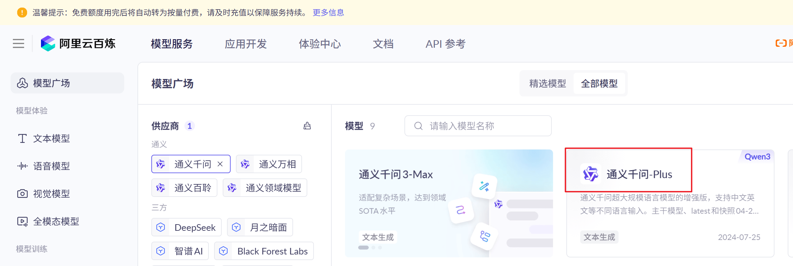
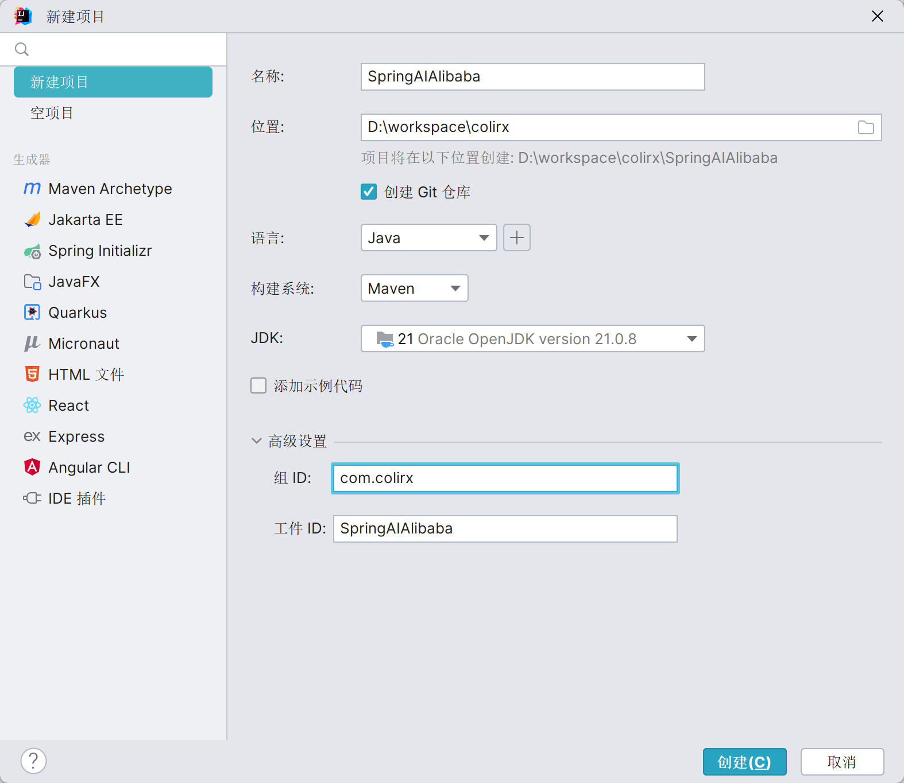
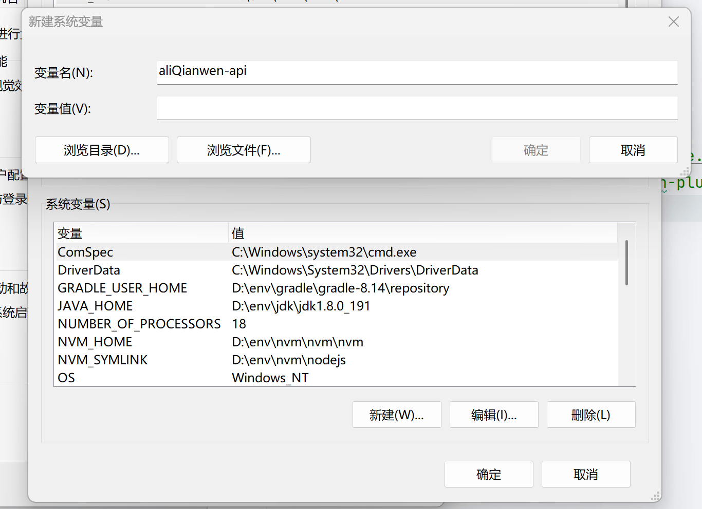
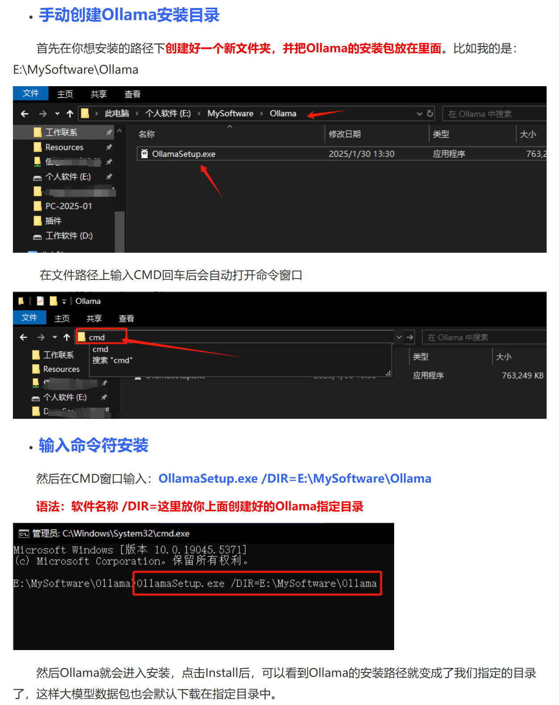
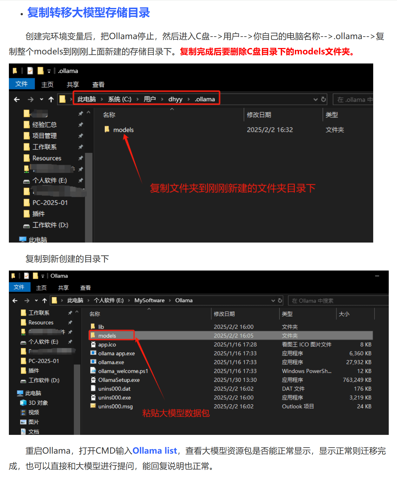
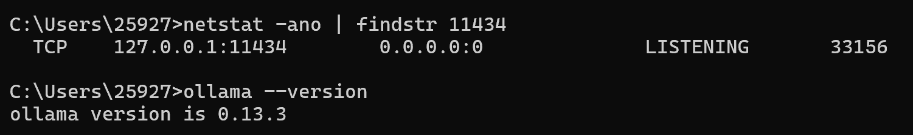
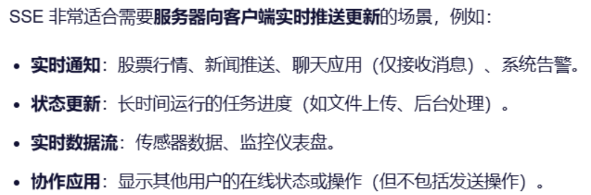
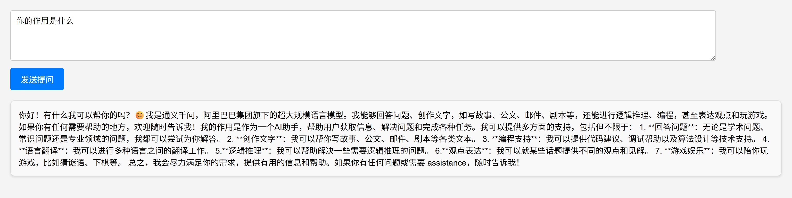
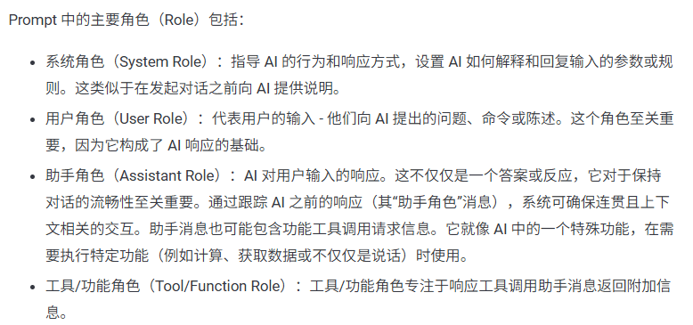
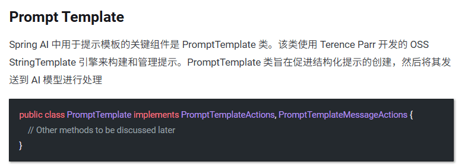

## Spring AI Alibaba

[Spring AI Alibaba](https://java2ai.com/) 基于 Spring AI，用来简化 Spring 开发者开发智能体应用的过程

### 配置规则约定

- 模型：DeepSeek、[阿里百炼](https://bailian.console.aliyun.com/)
- 前置条件：JDK 17+、Maven 3.8+、LLM
- Spring AI Alibaba、Spring AI、Spring Boot 依赖兼容关系：Spring AI Alibaba 1.0.0.2、Spring AI 1.0.0、SpringBoot 3.4.5（更高点也可以）
- 配置规则：均基于 OpenAI 协议标准或者 SpringAI Alibaba 官方推荐的灵积服务 DashScope 整合规则

使用大模型：

- 获得密钥

    

- 使用大模型：`qwen-plus`

    

    

- 获得后台微服务的[调用](https://bailian.console.aliyun.com/?tab=api#/api)

    

### 总体父工程搭建

1. 新建 project

    

2. [maven](https://java2ai.com/docs/1.0.0.2/tutorials/starters-and-quick-guide/?spm=5176.29160081.0.0.2856aa5c0l3sEA#%E4%BD%BF%E7%94%A8-bom-%E7%AE%A1%E7%90%86%E4%BE%9D%E8%B5%96%E7%89%88%E6%9C%AC)

    <details>

    ```xml
    <properties>
        <maven.compiler.source>17</maven.compiler.source>
        <maven.compiler.target>17</maven.compiler.target>
        <project.build.sourceEncoding>UTF-8</project.build.sourceEncoding>
        <spring-boot.version>3.5.5</spring-boot.version>
        <spring-ai.version>1.0.0</spring-ai.version>
        <SpringAIAlibaba.version>1.0.0.2</SpringAIAlibaba.version>
    </properties>

    <dependencyManagement>
        <dependencies>
            <!-- Spring Boot -->
            <dependency>
                <groupId>org.springframework.boot</groupId>
                <artifactId>spring-boot-dependencies</artifactId>
                <version>${spring-boot.version}</version>
                <type>pom</type>
                <scope>import</scope>
            </dependency>
            <!-- Spring AI Alibaba -->
            <dependency>
                <groupId>com.alibaba.cloud.ai</groupId>
                <artifactId>spring-ai-alibaba-bom</artifactId>
                <version>${SpringAIAlibaba.version}</version>
                <type>pom</type>
                <scope>import</scope>
            </dependency>
            <!-- Spring AI -->
            <dependency>
                <groupId>org.springframework.ai</groupId>
                <artifactId>spring-ai-bom</artifactId>
                <version>${spring-ai.version}</version>
                <type>pom</type>
                <scope>import</scope>
            </dependency>
        </dependencies>
    </dependencyManagement>

    <build>
        <plugins>
            <plugin>
                <groupId>org.springframework.boot</groupId>
                <artifactId>spring-boot-maven-plugin</artifactId>
                <version>${spring-boot.version}</version>
            </plugin>
        </plugins>
    </build>

    <repositories>
        <repository>
            <id>spring-milestones</id>
            <name>Spring Milestones</name>
            <url>https://repo.spring.io/milestone</url>
            <snapshots>
                <enabled>false</enabled>
            </snapshots>
        </repository>
    </repositories>
    ```

    </details>

### 快速开始

1. 新建 module

    

2. maven

    <details>

    ```xml
    <dependencies>
        <dependency>
            <groupId>org.springframework.boot</groupId>
            <artifactId>spring-boot-starter-web</artifactId>
        </dependency>
        <!-- 引入 springai alibaba DashScope 模型适配的 Starter -->
        <dependency>
            <groupId>com.alibaba.cloud.ai</groupId>
            <artifactId>spring-ai-alibaba-starter-dashscope</artifactId>
        </dependency>
        <!--lombok-->
        <dependency>
            <groupId>org.projectlombok</groupId>
            <artifactId>lombok</artifactId>
            <optional>true</optional>
        </dependency>
        <!--hutool-->
        <dependency>
            <groupId>cn.hutool</groupId>
            <artifactId>hutool-all</artifactId>
            <version>5.8.22</version>
        </dependency>
        <dependency>
            <groupId>org.springframework.boot</groupId>
            <artifactId>spring-boot-starter-test</artifactId>
            <scope>test</scope>
        </dependency>
    </dependencies>

    <build>
        <plugins>
            <plugin>
                <groupId>org.springframework.boot</groupId>
                <artifactId>spring-boot-maven-plugin</artifactId>
            </plugin>
            <plugin>
                <groupId>org.apache.maven.plugins</groupId>
                <artifactId>maven-compiler-plugin</artifactId>
                <version>3.11.0</version>
                <configuration>
                    <compilerArgs>
                        <arg>-parameters</arg>
                    </compilerArgs>
                    <source>17</source>
                    <target>17</target>
                </configuration>
            </plugin>
        </plugins>
    </build>

    <repositories>
        <repository>
            <id>spring-milestones</id>
            <name>Spring Milestones</name>
            <url>https://repo.spring.io/milestone</url>
            <snapshots>
                <enabled>false</enabled>
            </snapshots>
        </repository>
    </repositories>
    ```

    </details>


3. 配置文件

    ```properties
    server.port=8001

    # 大模型对于中文对话乱码 UTF8 处理
    server.servlet.encoding.enabled=true
    server.servlet.encoding.force=true
    server.servlet.encoding.charset=UTF-8

    spring.application.name=SAA-01HelloWorld

    # Spring Ai Alibaba config
    spring.ai.dashscope.api-key=${aliQianwen-api}
    spring.ai.dashscope.base-url=https://dashscope.aliyuncs.com/compatible-mode/v1
    spring.ai.dashscope.chat.options.model=qwen-plus
    ```

4. 密钥管理，可以直接到本电脑上的环境变量配置，配置完成后重启 IDEA

    

5. 配置类

    ```java
    package com.colirx.config;

    import com.alibaba.cloud.ai.dashscope.api.DashScopeApi;
    import org.springframework.beans.factory.annotation.Value;
    import org.springframework.context.annotation.Bean;
    import org.springframework.context.annotation.Configuration;

    @Configuration
    public class SaaLLMConfig {

        /*
            方式一：使用 ${} 读取配置文件中的配置
            方式二：使用 System.getenv("环境变量") 进行配置
        */
        @Value("${spring.ai.dashscope.api-key}")
        private String apiKey;

        @Bean
        public DashScopeApi dashScopeApi() {
            return DashScopeApi.builder().apiKey(apiKey).build();
        }
    }
    ```

6. 对话模型 ChatModel，与大模型进行交互

    ```java
    package com.colirx.controller;

    import jakarta.annotation.Resource;
    import org.springframework.ai.chat.model.ChatModel;
    import org.springframework.web.bind.annotation.GetMapping;
    import org.springframework.web.bind.annotation.RequestParam;
    import org.springframework.web.bind.annotation.RestController;
    import reactor.core.publisher.Flux;

    @RestController
    public class ChatHelloController {

        // 调用 LLM
        @Resource
        private ChatModel chatModel;

        /**
         * 通用调用，返回内容是拿到所有结果一并返回
         */
        @GetMapping("/hello/dochat")
        public String doChat(@RequestParam(name = "msg", defaultValue = "你是谁") String messgae) {
            return chatModel.call(messgae);
        }

        /**
         * 流式返回调用，返回内容是一点一点来的，有多少返回多少，一点一点返回
         */
        @GetMapping("/hello/dostream")
        public Flux<String> doStream(@RequestParam(name = "msg", defaultValue = "你是谁") String messgae) {
            return chatModel.stream(messgae);
        }
    }
    ```

    

## Ollama 私有化部署和对接本地大模型

### ollama 安装

[ollama](https://ollama.com/) 类似 docker，可以部署和管理 LLM




环境变量为: `OLLAMA_MODELS`



默认端口启动在 11434



安装通义千问大模型，自己测试差不多得了


退出则在命令行使用 `/bye` 命令


### 本地 API 调用 ollama

新建一个模块，SAA-02Ollama，其余不变，加新的依赖

```xml
<dependencies>
    <dependency>
        <groupId>org.springframework.boot</groupId>
        <artifactId>spring-boot-starter-web</artifactId>
    </dependency>
    <!--spring-ai-alibaba dashscope-->
    <dependency>
        <groupId>com.alibaba.cloud.ai</groupId>
        <artifactId>spring-ai-alibaba-starter-dashscope</artifactId>
    </dependency>
    <!--ollama-->
    <dependency>
        <groupId>org.springframework.ai</groupId>
        <artifactId>spring-ai-starter-model-ollama</artifactId>
        <version>1.0.0</version>
    </dependency>
    <!--lombok-->
    <dependency>
        <groupId>org.projectlombok</groupId>
        <artifactId>lombok</artifactId>
        <optional>true</optional>
    </dependency>
    <!--hutool-->
    <dependency>
        <groupId>cn.hutool</groupId>
        <artifactId>hutool-all</artifactId>
        <version>5.8.22</version>
    </dependency>
    <dependency>
        <groupId>org.springframework.boot</groupId>
        <artifactId>spring-boot-starter-test</artifactId>
        <scope>test</scope>
    </dependency>
</dependencies>
```

配置文件中添加 ollama 的配置

```properties
server.port=8002

# 大模型对于中文对话乱码 UTF8 处理
server.servlet.encoding.enabled=true
server.servlet.encoding.force=true
server.servlet.encoding.charset=UTF-8

spring.application.name=SAA-02Ollama

# Spring Ai Alibaba config
spring.ai.dashscope.api-key=${aliQwen-api}
spring.ai.ollama.base-url=http://localhost:11434
# 确保本地的模型中存在本模型
spring.ai.ollama.chat.model=qwen3:0.6b
```

使用 controller

```java
@RestController
public class OllamaController {

    /**
     * 因为当前 ChatModel 中有两个启动类：DashScopeChatModel、OllamaChatModel
     * 如果不指定会冲突报错，所以只能指定
     */
    @Resource(name = "ollamaChatModel")
    private ChatModel chatModel;

    @GetMapping("/ollama/chat")
    public String chat(@RequestParam(name = "msg") String msg) {
        return chatModel.call(msg);
    }

    @GetMapping("/ollama/streamchat")
    public Flux<String> streamchat(@RequestParam(name = "msg", defaultValue = "你是谁") String msg) {
        return chatModel.stream(msg);
    }
}
```

## ChatClient 与 ChatModel


新建模块 SAA-03ChatModelChatClient，导入配置

```xml
<dependencies>
    <dependency>
        <groupId>org.springframework.boot</groupId>
        <artifactId>spring-boot-starter-web</artifactId>
    </dependency>
    <!--spring-ai-alibaba dashscope-->
    <dependency>
        <groupId>com.alibaba.cloud.ai</groupId>
        <artifactId>spring-ai-alibaba-starter-dashscope</artifactId>
    </dependency>
    <!--lombok-->
    <dependency>
        <groupId>org.projectlombok</groupId>
        <artifactId>lombok</artifactId>
        <optional>true</optional>
    </dependency>
    <!--hutool-->
    <dependency>
        <groupId>cn.hutool</groupId>
        <artifactId>hutool-all</artifactId>
        <version>5.8.22</version>
    </dependency>
    <dependency>
        <groupId>org.springframework.boot</groupId>
        <artifactId>spring-boot-starter-test</artifactId>
        <scope>test</scope>
    </dependency>
</dependencies>
```

```properties
server.port=8003

# 大模型对于中文对话乱码 UTF8 处理
server.servlet.encoding.enabled=true
server.servlet.encoding.force=true
server.servlet.encoding.charset=UTF-8

spring.application.name=SAA-03ChatModelChatClient

# Spring Ai Alibaba config
spring.ai.dashscope.api-key=${aliQianwen-api}
spring.ai.dashscope.base-url=https://dashscope.aliyuncs.com/compatible-mode/v1
spring.ai.dashscope.chat.options.model=qwen-plus
```

```java
@Configuration
public class SaaLLMConfig {
    @Bean
    public DashScopeApi dashScopeApi() {
        return DashScopeApi.builder().apiKey(System.getenv("aliQianwen-api")).build();
    }

    /**
     * 因为 ChatClient 没办法直接使用 @Resource 导入，所以需要预先建一个 Bean
     */
    @Bean
    public ChatClient chatClient(ChatModel dashscopeChatModel) {
        return ChatClient.builder(dashscopeChatModel).build();
    }
}
```

```java
@RestController
public class ChatClientController {

    /**
     * chatModel + ChatClient 混合使用
     */
    @Resource
    private ChatModel chatModel;

    @Resource
    private ChatClient dashScopechatClient;

    @GetMapping("/chatclient/dochat")
    public String doChat(@RequestParam(name = "msg",defaultValue = "你是谁") String msg)
    {
        return dashScopechatClient.prompt().user(msg).call().content();
    }

    @GetMapping("/chatmodel/dochat")
    public String doChat2(@RequestParam(name = "msg",defaultValue = "你是谁") String msg)
    {
        return chatModel.call(msg);
    }
}
```


生产状态下可以混合使用，两者不是非此即彼

## Server-SentEvents 实现 Stream 流式输出及更多模型共存

流式输出是一种逐步返回大模型生成结果的技术，生成一点返回一点，允许服务器将响应内容分批次实时传输给客户端，而不是等待全部内容生成完毕后再一次性返回
 
这种机制能显著提升用户体验，尤其适用于大模型响应较慢的场景（如生成长文本或复杂推理结果）

SpringAI Alibaba 流式输出有 ChatModel Stream、ChatClient Stream


Server-Sent Events (SSE) 是一种允许服务端可以持续推送数据片段（如逐词或逐句）到前端的 Web 技术

通过单向的 HTTP 长连接，使用一个长期存在的连接，让服务器可以主动将数据"推"给客户端，SSE 是轻量级的单向通信协议，适合 AI 对话这类服务端主导的场景

SSE 的核心思想是：客户端发起一个请求，服务器保持这个连接打开并在有新数据时，通过这个连接将数据发送给客户端

这与传统的请求-响应模式（客户端请求一次，服务器响应一次，连接关闭）有本质区别，SSE 下一代（Stream able Http）

具体前置知识需要查看响应式编程

Flux 是 SpringWebFlux 中的一个核心组件，属于响应式编程模型的一部分

它主要用于处理异步、非阻塞的流式数据，能够高效地处理高并发场景

Flux可以生成和处理一系列的事件或数据如流式输出等



新建子模块 SAA-04StreamingOutput

```xml
<dependencies>
    <dependency>
        <groupId>org.springframework.boot</groupId>
        <artifactId>spring-boot-starter-web</artifactId>
    </dependency>
    <!--spring-ai-alibaba dashscope-->
    <dependency>
        <groupId>com.alibaba.cloud.ai</groupId>
        <artifactId>spring-ai-alibaba-starter-dashscope</artifactId>
    </dependency>
    <!--lombok-->
    <dependency>
        <groupId>org.projectlombok</groupId>
        <artifactId>lombok</artifactId>
        <version>1.18.38</version>
    </dependency>
    <!--hutool-->
    <dependency>
        <groupId>cn.hutool</groupId>
        <artifactId>hutool-all</artifactId>
        <version>5.8.22</version>
    </dependency>
    <dependency>
        <groupId>org.springframework.boot</groupId>
        <artifactId>spring-boot-starter-test</artifactId>
        <scope>test</scope>
    </dependency>
</dependencies>
```

```properties
server.port=8004

# 大模型对于中文对话乱码 UTF8 处理
server.servlet.encoding.enabled=true
server.servlet.encoding.force=true
server.servlet.encoding.charset=UTF-8

spring.application.name=SAA-04StreamingOutput

# Spring Ai Alibaba config
spring.ai.dashscope.api-key=${aliQianwen-api} 
```

```java
@Configuration
public class SaaLLMConfig {

    // 模型名称常量定义
    private final String DEEPSEEK_MODEL = "deepseek-v3";
    private final String QWEN_MODEL = "qwen-plus";

    @Bean(name = "deepseek")
    public ChatModel deepSeek() {
        return DashScopeChatModel.builder()
            .dashScopeApi(DashScopeApi.builder().apiKey(System.getenv("aliQianwen-api")).build())
            .defaultOptions(DashScopeChatOptions.builder().withModel(DEEPSEEK_MODEL).build())
            .build();
    }

    @Bean(name = "qwen")
    public ChatModel qwen() {
        return DashScopeChatModel.builder()
            .dashScopeApi(DashScopeApi.builder().apiKey(System.getenv("aliQianwen-api")).build())
            .defaultOptions(DashScopeChatOptions.builder().withModel(QWEN_MODEL).build())
            .build();
    }

    @Bean(name = "deepseekChatClient")
    public ChatClient deepseekChatClient(@Qualifier("deepseek") ChatModel deepSeek) {
        return ChatClient.builder(deepSeek)
            .defaultOptions(ChatOptions.builder().model(DEEPSEEK_MODEL).build())
            .build();
    }


    @Bean(name = "qwenChatClient")
    public ChatClient qwenChatClient(@Qualifier("qwen") ChatModel qwen) {
        return ChatClient.builder(qwen)
            .defaultOptions(ChatOptions.builder().model(QWEN_MODEL).build())
            .build();
    }
}
```

```java
@RestController
public class StreamOutputController {

    // V1 通过ChatModel实现stream实现流式输出
    @Resource(name = "deepseek")
    private ChatModel deepseekChatModel;
    @Resource(name = "qwen")
    private ChatModel qwenChatModel;

    // V2 通过ChatClient实现stream实现流式输出
    @Resource(name = "deepseekChatClient")
    private ChatClient deepseekChatClient;
    @Resource(name = "qwenChatClient")
    private ChatClient qwenChatClient;

    @GetMapping(value = "/stream/chatflux1")
    public Flux<String> chatflux(@RequestParam(name = "question", defaultValue = "你是谁") String question) {
        return deepseekChatModel.stream(question);
    }

    @GetMapping(value = "/stream/chatflux2")
    public Flux<String> chatflux2(@RequestParam(name = "question", defaultValue = "你是谁") String question) {
        return qwenChatModel.stream(question);
    }

    @GetMapping(value = "/stream/chatflux3")
    public Flux<String> chatflux3(@RequestParam(name = "question", defaultValue = "你是谁") String question) {
        return deepseekChatClient.prompt(question).stream().content();
    }

    @GetMapping(value = "/stream/chatflux4")
    public Flux<String> chatflux4(@RequestParam(name = "question", defaultValue = "你是谁") String question) {
        return qwenChatClient.prompt(question).stream().content();
    }
}
```

新建前端模块 `static/index.html`

```html
<!DOCTYPE html>
<html>
<head>
    <title>SSE流式chat</title>
    <style>
        body {
            font-family: Arial, sans-serif;
            background-color: #f4f4f4;
            margin: 0;
            padding: 20px;
        }

        #messageInput {
            width: 90%;
            padding: 10px;
            font-size: 16px;
            border: 1px solid #ccc;
            border-radius: 4px;
            margin-bottom: 10px;
        }

        button {
            padding: 10px 20px;
            font-size: 16px;
            background-color: #007bff;
            color: white;
            border: none;
            border-radius: 4px;
            cursor: pointer;
        }

        button:hover {
            background-color: #0056b3;
        }

        #messages {
            margin-top: 20px;
            padding: 15px;
            background-color: #f9f9f9;
            border: 1px solid #ddd;
            border-radius: 8px;
            max-height: 300px;
            overflow-y: auto;
            box-shadow: 0 2px 4px rgba(0, 0, 0, 0.1);
        }

        #messages div {
            padding: 8px 0;
            border-bottom: 1px solid #eee;
            font-size: 14px;
            color: #333;
        }

        #messages div:last-child {
            border-bottom: none;
        }
    </style>
</head>
<body>
<textarea id="messageInput" rows="4" cols="50" placeholder="请输入你的问题..."></textarea><br>
<button onclick="sendMsg()">发送提问</button>
<div id="messages"></div>
<script>
    function sendMsg() {
        // 获取用户输入的消息
        const message = document.getElementById('messageInput').value;
        if (message == "") return false;

        //1 客户端使用 JavaScript 的 EventSource 对象连接到服务器上的一个特定端点（URL）
        const eventSource = new EventSource('stream/chatflux2?question=' + message);
        //2 监听消息事件
        eventSource.onmessage = function (event) {
            // 获取流式返回的数据
            const data = event.data;
            // 将接收到的数据展示到页面上
            const messagesDiv = document.getElementById('messages');
            messagesDiv.innerHTML += event.data;
        };

        //3 监听错误事件
        eventSource.onerror = function (error) {
            console.error('EventSource 发生错误：', error);
            eventSource.close(); // 关闭连接
        };
    }
</script>
</body>
</html>
```



## Prompt

### 提示词


Prompt 最开始只是简单的字符串，随着时间的推移，prompt 逐渐开始包含特定的占位符，例如 AI 模型可以识别的 “USER:”、“SYSTEM:” 等


上述被称为 prompt 中的四大角色



新建子模块 springAI-05chat-Prompt

```xml
<dependencies>
    <dependency>
        <groupId>org.springframework.boot</groupId>
        <artifactId>spring-boot-starter-web</artifactId>
    </dependency>
    <!--spring-ai-alibaba dashscope-->
    <dependency>
        <groupId>com.alibaba.cloud.ai</groupId>
        <artifactId>spring-ai-alibaba-starter-dashscope</artifactId>
    </dependency>
    <!--hutool-->
    <dependency>
        <groupId>cn.hutool</groupId>
        <artifactId>hutool-all</artifactId>
        <version>5.8.22</version>
    </dependency>
    <!--lombok-->
    <dependency>
        <groupId>org.projectlombok</groupId>
        <artifactId>lombok</artifactId>
        <version>1.18.34</version>
    </dependency>
    <dependency>
        <groupId>org.springframework.boot</groupId>
        <artifactId>spring-boot-starter-test</artifactId>
        <scope>test</scope>
    </dependency>
</dependencies>
```

```properties
server.port=8005

# 大模型对于中文对话乱码 UTF8 处理
server.servlet.encoding.enabled=true
server.servlet.encoding.force=true
server.servlet.encoding.charset=UTF-8

spring.application.name=springAI-05chat-Prompt

# Spring Ai Alibaba config
spring.ai.dashscope.api-key=${aliQianwen-api} 
```

```java
@Configuration
public class SaaLLMConfig {
    // 模型名称常量定义
    private final String QWEN_MODEL = "qwen-plus";

    @Bean(name = "qwen")
    public ChatModel qwen() {
        return DashScopeChatModel.builder().dashScopeApi(DashScopeApi.builder().apiKey(System.getenv("aliQianwen-api")).build()).defaultOptions(DashScopeChatOptions.builder().withModel(QWEN_MODEL).build()).build();
    }

    @Bean(name = "qwenChatClient")
    public ChatClient qwenChatClient(@Qualifier("qwen") ChatModel qwen) {
        return ChatClient.builder(qwen).defaultOptions(ChatOptions.builder().model(QWEN_MODEL).build()).build();
    }
}
```

```java
@RestController
public class PromptController {

    @Resource(name = "qwen")
    private ChatModel qwenChatModel;

    @Resource(name = "qwenChatClient")
    private ChatClient qwenChatClient;

    // http://localhost:8005/prompt/chat?question=火锅介绍下
    @GetMapping("/prompt/chat")
    public Flux<String> chat(@RequestParam(name = "question") String question) {
        return qwenChatClient.prompt()
            // AI 能力边界
            .system("你是一个法律助手，只回答法律问题，其它问题回复，我只能回答法律相关问题，其它无可奉告")
            .user(question)
            .stream()
            .content();
    }


    /**
     * http://localhost:8005/prompt/chat2?question=葫芦娃
     */
    @GetMapping("/prompt/chat2")
    public Flux<ChatResponse> chat2(@RequestParam(name = "question") String question) {
        // 系统消息
        SystemMessage systemMessage = new SystemMessage("你是一个讲故事的助手,每个故事控制在300字以内");
        // 用户消息
        UserMessage userMessage = new UserMessage(question);
        Prompt prompt = new Prompt(userMessage, systemMessage);
        return qwenChatModel.stream(prompt);

    }

    /**
     * http://localhost:8005/prompt/chat3?question=葫芦娃
     */
    @GetMapping("/prompt/chat3")
    public Flux<String> chat3(@RequestParam(name = "question") String question) {
        // 系统消息
        SystemMessage systemMessage = new SystemMessage("你是一个讲故事的助手," + "每个故事控制在600字以内且以HTML格式返回");
        // 用户消息
        UserMessage userMessage = new UserMessage(question);
        Prompt prompt = new Prompt(userMessage, systemMessage);
        return qwenChatModel.stream(prompt).map(response -> response.getResults().get(0).getOutput().getText());

    }

    /**
     * http://localhost:8005/prompt/chat4?question=葫芦娃
     *
     * @param question
     * @return
     */
    @GetMapping("/prompt/chat4")
    public String chat4(@RequestParam(name = "question") String question) {
        AssistantMessage assistantMessage = qwenChatClient.prompt().user(question).call().chatResponse().getResult().getOutput();

        return assistantMessage.getText();

    }

    /**
     * http://localhost:8005/prompt/chat5?city=北京
     */
    @GetMapping("/prompt/chat5")
    public String chat5(@RequestParam(name = "city") String city) {
        String answer = qwenChatClient.prompt()
            .user(city + "未来3天天气情况如何?")
            .call()
            .chatResponse()
            .getResult()
            .getOutput()
            .getText();
        ToolResponseMessage toolResponseMessage = new ToolResponseMessage(List.of(new ToolResponseMessage.ToolResponse("1", "获得天气", city)));
        String toolResponse = toolResponseMessage.getText();
        return answer + toolResponse;
    }
}
```

### 提示词模板



新建子模块 SAA-06PromptTemplate

```xml
<dependencies>
    <dependency>
        <groupId>org.springframework.boot</groupId>
        <artifactId>spring-boot-starter-web</artifactId>
    </dependency>
    <!--spring-ai-alibaba dashscope-->
    <dependency>
        <groupId>com.alibaba.cloud.ai</groupId>
        <artifactId>spring-ai-alibaba-starter-dashscope</artifactId>
    </dependency>
    <!--lombok-->
    <dependency>
        <groupId>org.projectlombok</groupId>
        <artifactId>lombok</artifactId>
        <version>1.18.38</version>
    </dependency>
    <!--hutool-->
    <dependency>
        <groupId>cn.hutool</groupId>
        <artifactId>hutool-all</artifactId>
        <version>5.8.22</version>
    </dependency>
    <dependency>
        <groupId>org.springframework.boot</groupId>
        <artifactId>spring-boot-starter-test</artifactId>
        <scope>test</scope>
    </dependency>
</dependencies>
```

```properties
server.port=8006

# 大模型对于中文对话乱码 UTF8 处理
server.servlet.encoding.enabled=true
server.servlet.encoding.force=true
server.servlet.encoding.charset=UTF-8

spring.application.name=SAA-06PromptTemplate

# Spring Ai Alibaba config
spring.ai.dashscope.api-key=${aliQianwen-api} 
```

```java
@Configuration
public class SaaLLMConfig {
    // 模型名称常量定义
    private final String DEEPSEEK_MODEL = "deepseek-v3";
    private final String QWEN_MODEL = "qwen-plus";

    @Bean(name = "deepseek")
    public ChatModel deepSeek() {
        return DashScopeChatModel.builder().dashScopeApi(DashScopeApi.builder().apiKey(System.getenv("aliQianwen-api")).build()).defaultOptions(DashScopeChatOptions.builder().withModel(DEEPSEEK_MODEL).build()).build();
    }

    @Bean(name = "qwen")
    public ChatModel qwen() {
        return DashScopeChatModel.builder().dashScopeApi(DashScopeApi.builder().apiKey(System.getenv("aliQianwen-api")).build()).defaultOptions(DashScopeChatOptions.builder().withModel(QWEN_MODEL).build()).build();
    }

    @Bean(name = "deepseekChatClient")
    public ChatClient deepseekChatClient(@Qualifier("deepseek") ChatModel deepSeek) {
        return ChatClient.builder(deepSeek).defaultOptions(ChatOptions.builder().model(DEEPSEEK_MODEL).build()).build();
    }


    @Bean(name = "qwenChatClient")
    public ChatClient qwenChatClient(@Qualifier("qwen") ChatModel qwen) {
        return ChatClient.builder(qwen).defaultOptions(ChatOptions.builder().model(QWEN_MODEL).build()).build();
    }
}
```

```java
@RestController
public class PromptTemplateController {
    @Resource(name = "deepseek")
    private ChatModel deepseekChatModel;
    @Resource(name = "qwen")
    private ChatModel qwenChatModel;

    @Resource(name = "deepseekChatClient")
    private ChatClient deepseekChatClient;
    @Resource(name = "qwenChatClient")
    private ChatClient qwenChatClient;

    /**
     * PromptTemplate基本使用，使用占位符设置模版 PromptTemplate
     * http://localhost:8006/prompttemplate/chat?topic=java&output_format=html&wordCount=200
     */
    @GetMapping("/prompttemplate/chat")
    public Flux<String> chat(@RequestParam("topic") String topic, @RequestParam("output_format") String output_format, @RequestParam("wordCount") String wordCount) {
        PromptTemplate promptTemplate = new PromptTemplate("" +
            "讲一个关于{topic}的故事" +
            "并以{output_format}格式输出，" +
            "字数在{wordCount}左右");

        // PromptTempate -> Prompt
        Prompt prompt = promptTemplate.create(Map.of(
            "topic", topic,
            "output_format", output_format,
            "wordCount", wordCount));

        return deepseekChatClient.prompt(prompt).stream().content();
    }
}
```