## AI 通识

AI 的核心是神经网络结构，现在的技术已经迭代到了 transformer 架构，本质上是来模拟人类的神经元

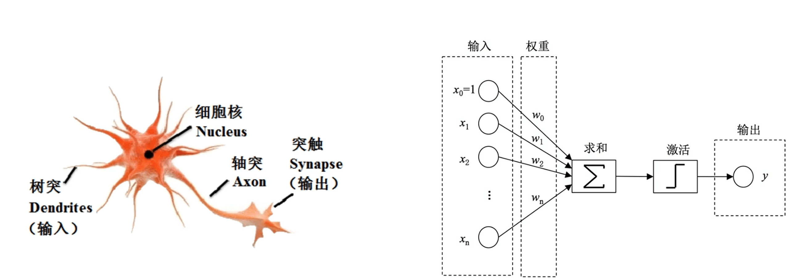

千千万万个神经元链接起来，被称之为深度神经元网络

深度神经元网络分为很多层，分为：输入层（入口，接收数据）、隐藏层（信息处理和学习，可以有很多层）、输出层（出口，产生结果）

---

神经网络的训练是一个复杂过程，以图像识别为例子，比如要识别一个图片上的数字，那么本质上是数学公式


给定的图片是 28 x 28 的图片，每一个像素点都是一个神经元，本质上其实就是判断这些神经元所在的灰度值是否能够与相应数字的灰度值链接

然后 `28 x 28 = 784` 这个隐藏层所有的值相加，就会得到一个结果，即可以看成 $f(x) = x_1 + x_2 ... + x_n$

但是这样又出现了一个问题，就是假如有一些污点或者其他问题，导致我们不想要识别的位置也识别了，那么就有问题了

所以基于此又多出了一个权重值，也就是判断我们是否想要某个神经元作为重要的识别单位，完全不在意则将权重调小，非常在意则调高

所以数学公式就是

$$f(x) = w_1 x_1 + w_2 x_2 + ... + w_n x_n = \sum_{i=1}^n w_i x_i$$

在此基础上，还有一个阈值问题，就是如果最后的计算结果超出某个阈值，则认为这个结果可行，如果不超出阈值则认为不可行，所以为

$$f(x) = \sum_{i=1}^n w_i x_i - b$$

到目前位置，计算结果已经很完善了，这个值加到最后不知道最后的结果有多大，很可能超出想象，所以给一个激活函数，也就是归一函数，让最后的结果在 0 到 1 之间，所以最后的结果为

$$f(x) = g(\sum_{i=1}^n w_i x_i - b)$$

---

那么基于公式，我们可以知道权重和神经元本身的值是决定最后模型输出的结果好坏的，神经元本身的值还好说，那么权重判断就需要一套方法了

因为现在的大模型神经元可以达到千亿级别，也就是说参数规模达到千亿级别，如果全都靠人工调整，那么是一场灾难，所以需要一个反向传播理论

也就是首先给一个测试数据，看一下最后的结果，然后根据这个结果反向寻找隐藏层的神经元是否有问题，如果有问题则继续向上找出问题的隐藏层的神经元，然后解决

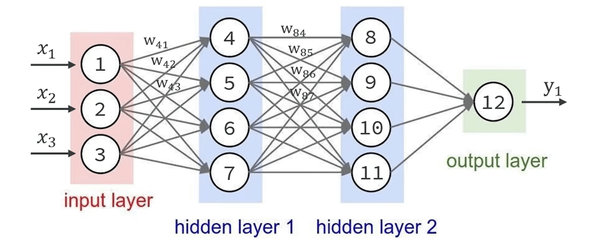

---

人类语言训练也是类似，专门处理人类语言的模型叫做大语言模型，2003 年的图灵奖得主 Yoshua Bengio 首次提出了词向量 word embedding

首先将人类语言拆成一个个片段，也就是 Token（词），然后 token 都经过模型计算转为一个浮点数数组作为向量坐标

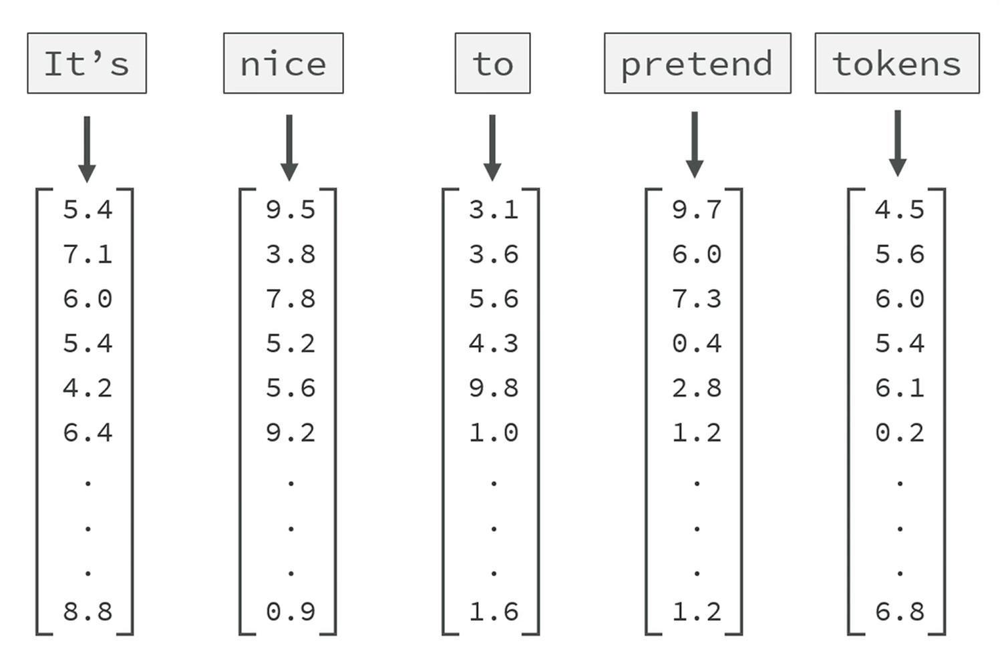

真实在拆分的时候，可能是拆分词、汉字、符号、某个单词的一部分等等，词向量在 GPT3 中，每个词有 122883 个浮点数，转为函数那么就有 122883 个维度，如果是最新的模型可能更多

所以中文比较适合用来训练大模型，因为中文大部分的意思都可以使用常用字来表达，就算有新词也可以在现有字中进行组合生成

而英文往往在专业领域需要专有词汇，而新增词汇往往不是原有单词的组合，而是新创造词汇

那么词向量的含义，比如下图中，我们发现当前的向量可以表达亲属含义和性别含义，那么我完全可以根据现有的关系来推算新的关系

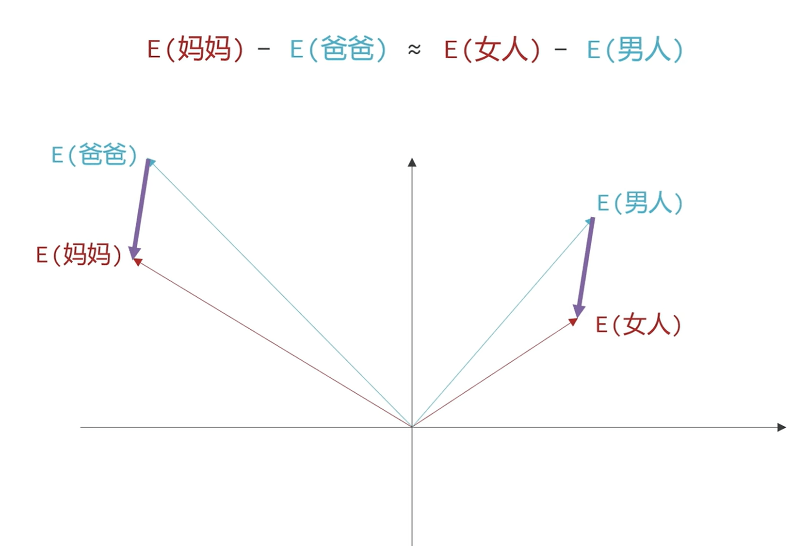

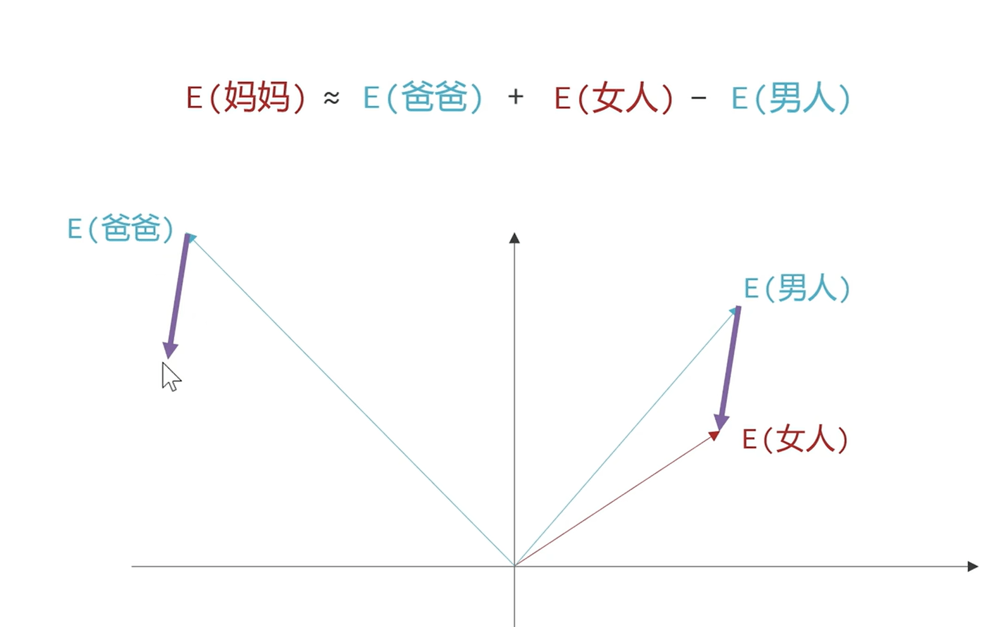

---

2017 年提出了 transformer 模型，其中提出了自注意力机制，也就是更高效的根据模型的上下文信息处理 token，理解 token 的含义

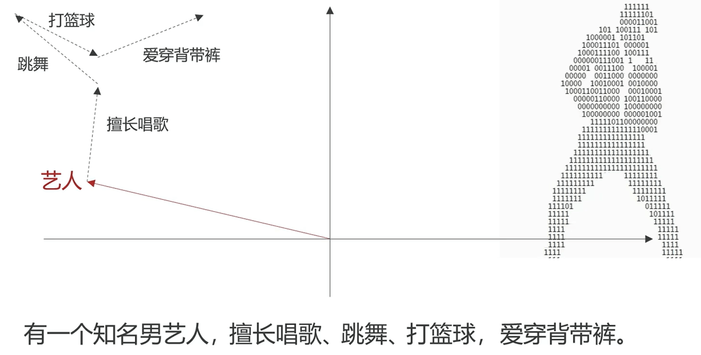

那么 token 已经转为了向量，之后就是多次的 Attention（根据上下文对向量进一步调整）、MLP（多层感知机，基于分析进行进一步分析推理）

之后是使用 softmax 函数，基于当前的向量结果进行下一个 token 概率预测，采用最高概率向量作为结果，然后再次转化为 token 人类语言

这个概率受模型的 temperature 参数影响，值越大分布越均匀，模型的随机性就越强，反之结果越确定，所以创造性给到 temperature 大一点，结果型给到 temperature 低一点

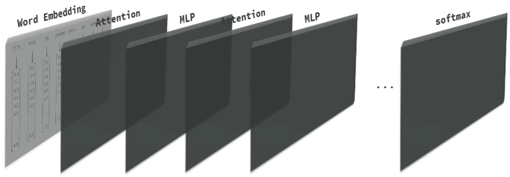

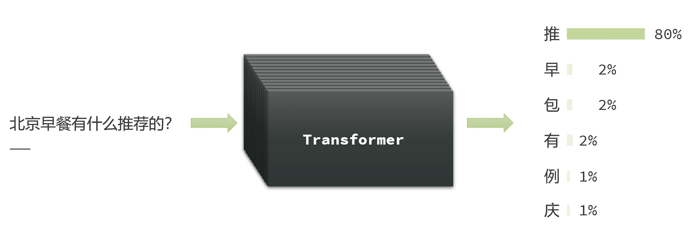

所以现在的大模型都变成了生成式模型，也就是根据前文来生成后面的 token

当模型规模和数据量突破了某个临界点时，模型仿佛突然拥有了智能，这种超大规模的语言模型叫做大语言模型，简单来说就是力大飞砖

但是，模型本身还是通过上下文和概率预测，所以本质上还是概率预测机，结果一定要谨慎

而且现在模型的上下文也不能太大，太大的话运算力简直难以想象，如果上下文超出了他的限制，就会截取一部分来分析，简单来说就是失忆

## 大模型和大模型应用

G（Generative 生成式）P（Pre Trained，预训练）T（Transformer），GPT 是 openai 基于 transformer 架构的大语言模型

那么大模型其实也只是用于文本生成，但是对话，操纵应用，存储记忆这种东西肯定是要通过传统编程实现的

ChatGPT 是基于 GPT，并且结合了传统程序，将一个原本用于文本生成的大语言模型构建为了能够记忆、对话的聊天机器人

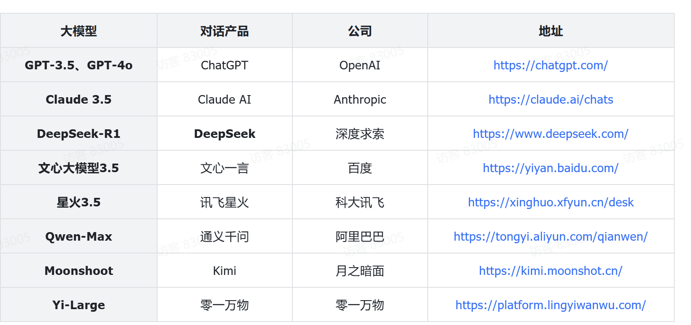

## 大模型服务

| 云平台            | 公司     | 地址                                           |
| ----------------- | -------- | ---------------------------------------------- |
| DeepSeek          | DeepSeek | https://www.deepseek.com                       |
| 阿里百炼          | 阿里巴巴 | https://bailian.console.aliyun.com             |
| 腾讯TI平台        | 腾讯     | https://cloud.tencent.com/product/ti           |
| 千帆平台          | 百度     | https://console.bce.baidu.com/qianfan/overview |
| SiliconCloud      | 硅基流动 | https://siliconflow.cn/zh-cn/siliconcloud      |
| 火山方舟-火山引擎 | 字节跳动 | https://www.volcengine.com/product/ark         |

以上都是云服务，那么私有服务是需要 服务器、显卡、[ollama](https://ollama.com) 平台安装后下载模型进行本地部署

如果是使用云服务都需要 sk，不再赘述

---

ollama 本地部署运行需要判断自己电脑是否合适，有一张对比图可以查看

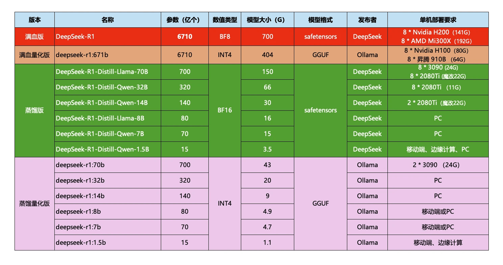

ollama 的基础命令

```bash
ollama serve      # Start ollama
ollama create     # Create a model from a Modelfile
ollama show       # Show information for a model
ollama run        # Run a model
ollama stop       # Stop a running model
ollama pull       # Pull a model from a registry
ollama push       # Push a model to a registry
ollama list       # List models
ollama ps         # List running models
ollama cp         # Copy a model
ollama rm         # Remove a model
ollama help       # Help about any command
```

在启动模型之后，本地接口为 `http://localhost:11434/api/chat`，可以根据请求参数调用使用

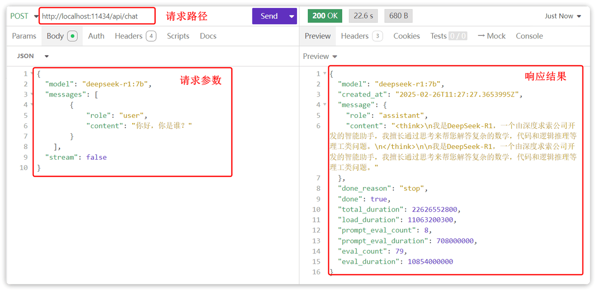

每家的请求都有请求规范：

- 请求 URL
    - DeepSeek 官方平台：`https://api.deepseek.com/chat/completions`
    - 阿里云百炼平台：`https://dashscope.aliyuncs.com/compatible-mode/v1`
    - 本地 ollama 部署的模型：`http://localhost:11434`
- 请求头
    - `Content-Type`: `application/json`，请求参数的格式
    - `Authorization`: `Bearer <DeepSeek API Key>`
- 请求参数

    ```json
    {
        "model": "deepseek-chat",
        "messages": [
            { "role": "system", "content": "You are a helpful assistant." },
            { "role": "user", "content": "Hello!" }
        ],
        "stream": false
    }
    ```

案例

```python
from openai import OpenAI
from dotenv import load_dotenv
import os

# 加载环境变量
load_dotenv()

client = OpenAI(
    api_key=os.getenv("DEEPSEEK_API_KEY"),
    base_url="https://api.deepseek.com"
)

print("🚀 正在调用大模型...")
response = client.chat.completions.create(
    model="deepseek-chat",
    messages=[
        {"role": "system", "content": "你是一名友好的AI助教。"},
        {"role": "user", "content": "你好，你是谁?"}
    ],
    stream=False
)

print(response)
```

消息提示分为三种角色

| 角色      | 描述                                                                 | 示例                                                             |
| --------- | -------------------------------------------------------------------- | ---------------------------------------------------------------- |
| system    | 优先于user指令之前的指令，也就是给大模型设定角色和任务背景的系统指令 | 你是一个乐于助人的编程助手，你以小团团的风格来回答用户的问题。   |
| user      | 终端用户输入的指令（类似于你在ChatGPT聊天框输入的内容）              | 写一首关于Java编程的诗                                           |
| assistant | 由大模型生成的消息，可能是上一轮对话生成的结果                       | 注意，用户可能与模型产生多轮对话，每轮对话模型都会生成不同结果。 |

- system: 决定了会话模式，按照设定来回答
- user: 用户提问
- assisant: AI 的生成消息，如果想要[多轮对话](https://api-docs.deepseek.com/zh-cn/guides/multi_round_chat)，形成记忆那么需要在之后携带当前信息
