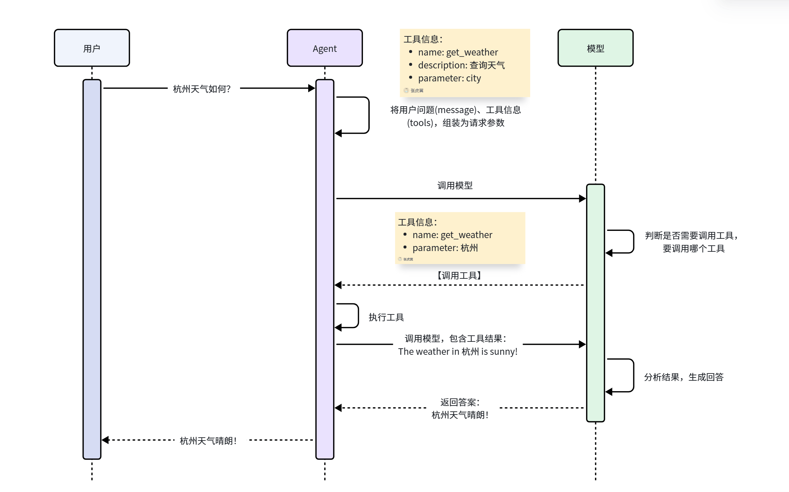

## Agent 与 LangChain

大模型其实就只是文字推理，大模型应用则是通过传统的编程与大模型融合起来的应用。大模型调用传统编程这一步骤就是 agent。

| 特性     | 传统聊天机器人/LLM     | AI Agent                       |
| -------- | ---------------------- | ------------------------------ |
| 交互模式 | 被动响应，问一句答一句 | 主动规划，以目标为导向         |
| 执行力   | 停留在文本生成层面     | 能操作软件、发送邮件、分析数据 |
| 自主性   | 需要人类给出详细步骤   | 只需给定最终目标，自主寻找路径 |

[LangChain](https://docs.LangChain.com/) 其实就是开发 agent 的平台，是一套系统，包括：

- LangChain：用于快速构建智能体，可兼容任何模型提供商。
- LangGraph：从底层一步步控制智能体的构建，包括记忆（Memory）、人机协同（HITL）等
- Deep Agents：用于构建复杂的、处理多步骤的任务的智能体

另外，LangChain 还包含一套帮助人工智能团队利用实时生产数据进行持续测试和改进的平台，叫做 LangSmith。

---

```python
from dotenv import load_dotenv
# langchain 会做处理，读取环境变量，而且不需要自己读取 os 文件加载，十分方便
load_dotenv()

from langchain.tools import tool
# 定义 tools
# 需要注意的是注释十分重要，大模型会根据注释来解析自定义的方法是干啥的，在什么情境下去调用
@tool
def getWeather(city: str):
    """
    get the weather in a given location
    """
    return f"current weather in {city} is sunny"

from langchain.agents import create_agent
# 自定义 agent，将模型和 tools 组装为一个 agent，模型必须是 langchain 支持的模型
agent = create_agent(
    'deepseek-chat',
    tools=[getWeather]
)

# 模型调用，注意需要按照大模型的要求填写参数
response = agent.invoke({
    'messages': [
        {
            'role': 'user',
            'content': 'what is the weather in beijing?'
        }
    ]
})

print(response)
for message in response['messages']:
    print(message.model_dump_json(indent=2))
```

最后输出调用的结果为

<details>

```json
{
  "content": "what is the weather in beijing?",
  "additional_kwargs": {},
  "response_metadata": {},
  "type": "human",
  "name": null,
  "id": "47644569-4c6a-46ec-a91a-1e7b0f735ac2"
}
{
  "content": "I'll check the weather in Beijing for you.",
  "additional_kwargs": {
    "refusal": null
  },
  "response_metadata": {
    "token_usage": {
      "completion_tokens": 52,
      "prompt_tokens": 306,
      "total_tokens": 358,
      "completion_tokens_details": null,
      "prompt_tokens_details": {
        "audio_tokens": null,
        "cached_tokens": 0
      },
      "prompt_cache_hit_tokens": 0,
      "prompt_cache_miss_tokens": 306
    },
    "model_provider": "deepseek",
    "model_name": "deepseek-chat",
    "system_fingerprint": "fp_eaab8d114b_prod0820_fp8_kvcache_new_kvcache_20260410",
    "id": "5d7e499d-30bd-4daf-88f6-f40fdc280176",
    "finish_reason": "tool_calls",
    "logprobs": null
  },
  "type": "ai",
  "name": null,
  "id": "lc_run--019d86cf-eba3-78f2-8a9d-11ed84264ce5-0",
  "tool_calls": [
    {
      "name": "getWeather",
      "args": {
        "city": "Beijing"
      },
      "id": "call_00_zxV5PYNWTP2QRCHKy1zdPdnv",
      "type": "tool_call"
    }
  ],
  "invalid_tool_calls": [],
  "usage_metadata": {
    "input_tokens": 306,
    "output_tokens": 52,
    "total_tokens": 358,
    "input_token_details": {
      "cache_read": 0
    },
    "output_token_details": {}
  }
}
{
  "content": "current weather in Beijing is sunny",
  "additional_kwargs": {},
  "response_metadata": {},
  "type": "tool",
  "name": "getWeather",
  "id": "6b606b55-b8aa-47af-a8a4-6c1124168268",
  "tool_call_id": "call_00_zxV5PYNWTP2QRCHKy1zdPdnv",
  "artifact": null,
  "status": "success"
}
{
  "content": "The current weather in Beijing is sunny.",
  "additional_kwargs": {
    "refusal": null
  },
  "response_metadata": {
    "token_usage": {
      "completion_tokens": 8,
      "prompt_tokens": 381,
      "total_tokens": 389,
      "completion_tokens_details": null,
      "prompt_tokens_details": {
        "audio_tokens": null,
        "cached_tokens": 320
      },
      "prompt_cache_hit_tokens": 320,
      "prompt_cache_miss_tokens": 61
    },
    "model_provider": "deepseek",
    "model_name": "deepseek-chat",
    "system_fingerprint": "fp_eaab8d114b_prod0820_fp8_kvcache_new_kvcache_20260410",
    "id": "d0ff2b0d-5927-4108-8fac-89d0bee0816c",
    "finish_reason": "stop",
    "logprobs": null
  },
  "type": "ai",
  "name": null,
  "id": "lc_run--019d86cf-f7f3-7071-be5b-be8ddb4dd6c5-0",
  "tool_calls": [],
  "invalid_tool_calls": [],
  "usage_metadata": {
    "input_tokens": 381,
    "output_tokens": 8,
    "total_tokens": 389,
    "input_token_details": {
      "cache_read": 320
    },
    "output_token_details": {}
  }
}
```

</details>




具体的工作流程如图，有非常重要的注意点：

1. 大模型给到的 tools 必须要有描述信息

    描述信息才能让大模型知道这个工具是干什么的，是否要进行调用

1. 大模型本身并不能调用工具

    大模型只能向 langchain 传递一个我想要调用什么工具的信息
    
    在上面的 json 串中大模型返回的是 tool_calls 
    
    这个 json 串中就有想要调用的工具信息和传入的参数，而具体调用是 langchain 帮忙做的

1. 一切参数参考[文档](https://bailian.console.aliyun.com/cn-beijing?tab=api#/api/?type=model&url=3016807)，其中包含了 agent 调用的具体解释
