# 组件化


## 组件化概述


一个人面对复杂问题的时候，可以将这些问题拆分成为多个小问题，然后一个一个解决


组建化也是这样的思想，假如我们将一个页面中所有的处理逻辑全部都放在一起，那么处理起来就会非常复杂


我们将一个页面拆分称为一个个的小的功能块，每一个功能块完成属于自己的这部分功能，那么整个页面的维护和管理就十分容易


Vue中的组件化相当于一棵组件树，我们可以拆分唱一个个的独立的可复用的小组建来构建我们的应用


## 组件基本使用


### 构成组件的基本步骤


1、创建组件构造器：调用`Vue.extend()`方法创建组件构造器


2、注册组件：调用`Vue.component()`方法注册组件


3、使用组件：在Vue实例范围内使用组件

    ```vue
    <!DOCTYPE html>
    <html lang="en">
        <head>
            <meta charset="UTF-8">
            <title>Title</title>
            <script src="../js/vue.js"></script>

            <div id="app">
                <!-- 3、使用组件 -->
                <cpn></cpn>
            </div>
        </head>

        <body>
            <script>

                // 1、创建组件构造器对象
                const cpnConstruct = Vue.extend({
                    template: `
                        <div>
                            <div>组件初始化</div>
                            <p>内容</p>
                        </div>`
                })

                // 2、注册组件
                Vue.component('cpn',cpnConstruct)

                const app = new Vue({
                    el: '#app',
                    data: {
                        message: 'Hello'
                    }
                })

            </script>
        </body>
    </html>
    ```


> 事实上，这种方法在Vue 2.x的文档中就已经看不到了，但是这个是我们最基础的创建方式，要明白
>


### 全局组件和局部组件


1、刚才我们使用`Vue.component()`的方式叫做全局组件，可以在多个Vue实例下面进行使用


```vue
<!DOCTYPE html>
<html lang="en">
<head>
    <meta charset="UTF-8">
    <title>Title</title>
    <script src="../js/vue.js"></script>

    <div id="app">
        <cpn></cpn>
    </div>
    <div id="app1">
        <cpn></cpn>
    </div>
</head>
<body>
<script>
    
    const cpnConstruct = Vue.extend({
        template: `
            <div>
                <div>组件初始化</div>
                <p>内容</p>
            </div>`
    })
    
    Vue.component('cpn',cpnConstruct)

    const app = new Vue({
        el: '#app',
        data: {
            message: 'Hello'
        }
    })
    
    const app1 = new Vue({
        el: '#app1'
    })

</script>
</body>
</html>
```


2、局部组件


```vue
<!DOCTYPE html>
<html lang="en">
<head>
    <meta charset="UTF-8">
    <title>Title</title>
    <script src="../js/vue.js"></script>

    <div id="app">
        <cpn></cpn>
    </div>
</head>
<body>
<script>

    const cpnConstruct = Vue.extend({
        template: `
            <div>
                <div>组件初始化</div>
                <p>内容</p>
            </div>`
    })

    const app = new Vue({
        el: '#app',
        // 在这里进行注册，那么就是局部组件，只能在这个Vue下面进行使用
        components: {
            cpn: cpnConstruct
        }
    })

</script>
</body>
</html>
```


### 父组件和子组件


1、在父组件使用子组件


```vue
<!DOCTYPE html>
<html lang="en">
<head>
    <meta charset="UTF-8">
    <title>Title</title>
    <script src="../js/vue.js"></script>

    <div id="app">
        <cpn2></cpn2>
    </div>
</head>
<body>
<script>

    // 1、创建第一个组件构造器
    const cpnC1 = Vue.extend({
        template: `
            <div>
                <h2>标题1</h2>
                <p>内容1</p>
            </div>
        `
    })
    // 2、创建第二个组件构造器，注意在这里注册cpnC1，然后在这里使用
    const cpnC2 = Vue.extend({
        template: `
            <div>
                <h2>标题2</h2>
                <p>内容2</p>

                <cpn1></cpn1>
            </div>
        `,
        components: {
            cpn1: cpnC1
        }
    })

    const app = new Vue({
        el: '#app',
        data: {
            message: 'Hello'
        },
        // 我们只需要注册cpnC2，因为cpnC1已经在cpnC2中注册过了
        components: {
            cpn2: cpnC2
        }
    })

</script>
</body>
</html>
```


> 注意，在这里中，cpn2是父组件，cpn1是子组件
>
> 并且子组件只在父组件中注册，则必须在父组件中使用，出了父组件的范围是不能使用的，它是一个局部的作用域
>
> 如果想在外面使用，就在对应的作用域中进行注册
>


2、注册组件语法糖


```vue
<!DOCTYPE html>
<html lang="en">
<head>
    <meta charset="UTF-8">
    <title>Title</title>
    <script src="../js/vue.js"></script>

    <div id="app">
        <cpn1></cpn1>
        <cpn2></cpn2>
    </div>
</head>
<body>
<script>

    // 1、全局组件的注册使用组件注册语法糖，它底层调用的其实就是 Vue.extend()，只不过使用语法糖给简化了
    Vue.component('cpn1',{
        template: `
            <div>全局组件语法糖</div>
        `
    })
    
    
    
    const app = new Vue({
        el: '#app',
        data: {
            message: 'Hello'
        },
        // 2、局部组件语法糖，它底层调用的其实就是 Vue.extend()，只不过使用语法糖给简化了
        components: {
            'cpn2': {
                template: `<div>局部组件语法糖</div>`
            }
        }
    })

</script>
</body>
</html>
```


### 模板分离


```vue
<!DOCTYPE html>
<html lang="en">
<head>
    <meta charset="UTF-8">
    <title>Title</title>
    <script src="../js/vue.js"></script>

    <div id="app">
        <cpn1></cpn1>
        <cpn2></cpn2>
    </div>


    <!-- 编写模板写法一，使用 text/x-template，起一个ID -->
    <script type="text/x-template" id="cpn1">
        <div>模板分离写法一</div>
    </script>


    <!-- 编写模板写法二，不需要script标签，只需要template标签和一个ID即可 -->
    <template id="cpn2">
        <div>模板分离写法二</div>
    </template>
</head>
<body>
<script>

    // 1、注册全局组件，注意template绑定的数据为模板的ID
    const cpn1 = Vue.component('cpn1',{
        template: '#cpn1'
    })

    // 2、注册全局组件，注意template绑定的数据为模板的ID
    const cpn2 = Vue.component('cpn2',{
        template: '#cpn2'
    })

    const app = new Vue({
        el: '#app',
        data: {
            message: 'Hello'
        }
    })

</script>
</body>
</html>
```


> 建议使用`template`的写法，简单，局部组件也可以使用这种方式
>


### 组件data


**组件不可以访问Vue实例数据**

    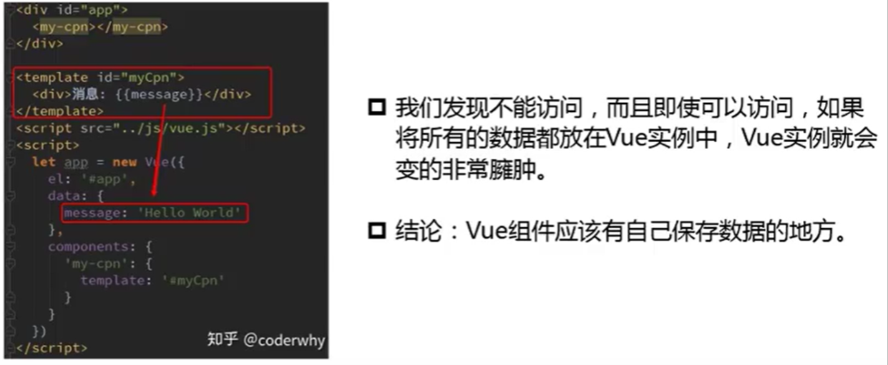


组件不能访问到Vue实例中的数据，也就是说上图的内容访问是不允许的，组件应该有自己保存数据、函数的地方


退一步说，即使组件中能够访问Vue实例的数据，但是我们想一下，一个系统中应该会有多少个组件？这些组件的内容全部都放到Vue实例，那么Vue实例中的数据将会鱼龙混杂，杂乱不堪


所以不管从什么角度来分析，Vue中的组件实例应该有它自己的data


**组件的data域**


组件中也有data类型，但是和Vue实例中的data域不同，它不能是一个对象类型，而是一个方法类型


```vue
<!DOCTYPE html>
<html lang="en">
<head>
    <meta charset="UTF-8">
    <title>Title</title>
    <script src="../js/vue.js"></script>

    <div id="app">
        <temp></temp>
    </div>

    <template id="temp">
        <div>{{title}}</div>
    </template>
</head>
<body>
<script>

    const temp = Vue.component('temp',{
        template: '#temp',
        components: {},
        // 注意，我们可以看到在template中的data是一个方法而不是一个对象
        data(){
            return{
                title: 'ABC'
            }
        }
    })

    const app = new Vue({
        el: '#app',
        // 我们看到，Vue实例中的data域是一个对象类型
        data: {
            message: 'Hello'
        }
    })

</script>
</body>
</html>
```


> 注意观察Vue实例和模板实例中data的区别，一个是对象一个是方法
>


> 这个组件其实很像Vue实例，它也有data、methods等，Vue实例有的它基本都有
>


**为什么组件中的data必须是一个函数**


那么我们说，为什么组件中的data必须是一个函数？


因为我们说，假如不设计成为函数，那么data中的数据就变为了公共的对象了，设计成为函数，那么data中的数据就完全属于这一个模板对象，而不是这个模板的全体对象


看下面这个例子


```vue
<!DOCTYPE html>
<html lang="en">
<head>
    <meta charset="UTF-8">
    <title>Title</title>
    <script src="../js/vue.js"></script>

    <div id="app">
        <temp></temp>
        <temp></temp>
        <temp></temp>
    </div>

    <template id="temp">
        <div>
            {{counter}}
            <button @click="increment">+</button>
            <button @click="decrement">-</button>
        </div>
    </template>
</head>
<body>
<script>


    const temp = Vue.component('temp',{
        template: '#temp',
        data(){
            return{
                counter: 0
            }
        },
        methods: {
            increment() {
                this.counter++
            },
            decrement() {
                this.counter--
            }
        }

    })


    const app = new Vue({
        el: '#app',
        data: {
            message: 'Hello'
        }
    })

</script>
</body>
</html>
```


> 注意看，上面的三个`<temp></temp>`是三个temp实例，每一个都有自己的data函数，而函数中的data是只属于temp的
>


> 所以会出现这种情况：数字可以不一致，也就是说data内容不会被共享
>
> 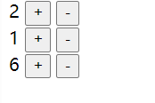
>


> 组件是需要复用的，但是复用的意思是在每一个地方需要有一个自己的逻辑，而不是在所有地方复用一个数据
>


### 父子组件通信


刚才说子组件不能引用父组件或者Vue实例中的数据，所以我们有的时候需要使用父组件传递给子组件


Vue有两种方式进行父子组件中的通信：


+ 通过`props`从父组件向子组件通信
+ 通过事件从子组件向父组件通信


> 也就是说父组件和子组件之间，都可以进行相互通讯，都有不同的方式
>


**父组件向子组件通信**


我们首先将Vue实例作为父组件，另开一个新的组件作为子组件，让父组件向子组件通信数据


1、使用数组的方式进行通信


```vue
<!DOCTYPE html>
<html lang="en">
<head>
    <meta charset="UTF-8">
    <title>Title</title>
    <script src="../js/vue.js"></script>

    <div id="app">
        <!--
			4、使用子组件
            从这里可以看到，使用v-bind绑定了cmovies这个变量，然后值是movies
            这就接受到了父组件传递过来的movies内容
        -->
        <cpn :cmovies="movies" :cmessage="message"></cpn>
    </div>


    <template id="cpn">
        <div>
            <!-- 3、使用子组件中负责接受的变量 -->
            {{cmessage}}
            <br>
            <ul>
                <li v-for="item in cmovies">{{item}}</li>
            </ul>
        </div>
    </template>
</head>
<body>
<script>

    /* 2、子组件 */
    const cpn = {
        template: '#cpn',
        /*
            通过这个props接收来自父组件的数据
            我们可以看到有一个cmovies的字符串，其实可以把这个字符串看成一个变量，用来接受数据
            可以看到还有一个cmessage，那么这个cmessage就是接受的父组件的message
        */
        props: ['cmovies','cmessage']
    }

    /* 1、父组件 */
    const app = new Vue({
        el: '#app',
        data: {
            /* 将message传递到子组件中 */
            message: 'Hello',
            /* 将movies传递到子组件中 */
            movies: ['海王','海贼王','海尔兄弟']
        },
        components: {
            // 注册子组件，这个写法在之前讲过
            cpn
        }
    })

</script>
</body>
</html>
```


> 注意一个巨大的问题，子组件props中不可以进行大写，否则可能会出现一些奇怪的问题，因为v-bind不支持驼峰
>


> 但是假如我就是要在props使用驼峰，那么在v-bind中也可以用
>
> 比如在props中我定义一个myMessageCode，在v-bind中应该是`my-message-code`
>


2、使用对象方式传递


```vue
<!DOCTYPE html>
<html lang="en">
<head>
    <meta charset="UTF-8">
    <title>Title</title>
    <script src="../js/vue.js"></script>

    <div id="app">
        <!--
            接受到了父组件传递过来的内容
        -->
        <cpn :cmovies="movies" :cmessage="message"></cpn>
    </div>


    <template id="cpn">
        <div>
            <!-- 使用这个变量 -->
            {{cmessage}}
            <br>
            <ul>
                <li v-for="item in cmovies">{{item}}</li>
            </ul>
        </div>
    </template>
</head>
<body>
<script>

    /* 子组件 */
    const cpn = {
        template: '#cpn',
        /*
            注意，这次我们使用的类型是对象类型
            使用对象比使用数组有好处，它不仅可以传递值，还可以指定值的类型，可以对数据做验证
            它支持：Array、String、Number、Boolean、Object、Date、Function、Symbol类型
            甚至还可以提供一些默认值，还可以设置这个变量是不是必须传递
        */
        props: {
            /* 指定了cmovies为Array类型 */
            cmovies: Array,
            /* 
            	指定了cmessage的类型可以为String或者Number，默认是"ABC"，传递值的时候必须传递这个值
            */
            cmessage: {
                type: [String,Number],
                default: "ABC",
                required: true
            }
        }
    }

    /* 父组件 */
    const app = new Vue({
        el: '#app',
        data: {
            /* 将message传递到子组件中 */
            message: 'Hello',
            /* 将movies传递到子组件中 */
            movies: ['海王','海贼王','海尔兄弟']
        },
        components: {
            // 注册子组件，这个写法在之前讲过
            cpn
        }
    })

</script>
</body>
</html>
```


> 注意了，我们建议使用对象的方式来进行使用，因为对象的功能十分多
>


> 我们的参数的默认值为一个对象或者是一个数组的时候，他的默认值必须为一个函数而不能是一个空的数组或者Object
>

```vue
<script>

 /* 子组件 */
 const cpn = {
     template: '#cpn',
     props: {
         cmovies: {
             type: Array,
             /* 注意看这里，假如type为Array或者Object，那么default必须为一个函数 */
             default(){ return[] }
         },
         cmessage: String
     }
 }

 /* 父组件 */
 const app = new Vue({
     el: '#app',
     data: {
         message: 'Hello',
         movies: ['海王','海贼王','海尔兄弟']
     },
     components: {
         cpn
     }
 })

</script>
```


**子组件传递给父组件**


一般来说，子组件传递数据是通过某一个事件传递給的父组件


在这个页面中，我点击热门推荐，这是在子组件中的事件，然后我通过这个点击事件带给父组件，让父组件去请求数据，然后再赋值给子组件


1、子组件传递给父组件基本使用


```vue
<!DOCTYPE html>
<html lang="en">
<head>
    <meta charset="UTF-8">
    <title>Title</title>
    <script src="../js/vue.js"></script>

    <div id="app">
        <!-- 3、通过 v-on 监听事件，只不过这个是监听我们自己定义的事件，而且注意这里的cpnclick和第二步的名称相同 -->
        <cpn @itemClick="cpnclick"></cpn>
    </div>


    <template id="cpn">
        <div>
            <!-- 1、我们像正常那样绑定一个事件 -->
            <button v-for="item in categories" @click="btnclick(item)">{{item.name}}</button>
        </div>
    </template>
</head>
<body>
<script>


    const cpn = {
        template: '#cpn',
        data() {
            return {
                categories: [
                    {id: 'A', name: '热门推荐'},
                    {id: 'B', name: '手机数码'},
                    {id: 'C', name: '家用家电'},
                ]
            }
        },
        methods: {
            btnclick(item) {
                /* 2、通过这个 this.$emit 传递给父组件，两个参数分别为：发送给父组件事件的名字、事件的参数*/
                this.$emit('itemclick', item)
            }
        }
    }


    const app = new Vue({
        el: '#app',
        data: {
            message: 'Hello'
        },
        components: {
            cpn
        },
        /* 4、调用我们的函数，同时注意我们也不要使用驼峰来进行方法的定义 */
        methods: {
            cpnclick(item) {
                console.log(item.name);
            }
        }
    })

</script>
</body>
</html>
```


> 注意我们这里的第三步仍然没有填写参数，这是因为我们默认将item参数传递过去了
>


### 父组件和子组件的访问方式


我们现在想让父组件直接拿到子组件，然后调用子组件的方法，或者让子组件拿到父组件，然后对父组件进行操作


这种方式我们可以使用父子组件的访问方式


1、父访问子：`$children`或者`$refs`（reference）


2、子访问父：`$parent`


3、子组件直接访问根组件：Vue实例


**父访问子**


父组件中可能有很多子组件，那么它拿到的可能是一个数组


1、使用`$children`基本使用


```vue
<!DOCTYPE html>
<html lang="en">
<head>
    <meta charset="UTF-8">
    <title>Title</title>
    <script src="../js/vue.js"></script>


</head>
<body>

<div id="app">
    <cpn></cpn>
    <cpn></cpn>
    <cpn></cpn>

    <button @click="btnclick">按钮点击</button>
</div>

<template id="cpn">
    <div>子组件</div>
</template>


<script>


    const app = new Vue({
        el: '#app',
        data: {
            message: 'Hello'
        },
        methods: {
            btnclick() {
                console.log(this.$children)
                this.$children[0].showmessage()
            }
        },
        components: {
            cpn: {
                template: '#cpn',
                methods: {
                    showmessage() {
                        console.log('showMessage')
                    }
                }
            }
        }
    })

</script>
</body>
</html>
```


> 组件对象就是VueComponnet的类型，他应该是一个VueComponnet数组
>
> 然后我们就可以获取任意的子组件来调用子组件的内容
>


2、使用`$refs`使用子组件


在开发中，我们使用下标来拿取内容是十分不友好的，因为它可能会出现变动，所以我们应该使用另外的方法拿到子组件


```vue
<!DOCTYPE html>
<html lang="en">
<head>
    <meta charset="UTF-8">
    <title>Title</title>
    <script src="../js/vue.js"></script>


</head>
<body>

<div id="app">
    <cpn ref="A"></cpn>
    <cpn ref="B"></cpn>
    <cpn ref="C"></cpn>

    <button @click="btnclick">按钮点击</button>
</div>

<template id="cpn">
    <div>子组件</div>
</template>


<script>


    const app = new Vue({
        el: '#app',
        data: {
            message: 'Hello'
        },
        methods: {
            btnclick() {
                /* 使用我们的key-value中的key拿到准确的一个值 */
                console.log(this.$refs.A.showmessage())
            }
        },
        components: {
            cpn: {
                template: '#cpn',
                methods: {
                    showmessage() {
                        console.log('showMessage')
                    }
                }
            }
        }
    })

</script>
</body>
</html>
```


> 这种情况适合我们拿到精准的某一个子组件才可以
>
> ref相同的时候，后面的覆盖前面的
>


**子组件访问父组件**


```vue
<!DOCTYPE html>
<html lang="en">
<head>
    <meta charset="UTF-8">
    <title>Title</title>
    <script src="../js/vue.js"></script>

    <div id="app">
        <cpn></cpn>
    </div>
</head>
<body>

<template id="cpn">
    <div>
        子组件
        <button @click="btnclick">访问父组件</button>
    </div>
</template>
<script>
    const app = new Vue({
        el: '#app',
        data: {
            message: 'Hello'
        },
        methods: {
            parentclick(){
                console.log('父组件')
            }
        },
        components: {
            cpn: {
                template: '#cpn',
                methods: {
                    btnclick() {
                        // 访问父组件
                        console.log(this.$parent.parentclick())
                    }
                }
            }
        }
    })

</script>
</body>
</html>
```


**访问根组件**


```vue
<!DOCTYPE html>
<html lang="en">
<head>
    <meta charset="UTF-8">
    <title>Title</title>
    <script src="../js/vue.js"></script>

    <div id="app">
        <cpn></cpn>
    </div>
</head>
<body>

<template id="cpn">
    <div>
        子组件
        <button @click="btnclick">访问根组件</button>
    </div>
</template>
<script>
    const app = new Vue({
        el: '#app',
        data: {
            message: 'Hello'
        },
        methods: {
            vueclick(){
                console.log('根组件')
            }
        },
        components: {
            cpn: {
                template: '#cpn',
                methods: {
                    btnclick() {
                        // 访问父组件
                        console.log(this.$root.vueclick())
                    }
                }
            }
        }
    })

</script>
</body>
</html>
```

---

## 插槽


### 为什么要使用插槽


插槽：slot，插槽的作用就是让我们的程序具备更多的扩展性


比如我们的电脑上有一个usb，这就是一个插槽，可以插入U盘、硬盘、手机...


所以插槽在Vue中，插槽中的代码并不是写死的，而是根据外界的内容进改变


插槽就可以让我们的程序拥有更多的扩展性，抽取共性，保留不同，这就是插槽的作用


### 插槽基本使用


```vue
<!DOCTYPE html>
<html lang="en">
<head>
    <meta charset="UTF-8">
    <title>Title</title>
    <script src="../js/vue.js"></script>

    <div id="app">

        <cpn>
            <!-- 2、注意，这个按钮就是我们想要向插槽里面放置的内容 -->
            <button>按钮</button>
        </cpn>

        <cpn>
            <!-- 3、这个插槽我忽然不想使用按钮，想搞一个文本 -->
            <h2>呵呵</h2>
        </cpn>
    </div>
</head>
<body>


<template id="cpn">
    <div>
        <!-- 1、一般的组件是永远存在的 -->
        <h2>一般的组件</h2>

        <!--
            插槽，可以随着外部的改变动态改变
            比如今天想要一个按钮，明天想要一个文本，就可以使用这个来实现
        -->
        <slot></slot>
    </div>
</template>
<script>

    const cpn = {
        template: '#cpn'
    }

    const app = new Vue({
        el: '#app',
        data: {
            message: 'Hello'
        },
        components: {
            cpn
        }
    })

</script>
</body>
</html>
```


> 假如我只有一个插槽，但是给了多个内容：比如给了一个button又给了一个文本又给了一个链接....
>
> 这多个内容会当做是一个插槽中的内容，全部显示
>


2、插槽中的默认值


```vue
<!DOCTYPE html>
<html lang="en">
<head>
    <meta charset="UTF-8">
    <title>Title</title>
    <script src="../js/vue.js"></script>

    <div id="app">

        <!-- 2、不指定内容就使用默认值 -->
        <cpn></cpn>

        <cpn>
            <!-- 3、指定内容那么就替换 -->
            <h2>呵呵</h2>
        </cpn>

        <cpn></cpn>
    </div>
</head>
<body>


<template id="cpn">
    <div>
        <h2>一般的组件</h2>
        <slot>
            <!-- 1、插槽里面还可以自定义按钮，假如传过来的有内容，那么使用传过来的内容，假如没有就使用默认值 -->
            <button>按钮</button>
        </slot>
    </div>
</template>
<script>

    const cpn = {
        template: '#cpn'
    }

    const app = new Vue({
        el: '#app',
        data: {
            message: 'Hello'
        },
        components: {
            cpn
        }
    })

</script>
</body>
</html>
```


### 具名插槽


```vue
<!DOCTYPE html>
<html lang="en">
<head>
    <meta charset="UTF-8">
    <title>Title</title>
    <script src="../js/vue.js"></script>

    <div id="app">
        <cpn>
            <!-- 2、使用slot属性替换内容，而且是替换指定的插槽内容 -->
            <h2 slot="center">CENTER</h2>
        </cpn>
    </div>
</head>
<body>


<template id="cpn">
    <div>
        <h2>一般的组件</h2>

        <!-- 1、使用name属性绑定唯一的插槽 -->
        <slot name="left">
            <button>按钮</button>
        </slot>
        <slot name="center"><p>P标签</p></slot>
        <slot name="right"><span>Span标签</span></slot>
    </div>
</template>
<script>

    const cpn = {
        template: '#cpn'
    }

    const app = new Vue({
        el: '#app',
        data: {
            message: 'Hello'
        },
        components: {
            cpn
        }
    })

</script>
</body>
</html>
```


> 注意了，我们的插槽假如不指定名字，会全部替换成为一样的内容
>


### 编译作用域


作用域的意思就是说这个东西可以作用的范围，我们看一下下面这个代码


```vue
<!DOCTYPE html>
<html lang="en">
<head>
    <meta charset="UTF-8">
    <title>Title</title>
    <script src="../js/vue.js"></script>

    <div id="app">
        <cpn></cpn>
        <cpn><h2 v-show="isShow">不显示</h2></cpn>
    </div>
</head>
<body>

<template id="cpn">
    <div>
        <h2 v-show="isShow">显示</h2>
        <slot></slot>
    </div>
</template>
<script>

    const cpn = {
        template: '#cpn',
        data() {
            return {
                isShow: true
            }
        }
    }

    const app = new Vue({
        el: '#app',
        data: {
            isShow: false
        },
        components: {
            cpn
        }
    })

</script>
</body>
</html>
```


> 其实结果很清晰了，模板中定义的属性作用域范围就是模板中的，Vue实例中定义的属性作用域就是Vue实例的
>


官方给了一条准则：父模板中使用父模板的，子模板中使用子模板的


### 作用域插槽


作用域他的目的就是就是父组件替换插槽的标签，但是内容由子组件提供


也就是说样式由父组件提供，内容由子组件提供


我们先看一个需求：


子组件中包含一组数据：`[JavaScript,Python,Go,C++]`，这个数据需要在多个作用域中展示


但是展示的方式不同：有的页面要求水平展示、有的页面要求列表展示、有的页面要求直接展示数组


那么我直接通过作用域插槽即可使用


```vue
<!DOCTYPE html>
<html lang="en">
<head>
    <meta charset="UTF-8">
    <title>Title</title>
    <script src="../js/vue.js"></script>

    <div id="app">
        <cpn>
            <!--
                3、在vue2.5.x以下的时候，这里必须使用template，但是到了之后就可以使用别的组件了，比如div
                而且 slot-scope="slot" 这个属性十分重要，就是声明作用域范围是slot，这样就可以在这个作用域中拿到数据了
                在slot作用域中定义样式用于数据展示，slot.data中的data就是我们v-bind:data="languages"中的data
            -->
            <template slot-scope="slot">
                <span v-for="item in slot.data">{{item}}  -  </span>
            </template>
        </cpn>

        <cpn>
            <template slot-scope="slot">
                <span v-for="item in slot.data">{{item}}  *  </span>
            </template>
        </cpn>
    </div>
</head>
<body>

<template id="cpn">
    <div>
        <!--
            2、使用 v-bind绑定数据
            这个data是随便写的，languages数据是从当前作用域（子组件作用域）获取的
        -->
        <slot :data="languages"></slot>
    </div>
</template>

<script>
    const app = new Vue({
        el: '#app',
        data: {
            message: 'Hello'
        },
        components: {
            cpn: {
                template: '#cpn',
                data(){
                    return{
                        // 1、在子组件中定义一些数据，要求展示这些数据
                        languages: ['JavaScript','Java','Go','C++']
                    }
                }
            }
        }
    })

</script>
</body>
</html>
```


> 为了避免复杂，在上面我没有在slot中定义默认样式，但是我们知道这个可以用
>

---

# 模块化开发


## 模块化基础


前端发展到现在，已经有了很多的模块化规范，比如CommonJS、AMD、CMD、ES6 的Modules等


无论是哪种规范，都有导入、导出操作，只不过语法层面可能不太一样


在前端，模块化其实就相当于Java中的一个类，导入就是代表导入了一个对应的包名，只不过多了一个导出的过程，导出别人才能使用


**CommonJS**


NodeJS实现了CommonJS的规范，Node.JS的实现方式是比较出名的


在CommonJS中的导入和导出方式：


1、CommonJS的导出


```javascript
module.exports = {
    flag: true,
    test(a,b){
        return a + b;
    },
    demo(a,b){
        return a * b;
    }
}
```


> `module.exports`后面跟上一个对象，这个对象的所有内容都会导出
>


2、CommonJS的导入


```javascript
let {flag,test,demo} = require('./aaa.js')

test(1,2)
demo(2,3)
```


> 导入需要`require(文件路径)`，然后通过变量接受
>
> 文中的`{flag,test,demo}`是直接进行的解析，我们也可以定义一个变量然后通过变量获得
>
> 比如：`let A = require('./aaa.js')`，`A.test(1,2)`
>


**Modules**


ES6的模块化会自动开启文件检测，ES6的模块化新增了两个内容


1、Modules的导出：`export`


> 导出方式一
>


```javascript
let flag = true

function sum(a, b) {
    return a + b;
}

export {
    flag,sum
}
```


> 导出方式二
>


```javascript
export let num1 = 1000
export let height1 = 1.88

export function sum(a, b) {
    return a + b;
}
```


> 导出方式三，经常使用，注意export default在一个模块中只能存在一个
>


```javascript
export let flag = true

let name = 'Name'

export {
    name
}

const address = 'Address'
/* 这个default每一个export的JS只能有一个，等到后面引入的时候可以任意起一个名字来接受 */
export default {
    address
}
```


2、Modules的导入：`import`


> 导入方式一，这个flag和sum必须和export的名字相同
>


```javascript
import {flag,sum} from './01-Module模块化开发export.js'

console.log(sum(1,2))
```


> 导入方式二：通常情况下我们都不想让别人把这个名字起名，导入方式一对应的flag和sum必须叫做这个名字
>
> 但是我们并不想要，所以我们这个导入方式二对应的是`export default`，可以随意使用名字来接受
>


```javascript
import addr from './01-Module模块化开发export.js'

console.log(addr.address);
```


> 导入方式三
>


```javascript
/* 统一全部导出 */
import * as a from './01-Module模块化开发export.js'

/* 获得export default中的内容 */
console.log(a.default.address);

/* 获得其他的内容 */
console.log(a.flag);
```


3、使用


```vue
<!DOCTYPE html>
<html lang="en">
<head>
    <meta charset="UTF-8">
    <title>Title</title>
</head>
<body>
<!--
    这个type="module"代表的是模块化开发，他的作用是让他的变量只能是这个文件中的作用域
    比如在这个JS中使用var定义变量，其他的地方也获取不到
-->
<script src="01-Module模块化开发import.js" type="module"></script>

</body>
</html>
```


> 这个Module的语法是浏览器支持的，支持ES6的浏览器可以直接解析
>

---

## Webpack


### 什么是webpack


它是一个JavaScript静态模块化打包工具，也就是模块化和打包


比如我们开发中有很多内容，比如`.js`、`.sass`、`.less`、`.jpg`等文件，有一些文件浏览器并不能识别，所以我们需要一些工具来将文件内容打包成为浏览器可以识别的内容


前端模块化我们刚才知道很多的内容，比如AMD、CMD、CommonJS、ES6，但是这些模块化中除了ES6的Module都不被浏览器支持，但是使用webpack之后，会将所有的规范都转换为浏览器可以支持的内容


### webpack安装


1、需要node.js环境


2、全局安装webpack（先指定 3.6.0看一下脚手架2.x）：`npm install webpack@3.6.0 -g`


> 注意这里安装`3.6.0`，因为后续的有很多命令更改了
>


3、局部安装webpack（后续需要）：`--save-dev`是开发时依赖，项目打包后不需要继续使用


### webpack起步


首先我们介绍一下目录结构：`src`、`dist`


+ src：我们在程序编写的，开发的目录
    - `main.js/index.js`：入口，使用webpack之后，JS文件可以使用任何模块化规范了
    - 其他文件
+ dist：我们在打包之后放到dist中，打包的目录
+ `index.html`：引用JS文件

> 注意了，我们引用的不是`main.js`文件，因为我们不知道在开发过程中使用的什么模块化规范开发的
>
> 所以我们需要使用webpack将所有src下的内容打包，webpack会在dist生成最终的一个js文件，我们需要引用那个文件
>


**我们来走一遍流程**


1、在`src/js/mathUtils.js`有以下内容


```javascript
module.exports = {
    sum(a,b){
        return a + b;
    }
}
```


> 注意这个是CommonJS的语法，所以这样也可以证明webpack帮助我们解析语法了
>


2、在`src/main.js`中有以下内容


```javascript
let {sum} = require('./js/mathUtil.js')

console.log(sum(1, 2))
```


> 我们看到main.js没有放到js文件夹下面，这是因为我们通常都不把入口放到文件夹下面
>


3、在终端中输入：`webpack ./src/main.js ./dist/bundle.js`


> 在这里注意，假如webpack版本不是3.6.0，那么命令会有所区别，甚至还要别的依赖
>


4、在`index.html`中


```vue
<!DOCTYPE html>
<html lang="en">
<head>
    <meta charset="UTF-8">
    <title>Title</title>
</head>
<body>
<script src="./dist/bundle.js"></script>
</body>
</html>
```


**webpack配置**


有时候我们其实并不想使用一长串的命令`webpack ./src/main.js ./dist/bundle.js`


有的时候我只想要简简单单地写一个`webpack`，让他自动打包到`dist/bundles.js`中


那么这种方式看起来没有定义要打包的内容和输出的路径，所以我们需要使用webpack的配置文件，来告诉他内容


首先我们定义一个文件：`webpack.config.js`，位置和`index.html`同级


然后在里面写如下内容


```javascript
/*
    这个path直接去node里面去找了，不需要我们写
    但是我们需要首先进行项目的 npm init来初始化
    是否初始化成功，就看项目中有没有 package.json文件
    只要有这个文件，那么就代表我们已经进行了初始化
*/
const path = require('path')

/* 一个CommomJS的导出写法 */
module.exports = {
    /* 需要打包的文件 */
    entry: './src/main.js',
    /* 输出的路径和文件，我们需要利用一个对象 */
    output: {
        /*
            path必须是一个绝对路径，不能是相对路径，Node语法动态获取路径
            path.resolve用来将两个字符串拼接
            __dirname（双下划线）是node用来获取当前上下文路径的内容，然后拼接上dist
        */
        path: path.resolve(__dirname,'dist'),
        /* 输出的文件名字 */
        filename: 'bundle.js'
    }
}
```


> 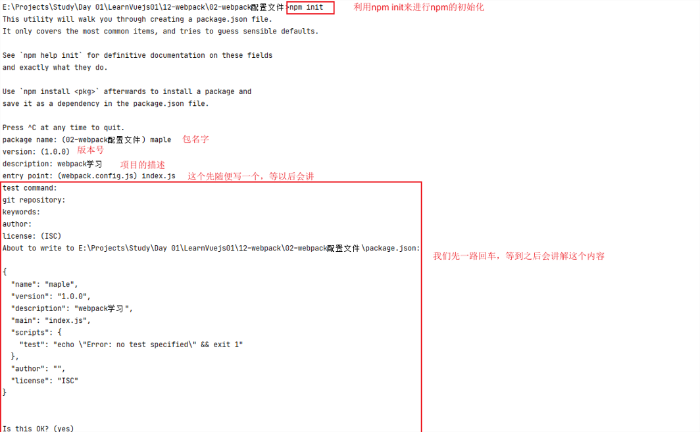
>


> 因为需要使用到node中的语法，所以进行一次初始化
>


> 等到进行npm init初始化之后，会出现一个`package.json`文件，这个文件是用来告诉我们这个项目的一些信息的
>
> 比如项目名称、版本、描述、作者、依赖等
>


经过了上面的内容，我们只需要敲一个`webpack`命令就直接可以打包了


**真实项目中的打包**


其实在真实项目中，我们其实并不需要使用`webpack`，而是`npm run build`命令打包


目前看起来好像`webpack`更加简单，但其实到后面它很麻烦，反而`npm run build`命令更加简单


那么我们应该如何使用`npm run build`这个命令呢？那么就需要将这两个命令进行映射了


1、在上面我们进行初始化的时候有一个`package.json`文件，打开它


2、里面有一个`scripts`


> 这个scripts其实就是npm的执行命令的地方，假如我执行命令`npm run build`
>
> 那么npm会到这个scripts里面找到key为`build`的命令然后去执行
>
> 那么我们进行如下改造
>


```javascript
{
  "name": "maple",
  "version": "1.0.0",
  "description": "webpack学习",
  "main": "index.js",
  "scripts": {
    "test": "echo \"Error: no test specified\" && exit 1",
    "build": "webpack"
  },
  "author": "",
  "license": "ISC"
}
```


> 但是这种方式和直接使用有些区别
>
> 我们有一个全局的webpack，通常项目中有一个项目的webpack
>
> 那么假如我们使用`npm run install`这个命令的时候，它会优先寻找项目的webpack去打包，而直接使用`webpack`用到的是全局的node
>


> 所以我们安装项目中的命令是：`npm install webpack@3.6.0 --save-dev`
>
> `-dev`的意思就是开发时依赖，当然我们还有一个运行时依赖，以后再说
>

---

### webpack中的loader


#### webpack中css的使用


**loader**


loader是webpack中一个非常核心的概念，对于webpack来说，它本身是不具备处理css、图片、typescript等东西的能力


必须要使用loader对webpack进行扩展


1、`src/css/normal.css`，创建这个css文件，编写一些内容，将css当成模块


2、在`main.js`中引入css依赖：`require('./css/normal.css')`


3、安装loader


> loader有很多，我们要根据不同的需求选择不同的loader，附上链接：`[https://www.webpackjs.com/loaders/](https://www.webpackjs.com/loaders/)`
>
> 我们在里面寻找样式的loader-->css loader，但是使用的时候我们要注意安装版本，版本不一致有可能会报错
>
> 这里我们要安装`2.0.2`：`npm install --save-dev css-loader@2.0.2`
>


> 但是只有这一个loader还没有用，这个loader只是加载用到的，解析css我们还要再装一个loader：style-loader
>
> `npm install --save-dev style-loader@0.23.1`
>


4、更改`webpack.config.js`，按照官网上的内容更改，其实就是加入`module`模块中的`rules`


```javascript
const path = require('path')

module.exports = {
    entry: './src/main.js',
    output: {
        path: path.resolve(__dirname,'dist'),
        filename: 'bundle.js'
    },
    module: {
        /* 增加一些规则 */
        rules: [
            {
                test: /\.css$/,
                use: ['style-loader','css-loader' ]
            }
        ]
    }

}
```


> webpack读取rules是从右向左读取，所以它会先读取css-loader，加载css，然后读取style-loader，添加样式
>
> 所以这个顺序没错
>


5、再次尝试打包`npm run build`，结果应该是成功了

---

#### webpack中less的处理


假如我们想在项目中使用less、scss、stylus等，那么我们也可以使用webpack对这些进行处理


> less算是css的延伸，比css简单
>


1、less文件


```less
@fontSize: 50px;
@fontColor: orange;

body{
  font-size: @fontSize;
  color: @fontColor;
}
```


2、在main.js中依赖less


```javascript
require('./css/special.less')
```


3、因为没有less解析器，所以要加载less-loader：`npm --save-dev install less-loader@4.1.0 less@3.9.0`


4、使用规则


```javascript
// webpack.config.js
module.exports = {
    ...
    module: {
        rules: [{
            test: /\.less$/,
            use: [{
                loader: "style-loader" // creates style nodes from JS strings
            }, {
                loader: "css-loader" // translates CSS into CommonJS
            }, {
                loader: "less-loader" // compiles Less to CSS
            }]
        }]
    }
};
```


5、使用`npm run build`进行打包

---

#### webpack图片处理


对于我们webpack中的资源，比如说图片资源，那么应该使用一些


1、需要一张图片资源


2、使用loader：`npm --save-dev install url-loader@1.1.2 file-loader@3.0.1`


3、使用配置


```javascript
module.exports = {
  module: {
    rules: [
      {
        test: /\.(png|jpg|gif)$/,
        use: [
          {
            loader: 'url-loader',
            options: {
              limit: 8192
            }
          }
        ]
      }
    ]
  }
}
```


> 注意，当加载的图片小于Limit的时候，会将图片编译为base64图片，否则使用路径
>
> 注意一下，file-loader和url-loader的配置只需要配置一个，否则会出现两张图片，导致图片加载错误
>
> 这里我们使用的是url-loader
>


4、配置之后，我们知道图片最终也是需要放到dist文件夹中的，所以我们需要引用的其实是dist文件夹中的图片内容


所以我们需要修改一下配置，只需要修改`webpack.config.js`中的内容


```javascript
const path = require('path')
module.exports = {
    entry: './src/main.js',
    output: {
		// ...省略
        /* 只要涉及到任何的url的东西，都会自动加上这个dist */
        publicPath: 'dist/'
    },
    module: {
		// ...省略
    }

}
```


> 但是注意了，这个是我们的方法一，也就是将index读取dist文件夹中的内容，自动加上dist的路径前缀
>
> 但是之后我们需要将index.html一起打包到dist文件夹中，那个时候就需要删除这个配置了
>


**图片配置详解url-loader**


```javascript
{
    // 使用这些图片格式，还可以自己加上jpeg等
    test: /\.(png|jpg|gif|jpeg)$/,
    use: [
        {
            loader: 'url-loader',
            options: {
                // 超过这个数字就会使用路径，否则会转为base64显示
                limit: 8192,
                /*
                    我们放到dist中，肯定希望图片分文件夹存放，那么img/其实就是在dist下建立一个img文件夹，放到里面
                    [name]是图片的本身名字，[hash.8]是对图片生成的32哈希值取8位，[ext]是扩展名
                 */
                name: 'img/[name].[hash:8].[ext]'
            }
        }
    ]
}
```

---

#### webpack对ES6语法处理


ES6在有些浏览器中是没有办法识别的，但是ES5语法是所有的浏览器支持的，所以我们需要将ES6打包为ES5


前面我们说过，如果要将ES6转换为ES5，需要babel，其实babel也是一个loader


1、`npm install --save-dev babel-loader@7 babel-core@6.26.3 babel-preset-es2015@6.24.1`


> 注意，这里的命令可能和官网的有所区别
>


2、使用如下配置


```javascript
module: {
  rules: [
    {
	  // 匹配JS文件 
      test: /\.js$/,
      // 排除以下文件夹的内容
      exclude: /(node_modules|bower_components)/,
      use: {
        loader: 'babel-loader',
        options: {
          // 配置，它会去寻找es2015这个文件，而es2015我们自己都已经下载好了
          presets: ['es2015']
        }
      }
    }
  ]
}
```


> 这个配置可能和官网略有不同，注意修改
>


> 配置之后，JS文件将会全部转换为ES5语法
>

---

#### webpack配置Vue


在我们日常开发中，我们会使用VueJS进行开发，并且会用特殊的文件组织Vue组件


所以下面我们来学习一下如何在我们的webpack中集成VueJS


1、`npm install --save vue@2.5.21`


> 注意我们不需要`-dev`，因为我们不仅仅是开发时的依赖，在运行时也需要依赖
>
> 使用这种方式之后，我们就不用通过`script`标签来引用Vue源码然后开发了，这样之后我们是使用的模块化思想
>


2、使用我们之前的形式使用Vue


+ 在`src/main.js`中


```javascript
import Vue from 'vue'

const app = new Vue({
    el: '#app',
    data: {
        message: 'HelloWorld'
    }
})
```


+ 在`index.html`中


```vue
<!DOCTYPE html>
<html lang="en">
<head>
    <meta charset="UTF-8">
    <title>Title</title>
</head>
<body>


<div id="app">
    <h2>{{message}}</h2>
</div>

<script src="./dist/bundle.js"></script>
</body>
</html>
```


> 但是这个我们打包之后还不能使用，因为npm打包的时候有两个版本：
>
> + runtime-only
> + runtime-compiler
>
> 其中`runtime-only`不允许使用任何的`template`标签（`<div id="app">`也被看成了`template标签`）
>
> `runtime-compiler`无限制，因为有compiler可以用于编译template
>
> 所以我们假如使用了第一个版本，那么必定会报错，所以我们需要使用第二个打包的版本
>


3、在webpack中配置


```javascript
const path = require('path')

module.exports = {
    entry: './src/main.js',
    output: {
        // 省略...
    },
    module: {
        // 省略...
    },
    // 在这里配置一下内容
    resolve: {
        alias: {
            'vue$': 'vue/dist/vue.esm.js'
        }
    }
}
```

---

#### Vue的终极解决方案


我们知道最后肯定需要的是`*.vue`文件，但是这个文件和之前一样，也是需要loader和编译器的


1、`npm install --save-dev vue-loader@13.0.0 vue-template-compiler@2.5.21`


> 注意，这里的vue版本要和vue-template-compiler版本一致，否则会爆出编译错误
>


2、webpack的配置


```javascript
module: {
    rules: [
        {
            test: /\.vue$/,
            use: ['vue-loader']
        }
    ]
},
```


3、在`src/view/App.vue`中编写


```vue
<template>
  <div>
    Hello World
  </div>
</template>

<script>
export default {
  name: "APP"
}
</script>

<style scoped>

</style>
```


> vue文件，全部都分离了
>


4、在`src/main.js`中编写


```javascript
import Vue from 'vue'
import APP from './view/APP.vue'

const app = new Vue({
    el: '#app',
    template: '<APP/>',
    data: {
        message: 'HelloWorld'
    },
    components: {
        APP
    }
})
```


> 只要在JS中有`el:'#app'`和`template`属性，那么它就会自动替换掉`<div id="app"></div>`的内容
>
> 所以这里我们直接使用了APP.vue中的内容替换了index.html中的内容
>


5、在`index.html`中编写


```html
<!DOCTYPE html>
<html lang="en">
<head>
    <meta charset="UTF-8">
    <title>Title</title>
</head>
<body>


<div id="app">
</div>

<script src="./dist/bundle.js"></script>
</body>
</html>
```


> 我们看到除了一个`<div id="app"></div>`之外，其他所有内容都没有
>
> 这是因为只要在JS中有`el:'#app'`和`template`属性，那么它就会自动替换掉`<div id="app"></div>`的内容
>


6、假如我们想在引入文件的时候，忽略文件的类型，那么就在webpack中做如下配置


```javascript
const path = require('path')

module.exports = {
    entry: './src/main.js',
    output: {
		// 省略
    },
    module: {
		// 省略
    },
    resolve: {
        // 忽略文件的扩展名
        extensions: ['.js','.css','.vue'],
        // 省略
    }
}
```

---

### webpack中的plugin


#### 插件：plugin


一般情况下，我们对一些框架对进行扩展，这些扩展就叫做插件


webpack的插件其实就是对webpack现有的各种功能进行扩展，比如打包优化、文件压缩等


plugin的使用过程：


1、通过npm安装（某些内置的不需要安装）


2、在webpack中配置插件


#### 添加版权声明的plugin


这个版权其实就是在bundle.js上面加上一段注释，声明一下版权协议啥的，这个是webpack自带的


1、配置


```javascript
const path = require('path')
// 引用webpack
const webpack = require('webpack')
module.exports = {
	// ...
    plugins: [
        new webpack.BannerPlugin('最终版权归maple所有')
    ]
}
```


#### 添加HtmlWebpackPlugin


这个插件是对`index.html`做处理的，处理之后`index.html`也会打包到dist文件夹下面，并且会将打包后的js文件自动通过script标签插入到body中


1、`npm install --save-dev html-webpack-plugin@3.2.0`


2、webpack的配置


```javascript
const HtmlWebpackPlugin = require('html-webpack-plugin')

module.exports = {
    plugins: [
        new webpack.BannerPlugin('最终版权归maple所有'),
        new HtmlWebpackPlugin()
    ]
}
```


3、注意了，这个时候打包之后我们就不需要在html中加上dist前缀了，那么删掉内容


```javascript
module.exports = {
    entry: './src/main.js',
    output: {
        // 省略
        /* 只要涉及到任何的url的东西，都会自动加上这个dist,但是这里我们不需要了 */
        // publicPath: 'dist/'
    },
    // 省略
	plugins: [
        new webpack.BannerPlugin('最终版权归maple所有'),
        new HtmlWebpackPlugin()
    ]
}
```


4、因为要生成`index.html`文件到dist文件夹中，所以我们还需要一个模板，我们首先改造一下`index.html`


```vue
<!DOCTYPE html>
<html lang="en">
<head>
    <meta charset="UTF-8">
    <title>Title</title>
</head>
<body>


<div id="app">
</div>

</body>
</html>
```


> 可以看到，我们删掉了`script`标签，这是因为webpack的这个插件会自动插入
>
> 这个就作为我们生成的dist文件夹下面的`index.html`
>


5、在webpack中配置这个模板


```javascript
const HtmlWebpackPlugin = require('html-webpack-plugin')

module.exports = {
    plugins: [
        new HtmlWebpackPlugin({
            template: 'index.html'
        })
    ]
}
```


#### 添加uglifyjs-webpack-plugin


这个是对JS进行压缩的插件


1、`npm install --save-dev uglifyjs-webpack-plugin@1.1.1`


2、修改webpack


```javascript
const uglifyJsPlugin = require('uglifyjs-webpack-plugin')

module.exports = {
    plugins: [
        new uglifyJsPlugin()
    ]
}
```


### 搭建本地服务器


webpack提供了一个可选的本地开发服务器，这个服务器基于node.js搭建，内部使用express框架，可以实现我们想要的让浏览器自动刷新显示我们修改后的结果


但是这个刷新后的结果是放到内存中的，而不是放到硬盘中的，等到我们全部都测试好之后执行`npm run build`，才会刷新到磁盘中


不过它是一个单独的模块，所以需要首先安装


1、`npm install --save-dev webpack-dev-server@2.9.1`


2、devserver也是一个webpack选项，本身可以设置如下属性


+ contentBase：为什么文件夹提供本地服务，默认是根文件夹，我们要填写`./dist`
+ port：端口号
+ inline：页面实时刷新
+ historyApiFallback：在SPA页面中，依赖H5的history模式


3、webpack修改内容如下


```javascript
module.exports = {
    devServer: {
        contentBase: './dist',
        inline: true
    }
}
```


4、启动：`npx webpack-dev-server`

---

### webpack配置分离


我们现在的目标是编译是一套环境，发布是一套环境


现在我们创建一个和dist平级的文件夹build，里面放三个JS文件


+ base.js：公共的JS文件，无论开发还是部署都需要
+ dev.js：开发JS文件
+ prod.js：部署JS文件


1、我们需要将这几个JS文件进行合并，所以需要`npm install webpack-merge@4.1.5 --save-dev`


2、各个文件一览


+ base.config.js


```javascript
const path = require('path')
const HtmlWebpackPlugin = require('html-webpack-plugin')

module.exports = {
    entry: './src/main.js',
    output: {
        path: path.resolve(__dirname, 'dist'),
        filename: 'bundle.js',
    },
    module: {
        rules: [
            {
                test: /\.css$/,
                use: ['style-loader', 'css-loader']
            },
            {
                test: /\.less$/,
                use: [{
                    loader: "style-loader" // creates style nodes from JS strings
                }, {
                    loader: "css-loader" // translates CSS into CommonJS
                }, {
                    loader: "less-loader" // compiles Less to CSS
                }]
            },
            {
                test: /\.(png|jpg|gif|jpeg)$/,
                use: [
                    {
                        loader: 'url-loader',
                        options: {
                            limit: 8192,
                            name: 'img/[name].[hash:8].[ext]'
                        }
                    }
                ]
            },
            {
                test: /\.js$/,
                exclude: /(node_modules|bower_components)/,
                use: {
                    loader: 'babel-loader',
                    options: {
                        presets: ['es2015']
                    }
                }
            },
            {
                test: /\.vue$/,
                use: ['vue-loader']
            }
        ]
    },
    resolve: {
        extensions: ['.js', '.css', '.vue'],
        alias: {
            'vue$': 'vue/dist/vue.esm.js'
        }
    },
    plugins: [
        new HtmlWebpackPlugin({
            template: 'index.html'
        })
    ]
}
```


+ dev.config.js


```javascript
// 引入插件
const webpackMerge = require('webpack-merge')
// 引入base.config.js
const baseConfig = require('./base.config')


module.exports = webpackMerge(
    baseConfig,
    {
        devServer: {
            contentBase: './dist',
            inline: true
        }
    }
)
```


> 只有开发时需要进行本地服务器
>


+ prod.config.js


```javascript
const webpackMerge = require('webpack-merge')
const baseConfig = require('./base.config')

const webpack = require('webpack')
const uglifyJsPlugin = require('uglifyjs-webpack-plugin')

module.exports = webpackMerge(
    baseConfig,
    {
        plugins: [
            new webpack.BannerPlugin('最终版权归maple所有'),
            new uglifyJsPlugin()
        ]
    }
)
```


> 开发时不需要进行最终版权的声明和JS压缩
>


3、删掉`webpack.config.js`这个配置文件


4、在`package.json`中指定我们想要使用的配置文件


```javascript
{
  // 省略
  "scripts": {
    "test": "echo \"Error: no test specified\" && exit 1",
	// 注意这里，我们自己定义的配置文件
    "build": "webpack --config ./build/dev.config.js"
  }
  // 省略
}
```


> 这样打包之后有点问题，注意这里不是打包到dist文件夹之后，而是打包到了我们build下面所在配置文件的路径下面的dist文件夹下面，我们显然不想这样做
>


5、修改`base.config.js`中，文件输出的路径


```javascript
const path = require('path')
const HtmlWebpackPlugin = require('html-webpack-plugin')

module.exports = {
    entry: './src/main.js',
    output: {
        // 注意这里加上了../，意思是打包到上一个文件夹的dist文件夹里面去
        path: path.resolve(__dirname, '../dist'),
        filename: 'bundle.js',
    }
}
```


6、使用命令`npm run build`，发现一切正常

---

# 脚手架


## 脚手架介绍


Vue CLI，我们一般俗称是Vue 脚手架。


假如我们只是写几个demo，那么不需要脚手架，但是假如要开发一个大型项目，就不需要使用脚手架。


开发大型项目的时候，我们必然要考虑代码目录结构，项目结果和部署，热加载，单元测试等内容。


假如每一个项目都手动配置，那么这些效率无疑是比较低的，所以我们通常会通过一个脚手架工具来完成这些东西。


## Vue CLI的安装


使用Vue CLI的前提：Node


1、安装Vue CLI：`npm install -g @vue/cli`


2、`npm install @vue/cli-init -g`


> 因为我们这里需要讲解脚手架2和脚手架3，但是我们默认使用的都是脚手架3，所以要拉一个脚手架2
>


## Vue CLI2


我们首先来讲解脚手架2，然后再去讲解脚手架3，脚手架2和3之间命令和配置有所区别


### 使用脚手架安装


1、`vue init webpack 文件夹名称`


> 注意，这个文件夹会存放之后项目的内容，默认的项目名称也是这个文件夹的名称
>
> 使用脚手架进行初始化，比如我现在使用`vue init webpack vueli2test`
>


2、基本的选项


> 我们在这里首先选择第一个内容，但是第二个内容也肯定是有存在的意义的
>
> 其实在后面的时候我们大部分时间都是使用的第二个内容，但是现在我们首先选择第一个内容
>


3、路由，暂时不要，之后会讲

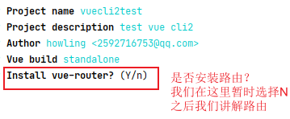


4、代码规范，不开


5、单元测试，不开

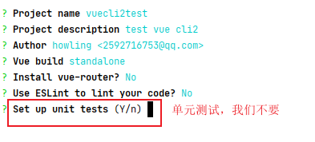

6、E 2 E，end to end，端到端测试，是一个利用selenium或者nightwatch等进行自动化测试的框架，不要


7、npm还是yarn：其实都行，但是我们使用npm


8、等待，脚手架会自动生成内容

### 脚手架生成的目录讲解


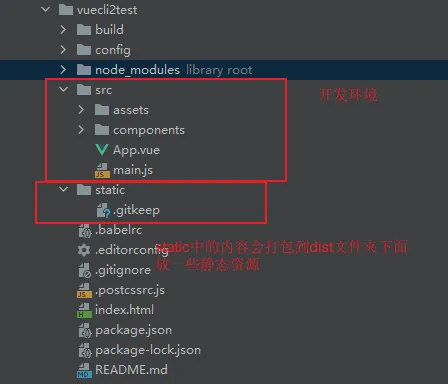

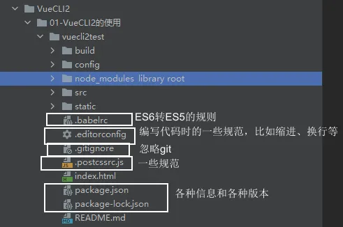

---

### runtime+compiler和runtime-only


我们之前创建的时候有两个选项


是选择runtime+compiler还是runtime-only，我们之前讲过`template`是否能用，其实是如下的区别：

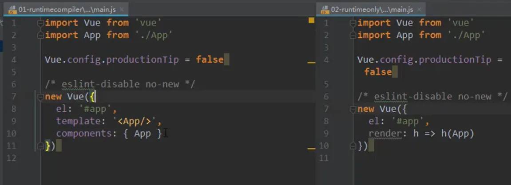

在这个图片中，左边是`runtime+compiler`，右边是`runtime-only`


可以看到，左边的内容是先引入的component，然后在template中进行使用


但是右边的内容没有进行注册，直接转换为了render函数使用


这两者就是这个区别，但其实事实上，template最终也是转换为了render函数，最后render转换为了虚拟dom然后到了UI


所以事实上，`runtime-only`的性能更高，所以之后我们选择`runtime-only`


但是之前我们说过，这个环境不能解析vue文件的template，所以我们需要loader，这个loader就是之前我们说过的


`vue-loader和vue-template-compiler`，在脚手架中已经默认安装了

---

## Vue CLI3


### Vue CLI3初始化


Vue CLI3和Vue CLI2有很大区别：


1、vue-cli3使用webpack 4打造，vue-cli2还是webpack3


2、vue-cli3的设计原则是0配置，移除的配置文件根目录下的build和config等目录


3、vue-cli3提供了vue ui命令，提供可视化配置，更加人性化


4、移除了static文件夹，新增public文件夹，并且index.html移动到了public中，public中的内容会原封不动放到dist中


1、初始化：`vue create 文件夹名称`


2、配置


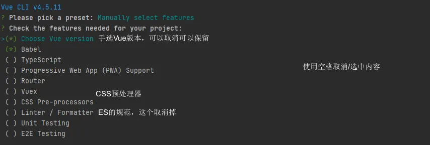

> 我们接下来讲Vuex，这个可以选择，或者等会在创建一个
>


3、最终生成

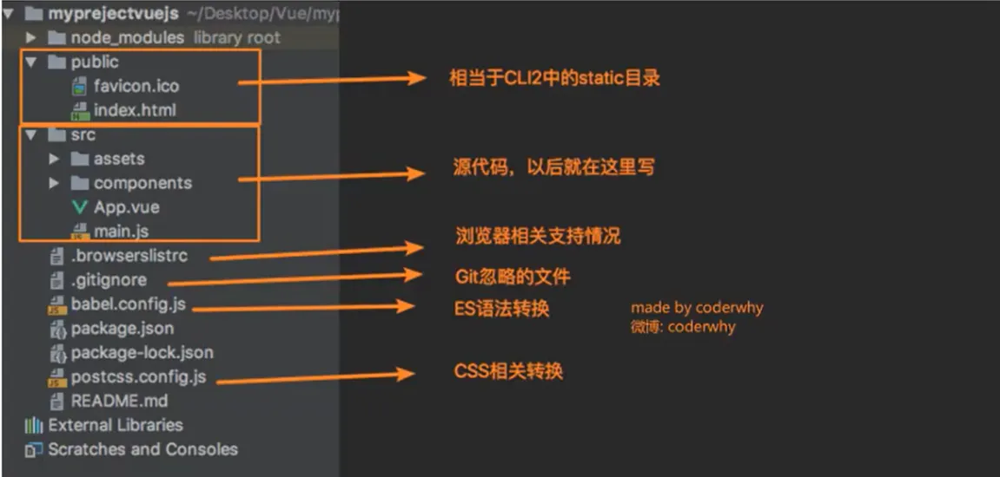

---

### 配置文件查看和修改


**图形化配置**


在Vue Cli3中，有很多配置都被隐藏了，但是我们有三种方式去修改默认的配置


1、在任何命令行敲`vue ui`，会启动一个本地服务器，然后做一些配置，但是在当前项目下运行命令会直接到当前项目下


2、导入项目之后，会直接跳转到项目的仪表盘

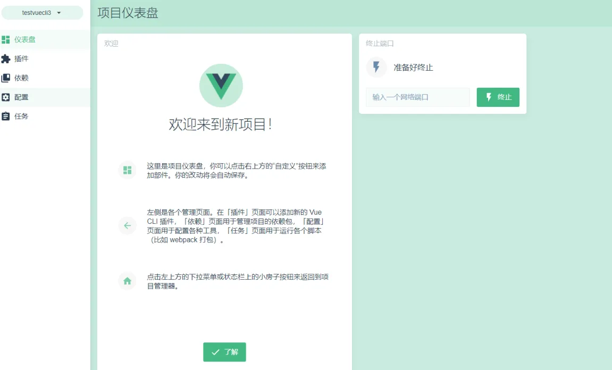

3、可以使用相关的配置了

---

## TabBar样例


```vue
<template>
  <div id="tab-bar">
    <slot></slot>
  </div>
</template>

<script>
export default {
  name: "TabBar"
}
</script>

<style scoped>
#tab-bar {
  display: flex;

  background-color: #f6f6f6;

  position: fixed;
  left: 0;
  right: 0;
  bottom: 0;

  box-shadow: 0 -3px 1px rgba(100, 100, 100, 0.2);
}
</style>
```


```vue
<template>
  <div class="tab-bar-item">
    <slot></slot>
  </div>
</template>

<script>
export default {
  name: "TabBarItem"
}
</script>

<style scoped>
.tab-bar-item {
  flex: 1;
  text-align: center;
  height: 49px;
}
</style>
```


```vue
<template>
  <div id="app">

    <tab-bar>
      <tab-bar-item>首页</tab-bar-item>
      <tab-bar-item>购物车</tab-bar-item>
      <tab-bar-item>我的</tab-bar-item>
    </tab-bar>
  </div>
</template>

<script>

import TabBar from "./components/tabbar/TabBar";
import TabBarItem from "./components/tabbar/TabBarItem";

export default {
  name: 'App',
  components: {
    TabBar,
    TabBarItem
  }
}
</script>

<style>
@import "./assets/css/base.css";


</style>
```


---
