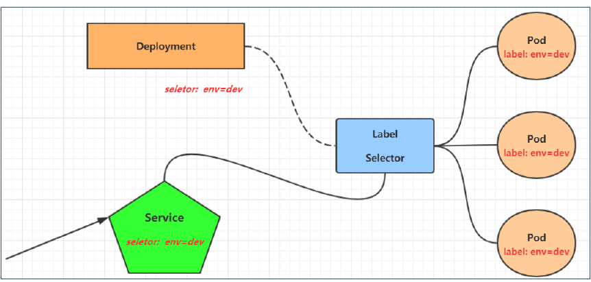
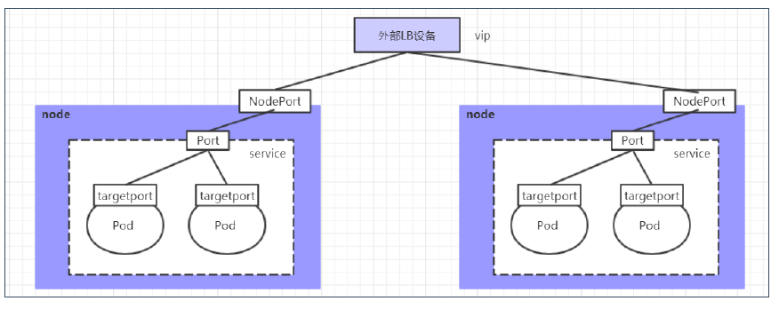
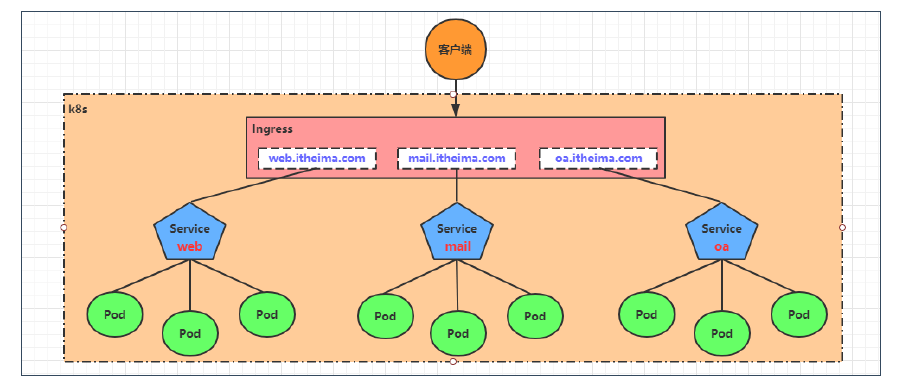
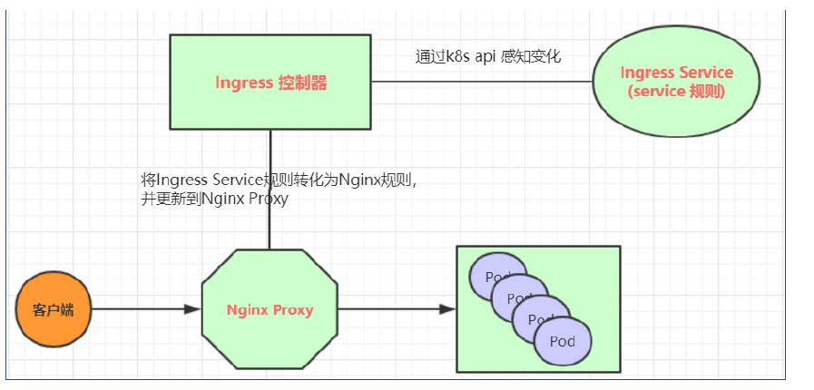

## Service 简介

在 k8s 中，我们可以访问 pod 的 ip 来进而访问应用程序，但是 pod 的 ip 是不固定的，也就不方便直接采用 pod ip 对服务访问。

为了解决这个问题，service 资源出现了，它可以对提供同一个服务的多个 pod 进行聚合，并且提供一个统一的入口地址。访问 service 的入口然后就可访问 pod，进而访问服务。



service 只是在逻辑上的一层，而 service 的实现是 kube-proxy 进程。

每个 node 上都运行了一个 kube-proxy 服务进程，当创建 service 时会通过 apiserver 向 etcd 写入 service 信息，kube-proxy 会监听 service 的变动，然后将最新的 service 信息转换为对应的规则。


---

目前 kube-proxy 有三种工作模式：

- userspace：为每一个 service 创建一个监听端口，发向 cluster ip 的请求被 iptables 重定向到 kube-proxy 监听的端口上。

    该模式下，kube-proxy 通过 LB 算法（加权轮询调度）选择一个 pod 建立连接，相当于一个四层负载均衡器。

    会增加内核和用户空间之间的数据拷贝，稳定，但是性能低。

- iptables: 为每个 service 后端的每个 pod 创建对应的 iptables 规则，直接发向 cluster ip 的请求重定向到一个 pod ip。

    该模式下 kube-proxy 只负责创建 iptables 规则，效率更高但是不能提供灵活的 LB 策略。后端 pod 不可用时也无法重试。

- ipvs: 类似 iptables，只不过升级了。

    此模式监控 pod 创建 ipvs 规则，ipvs 相对 iptables 转发效率更高，并且支持更多 LB 算法。

## Service 使用

### 环境准备

既然 service 是为 pod 提供服务，首先要创建出多个 pod。

```yml
apiVersion: apps/v1
kind: Deployment
metadata:
  name: pc-deployment
  namespace: dev
spec:
  replicas: 3
  selector:
    matchLabels:
      app: nginx-pod
  template:
    metadata:
      labels:
        app: nginx-pod
    spec:
      containers:
        - name: nginx
          image: nginx:1.17.1
          ports:
            - containerPort: 80
```

### ClusterIP Service

```yml
apiVersion: v1
kind: Service
metadata:
  name: service-clusterip
  namespace: dev
spec:
  selector:
    app: nginx-pod
  # service 的 ip 地址，不写会默认生成
  clusterIP: 10.97.97.97
  type: ClusterIP
  ports:
    # service 端口
    - port: 80
      # pod 端口
      targetPort: 80
```

**endpoints**

执行了此 yml 文件之后，我们可以使用 `kubectl describe service service-clusterip -n dev` 查看这个 service 的详细信息。

其中 `endpoints` 就是 service 对应的 pods 负载。

`endpoint` 是 k8s 中的一个资源对象，存在 etcd 中，用于记录一个 service 对应的所有 pod 访问地址，是根据 service 配制文件中的 selector 生成的。

也就是说，service 和 pod 之间的联系是通过 endpoints 实现的。

**负载分发**

对 service 的访问最终会分发到 pods 上，目前有两种负载方式：

- kube-proxy：默认策略，可以使用随机、轮询等。
- session：客户端地址的会话保持模式，也就是说，一个客户端发起的请求会转发到固定的 pod 上。可以在 `spec` 添加 `sessionAffinity: ClientIP` 开启。

### HeadLiness Service

```yml
apiVersion: v1
kind: Service
metadata:
  name: service-headliness
  namespace: dev
spec:
  selector:
    app: nginx-pod
  # 设置为 None 即可创建 headliness Service
  clusterIP: None
  type: ClusterIP
  ports:
    - port: 80
      targetPort: 80
```

在某些场景中，开发人员希望自己控制负载均衡策略，那么就是用 HeadLiness Service。如果想访问 Service，则只能通过 Service 的域名进行查询（不生成 ip 地址）。

也就是无头地址。

### NodePort Service

之前的样例中，Service IP 只能在集群内部才能访问，假如想要让集群外也访问到，则需要将 Service 地址映射到 Node 的另外的端口上，暴露出端口。然后就可以通过 `NodeIp:NodePort` 访问了。

```yml
apiVersion: v1
kind: Service
metadata:
  name: service-nodeport
  namespace: dev
spec:
  selector:
    app: nginx-pod
  type: NodePort
  ports:
    - port: 80
      targetPort: 80
      # 绑定的 node 端口，默认取值范围是 30000-32767，不指定则默认分配
      nodePort: 39998
```

### LoadBalancer Service 和 ExternalName Service

LoadBalancer Service 类似 NodePort，但是区别是它可以在外部再做一层负载均衡，需要外部环境支持。外部服务发送到设备的请求会被设备负载之后转发到集群中。




ExternalName Service 用于引入集群外部的服务，通过 externalName 属性制定一个外部服务地址，service 就可以访问到外部网络了。

```yml
apiVersion: v1
kind: Service
metadata:
  name: service-external
  namespace: dev
spec:
  type: ExternalName
  # ip 也可以
  externalName: www.baidu.com
```

## Ingress

NodePort 和 LoadBalancer 都会向集群外部暴露服务，但是这两种方式都有缺点。

NodePort 会占用多个端口，当服务变多时，这个缺点越发明显。

LB 是每个 service 都需要一个 LB，麻烦且浪费，并且需要 k8s 之外的其他设备支持。

基于这些缺点，k8s 提供了 Ingress 资源对象，只需要一个 NodePort 或者一个 LB 就可以满足多个 Service 暴露的需求。



其实 Ingress 就像是一个七层的负载均衡器，类似 nginx，在 ingress 中建立映射规则，然后 ingress controller 去监听规则并转化为 nginx 的反向代理配置。

- ingress：k8s 中的对象，作用是定义请求如何转发到 service 的规则。
- ingress controller：具体实现反向代理的程序，对 ingress 中的规则进行解析，实现有很多，例如 Nginx、Countour、Haproxy 等。

以 Nginx 为例：



### 环境搭建

环境搭建，其实就是安装 ingress controller，我们使用基于 nginx 的 ingress controller。

1. `mkdir ingress && cd ingress`
1. `wget https://raw.githubusercontent.com/kubernetes/ingress-nginx/nginx-0.30.0/deploy/static/mandatory.yaml`
1. `wget https://raw.githubusercontent.com/kubernetes/ingress-nginx/nginx-0.30.0/deploy/static/provider/baremetal/service-nodeport.yaml`
1. `kubectl apply -f ./`

如果一切顺利，会出现 ingress 的 service 和 ingress 的 pod


上图中的 service 中，有 http（80 端口）对应的 ip 和 https（443 端口）对应的 ip。

之后，我们随意创建几个 pod 和 service（比如 nginx 的），接下来就是让 ingress 代理到 service。

### 使用

#### HTTP 代理

```yml
apiVersion: extensions/v1beta1
kind: Ingress
metadata:
  name: ingress-http
  namespace: dev
spec:
  rules:
  - host: nginx.causes.com
    http:
      paths:
      - path: /
        backend:
          serviceName: nginx-service
          servicePort: 80
  - host: tomcat.causes.com
    http:
      paths:
      - path: /
        backend:
          serviceName: tomcat-service
          servicePort: 8080
```

- `kubectl create -f ingress-http.yaml`
- `kubectl get ingress ingress-http -n dev`
- `kubectl describe ing ingress-http -n dev`

在访问的时候应该使用 域名 + http 的端口访问。而且，一个教训就是，不要开着代理来实验。

#### HTTPS 代理

1. 生成证书：`openssl req -x509 -sha256 -nodes -days 365 -newkey rsa:2048 -keyout tls.key -out tls.crt -subj "/C=CN/ST=BJ/L=BJ/O=nginx/CN=causes.com"`
1. 创建密钥：`kubectl create secret tls tls-secret --key tls.key --cert tls.crt`
1. `ingress-https.yaml`:

    ```yml
    apiVersion: extensions/v1beta1
    kind: Ingress
    metadata:
      name: ingress-https
      namespace: dev
    spec:
      tls:
        - hosts:
          - nginx.itheima.com
          - tomcat.itheima.com
          secretName: tls-secret # 指定秘钥
      rules:
      - host: nginx.itheima.com
        http:
          paths:
          - path: /
            backend:
              serviceName: nginx-service
              servicePort: 80
      - host: tomcat.itheima.com
        http:
          paths:
          - path: /
            backend:
              serviceName: tomcat-service
              servicePort: 8080
    ```

在访问的时候，应该使用 域名 + https 的端口访问。
