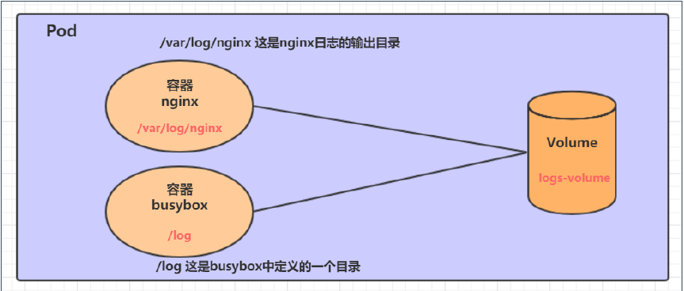
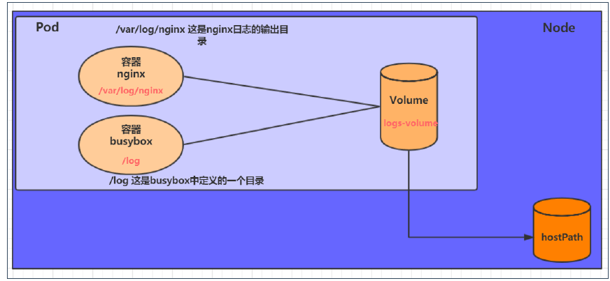
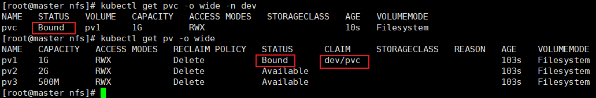
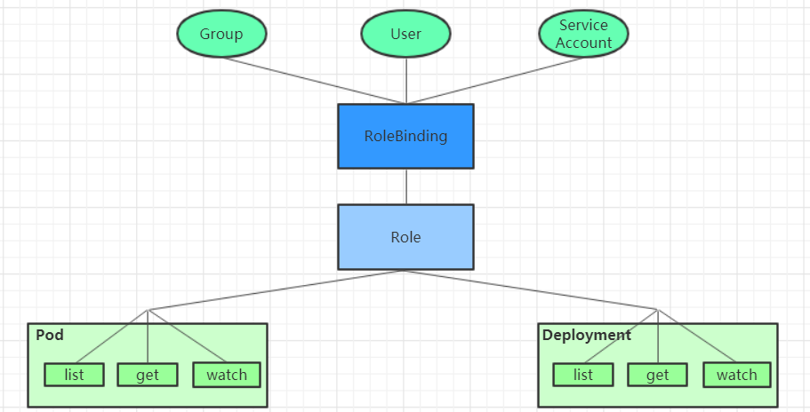

## 数据存储

容器会频繁创建销毁，容器在销毁同时，数据也会被清除。那么为了保存数据，k8s 提出了 volume，也就是共享目录。

volume 在 pod 上定义，被一个 pod 中的多个容器挂载到具体文件目录下，k8s 通过 volume 实现同 pod 的不同容器数据共享以及持久化存储。

volume 的生命周期和 pod 中的容器相关，容器终止、重启时，volume 数据不会丢失。

volume 有多种类型：

- 简单存储：EmptyDir、HostPath、NFS
- 高级存储：PV、PVC
- 配置存储：ConfigMap、Secret

### 简单存储

**EmptyDir**

最简单的 Volume 类型，就是主机上的一个空目录。pod 在分配到 node 的同时就会创建一次，k8s 会自动分配宿主机上的目录。pod 销毁时，EmptyDir 中的数据也会被销毁。

一般作用于临时目录、多容器共享目录。



```yml
apiVersion: v1
kind: Pod
metadata:
  name: volume-emptydir
  namespace: dev
spec:
  containers:
    - name: nginx
      image: nginx:1.14-alpine
      ports:
        - containerPort: 80
      volumeMounts:
        # 挂载目录为 /var/log/nginx
        - mountPath: /var/log/nginx
          name: logs-volume
    - name: busybox
      image: busybox:1.30
      command: ['/bin/bash', '-c', 'tail -f /logs/access.log']
      # 挂载目录为 /logs
      volumeMounts:
        - mountPath: /logs
          name: logs-volume
  volumes:
    - name: logs-volume
      emptyDir: {}
```

pod 中有两个容器，容器之间通过 volume 进行文件共享。其中 nginx 容器将自身的 `/var/log/nginx` 目录挂载到了 volume 下，busybox 容器将 `/log` 目录挂载到了 volume 下。

nginx 写 log 文件，通过 volume，busybox 可以读取 nginx 中的 log 文件并且将其输出。

**HostPath**

EmptyDir 中的数据不会被持久化，pod 结束就会销毁。如果想要持久化，最简单的方式是 HostPath。

hostPath 是将 pod 中的 volume 实际挂载到 node 上，这样就可以保证数据持久化。



```yml
apiVersion: v1
kind: Pod
metadata:
  name: volume-emptydir
  namespace: dev
spec:
  containers:
    - name: nginx
      image: nginx:1.14-alpine
      ports:
        - containerPort: 80
      volumeMounts:
        # 挂载目录为 /var/log/nginx
        - mountPath: /var/log/nginx
          name: logs-volume
    - name: busybox
      image: busybox:1.30
      command: ['/bin/bash', '-c', 'tail -f /logs/access.log']
      # 挂载目录为 /logs
      volumeMounts:
        - mountPath: /logs
          name: logs-volume
  volumes:
    - name: logs-volume
      # 唯一的区别是从 EmptyDir 改为了 HostPath
      hostPath:
        path: /tmp/logs
        # 此目录存在则使用，不存在则创建后使用
        type: DirectoryOrCreate
```

type 类型：

- DirectoryOrCreate：此目录存在则使用，不存在则创建后使用
- Directory：目录必须存在
- FileOrCreate：文件存在则使用，不存在则创建后使用
- File：文件必须存在

**NFS**

如果说 HostPath 是 EmptyDir 的升级版，那么 NFS 是 HostPath 的升级版。它解决了 Node 节点故障导致的 Path 问题。

使用 NFS 方式，需要 NFS 服务器，Pod 中的存储会直接上传到 NFS 中，这样即使 Pod 故障，NFS 没问题，数据就可以访问。

1. 首先需要安装 nfs：

    1. 随便找一台节点做 nfs 服务器，这里选用的是 node1：`yum -y install nfs-utils`
    1. 准备共享目录：`sudo mkdir /data/nfs -pv`
    1. 共享目录以读写权限暴露给 `192.168.10.*`：`vim /etc/exports`

        `/etc/exports` 文件是 nfs 读取的一个默认文件

        ```text
        /data/nfs 192.168.10.0/24(rw,no_root_squash)
        ```

    1. 在其他节点上都要安装 nfs，目的不是为了变为服务器，而是为了使用 nfs 设备
    1. 在其他节点上关闭 nfs 服务，我们其他节点上只需要一个驱动包即可。

1. 使用 nfs

    ```yml
    apiVersion: v1
    kind: Pod
    metadata:
      name: nfs
      namespace: dev
    spec:
      containers:
        - name: nginx
          image: nginx:1.14-alpine
          ports:
            - containerPort: 80
          volumeMounts:
            # 挂载目录为 /var/log/nginx
            - mountPath: /var/log/nginx
              name: logs-volume
        - name: busybox
          image: busybox:1.30
          command: ['/bin/sh', '-c', 'tail -f /logs/access.log']
          # 挂载目录为 /logs
          volumeMounts:
            - mountPath: /logs
              name: logs-volume
      volumes:
        - name: logs-volume
          # 使用 nfs
          nfs:
            path: /data/nfs
            server: 192.168.10.101
    ```

### 高阶存储

高阶存储是 pv、pvc。

简单来说，pv 是由管理员维护的，将所有存储配置抽象为相同的资源对用户提供。用户只需要知道 pv 的规则即可，不在乎究竟是哪个文件系统。

pvc 是用户维护的，是对 pv 的申请。

**pv**

pv 就是对各种存储设备的抽象，每个存储都不同，则有一定的差异性。

```yml
apiVersion: v1
kind: PersistentVolume
metadata:
  name: pv1
spec:
  # 存储类型，和底层对应，不同的存储方式对应的配置不同，要看对应的官方文档
  nfs:
    path: /data/nfs/pv/pv1/
    server: 192.168.10.101
  # 存储能力，对外提供的资源共多少，当前仅支持存储空间的设置
  capacity:
    storage: 2G
  # 访问模式，ReadOnlyMany（只读）、ReadWriteMany（可读写）、ReadWriteOnce（可读写，但只能被一个 pvc 独占）
  # 具体存储系统支持的访问模式不同，nfs 三种全都支持
  accessModes: [ReadWriteMany]
  # 回收策略，pv 不再被使用后，数据的处理方式。Retain（保留）、Delete（删除）、Recycle（已经废弃，效果等于 rm -rf /data/*）
  persistentVolumeReclaimPolicy: Delete

---

apiVersion: v1
kind: PersistentVolume
metadata:
  name: pv2
spec:
  nfs:
    path: /data/nfs/pv/pv2/
    server: 192.168.10.101
  capacity:
    storage: 1G
  accessModes: [ReadWriteMany]
  persistentVolumeReclaimPolicy: Delete

---

apiVersion: v1
kind: PersistentVolume
metadata:
  name: pv3
spec:
  nfs:
    path: /data/nfs/pv/pv3/
    server: 192.168.10.101
  capacity:
    storage: 2G
  accessModes: [ReadWriteMany]
  persistentVolumeReclaimPolicy: Delete
```

一个 pv 的生命周期：

- available: 可用
- bound: 已被 pvc 绑定
- released: pvc 已被删除，但是资源还未被集群重新声明
- failed: 回收失败


注意一点，pv 没有名称空间的概念，我们在编写配置文件和查看的时候都不需要带名称空间


**pvc**

```yml
apiVersion: v1
kind: PersistentVolumeClaim
metadata:
  name: pvc
  namespace: dev
spec:
  # 可以根据访问模式来挑选适合的 pv，还有一些选项，和上面的 pvc 配置是一样的
  accessModes: [ReadWriteMany]
  resources:
    requests:
      storage: 1G
```


pvc 有 namespace，这代表它是分环境的。




**在 pods 中使用 pvc**

```yml
apiVersion: v1
kind: Pod
metadata:
  namespace: dev
  name: pod
spec:
  containers:
    - name: busybox
      image: busybox:1.30
      command: ['/bin/sh', '-c', 'touch /tmp/hello.txt; while true; do /bin/echo $(date +%T) >> /tmp/hello.txt; sleep 3; done;']
      volumeMounts:
        - mountPath: /tmp/
          name: volume
  volumes:
    - name: volume
      persistentVolumeClaim:
        # 这个名字是 pvc 的名字，这里的 pvc 名字就是 pvc
        claimName: pvc
        readOnly: false
```

## 配置存储


### ConfigMap

ConfigMap 是一种比较特殊的存储卷，它的主要作用是用来存储配置信息的。

创建 `configmap.yaml`，内容如下：

```yml
apiVersion: v1
kind: ConfigMap
metadata:
  name: configmap
  namespace: dev
data:
  info: |
    username:admin
    password:123456
```

```
# 创建configmap
[root@k8s-master01 ~]# kubectl create -f configmap.yaml
configmap/configmap created

# 查看configmap详情
[root@k8s-master01 ~]# kubectl describe cm configmap -n dev
Name:         configmap
Namespace:    dev
Labels:       <none>
Annotations:  <none>

Data
====
info:
----
username:admin
password:123456

Events:  <none>
```

接下来创建一个 `pod-configmap.yaml` ，将上面创建的 `configmap` 挂载进去

```yaml
apiVersion: v1
kind: Pod
metadata:
  name: pod-configmap
  namespace: dev
spec:
  containers:
  - name: nginx
    image: nginx:1.17.1
    volumeMounts: # 将configmap挂载到目录
    - name: config
      mountPath: /configmap/config
  volumes: # 引用configmap
  - name: config
    configMap:
      name: configmap
```

```
# 创建pod
[root@k8s-master01 ~]# kubectl create -f pod-configmap.yaml
pod/pod-configmap created

# 查看pod
[root@k8s-master01 ~]# kubectl get pod pod-configmap -n dev
NAME            READY   STATUS    RESTARTS   AGE
pod-configmap   1/1     Running   0          6s

#进入容器
[root@k8s-master01 ~]# kubectl exec -it pod-configmap -n dev /bin/sh
# cd /configmap/config/
# ls
info
# more info
username:admin
password:123456

# 可以看到映射已经成功，每个configmap都映射成了一个目录
# key--->文件     value---->文件中的内容
# 此时如果更新configmap的内容, 容器中的值也会动态更新
```

### Secret

在 kubernetes 中，还存在一种和 ConfigMap 非常类似的对象，称为 Secret 对象

它主要用于存储敏感信息，例如密码、秘钥、证书等等

```
[root@k8s-master01 ~]# echo -n 'admin' | base64 #准备username
YWRtaW4=
[root@k8s-master01 ~]# echo -n '123456' | base64 #准备password
MTIzNDU2
```

secret.yaml

```yaml
apiVersion: v1
kind: Secret
metadata:
  name: secret
  namespace: dev
type: Opaque
data:
  username: YWRtaW4=
  password: MTIzNDU2
```

```
# 创建secret
[root@k8s-master01 ~]# kubectl create -f secret.yaml
secret/secret created

# 查看secret详情
[root@k8s-master01 ~]# kubectl describe secret secret -n dev
Name:         secret
Namespace:    dev
Labels:       <none>
Annotations:  <none>
Type:  Opaque
Data
====
password:  6 bytes
username:  5 bytes
```


创建 `pod-secret.yaml`，将上面创建的secret挂载进去

```
apiVersion: v1
kind: Pod
metadata:
  name: pod-secret
  namespace: dev
spec:
  containers:
  - name: nginx
    image: nginx:1.17.1
    volumeMounts: # 将secret挂载到目录
    - name: config
      mountPath: /secret/config
  volumes:
  - name: config
    secret:
      secretName: secret
```

```
# 创建pod
[root@k8s-master01 ~]# kubectl create -f pod-secret.yaml
pod/pod-secret created

# 查看pod
[root@k8s-master01 ~]# kubectl get pod pod-secret -n dev
NAME            READY   STATUS    RESTARTS   AGE
pod-secret      1/1     Running   0          2m28s

# 进入容器，查看secret信息，发现已经自动解码了
[root@k8s-master01 ~]# kubectl exec -it pod-secret /bin/sh -n dev
/ # ls /secret/config/
password  username
/ # more /secret/config/username
admin
/ # more /secret/config/password
123456
```

## 安全认证

### 访问控制概述

Kubernetes 作为一个分布式集群的管理工具，保证集群的安全性是其一个重要的任务

所谓的安全性其实就是保证对 Kubernetes 的各种客户端进行认证和鉴权操作

### 客户端

在Kubernetes集群中，客户端通常有两类：

- User Account：一般是独立于 kubernetes 之外的其他服务管理的用户账号。
- Service Account：kubernetes管理的账号，用于为 Pod 中的服务进程在访问 Kubernetes 时提供身份标识。


### 认证、授权与准入控制

ApiServer是访问及管理资源对象的唯一入口。任何一个请求访问ApiServer，都要经过下面三个流程：

- Authentication（认证）：身份鉴别，只有正确的账号才能够通过认证
- Authorization（授权）： 判断用户是否有权限对访问的资源执行特定的动作
- Admission Control（准入控制）：用于补充授权机制以实现更加精细的访问控制功能。


### 认证管理

Kubernetes集群安全的最关键点在于如何识别并认证客户端身份，它提供了3种客户端身份认证方式：

- HTTP Base认证：通过用户名+密码的方式认证

  这种认证方式是把“用户名:密码”用BASE64算法进行编码后的字符串放在HTTP请求中的Header Authorization域里发送给服务端。服务端收到后进行解码，获取用户名及密码，然后进行用户身份认证的过程。

- HTTP Token认证：通过一个Token来识别合法用户

  这种认证方式是用一个很长的难以被模仿的字符串--Token来表明客户身份的一种方式。每个Token对应一个用户名，当客户端发起API调用请求时，需要在HTTP Header里放入Token，API Server接到Token后会跟服务器中保存的token进行比对，然后进行用户身份认证的过程。

- HTTPS 证书认证：基于CA根证书签名的双向数字证书认证方式

  这种认证方式是安全性最高的一种方式


### 授权管理

授权发生在认证成功之后，通过认证就可以知道请求用户是谁， 然后Kubernetes会根据事先定义的授权策略来决定用户是否有权限访问，这个过程就称为授权。

每个发送到ApiServer的请求都带上了用户和资源的信息：比如发送请求的用户、请求的路径、请求的动作等，授权就是根据这些信息和授权策略进行比较，如果符合策略，则认为授权通过，否则会返回错误。

API Server目前支持以下几种授权策略：

- AlwaysDeny：表示拒绝所有请求，一般用于测试
- AlwaysAllow：允许接收所有请求，相当于集群不需要授权流程（Kubernetes默认的策略）
- ABAC：基于属性的访问控制，表示使用用户配置的授权规则对用户请求进行匹配和控制
- Webhook：通过调用外部REST服务对用户进行授权
- Node：是一种专用模式，用于对kubelet发出的请求进行访问控制
- RBAC：基于角色的访问控制（kubeadm安装方式下的默认选项）
- RBAC(Role-Based Access Control) 基于角色的访问控制，主要是在描述一件事情：给哪些对象授予了哪些权限

其中涉及到了下面几个概念：

- 对象：User、Groups、ServiceAccount
- 角色：代表着一组定义在资源上的可操作动作(权限)的集合
- 绑定：将定义好的角色跟用户绑定在一起



RBAC引入了4个顶级资源对象：

- Role、ClusterRole：角色，用于指定一组权限
- RoleBinding、ClusterRoleBinding：角色绑定，用于将角色（权限）赋予给对象

### Role、ClusterRole

一个角色就是一组权限的集合，这里的权限都是许可形式的（白名单）

```yaml
# Role只能对命名空间内的资源进行授权，需要指定nameapce
kind: Role
apiVersion: rbac.authorization.k8s.io/v1beta1
metadata:
  namespace: dev
  name: authorization-role
rules:
- apiGroups: [""]  # 支持的API组列表,"" 空字符串，表示核心API群
  resources: ["pods"] # 支持的资源对象列表
  verbs: ["get", "watch", "list"] # 允许的对资源对象的操作方法列表
```

```yaml
# ClusterRole可以对集群范围内资源、跨namespaces的范围资源、非资源类型进行授权
kind: ClusterRole
apiVersion: rbac.authorization.k8s.io/v1beta1
metadata:
 name: authorization-clusterrole
rules:
- apiGroups: [""]
  resources: ["pods"]
  verbs: ["get", "watch", "list"]
```

需要详细说明的是，rules中的参数：

- apiGroups: 支持的API组列表

  ```
  "","apps", "autoscaling", "batch"
  ```

- resources：支持的资源对象列表

  ```
  "services", "endpoints", "pods","secrets","configmaps","crontabs","deployments","jobs",
  "nodes","rolebindings","clusterroles","daemonsets","replicasets","statefulsets",
  "horizontalpodautoscalers","replicationcontrollers","cronjobs"
  ```

- verbs：对资源对象的操作方法列表

  ```
  "get", "list", "watch", "create", "update", "patch", "delete", "exec"
  ```

### RoleBinding、ClusterRoleBinding

角色绑定用来把一个角色绑定到一个目标对象上，绑定目标可以是 User、Group 或者 ServiceAccount

```yaml
# RoleBinding可以将同一namespace中的subject绑定到某个Role下，则此subject即具有该Role定义的权限
kind: RoleBinding
apiVersion: rbac.authorization.k8s.io/v1beta1
metadata:
  name: authorization-role-binding
  namespace: dev
subjects:
- kind: User
  name: heima
  apiGroup: rbac.authorization.k8s.io
roleRef:
  kind: Role
  name: authorization-role
  apiGroup: rbac.authorization.k8s.io
```

```yaml
# ClusterRoleBinding在整个集群级别和所有namespaces将特定的subject与ClusterRole绑定，授予权限
kind: ClusterRoleBinding
apiVersion: rbac.authorization.k8s.io/v1beta1
metadata:
 name: authorization-clusterrole-binding
subjects:
- kind: User
  name: heima
  apiGroup: rbac.authorization.k8s.io
roleRef:
  kind: ClusterRole
  name: authorization-clusterrole
  apiGroup: rbac.authorization.k8s.io
```

### RoleBinding 引用 ClusterRole 进行授权

RoleBinding 可以引用 ClusterRole，对属于同一命名空间内 ClusterRole 定义的资源主体进行授权

一种很常用的做法就是，集群管理员为集群范围预定义好一组角色（ClusterRole），然后在多个命名空间中重复使用这些 ClusterRole

这样可以大幅提高授权管理工作效率，也使得各个命名空间下的基础性授权规则与使用体验保持一致

```yaml
# 虽然authorization-clusterrole是一个集群角色，但是因为使用了RoleBinding
# 所以heima只能读取dev命名空间中的资源
kind: RoleBinding
apiVersion: rbac.authorization.k8s.io/v1beta1
metadata:
  name: authorization-role-binding-ns
  namespace: dev
subjects:
- kind: User
  name: heima
  apiGroup: rbac.authorization.k8s.io
roleRef:
  kind: ClusterRole
  name: authorization-clusterrole
  apiGroup: rbac.authorization.k8s.io
```

### 准入控制

通过了前面的认证和授权之后，还需要经过准入控制处理通过之后，apiserver才会处理这个请求。

准入控制是一个可配置的控制器列表，可以通过在Api-Server上通过命令行设置选择执行哪些准入控制器：

```
--admission-control=NamespaceLifecycle,LimitRanger,ServiceAccount,PersistentVolumeLabel,
                      DefaultStorageClass,ResourceQuota,DefaultTolerationSeconds
```

只有当所有的准入控制器都检查通过之后，apiserver才执行该请求，否则返回拒绝。

当前可配置的Admission Control准入控制如下：

- AlwaysAdmit：允许所有请求
- AlwaysDeny：禁止所有请求，一般用于测试
- AlwaysPullImages：在启动容器之前总去下载镜像
- DenyExecOnPrivileged：它会拦截所有想在 Privileged Container上执行命令的请求
- ImagePolicyWebhook：这个插件将允许后端的一个 Webhook 程序来完成 admission controller 的功能。
- Service Account：实现 ServiceAccount 实现了自动化
- SecurityContextDeny：这个插件将使用 SecurityContext 的 Pod 中的定义全部失效
- ResourceQuota：用于资源配额管理目的，观察所有请求，确保在 namespace 上的配额不会超标
- LimitRanger：用于资源限制管理，作用于 namespace 上，确保对 Pod 进行资源限制
- InitialResources：为未设置资源请求与限制的 Pod，根据其镜像的历史资源的使用情况进行设置
- NamespaceLifecycle：如果尝试在一个不存在的 namespace 中创建资源对象，则该创建请求将被拒绝。当删除一个 namespace 时，系统将会删除该 namespace 中所有对象
- DefaultStorageClass：为了实现共享存储的动态供应，为未指定 StorageClass 或 PV 的 PVC 尝试匹配默认的 StorageClass，尽可能减少用户在申请 PVC 时需了解的后端存储细节
- DefaultTolerationSeconds：这个插件为那些没有设置 forgiveness tolerations并具有notready:NoExecute和unreachable:NoExecute 两种 taints 的 Pod 设置默认的“容忍”时间，为 5min
- PodSecurityPolicy：这个插件用于在创建或修改Pod时决定是否根据Pod的security context和可用的PodSecurityPolicy对Pod的安全策略进行控制

## DashBoard

```
# 下载yaml
[root@k8s-master01 ~]# wget  https://raw.githubusercontent.com/kubernetes/dashboard/v2.0.0/aio/deploy/recommended.yaml

# 修改kubernetes-dashboard的Service类型
kind: Service
apiVersion: v1
metadata:
  labels:
    k8s-app: kubernetes-dashboard
  name: kubernetes-dashboard
  namespace: kubernetes-dashboard
spec:
  type: NodePort  # 新增
  ports:
    - port: 443
      targetPort: 8443
      nodePort: 30009  # 新增
  selector:
    k8s-app: kubernetes-dashboard

# 部署
[root@k8s-master01 ~]# kubectl create -f recommended.yaml

# 查看namespace下的kubernetes-dashboard下的资源
[root@k8s-master01 ~]# kubectl get pod,svc -n kubernetes-dashboard
NAME                                            READY   STATUS    RESTARTS   AGE
pod/dashboard-metrics-scraper-c79c65bb7-zwfvw   1/1     Running   0          111s
pod/kubernetes-dashboard-56484d4c5-z95z5        1/1     Running   0          111s

NAME                               TYPE       CLUSTER-IP      EXTERNAL-IP  PORT(S)         AGE
service/dashboard-metrics-scraper  ClusterIP  10.96.89.218    <none>       8000/TCP        111s
service/kubernetes-dashboard       NodePort   10.104.178.171  <none>       443:30009/TCP   111s

# 创建账号
[root@k8s-master01-1 ~]# kubectl create serviceaccount dashboard-admin -n kubernetes-dashboard

# 授权
[root@k8s-master01-1 ~]# kubectl create clusterrolebinding dashboard-admin-rb --clusterrole=cluster-admin --serviceaccount=kubernetes-dashboard:dashboard-admin

# 获取账号token
[root@k8s-master01 ~]#  kubectl get secrets -n kubernetes-dashboard | grep dashboard-admin
dashboard-admin-token-xbqhh        kubernetes.io/service-account-token   3      2m35s

[root@k8s-master01 ~]# kubectl describe secrets dashboard-admin-token-xbqhh -n kubernetes-dashboard
Name:         dashboard-admin-token-xbqhh
Namespace:    kubernetes-dashboard
Labels:       <none>
Annotations:  kubernetes.io/service-account.name: dashboard-admin
              kubernetes.io/service-account.uid: 95d84d80-be7a-4d10-a2e0-68f90222d039

Type:  kubernetes.io/service-account-token

Data
====
namespace:  20 bytes
token:      eyJhbGciOiJSUzI1NiIsImtpZCI6ImJrYkF4bW5XcDhWcmNGUGJtek5NODFuSXl1aWptMmU2M3o4LTY5a2FKS2cifQ.eyJpc3MiOiJrdWJlcm5ldGVzL3NlcnZpY2VhY2NvdW50Iiwia3ViZXJuZXRlcy5pby9zZXJ2aWNlYWNjb3VudC9uYW1lc3BhY2UiOiJrdWJlcm5ldGVzLWRhc2hib2FyZCIsImt1YmVybmV0ZXMuaW8vc2VydmljZWFjY291bnQvc2VjcmV0Lm5hbWUiOiJkYXNoYm9hcmQtYWRtaW4tdG9rZW4teGJxaGgiLCJrdWJlcm5ldGVzLmlvL3NlcnZpY2VhY2NvdW50L3NlcnZpY2UtYWNjb3VudC5uYW1lIjoiZGFzaGJvYXJkLWFkbWluIiwia3ViZXJuZXRlcy5pby9zZXJ2aWNlYWNjb3VudC9zZXJ2aWNlLWFjY291bnQudWlkIjoiOTVkODRkODAtYmU3YS00ZDEwLWEyZTAtNjhmOTAyMjJkMDM5Iiwic3ViIjoic3lzdGVtOnNlcnZpY2VhY2NvdW50Omt1YmVybmV0ZXMtZGFzaGJvYXJkOmRhc2hib2FyZC1hZG1pbiJ9.NAl7e8ZfWWdDoPxkqzJzTB46sK9E8iuJYnUI9vnBaY3Jts7T1g1msjsBnbxzQSYgAG--cV0WYxjndzJY_UWCwaGPrQrt_GunxmOK9AUnzURqm55GR2RXIZtjsWVP2EBatsDgHRmuUbQvTFOvdJB4x3nXcYLN2opAaMqg3rnU2rr-A8zCrIuX_eca12wIp_QiuP3SF-tzpdLpsyRfegTJZl6YnSGyaVkC9id-cxZRb307qdCfXPfCHR_2rt5FVfxARgg_C0e3eFHaaYQO7CitxsnIoIXpOFNAR8aUrmopJyODQIPqBWUehb7FhlU1DCduHnIIXVC_UICZ-MKYewBDLw
ca.crt:     1025 bytes
```

通过浏览器访问 Dashboard 的 UI，在登录页面上输入上面的token


