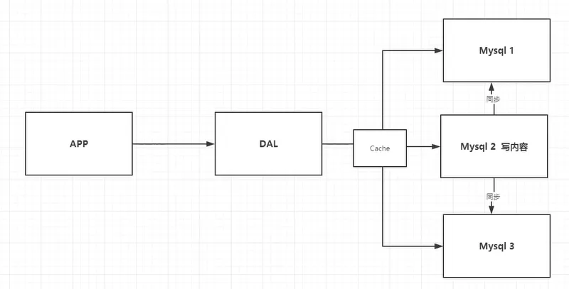
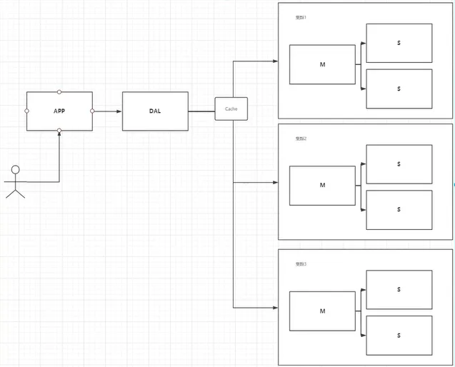
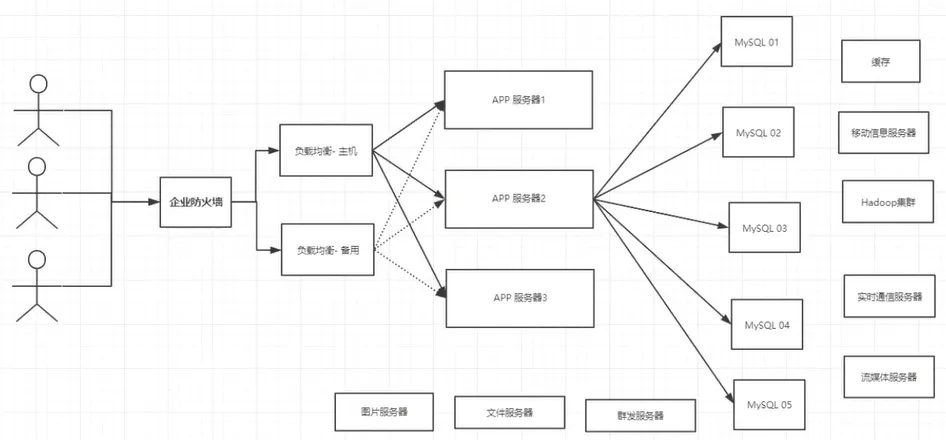
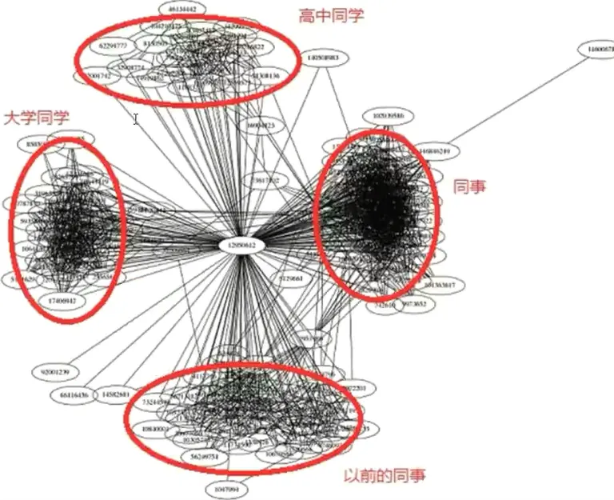

## NOSQL讲解


### 为什么要用NOSQL


我们现在处于大数据时代。大数据的意思：一般的数据库无法进行处理了。


### 演进


> 1、最早期的时候是单机MySQL时代
>


最早期的时候，90年代，一个基本的访问量不会太大，单机MySQL完全足够，服务器完全没有压力


**弊端**


1、数据访问量太大，一个服务器承受不住


2、数据索引太大，一个机器内存放不下


3、数据量太多，一个机器放不下


> 2、缓存+SQL+垂直拆分，那个时候使用：Memcached（缓存）+MySQL+拆分
>



网站很多时候都是去读，如果直接去读数据库的时候就十分麻烦，所以减轻服务器压力，直接走缓存


然后MySQL进行拆分，部分写内容，然后同步到其他， 其他读内容


> 3、分库分表+MySQL集群
>



> 4、现在
>



MySQL等关系型数据库不够用了，因为数据量太大，变化太快。


MySQL有的使用它来存储一些比较大的文件，但是如果有一种数据库来专门处理这些数据，MySQL的压力就十分小，研究者中和问题才是未来。


### 为什么要用NoSQL


用户的个人信息，社交网络，地理位置。


用户自己产生的数据,用户日志等等爆发式增长!

这时候我们就需要使用NoSQL数据库的， Nosql可以很好的处理以上的情况!


### 什么是NOSQL


NOSQL：Not Only SQL：不仅仅是SQL，泛指非关系型数据库

NOSQL在当今互联网发展十分迅速

很多数据类型用户的个人信息，社交网络，地理位置，这些数据类型的存储不需要一个固定的格式，不需要多月的操作就可以横向扩展的。

NOSQL的特点

1、方便扩展

2、大数据量读写高性能（1秒读11万，写8万）

3、数据类型多样性的（不需要设计数据库，随取随用）


传统关系型数据库（RDBMS）和 NOSQL


```bash
`传统的RDBMS`
- 结构化组织
- SQL
- 关系和数据都在单独的表中
- 数据定义语言
- 严格的一致性
- 基础的事务
- ......
```


```bash
`NoSQL`
- 不仅仅是数据
- 没有固定的查询语言
- 键值对存储，列存储，文档存储，图形数据库，....
- 最终一致性
- CAP定力和BASE
- 高性能，高可用，高可扩
- ......
```


> 3V+3高
>


大数据时代的3V :主要是描述问题的


1、海量Volume


2、多样Variety


3、实时Velocity


大数据时代的3高:主要是对程序的要求


1、高并发


2、高可拓


3、高性能


## 阿里巴巴架构演进


阿里巴巴成立于1999年，一开始的时候去国外买的一个PHP的网站


2000（Java）：进入Java时代。


2001-2004（EJB）：使用EJB时代（SLSB，CMP，MDB）


2005-2007（EJB重构），去EJB重构：Spring+iBatis+Webx，Antx


2008-2009（海量数据）：Memcached集群，MySQL+数据切分，分布式存储，Hadoop，KV，CDN


2010（安全，镜像）：安全，镜像，应用服务器升级，秒杀。NoSQL，SSD


2011（敏捷，开放，体验）


```bash
## 1、信息
	MySQL，Oracle

## 2、描述，评论（文字较多）
	文档型数据库，MongoDB
## 3、图片
	分布式文件系统
		- 淘宝：TFS
		- Google：GFS
		- Hadoop：HDFS
		- 阿里云：OSS
## 4、搜索
	- 搜索引擎：Solr，ElasticSearch，ISearch（开发大佬多隆一人开发出ISearch）
## 5、波段信息
	- 内存数据库
	- Redis，Tair，Memacache
```


大型互联网应用问题：


+ 数据类型太多
+ 数据源太多，经常重构
+ 数据要改造


## NOSQL四大分类


**KV键值对数据库**


+ 新浪：Redis
+ 美团：Redis+Tair
+ 阿里，百度：Redis+Memacache


**文档式数据库（bson格式和json一样）**


+ MongoDB
    - MongoDB是一个基于分布式文件存储的数据库，c++编写，主要用于处理大量的文档
    - MongoDB是一个介于关系型数据库和非关系型数据中中间的产品

> 非关系型数据库中最像关系型数据库的
>

+ ConthDB


**列存储数据库**


+ HBase
+ 分布式文件系统


**图关系数据库**


+ Neo4j，infoGrid



> 不是存储图形的，是存储关系的
>


四者对比

| 分类 | 举例 | 典型应用场景 | 数据模型 | 优点 | 缺点 |
| :---: | :---: | :---: | :---: | :---: | :---: |
| 键值对 | Redis Voldemort，Oracle DBD | 内容缓存，处理大量数据的高访问负载，日志系统 | key指向value的键值对，通常用HashTable实现 | 查询速度快 | 数据无结构化，通常只被当做字符串或者二进制数据 |
| 列 | Cassandra，HBase，Riak | 分布式的文件系统 | 以列簇式存储,将同一列数据存在一起 | 查询速度快，扩容性强，容易进行分布式扩展 | 功能相对局限 |
| 文档 | CouchDB，MongoDB | WEB应用 | key-value对应的键值对，Value为结构化数据 | 数据结构要求不严格，不需要向关系型数据库一样预先定义表内容 | 查询性能不高，缺少统一的查询语法 |
| 图形 | Neo4J，InfoGrid，Infinite Graph | 社交网络，推荐系统等。专注于构建关系图谱 | 图结构 | 利用图结构算法 | 很多时候需要对整个图做计算才能得出需要的信息，不好做分布式的集群 |


