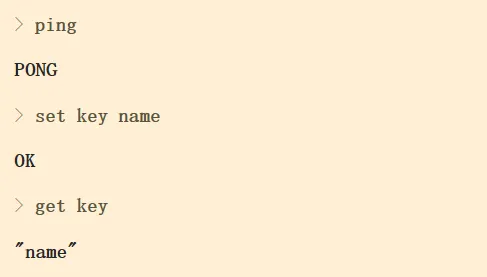
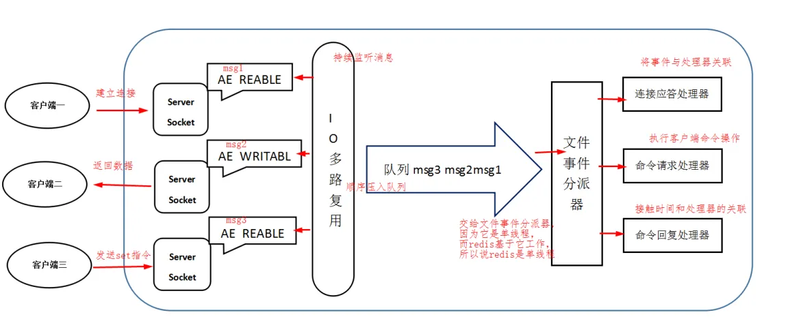
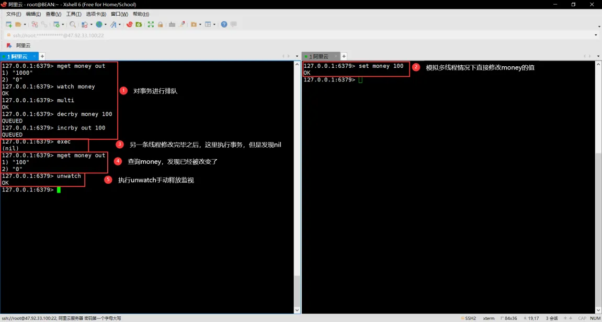
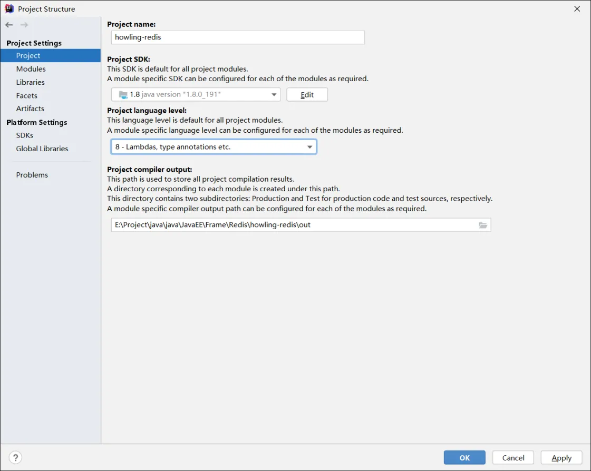
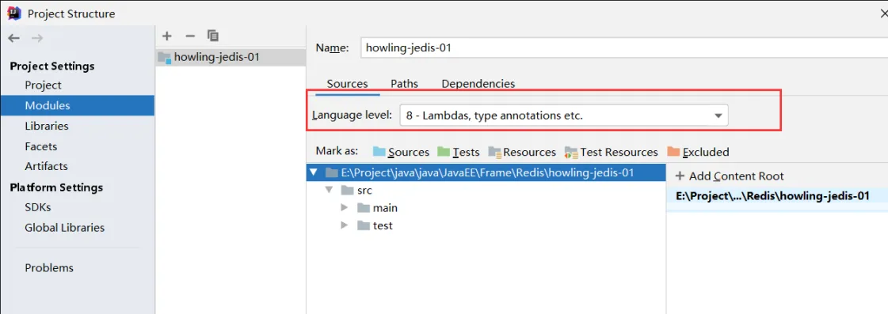
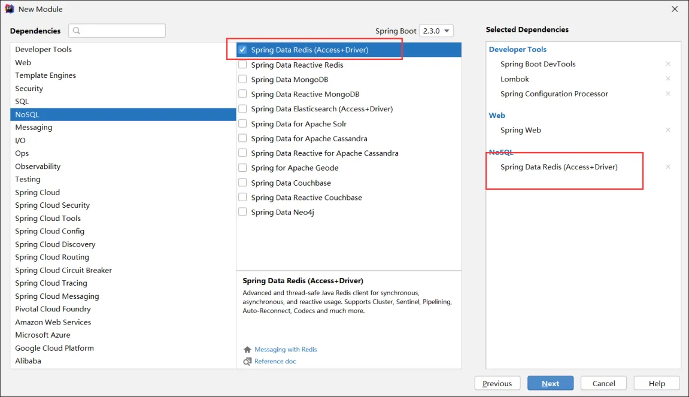
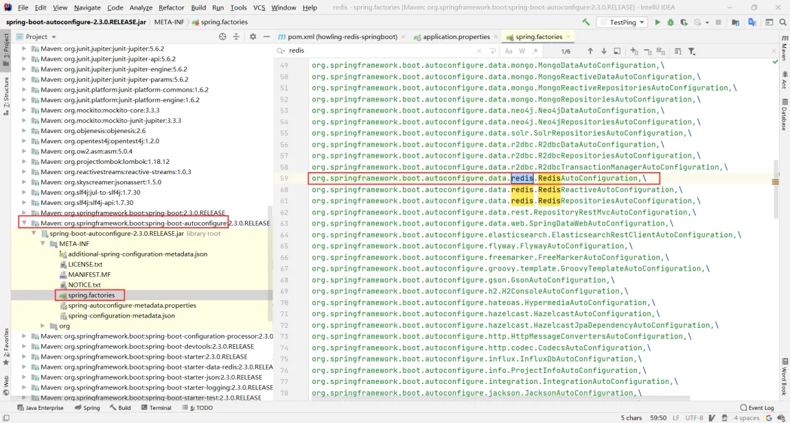

## Reids入门


### 概述


#### 什么是Redis


Redis：Remote Dictionary Server：远程字典服务


免费，开源，C语言写的，支持网络，可基于内存和持久化的日志型，key-value的数据库，并支持多种语言


**效率**


1秒读11万，写8万


#### Redis能干什么


1、内存存储，持久化==（RDB，AOF）==


2、效率高，用于高速缓存


3、发布订阅


3、地图信息分析


4、计时器，计数器


5、缓存


6、消息队列


.....


> 一般来说，Redis中一般存放
>
> + 需要经常查询、不经常修改、不是特别重要的数据
> + 特别重要的数据一定不要放到Redis中
>


#### 特性


1、多样的数据类型


2、持久化


3、集群


4、事物


**学习途径**


1、文章


2、官网：[https://redis.io/](https://redis.io/)


3、中文网：[https://www.redis.net.cn/](https://www.redis.net.cn/)


4、GitHub


5、在线测试：[http://try.redis.io/](http://try.redis.io/)


### 安装


#### Windows


1. 下载安装包：[https://github.com/MicrosoftArchive/redis/releases](https://github.com/MicrosoftArchive/redis/releases)
2. 安装
3. 解压到自己的环境目录下
4. 双击运行服务
5. 使用Redis客户端来连接客户端
6. 测试连接：`ping`
7. `set 键 值`
8. `get 键`





> Redis早就没有Windows的了，现在这个是3.0的上古版本
>


#### Linux


1. 下载安装包
2. 丢到服务器上，程序一般放到`/opt`目录下
3. 解压：`tar -zxvf xxx`
4. 进入解压后的文件，可以看到redis的配置文件
5. 执行命令：`yum install gcc-c++`
6. 执行命令：`make`
7. 执行命令：`make install`
8. 默认的路径是`/usr/local/bin`
9. 将`opt/redis/redis.conf`配置复制一份放到自己定义的地方（比如`usr/local/howling`文件夹下），防止配置文件出错导致问题
10. `cp /opt/redis/redis.conf /usr/local/howling`
11. 修改配置文件`howling/redis.conf`，让它默认为后台启动，改为yes，以后我们就用这个配置文件启动  

    

12. 启动Redis：`redis-server howling/redis.conf`
13. 连接：`redis-cli -p 6379`
14. 测试：`ping`
15. 关闭服务：`shutdown`
16. 退出：`exit`

    

    > 6.0之后需要升级GCC，否则会出错
    >

    > 在服务器上运行命令和在测试网站上的是一样的，没有必要的时候我们就使用测试网站来学习，有需要则去服务器
    >

---

### 测试性能


测试命令：`redis-benchmark`

| 命令 | 描述 | 默认 |
| --- | --- | --- |
| -h | 指定服务器主机名 | localhost |
| -p | 指定服务器端口 | 6379 |
| -c | 指定并发连接数 | 50 |
| -n | 指定请求数 | 10000 |


---

### 基础知识


#### 数据库


**数据库命令**


Redis默认有16个数据库，默认使用第0个


+ 可以使用`select`进行切换
+ 可以使用`DBSIZE`查看数据库大小


+ `keys *`查看所有的key
+ `get 键`：查看键对应值

```bash
127.0.0.1:6379> keys *
1) "key"
127.0.0.1:6379> get key
"name"
```

+ `flushdb`：清空选中的数据库

```bash
127.0.0.1:6379> flushdb
OK
127.0.0.1:6379> keys *
(empty array)
```

+ `flushAll`：清除所有数据库


#### **Redis是单线程的**


Redis 确实是单线程模型，指的是执行 Redis 命令的核心模块是单线程的，而不是整个 Redis 实例就一个线程，Redis 其他模块还有各自模块的线程的



Redis基于Reactor模式开发了网络事件处理器，这个处理器被称为文件事件处理器。


它的组成结构为4部分：多个套接字、IO多路复用程序、文件事件分派器、事件处理器。


因为队列排序的原因，文件事件分派器是单线程的，所以Redis才叫单线程模型。


#### Redis为什么单线程还这么快


1、误区1：高性能的服务器一定是多线程的


2、误区2：多线程（CPU上下文切换）一定比单线程效率高


1、Redis完全基于内存，绝大部分操作是纯粹的内存操作，十分快速


2、数据结构相对比较简单，对数据操作也十分简单，Redis中的数据结构是经过专门设计的


3、避免了不必要的上下文切换和竞争条件，也不存在多进程或者多线程导致的切换而消耗CPU


> 不用去考虑各种锁的问题，不存在加锁释放锁操作，没有因为可能出现死锁而导致的性能消耗
>


4、使用多路I/O复用模型，非阻塞IO


> 现在有三十个学生，一个老师，老师去收学生写的卷子
>
> 第一种收卷子的方式：先收A，然后收B，然后是C，....。其中只要有一个学生没有做完卷子就要卡住。这种方式完全没有并发能力。
>
> 第二种收卷子的方式：为全班每一个学生配上一个老师。这种方式类似给每一个用户创建一个线程去处理
>
> 第三种收卷子的方式：老师坐在讲台上，当A和B做完了卷子，老师下台依次收，然后回到讲台上。然后E和W做完了卷子，老师去收，然后回到讲台上....。
>
> 这种方式就是IO多路复用，事件驱动（只有在收发试卷时才是阻塞的，在接受消息时是不会阻塞的，这种方式就是事件驱动，所谓的reactor模式）
>


5、使用底层模型不同，它们之间底层实现方式以及与客户端之间通信的应用协议不一样，Redis直接自己构建了VM 机制

---

### 五大数据类型


#### Redis-key


```bash
## --------------------------------------------------------------------------------------
127.0.0.1:6379> set name howling	## 设置key-value
OK

127.0.0.1:6379> keys *				## 查看当前所有的key
1) "name"
127.0.0.1:6379> get name
"howling"

127.0.0.1:6379> exists name			## 存在断言
(integer) 1
127.0.0.1:6379> move name 1			## 移动数据到指定的数据库
(integer) 1
127.0.0.1:6379> select 1			## 切换到数据库1
OK
127.0.0.1:6379[1]> keys *			
1) "name"

127.0.0.1:6379[1]> expire name 10	## 设置过期时间
(integer) 1
127.0.0.1:6379[1]> ttl name			## 查看当前剩余时间
(integer) 7
## --------------------------------------------------------------------------------------
127.0.0.1:6379[1]> ttl name
(integer) 1
127.0.0.1:6379[1]> ttl name
(integer) -2
127.0.0.1:6379[1]> keys *
(empty array)
127.0.0.1:6379[1]> select 0
OK
127.0.0.1:6379> keys *
(empty array)
127.0.0.1:6379> set name howling
OK
## --------------------------------------------------------------------------------------

127.0.0.1:6379> type name			## 查看当前数据的类型
string
```


#### String


```bash
## --------------------------------------------------------------------------------------
127.0.0.1:6379> set name howling	## 设置值
OK
127.0.0.1:6379> append name hello	## 追加值，如果这个key不存在，就相当于设置一个新值
(integer) 12
127.0.0.1:6379> get name			## 获取值
"howlinghello"
127.0.0.1:6379> strlen name 		## 获得字符串长度
(integer) 12
## --------------------------------------------------------------------------------------
```


```bash
## --------------------------------------------------------------------------------------
127.0.0.1:6379> keys *
(empty array)
127.0.0.1:6379> set num 0
OK
127.0.0.1:6379> get num
"0"
## --------------------------------------------------------------------------------------
127.0.0.1:6379> incr num			## 值+1，num++
(integer) 1
127.0.0.1:6379> get num		
"1"
127.0.0.1:6379> decr num			## 值 -1，num--
(integer) 0
127.0.0.1:6379> get num
"0"

127.0.0.1:6379> incrby num 10		## 设置步长，值增加，num+=10
(integer) 10
127.0.0.1:6379> get num
"10"
127.0.0.1:6379> decrby num 5		## 设置步长，值减少，num-=5
(integer) 5
## --------------------------------------------------------------------------------------
127.0.0.1:6379> get num
"5"
```


> 只有类似数字的string才可以执行+1和-1操作
>


```bash
## --------------------------------------------------------------------------------------
127.0.0.1:6379> keys *
(empty array)
127.0.0.1:6379> set name howling		
OK

127.0.0.1:6379> getrange name 0 2		## 截取字符串
"how"
127.0.0.1:6379> getrange name 0 -1		## 获取全部字符串，等同于 get name
"howling"

127.0.0.1:6379> setrange name 1 xx		## 从指定位置开始，每一个都替换字符串
(integer) 7
127.0.0.1:6379> get name
"hxxling"
## --------------------------------------------------------------------------------------
```


```bash
## --------------------------------------------------------------------------------------
127.0.0.1:6379> keys *
(empty array)
## --------------------------------------------------------------------------------------
127.0.0.1:6379> set name bean
OK
127.0.0.1:6379> setex name 10 howling	## 假如数据存在，仍然设置，并设置过期时间为10秒，set with expire
OK
127.0.0.1:6379> get name
"howling"
127.0.0.1:6379> ttl name
(integer) -2
127.0.0.1:6379> get name
(nil)
## --------------------------------------------------------------------------------------
127.0.0.1:6379> set name howling		
OK
127.0.0.1:6379> setnx name bean			## 假如不存在才设置，set if not exist
(integer) 0
127.0.0.1:6379> get name				## 数据仍然不变
"howling"
127.0.0.1:6379> setnx key bean			## 假如不存在才设置
(integer) 1
127.0.0.1:6379> get key					## 这就是数据不变则设置
"bean"
## --------------------------------------------------------------------------------------
```


```bash
## --------------------------------------------------------------------------------------
127.0.0.1:6379> keys *
(empty array)
127.0.0.1:6379> mset k1 v1 k2 v2 k3 v3		## 批量添加
OK
127.0.0.1:6379> mget k1 k2 k3				## 批量获取
1) "v1"
2) "v2"
3) "v3"
## --------------------------------------------------------------------------------------
127.0.0.1:6379> msetnx k1 vv1 k4 v4			## 想要批量设置，假如不存在的话
(integer) 0
127.0.0.1:6379> mget k1 k4					## k1没有改变，k4没有出现
1) "v1"
2) (nil)

127.0.0.1:6379> mset k4 v4 k5 v5			## 想要批量设置，假如不存在的话
OK
127.0.0.1:6379> mget k4 k5					## 出现了结果
1) "v4"
2) "v5"
## --------------------------------------------------------------------------------------
```


> `msetnx`是一个原子性操作，要么同时成功，要么同时失败
>


```bash
## --------------------------------------------------------------------------------------
127.0.0.1:6379> set user:1:name howling		## 使用字符串进行一些骚操作
OK
127.0.0.1:6379> set user:1:age 12
OK
127.0.0.1:6379> mget user:1:name user:1:age
1) "howling"
2) "12"
## --------------------------------------------------------------------------------------
```


```bash
## --------------------------------------------------------------------------------------
127.0.0.1:6379> keys *
(empty array)
## --------------------------------------------------------------------------------------
127.0.0.1:6379> getset name bean		## 先get，后set
(nil)
127.0.0.1:6379> get name 
"bean"
127.0.0.1:6379> getset name howling
"bean"
127.0.0.1:6379> get name
"howling"
## --------------------------------------------------------------------------------------
```


> 这是一个组合命令
>


#### List


List是一个基本的数据类型，是列表，可以做一些骚操作。可以做栈，队列


```bash
## --------------------------------------------------------------------------------------
127.0.0.1:6379> keys *
(empty array)
## --------------------------------------------------------------------------------------
127.0.0.1:6379> lpush list 1
(integer) 1
127.0.0.1:6379> lpush list 2
(integer) 2
127.0.0.1:6379> lpush list 3
(integer) 3
127.0.0.1:6379> lrange list 0 -1
1) "3"
2) "2"
3) "1"
## --------------------------------------------------------------------------------------
```


> 发现了，存进去是正着存储的，但是查询的时候是倒着查询的，这就是List默认的存储方式，类似栈的存储
>


```bash
## --------------------------------------------------------------------------------------
127.0.0.1:6379> rpush list 4		## 存储到列表的右侧
(integer) 4
127.0.0.1:6379> lrange list 0 -1	
1) "3"
2) "2"
3) "1"
4) "4"
## --------------------------------------------------------------------------------------
```


> 重点来了，使用`RPUSH`可以存储到list的右边，然后查询出来的时候添加的就是最后查出来的
>


利用以上的存放方式，我们既可以做栈，也可以做队列，其实就相当于双端队列，从那边都可以插值


```bash
## --------------------------------------------------------------------------------------
127.0.0.1:6379> lrange list 0 -1
1) "3"
2) "2"
3) "1"
4) "4"
## --------------------------------------------------------------------------------------
127.0.0.1:6379> lpop list			## 弹出头部的第一个元素
"3"
## --------------------------------------------------------------------------------------
127.0.0.1:6379> lrange list 0 -1
1) "2"
2) "1"
3) "4"
## --------------------------------------------------------------------------------------
127.0.0.1:6379> rpop list			## 弹出尾部的第一个元素
"4"
## --------------------------------------------------------------------------------------
127.0.0.1:6379> lrange list 0 -1
1) "2"
2) "1"
## --------------------------------------------------------------------------------------
```


```bash
## --------------------------------------------------------------------------------------
127.0.0.1:6379> lrange list 0 -1
1) "2"
2) "1"
127.0.0.1:6379> lindex list 0			## 通过下标获取
"2"
127.0.0.1:6379> lindex list 1
"1"
## --------------------------------------------------------------------------------------
127.0.0.1:6379> rindex list 0			## 没有rindex，所以l代表的是List，不是left
(error) ERR unknown command `rindex`, with args beginning with: `list`, `0`,
```


```bash
127.0.0.1:6379> keys *
(empty array)

127.0.0.1:6379> lpush list 1 2 2 3 4 4
(integer) 6
127.0.0.1:6379> lrange list 0 -1
1) "4"
2) "4"
3) "3"
4) "2"
5) "2"
6) "1"
## --------------------------------------------------------------------------------------
127.0.0.1:6379> lrem list 1 2 			## 移除list中的 一个 2
(integer) 1
127.0.0.1:6379> lrange list 0 -1		## 发现少了2，还是少了一个
1) "4"
2) "4"
3) "3"
4) "2"
5) "1"
127.0.0.1:6379> lrem list 2 4 			## 移除list中的 两个 4
(integer) 2
127.0.0.1:6379> lrange list 0 -1		## 发现两个4全没了
1) "3"
2) "2"
3) "1"
## --------------------------------------------------------------------------------------
```


```bash
127.0.0.1:6379> flushdb
OK
127.0.0.1:6379> lpush list 1 2 3 4 5 7 8 
(integer) 7
127.0.0.1:6379> lrange list 0 -1
1) "8"
2) "7"
3) "5"
4) "4"
5) "3"
6) "2"
7) "1"
## --------------------------------------------------------------------------------------
127.0.0.1:6379> ltrim list 0 3		## 截取（只保留）下标为0到3的
OK
127.0.0.1:6379> lrange list 0 -1
1) "8"
2) "7"
3) "5"
4) "4"
## --------------------------------------------------------------------------------------
```


```bash
127.0.0.1:6379> flushdb
OK
127.0.0.1:6379> lpush list 0 1 2 3 4
(integer) 5
127.0.0.1:6379> lrange list 0 -1
1) "4"
2) "3"
3) "2"
4) "1"
5) "0"
## --------------------------------------------------------------------------------------
127.0.0.1:6379> rpoplpush list newlist		## 移动最后一个元素到指定列表
"0"
127.0.0.1:6379> lrange list 0 -1
1) "4"
2) "3"
3) "2"
4) "1"
127.0.0.1:6379> lrange newlist 0 -1
1) "0"
## --------------------------------------------------------------------------------------
127.0.0.1:6379> lpoplpush list newlist		## 这个命令没有
(error) ERR unknown command `lpoplpush`, with args beginning with: `list`, `newlist`, 
127.0.0.1:6379> lpoprpush list newlist		## 这个命令没有
(error) ERR unknown command `lpoprpush`, with args beginning with: `list`, `newlist`, 
## --------------------------------------------------------------------------------------
```


```bash
## --------------------------------------------------------------------------------------
127.0.0.1:6379> flushdb
OK
127.0.0.1:6379> lpush list 1 2 3 4 5
(integer) 5
127.0.0.1:6379> lrange list 0 -1
1) "5"
2) "4"
3) "3"
4) "2"
5) "1"
## --------------------------------------------------------------------------------------
127.0.0.1:6379> lset list 0  one		## 更新下标为0的值
OK
## --------------------------------------------------------------------------------------
127.0.0.1:6379> lrange list 0 -1
1) "one"
2) "4"
3) "3"
4) "2"
5) "1"
## --------------------------------------------------------------------------------------
127.0.0.1:6379> lset mylist 0 1			## 没有的列表不能设置
(error) ERR no such key
## --------------------------------------------------------------------------------------
```


```bash
## --------------------------------------------------------------------------------------
127.0.0.1:6379> flushdb
OK
127.0.0.1:6379> lpush list 0 1 2 3
(integer) 4
127.0.0.1:6379> lrange list 0 -1
1) "3"
2) "2"
3) "1"
4) "0"
## --------------------------------------------------------------------------------------
127.0.0.1:6379> linsert list before 1 4		## 插入值到指定值的前面
(integer) 5
127.0.0.1:6379> lrange list 0 -1
1) "3"
2) "2"
3) "4"
4) "1"
5) "0"
## --------------------------------------------------------------------------------------
127.0.0.1:6379> linsert list after 4 5		## 插入值到指定值的后面
(integer) 6
127.0.0.1:6379> lrange list 0 -1
1) "3"
2) "2"
3) "4"
4) "5"
5) "1"
6) "0"
## --------------------------------------------------------------------------------------
```


> 注意，这个插入是根据值插入的，不是根据下标来插入的
>

---

> 小结
>


+ List实际上是一个链表，before Node after
+ 如果key不存在，则创建新的链表
+ 如果key存在，新增内容
+ 如果移除了所有值，是一个空链表，那么也代表不存在
+ 两边插入或者改动值，效率最高

---

#### Set


```bash
## --------------------------------------------------------------------------------------
127.0.0.1:6379> sadd myset hello			## 添加值
(integer) 1
127.0.0.1:6379> sadd myset world
(integer) 1
127.0.0.1:6379> smembers myset				## 查看所有值
1) "world"
2) "hello"
127.0.0.1:6379> sismember myset hello		##  是否包含
(integer) 1
127.0.0.1:6379> sismember myset hello1
(integer) 0
## --------------------------------------------------------------------------------------
127.0.0.1:6379> sadd myset hello			## 添加重复的元素
(integer) 0
127.0.0.1:6379> smembers myset				## 加不进去
1) "world"
2) "hello"
## --------------------------------------------------------------------------------------
```


```bash
## --------------------------------------------------------------------------------------
127.0.0.1:6379> srem myset hello			## 移除元素
(integer) 1
127.0.0.1:6379> scard myset					## 查看容器内部的值的个数
(integer) 1
127.0.0.1:6379> smembers myset				## 没有了
1) "world"
## --------------------------------------------------------------------------------------
```


```bash
## --------------------------------------------------------------------------------------
127.0.0.1:6379> smembers myset
1) "world"
2) "hello"
## --------------------------------------------------------------------------------------
127.0.0.1:6379> srandmember myset 2		## 随机取两个
1) "world"
2) "hello"
127.0.0.1:6379> srandmember myset 1		## 随机取一个
1) "world"
127.0.0.1:6379> srandmember myset 1
1) "world"
127.0.0.1:6379> srandmember myset 1
1) "hello"
127.0.0.1:6379> srandmember myset		## 不指定默认为1
"world"
## --------------------------------------------------------------------------------------
```


> set是一个无序不重复集合，所以可以利用随机取值
>


```bash
## --------------------------------------------------------------------------------------
127.0.0.1:6379> smembers myset
1) "hello"
2) "2"
3) "5"
4) "4"
5) "1"
6) "world"
7) "3"
## --------------------------------------------------------------------------------------
127.0.0.1:6379> spop myset			## 随机删除一个元素
"world"
127.0.0.1:6379> spop myset 2		## 随机删除制定个数的元素
1) "5"
2) "4"
## --------------------------------------------------------------------------------------
127.0.0.1:6379> smembers myset
1) "2"
2) "hello"
3) "1"
4) "3"
## --------------------------------------------------------------------------------------
```


```bash
## --------------------------------------------------------------------------------------
127.0.0.1:6379> smembers myset
1) "2"
2) "hello"
3) "1"
4) "3"
## --------------------------------------------------------------------------------------
127.0.0.1:6379> smove myset myset2 hello		## 移动元素到另一个set集合中
(integer) 1
## --------------------------------------------------------------------------------------
127.0.0.1:6379> smembers myset
1) "2"
2) "1"
3) "3"
127.0.0.1:6379> smembers myset2
1) "hello"
## --------------------------------------------------------------------------------------
```


```bash
## --------------------------------------------------------------------------------------
127.0.0.1:6379> smembers set1
1) "1"
2) "2"
3) "3"
4) "4"
127.0.0.1:6379> smembers set2
1) "3"
2) "4"
3) "5"
4) "6"
## --------------------------------------------------------------------------------------
127.0.0.1:6379> sdiff set1 set2			## set1对set2的差集
1) "1"
2) "2"
127.0.0.1:6379> sinter set1 set2		## 两个set的交集
1) "3"
2) "4"
127.0.0.1:6379> sunion set1 set2		## 两个set的并集
1) "1"
2) "2"
3) "3"
4) "4"
5) "5"
6) "6"
## --------------------------------------------------------------------------------------
```

---

#### Hash


哈希相等于：key-Map


> 键:Map集合，哈希的值是一个Map集合
>


```bash
## --------------------------------------------------------------------------------------
127.0.0.1:6379> hset myhash k1 v1					## hash添加元素
(integer) 1
127.0.0.1:6379> hset myhash k2 v2				
(integer) 1
127.0.0.1:6379> hget myhash k1						## hash取值
"v1"
## --------------------------------------------------------------------------------------
127.0.0.1:6379> hmset myhash k3 v3 k4 v4 k5 v5		## 批量存值
OK
127.0.0.1:6379> hmget myhash k1 k2 k3 k4			## 批量取值
1) "v1"
2) "v2"
3) "v3"
4) "v4"
## --------------------------------------------------------------------------------------
127.0.0.1:6379> hgetall myhash						## 获取所有值，我们发现值是以k-v键值对的形式存在的
 1) "k1"
 2) "v1"
 3) "k2"
 4) "v2"
 5) "k3"
 6) "v3"
 7) "k4"
 8) "v4"
 9) "k5"
10) "v5"
## --------------------------------------------------------------------------------------
127.0.0.1:6379> hmset myhash k1 vv1 k6 v6			## 覆盖
OK
127.0.0.1:6379> hgetall myhash						## 覆盖成功
 1) "k1"
 2) "vv1"
 3) "k2"
 4) "v2"
 5) "k3"
 6) "v3"
 7) "k4"
 8) "v4"
 9) "k5"
10) "v5"
11) "k6"
12) "v6"
## --------------------------------------------------------------------------------------
```


```bash
## --------------------------------------------------------------------------------------
127.0.0.1:6379> hgetall myhash
 1) "k1"
 2) "vv1"
 3) "k2"
 4) "v2"
 5) "k3"
 6) "v3"
 7) "k4"
 8) "v4"
 9) "k5"
10) "v5"
11) "k6"
12) "v6"
## --------------------------------------------------------------------------------------
127.0.0.1:6379> hdel myhash k1		## 删除key，对应的value也没了
(integer) 1
## --------------------------------------------------------------------------------------
127.0.0.1:6379> hgetall myhash
 1) "k2"
 2) "v2"
 3) "k3"
 4) "v3"
 5) "k4"
 6) "v4"
 7) "k5"
 8) "v5"
 9) "k6"
10) "v6"
## --------------------------------------------------------------------------------------
127.0.0.1:6379> hlen myhash			## 查看hash的key的长度
(integer) 5
## --------------------------------------------------------------------------------------
```


```bash
## --------------------------------------------------------------------------------------
127.0.0.1:6379> hgetall myhash
 1) "k2"
 2) "v2"
 3) "k3"
 4) "v3"
 5) "k4"
 6) "v4"
 7) "k5"
 8) "v5"
 9) "k6"
10) "v6"
## --------------------------------------------------------------------------------------
127.0.0.1:6379> hkeys myhash			## 获取所有的key
1) "k2"
2) "k3"
3) "k4"
4) "k5"
5) "k6"
127.0.0.1:6379> hvals myhash			## 获取所有的value
1) "v2"
2) "v3"
3) "v4"
4) "v5"
5) "v6"
## --------------------------------------------------------------------------------------
127.0.0.1:6379> hset myhash num 0		## 添加一个整数数值
(integer) 1
127.0.0.1:6379> hincrby myhash num 2	## 增值
(integer) 2
127.0.0.1:6379> hget myhash num			
"2"
127.0.0.1:6379> hincrby myhash num -1	## 减值
(integer) 1
## --------------------------------------------------------------------------------------
127.0.0.1:6379> hdecrby myhash num 1	## 没有decrby
(error) ERR unknown command `hdecrby`, with args beginning with: `myhash`, `num`, `1`,
```


```bash
## --------------------------------------------------------------------------------------
127.0.0.1:6379> keys *
(empty array)
## --------------------------------------------------------------------------------------
127.0.0.1:6379> hsetnx myhash k1 v1		## 如果不存在，则创建
(integer) 1
## --------------------------------------------------------------------------------------
127.0.0.1:6379> keys *
1) "myhash"
127.0.0.1:6379> hgetall myhash
1) "k1"
2) "v1"
## --------------------------------------------------------------------------------------
127.0.0.1:6379> hsetnx myhash k1 vv1	## 如果不存在，则创建，这里存在，那么结果不变
(integer) 0
## --------------------------------------------------------------------------------------
127.0.0.1:6379> hgetall myhash	
1) "k1"
2) "v1"
## --------------------------------------------------------------------------------------
127.0.0.1:6379> hsetex myhash k1 vv1	##  没有hsetex这个命令
(error) ERR unknown command `hsetex`, with args beginning with: `myhash`, `k1`, `vv1`,
```

---

#### Zset（有序SET）


在set的基础上，新增了一个权重值：


+ set：myset  v1
+ zset：myzset score v1


```bash
## --------------------------------------------------------------------------------------
127.0.0.1:6379> sadd myset v1 v2 v3				## 传统set添加
(integer) 3
127.0.0.1:6379> smembers myset
1) "v3"
2) "v2"
3) "v1"
127.0.0.1:6379> zadd myzset 1 v1 2 v2 3 v3		##zset添加，有权重
(integer) 3
127.0.0.1:6379> zrange myzset 0 -1				## 获取所有值，发现是按照权重默认从小到大排序的
1) "v1"
2) "v2"
3) "v3"
## --------------------------------------------------------------------------------------
```


```bash
## --------------------------------------------------------------------------------------
127.0.0.1:6379> zrange myzset 0 -1								## 查看所有值
1) "v1"
2) "v2"
3) "v3"
## --------------------------------------------------------------------------------------
127.0.0.1:6379> zrangebyscore myzset -inf +inf					## 权重从无穷小到无穷大排序
1) "v1"
2) "v2"
3) "v3"
## --------------------------------------------------------------------------------------
127.0.0.1:6379> zrangebyscore myzset -inf 2						## 权重从无穷小到2排序，同样无穷小也可以替换成具体的值
1) "v1"
2) "v2"
## --------------------------------------------------------------------------------------
127.0.0.1:6379> zrangebyscore myzset -inf +inf withscores		## 权重从无穷小到无穷大排序，带上权重
1) "v1"
2) "1"
3) "v2"
4) "2"
5) "v3"
6) "3"
## --------------------------------------------------------------------------------------
127.0.0.1:6379> zrangebyscore myzset -inf +inf limit 0 2		## 根据权重分页，从0开始，查出2位
1) "v1"
2) "v2"
## --------------------------------------------------------------------------------------
127.0.0.1:6379> zrangebyscore myzset +inf -inf					## 按照常理来说，应该是可以进行从大到小排序的，但是这个不行
(empty array)
## --------------------------------------------------------------------------------------
```


> 
>
> 我知道为啥不行了，它出来的提示是`min max`，也就是说只支持从小到大排序，这个很不科学
>


```bash
## --------------------------------------------------------------------------------------
127.0.0.1:6379> zrevrange myzset 0 -1									## 这里默认是从高到低了
1) "v4"
2) "v2"
3) "v1"
## --------------------------------------------------------------------------------------
127.0.0.1:6379> zrevrangebyscore myzset +inf -inf						##  这就可以降序排列了
1) "v4"
2) "v2"
3) "v1"
## --------------------------------------------------------------------------------------
127.0.0.1:6379> zrevrangebyscore myzset +inf -inf withscores limit 0 2	## 还有带权重和分页都可以了
1) "v4"
2) "4"
3) "v2"
4) "2"
## --------------------------------------------------------------------------------------
```


> 
>
> 原来从大到小排列还需要另外的一个命令，还挺坑爹的。。。
>
> 应该是新版本的新变化
>


```bash
## --------------------------------------------------------------------------------------
127.0.0.1:6379> zrange myzset 0 -1
1) "v1"
2) "v2"
3) "v3"
4) "v4"
## --------------------------------------------------------------------------------------
127.0.0.1:6379> zrem myzset v3			## 移除元素
(integer) 1
127.0.0.1:6379> zrange myzset 0 -1
1) "v1"
2) "v2"
3) "v4"
## --------------------------------------------------------------------------------------
127.0.0.1:6379> zcard myzset			## 获取元素个数
(integer) 3
## --------------------------------------------------------------------------------------
```


```bash
## --------------------------------------------------------------------------------------
127.0.0.1:6379> zrange myzset 0 -1 withscores
 1) "newv1"
 2) "1"
 3) "v1"
 4) "1"
 5) "newv2"
 6) "2"
 7) "v2"
 8) "2"
 9) "newv3"
10) "3"
11) "newvv3"
12) "3"
13) "v4"
14) "4"
## --------------------------------------------------------------------------------------
127.0.0.1:6379> zcount myzset 1 3		## 获取权重1~3之间的数量
(integer) 6
## --------------------------------------------------------------------------------------
```

---

### 三大特殊类型


#### geospatial 地理位置


> 城市经纬度测试网址：[http://www.jsons.cn/lngcode/](http://www.jsons.cn/lngcode/)
>


geospatial 可以用来推算地理位置信息，两地之间的举例，附近的人等等...


只有六个命令：


+ [GEOADD](http://www.redis.cn/commands/geoadd.html)
+ [GEODIST](http://www.redis.cn/commands/geodist.html)
+ [GEOHASH](http://www.redis.cn/commands/geohash.html)
+ [GEOPOS](http://www.redis.cn/commands/geopos.html)
+ [GEORADIUS](http://www.redis.cn/commands/georadius.html)
+ [GEORADIUSBYMEMBER](http://www.redis.cn/commands/georadiusbymember.html)


**GEOADD**：添加地理位置(经度，纬度，名称)


```bash
## --------------------------------------------------------------------------------------
127.0.0.1:6379> geoadd china:city 116.405285 39.904989 beijing									## 添加城市
(integer) 1
127.0.0.1:6379> geoadd china:city 121.472644 31.231706 shanghai
(integer) 1
127.0.0.1:6379> geoadd china:city 118.016974 37.383542 binzhou
(integer) 1
127.0.0.1:6379> geoadd china:city 119.461208 35.428588 rizhao 116.587245 35.415393 jining		## 添加多个
(integer) 2
## --------------------------------------------------------------------------------------
```


> 添加了：北京，上海，滨州，日照，济宁
>
> 规则：两级无法添加，而且我们一般会下载城市数据利用java程序一键导入
>
> 规则：有效的纬度从-85.05112878~85.05112878
>
> 规则：有效的经度从-180~180
>
> 当输入一个超范围的经度或者纬度的时候，返回一个错误
>
> 官网写错了，写的是(纬度，经度，名称)，其实应该是经度在纬度之前
>


**GEOPOS**：从key里返回所有给定位置的位置


```bash
## --------------------------------------------------------------------------------------
127.0.0.1:6379> geopos china:city beijing shanghai	## 获得给定的经纬度
1) 1) "116.40528291463851929"
   2) "39.9049884229125027"
2) 1) "121.47264629602432251"
   2) "31.23170490709807012"
## --------------------------------------------------------------------------------------
```


**GEODIST**：返回两个给定位置的距离


```bash
## --------------------------------------------------------------------------------------
127.0.0.1:6379> geodist china:city beijing shanghai m		## 米
"1067597.9668"
127.0.0.1:6379> geodist china:city beijing shanghai km		## 千米
"1067.5980"
127.0.0.1:6379> geodist china:city beijing shanghai			## 默认就是米
"1067597.9668"
## --------------------------------------------------------------------------------------
```


> + m：米
> + km：千米
> + mi：英里
> + ft：英尺
>


**GEORADIUS**：以给定的经纬度为中心，找出某一半径内的元素


```bash
## --------------------------------------------------------------------------------------
127.0.0.1:6379> georadius china:city 110 30 1000 km	## 给定经纬度（110，30），找出半径为1000km内的城市(存在于china:city集合中的)
1) "jining"

127.0.0.1:6379> georadius china:city 110 30 1000 km withdist	## 查看直线距离
1) 1) "jining"
   2) "861.4660"
   
127.0.0.1:6379> georadius china:city 110 30 1000 km withcoord	## 查看经纬度
1) 1) "jining"
   2) 1) "116.58724397420883179"
      2) "35.41539398608729527"

127.0.0.1:6379> georadius china:city 110 30 1000 km count 1		## 只显示一个（如果有很多个的话）
1) "jining"
## --------------------------------------------------------------------------------------
```


> 附近的人，通过半径来查询
>


**GEORADIUSBYMEMBER**：找出指定范围内的元素，中心点由给定的位置元素决定


```bash
## --------------------------------------------------------------------------------------
127.0.0.1:6379> georadiusbymember china:city beijing 1000 km	## 找出china:city这个集合内的所有根据北京为中心的，1000km的城市
1) "jining"
2) "rizhao"
3) "binzhou"
4) "beijing"
## --------------------------------------------------------------------------------------
```


**GEOHASH**：返回一个或者多个位置元素的GeoHash表示


```bash
## --------------------------------------------------------------------------------------
127.0.0.1:6379> geohash china:city beijing jining
1) "wx4g0b7xrt0"
2) "ww6cmp0jxe0"
## --------------------------------------------------------------------------------------
```


> 返回11个字符串的geohash字符串，将二维的经纬度转换成了一维的字符串，如果越接近，就越近
>


```bash
127.0.0.1:6379> zrange china:city 0 -1
1) "shanghai"
2) "jining"
3) "rizhao"
4) "binzhou"
5) "beijing"
```


> GEO的底层实现原理其实就是ZSET，我们可以使用ZSET来操作GEO
>

---

#### Hyperloglog 基数


> 基数（不重复的元素），可以接受误差
>


假如现在有两个数据集


+ A：1，3，5，7，8，7
+ B：1，3，5，7，8


> 基数，可以理解为不重复的数据，想一下HashSet，就是那个意思
>
> A的基数是5，B的基数是5。
>
> 也就是说多个重复数据都算作一个数据
>


**Hyperloglog**


> `是一种数据结构`
>
> Redis的2.8.9版本更新出来了
>


是用来做基数统计的


比如现在有一个网站，一个人访问这个网站多次只当做访问了一次


传统的方式可以使用SET来保存用户的ID，因为SET是不允许重复的，当然，并发的时候可能有点误差，但是这点误差我们可以接受


但是假如这种方式保存大量的用户ID，就会比较麻烦，但是我们的目的是为了计数而不是保存用户ID。


那么Hyperloglog占用的内存是固定的，比如要放置2<sup>64</sup>不同的IP，只需要占用12KB内存。如果只看内存，Hyperloglog是首选。


官方说大约有0.81%的错误率，这种错误是可以接受的。


```bash
## --------------------------------------------------------------------------------------
127.0.0.1:6379> PFadd mykey a b c d e f g h i j			## 添加
(integer) 1
127.0.0.1:6379> PFcount mykey							## 计算基数
(integer) 10
## --------------------------------------------------------------------------------------
127.0.0.1:6379> PFadd mykey2 i j z x c v b n m
(integer) 1
127.0.0.1:6379> PFcount mykey2
(integer) 9
## --------------------------------------------------------------------------------------
127.0.0.1:6379> pfmerge mykey3 mykey mykey2				## 将多合并为一个，形成一个新的叫做mykey3
OK
127.0.0.1:6379> PFcount mykey3							## 计算基数
(integer) 15
## --------------------------------------------------------------------------------------
```


> 合并的时候能合并多个
>


#### BitMap 位存储


> 位存储
>


只有两个状态的需求都可以使用BitMaps来解决，比如打卡，比如用户是否登录，比如活跃或者不活跃，......


> `BitMap位图是一种数据结构`，操作二进制位来记录，只有0和1两个状态
>


> 效率十分高，比如打卡，一年365天 => 365bit =>46个字节左右
>


```bash
## --------------------------------------------------------------------------------------
127.0.0.1:6379> setbit sign 0 0		## 第一天没有打卡，填0
(integer) 0
127.0.0.1:6379> setbit sign 1 0 	## 第二天没有打卡，填0
(integer) 0
127.0.0.1:6379> setbit sign 2 0 	## 第三天没有打卡，填0
(integer) 0
127.0.0.1:6379> setbit sign 3 0 	## 第四天没有打卡，填0
(integer) 0
127.0.0.1:6379> setbit sign 3 1		## 第四天的打卡情况管理员给改了，填1
(integer) 1
127.0.0.1:6379> setbit sign 4 1		## 第五天打卡，填1
(integer) 0
## --------------------------------------------------------------------------------------
127.0.0.1:6379> getbit sign 1		## 查看状态
(integer) 0
## --------------------------------------------------------------------------------------
127.0.0.1:6379> bitcount sign		## 统计状态，发现只有两天打卡
(integer) 2
## --------------------------------------------------------------------------------------
```

---

### 事务


#### **事务介绍**


在学MySQL事务的时候，我们学过ACID原则。


Redis单条命令是保持原子性的，但是事务不保证原子性


事务的本质是一组命令的集合，一个事务中的所有命令都会被序列化，然后顺序执行。


+ 一次性（在队列里一次性执行的）
+ 顺序性（顺序执行的）
+ 排他性（事务执行过程中不允许被干扰）


Redis没有隔离级别的概念


#### 事务基本命令


Redis的事务


+ 开启事务（`multi`）
+ 命令入队
+ 执行事务（`exec`）


```bash
## --------------------------------------------------------------------------------------
127.0.0.1:6379> multi		## 开启事务
OK
127.0.0.1:6379> set k1 v1	## 命令入队
QUEUED
127.0.0.1:6379> set k2 v2
QUEUED
127.0.0.1:6379> set k3 v3
QUEUED
127.0.0.1:6379> exec		## 事务执行
1) OK
2) OK
3) OK
## --------------------------------------------------------------------------------------
```


> Redis所有的命令在事务中并没有直接被执行，而是当发起执行命令的时候才会执行
>


```bash
## --------------------------------------------------------------------------------------
127.0.0.1:6379> flushdb
OK
127.0.0.1:6379> multi		## 开启事务
OK
127.0.0.1:6379> set k1 v1
QUEUED
127.0.0.1:6379> set k2 v2
QUEUED
127.0.0.1:6379> discard		## 放弃事务
OK
127.0.0.1:6379> get k1		## 拿不到，说明没有执行
(nil)
## --------------------------------------------------------------------------------------
```


```bash
## --------------------------------------------------------------------------------------
127.0.0.1:6379> flushdb
OK
127.0.0.1:6379> multi
OK
127.0.0.1:6379> kkk k1		## 语法错误
(error) ERR unknown command `kkk`, with args beginning with: `k1`, 
127.0.0.1:6379> set k1 v1
QUEUED
127.0.0.1:6379> exec		## 发现不能执行
(error) EXECABORT Transaction discarded because of previous errors.
## --------------------------------------------------------------------------------------
```


> 编译型异常，检查的时候有语法错误，直接报错
>


```bash
## --------------------------------------------------------------------------------------
127.0.0.1:6379> flushdb
OK
127.0.0.1:6379> multi
OK
127.0.0.1:6379> set k1 v1
QUEUED
127.0.0.1:6379> incr k1			## 出现了逻辑错误，但是仍然入队了
QUEUED
127.0.0.1:6379> set k2 v2
QUEUED
127.0.0.1:6379> get k2
QUEUED
127.0.0.1:6379> exec
1) OK
2) (error) ERR value is not an integer or out of range	## 这一条没有执行，其他的都执行了
3) OK
4) "v2"
## --------------------------------------------------------------------------------------
```


> 运行时异常，（假如有一个语句有逻辑异常），错误会抛出异常，但是其他命令会执行，这是说明没有原子性
>


#### 锁：Redis可以实现乐观锁


+ 悲观锁：认为什么时候都会出现问题，什么时候都会加锁
+ 乐观锁：认为什么时候都不会出现问题，都不会上锁。在更新数据的时候去判断一下version来判断在此期间是否有人改动过数据


**乐观锁使用**


1. 获取version
2. 更新的时候比较version


```bash
## --------------------------------------------------------------------------------------
127.0.0.1:6379> mget money out
1) "1000"
2) "0"
127.0.0.1:6379> watch money			## 获取moeny的值，相当于在java中获取version的版本
OK
127.0.0.1:6379> multi
OK
127.0.0.1:6379> decrby money 100
QUEUED
127.0.0.1:6379> incrby out 100
QUEUED
127.0.0.1:6379> exec				## 没有任何意外的时候没有什么问题
1) (integer) 900
2) (integer) 100
## --------------------------------------------------------------------------------------
```


> 在没有任何意外的时候，就不会出现什么问题
>
> 注意，watch money就相当于在Java中获取version版本
>
> 在执行成功后，会自动执行unwatch释放监视
>

    

> 出现意外的时候就容易出问题
>
> 这里模拟的是两个线程之间的争抢问题
>
> 注意最后的第五步，执行线程失败的时候要手动进行unwatch释放监视
>
> 等到下一次的时候，继续watch money，获取最新的version
>

---

## Jedis


### 什么是Jedis


Jedis是一个Java操作Redis的中间件，是官方推荐的工具


### 开始


1. 建立一个空项目  


1. 建立一个Maven模块  

    

1. 在project上配置版本，modules上配置版本，在Settings上改变JavaCompile  
    

    
    
    

1. 导入依赖

```xml
    <dependencies>
        <!-- https://mvnrepository.com/artifact/redis.clients/jedis -->
        <dependency>
            <groupId>redis.clients</groupId>
            <artifactId>jedis</artifactId>
            <version>3.3.0</version>
        </dependency>

        <!--alibaba fastjson-->
        <dependency>
            <groupId>com.alibaba</groupId>
            <artifactId>fastjson</artifactId>
            <version>1.2.68</version>
        </dependency>
    </dependencies>
```

5. 编码测试，连接数据库

```java
package com.howling;

import redis.clients.jedis.Jedis;

public class TestPing {
    public static void main(String[] args) {
        //1. new Jedis
        Jedis jedis = new Jedis("localhost",6379);

        //2. 测试连接，这里直接连接本地Redis即可
        System.out.println(jedis.ping());//PONG

    }
}
```


### 常用的API


> 举几个例子，要看全部的去看上面
>


```java
package com.howling;

import redis.clients.jedis.Jedis;

public class TestPing {
    public static void main(String[] args) {
        Jedis jedis = new Jedis("localhost",6379);

        jedis.flushAll();

        //判断是否存在：false
        System.out.println("判断是否存在："+jedis.exists("username"));

        //新增username:howling：OK
        System.out.println("新增username:howling："+jedis.set("username","howling"));
        //新增password:howlingPassword：OK
        System.out.println("新增password:howlingPassword："+jedis.set("password", "howlingPassword"));

        //取值：howling
        System.out.println("取值："+jedis.get("username"));

        //系统所有的key：[password, username]
        System.out.println("系统所有的key："+jedis.keys("*"));

        //判断值的类型：string
        System.out.println("判断值的类型："+jedis.type("username"));

        //set随机返回值：username
        System.out.println("set随机返回值："+jedis.randomKey());

        //重命名key：OK
        System.out.println("重命名key："+jedis.rename("username", "name"));

        //重命名后取值：howling
        System.out.println("重命名后取值："+jedis.get("name"));

        //根据索引取值：OK
        System.out.println("根据索引取值："+jedis.select(0));

        //返回数据库中的key：2
        System.out.println("返回数据库中的key："+jedis.dbSize());

        jedis.flushDB();
    }
}
```

---

## SpringBoot整合


SpringBoot所有的数据操作都封装在SpringData里面，像JPA，JDBC，MongoDB，Redis等等。。


SpringData也是和SpringBoot齐名的项目


### 环境搭建


1、打开之前的空项目


2、新建一个新的SpringBoot模块



3、说明，在SpringBootd的1.x之后，Redis环境中Jedis被替换成了Lettuce


> 区别：
>
> + Jedis：采用的直连，多个线程操作的话不安全，想要避免不安全就要使用JedisPool连接池，更像BIO模式
> + Lettuce：第层采用Netty，实例可以在多个线程中共享，不存在线程不安全的情况，更像NIO模式
>


```xml
<!--Redis所需要的依赖-->
<dependency>
    <groupId>org.springframework.boot</groupId>
    <artifactId>spring-boot-starter-data-redis</artifactId>
</dependency>
<!--springboot2.X默认使用lettuce连接池，需要引入commons-pool2-->
<dependency>
    <groupId>org.apache.commons</groupId>
    <artifactId>commons-pool2</artifactId>
</dependency>
```


> 如果我们使用了刚才勾选的，那么不会有Redis的连接池，也就是commons-pool2，我们这里要手动添加上
>


```xml
<dependency>
    <groupId>org.springframework.boot</groupId>
    <artifactId>spring-boot-starter-data-redis-reactive</artifactId>
</dependency>
```


> 我们也可以直接使用这个依赖来代替上面的两个依赖
>


4、SpringBoot的配置




> SpringBoot的所有配置类都有一个自动配置类xxxAutoConfig
>
> 自动配置类都会绑定一个properties配置文件
>


5、源码分析


```java
@EnableConfigurationProperties({RedisProperties.class})
@Import({LettuceConnectionConfiguration.class, JedisConnectionConfiguration.class})
public class RedisAutoConfiguration {
	
	//Template，使用这个可以快速上手
    @Bean
    @ConditionalOnMissingBean(name = {"redisTemplate"})
    public RedisTemplate<Object, Object> redisTemplate(RedisConnectionFactory redisConnectionFactory) throws UnknownHostException {
        RedisTemplate<Object, Object> template = new RedisTemplate();
        template.setConnectionFactory(redisConnectionFactory);
        return template;
    }
	
	//因为String是最常使用的，所以单独列出了一个StringTemplate
    @Bean
    @ConditionalOnMissingBean
    public StringRedisTemplate stringRedisTemplate(RedisConnectionFactory redisConnectionFactory) throws UnknownHostException {
        StringRedisTemplate template = new StringRedisTemplate();
        template.setConnectionFactory(redisConnectionFactory);
        return template;
    }
}
```


6、配置


```properties
## SpringBoot的所有配置类都有一个自动配置类xxxAutoConfig，RedisAutoConfiguration
## 自动配置类都会绑定一个properties配置文件，RedisProperties

spring.redis.host=localhost
spring.redis.port=6379
```


### 整合测试


```java
package com.howling;

import org.junit.jupiter.api.Test;
import org.springframework.beans.factory.annotation.Autowired;
import org.springframework.boot.test.context.SpringBootTest;
import org.springframework.data.redis.connection.RedisConnection;
import org.springframework.data.redis.core.*;

@SpringBootTest
class HowlingRedisSpringbootApplicationTests {

    @Autowired
    private RedisTemplate redisTemplate;

    @Test
    void contextLoads() {
        
        /**操作各种数据类型
         * ListOperations list = redisTemplate.opsForList();
         * SetOperations set = redisTemplate.opsForSet();
         * ZSetOperations zSetOperations = redisTemplate.opsForZSet();
         * HashOperations hash = redisTemplate.opsForHash();
         * GeoOperations geo = redisTemplate.opsForGeo();
         */

        /**通过数据类型操作他们自己的东西
         * ValueOperations opsValue = redisTemplate.opsForValue();
         * opsValue.set("k1","v1");
         * opsValue.append("k1","v");
         */

        /**常用的操作也提出来了，比如事务和基本的增删改查
         * redisTemplate.multi();
         * redisTemplate.discard();
         * redisTemplate.exec();
         */

        /**获取连接对象，然后清除数据库
         * RedisConnection connection = redisTemplate.getConnectionFactory().getConnection();
         * connection.flushDb();
         * connection.flushAll();
         */
    }

}
```


### 自定义Template（固定模板）


我们首先来看一下源码


```java
@EnableConfigurationProperties({RedisProperties.class})
@Import({LettuceConnectionConfiguration.class, JedisConnectionConfiguration.class})
public class RedisAutoConfiguration {
	
    @Bean
    @ConditionalOnMissingBean(name = {"redisTemplate"})
    public RedisTemplate<Object, Object> redisTemplate(RedisConnectionFactory redisConnectionFactory) throws UnknownHostException {
        RedisTemplate<Object, Object> template = new RedisTemplate();
        template.setConnectionFactory(redisConnectionFactory);
        return template;
    }

    @Bean
    @ConditionalOnMissingBean
    public StringRedisTemplate stringRedisTemplate(RedisConnectionFactory redisConnectionFactory) throws UnknownHostException {
        StringRedisTemplate template = new StringRedisTemplate();
        template.setConnectionFactory(redisConnectionFactory);
        return template;
    }
}
```


> 我们发现在Template上面有一个注解：`ConditionalOnMissingBean`
>
> 这个注解的意思是当没有这个方法的时候，这个方法起效。
>
> 通俗点就是说当我们自己配置了Template之后，这个就没用了
>


下面我们自己来配置一个Template，来代替原有的这个Template


```java
package com.howling.config;

import com.fasterxml.jackson.annotation.JsonAutoDetect;
import com.fasterxml.jackson.annotation.PropertyAccessor;
import com.fasterxml.jackson.databind.ObjectMapper;
import org.springframework.context.annotation.Bean;
import org.springframework.context.annotation.Configuration;
import org.springframework.data.redis.connection.RedisConnectionFactory;
import org.springframework.data.redis.core.RedisTemplate;
import org.springframework.data.redis.serializer.Jackson2JsonRedisSerializer;
import org.springframework.data.redis.serializer.StringRedisSerializer;

import java.net.UnknownHostException;

@Configuration
public class RedisConfig {


    //基础部分和它的是差不多的
    @Bean
    public RedisTemplate<String, Object> redisTemplate(RedisConnectionFactory redisConnectionFactory) throws UnknownHostException {
        RedisTemplate<String, Object> template = new RedisTemplate();
        template.setConnectionFactory(redisConnectionFactory);
        /*------------------------上面的是原来的，这里没写------------------------*/

        /*配置具体的序列化方式，因为对象不序列化是不能存储到Redis中的*/
        //默认使用的是JDK的序列，但是我们不想使用JDK的序列
        Jackson2JsonRedisSerializer<Object> serializer = new Jackson2JsonRedisSerializer<Object>(Object.class);

        //Json的序列化
        ObjectMapper mapper = new ObjectMapper();
        mapper.setVisibility(PropertyAccessor.ALL, JsonAutoDetect.Visibility.ANY);
        mapper.enableDefaultTyping(ObjectMapper.DefaultTyping.NON_FINAL);
        serializer.setObjectMapper(mapper);
        //String的序列化
        StringRedisSerializer stringRedisSerializer = new StringRedisSerializer();


        //所有的key采用String的序列化方式
        template.setKeySerializer(stringRedisSerializer);
        //所有的value序列化方式采用jackson
        template.setValueSerializer(serializer);

        //hash采用String的序列化方式
        template.setHashKeySerializer(stringRedisSerializer);
        //hash的value序列化采用jackson
        template.setHashValueSerializer(serializer);

        template.afterPropertiesSet();

        /*------------------------下面的是原来的，这里没写------------------------*/
        return template;
    }
}
```


> 上面的就是固定模板
>

---

### 自定义RedisUtils（固定模板）


> `redisTemplate`是我们自己写的
>


```java
package com.howling.utils;

import org.springframework.beans.factory.annotation.Autowired;
import org.springframework.data.redis.core.RedisTemplate;
import org.springframework.stereotype.Component;
import org.springframework.util.CollectionUtils;

import java.util.List;
import java.util.Map;
import java.util.Set;
import java.util.concurrent.TimeUnit;

// 在我们真实的分发中，或者你们在公司，一般都可以看到一个公司自己封装RedisUtil
@Component
public final class RedisUtil {

    @Autowired
    private RedisTemplate<String, Object> redisTemplate;

    // =============================common============================

    /**
     * 指定缓存失效时间
     *
     * @param key  键
     * @param time 时间(秒)
     */
    public boolean expire(String key, long time) {
        try {
            if (time > 0) {
                redisTemplate.expire(key, time, TimeUnit.SECONDS);
            }
            return true;
        } catch (Exception e) {
            e.printStackTrace();
            return false;
        }
    }

    /**
     * 根据key 获取过期时间
     *
     * @param key 键 不能为null
     * @return 时间(秒) 返回0代表为永久有效
     */
    public long getExpire(String key) {
        return redisTemplate.getExpire(key, TimeUnit.SECONDS);
    }


    /**
     * 判断key是否存在
     *
     * @param key 键
     * @return true 存在 false不存在
     */
    public boolean hasKey(String key) {
        try {
            return redisTemplate.hasKey(key);
        } catch (Exception e) {
            e.printStackTrace();
            return false;
        }
    }


    /**
     * 删除缓存
     *
     * @param key 可以传一个值 或多个
     */
    @SuppressWarnings("unchecked")
    public void del(String... key) {
        if (key != null && key.length > 0) {
            if (key.length == 1) {
                redisTemplate.delete(key[0]);
            } else {
                redisTemplate.delete(CollectionUtils.arrayToList(key));
            }
        }
    }


    // ============================String=============================

    /**
     * 普通缓存获取
     *
     * @param key 键
     * @return 值
     */
    public Object get(String key) {
        return key == null ? null : redisTemplate.opsForValue().get(key);
    }

    /**
     * 普通缓存放入
     *
     * @param key   键
     * @param value 值
     * @return true成功 false失败
     */

    public boolean set(String key, Object value) {
        try {
            redisTemplate.opsForValue().set(key, value);
            return true;
        } catch (Exception e) {
            e.printStackTrace();
            return false;
        }
    }


    /**
     * 普通缓存放入并设置时间
     *
     * @param key   键
     * @param value 值
     * @param time  时间(秒) time要大于0 如果time小于等于0 将设置无限期
     * @return true成功 false 失败
     */

    public boolean set(String key, Object value, long time) {
        try {
            if (time > 0) {
                redisTemplate.opsForValue().set(key, value, time, TimeUnit.SECONDS);
            } else {
                set(key, value);
            }
            return true;
        } catch (Exception e) {
            e.printStackTrace();
            return false;
        }
    }


    /**
     * 递增
     *
     * @param key   键
     * @param delta 要增加几(大于0)
     */
    public long incr(String key, long delta) {
        if (delta < 0) {
            throw new RuntimeException("递增因子必须大于0");
        }
        return redisTemplate.opsForValue().increment(key, delta);
    }


    /**
     * 递减
     *
     * @param key   键
     * @param delta 要减少几(小于0)
     */
    public long decr(String key, long delta) {
        if (delta < 0) {
            throw new RuntimeException("递减因子必须大于0");
        }
        return redisTemplate.opsForValue().increment(key, -delta);
    }


    // ================================Map=================================

    /**
     * HashGet
     *
     * @param key  键 不能为null
     * @param item 项 不能为null
     */
    public Object hget(String key, String item) {
        return redisTemplate.opsForHash().get(key, item);
    }

    /**
     * 获取hashKey对应的所有键值
     *
     * @param key 键
     * @return 对应的多个键值
     */
    public Map<Object, Object> hmget(String key) {
        return redisTemplate.opsForHash().entries(key);
    }

    /**
     * HashSet
     *
     * @param key 键
     * @param map 对应多个键值
     */
    public boolean hmset(String key, Map<String, Object> map) {
        try {
            redisTemplate.opsForHash().putAll(key, map);
            return true;
        } catch (Exception e) {
            e.printStackTrace();
            return false;
        }
    }


    /**
     * HashSet 并设置时间
     *
     * @param key  键
     * @param map  对应多个键值
     * @param time 时间(秒)
     * @return true成功 false失败
     */
    public boolean hmset(String key, Map<String, Object> map, long time) {
        try {
            redisTemplate.opsForHash().putAll(key, map);
            if (time > 0) {
                expire(key, time);
            }
            return true;
        } catch (Exception e) {
            e.printStackTrace();
            return false;
        }
    }


    /**
     * 向一张hash表中放入数据,如果不存在将创建
     *
     * @param key   键
     * @param item  项
     * @param value 值
     * @return true 成功 false失败
     */
    public boolean hset(String key, String item, Object value) {
        try {
            redisTemplate.opsForHash().put(key, item, value);
            return true;
        } catch (Exception e) {
            e.printStackTrace();
            return false;
        }
    }

    /**
     * 向一张hash表中放入数据,如果不存在将创建
     *
     * @param key   键
     * @param item  项
     * @param value 值
     * @param time  时间(秒) 注意:如果已存在的hash表有时间,这里将会替换原有的时间
     * @return true 成功 false失败
     */
    public boolean hset(String key, String item, Object value, long time) {
        try {
            redisTemplate.opsForHash().put(key, item, value);
            if (time > 0) {
                expire(key, time);
            }
            return true;
        } catch (Exception e) {
            e.printStackTrace();
            return false;
        }
    }


    /**
     * 删除hash表中的值
     *
     * @param key  键 不能为null
     * @param item 项 可以使多个 不能为null
     */
    public void hdel(String key, Object... item) {
        redisTemplate.opsForHash().delete(key, item);
    }


    /**
     * 判断hash表中是否有该项的值
     *
     * @param key  键 不能为null
     * @param item 项 不能为null
     * @return true 存在 false不存在
     */
    public boolean hHasKey(String key, String item) {
        return redisTemplate.opsForHash().hasKey(key, item);
    }


    /**
     * hash递增 如果不存在,就会创建一个 并把新增后的值返回
     *
     * @param key  键
     * @param item 项
     * @param by   要增加几(大于0)
     */
    public double hincr(String key, String item, double by) {
        return redisTemplate.opsForHash().increment(key, item, by);
    }


    /**
     * hash递减
     *
     * @param key  键
     * @param item 项
     * @param by   要减少记(小于0)
     */
    public double hdecr(String key, String item, double by) {
        return redisTemplate.opsForHash().increment(key, item, -by);
    }


    // ============================set=============================

    /**
     * 根据key获取Set中的所有值
     *
     * @param key 键
     */
    public Set<Object> sGet(String key) {
        try {
            return redisTemplate.opsForSet().members(key);
        } catch (Exception e) {
            e.printStackTrace();
            return null;
        }
    }


    /**
     * 根据value从一个set中查询,是否存在
     *
     * @param key   键
     * @param value 值
     * @return true 存在 false不存在
     */
    public boolean sHasKey(String key, Object value) {
        try {
            return redisTemplate.opsForSet().isMember(key, value);
        } catch (Exception e) {
            e.printStackTrace();
            return false;
        }
    }


    /**
     * 将数据放入set缓存
     *
     * @param key    键
     * @param values 值 可以是多个
     * @return 成功个数
     */
    public long sSet(String key, Object... values) {
        try {
            return redisTemplate.opsForSet().add(key, values);
        } catch (Exception e) {
            e.printStackTrace();
            return 0;
        }
    }


    /**
     * 将set数据放入缓存
     *
     * @param key    键
     * @param time   时间(秒)
     * @param values 值 可以是多个
     * @return 成功个数
     */
    public long sSetAndTime(String key, long time, Object... values) {
        try {
            Long count = redisTemplate.opsForSet().add(key, values);
            if (time > 0)
                expire(key, time);
            return count;
        } catch (Exception e) {
            e.printStackTrace();
            return 0;
        }
    }


    /**
     * 获取set缓存的长度
     *
     * @param key 键
     */
    public long sGetSetSize(String key) {
        try {
            return redisTemplate.opsForSet().size(key);
        } catch (Exception e) {
            e.printStackTrace();
            return 0;
        }
    }


    /**
     * 移除值为value的
     *
     * @param key    键
     * @param values 值 可以是多个
     * @return 移除的个数
     */

    public long setRemove(String key, Object... values) {
        try {
            Long count = redisTemplate.opsForSet().remove(key, values);
            return count;
        } catch (Exception e) {
            e.printStackTrace();
            return 0;
        }
    }

    // ===============================list=================================

    /**
     * 获取list缓存的内容
     *
     * @param key   键
     * @param start 开始
     * @param end   结束 0 到 -1代表所有值
     */
    public List<Object> lGet(String key, long start, long end) {
        try {
            return redisTemplate.opsForList().range(key, start, end);
        } catch (Exception e) {
            e.printStackTrace();
            return null;
        }
    }


    /**
     * 获取list缓存的长度
     *
     * @param key 键
     */
    public long lGetListSize(String key) {
        try {
            return redisTemplate.opsForList().size(key);
        } catch (Exception e) {
            e.printStackTrace();
            return 0;
        }
    }


    /**
     * 通过索引 获取list中的值
     *
     * @param key   键
     * @param index 索引 index>=0时， 0 表头，1 第二个元素，依次类推；index<0时，-1，表尾，-2倒数第二个元素，依次类推
     */
    public Object lGetIndex(String key, long index) {
        try {
            return redisTemplate.opsForList().index(key, index);
        } catch (Exception e) {
            e.printStackTrace();
            return null;
        }
    }


    /**
     * 将list放入缓存
     *
     * @param key   键
     * @param value 值
     */
    public boolean lSet(String key, Object value) {
        try {
            redisTemplate.opsForList().rightPush(key, value);
            return true;
        } catch (Exception e) {
            e.printStackTrace();
            return false;
        }
    }


    /**
     * 将list放入缓存
     *
     * @param key   键
     * @param value 值
     * @param time  时间(秒)
     */
    public boolean lSet(String key, Object value, long time) {
        try {
            redisTemplate.opsForList().rightPush(key, value);
            if (time > 0)
                expire(key, time);
            return true;
        } catch (Exception e) {
            e.printStackTrace();
            return false;
        }

    }


    /**
     * 将list放入缓存
     *
     * @param key   键
     * @param value 值
     * @return
     */
    public boolean lSet(String key, List<Object> value) {
        try {
            redisTemplate.opsForList().rightPushAll(key, value);
            return true;
        } catch (Exception e) {
            e.printStackTrace();
            return false;
        }

    }


    /**
     * 将list放入缓存
     *
     * @param key   键
     * @param value 值
     * @param time  时间(秒)
     * @return
     */
    public boolean lSet(String key, List<Object> value, long time) {
        try {
            redisTemplate.opsForList().rightPushAll(key, value);
            if (time > 0)
                expire(key, time);
            return true;
        } catch (Exception e) {
            e.printStackTrace();
            return false;
        }
    }

    /**
     * 根据索引修改list中的某条数据
     *
     * @param key   键
     * @param index 索引
     * @param value 值
     * @return
     */

    public boolean lUpdateIndex(String key, long index, Object value) {
        try {
            redisTemplate.opsForList().set(key, index, value);
            return true;
        } catch (Exception e) {
            e.printStackTrace();
            return false;
        }
    }

    /**
     * 移除N个值为value
     *
     * @param key   键
     * @param count 移除多少个
     * @param value 值
     * @return 移除的个数
     */

    public long lRemove(String key, long count, Object value) {
        try {
            Long remove = redisTemplate.opsForList().remove(key, count, value);
            return remove;
        } catch (Exception e) {
            e.printStackTrace();
            return 0;
        }

    }

}
```

---
