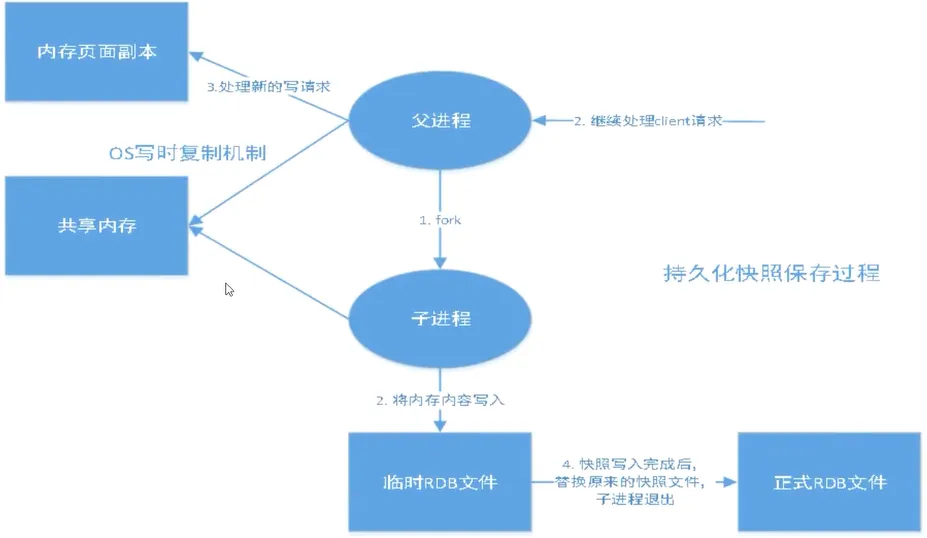
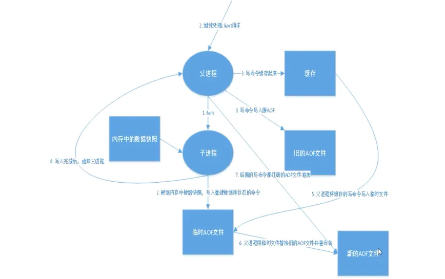
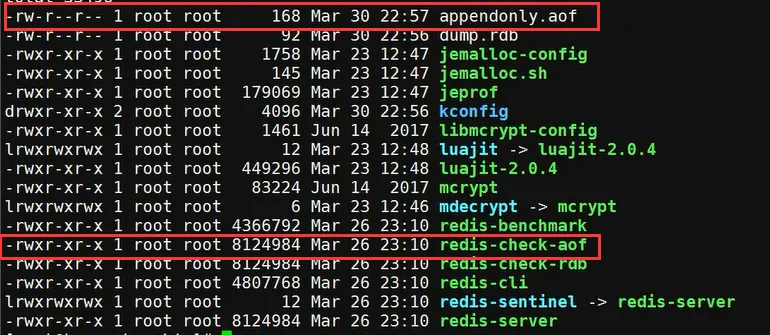
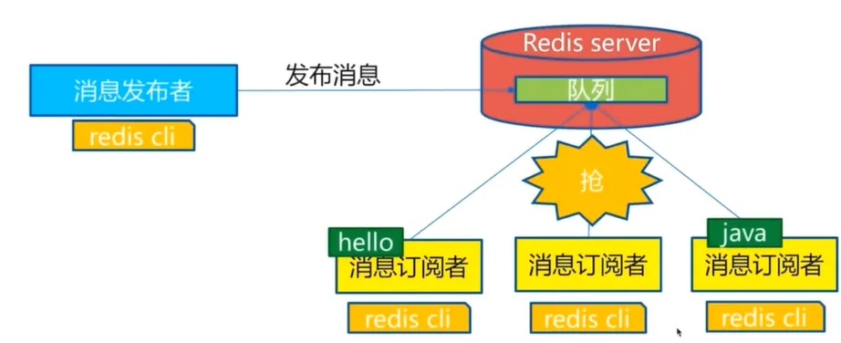
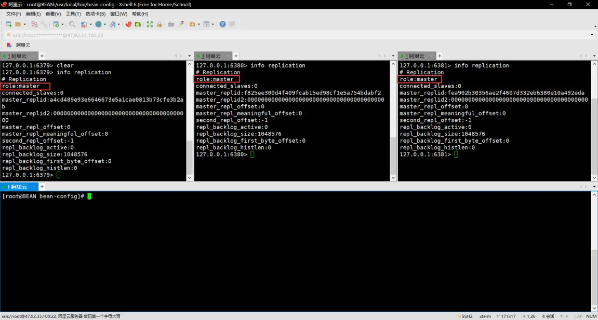
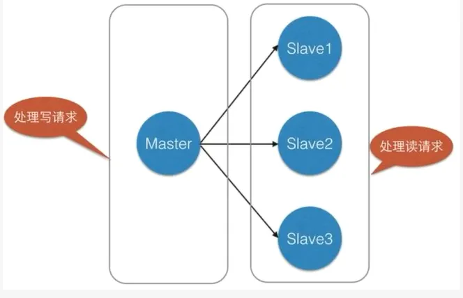
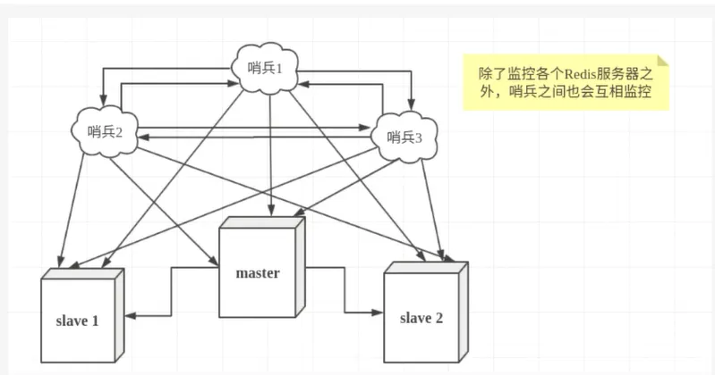
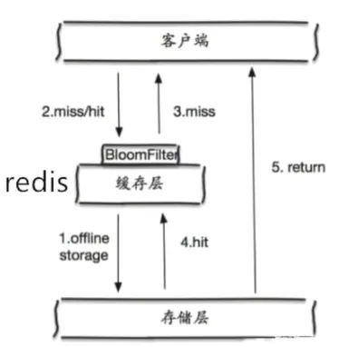
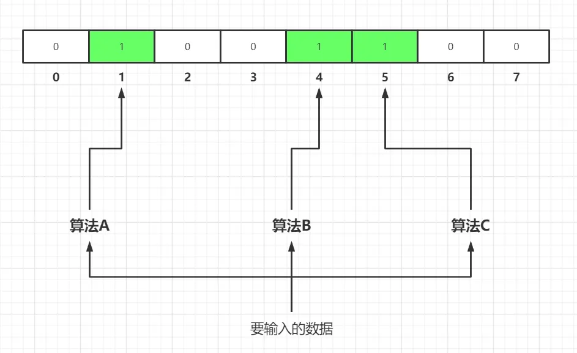
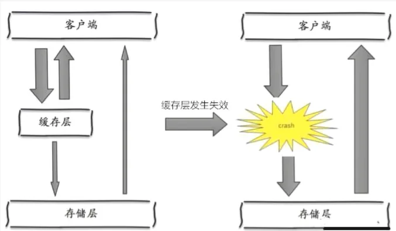

## Redis.config详解


```bash
## Redis configuration file example.
##
## Note that in order to read the configuration file, Redis must be
## started with the file path as first argument: 为了读取配置文件，必须以文件路径作为第一个参数启动Redis

## redis-server /path/to/redis.conf，这是举一个例子，使用redis-server 配置文件


## units are case insensitive so 1GB 1Gb 1gB are all the same.单位不区分大小写，因此1GB 1Gb 1gB都相同。


######################################### INCLUDES 包含###########################################

## 通过Include，可以把多个配置文件组合成为一个配置文件
## include /path/to/local.conf
## include /path/to/other.conf

######################################### MODULES 模块 #############################################

## 启动的时候使用loadmodule加载模块，如果加载不了redis就会停止启动，可以加载多个模块
## loadmodule /path/to/my_module.so
## loadmodule /path/to/other_module.so

######################################### NETWORK 网络 #############################################

## 网络，这里绑定的是本机的地址，说明只能在本地访问
## 可以指定具体的ip地址让其他ip也可以访问，甚至指定一个 *
bind 127.0.0.1

## 受保护模式，开启就好
protected-mode yes

## 指定端口号，可以修改
port 6379


######################################## GENERAL 通用 #############################################

## 是否以是守护进程（后台）的方式开启，默认是no，我们改为yes
daemonize yes

## 守护进程管理，一般不用动
supervised no

## 如果以守护进程开启，我们就需要指定一个pid文件
pidfile /var/run/redis_6379.pid

## Specify the server verbosity level.
## This can be one of:
## debug (a lot of information, useful for development/testing)：一般测试和开发
## verbose (many rarely useful info, but not a mess like the debug level)：一般不去看
## notice (moderately verbose, what you want in production probably)：生产环境适用
## warning (only very important / critical messages are logged)：关键信息才会打印
## 日志级别，就是上面：debug，verbose，notice，warning
loglevel notice

## Specify the log file name. Also the empty string can be used to force
## Redis to log on the standard output. Note that if you use standard
## output for logging but daemonize, logs will be sent to /dev/null
## 生成的日志位置文件名
logfile ""

## 数据库的数量，默认16个
databases 16

## 是否显示logo
always-show-logo yes

####################################### SNAPSHOTTING 快照 #######################################

## 快照，持久化的时候使用，因为redis是内存数据库，如果没有持久化，断电即失
## 在规定的时间内执行了多少次操作会执行持久化到 .rdb，.aof文件

## 900秒至少有1个key进行了修改
save 900 1
## 300秒至少有10个key进行了修改
save 300 10
## 60秒至少有10000个key进行了修改
save 60 10000

## 持久化出错了是否还要继续工作
stop-writes-on-bgsave-error yes

## 是否压缩rdb文件，需要消耗cpu资源
rdbcompression yes

## 默认文件名字
dbfilename dump.rdb

## 保存rdb文件的时候是否校验
rdbchecksum yes

## rdb文件的保存目录
dir ./

######################################## REPLICATION 复制，主从复制 ########################################

######################################### SECURITY 安全 ###########################################
## requirepass：设置密码，默认是没有密码的，但是现在我要设置一个密码123456
requirepass 123456
## 这是通过配置文件来设置，更多我们使用命令来设置: config set requirepass 123456，然后登陆：auth 123456
########################################### CLIENTS 限制 ############################################

## 最大客户端的数量
## maxclients 10000
#################################### MEMORY MANAGEMENT 内存 #######################################

## Redis配置的最大内存
## maxmemory <bytes>

## 内存达到上限的处理策略：
    ## 移除一些过期的key
    ## 报错
    ## ...
## maxmemory-policy noeviction

#################################### APPEND ONLY MODE AOF配置 ######################################
## 默认不开启AOF，使用RDB持久化
appendonly no

## 持久化的文件名字
appendfilename "appendonly.aof"

## appendfsync always    ## 每次修改都会同步
## appendfsync no        ## 不会同步，操作系统自己同步数据，最快的
appendfsync everysec    ## 每秒同步一次，非常快，但是有可能丢失这一秒的数据

## 重写的规则，是否使用appendfsync重写，默认是no，可以保证数据的安全性
no-appendfsync-on-rewrite no

## 重写的一些规则，重写的一个基本点是100，最大值为64M
auto-aof-rewrite-percentage 100
auto-aof-rewrite-min-size 64mb
```

> 工作中，一些小小的配置就可以让给你脱颖而出
>

---

## Redis持久化


Redis是内存数据库，如果不保存到内存中，就会断电即失


### RDB（Redis DataBase）


> 在指定的时间间隔内将内存中的数据集快照写入磁盘，也就是行话里说的Snapshot快照
>


> 恢复时将快照直接读取到内存中
>


> Redis会单独创建出一个fork子进程来进行持久化。
>
> 会先将数据写入到一个临时文件中，待持久化过程都结束了，再用这个临时文件替换上次持久化的文件。
>
> 整个过程中，主进程是不进行任何IO操作的，这就确保了极高的性能。
>


> 如果需要大规模的数据恢复，且对于数据行的完整性不是非常敏感，那么RDB方式要比AOF的更加高效。
>
> RDB的缺点是最后一次持久化的数据有可能会丢失。
>


> 一般情况下就是RDB，因为RDB比AOF更加高效
>


> rdb保存的文件是dump.rdb
>


```bash
####################################### SNAPSHOTTING 快照 #######################################

## 快照，持久化的时候使用，因为redis是内存数据库，如果没有持久化，断电即失
## 在规定的时间内执行了多少次操作会执行持久化到 .rdb，.aof文件

## 900秒至少有1个key进行了修改
save 900 1
## 300秒至少有10个key进行了修改
save 300 10
## 60秒至少有10000个key进行了修改
save 60 10000

## 持久化出错了是否还要继续工作
stop-writes-on-bgsave-error yes

## 是否压缩rdb文件，需要消耗cpu资源
rdbcompression yes

## 默认文件名字
dbfilename dump.rdb

## 保存rdb文件的时候是否校验
rdbchecksum yes

## rdb文件的保存目录
dir ./
```


> RDB的触发规则：生成一个rdb文件
>


1. save规则满足情况下
2. `flushall`命令执行之后
3. 退出redis的时候


> 恢复rbd文件：只需要将rdb文件放到redis启动目录下即可，redis在进行配置文件启动的时候会自动检测rdb文件
>


```bash
127.0.0.1:6379> config get dir
1) "dir"
2) "/usr/local/bin/bean-config"
```


> 只要在`"/usr/local/bin/bean-config"`下存在rdb文件，那么就会自动读取
>




优点：


1. 适合大规模的数据恢复
2. 对于数据完整性的要求不高


缺点


1. 需要一定的时间间隔,如果Redis意外宕机了，最后一次的保存就没了
2. 需要一定的CPU资源


### AOF（Append Only File）


> 将我们的所有命令都记录下来，恢复的时候重新执行一次命令
>


AOF保存的是`appendonly.aof`文件


```bash
#################################### APPEND ONLY MODE AOF配置 ######################################
## 默认不开启AOF，使用RDB持久化
appendonly no

## 持久化的文件名字
appendfilename "appendonly.aof"

## appendfsync always    ## 每次修改都会同步
## appendfsync no        ## 不会同步，操作系统自己同步数据，最快的
appendfsync everysec    ## 每秒同步一次，非常快，但是有可能丢失这一秒的数据

## 重写的规则，是否使用appendfsync重写，默认是no，可以保证数据的安全性
no-appendfsync-on-rewrite no

## 重写的一些规则，重写的一个基本点是100，最大值为64M
auto-aof-rewrite-percentage 100
auto-aof-rewrite-min-size 64mb
```


> 默认是不开启的，要开启将`appendonly no`设置为yes，然后重启Redis
>





> 我们的所有命令都在`appendonly.aof`下，假如文件出错，那么Redis启动不起来
>


> 那么我们使用`redis-check-aof`进行修复，使用`reids-check-aof fix appendonly.aof`
>
> 
>


优点：


1、默认每秒修改都同步，可能会丢失最后一秒的数据


2、每次修改都同步，文件的完整性会更好


3、从不同步，效率最高


缺点：


1、相对于数据文件来说，RDB远远小于AOF，修复的速度也比RDB慢


2、AOF的IO操作决定了运行效率也要比RDB慢


> 所以默认是RDB
>


> 重写规则：
>

```bash
## 重写的一些规则，重写的一个基本点是100，最大值为64M
auto-aof-rewrite-percentage 100
auto-aof-rewrite-min-size 64mb
```

> 如果AOF文件大于64M，会有一个新的进程来将文件进行重写
>

---

### Redis 4.0对持久化机制的优化


首先假如开启AOF，那么优先读取AOF，假如没有开启AOF，会优先读取RDB


Redis 4.0 开始支持 RDB 和 AOF 的混合持久化（默认关闭，可以通过配置项 `aof-use-rdb-preamble` 开启）。


如果把混合持久化打开，AOF 重写的时候就直接把 RDB 的内容写到 AOF 文件开头。


这样做的好处是可以结合 RDB 和 AOF 的优点, 快速加载同时避免丢失过多的数据。


当然缺点也是有的， AOF 里面的 RDB 部分是压缩格式不再是 AOF 格式，可读性较差。


> AOF重写可以产生一个新的AOF文件，这个新的AOF文件和原有的AOF文件所保存的数据库状态一样，但体积更小。
>
> AOF重写是一个有歧义的名字，该功能是通过读取数据库中的键值对来实现的，程序无须对现有AOF文件进行任伺读入、分析或者写入操作。
>
> 在执行 BGREWRITEAOF 命令时，Redis 服务器会维护一个 AOF 重写缓冲区，该缓冲区会在子进程创建新AOF文件期间，记录服务器执行的所有写命令。
>
> 当子进程完成创建新AOF文件的工作之后，服务器会将重写缓冲区中的所有内容追加到新AOF文件的末尾，使得新旧两个AOF文件所保存的数据库状态一致。
>
> 最后，服务器用新的AOF文件替换旧的AOF文件，以此来完成AOF文件重写操作
>


## Redis发布订阅


Redis发布订阅是一种消息通信模式，发送者（pub）发送信息，订阅者（sub）接收信息


Redis客户端可以订阅任意的数量的频道



---

+ `subscribe 频道`：订阅一个或者多个频道
+ `publish 频道 消息`：发送消息
+ `punsubscribe 频道`：退订所有给定模式的频道


## Redis主从复制


### 起步


#### 概念


主从复制，指的是将一台Redis服务器的数据复制到其他的Redis服务器中，前者称为主节点(Master)，后者称为从节点(Slave)。


数据的复制是单向的，只能从主节点复制到从节点，Master以写为主，Slave以读为主。


默认情况下，每台Reid服务器都是主节点，而且一个主节点可以有多个从节点或者没有节点，但是一个从节点只能有一个主节点。


**主节点的复制作用包括**


+ 数据冗余：主从复制实现了数据的热备份，是持久化之外的一种数据冗余方式。
+ 故障恢复：当主节点出现问题时，可以有从节点提供服务，实现快速的故障恢复，实际上是一种服务的冗余
+ 负载均衡：在主从复制的基础上，配合读写分离，可以由主节点提供写服务，从节点提供读服务，分担服务器负载，通过多个从节点分担读负载，可以大大提高Redis服务器的并发量
+ 高可用基石：除了上述作用之外，主从复制还是哨兵和集群能够实施的基础，所以说主从复制是Redis高可用的基础


一般来说，要想将Redis运用在工程项目中，只是使用一台Redis是远远不够的，原因如下：


1、从结构上，一台Redis服务器会发生单点故障，并且一台服务器需要处理所有的请求负载，压力较大


2、从容量上，单个Redis服务器内存容量有限，就算一台Redis服务器内存容量为256G，也不能将所有的内存用于Redis存储内存，一般来说，单台Redis最大使用内存应当不超过20G


电商网站上的商品，一般都是一次上传，无数次浏览的，也就是多读少写


#### 环境配置


> 只需要配置从库，而不用配置主库，因为Redis默认就是主库
>


1. 查看当前库的信息

```bash
127.0.0.1:6379> info replication							## 查看当前库的信息
## Replication
role:master													## 角色：master
connected_slaves:0											## 从机：0	
master_replid:c5e9e28bf54f700f466dd708fffce9045468fb14
master_replid2:0000000000000000000000000000000000000000
master_repl_offset:0
master_repl_meaningful_offset:0
second_repl_offset:-1
repl_backlog_active:0
repl_backlog_size:1048576
repl_backlog_first_byte_offset:0
repl_backlog_histlen:0
127.0.0.1:6379>
```

2. 新开三个窗口，现在一共有四台窗口，其中三台作为服务器（1主两从），一台用于测试
3. 复制配置文件，每个配置文件对应一个Redis服务器

```bash
[root@BEAN bean-config]## cp redis.conf redis79.conf
[root@BEAN bean-config]## cp redis.conf redis80.conf
[root@BEAN bean-config]## cp redis.conf redis81.conf
[root@BEAN bean-config]## clear
[root@BEAN bean-config]## ls
dump.rdb  redis79.conf  redis80.conf  redis81.conf  redis.conf
```

4. 分别修改配置文件，这里举一个例子：

```bash
daemonize yes					## 后台启动
port 6379						## 端口号
pidfile /var/run/redis_6379.pid		## pid文件指定
logfile "6379.log"					## 日志名字
dbfilename dump6379.rdb				## RDB文件名字
```

5. 分别根据79，80，81三个配置文件启动Redis服务器  


#### 一主二从集群搭建


默认情况下，每一台服务器都是主节点



配置从机，认老大，让79成为主机，80和81成为从机


```bash
127.0.0.1:6380> slaveof localhost 6379
```


> 认老大，当前主机下的6379
>


---

真实的主从配置应该是从配置文件中修改的，这样的配置是永久的，我们通过命令行配置是暂时的


```bash
######################################## REPLICATION ########################################

## replicaof 主机ip 主机端口号
## replicaof <masterip> <masterport>

## 主机如果有密码，配置上主机的密码
## masterauth <master-password>
```

---

#### 细节



> 从机不能写，只能读。
>
> 
>


> 主机中的所有数据都会被从机保存
>
> 
>


> 主机宕机之后：
>
> 1、从机不会丢失主机，仍然可以读取
>
> 2、从机不会改变，这是说从机中不会选中一个从机变为新的主机，也就是说在主机宕机期间只能读不能写
>
> 3、当主机再次上线之后，一切照旧
>


> 当从机宕机之后：
>
> 1、主机和另外的从机没有影响
>
> 2、如果使用命令行配置的从机，在重新启动之后不会成为从机
>
> 3、如果使用配置文件配置的从机，在重新启动之后还是从机
>
> 4、从机宕机然后上线之后，如果是从机，那么会立刻同步主机的数据到从机，不用担心从机在宕机期间的数据丢失
>


> 当新增一个新的从机之后：主机会立刻同步所有的数据到从机
>


> 复制原理：
>
> + 全量复制：将所有数据同步过去
> + 增量复制：同步变化的数据
>
> 从机启动成功，连接到主机的时候发送一个同步请求。
>
> 主机接受到请求，启动后台的存盘进程，同时收集所有接收到的用于修改数据集的命令
>
> 在后台进程执行完毕之后，主机将传送整个数据文件到从机，并完成一次完全同步
>
> 只要是重新连接到主机，就会执行一次全量复制
>

---

### 宕机后手动配置主机


如果主机断开了连接，我们可以使用`slaveof no one`来手动指定一个新的从机来当主机，但是那么就会出现一个问题：


问题是两个从机连接的都是主机，即使主机A崩了，另一个成为了主机B，另一个从机连接的也是主机A


所以我们连接的时候就要注意一下


以前我们是这样的：


要是用上面的模式，我们就要这样：


就是这样的：


那么我们再重复一下主机宕机，6380顶上的情况：


> 这个时候，真正的主节点回来之后，也没有用，主节点已经换了
>

---

### 哨兵（Sentinel）


#### 概述


自动选取老大


> 首先，Redis提供了哨兵的命令，但是哨兵是一个独立的进程，所以还要开另一个进程。
>
> 作为进程，它会独立运行。
>
> 其原理是通过哨兵发送命令，等待Redis服务器响应，从而监控运行的多个Redis实例
>


但是有时候哨兵死了就又出问题了，所以一般我们会给哨兵也配置一个集群



> 所以一旦配置哨兵模式，起步就是两个集群，六个进程
>


假设哨兵1检测到了master不可用，不会立刻进行选举，可能是因为是哨兵1主观认为不可用，这称为**主观下线**


然后会通知哨兵2和哨兵3，由他们检测结果，假如后面的检测到了不可用，并且数量达到了一定程度，哨兵就会进行一次投票，结果有一个哨兵发起，进行failover（故障转移）。


切换成功后，通过发布订阅模式，切换监控的服务器，这个过程为**客观下线**

---

#### 使用


必须使用一主二从的配置方式，不能使用链路的配置方式


1. 编写配置文件：（必须是这个名字）

```bash
[root@BEAN bean-config]## vim sentinel.conf	## 必须叫sentinel.conf
```

```bash
sentinel monitor myredis 127.0.0.1 6379 1 ## vim的文件
```

> + `sentinel monitor`：设置哨兵监视
> + `myredis`：随便取个名字
> + `127.0.0.1 6379`：监视的ip-端口号
> + `1`：主机挂掉之后投票
>
> 哨兵的配置有很多，但是这个是最核心，也是最基本的配置
>

2. 启动哨兵


```bash
[root@BEAN bean-config]## redis-sentinel sentinel.conf 		## 启动哨兵
32034:X 28 May 2020 17:01:06.042 ## oO0OoO0OoO0Oo Redis is starting oO0OoO0OoO0Oo
32034:X 28 May 2020 17:01:06.042 ## Redis version=6.0.3, bits=64, commit=00000000, modified=0, pid=32034, just started
32034:X 28 May 2020 17:01:06.042 ## Configuration loaded
                _._                                                  
           _.-``__ ''-._                                             
      _.-``    `.  `_.  ''-._           Redis 6.0.3 (00000000/0) 64 bit
  .-`` .-```.  ```\/    _.,_ ''-._                                   
 (    '      ,       .-`  | `,    )     Running in sentinel mode
 |`-._`-...-` __...-.``-._|'` _.-'|     Port: 26379
 |    `-._   `._    /     _.-'    |     PID: 32034
  `-._    `-._  `-./  _.-'    _.-'                                   
 |`-._`-._    `-.__.-'    _.-'_.-'|                                  
 |    `-._`-._        _.-'_.-'    |           http://redis.io        
  `-._    `-._`-.__.-'_.-'    _.-'                                   
 |`-._`-._    `-.__.-'    _.-'_.-'|                                  
 |    `-._`-._        _.-'_.-'    |                                  
  `-._    `-._`-.__.-'_.-'    _.-'                                   
      `-._    `-.__.-'    _.-'                                       
          `-._        _.-'                                           
              `-.__.-'                                               

32034:X 28 May 2020 17:01:06.043 ## WARNING: The TCP backlog setting of 511 cannot be enforced because /proc/sys/net/core/somaxconn is set to the lower value of 128.
32034:X 28 May 2020 17:01:06.044 ## Sentinel ID is 2e459e8f59c3188bf3c4bfe10d0d3c3733c1bd86
32034:X 28 May 2020 17:01:06.044 ## +monitor master myredis 127.0.0.1 6379 quorum 1
## 监视到了两个从机
32034:X 28 May 2020 17:01:06.044 * +slave slave 127.0.0.1:6380 127.0.0.1 6380 @ myredis 127.0.0.1 6379
32034:X 28 May 2020 17:01:06.047 * +slave slave 127.0.0.1:6381 127.0.0.1 6381 @ myredis 127.0.0.1 6379
```


3. 关闭主机  

  

4. 查看哨兵  

  

5. 查看从机  

  

6. 旧主机再重新上线  
  

  

---

#### 哨兵模式的优缺点


优点


1、哨兵集群，基于主从复制模式，所有的主从配置优点全有


2、主从可以切换，故障可以转移，系统的可用性就会更好


3、哨兵模式就是主从模式的升级，手动到自动更加健壮


缺点


1、Redis不好在线扩容，集群容量一旦达到上限，在线扩容就十分麻烦


2、实现哨兵模式的配置十分麻烦，里面有很多选择


#### 哨兵的全部配置


```bash
## Example sentinel.conf

## 哨兵sentinel实例运行的端口 默认26379
port 26379

## 哨兵sentinel的工作目录
dir /tmp

## 哨兵sentinel监控的redis主节点的 ip port
## master-name 可以自己命名的主节点名字 只能由字母A-z、数字0-9 、这三个字符".-_"组成。
## quorum 配置多少个sentinel哨兵统一认为master主节点失联 那么这时客观上认为主节点失联了
## sentinel monitor <master-name> <ip> <redis-port> <quorum>
sentinel monitor mymaster 127.0.0.1 6379 2

## 当在Redis实例中开启了requirepass foobared 授权密码 这样所有连接Redis实例的客户端都要提供密码
## 设置哨兵sentinel 连接主从的密码 注意必须为主从设置一样的验证密码
## sentinel auth-pass <master-name> <password>
sentinel auth-pass mymaster MySUPER--secret-0123passw0rd

## 指定多少毫秒之后 主节点没有应答哨兵sentinel 此时 哨兵主观上认为主节点下线 默认30秒
## sentinel down-after-milliseconds <master-name> <milliseconds>
sentinel down-after-milliseconds mymaster 30000

## 这个配置项指定了在发生failover主备切换时最多可以有多少个slave同时对新的master进行同步
## 这个数字越小，完成failover所需的时间就越长
## 但是如果这个数字越大，就意味着越多的slave因为replication而不可用。
## 可以通过将这个值设为 1 来保证每次只有一个slave 处于不能处理命令请求的状态。
## sentinel parallel-syncs <master-name> <numslaves>
sentinel parallel-syncs mymaster 1

## 故障转移的超时时间 failover-timeout 可以用在以下这些方面：
##1. 同一个sentinel对同一个master两次failover之间的间隔时间。
##2. 当一个slave从一个错误的master那里同步数据开始计算时间。直到slave被纠正为向正确的master那里同步数据时。
##3.当想要取消一个正在进行的failover所需要的时间。
##4.当进行failover时，配置所有slaves指向新的master所需的最大时间。
## 不过，即使过了这个超时，slaves依然会被正确配置为指向master，但是就不按parallel-syncs所配置的规则来了
## 默认三分钟
## sentinel failover-timeout <master-name> <milliseconds>
sentinel failover-timeout mymaster 180000

## SCRIPTS EXECUTION
##配置当某一事件发生时所需要执行的脚本，可以通过脚本来通知管理员，例如当系统运行不正常时发邮件通知相关人员。
##对于脚本的运行结果有以下规则：
##若脚本执行后返回1，那么该脚本稍后将会被再次执行，重复次数目前默认为10
##若脚本执行后返回2，或者比2更高的一个返回值，脚本将不会重复执行。
##如果脚本在执行过程中由于收到系统中断信号被终止了，则同返回值为1时的行为相同。
##一个脚本的最大执行时间为60s，如果超过这个时间，脚本将会被一个SIGKILL信号终止，之后重新执行。

##通知型脚本:当sentinel有任何警告级别的事件发生时（比如说redis实例的主观失效和客观失效等等），将会去调用这个脚本
## 这时这个脚本应该通过邮件，SMS等方式去通知系统管理员关于系统不正常运行的信息。
## 调用该脚本时，将传给脚本两个参数，一个是事件的类型，一个是事件的描述。
## 如果sentinel.conf配置文件中配置了这个脚本路径，那么必须保证这个脚本存在于这个路径，并且是可执行的，否则sentinel无法正常启动成功。
##通知脚本
## shell编程
## sentinel notification-script <master-name> <script-path>
sentinel notification-script mymaster /var/redis/notify.sh

## 客户端重新配置主节点参数脚本
## 当一个master由于failover而发生改变时，这个脚本将会被调用，通知相关的客户端关于master地址已经发生改变的信息。
## 以下参数将会在调用脚本时传给脚本:
## <master-name> <role> <state> <from-ip> <from-port> <to-ip> <to-port>
## 目前<state>总是“failover”,
## <role>是“leader”或者“observer”中的一个。
## 参数 from-ip, from-port, to-ip, to-port是用来和旧的master和新的master(即旧的slave)通信的
## 这个脚本应该是通用的，能被多次调用，不是针对性的。
## sentinel client-reconfig-script <master-name> <script-path>
sentinel client-reconfig-script mymaster /var/redis/reconfig.sh ## 一般都是由运维来配置！
```

---

## Redis淘汰策略


假如Redis长期使用，那么必然会造成内存瓶颈，那么这个时候Redis内存超过物理内存的限制的时候，内存的数据就会频繁和磁盘产生交换，使Redis性能急速下降，此时就需要淘汰无用策略来进行空间的释放


Redis在生产环境中，采用配置参数`maxmemory` 的方式来限制内存大小


当实际存储内存超出maxmemory 参数值时，开发者们可以通过这几种方法——Redis内存淘汰策略，来决定如何腾出新空间继续支持读写工作


1、volatile-lru：从设置过期时间的数据集中挑选出最近最少使用的数据进行淘汰


2、volatile-lru：从设置过期时间的数据集中挑选出将要过期的数据淘汰


3、volatile-random：从设置过期时间的数据集中随机挑选进行淘汰


4、allkeys-lru：挑选最少使用的数据淘汰，面向全体key，而不仅仅是设置过期的Key


5、allkeys-random：所有key中随机挑选淘汰


6、no-enviction：当内存不足以容纳新入数据时，新写入操作就会报错，请求可以继续进行，线上任务也不能持续进行，采用no-enviction策略可以保证数据不被丢失，这也是系统默认的一种淘汰策略

---

## Redis缓存穿透，缓存击穿和缓存雪崩


### 缓存穿透（查不到）


缓存穿透很简单，假如用户想要查询一个信息，是先通过缓存去查看，假如缓存没有，才去数据库查看。


假设这个时候，缓存和数据库都没有，那么会一直向数据库查询信息。这就是缓存穿透


假如有大量的这种请求，去攻击你的服务器，那么服务器肯定撑不住。


> 解决方案
>


**缓存空对象**


不使用过滤器的话，那么假如有用户查询这个数据，直接在缓存中添加一个空对象，那么从缓存中查询出来的就是空。


不过空对象太多的话，也会产生问题


**布隆过滤器**


布隆过滤器是一种数据结构，对所有可能查询的参数以hash形式存储，在控制层先进行校验，不符合则丢弃，从而避免了对底层存储系统的查询压力。




重点就说一下布隆过滤器是个什么东西，它的实现的思想是什么


一般来说我们要去判断一个数据是否在一个集合中存在，我们肯定要去做对比，但是我们知道，对于数组、链表、树、哈希表这些数据结构来说，在数据范围较低的范围内，我可能会去选择哈希表直接去定位


但是只要数据量增大，检索速度就会逐渐上升，那么Redis一般来讲肯定是存放大数据量的信息，并且是高频访问信息。在这种情况下我就算使用哈希表来做过滤，Redis本来能一秒读十一万，按照你这么一弄，效率直线下降。


那么我又不可能放着缓存穿透这种问题不去解决，并且给它一个空对象的方法不仅逼格很Low，而且非常不好。


我举个例子，比如现在我要查询Tom的年龄，数据库里现在没有，我返回一个null，但是下一秒在这个数据库上面又增加了Tom，在查询的时候仍然为null，可能你说，我可以在插入的时候去手动覆盖这个对象，这一点问题可以解决


但是下一个问题，我现在有一亿个请求，全都是请求数据库里面没有的数据，那么这样的结果造成的就是Redis里瞬间就会多出一亿个垃圾数据。


所以最好的办法还是去检索这个数据，又回到了刚才的问题：检索效率太低了怎么办？


那么现在有一个解决办法：布隆过滤器（Bloom Filter），是1970年布隆提出来的。


Bloom Filter其实是一种非常大的二进制向量和一些随机的映射函数的联合体，它是这么实现的：


比如这张图，现在有8个位置，他们的默认初始值全部都为0，这也就代表着我没有向这个数组中添加任何一个数据


现在我要添加一个数据，但是我首先要使用几个不同的算法来算出这个值应该对应着那几个索引下标




比如上图，我要输入的数据经过几个算法（一般来讲，我们使用哈希算法）来进行计算，最后得到的可能是下标为1、4、5这三个，那么我把它们的值置为1


然后类似这种操作，当我每次添加一个值的时候，都会经过这三个算法得到最后的下标，然后将下标对应的值置为1


在下面我要进行数据的查询，假如经过这三个算法得到的下标所对应的值有一个为0，那么这个值一定没有被添加过。


假如我要查询的数据得到的这三个下标所对应的值都为1，那么它可能被添加过


为什么说可能被添加过，而不是一定被添加过呢，这是因为我们的哈希算法得到的结果是有可能产生冲突的，只要数据量足够大，冲突足够大，那么我们的索引早晚有一天会对应好几个数据，所以说有可能添加过而不是一定添加过


那么在真实的例子中，我们肯定也不会去搞一个长度只为8的这样一个数据，哈希算法肯定也是要尽量避免冲突的，而且哈希算法可能还不是三个，有可能会更多或者更少


我们在Redis里面一般来讲就是选用bitmap作为布隆过滤器的存放地，因为它能存放的数据足够多，并且也足够小


所以说布隆过滤器虽然确实会有一定的缺陷，但是在我们BitMap和优秀的哈希算法的帮助下，它是很好的解决方案，已经远远拉开返回一种空对象这种方式


### 缓存击穿（查询太多）


缓存穿透和缓存击穿听起来很像，但是不是一回事。


缓存击穿是指一个key非常热点，不停地在扛着大并发，大并发集中对着一个点进行访问，当这个key在失效的瞬间，持续的大并发就会击破缓存，直接请求数据库。


在这个瞬间，因为缓存过期的原因，会同时访问数据库来请求最新的数据，并且回写缓存，会导致数据库压力瞬间过大甚至过载。


> 解决方案
>


**设置热点数据永不过期**


**加互斥锁**


使用分布式锁，保证对于每一个信息同时只有一个线程去查询后端服务，其他线程没有获取分布式锁的权限，因此只需要等待即可


这种方式将压力转移到了分布式锁，因此对分布式锁的考验十分大


### 缓存雪崩


缓存雪崩指的是在某一个时间段，缓存集中过期失效。


产生雪崩的原因之一：比如在写的时候，马上要到双十一，这时候商品比较集中地放入了缓存（假设一小时）


那么到了凌晨一点钟的时候，这批商品的缓存都过期了，而对于这波商品的访问查询全都落到了数据库上，对于数据库而言，就会产生周期性的压力波峰，于是所有的请求都会达到存储层，存储层的调用会暴增，造成存储层也会挂掉的情况。


产生雪崩的原因之二：假设Redis集群断电了，访问全都砸在了数据库上




产生雪崩的原因之三：假设内存不够了，没有合适的内存淘汰策略，不能够进行缓存，这个时候就不会进行缓存，当访问来的时候，就会全部砸到数据库上


> 解决方案
>


**Redis高可用**


多设几台Redis，一台挂掉之后还能用其他的顶上，其实就是搭建集群


（异地多活）


**服务降级**


SpringCloud的服务降级


**数据预热**


在正式的部署之前，先把可能的数据先预热一遍，这样部分可能大量访问的数据就会加载到缓存中。在即将发生大并发访问前手动触发加载缓存不同的key，设置不同的过期时间，尽量让缓存失效的时间点均匀。

