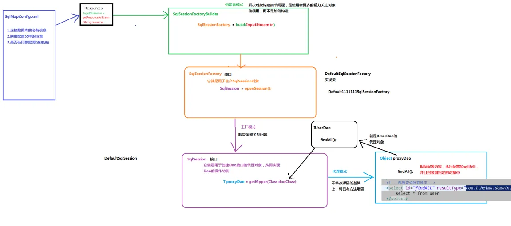
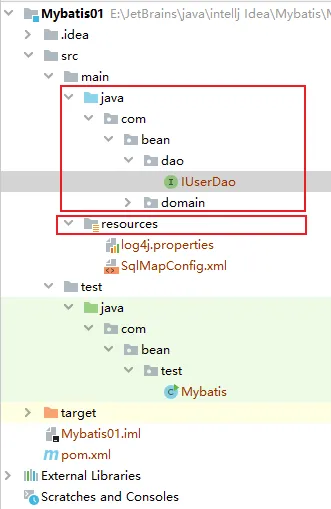
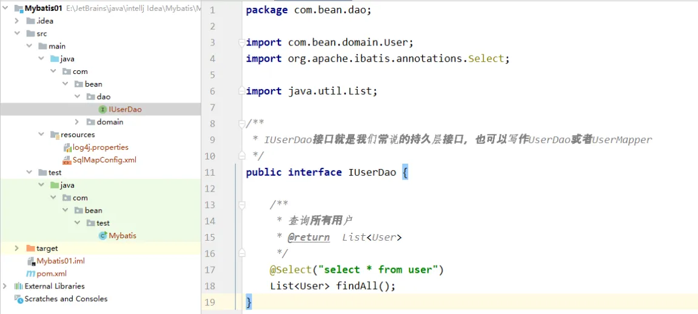
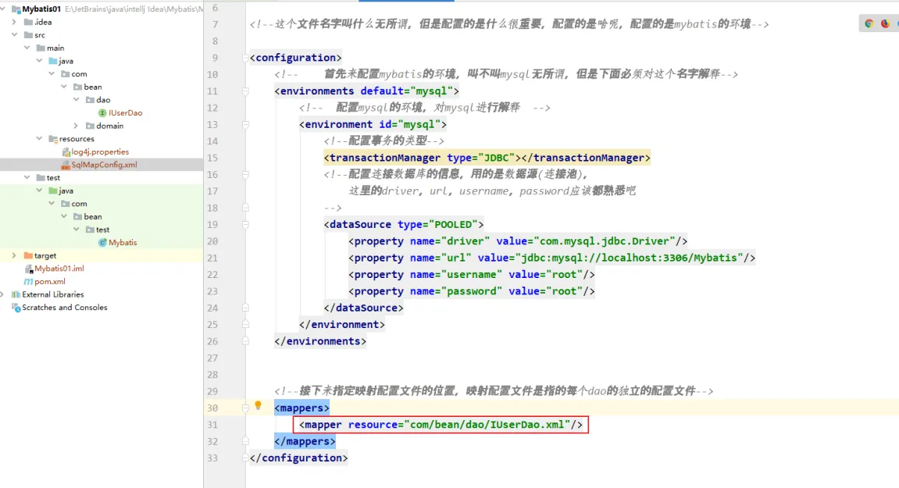
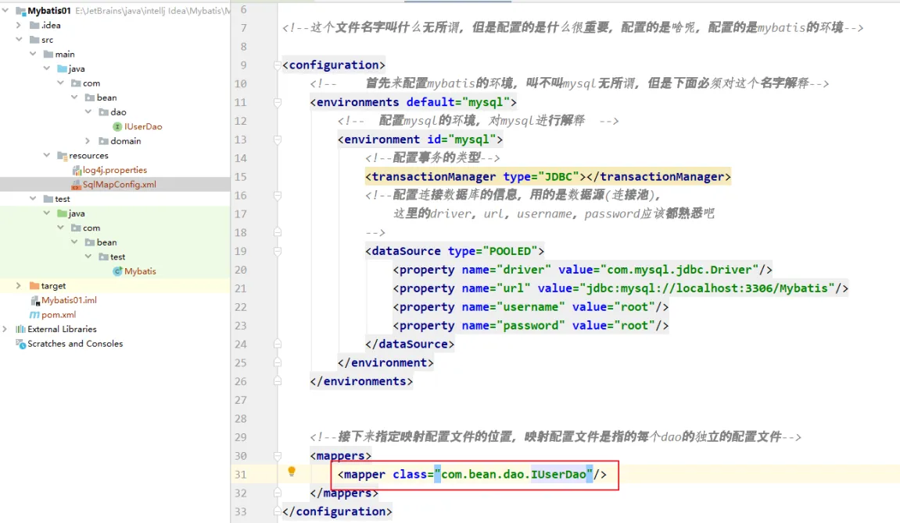
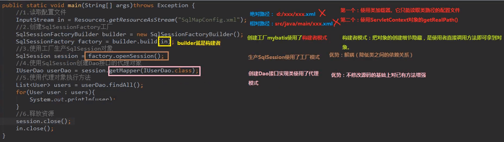
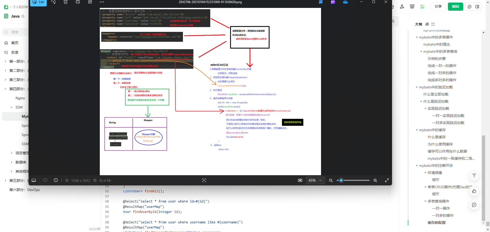

## Mybatis

### 入门

1. 首先往项目里拷一个文件：`log4j.properties`，先拷下来，其他的再说

    读取配置文件用到的技术就是解析xml的技术，这里用的就是log4j解析xml技术

    ```properties
    # Set root category priority to INFO and its only appender to CONSOLE.
    #log4j.rootCategory=INFO, CONSOLE            debug   info   warn error fatal
    log4j.rootCategory=debug, CONSOLE, LOGFILE

    # Set the enterprise logger category to FATAL and its only appender to CONSOLE.
    log4j.logger.org.apache.axis.enterprise=FATAL, CONSOLE

    # CONSOLE is set to be a ConsoleAppender using a PatternLayout.
    log4j.appender.CONSOLE=org.apache.log4j.ConsoleAppender
    log4j.appender.CONSOLE.layout=org.apache.log4j.PatternLayout
    log4j.appender.CONSOLE.layout.ConversionPattern=%d{ISO8601} %-6r [%15.15t] %-5p %30.30c %x - %m\n

    # LOGFILE is set to be a File appender using a PatternLayout.
    log4j.appender.LOGFILE=org.apache.log4j.FileAppender
    log4j.appender.LOGFILE.File=d:\axis.log
    log4j.appender.LOGFILE.Append=true
    log4j.appender.LOGFILE.layout=org.apache.log4j.PatternLayout
    log4j.appender.LOGFILE.layout.ConversionPattern=%d{ISO8601} %-6r [%15.15t] %-5p %30.30c %x - %m\n
    ```

2. 在Test中建立一个测试类，叫做`MybatisTest.class`

3. 走过流程

    因为我们要做的是不写实现类实现接口，所以先把流程走一遍

    ```java
    package com.bean.test;

    public class Mybatis {
        /**
        * 入门案例
        * @param args
        */
        public static void main(String[] args) {
            //1. 读取配置文件
            //2. 创建sqlSessionFactory工厂
            //3. 使用工厂生产SqlSession对象
            //4. 使用Sqlsession创建Dao接口的代理对象
            //5. 使用代理对象执行方法
            //6. 释放资源
        }
    }
    ```

4. 编写代码

    ```java
    package com.bean.test;

    import com.bean.dao.IUserDao;
    import com.bean.domain.User;
    import org.apache.ibatis.io.Resources;
    import org.apache.ibatis.session.SqlSession;
    import org.apache.ibatis.session.SqlSessionFactory;
    import org.apache.ibatis.session.SqlSessionFactoryBuilder;

    import java.io.IOException;
    import java.io.InputStream;
    import java.util.List;

    public class Mybatis {
        /**
        * 入门案例
        * @param args
        */
        public static void main(String[] args) throws IOException {
            //1. 读取配置文件，这里读取的文件就是刚才mybatis的配置文件
            InputStream in = Resources.getResourceAsStream("SqlMapConfig.xml");

            //2. 创建sqlSessionFactory工厂，这个东西是一个接口，所以我们找他的实现类
            SqlSessionFactoryBuilder builder = new SqlSessionFactoryBuilder();
            SqlSessionFactory factory = builder.build(in);

            //3. 使用工厂生产SqlSession对象
            SqlSession session = factory.openSession();

            //4. 使用Sqlsession创建Dao接口的代理对象
            IUserDao userDao = session.getMapper(IUserDao.class);

            //5. 使用代理对象执行方法
            List<User> users = userDao.findAll();
            for (User user : users) {
                System.out.println(user);
            }
            //6. 释放资源
            session.close();
            in.close();
        }
    }
    ```

    

### 使用注解代替持久层接口的映射文件


使用注解可以代替 `IUserDao.xml`，也就是环境搭建的第6步，替换IUserDao.xml

1. 把IUserDao.xml删掉

    

2. 在`IUserDao`接口中的语句中编写注解

    

3. 在`SqlMapConfig.xml`中更改`IUserDao.xml`的映射，由`resource`改为`class`

    

    


### Mybatis入门案例中的设计模式分析


```java
package com.bean.test;

import com.bean.dao.IUserDao;
import com.bean.domain.User;
import org.apache.ibatis.io.Resources;
import org.apache.ibatis.session.SqlSession;
import org.apache.ibatis.session.SqlSessionFactory;
import org.apache.ibatis.session.SqlSessionFactoryBuilder;

import java.io.IOException;
import java.io.InputStream;
import java.util.List;

public class Mybatis {
    /**
     * 入门案例
     * @param args
     */
    public static void main(String[] args) throws IOException {
        //1. 读取配置文件，这里读取的文件就是刚才mybatis的配置文件
        InputStream in = Resources.getResourceAsStream("SqlMapConfig.xml");

        //2. 创建sqlSessionFactory工厂，这个东西是一个接口，所以我们找他的实现类
        SqlSessionFactoryBuilder builder = new SqlSessionFactoryBuilder();
        SqlSessionFactory factory = builder.build(in);

        //3. 使用工厂生产SqlSession对象
        SqlSession session = factory.openSession();

        //4. 使用Sqlsession创建Dao接口的代理对象
        IUserDao userDao = session.getMapper(IUserDao.class);

        //5. 使用代理对象执行方法
        List<User> users = userDao.findAll();
        for (User user : users) {
            System.out.println(user);
        }
        //6. 释放资源
        session.close();
        in.close();
    }
}
```



