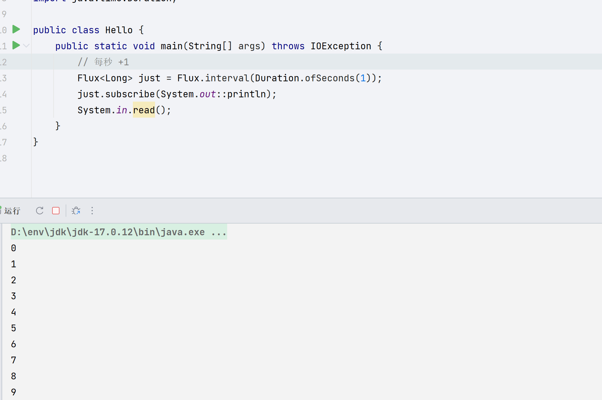

## 响应式编程

### 响应式编程介绍

响应式编程是一种关注于数据流（data streams）和变化传递（propagation of change）的异步编程方式

这意味着它可以用既有的编程语表达静态（如数组）或动态（如事件源）的数据流

现代应用需要应对大量的并发用户，而且即使现代硬件的处理能力飞速发展，软件性能仍然是关键因素

广义来说我们有两种思路来提升程序性能：

1. 并行化（parallelize）：使用更多的线程和硬件资源。[异步]
2. 基于现有的资源来提高执行效率

通常，Java开发者使用阻塞式（blocking）编写代码，但是这种使用资源的方式会迅速面临资源竞争和并发问题

第二种思路——提高执行效率——可以解决资源浪费问题，通过编写异步非阻塞的代码，执行过程会切换到另一个 使用同样底层资源 的活跃任务，然后等异步调用返回结果再去处理

- 回调（Callbacks） 

    异步方法没有返回值，而是采用一个 callback 作为参数（lambda 或匿名类），当结果出来后回调这个 callback
    
    常见的例子比如 Swings 的 EventListener

- Futures

    异步方法立即返回一个 Future<T>，该异步方法要返回结果的是 T 类型，通过 Future 封装
    
    这个结果并不是立刻可以拿到，而是等实际处理结束才可用
    
    比如，ExecutorService 执行 Callable<T> 任务时会返回 Future 对象

回调很难组合起来，因为很快就会导致代码难以理解和维护（即所谓的回调地狱（callback hell））

---

Reactor 是 Java 世界响应式编程的代表库之一，它基于 Reactive Streams 规范，提供强大且高效的响应式编程工具

Reactive Streams 是 Java 响应式编程的一项规范，定义了以下四个核心接口：

- Publisher：发布者，负责产生数据流。
- Subscriber：订阅者，负责消费数据流。
- Subscription：订阅，连接发布者和订阅者，控制数据流的速率和背压。
- Processor：既是发布者，也是订阅者，用于数据流的中间处理。

Reactor 库正是基于 Reactive Streams 规范进行实现的，Reactor 是 Spring 团队开发的响应式库，核心提供两个基础的反应式类型：

- Mono：表示 0 或 1 个元素的异步处理。
- Flux：表示 0 到 N 个元素的异步处理。

它们都是响应式流的抽象，背后提供丰富的操作符（如 map、filter、flatMap 等），以声明式的方式处理流数据

### 导入依赖

```xml
<dependency>
    <groupId>io.projectreactor</groupId>
    <artifactId>reactor-core</artifactId>
</dependency>
```

### Mono 和 Flux 简单数据

#### Mono

Mono 代表一个异步的单值或空结果。它非常适合处理只需返回单个数据的异步操作，如数据库查询、网络请求等。

```java
Mono<String> mono = Mono.just("Hello, Reactor!");

// 订阅并处理数据
mono.subscribe(System.out::println);
```

- Mono.just(value)：创建包含单个数据的 Mono。
- Mono.empty()：创建一个不包含数据的 Mono。
- Mono.error(Throwable)：创建一个以错误结束的 Mono。
- Mono.delay(Duration)：延迟一段时间后发布信号。

#### Flux 

表示 0 到 N 个元素的异步流，适用于处理列表、流数据等场景。它可以从集合、流、范围等多种来源创建

```java
Flux<Integer> flux = Flux.just(1, 2, 3, 4, 5);

flux.subscribe(e -> System.out.printf("flux 1 -> %s%n", e));
flux.subscribe(e -> System.out.printf("flux 2 -> %s%n", e));
```

在上面的例子中，Flux.just 创建了一个包含 1 到 5 的 Flux 对象，subscribe 将依次输出这些元素（可以有多个消费者）。

- Flux.just(value1, value2, …)：创建包含多个数据的 Flux。
- Flux.fromIterable(Iterable)：从集合或其他可迭代的数据源创建 Flux。
- Flux.range(int start, int count)：创建一个包含一定范围整数的 Flux。
- Flux.interval(Duration)：创建一个按时间间隔发布信号的 Flux。




#### subscribe

