## Spring Cloud Alibaba 简介

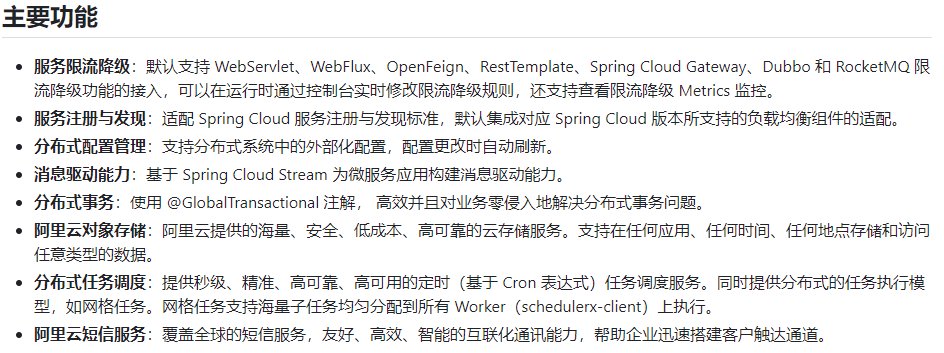

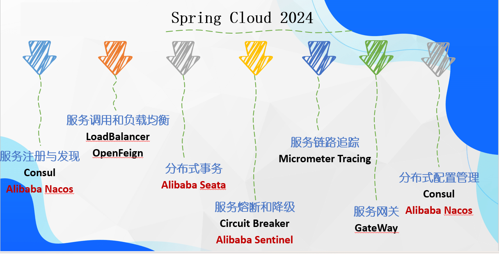

Spring Cloud Alibaba 的必须组件

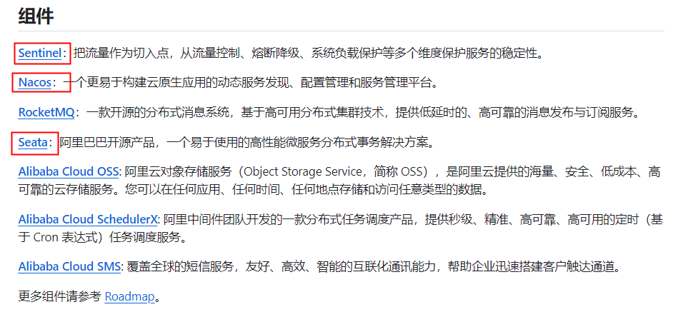


依赖关系建议


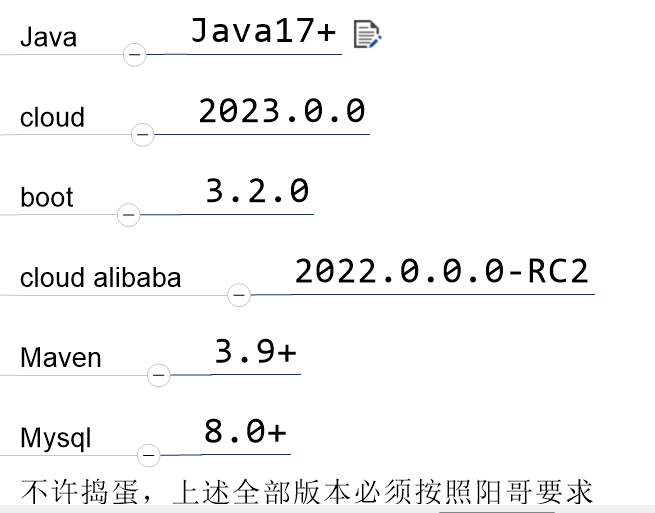

[版本对应关系](https://sca.aliyun.com/docs/2023/overview/version-explain/?spm=5176.29160081.0.0.74805c72o5g7al)

## 父工程

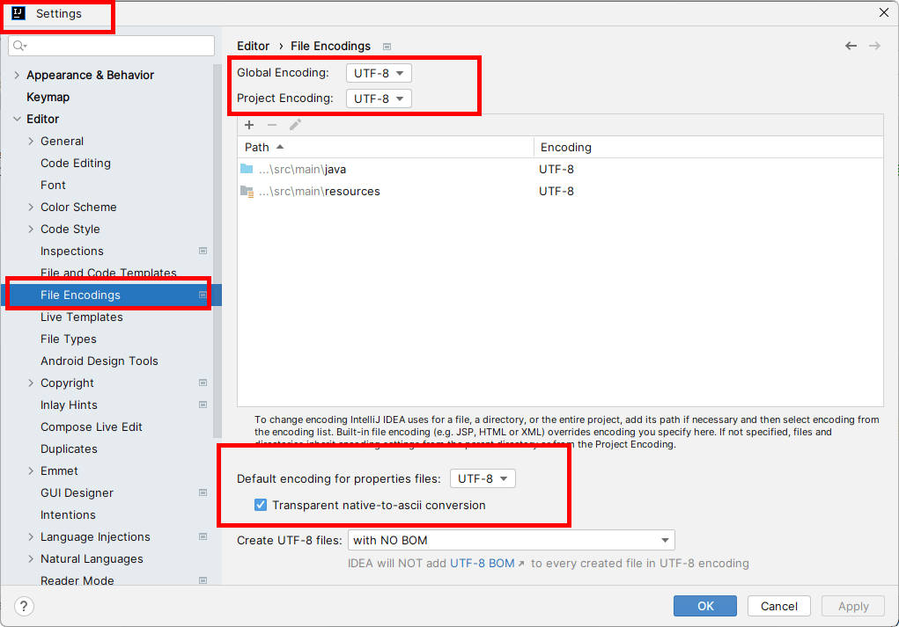

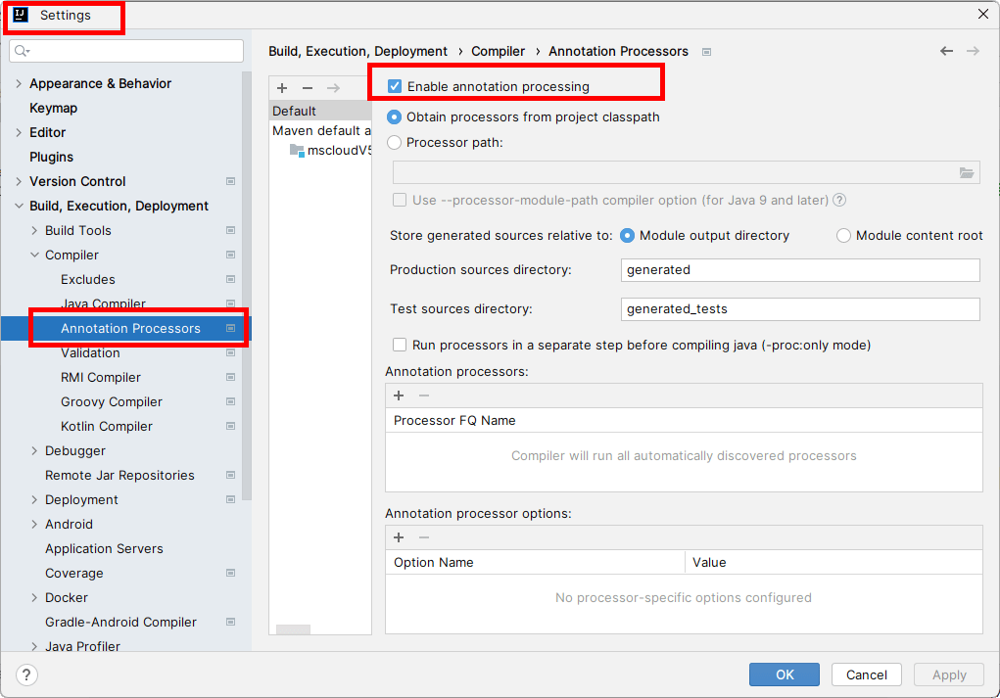


1. 依赖配置项

    <details>

    ```xml
    <packaging>pom</packaging>

    <properties>
        <maven.compiler.source>17</maven.compiler.source>
        <maven.compiler.target>17</maven.compiler.target>
        <project.build.sourceEncoding>UTF-8</project.build.sourceEncoding>
        <hutool.version>5.8.22</hutool.version>
        <lombok.version>1.18.26</lombok.version>
        <druid.version>1.1.20</druid.version>
        <mybatis.springboot.version>3.0.2</mybatis.springboot.version>
        <mysql.version>8.0.11</mysql.version>
        <swagger3.version>2.2.0</swagger3.version>
        <mapper.version>4.2.3</mapper.version>
        <fastjson2.version>2.0.40</fastjson2.version>
        <persistence-api.version>1.0.2</persistence-api.version>
        <spring.boot.test.version>3.1.5</spring.boot.test.version>
        <spring.boot.version>3.2.0</spring.boot.version>
        <spring.cloud.version>2023.0.0</spring.cloud.version>
        <spring.cloud.alibaba.version>2023.0.0.0-RC1</spring.cloud.alibaba.version>
    </properties>

    <dependencyManagement>
        <dependencies>
            <!--springboot 3.2.0-->
            <dependency>
                <groupId>org.springframework.boot</groupId>
                <artifactId>spring-boot-starter-parent</artifactId>
                <version>${spring.boot.version}</version>
                <type>pom</type>
                <scope>import</scope>
            </dependency>
            <!--springcloud 2023.0.0-->
            <dependency>
                <groupId>org.springframework.cloud</groupId>
                <artifactId>spring-cloud-dependencies</artifactId>
                <version>${spring.cloud.version}</version>
                <type>pom</type>
                <scope>import</scope>
            </dependency>
            <!--springcloud alibaba 2022.0.0.0-RC2-->
            <dependency>
                <groupId>com.alibaba.cloud</groupId>
                <artifactId>spring-cloud-alibaba-dependencies</artifactId>
                <version>${spring.cloud.alibaba.version}</version>
                <type>pom</type>
                <scope>import</scope>
            </dependency>
            <!--SpringBoot集成mybatis-->
            <dependency>
                <groupId>org.mybatis.spring.boot</groupId>
                <artifactId>mybatis-spring-boot-starter</artifactId>
                <version>${mybatis.springboot.version}</version>
            </dependency>
            <!--Mysql数据库驱动8 -->
            <dependency>
                <groupId>mysql</groupId>
                <artifactId>mysql-connector-java</artifactId>
                <version>${mysql.version}</version>
            </dependency>
            <!--SpringBoot集成druid连接池-->
            <dependency>
                <groupId>com.alibaba</groupId>
                <artifactId>druid-spring-boot-starter</artifactId>
                <version>${druid.version}</version>
            </dependency>
            <!--通用Mapper4之tk.mybatis-->
            <dependency>
                <groupId>tk.mybatis</groupId>
                <artifactId>mapper</artifactId>
                <version>${mapper.version}</version>
            </dependency>
            <!--persistence-->
            <dependency>
                <groupId>javax.persistence</groupId>
                <artifactId>persistence-api</artifactId>
                <version>${persistence-api.version}</version>
            </dependency>
            <!-- fastjson2 -->
            <dependency>
                <groupId>com.alibaba.fastjson2</groupId>
                <artifactId>fastjson2</artifactId>
                <version>${fastjson2.version}</version>
            </dependency>
            <!-- swagger3 调用方式 http://你的主机IP地址:5555/swagger-ui/index.html -->
            <dependency>
                <groupId>org.springdoc</groupId>
                <artifactId>springdoc-openapi-starter-webmvc-ui</artifactId>
                <version>${swagger3.version}</version>
            </dependency>
            <!--hutool-->
            <dependency>
                <groupId>cn.hutool</groupId>
                <artifactId>hutool-all</artifactId>
                <version>${hutool.version}</version>
            </dependency>
            <!--lombok-->
            <dependency>
                <groupId>org.projectlombok</groupId>
                <artifactId>lombok</artifactId>
                <version>${lombok.version}</version>
                <optional>true</optional>
            </dependency>
            <!-- spring-boot-starter-test -->
            <dependency>
                <groupId>org.springframework.boot</groupId>
                <artifactId>spring-boot-starter-test</artifactId>
                <version>${spring.boot.test.version}</version>
                <scope>test</scope>
            </dependency>
        </dependencies>
    </dependencyManagement>
    ```

    </details>

1. MySQL 驱动:

    - MySQL5

        ```properties
        # mysql5.7---JDBC四件套
        jdbc.driverClass = com.mysql.jdbc.Driver
        jdbc.url= jdbc:mysql://localhost:3306/db2024?useUnicode=true&characterEncoding=UTF-8&useSSL=false
        jdbc.user = root
        jdbc.password =123456
        ```

        ```
        <dependency>
            <groupId>mysql</groupId>
            <artifactId>mysql-connector-java</artifactId>
            <version>5.1.47</version>
        </dependency>
        ```

    - MySQL8

        ```properties
        jdbc.driverClass = com.mysql.cj.jdbc.Driver
        jdbc.url= jdbc:mysql://localhost:3306/db2024?characterEncoding=utf8&useSSL=false&serverTimezone=GMT%2B8&rewriteBatchedStatements=true&allowPublicKeyRetrieval=true
        jdbc.user = root
        jdbc.password =123456
        ```

        ```xml
        <dependency>
            <groupId>mysql</groupId>
            <artifactId>mysql-connector-java</artifactId>
            <version>8.0.11</version>
        </dependency>
        ```

1. 新建统一通用模块 `cloud-api-commons`

    <details>

    ```xml
    <dependencies>
        <!--SpringBoot通用依赖模块-->
        <dependency>
            <groupId>org.springframework.boot</groupId>
            <artifactId>spring-boot-starter-web</artifactId>
        </dependency>
        <dependency>
            <groupId>org.springframework.boot</groupId>
            <artifactId>spring-boot-starter-actuator</artifactId>
        </dependency>
        <dependency>
            <groupId>org.projectlombok</groupId>
            <artifactId>lombok</artifactId>
            <optional>true</optional>
        </dependency>
        <!--hutool-->
        <dependency>
            <groupId>cn.hutool</groupId>
            <artifactId>hutool-all</artifactId>
        </dependency>
    </dependencies>
    ```

    </details>

    统一新增 pojo 类 `resp.ReturnCodeEnum`、`resp.ResultData`

    ```java
    @Getter
    public enum ReturnCodeEnum
    {
        /**操作失败**/
        RC999("999","操作失败"),
        /**操作成功**/
        RC200("200","success"),
        /**服务降级**/
        RC201("201","服务开启降级保护,请稍后再试!"),
        /**热点参数限流**/
        RC202("202","热点参数限流,请稍后再试!"),
        /**系统规则不满足**/
        RC203("203","系统规则不满足要求,请稍后再试!"),
        /**授权规则不通过**/
        RC204("204","授权规则不通过,请稍后再试!"),
        /**access_denied**/
        RC403("403","无访问权限,请联系管理员授予权限"),
        /**access_denied**/
        RC401("401","匿名用户访问无权限资源时的异常"),
        RC404("404","404页面找不到的异常"),
        /**服务异常**/
        RC500("500","系统异常，请稍后重试"),
        RC375("375","数学运算异常，请稍后重试"),

        INVALID_TOKEN("2001","访问令牌不合法"),
        ACCESS_DENIED("2003","没有权限访问该资源"),
        CLIENT_AUTHENTICATION_FAILED("1001","客户端认证失败"),
        USERNAME_OR_PASSWORD_ERROR("1002","用户名或密码错误"),
        BUSINESS_ERROR("1004","业务逻辑异常"),
        UNSUPPORTED_GRANT_TYPE("1003", "不支持的认证模式");

        /**自定义状态码**/
        private final String code;
        /**自定义描述**/
        private final String message;

        ReturnCodeEnum(String code, String message){
            this.code = code;
            this.message = message;
        }


        public static ReturnCodeEnum getReturnCodeEnum(String code)
        {
            return Arrays.stream(ReturnCodeEnum.values()).filter(x -> x.getCode().equalsIgnoreCase(code)).findFirst().orElse(null);
        }
    }
    ```

    ```java
    @Data
    @Accessors(chain = true)
    public class ResultData<T> {

        private String code;/** 结果状态 ,具体状态码参见枚举类ReturnCodeEnum.java*/
        private String message;
        private T data;
        private long timestamp ;


        public ResultData (){
            this.timestamp = System.currentTimeMillis();
        }

        public static <T> ResultData<T> success(T data) {
            ResultData<T> resultData = new ResultData<>();
            resultData.setCode(ReturnCodeEnum.RC200.getCode());
            resultData.setMessage(ReturnCodeEnum.RC200.getMessage());
            resultData.setData(data);
            return resultData;
        }

        public static <T> ResultData<T> fail(String code, String message) {
            ResultData<T> resultData = new ResultData<>();
            resultData.setCode(code);
            resultData.setMessage(message);

            return resultData;
        }

    }
    ```

    maven 命令 clean && install，让其他模块可以引用

## Nacos

### Nacos 介绍

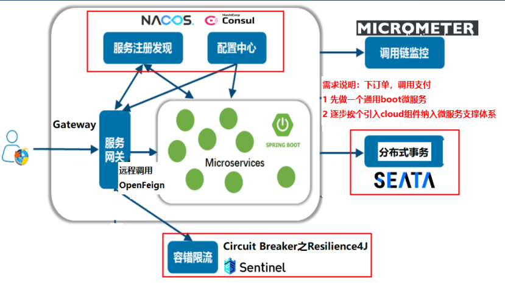

[Nacos](https://nacos.io/zh-cn/)（Dynamic Naming and Configuration Service），一个更易于构建云原生应用的动态服务发现、配置管理和服务管理平台

简单来说，Nacos 是注册中心 + 配置中心，等同于 Eureaka + Config + Bus，等同于 Spring Cloud Consul

可以替代 Eureka / Consul 作为服务注册中心，可以替代 Config + Bus 做服务配置中心和满足动态刷新广播通知

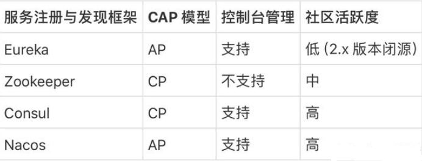

据说 Nacos 在阿里巴巴内部有超过 10 万的实例运行，已经过了类似双十一等各种大型流量的考验，Nacos 默认是 AP 模式，但也可以调整切换为 CP，我们一般用默认 AP 即可。

---

Nacos 首先需要本地 JDK17 + maven，之后进行下载，注意版本对应关系，

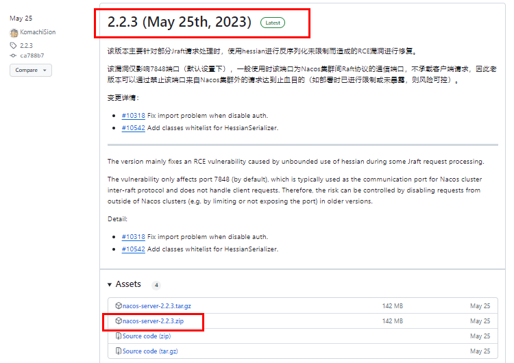

下载到本地之后，使用命令行 `startup.cmd -m standalone` 即可单机启动 nacos

之后访问本地 `localhost:8848/nacos` 默认地址，账户密码默认都是 `nacos`

关闭服务则使用命令行 `shutdown.cmd`

### Nacos Discovery 服务注册中心


#### Nacos 服务注册

1. 新建模块 `cloudalibaba-provider-payment9001`
1. 添加依赖项

    <details>

    ```xml
    <dependencies>
        <!--nacos-discovery-->
        <dependency>
            <groupId>com.alibaba.cloud</groupId>
            <artifactId>spring-cloud-starter-alibaba-nacos-discovery</artifactId>
        </dependency>
        <!-- 引入自己定义的api通用包 -->
        <dependency>
            <groupId>com.colirx</groupId>
            <artifactId>cloud-api-commons</artifactId>
            <version>1.0-SNAPSHOT</version>
        </dependency>
        <!--SpringBoot通用依赖模块-->
        <dependency>
            <groupId>org.springframework.boot</groupId>
            <artifactId>spring-boot-starter-web</artifactId>
        </dependency>
        <dependency>
            <groupId>org.springframework.boot</groupId>
            <artifactId>spring-boot-starter-actuator</artifactId>
        </dependency>
        <!--hutool-->
        <dependency>
            <groupId>cn.hutool</groupId>
            <artifactId>hutool-all</artifactId>
        </dependency>
        <!--lombok-->
        <dependency>
            <groupId>org.projectlombok</groupId>
            <artifactId>lombok</artifactId>
            <version>1.18.28</version>
            <scope>provided</scope>
        </dependency>
        <!--test-->
        <dependency>
            <groupId>org.springframework.boot</groupId>
            <artifactId>spring-boot-starter-test</artifactId>
            <scope>test</scope>
        </dependency>
    </dependencies>
    ```

    </details>

1. 添加配置

    ```yaml
    server:
        port: 9001

    spring:
        application:
            name: nacos-payment-provider
    cloud:
        nacos:
            discovery:
                #配置 Nacos 地址
                server-addr: localhost:8848
    ```

1. 添加主启动类

    ```java
    @SpringBootApplication
    @EnableDiscoveryClient
    public class Main9001
    {
        public static void main(String[] args)
        {
            SpringApplication.run(Main9001.class,args);
        }
    }
    ```

1. 业务类

    ```java
    @RestController
    public class PayAlibabaController
    {
        @Value("${server.port}")
        private String serverPort;

        @GetMapping(value = "/pay/nacos/{id}")
        public String getPayInfo(@PathVariable("id") Integer id)
        {
            return "nacos registry, serverPort: "+ serverPort+"\t id"+id;
        }
    }
    ```

1. 启动，查看 nacos 服务注册情况

 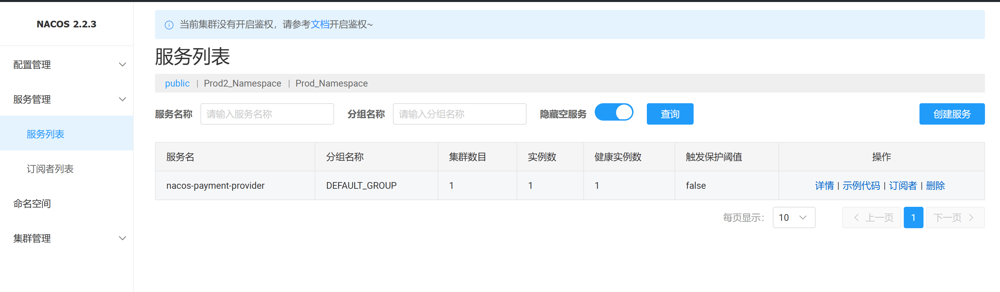

#### Nacos 服务消费

1. 新建模块 `cloudalibaba-consumer-nacos-order83`
1. 使用依赖

    ```xml
    <dependencies>
        <!--nacos-discovery-->
        <dependency>
            <groupId>com.alibaba.cloud</groupId>
            <artifactId>spring-cloud-starter-alibaba-nacos-discovery</artifactId>
        </dependency>
        <!--loadbalancer-->
        <dependency>
            <groupId>org.springframework.cloud</groupId>
            <artifactId>spring-cloud-starter-loadbalancer</artifactId>
        </dependency>
        <!--web + actuator-->
        <dependency>
            <groupId>org.springframework.boot</groupId>
            <artifactId>spring-boot-starter-web</artifactId>
        </dependency>
        <dependency>
            <groupId>org.springframework.boot</groupId>
            <artifactId>spring-boot-starter-actuator</artifactId>
        </dependency>
        <!--lombok-->
        <dependency>
            <groupId>org.projectlombok</groupId>
            <artifactId>lombok</artifactId>
            <optional>true</optional>
        </dependency>
    </dependencies>
    ```

1. 配置文件

    ```yaml
    server:
        port: 83

    spring:
        application:
            name: nacos-order-consumer
        cloud:
            nacos:
                discovery:
                    server-addr: localhost:8848
    #消费者将要去访问的微服务名称(nacos微服务提供者叫什么你写什么)
    service-url:
        nacos-user-service: http://nacos-payment-provider
    ```

1. 主启动类

    ```java
    @EnableDiscoveryClient
    @SpringBootApplication
    public class Main83
    {
        public static void main(String[] args)
        {
            SpringApplication.run(Main83.class,args);
        }
    }
    ```

1. 配置类

    ```java
    @Configuration
    public class RestTemplateConfig
    {
        @Bean
        //赋予RestTemplate负载均衡的能力
        @LoadBalanced
        public RestTemplate restTemplate()
        {
            return new RestTemplate();
        }
    }
    ```

1. controller

    ```java
    @RestController
    public class OrderNacosController
    {
        @Resource
        private RestTemplate restTemplate;

        @Value("${service-url.nacos-user-service}")
        private String serverURL;

        @GetMapping("/consumer/pay/nacos/{id}")
        public String paymentInfo(@PathVariable("id") Integer id)
        {
            String result = restTemplate.getForObject(serverURL + "/pay/nacos/" + id, String.class);
            return result+"\t"+"    我是OrderNacosController83调用者。。。。。。";
        }
    }
    ```

1. 启动，查看 nacos 服务情况

 

#### Nacos 负载均衡

复制之前的 `cloudalibaba-provider-payment9001` 模块为新模块 `cloudalibaba-provider-payment9002`


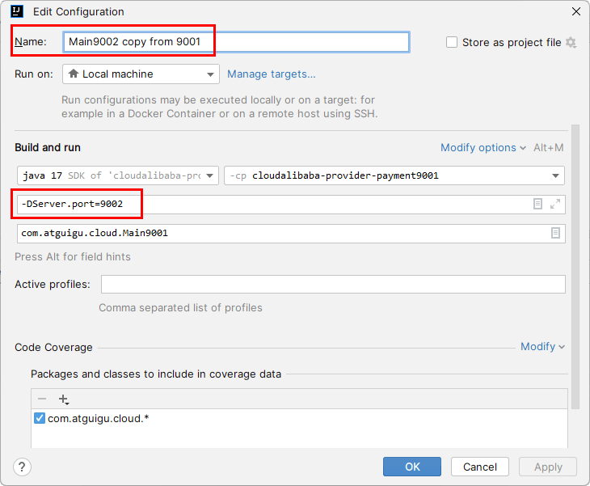

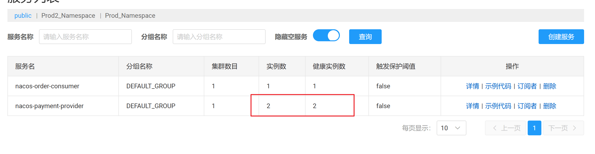

之后访问消费者端口，可以看到这两者端口号交替出现了

### Nacos Config 服务配置中心


1. 新建模块 `cloudalibaba-config-nacos-client3377`
1. 修改 pom

    <details>

    ```xml
    <dependencies>
        <!--bootstrap-->
        <dependency>
            <groupId>org.springframework.cloud</groupId>
            <artifactId>spring-cloud-starter-bootstrap</artifactId>
        </dependency>
        <!--nacos-config-->
        <dependency>
            <groupId>com.alibaba.cloud</groupId>
            <artifactId>spring-cloud-starter-alibaba-nacos-config</artifactId>
        </dependency>
        <!--nacos-discovery-->
        <dependency>
            <groupId>com.alibaba.cloud</groupId>
            <artifactId>spring-cloud-starter-alibaba-nacos-discovery</artifactId>
        </dependency>
        <!--web + actuator-->
        <dependency>
            <groupId>org.springframework.boot</groupId>
            <artifactId>spring-boot-starter-web</artifactId>
        </dependency>
        <dependency>
            <groupId>org.springframework.boot</groupId>
            <artifactId>spring-boot-starter-actuator</artifactId>
        </dependency>
        <!--lombok-->
        <dependency>
            <groupId>org.projectlombok</groupId>
            <artifactId>lombok</artifactId>
            <optional>true</optional>
        </dependency>
    </dependencies>
    ```

    </details>

1. 配置文件

    nacos 端配置文件 DataId 的命名规则是：`${spring.application.name}-${spring.profile.active}.${spring.cloud.nacos.config.file-extension}`

    本案例的 DataID 是：`nacos-config-client-dev.yaml`

    实际操作中，prefix 为当前项目 application.name 的值，spring.profile.active 为当前环境的值，file-extension 为配置文件的格式

    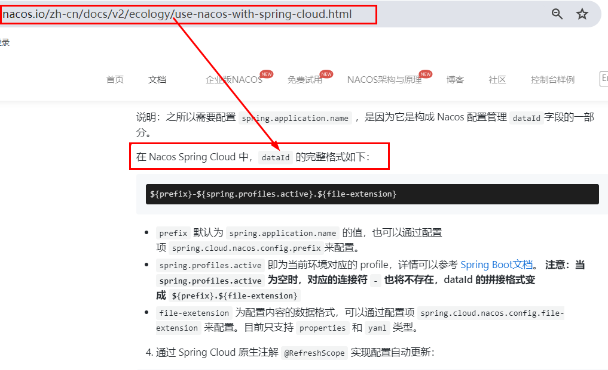

    

    nacos 和 consul 配置一样，项目初始化的时候需要确保先从配置中心获取，拉取配置之后才能够保证项目的正常启动

    而且 springboot 中优先级是有顺序的，bootstrap.yml 优先级最高，然后才是 application.yml

    所以要进行两个配置

    bootstrap.yml

    ```yaml
    # nacos配置
    spring:
        application:
            name: nacos-config-client
        cloud:
            nacos:
                discovery:
                    # Nacos 服务注册中心地址
                    server-addr: ubuntu:8848
                config:
                    # Nacos 作为配置中心地址
                    server-addr: ubuntu:8848
                    # 指定 yaml 格式的配置
                    file-extension: yaml
    ```

    application.yml

    ```yaml
    server:
        port: 3377
    spring:
        profiles:
            active: dev # 表示开发环境
            #active: prod # 表示生产环境
            #active: test # 表示测试环境
    ```

1. 主启动类

    ```java
    @EnableDiscoveryClient
    @SpringBootApplication
    public class NacosConfigClient3377
    {
        public static void main(String[] args)
        {
            SpringApplication.run(NacosConfigClient3377.class,args);
        }
    }
    ```

1. 业务类

    ```java
    @RestController
    // 在控制器类加入 @RefreshScope 这个 Spring Cloud 的原生注解使当前类下的配置支持 Nacos 的动态刷新功能
    @RefreshScope
    public class NacosConfigClientController
    {
        @Value("${config.info}")
        private String configInfo;

        @GetMapping("/config/info")
        public String getConfigInfo() {
            return configInfo;
        }
    }
    ```

1. 首先查看 nacos 的配置文件，然后启动这个模块

    

    

    

    进行修改，然后再次调用接口，会发现已经改变了配置

    此外还有历史版本，可以一键回滚

    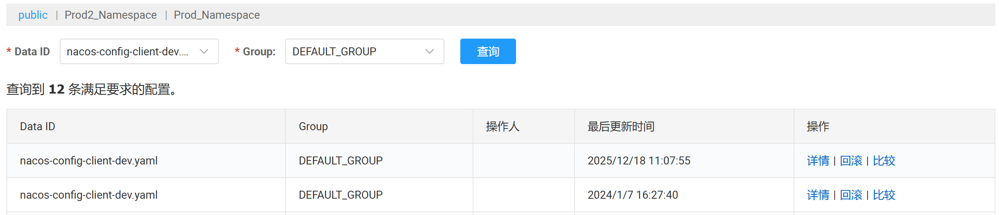

### Nacos Namespace Group DataId

在实际开发中，每个模块都有自己的不同环境 dev、prod 等，而且具备多个项目

那么在 nacos 中，区分模块和环境就十分重要，使用的是 namespace + group + dataId 的模式

默认情况下，namespace = public，group = DEFAULT_GROUP

-   namespace 主要用来实现隔离

    比方说我们现在有三个环境：开发、测试、生产环境，我们就可以创建三个 namespace

    不同的 Namespace 之间是隔离的

-   group 默认是 DEFAULT_GROUP

    group 可以把不同的微服务划分到同一个分组里面去

-   service 就是微服务

    一个 service 可以包含一个或者多个 cluster（集群）

    nacos 默认 cluster 是 DEFAULT，cluster 是对指定微服务的一个虚拟划分


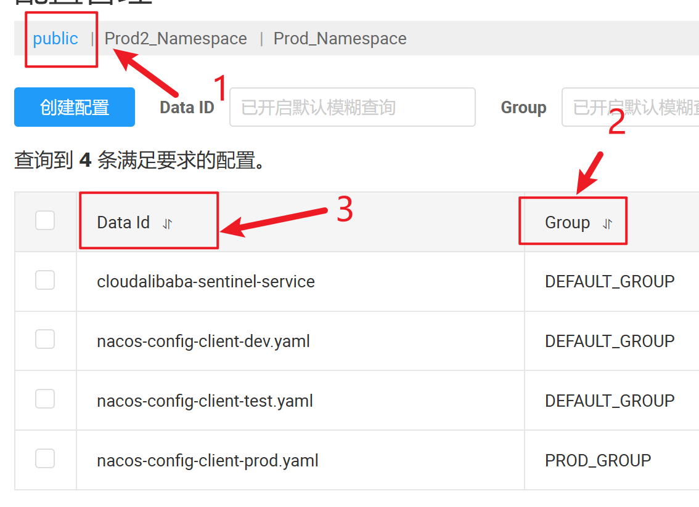

如果想要切换 group，则直接加一条配置项

```yaml
# nacos配置 第2种:默认空间+新建分组+新建DataID
spring:
    application:
        name: nacos-config-client
    cloud:
        nacos:
            discovery:
                server-addr: localhost:8848 #Nacos服务注册中心地址
            config:
                server-addr: localhost:8848 #Nacos作为配置中心地址
                file-extension: yaml #指定yaml格式的配置
                group: PROD_GROUP
```

想要切换 namespace，则直接加一条配置项

```yaml
# nacos配置 第3种:新建空间+新建分组+新建DataID
spring:
    application:
        name: nacos-config-client
    cloud:
        nacos:
            discovery:
                server-addr: localhost:8848 #Nacos服务注册中心地址
            config:
                server-addr: localhost:8848 #Nacos作为配置中心地址
                file-extension: yaml #指定yaml格式的配置
                group: PROD_GROUP
                namespace: Prod_Namespace
```

## Sentinel

### 介绍

[Sentinel](https://sentinelguard.io/zh-cn/) 等价对标 Spring Cloud Circuit Breaker，是个流量控制软件

从流量路由、流量控制、流量整形、熔断降级、系统自适应过载保护、热点流量防护等多个维度来帮助开发者保障微服务的稳定性


Sentinel 分为两部分：

-   核心库 Java 客户端，不依赖任何框架，能够运行所有的 Java 运行时环境，同时对 Dubbo 和 Spring Cloud 也有较好支持
-   控制台 Dashboard 基于 Spring Boot 开发，打包后直接运行，不需要 tomcat 等容器，也就是直接 `java -jar sentinel-dashboard-1.8.6.jar`

登录账户密码均为 `sentinel`，前端默认为 8080，后端默认 8719


### 微服务整合 sentinel

1. 新增模块 `cloudalibaba-sentinel-service8401` 作为被哨兵纳入管控的微服务提供者
1. 新增依赖

    <details>

    ```xml
    <dependencies>
        <!--SpringCloud alibaba sentinel -->
        <dependency>
            <groupId>com.alibaba.cloud</groupId>
            <artifactId>spring-cloud-starter-alibaba-sentinel</artifactId>
        </dependency>
        <!--nacos-discovery-->
        <dependency>
            <groupId>com.alibaba.cloud</groupId>
            <artifactId>spring-cloud-starter-alibaba-nacos-discovery</artifactId>
        </dependency>
        <!-- 引入自己定义的api通用包 -->
        <dependency>
            <groupId>com.colirx</groupId>
            <artifactId>cloud-api-commons</artifactId>
            <version>1.0-SNAPSHOT</version>
        </dependency>
        <!--SpringBoot通用依赖模块-->
        <dependency>
            <groupId>org.springframework.boot</groupId>
            <artifactId>spring-boot-starter-web</artifactId>
        </dependency>
        <dependency>
            <groupId>org.springframework.boot</groupId>
            <artifactId>spring-boot-starter-actuator</artifactId>
        </dependency>
        <!--hutool-->
        <dependency>
            <groupId>cn.hutool</groupId>
            <artifactId>hutool-all</artifactId>
        </dependency>
        <!--lombok-->
        <dependency>
            <groupId>org.projectlombok</groupId>
            <artifactId>lombok</artifactId>
            <version>1.18.28</version>
            <scope>provided</scope>
        </dependency>
        <!--test-->
        <dependency>
            <groupId>org.springframework.boot</groupId>
            <artifactId>spring-boot-starter-test</artifactId>
            <scope>test</scope>
        </dependency>
    </dependencies>
    ```

    </details>

1. 添加配置

    ```yaml
    server:
        port: 8401

    spring:
        application:
            name: cloudalibaba-sentinel-service
        cloud:
            nacos:
                discovery:
                    # Nacos服务注册中心地址
                    server-addr: localhost:8848
            sentinel:
                transport:
                    # 配置 Sentinel dashboard 控制台服务地址
                    dashboard: localhost:8080
                    # 默认 8719 端口，假如被占用会自动从 8719 开始依次 +1 扫描,直至找到未被占用的端口
                    port: 8719
    ```

1. 主启动类

    ```java
    @EnableDiscoveryClient
    @SpringBootApplication
    public class Main8401 {
        public static void main(String[] args) {
            SpringApplication.run(Main8401.class, args);
        }
    }
    ```

1. 业务类

    ```java
    @RestController
    public class FlowLimitController
    {

        @GetMapping("/testA")
        public String testA()
        {
            return "------testA";
        }

        @GetMapping("/testB")
        public String testB()
        {
            return "------testB";
        }
    }
    ```

1. 测试查看

    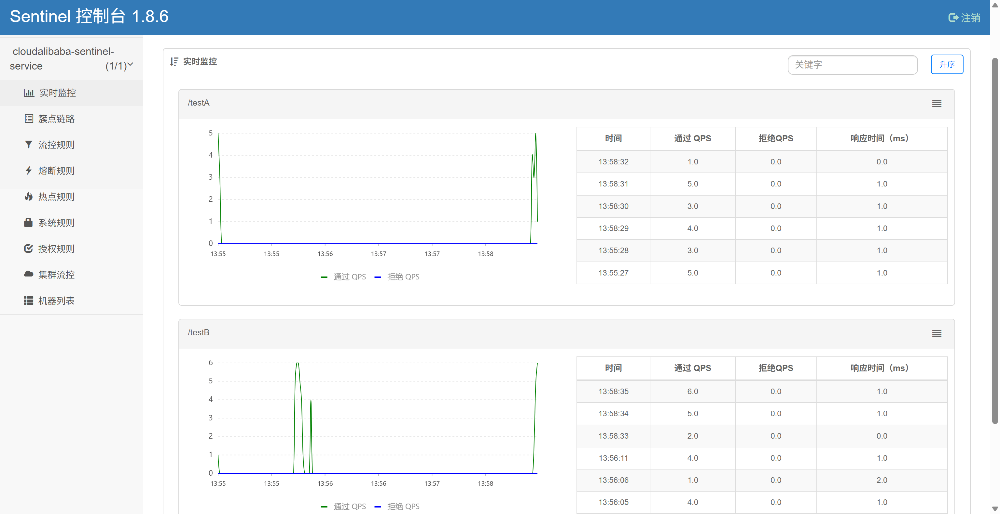

    sentinel 是懒加载，如果没有接口访问是不会出现界面的

### 流控

#### 流控规则


Sentinel 能够对流量进行控制，主要是监控应用的 QPS 流量或者并发线程数等指标，如果达到指定的阈值时，就会被流量进行控制，以避免服务被瞬时的高并发流量击垮，保证服务的高可靠性


-   资源名：资源的唯一名称，默认就是请求的接口路径，可以自行修改，但是要保证唯一
-   针对来源：具体针对某个微服务进行限流，默认值为 default，表示不区分来源，全部限流
-   阈值类型：QPS 表示通过 QPS 进行限流，并发线程数表示通过并发线程数限流
-   单机阈值：与阈值类型组合使用

    如果阈值类型选择的是 QPS，表示当调用接口的 QPS 达到阈值时，进行限流操作

    如果阈值类型选择的是并发线程数，则表示当调用接口的并发线程数达到阈值时，进行限流操作

-   是否集群

    选中则表示集群环境，不选中则表示非集群环境

#### 流控模式

-   直接：默认情况，当接口达到限流条件时，直接开启限流功能

      

    表示 1 秒钟内查询 1 次就是 OK，若超过次数 1，就直接-快速失败，报默认错误

      

-   关联：当关联的资源达到阈值时，就限流自己

    当与 A 关联的资源 B 达到阀值后，就限流 A 自己

      

    当关联资源 /testB 的 qps 阀值超过 1 时，就限流 /testA 的 Rest 访问地址，当关联资源到阈值后限制配置好的资源名，B 惹事，A 挂了

    启用这条的时候，快速访问 A 没问题，快速访问 B 没问题，但是快速访问 B 的时候访问 A 就有问题

-   链路：来自不同链路的请求对同一个目标访问时，实施针对性的不同限流措施

    比如 C 请求来访问就限流，D 请求来访问就是 OK

修改微服务 `cloudalibaba-sentinel-service8401`

1. 修改配置项

    ```yml
    server:
        port: 8401

    spring:
        application:
            # 8401 微服务提供者后续将会被纳入阿里巴巴 sentinel 监管
            name: cloudalibaba-sentinel-service
    cloud:
        nacos:
            discovery:
                # Nacos 服务注册中心地址
                server-addr: localhost:8848
        sentinel:
            transport:
                # 配置 Sentinel dashboard 控制台服务地址
                dashboard: localhost:8080
                # 默认 8719 端口，假如被占用会自动从 8719 开始依次 +1 扫描,直至找到未被占用的端口
                port: 8719
                # controller 层的方法对 service 层调用不认为是同一个根链路
            web-context-unify: false
    ```

1. 修改业务类

    ```java
    @RestController
    public class FlowLimitController {
        @GetMapping("/testA")
        public String testA() {
            return "------testA";
        }

        @GetMapping("/testB")
        public String testB() {
            return "------testB";
        }

        /**
        * 流控-链路演示demo
        * C和D两个请求都访问flowLimitService.common()方法，阈值到达后对C限流，对D不管
        */
        @Resource
        private FlowLimitService flowLimitService;

        @GetMapping("/testC")
        public String testC() {
            flowLimitService.common();
            return "------testC";
        }

        @GetMapping("/testD")
        public String testD() {
            flowLimitService.common();
            return "------testD";
        }
    }
    ```

    ```java
    @Service
    public class FlowLimitService {
        @SentinelResource(value = "common")
        public void common() {
            System.out.println("------FlowLimitService come in");
        }
    }
    ```

    SentinelResource 是一个流量防卫防护组件注解

    用于指定防护资源，对配置的资源进行流量控制、熔断降级等功能，可以通过此注解来配置资源名称和返回内容

    

    

1. sentinel 配置

    C 和 D 两个请求都访问 flowLimitService.common() 方法，对 C 限流，对 D 不管

    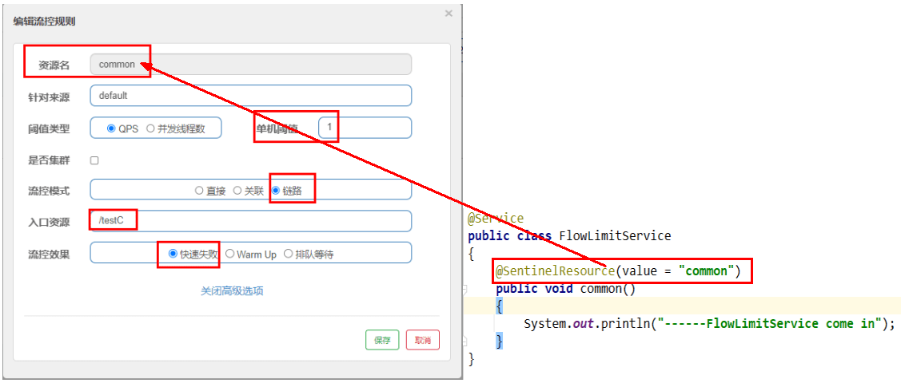

    

    

#### 流控效果 QPS

-   直接 -> 快速失败：即直接抛出异常
-   限流 冷启动：

      

    公式：阈值除以冷却因子 coldFactor（默认值为 3），经过预热时长后才会达到阈值

      

    如：秒杀系统在开启的瞬间，会有很多流量上来，很有可能把系统打死，预热方式就是把为了保护系统，可慢慢的把流量放进来，慢慢的把阈值增长到设置的阈值。

      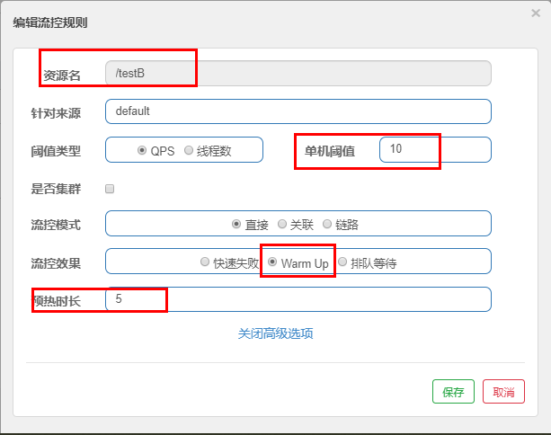

    案例，单机阈值为 10，预热时长设置 5 秒

    系统初始化的阈值为 10 / 3 约等于 3，即单机阈值刚开始为 3（我们人工设定单机阈值是 10，sentinel 计算后 QPS 判定为 3 开始）

    然后过了 5 秒后阀值才慢慢升高恢复到设置的单机阈值 10，也就是说 5 秒钟内 QPS 为 3，过了保护期 5 秒后 QPS 为 10

-   排队等待：

      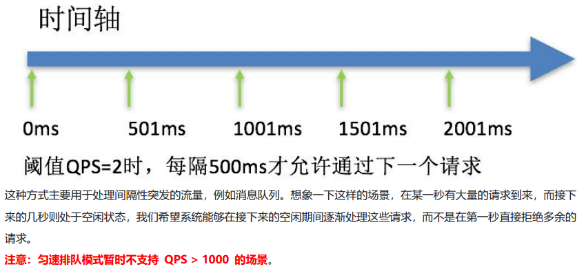

    修改业务类

    ```java
    @GetMapping("/testE")
    public String testE()
    {
        System.out.println(System.currentTimeMillis()+"      testE,排队等待");
        return "------testE";
    }
    ```

      

      

      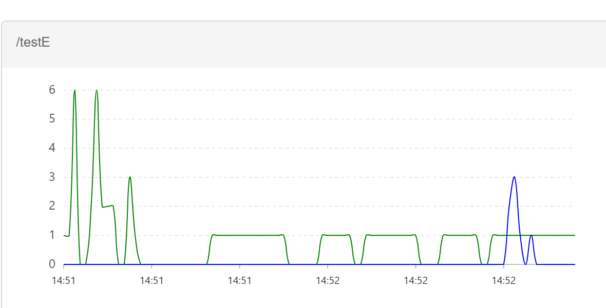

### 流控效果并发

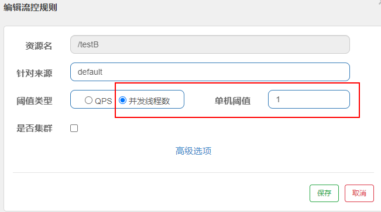

直接使用 APIFox 或者其他测试软件进行测试

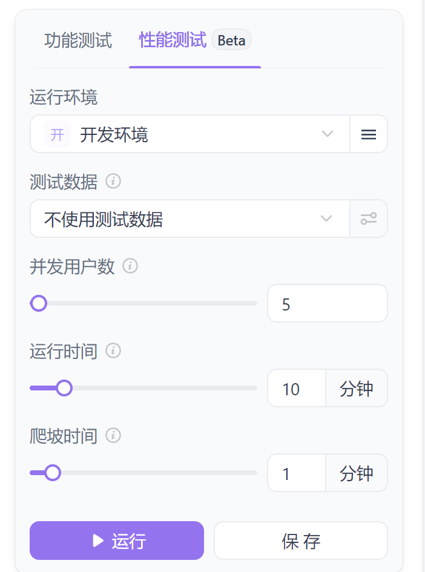


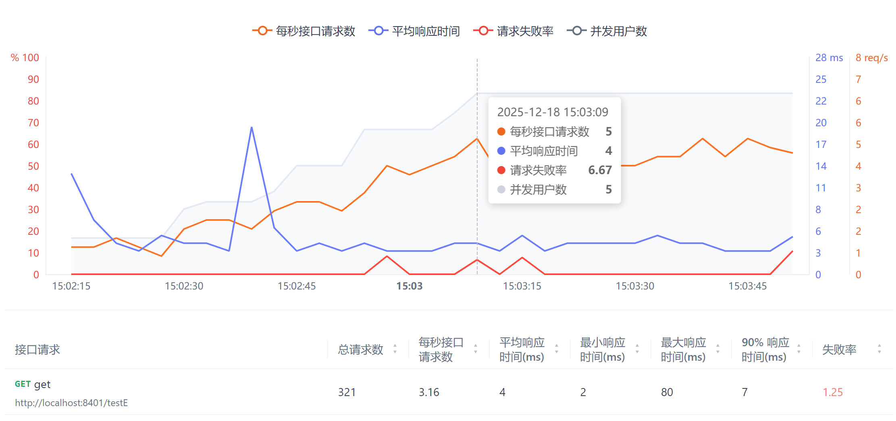

### 熔断

Sentinel 熔断降级会在调用链路中某个资源出现不稳定状态时（例如调用超时或异常比例升高），对这个资源的调用进行限制

让请求快速失败，避免影响到其它的资源而导致级联错误

当资源被降级后，在接下来的降级时间窗口之内，对该资源的调用都自动熔断（默认行为是抛出 DegradeException）


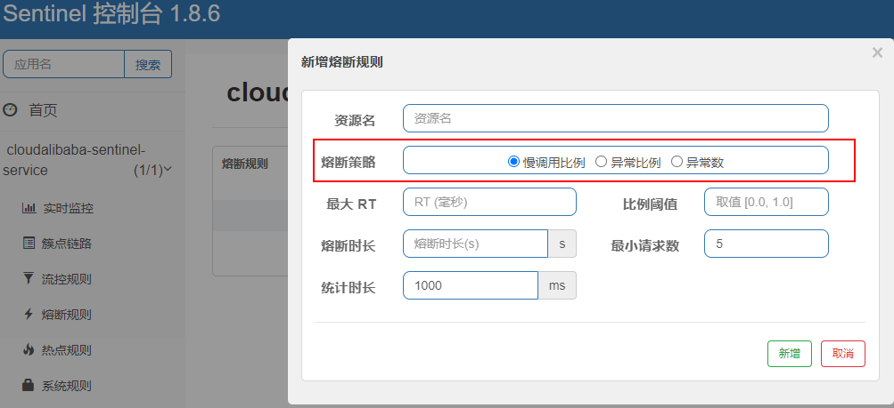

#### 慢调用比例


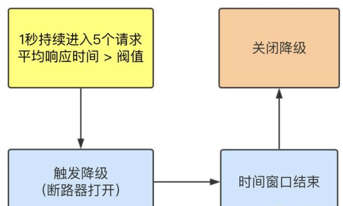

进入熔断状态判断依据：在统计时长内，实际请求数目 ＞ 设定的最小请求数 且 实际慢调用比例 ＞ 比例阈值，进入熔断状态

-   调用：一个请求发送到服务器，服务器给与响应，一个响应就是一个调用
-   最大 RT：即最大的响应时间，指系统对请求作出响应的业务处理时间
-   慢调用：处理业务逻辑的实际时间 > 设置的最大 RT 时间，这个调用叫做慢调用
-   慢调用比例：在所以调用中，慢调用占有实际的比例＝慢调用次数 / 总调用次数
-   比例阈值：自己设定的 比例阈值＝慢调用次数 / 调用次数
-   统计时长：时间的判断依据
-   最小请求数：设置的调用最小请求数，上图比如 1 秒钟打进来 10 个线程（大于我们配置的 5 个了）调用被触发

熔断状态转换：

-   熔断状态（保险丝跳闸断电，不可访问）：在接下来的熔断时长内请求会自动被熔断
-   探测恢复状态（探路先锋）：熔断时长结束后进入探测恢复状态
-   结束熔断（保险丝闭合恢复，可以访问）：在探测恢复状态，如果接下来的一个请求响应时间小于设置的慢调用 RT，则结束熔断，否则继续熔断

1. 业务代码

    ```java
    @GetMapping("/testF")
    public String testF()
    {
        //暂停几秒钟线程
        try { TimeUnit.SECONDS.sleep(1); } catch (InterruptedException e) { e.printStackTrace(); }
        System.out.println("----测试:新增熔断规则-慢调用比例 ");
        return "------testF 新增熔断规则-慢调用比例";
    }
    ```

    10 个线程，在一秒的时间内发送完

    又因为服务器响应时长设置：暂停 1 秒，所以响应一个请求的时长都大于 1 秒综上符合熔断条件，所以当线程开启 1 秒后，进入熔断状态

1. 配置

 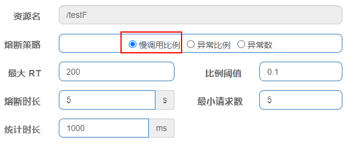

1. 测试

    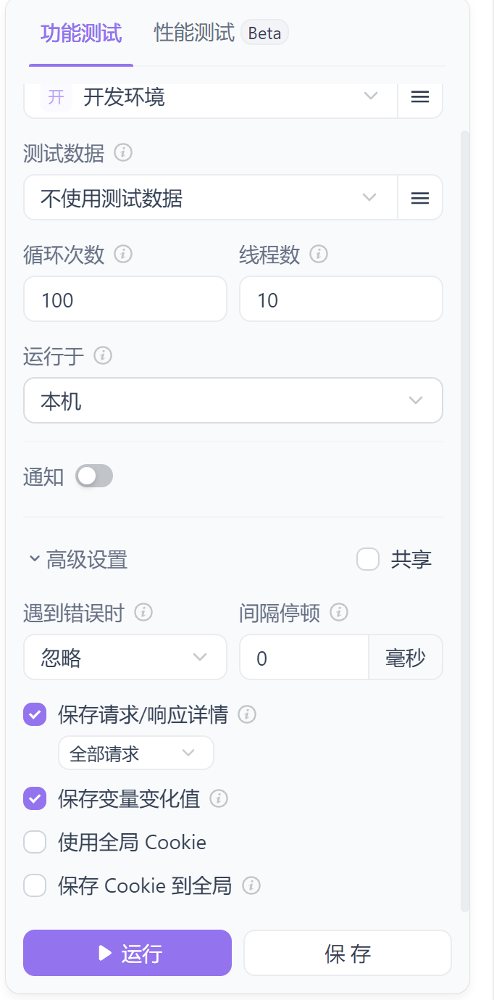

    多次循环，一秒钟打进来 10 个线程(大于 5 个了)调用 `/testF`，我们希望 200 毫秒处理完一次调用

    假如在统计时长内，实际请求数目 ＞ 最小请求数 且 慢调用比例 ＞ 比例阈值

    断路器打开（保险丝跳闸）微服务不可用，进入熔断状态 5 秒

    

#### 异常比例

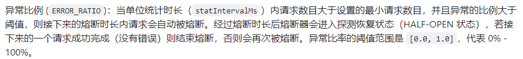


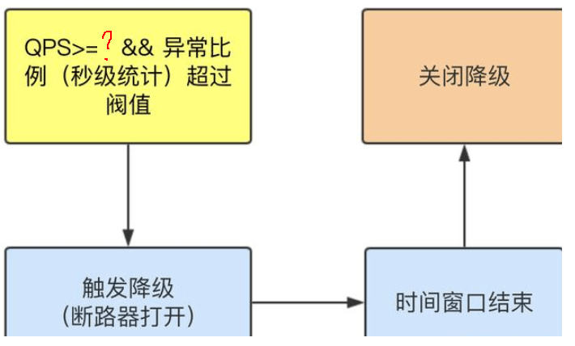

```java
@GetMapping("/testG")
public String testG()
{
    System.out.println("----测试:新增熔断规则-异常比例 ");
    int age = 10/0;
    return "------testG,新增熔断规则-异常比例 ";
}
```


#### 异常数


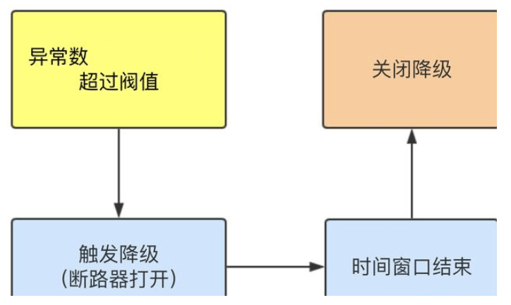

```java
@GetMapping("/testH")
public String testH()
{
    System.out.println("----测试:新增熔断规则-异常数 ");
    int age = 10/0;
    return "------testH,新增熔断规则-异常数 ";
}
```


### 热点

热点即经常访问的数据，很多时候我们希望统计或者限制某个热点数据中访问频次最高的 TopN 数据，并对其访问进行限流或者其它操作


```java
@GetMapping("/testHotKey")
@SentinelResource(value = "testHotKey",blockHandler = "dealHandler_testHotKey")
public String testHotKey(@RequestParam(value = "p1",required = false) String p1,

                         @RequestParam(value = "p2",required = false) String p2){
    return "------testHotKey";
}
public String dealHandler_testHotKey(String p1,String p2,BlockException exception)
{
    return "-----dealHandler_testHotKey";
}
```


限流模式只支持 QPS 模式

`@SentinelResource` 注解的方法参数索引，0 代表第一个参数，1 代表第二个参数，以此类推

单机阀值以及统计窗口时长表示在此窗口时间超过阀值就限流

上面的抓图就是第一个参数有值的话，1 秒的 QPS 为 1，超过就限流，限流后调用 dealHandler_testHotKey 支持方法

这样的话，假设访问 `http://localhost:8401/testHotKey?p1=abc` 带有参数 p1，访问频率超过 1 次就直接限流

访问 `http://localhost:8401/testHotKey?p2=abc` 不带有 p1，不限流

---

当我们想要设定，P1 参数当它为某个特殊值时，使用其他的限流方式，为其他值时仍然使用默认的限流方式，那么


注意，这里的热点参数必须是 String 类型或者基本类型

### 授权

在某些场景下，需要根据调用接口的来源判断是否允许执行本次请求

此时就可以使用 Sentinel 提供的授权规则来实现，Sentinel 的授权规则能够根据请求的来源判断是否允许本次请求通过

在 Sentinel 的授权规则中，提供了白名单与黑名单


```java
@RestController
@Slf4j
// Empower授权规则，用来处理请求的来源
public class EmpowerController
{
    @GetMapping(value = "/empower")
    public String requestSentinel4(){
        log.info("测试Sentinel授权规则empower");
        return "Sentinel授权规则";
    }
}
```

```java
@Component
public class MyRequestOriginParser implements RequestOriginParser
{
    @Override
    public String parseOrigin(HttpServletRequest httpServletRequest) {
        return httpServletRequest.getParameter("serverName");
    }
}
```

不断访问接口数据，发现只要是这俩数据就全部都访问不了了但是其他可以

### 持久化

将限流配置规则持久化进 Nacos 保存，只要刷新 8401 某个 rest 地址，sentinel 控制台的流控规则就能看到

只要 Nacos 里面的配置不删除，针对 8401 上 sentinel 上的流控规则持续有效

否则微服务一旦重启规则就会消失

1. 增加依赖

    ```xml
    <!--SpringCloud ailibaba sentinel-datasource-nacos -->
    <dependency>
        <groupId>com.alibaba.csp</groupId>
        <artifactId>sentinel-datasource-nacos</artifactId>
    </dependency>
    ```

1. 修改配置文件

    ```yaml
    server:
        port: 8401

    spring:
        application:
            #8401微服务提供者后续将会被纳入阿里巴巴sentinel监管
            name: cloudalibaba-sentinel-service
        cloud:
            nacos:
                discovery:
                    # Nacos服务注册中心地址
                    server-addr: localhost:8848
            sentinel:
                transport:
                    # 配置 Sentinel dashboard 控制台服务地址
                    dashboard: localhost:8080
                # 默认8719端口，假如被占用会自动从8719开始依次+1扫描,直至找到未被占用的端口
                port: 8719
                # controller层的方法对service层调用不认为是同一个根链路
                web-context-unify: false
                datasource:
                    ds1:
                        nacos:
                            server-addr: localhost:8848
                            dataId: ${spring.application.name}
                            groupId: DEFAULT_GROUP
                            data-type: json
                            # com.alibaba.cloud.sentinel.datasource.RuleType
                            rule-type: flow
    ```

1. nacos 添加配置规则

    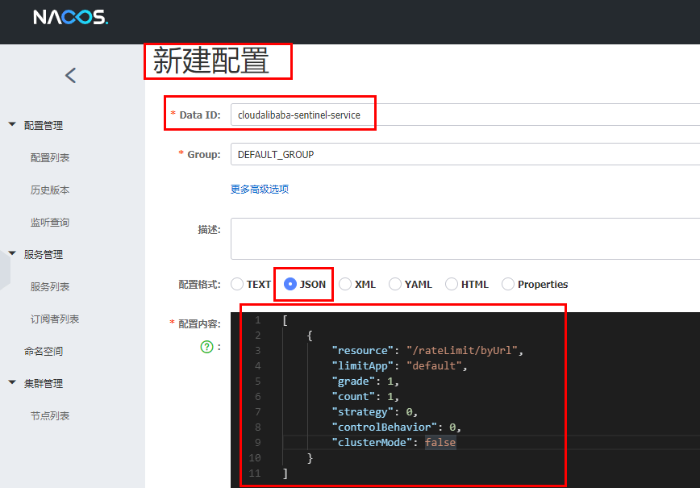

    ```json
    [
        {
            "resource": "/rateLimit/byUrl",
            "limitApp": "default",
            "grade": 1,
            "count": 1,
            "strategy": 0,
            "controlBehavior": 0,
            "clusterMode": false
        }
    ]
    ```

    - resource：资源名称
    - limitApp：来源应用
    - grade：阈值类型，0 表示线程数，1 表示 QPS
    - count：单机阈值
    - strategy：流控模式，0 表示直接，1 表示关联，2 表示链路
    - controlBehavior：流控效果，0 表示快速失败，1 表示 Warm Up，2 表示排队等待
    - clusterMode：是否集群

### OpenFeign + Sentinel 集成 fallback 服务降级

修改 `cloudalibaba-provider-payment9001`

1. pom

    ```xml
    <!--openfeign-->
    <dependency>
        <groupId>org.springframework.cloud</groupId>
        <artifactId>spring-cloud-starter-openfeign</artifactId>
    </dependency>
    <!--alibaba-sentinel-->
    <dependency>
        <groupId>com.alibaba.cloud</groupId>
        <artifactId>spring-cloud-starter-alibaba-sentinel</artifactId>
    </dependency>
    ```

1. 配置文件

    ```yaml
    server:
        port: 9001

    spring:
        application:
            name: nacos-payment-provider
        cloud:
            nacos:
                discovery:
                    server-addr: ubuntu:8848
            sentinel:
                transport:
                    # sentinel dashboard 控制台服务地址
                    dashboard: ubuntu:8858
                    #默认 8719 端口，假如被占用会自动从 8719 开始依次 +1 扫描直至找到未被占用的端口
                    port: 8719
    ```

1. 主启动类

    ```java
    @SpringBootApplication
    @EnableDiscoveryClient
    public class Main9001
    {
        public static void main(String[] args)
        {
            SpringApplication.run(Main9001.class,args);
        }
    }
    ```

1. controller

    ```java
    @RestController
    public class PayAlibabaController {
        @Value("${server.port}")
        private String serverPort;

        @GetMapping(value = "/pay/nacos/{id}")
        public String getPayInfo(@PathVariable("id") Integer id) {
            return "nacos registry, serverPort: " + serverPort + "\t id" + id;
        }

        @GetMapping("/pay/nacos/get/{orderNo}")
        @SentinelResource(value = "getPayByOrderNo", blockHandler = "handlerBlockHandler")
        public ResultData getPayByOrderNo(@PathVariable("orderNo") String orderNo) {
            // 模拟从数据库查询出数据并赋值给DTO
            PayDTO payDTO = new PayDTO();

            payDTO.setId(1024);
            payDTO.setOrderNo(orderNo);
            payDTO.setAmount(BigDecimal.valueOf(9.9));
            payDTO.setPayNo("pay:" + IdUtil.fastUUID());
            payDTO.setUserId(1);

            return ResultData.success("查询返回值：" + payDTO);
        }

        public ResultData handlerBlockHandler(@PathVariable("orderNo") String orderNo, BlockException exception) {
            return ResultData.fail(ReturnCodeEnum.RC500.getCode(), "getPayByOrderNo服务不可用，" +
                "触发sentinel流控配置规则" + "\t" + "o(╥﹏╥)o");
        }
        /*
        fallback服务降级方法纳入到Feign接口统一处理，全局一个
        public ResultData myFallBack(@PathVariable("orderNo") String orderNo,Throwable throwable)
        {
            return ResultData.fail(ReturnCodeEnum.RC500.getCode(),"异常情况："+throwable.getMessage());
        }
        */
    }
    ```

修改 commons 添加 pojo

1. pojo

    ```java
    @Data
    @AllArgsConstructor
    @NoArgsConstructor
    public class PayDTO implements Serializable {

        private Integer id;
        //支付流水号
        private String payNo;
        //订单流水号
        private String orderNo;
        //用户账号ID
        private Integer userId;
        //交易金额
        private BigDecimal amount;
    }
    ```

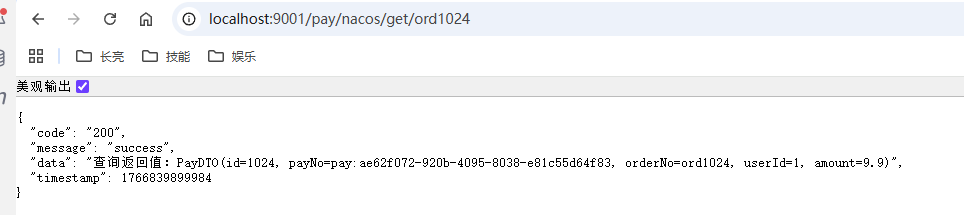

修改 cloud-api-commons

1. pom

    ```xml
    <!--openfeign-->
    <dependency>
        <groupId>org.springframework.cloud</groupId>
        <artifactId>spring-cloud-starter-openfeign</artifactId>
    </dependency>
    <!--alibaba-sentinel-->
    <dependency>
        <groupId>com.alibaba.cloud</groupId>
        <artifactId>spring-cloud-starter-alibaba-sentinel</artifactId>
    </dependency>
    ```

1. 新增远程调用 feign 接口

    ```java
    @FeignClient(value = "nacos-payment-provider",fallback = PayFeignSentinelApiFallBack.class)
    public interface PayFeignSentinelApi
    {
        @GetMapping("/pay/nacos/get/{orderNo}")
        public ResultData getPayByOrderNo(@PathVariable("orderNo") String orderNo);
    }
    ```

1. 新增全局的远程调用的服务降级类

    ```java
    @Component
    public class PayFeignSentinelApiFallBack implements PayFeignSentinelApi
    {
        @Override
        public ResultData getPayByOrderNo(String orderNo)
        {
            return ResultData.fail(ReturnCodeEnum.RC500.getCode(),"对方服务宕机或不可用，FallBack服务降级o(╥﹏╥)o");
        }
    }
    ```

修改 cloudalibaba-consumer-nacos-order83

1. pom

    ```xml
    <!-- 引入自己定义的api通用包 -->
    <dependency>
        <groupId>com.colirx.cloud</groupId>
        <artifactId>cloud-api-commons</artifactId>
        <version>1.0-SNAPSHOT</version>
    </dependency>
    <!--openfeign-->
    <dependency>
        <groupId>org.springframework.cloud</groupId>
        <artifactId>spring-cloud-starter-openfeign</artifactId>
    </dependency>
    <!--alibaba-sentinel-->
    <dependency>
        <groupId>com.alibaba.cloud</groupId>
        <artifactId>spring-cloud-starter-alibaba-sentinel</artifactId>
    </dependency>
    ```

1. yaml

    ```yaml
    # 激活Sentinel对Feign的支持
    feign:
        sentinel:
            enabled: true
    ```

1. 主启动类增加 `@EnableFeignClients`
1. 业务类 OrderNacosController

    ```java
    @RestController
    public class OrderNacosController
    {
        @Resource
        private RestTemplate restTemplate;
        @Resource
        private PayFeignSentinelApi payFeignSentinelApi;

        @Value("${service-url.nacos-user-service}")
        private String serverURL;

        @GetMapping("/consumer/pay/nacos/{id}")
        public String paymentInfo(@PathVariable("id") Integer id)
        {
            String result = restTemplate.getForObject(serverURL + "/pay/nacos/" + id, String.class);
            return result+"\t"+"    我是OrderNacosController83调用者。。。。。。";
        }

        @GetMapping(value = "/consumer/pay/nacos/get/{orderNo}")
        public ResultData getPayByOrderNo(@PathVariable("orderNo") String orderNo)
        {
            return payFeignSentinelApi.getPayByOrderNo(orderNo);
        }
    }
    ```

1. 测试

    http://localhost:83/consumer/pay/nacos/get/1024

    

### GateWay 与 Sentinel 实现服务限流

1. 新建 cloudalibaba-sentinel-gateway9528
1. 修改 pom

    ```xml
    <dependencies>
        <dependency>
            <groupId>org.springframework.cloud</groupId>
            <artifactId>spring-cloud-starter-gateway</artifactId>
        </dependency>
        <dependency>
            <groupId>com.alibaba.csp</groupId>
            <artifactId>sentinel-transport-simple-http</artifactId>
            <version>1.8.6</version>
        </dependency>
        <dependency>
            <groupId>com.alibaba.csp</groupId>
            <artifactId>sentinel-spring-cloud-gateway-adapter</artifactId>
            <version>1.8.6</version>
        </dependency>
        <dependency>
            <groupId>javax.annotation</groupId>
            <artifactId>javax.annotation-api</artifactId>
            <version>1.3.2</version>
            <scope>compile</scope>
        </dependency>
    </dependencies>
    ```

1. 配置文件

    ```yaml
    server:
        port: 9528

    spring:
        application:
            name: cloudalibaba-sentinel-gateway # sentinel+gataway整合Case
        cloud:
            nacos:
                discovery:
                    server-addr: ubuntu:8848
            gateway:
                routes:
                    - id: pay_routh1 #pay_routh1                #路由的ID(类似mysql主键ID)，没有固定规则但要求唯一，建议配合服务名
                      uri: http://localhost:9001 #匹配后提供服务的路由地址
                      predicates:
                          - Path=/pay/** # 断言，路径相匹配的进行路由
    ```

1. 主体类

    ```java
    @SpringBootApplication
    @EnableDiscoveryClient
    public class Main9528
    {
        public static void main(String[] args)
        {
            SpringApplication.run(Main9528.class,args);
        }
    }
    ```

1. 业务类

    ```java
    @Configuration
    public class GatewayConfiguration {

        private final List<ViewResolver> viewResolvers;
        private final ServerCodecConfigurer serverCodecConfigurer;

        public GatewayConfiguration(ObjectProvider<List<ViewResolver>> viewResolversProvider, ServerCodecConfigurer serverCodecConfigurer)
        {
            this.viewResolvers = viewResolversProvider.getIfAvailable(Collections::emptyList);
            this.serverCodecConfigurer = serverCodecConfigurer;
        }

        @Bean
        @Order(Ordered.HIGHEST_PRECEDENCE)
        public SentinelGatewayBlockExceptionHandler sentinelGatewayBlockExceptionHandler() {
            // Register the block exception handler for Spring Cloud Gateway.
            return new SentinelGatewayBlockExceptionHandler(viewResolvers, serverCodecConfigurer);
        }

        @Bean
        @Order(-1)
        public GlobalFilter sentinelGatewayFilter() {
            return new SentinelGatewayFilter();
        }

        @PostConstruct //javax.annotation.PostConstruct
        public void doInit() {
            initBlockHandler();
        }


        //处理/自定义返回的例外信息
        private void initBlockHandler() {
            Set<GatewayFlowRule> rules = new HashSet<>();
            rules.add(new GatewayFlowRule("pay_routh1").setCount(2).setIntervalSec(1));

            GatewayRuleManager.loadRules(rules);
            BlockRequestHandler handler = new BlockRequestHandler() {
                @Override
                public Mono<ServerResponse> handleRequest(ServerWebExchange exchange, Throwable t) {
                    Map<String,String> map = new HashMap<>();

                    map.put("errorCode", HttpStatus.TOO_MANY_REQUESTS.getReasonPhrase());
                    map.put("errorMessage", "请求太过频繁，系统忙不过来，触发限流(sentinel+gataway整合Case)");

                    return ServerResponse.status(HttpStatus.TOO_MANY_REQUESTS)
                            .contentType(MediaType.APPLICATION_JSON)
                            .body(BodyInserters.fromValue(map));
                }
            };
            GatewayCallbackManager.setBlockHandler(handler);
        }

    }
    ```

1. 测试

    原生 URL http://localhost:9001/pay/nacos/333

    加网关后 http://localhost:9528/pay/nacos/333

    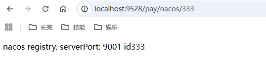

    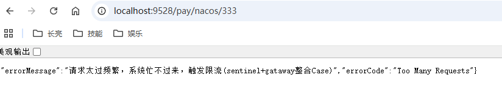

## Seata

### 分布式事务问题的解决方案

假如一次业务需要跨越多个数据源或者多个系统进行远程调用，那么就会产生分布式事务问题

但是关系型数据库是单机事务形式的，所以需要用其他手段来解决问题

比如用户下单并增加积分这个场景，假设系统有两个微服务：

-   订单服务（Order Service）：负责创建订单
-   积分服务（Points Service）：负责给用户增加积分

当用户下单成功后，必须同时：

-   在订单服务中创建订单
-   在积分服务中为该用户增加 100 积分

这两个操作分别在两个不同的数据库中，无法用一个本地事务完成。如果只创建了订单但没加积分，或者反过来，就会出现数据不一致

以前有几种解决方案

1. 2PC 两阶段提交

    协调者（Coordinator） 和 参与者（Participants） 协作完成事务

    第一阶段（Prepare 阶段）：协调者询问所有参与者是否可以提交事务，参与者执行事务但不提交，并锁定资源，返回“同意”或“拒绝”

    第二阶段（Commit/Rollback 阶段）：若所有参与者都同意，则协调者发送 Commit 指令，各参与者正式提交、若任一参与者拒绝或超时，则协调者发送 Rollback，各参与者回滚

    - 强一致性（满足 ACID）
    - 同步阻塞：参与者在第一阶段后会一直持有资源锁，直到第二阶段结束，性能差
    - 单点故障：协调者挂掉可能导致整个系统阻塞
    - 脑裂问题（网络分区时难以处理）

1. 3PC 三阶段提交

    为解决 2PC 的阻塞问题，在 Prepare 和 Commit 之间增加一个 Pre-Commit 阶段：

    CanCommit：协调者询问参与者是否能执行事务（轻量探测）

    PreCommit：若都同意，则发送预提交指令，参与者准备提交但不释放锁

    DoCommit：正式提交

    同时引入 超时机制：如果参与者在 PreCommit 后未收到 DoCommit，会自动提交（基于“大多数已准备”的假设）

    - 减少阻塞概率，提高可用性
    - 仍存在一致性风险（在网络分区下可能数据不一致）
    - 实现复杂，实际应用较少
    - 并未完全解决 CAP 问题

1. TCC Try-Confirm-Cancel 补偿型事务模型

    Try：预留资源（如冻结金额、占位库存），检查可行性

    Confirm：真正执行业务（如扣款、出库），要求幂等

    Cancel：释放 Try 阶段预留的资源（如解冻），也需幂等

    - 性能高（无长时间锁）
    - 最终一致性，适合高并发场景
    - 业务侵入性强，每个服务都要写三套逻辑
    - Confirm/Cancel 必须幂等且可靠

1. Local Message 本地消息表

    在主业务数据库中增加一张 消息表

    主业务与消息插入放在同一个本地事务中（保证原子性）

    后台任务轮询消息表，将消息发送到 MQ 或调用其他服务

    其他服务处理成功后，标记消息为“已消费”

    - 简单可靠，依赖本地事务
    - 不依赖外部 MQ（但通常配合使用）
    - 需要额外的消息表和轮询机制
    - 消息延迟（非实时）

1. 独立消息微服务 + RabbitMQ / Kafka

    将“可靠消息投递”职责抽离成独立的消息服务

    主业务先向消息服务发送“待确认消息”

    消息服务持久化消息并返回 ACK

    主业务执行本地事务

    事务成功后，通知消息服务“确认发送”

    消息服务将消息投递到 RabbitMQ/Kafka

    消费者处理消息，支持重试 + 幂等

    - 解耦业务与消息
    - 利用成熟 MQ 的高可用、重试、顺序性
    - 系统复杂度增加（需维护消息服务）
    - 仍需处理消息重复、丢失边界情况

1. 最大努力通知

    发起方通过多次重试（如 HTTP 回调、MQ）通知接收方

    接收方需实现幂等接口

    不保证一定成功，但“尽最大努力”送达

    通常配合人工对账/补偿机制

    - 实现简单，适合弱一致性场景
    - 无法保证最终一致性（需人工兜底）
    - 依赖接收方的幂等性和可用性

| 方案              | 一致性         | 性能 | 业务侵入       | 适用场景                 |
| ----------------- | -------------- | ---- | -------------- | ------------------------ |
| 2PC               | 强一致         | 低   | 低（依赖 JTA） | 传统单体/少量服务        |
| 3PC               | 强一致（理论） | 中   | 高             | 极少使用                 |
| TCC               | 最终一致       | 高   | 高             | 高并发核心业务（如金融） |
| 本地消息表        | 最终一致       | 中   | 中             | 中小系统，DB 可控        |
| 独立消息服务 + MQ | 最终一致       | 高   | 中             | 微服务架构，高可靠       |
| 最大努力通知      | 弱一致         | 高   | 低             | 通知类、第三方回调       |

选型模式中：

-   高一致性要求 → Seata（AT/TCC 模式）
-   高吞吐异步解耦 → Kafka + 本地事务表 or 独立消息服务
-   简单场景 → 本地消息表 + 定时任务

### Seata 简介

[Seata](https://seata.apache.org/zh-cn/) Simple Extensible Transaction Architecture 简单可扩展自治事务架构

整个分布式事务的管理，就是全局事务 ID 的传递和变更，要让开发者无感知

Seata 对分布式事务的协调和控制就是 1 + 3

1. 一个 XID

    XID 是全局事务的唯一标识，它可以在服务的调用链路中传递，绑定到服务的事务上下文中

1. TC + TM + RM

    

    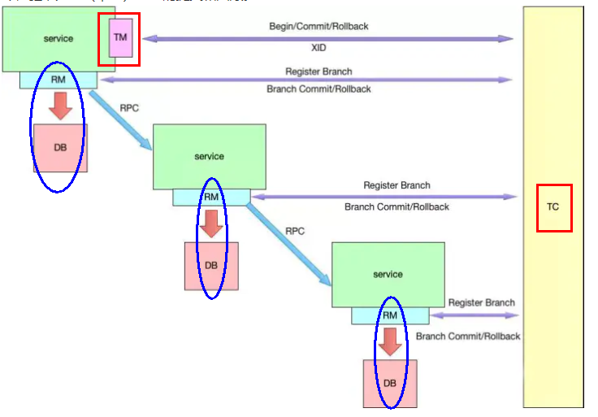

    TC 就是 Seata 负责维护全局事务和分支事务的状态，驱动全局事务提交或回滚

    TM 标注全局 `@GlobalTransactional` 启动入口动作的微服务模块

    RM 就是 mysql 数据库本身，可以是多个 RM，负责管理分支事务上的资源，向 TC​ 注册分支事务，汇报分支事务状态，驱动分支事务的提交或回滚

    

    TM 向 TC 申请开启一个全局事务，全局事务创建成功并生成一个全局唯一的 XID

    XID 在微服务调用链路的上下文中传播

    RM 向 TC 注册分支事务，将其纳入 XID 对应全局事务的管辖

    TM 向 TC 发起针对 XID 的全局提交或回滚决议

    TC 调度 XID 下管辖的全部分支事务完成提交或回滚请求

1. seata 中，TC 为 Server 端，单独部署

    

    <details>

    ```sql
    -- -------------------------------- The script used when storeMode is 'db' --------------------------------
    -- the table to store GlobalSession data
    create database if not exists seata;
    use seata;
    CREATE TABLE IF NOT EXISTS `global_table`
    (
        `xid`                       VARCHAR(128) NOT NULL,
        `transaction_id`            BIGINT,
        `status`                    TINYINT      NOT NULL,
        `application_id`            VARCHAR(32),
        `transaction_service_group` VARCHAR(32),
        `transaction_name`          VARCHAR(128),
        `timeout`                   INT,
        `begin_time`                BIGINT,
        `application_data`          VARCHAR(2000),
        `gmt_create`                DATETIME,
        `gmt_modified`              DATETIME,
        PRIMARY KEY (`xid`),
        KEY `idx_status_gmt_modified` (`status` , `gmt_modified`),
        KEY `idx_transaction_id` (`transaction_id`)
    ) ENGINE = InnoDB
    DEFAULT CHARSET = utf8mb4;

    -- the table to store BranchSession data
    CREATE TABLE IF NOT EXISTS `branch_table`
    (
        `branch_id`         BIGINT       NOT NULL,
        `xid`               VARCHAR(128) NOT NULL,
        `transaction_id`    BIGINT,
        `resource_group_id` VARCHAR(32),
        `resource_id`       VARCHAR(256),
        `branch_type`       VARCHAR(8),
        `status`            TINYINT,
        `client_id`         VARCHAR(64),
        `application_data`  VARCHAR(2000),
        `gmt_create`        DATETIME(6),
        `gmt_modified`      DATETIME(6),
        PRIMARY KEY (`branch_id`),
        KEY `idx_xid` (`xid`)
    ) ENGINE = InnoDB
    DEFAULT CHARSET = utf8mb4;

    -- the table to store lock data
    CREATE TABLE IF NOT EXISTS `lock_table`
    (
        `row_key`        VARCHAR(128) NOT NULL,
        `xid`            VARCHAR(128),
        `transaction_id` BIGINT,
        `branch_id`      BIGINT       NOT NULL,
        `resource_id`    VARCHAR(256),
        `table_name`     VARCHAR(32),
        `pk`             VARCHAR(36),
        `status`         TINYINT      NOT NULL DEFAULT '0' COMMENT '0:locked ,1:rollbacking',
        `gmt_create`     DATETIME,
        `gmt_modified`   DATETIME,
        PRIMARY KEY (`row_key`),
        KEY `idx_status` (`status`),
        KEY `idx_branch_id` (`branch_id`),
        KEY `idx_xid` (`xid`)
    ) ENGINE = InnoDB
    DEFAULT CHARSET = utf8mb4;

    CREATE TABLE IF NOT EXISTS `distributed_lock`
    (
        `lock_key`       CHAR(20) NOT NULL,
        `lock_value`     VARCHAR(20) NOT NULL,
        `expire`         BIGINT,
        primary key (`lock_key`)
    ) ENGINE = InnoDB
    DEFAULT CHARSET = utf8mb4;

    INSERT INTO `distributed_lock` (lock_key, lock_value, expire) VALUES ('AsyncCommitting', ' ', 0);
    INSERT INTO `distributed_lock` (lock_key, lock_value, expire) VALUES ('RetryCommitting', ' ', 0);
    INSERT INTO `distributed_lock` (lock_key, lock_value, expire) VALUES ('RetryRollbacking', ' ', 0);
    INSERT INTO `distributed_lock` (lock_key, lock_value, expire) VALUES ('TxTimeoutCheck', ' ', 0);
    ```

    </details>

    完成后修改 seata 中的 application.yml 文件

    <details>

    ```yaml
    server:
      port: 7091
     
    spring:
      application:
        name: seata-server
     
    logging:
      config: classpath:logback-spring.xml
      file:
        path: ${log.home:${user.home}/logs/seata}
      extend:
        logstash-appender:
          destination: 127.0.0.1:4560
        kafka-appender:
          bootstrap-servers: 127.0.0.1:9092
          topic: logback_to_logstash
     
    console:
      user:
        username: seata
        password: seata
     
     
    seata:
      config:
        type: nacos
        nacos:
          server-addr: 127.0.0.1:8848
          namespace:
          # 后续自己在nacos里面新建,不想新建SEATA_GROUP，就写DEFAULT_GROUP
          group: SEATA_GROUP
          username: nacos
          password: nacos
      registry:
        type: nacos
        nacos:
          application: seata-server
          server-addr: 127.0.0.1:8848
          # 后续自己在nacos里面新建,不想新建SEATA_GROUP，就写DEFAULT_GROUP
          group: SEATA_GROUP
          namespace:
          cluster: default
          username: nacos
          password: nacos    
      store:
        mode: db
        db:
          datasource: druid
          db-type: mysql
          driver-class-name: com.mysql.cj.jdbc.Driver
          url: jdbc:mysql://ubuntu_base_node:3306/seata?characterEncoding=utf8&useSSL=false&serverTimezone=GMT%2B8&rewriteBatchedStatements=true&allowPublicKeyRetrieval=true
          user: root
          password: root
          min-conn: 10
          max-conn: 100
          global-table: global_table
          branch-table: branch_table
          lock-table: lock_table
          distributed-lock-table: distributed_lock
          query-limit: 1000
          max-wait: 5000
     
     
     
      #  server:
      #    service-port: 8091 #If not configured, the default is '${server.port} + 1000'
      security:
        secretKey: SeataSecretKey0c382ef121d778043159209298fd40bf3850a017
        tokenValidityInMilliseconds: 1800000
        ignore:
          urls: /,/**/*.css,/**/*.js,/**/*.html,/**/*.map,/**/*.svg,/**/*.png,/**/*.jpeg,/**/*.ico,/api/v1/auth/login,/metadata/v1/**
    ```

    </details>

    之后首先启动 nacos `startup.cmd -m standalone` 然后启动 seata `seata-server.bat`

    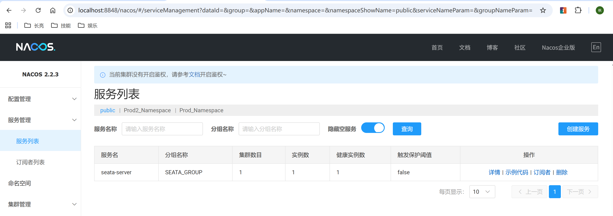

    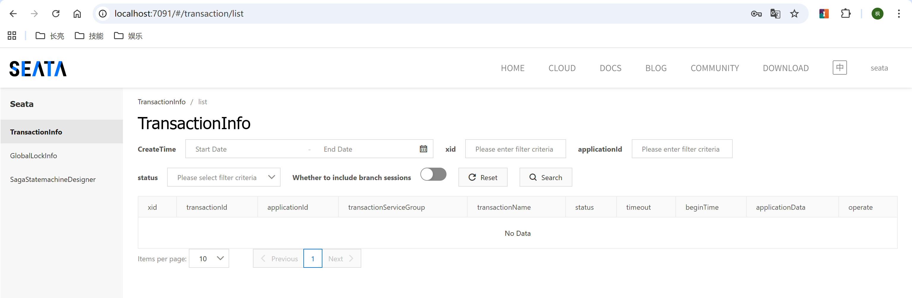

### 分布式案例

#### 业务与数据库准备

准备样例，订单 + 库存 + 账户，需要 3 个业务数据库 MySQL 准备

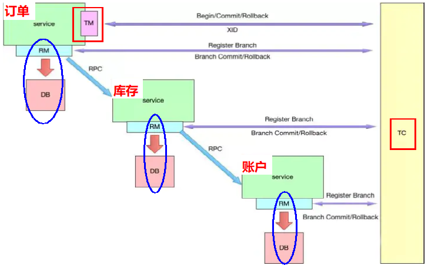

三个数据库分别为：

- seata_order：订单数据库 `CREATE DATABASE seata_order;`

    ```sql
    CREATE TABLE seata_order.t_order
    (
        `id`         BIGINT(11) NOT NULL AUTO_INCREMENT PRIMARY KEY,
        `user_id`    BIGINT(11)     DEFAULT NULL COMMENT '用户id',
        `product_id` BIGINT(11)     DEFAULT NULL COMMENT '产品id',
        `count`      INT(11)        DEFAULT NULL COMMENT '数量',
        `money`      DECIMAL(11, 0) DEFAULT NULL COMMENT '金额',
        `status`     INT(1)         DEFAULT NULL COMMENT '订单状态: 0:创建中; 1:已完结'
    ) ENGINE = INNODB
      AUTO_INCREMENT = 1
      DEFAULT CHARSET = utf8;
    ```

- seata_storage：库存数据库 `CREATE DATABASE seata_storage;`

    ```sql
    CREATE TABLE seata_storage.t_storage
    (
        `id`         BIGINT(11) NOT NULL AUTO_INCREMENT PRIMARY KEY,
        `product_id` BIGINT(11) DEFAULT NULL COMMENT '产品id',
        `total`      INT(11)    DEFAULT NULL COMMENT '总库存',
        `used`       INT(11)    DEFAULT NULL COMMENT '已用库存',
        `residue`    INT(11)    DEFAULT NULL COMMENT '剩余库存'
    ) ENGINE = INNODB
      AUTO_INCREMENT = 1
      DEFAULT CHARSET = utf8;
    
    INSERT INTO seata_storage.t_storage(`id`, `product_id`, `total`, `used`, `residue`)
    VALUES ('1', '1', '100', '0', '100');
    ```

- seata_account：账户数据库 `CREATE DATABASE seata_account;`

    ```sql
    CREATE TABLE seata_account.t_account
    (
        `id`      BIGINT(11) NOT NULL AUTO_INCREMENT PRIMARY KEY COMMENT 'id',
        `user_id` BIGINT(11)     DEFAULT NULL COMMENT '用户id',
        `total`   DECIMAL(10, 0) DEFAULT NULL COMMENT '总额度',
        `used`    DECIMAL(10, 0) DEFAULT NULL COMMENT '已用账户余额',
        `residue` DECIMAL(10, 0) DEFAULT '0' COMMENT '剩余可用额度'
    ) ENGINE = INNODB
      AUTO_INCREMENT = 2
      DEFAULT CHARSET = utf8;
    
    INSERT INTO seata_account.t_account(`id`, `user_id`, `total`, `used`, `residue`)
    VALUES ('1', '1', '1000', '0', '1000');
    ```

然后在各自的库下面分别建立 `undo_log` [回滚日志表](https://github.com/apache/incubator-seata/blob/2.x/script/client/at/db/mysql.sql)，此表为 AT 模式下必须的，其余模式下不需要

```sql
CREATE TABLE IF NOT EXISTS `undo_log`
(
    `branch_id`     BIGINT       NOT NULL COMMENT 'branch transaction id',
    `xid`           VARCHAR(128) NOT NULL COMMENT 'global transaction id',
    `context`       VARCHAR(128) NOT NULL COMMENT 'undo_log context,such as serialization',
    `rollback_info` LONGBLOB     NOT NULL COMMENT 'rollback info',
    `log_status`    INT(11)      NOT NULL COMMENT '0:normal status,1:defense status',
    `log_created`   DATETIME(6)  NOT NULL COMMENT 'create datetime',
    `log_modified`  DATETIME(6)  NOT NULL COMMENT 'modify datetime',
    UNIQUE KEY `ux_undo_log` (`xid`, `branch_id`)
) ENGINE = InnoDB
  AUTO_INCREMENT = 1
  DEFAULT CHARSET = utf8mb4 COMMENT ='AT transaction mode undo table';
ALTER TABLE `undo_log`
    ADD INDEX `ix_log_created` (`log_created`);
```

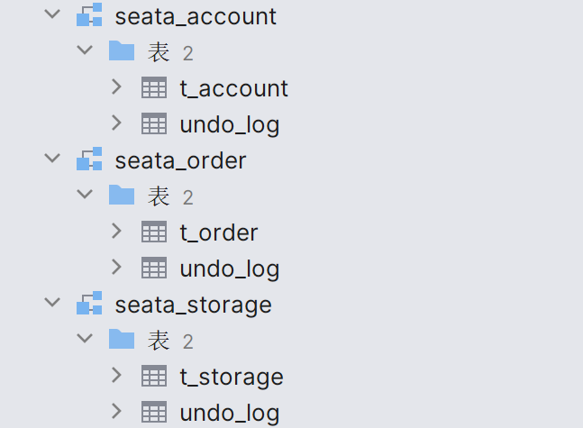

#### 代码样例

1. 修改 cloud-api-commons 的 feign 接口

    ```java
    @FeignClient(value = "seata-storage-service")
    public interface StorageFeignApi
    {
        /**
         * 扣减库存
         */
        @PostMapping(value = "/storage/decrease")
        ResultData decrease(@RequestParam("productId") Long productId, @RequestParam("count") Integer count);
    }
    ```

    ```java
    @FeignClient(value = "seata-account-service")
    public interface AccountFeignApi
    {
        //扣减账户余额
        @PostMapping("/account/decrease")
        ResultData decrease(@RequestParam("userId") Long userId, @RequestParam("money") Long money);
    }
    ```

1. 新建订单微服务 seata-order-service2001

    增加 pom 依赖

    <details>

    ```xml
    <dependencies>
        <!-- nacos -->
        <dependency>
            <groupId>com.alibaba.cloud</groupId>
            <artifactId>spring-cloud-starter-alibaba-nacos-discovery</artifactId>
        </dependency>
        <!--alibaba-seata-->
        <dependency>
            <groupId>com.alibaba.cloud</groupId>
            <artifactId>spring-cloud-starter-alibaba-seata</artifactId>
        </dependency>
        <!--openfeign-->
        <dependency>
            <groupId>org.springframework.cloud</groupId>
            <artifactId>spring-cloud-starter-openfeign</artifactId>
        </dependency>
        <!--loadbalancer-->
        <dependency>
            <groupId>org.springframework.cloud</groupId>
            <artifactId>spring-cloud-starter-loadbalancer</artifactId>
        </dependency>
        <!--cloud-api-commons-->
        <dependency>
            <groupId>com.colirx.cloud</groupId>
            <artifactId>cloud-api-commons</artifactId>
            <version>1.0-SNAPSHOT</version>
        </dependency>
        <!--web + actuator-->
        <dependency>
            <groupId>org.springframework.boot</groupId>
            <artifactId>spring-boot-starter-web</artifactId>
        </dependency>
        <dependency>
            <groupId>org.springframework.boot</groupId>
            <artifactId>spring-boot-starter-actuator</artifactId>
        </dependency>
        <!--SpringBoot集成druid连接池-->
        <dependency>
            <groupId>com.alibaba</groupId>
            <artifactId>druid-spring-boot-starter</artifactId>
        </dependency>
        <!-- Swagger3 调用方式 http://你的主机IP地址:5555/swagger-ui/index.html -->
        <dependency>
            <groupId>org.springdoc</groupId>
            <artifactId>springdoc-openapi-starter-webmvc-ui</artifactId>
        </dependency>
        <!--mybatis和springboot整合-->
        <dependency>
            <groupId>org.mybatis.spring.boot</groupId>
            <artifactId>mybatis-spring-boot-starter</artifactId>
        </dependency>
        <!--Mysql数据库驱动8 -->
        <dependency>
            <groupId>mysql</groupId>
            <artifactId>mysql-connector-java</artifactId>
        </dependency>
        <!--persistence-->
        <dependency>
            <groupId>javax.persistence</groupId>
            <artifactId>persistence-api</artifactId>
        </dependency>
        <!--通用Mapper4-->
        <dependency>
            <groupId>tk.mybatis</groupId>
            <artifactId>mapper</artifactId>
        </dependency>
        <!--hutool-->
        <dependency>
            <groupId>cn.hutool</groupId>
            <artifactId>hutool-all</artifactId>
        </dependency>
        <!-- fastjson2 -->
        <dependency>
            <groupId>com.alibaba.fastjson2</groupId>
            <artifactId>fastjson2</artifactId>
        </dependency>
        <!--lombok-->
        <dependency>
            <groupId>org.projectlombok</groupId>
            <artifactId>lombok</artifactId>
            <version>1.18.28</version>
            <scope>provided</scope>
        </dependency>
        <!--test-->
        <dependency>
            <groupId>org.springframework.boot</groupId>
            <artifactId>spring-boot-starter-test</artifactId>
            <scope>test</scope>
        </dependency>
    </dependencies>
    ```

    </details>

    增加配置

    <details>

    ```yaml
    server:
      port: 2001
    
    spring:
      application:
        name: seata-order-service
      cloud:
        nacos:
          discovery:
            server-addr: localhost:8848         #Nacos服务注册中心地址
    # ==========applicationName + druid-mysql8 driver===================
      datasource:
        type: com.alibaba.druid.pool.DruidDataSource
        driver-class-name: com.mysql.cj.jdbc.Driver
        url: jdbc:mysql://ubuntu_base_node:3306/seata_order?characterEncoding=utf8&useSSL=false&serverTimezone=GMT%2B8&rewriteBatchedStatements=true&allowPublicKeyRetrieval=true
        username: root
        password: root
    # ========================mybatis===================
    mybatis:
      mapper-locations: classpath:mapper/*.xml
      type-aliases-package: com.colirx.cloud.pojo
      configuration:
        map-underscore-to-camel-case: true
    
    # ========================seata===================
    seata:
      registry:
        type: nacos
        nacos:
          server-addr: 127.0.0.1:8848
          namespace: ""
          group: SEATA_GROUP
          application: seata-server
      tx-service-group: default_tx_group # 事务组，由它获得TC服务的集群名称
      service:
        vgroup-mapping: # 点击源码分析
          default_tx_group: default # 事务组与TC服务集群的映射关系
      data-source-proxy-mode: AT
    
    logging:
      level:
        io:
          seata: info
      config: classpath:logback.xml
    ```

    </details>

    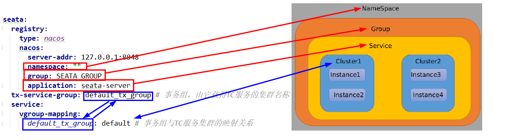

    所以 nacos 新建配置项

    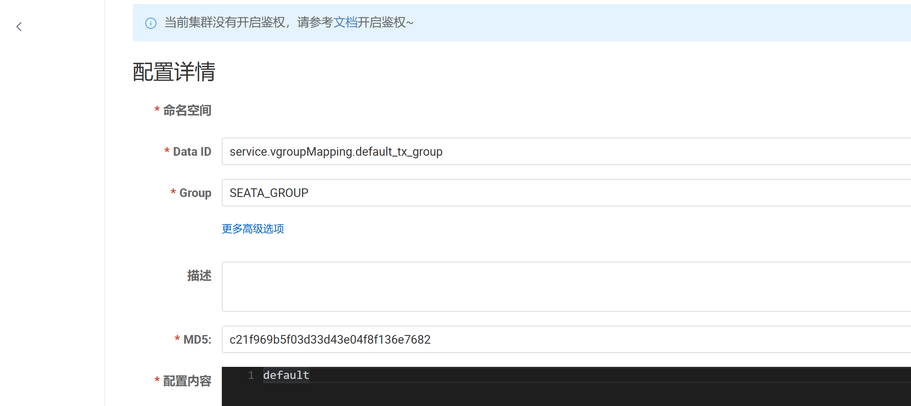

    主启动
    
    tk.mybatis 是 mybatis 的一个高级插件
    
    通过反射机制自动生成单表操作的SQL语句，支持多种主键生成策略（自增主键、UUID、Oracle序列等），并提供丰富的注解配置实体类与数据库表的映射关系

    但是现在已经不维护了，而且是个人项目，建议使用其他增强框架

    ```text
    开始选择
        ↓
    是否需要最快上手速度？
        ├── 是 → 选择 **MyBatis Plus**
        │
        ├── 否 → 是否在Spring生态中？
        │   ├── 是 → 是否重视类型安全？
        │   │   ├── 是 → 选择 **Spring Data JPA + QueryDSL**
        │   │   └── 否 → 选择 **Spring Data JPA**
        │   │
        │   └── 否 → 是否经常写复杂SQL？
        │       ├── 是 → 选择 **jOOQ**
        │       └── 否 → 选择 **MyBatis Dynamic SQL**
        │
        └── 不确定 → **默认选择 MyBatis Plus**
    ```

    <details>

    ```java
    @SpringBootApplication
    // import tk.mybatis.spring.annotation.MapperScan;
    @MapperScan("com.colirx.cloud.mapper")
    @EnableDiscoveryClient // 服务注册和发现
    @EnableFeignClients
    public class SeataOrderMainApp2001 {
        public static void main(String[] args) {
            SpringApplication.run(SeataOrderMainApp2001.class, args);
        }
    }
    ```

    </details>

    业务类

    <details>

    ```java
    @Table(name = "t_order")
    @ToString
    public class Order implements Serializable
    {
        @Id
        @GeneratedValue(generator = "JDBC")
        private Long id;
    
        /**
         * 用户id
         */
        @Column(name = "user_id")
        private Long userId;
    
        /**
         * 产品id
         */
        @Column(name = "product_id")
        private Long productId;
    
        /**
         * 数量
         */
        private Integer count;
    
        /**
         * 金额
         */
        private Long money;
    
        /**
         * 订单状态：0：创建中；1：已完结
         */
        private Integer status;
    
        /**
         * @return id
         */
        public Long getId() {
            return id;
        }
    
        /**
         * @param id
         */
        public void setId(Long id) {
            this.id = id;
        }
    
        /**
         * 获取用户id
         *
         * @return user_id - 用户id
         */
        public Long getUserId() {
            return userId;
        }
    
        /**
         * 设置用户id
         *
         * @param userId 用户id
         */
        public void setUserId(Long userId) {
            this.userId = userId;
        }
    
        /**
         * 获取产品id
         *
         * @return product_id - 产品id
         */
        public Long getProductId() {
            return productId;
        }
    
        /**
         * 设置产品id
         *
         * @param productId 产品id
         */
        public void setProductId(Long productId) {
            this.productId = productId;
        }
    
        /**
         * 获取数量
         *
         * @return count - 数量
         */
        public Integer getCount() {
            return count;
        }
    
        /**
         * 设置数量
         *
         * @param count 数量
         */
        public void setCount(Integer count) {
            this.count = count;
        }
    
        /**
         * 获取金额
         *
         * @return money - 金额
         */
        public Long getMoney() {
            return money;
        }
    
        /**
         * 设置金额
         *
         * @param money 金额
         */
        public void setMoney(Long money) {
            this.money = money;
        }
    
        /**
         * 获取订单状态：0：创建中；1：已完结
         *
         * @return status - 订单状态：0：创建中；1：已完结
         */
        public Integer getStatus() {
            return status;
        }
    
        /**
         * 设置订单状态：0：创建中；1：已完结
         *
         * @param status 订单状态：0：创建中；1：已完结
         */
        public void setStatus(Integer status) {
            this.status = status;
        }
    
    
        @Override
        public String toString()
        {
            return "Order{" +
                    "id=" + id +
                    ", userId=" + userId +
                    ", productId=" + productId +
                    ", count=" + count +
                    ", money=" + money +
                    ", status=" + status +
                    '}';
        }
    }
    ```

    </details>

    mapper.OrderMapper.java

    ```java
    import tk.mybatis.mapper.common.Mapper;
    public interface OrderMapper extends Mapper<Order> {
    }
    ```

    resources/mapper/OrderMapper.xml

    ```xml
    <?xml version="1.0" encoding="UTF-8"?>
    <!DOCTYPE mapper PUBLIC "-//mybatis.org//DTD Mapper 3.0//EN" "http://mybatis.org/dtd/mybatis-3-mapper.dtd">
    <mapper namespace="com.colirx.cloud.mapper.OrderMapper">
        <resultMap id="BaseResultMap" type="com.colirx.cloud.pojo.Order">
            <!--
            WARNING - @mbg.generated
            -->
            <id column="id" jdbcType="BIGINT" property="id" />
            <result column="user_id" jdbcType="BIGINT" property="userId" />
            <result column="product_id" jdbcType="BIGINT" property="productId" />
            <result column="count" jdbcType="INTEGER" property="count" />
            <result column="money" jdbcType="DECIMAL" property="money" />
            <result column="status" jdbcType="INTEGER" property="status" />
        </resultMap>
    
    </mapper>
    ```

    service.OrderService.java

    ```java
    public interface OrderService {

        /**
        * 创建订单
        */
        void create(Order order);
    }
    ```

    service.impl.OrderServiceImpl.java

    <details>

    ```java
    @Slf4j
    @Service
    public class OrderServiceImpl implements OrderService {
        @Resource
        private OrderMapper orderMapper;
        @Resource// 订单微服务通过OpenFeign去调用库存微服务
        private StorageFeignApi storageFeignApi;
        @Resource// 订单微服务通过OpenFeign去调用账户微服务
        private AccountFeignApi accountFeignApi;
    
    
        @Override
        @GlobalTransactional(name = "zzyy-create-order", rollbackFor = Exception.class) // AT
        //@GlobalTransactional @Transactional(rollbackFor = Exception.class) //XA
        public void create(Order order) {
    
            // xid检查
            String xid = RootContext.getXID();
    
            // 1. 新建订单
            log.info("==================>开始新建订单" + "\t" + "xid_order:" + xid);
            // 订单状态status：0：创建中；1：已完结
            order.setStatus(0);
            int result = orderMapper.insertSelective(order);
    
            // 插入订单成功后获得插入mysql的实体对象
            Order orderFromDB = null;
            if (result > 0) {
                orderFromDB = orderMapper.selectOne(order);
                // orderFromDB = orderMapper.selectByPrimaryKey(order.getId());
                log.info("-------> 新建订单成功，orderFromDB info: " + orderFromDB);
                System.out.println();
                // 2. 扣减库存
                log.info("-------> 订单微服务开始调用Storage库存，做扣减count");
                storageFeignApi.decrease(orderFromDB.getProductId(), orderFromDB.getCount());
                log.info("-------> 订单微服务结束调用Storage库存，做扣减完成");
                System.out.println();
                // 3. 扣减账号余额
                log.info("-------> 订单微服务开始调用Account账号，做扣减money");
                accountFeignApi.decrease(orderFromDB.getUserId(), orderFromDB.getMoney());
                log.info("-------> 订单微服务结束调用Account账号，做扣减完成");
                System.out.println();
                // 4. 修改订单状态
                // 订单状态status：0：创建中；1：已完结
                log.info("-------> 修改订单状态");
                orderFromDB.setStatus(1);
    
                Example whereCondition = new Example(Order.class);
                Example.Criteria criteria = whereCondition.createCriteria();
                criteria.andEqualTo("userId", orderFromDB.getUserId());
                criteria.andEqualTo("status", 0);
    
                int updateResult = orderMapper.updateByExampleSelective(orderFromDB, whereCondition);
    
                log.info("-------> 修改订单状态完成" + "\t" + updateResult);
                log.info("-------> orderFromDB info: " + orderFromDB);
            }
            System.out.println();
            log.info("==================>结束新建订单" + "\t" + "xid_order:" + xid);
    
        }
    }
    ```

    </details>

    controller

    <details>

    ```java
    @RestController
    public class OrderController {
    
        @Resource
        private OrderService orderService;
    
        /**
         * 创建订单
         */
        @GetMapping("/order/create")
        public ResultData create(Order order) {
            orderService.create(order);
            return ResultData.success(order);
        }
    }
    ```

    </details>

1. 库存微服务 seata-storage-service2002

    依赖

    <details>

    ```xml
    <dependencies>
        <!-- nacos -->
        <dependency>
            <groupId>com.alibaba.cloud</groupId>
            <artifactId>spring-cloud-starter-alibaba-nacos-discovery</artifactId>
        </dependency>
        <!--alibaba-seata-->
        <dependency>
            <groupId>com.alibaba.cloud</groupId>
            <artifactId>spring-cloud-starter-alibaba-seata</artifactId>
        </dependency>
        <!--openfeign-->
        <dependency>
            <groupId>org.springframework.cloud</groupId>
            <artifactId>spring-cloud-starter-openfeign</artifactId>
        </dependency>
        <!--loadbalancer-->
        <dependency>
            <groupId>org.springframework.cloud</groupId>
            <artifactId>spring-cloud-starter-loadbalancer</artifactId>
        </dependency>
        <!--cloud_commons_utils-->
        <dependency>
            <groupId>com.colirx</groupId>
            <artifactId>cloud-api-commons</artifactId>
            <version>1.0-SNAPSHOT</version>
        </dependency>
        <!--web + actuator-->
        <dependency>
            <groupId>org.springframework.boot</groupId>
            <artifactId>spring-boot-starter-web</artifactId>
        </dependency>
        <dependency>
            <groupId>org.springframework.boot</groupId>
            <artifactId>spring-boot-starter-actuator</artifactId>
        </dependency>
        <!--SpringBoot集成druid连接池-->
        <dependency>
            <groupId>com.alibaba</groupId>
            <artifactId>druid-spring-boot-starter</artifactId>
        </dependency>
        <!-- Swagger3 调用方式 http://你的主机IP地址:5555/swagger-ui/index.html -->
        <dependency>
            <groupId>org.springdoc</groupId>
            <artifactId>springdoc-openapi-starter-webmvc-ui</artifactId>
        </dependency>
        <!--mybatis和springboot整合-->
        <dependency>
            <groupId>org.mybatis.spring.boot</groupId>
            <artifactId>mybatis-spring-boot-starter</artifactId>
        </dependency>
        <!--Mysql数据库驱动8 -->
        <dependency>
            <groupId>mysql</groupId>
            <artifactId>mysql-connector-java</artifactId>
        </dependency>
        <!--persistence-->
        <dependency>
            <groupId>javax.persistence</groupId>
            <artifactId>persistence-api</artifactId>
        </dependency>
        <!--通用Mapper4-->
        <dependency>
            <groupId>tk.mybatis</groupId>
            <artifactId>mapper</artifactId>
        </dependency>
        <!--hutool-->
        <dependency>
            <groupId>cn.hutool</groupId>
            <artifactId>hutool-all</artifactId>
        </dependency>
        <!-- fastjson2 -->
        <dependency>
            <groupId>com.alibaba.fastjson2</groupId>
            <artifactId>fastjson2</artifactId>
        </dependency>
        <!--lombok-->
        <dependency>
            <groupId>org.projectlombok</groupId>
            <artifactId>lombok</artifactId>
            <version>1.18.28</version>
            <scope>provided</scope>
        </dependency>
        <!--test-->
        <dependency>
            <groupId>org.springframework.boot</groupId>
            <artifactId>spring-boot-starter-test</artifactId>
            <scope>test</scope>
        </dependency>
    </dependencies>
    ```

    </details>

    配置项

    <details>

    ```yaml
    server:
      port: 2002
    
    spring:
      application:
        name: seata-storage-service
      cloud:
        nacos:
          discovery:
            server-addr: localhost:8848         #Nacos服务注册中心地址
      # ==========applicationName + druid-mysql8 driver===================
      datasource:
        type: com.alibaba.druid.pool.DruidDataSource
        driver-class-name: com.mysql.cj.jdbc.Driver
        url: jdbc:mysql://ubuntu_base_node:3306/seata_storage?characterEncoding=utf8&useSSL=false&serverTimezone=GMT%2B8&rewriteBatchedStatements=true&allowPublicKeyRetrieval=true
        username: root
        password: root
    # ========================mybatis===================
    mybatis:
      mapper-locations: classpath:mapper/*.xml
      type-aliases-package: com.colirx.cloud.pojo
      configuration:
        map-underscore-to-camel-case: true
    # ========================seata===================
    seata:
      registry:
        type: nacos
        nacos:
          server-addr: 127.0.0.1:8848
          namespace: ""
          group: SEATA_GROUP
          application: seata-server
      tx-service-group: default_tx_group # 事务组，由它获得TC服务的集群名称
      service:
        vgroup-mapping:
          default_tx_group: default # 事务组与TC服务集群的映射关系
      data-source-proxy-mode: AT
    
    logging:
      level:
        io:
          seata: info
      config: classpath:logback.xml
    ```

    </details>

    主启动类

    ```java
    @SpringBootApplication
    // import tk.mybatis.spring.annotation.MapperScan;
    @MapperScan("com.colirx.cloud.mapper")
    @EnableDiscoveryClient // 服务注册和发现
    @EnableFeignClients
    public class SeataStorageMainApp2002
    {
        public static void main(String[] args)
        {
            SpringApplication.run(SeataStorageMainApp2002.class,args);
        }
    }
    ```

    业务类

    pojo

    <details>

    ```java
    @Table(name = "t_storage")
    public class Storage implements Serializable {
        @Id
        @GeneratedValue(generator = "JDBC")
        private Long id;
    
        /**
         * 产品id
         */
        @Column(name = "product_id")
        private Long productId;
    
        /**
         * 总库存
         */
        private Integer total;
    
        /**
         * 已用库存
         */
        private Integer used;
    
        /**
         * 剩余库存
         */
        private Integer residue;
    
        /**
         * @return id
         */
        public Long getId() {
            return id;
        }
    
        /**
         * @param id
         */
        public void setId(Long id) {
            this.id = id;
        }
    
        /**
         * 获取产品id
         *
         * @return product_id - 产品id
         */
        public Long getProductId() {
            return productId;
        }
    
        /**
         * 设置产品id
         *
         * @param productId 产品id
         */
        public void setProductId(Long productId) {
            this.productId = productId;
        }
    
        /**
         * 获取总库存
         *
         * @return total - 总库存
         */
        public Integer getTotal() {
            return total;
        }
    
        /**
         * 设置总库存
         *
         * @param total 总库存
         */
        public void setTotal(Integer total) {
            this.total = total;
        }
    
        /**
         * 获取已用库存
         *
         * @return used - 已用库存
         */
        public Integer getUsed() {
            return used;
        }
    
        /**
         * 设置已用库存
         *
         * @param used 已用库存
         */
        public void setUsed(Integer used) {
            this.used = used;
        }
    
        /**
         * 获取剩余库存
         *
         * @return residue - 剩余库存
         */
        public Integer getResidue() {
            return residue;
        }
    
        /**
         * 设置剩余库存
         *
         * @param residue 剩余库存
         */
        public void setResidue(Integer residue) {
            this.residue = residue;
        }
    
        @Override
        public String toString() {
            return "Storage{" +
                "id=" + id +
                ", productId=" + productId +
                ", total=" + total +
                ", used=" + used +
                ", residue=" + residue +
                '}';
        }
    }
    ```

    </details>

    mapper.StorageMapper

    ```java
    import com.colirx.cloud.pojo.Storage;
    import org.apache.ibatis.annotations.Param;
    import tk.mybatis.mapper.common.Mapper;
    
    public interface StorageMapper extends Mapper<Storage> {
        /**
         * 扣减库存
         */
        void decrease(@Param("productId") Long productId, @Param("count") Integer count);
    }
    ```

    resources/mapper/StorageMapper.xml

    <details>

    ```xml
    <?xml version="1.0" encoding="UTF-8"?>
    <!DOCTYPE mapper PUBLIC "-//mybatis.org//DTD Mapper 3.0//EN" "http://mybatis.org/dtd/mybatis-3-mapper.dtd">
    <mapper namespace="com.colirx.cloud.mapper.StorageMapper">
        <resultMap id="BaseResultMap" type="com.colirx.cloud.pojo.Storage">
            <!--
              WARNING - @mbg.generated
            -->
            <id column="id" jdbcType="BIGINT" property="id" />
            <result column="product_id" jdbcType="BIGINT" property="productId" />
            <result column="total" jdbcType="INTEGER" property="total" />
            <result column="used" jdbcType="INTEGER" property="used" />
            <result column="residue" jdbcType="INTEGER" property="residue" />
        </resultMap>
    
        <update id="decrease">
            UPDATE
                t_storage
            SET
                used = used + #{count},
                residue = residue - #{count}
            WHERE product_id = #{productId}
        </update>
    
    </mapper>
    ```

    </details>

    service.StorageService

    ```java
    public interface StorageService {
        /**
         * 扣减库存
         */
        void decrease(Long productId, Integer count);
    }
    ```

    service.impl.StorageServiceImpl

    ```java
    @Service
    @Slf4j
    public class StorageServiceImpl implements StorageService
    {
    
        @Resource
        private StorageMapper storageMapper;
    
        /**
         * 扣减库存
         */
        @Override
        public void decrease(Long productId, Integer count) {
            log.info("------->storage-service中扣减库存开始");
            storageMapper.decrease(productId,count);
            log.info("------->storage-service中扣减库存结束");
        }
    }
    ```

    controller

    ```java
    @RestController
    public class StorageController
    {
        @Resource
        private StorageService storageService;
    
        /**
         * 扣减库存
         */
        @RequestMapping("/storage/decrease")
        public ResultData decrease(@RequestParam("productId") Long productId, @RequestParam("count") Integer count) {
    
            storageService.decrease(productId, count);
            return ResultData.success("扣减库存成功!");
        }
    }
    ```

1. 账户微服务 seata-account-service2003

    依赖

    <details>

    ```xml
    <dependencies>
        <!-- nacos -->
        <dependency>
            <groupId>com.alibaba.cloud</groupId>
            <artifactId>spring-cloud-starter-alibaba-nacos-discovery</artifactId>
        </dependency>
        <!--alibaba-seata-->
        <dependency>
            <groupId>com.alibaba.cloud</groupId>
            <artifactId>spring-cloud-starter-alibaba-seata</artifactId>
        </dependency>
        <!--openfeign-->
        <dependency>
            <groupId>org.springframework.cloud</groupId>
            <artifactId>spring-cloud-starter-openfeign</artifactId>
        </dependency>
        <!--loadbalancer-->
        <dependency>
            <groupId>org.springframework.cloud</groupId>
            <artifactId>spring-cloud-starter-loadbalancer</artifactId>
        </dependency>
        <!--cloud_commons_utils-->
        <dependency>
            <groupId>com.colirx</groupId>
            <artifactId>cloud-api-commons</artifactId>
            <version>1.0-SNAPSHOT</version>
        </dependency>
        <!--web + actuator-->
        <dependency>
            <groupId>org.springframework.boot</groupId>
            <artifactId>spring-boot-starter-web</artifactId>
        </dependency>
        <dependency>
            <groupId>org.springframework.boot</groupId>
            <artifactId>spring-boot-starter-actuator</artifactId>
        </dependency>
        <!--SpringBoot集成druid连接池-->
        <dependency>
            <groupId>com.alibaba</groupId>
            <artifactId>druid-spring-boot-starter</artifactId>
        </dependency>
        <!-- Swagger3 调用方式 http://你的主机IP地址:5555/swagger-ui/index.html -->
        <dependency>
            <groupId>org.springdoc</groupId>
            <artifactId>springdoc-openapi-starter-webmvc-ui</artifactId>
        </dependency>
        <!--mybatis和springboot整合-->
        <dependency>
            <groupId>org.mybatis.spring.boot</groupId>
            <artifactId>mybatis-spring-boot-starter</artifactId>
        </dependency>
        <!--Mysql数据库驱动8 -->
        <dependency>
            <groupId>mysql</groupId>
            <artifactId>mysql-connector-java</artifactId>
        </dependency>
        <!--persistence-->
        <dependency>
            <groupId>javax.persistence</groupId>
            <artifactId>persistence-api</artifactId>
        </dependency>
        <!--通用Mapper4-->
        <dependency>
            <groupId>tk.mybatis</groupId>
            <artifactId>mapper</artifactId>
        </dependency>
        <!--hutool-->
        <dependency>
            <groupId>cn.hutool</groupId>
            <artifactId>hutool-all</artifactId>
        </dependency>
        <!-- fastjson2 -->
        <dependency>
            <groupId>com.alibaba.fastjson2</groupId>
            <artifactId>fastjson2</artifactId>
        </dependency>
        <!--lombok-->
        <dependency>
            <groupId>org.projectlombok</groupId>
            <artifactId>lombok</artifactId>
            <version>1.18.28</version>
            <scope>provided</scope>
        </dependency>
        <!--test-->
        <dependency>
            <groupId>org.springframework.boot</groupId>
            <artifactId>spring-boot-starter-test</artifactId>
            <scope>test</scope>
        </dependency>
    </dependencies>
    ```

    </details>

    配置

    <details>

    ```yaml
    server:
      port: 2003
    
    spring:
      application:
        name: seata-account-service
      cloud:
        nacos:
          discovery:
            server-addr: localhost:8848         #Nacos服务注册中心地址
      # ==========applicationName + druid-mysql8 driver===================
      datasource:
        type: com.alibaba.druid.pool.DruidDataSource
        driver-class-name: com.mysql.cj.jdbc.Driver
        url: jdbc:mysql://ubuntu_base_node:3306/seata_account?characterEncoding=utf8&useSSL=false&serverTimezone=GMT%2B8&rewriteBatchedStatements=true&allowPublicKeyRetrieval=true
        username: root
        password: root
    # ========================mybatis===================
    mybatis:
      mapper-locations: classpath:mapper/*.xml
      type-aliases-package: com.colirx.cloud.pojo
      configuration:
        map-underscore-to-camel-case: true
    
    
    
    # ========================seata===================
    seata:
      registry:
        type: nacos
        nacos:
          server-addr: 127.0.0.1:8848
          namespace: ""
          group: SEATA_GROUP
          application: seata-server
      tx-service-group: default_tx_group # 事务组，由它获得TC服务的集群名称
      service:
        vgroup-mapping:
          default_tx_group: default # 事务组与TC服务集群的映射关系
      data-source-proxy-mode: AT
    
    logging:
      level:
        io:
          seata: info
      config: classpath:logback.xml
    ```

    </details>

    主启动

    ```java
    @EnableDiscoveryClient
    @EnableFeignClients
    // import tk.mybatis.spring.annotation.MapperScan;
    @MapperScan("com.colirx.cloud.mapper")
    @SpringBootApplication
    public class SeataAccountMainApp2003
    {
        public static void main(String[] args)
        {
            SpringApplication.run(SeataAccountMainApp2003.class,args);
        }
    }
    ```

    pojo

    <details>

    ```java
    @Table(name = "t_account")
    public class Account implements Serializable {
        /**
         * id
         */
        @Id
        @GeneratedValue(generator = "JDBC")
        private Long id;
    
        /**
         * 用户id
         */
        @Column(name = "user_id")
        private Long userId;
    
        /**
         * 总额度
         */
        private Long total;
    
        /**
         * 已用余额
         */
        private Long used;
    
        /**
         * 剩余可用额度
         */
        private Long residue;
    
        /**
         * 获取id
         *
         * @return id - id
         */
        public Long getId() {
            return id;
        }
    
        /**
         * 设置id
         *
         * @param id id
         */
        public void setId(Long id) {
            this.id = id;
        }
    
        /**
         * 获取用户id
         *
         * @return user_id - 用户id
         */
        public Long getUserId() {
            return userId;
        }
    
        /**
         * 设置用户id
         *
         * @param userId 用户id
         */
        public void setUserId(Long userId) {
            this.userId = userId;
        }
    
        /**
         * 获取总额度
         *
         * @return total - 总额度
         */
        public Long getTotal() {
            return total;
        }
    
        /**
         * 设置总额度
         *
         * @param total 总额度
         */
        public void setTotal(Long total) {
            this.total = total;
        }
    
        /**
         * 获取已用余额
         *
         * @return used - 已用余额
         */
        public Long getUsed() {
            return used;
        }
    
        /**
         * 设置已用余额
         *
         * @param used 已用余额
         */
        public void setUsed(Long used) {
            this.used = used;
        }
    
        /**
         * 获取剩余可用额度
         *
         * @return residue - 剩余可用额度
         */
        public Long getResidue() {
            return residue;
        }
    
        /**
         * 设置剩余可用额度
         *
         * @param residue 剩余可用额度
         */
        public void setResidue(Long residue) {
            this.residue = residue;
        }
    
        @Override
        public String toString() {
            return "Account{" +
                "id=" + id +
                ", userId=" + userId +
                ", total=" + total +
                ", used=" + used +
                ", residue=" + residue +
                '}';
        }
    }
    ```

    </details>

    mapper.AccountMapper

    ```java
    import com.colirx.cloud.pojo.Account;
    import org.apache.ibatis.annotations.Param;
    import tk.mybatis.mapper.common.Mapper;
    
    public interface AccountMapper extends Mapper<Account>
    {
    
        /**
         * @param userId
         * @param money 本次消费金额
         */
        void decrease(@Param("userId") Long userId, @Param("money") Long money);
    }
    ```

    resources/mapper/AccountMapper.xml

    <details>

    ```xml
    <?xml version="1.0" encoding="UTF-8"?>
    <!DOCTYPE mapper PUBLIC "-//mybatis.org//DTD Mapper 3.0//EN" "http://mybatis.org/dtd/mybatis-3-mapper.dtd">
    <mapper namespace="com.colirx.cloud.mapper.AccountMapper">
        <resultMap id="BaseResultMap" type="com.colirx.cloud.pojo.Account">
            <!--
              WARNING - @mbg.generated
            -->
            <id column="id" jdbcType="BIGINT" property="id" />
            <result column="user_id" jdbcType="BIGINT" property="userId" />
            <result column="total" jdbcType="DECIMAL" property="total" />
            <result column="used" jdbcType="DECIMAL" property="used" />
            <result column="residue" jdbcType="DECIMAL" property="residue" />
        </resultMap>
    
    
        <!--
            money   本次消费金额
    
            t_account数据库表
            total总额度 = 累计已消费金额(used) + 剩余可用额度(residue)
        -->
        <update id="decrease">
            UPDATE
                t_account
            SET
                residue = residue - #{money},used = used + #{money}
            WHERE user_id = #{userId};
        </update>
    
    </mapper>
    ```

    </details>

    service.AccountService

    ```java
    import org.apache.ibatis.annotations.Param;
    
    public interface AccountService {
    
        /**
         * 扣减账户余额
         * @param userId 用户id
         * @param money 本次消费金额
         */
        void decrease(Long userId, Long money);
    }
    ```

    service.impl.AccountServiceImpl

    <details>

    ```java
    @Service
    @Slf4j
    public class AccountServiceImpl implements AccountService {
        @Resource
        AccountMapper accountMapper;
    
        /**
         * 扣减账户余额
         */
        @Override
        public void decrease(Long userId, Long money) {
            log.info("------->account-service中扣减账户余额开始");
    
            accountMapper.decrease(userId, money);
    
            // myTimeOut();
            // int age = 10/0;
            log.info("------->account-service中扣减账户余额结束");
        }
    
        /**
         * 模拟超时异常，全局事务回滚
         */
        private static void myTimeOut() {
            try {
                TimeUnit.SECONDS.sleep(65);
            } catch (InterruptedException e) {
                e.printStackTrace();
            }
        }
    }
    ```

    </details>

    controller

    <details>

    ```java
    @RestController
    public class AccountController {
    
        @Resource
        AccountService accountService;
    
        /**
         * 扣减账户余额
         */
        @RequestMapping("/account/decrease")
        public ResultData decrease(@RequestParam("userId") Long userId, @RequestParam("money") Long money){
            accountService.decrease(userId,money);
            return ResultData.success("扣减账户余额成功！");
        }
    }
    ```

    </details>

1. 测试

    启动 nacos、seata、服务 2001、服务 2002、服务 2003

    访问 `http://localhost:2001/order/create?userId=1&productId=1&count=10&money=100`

    会看到对应的数据库信息，然后加上时间等待和抛出异常，在 seata 后台会看到锁

    