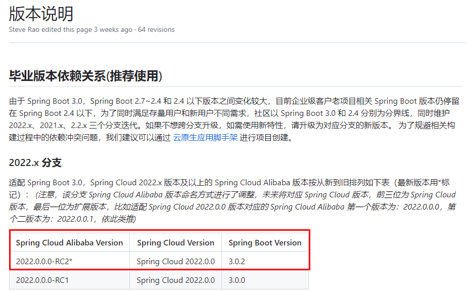
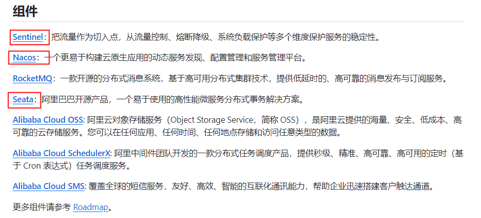
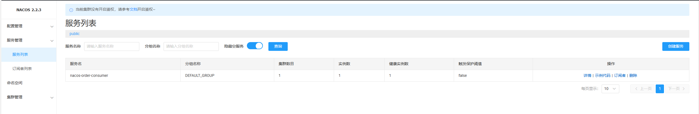

## 环境搭建

1. [SpringCloud Alibaba](https://spring.io/projects/spring-cloud-alibaba)，[官方文档](https://spring-cloud-alibaba-group.github.io/github-pages/2022/zh-cn/2022.0.0.0-RC2.html)，其中部分代码基于 SpringCloud Base 工程
2. SpringCloud Alibaba 依赖、必须组件

  

  


## Nacos

1. [Nacos](https://nacos.io/)：服务注册与发现、配置中心。首先通过官网上下载，为了保持一致，版本选择 [2.2.3](https://github.com/alibaba/nacos/releases/download/2.2.3/nacos-server-2.2.3.zip?spm=5238cd80.6a33be36.0.0.5eb11e5dmzcZYR&file=nacos-server-2.2.3.zip)
2. 按照官网的说法，首先进行单机运行：`startup.cmd -m standalone`，进入[网址](http://localhost:8848/nacos)，默认用户名密码为 `nacos`
3. 基于 base 工程创建子模块 `cloudalibaba-provider-payment9001`
4. 使用 pom

    ```xml
    <dependencies>
        <!--nacos-discovery-->
        <dependency>
            <groupId>com.alibaba.cloud</groupId>
            <artifactId>spring-cloud-starter-alibaba-nacos-discovery</artifactId>
        </dependency>
        <!--loadbalancer-->
        <dependency>
            <groupId>org.springframework.cloud</groupId>
            <artifactId>spring-cloud-starter-loadbalancer</artifactId>
        </dependency>
        <!--web + actuator-->
        <dependency>
            <groupId>org.springframework.boot</groupId>
            <artifactId>spring-boot-starter-web</artifactId>
        </dependency>
        <dependency>
            <groupId>org.springframework.boot</groupId>
            <artifactId>spring-boot-starter-actuator</artifactId>
        </dependency>
        <!--lombok-->
        <dependency>
            <groupId>org.projectlombok</groupId>
            <artifactId>lombok</artifactId>
            <optional>true</optional>
        </dependency>
    </dependencies>

    <build>
        <plugins>
            <plugin>
                <groupId>org.springframework.boot</groupId>
                <artifactId>spring-boot-maven-plugin</artifactId>
            </plugin>
        </plugins>
    </build>
    ```

5. application.yml

    ```yaml
    server:
      port: 83
    
    spring:
      application:
        name: nacos-order-consumer
      cloud:
        nacos:
          discovery:
            server-addr: localhost:8848
    # 消费者将要去访问的微服务名称(nacos微服务提供者叫什么就写什么)
    service-url:
      nacos-user-service: http://nacos-payment-provider
    ```

6. 主启动类

    ```java
    import org.springframework.boot.SpringApplication;
    import org.springframework.boot.autoconfigure.SpringBootApplication;
    import org.springframework.cloud.client.discovery.EnableDiscoveryClient;
    
    @EnableDiscoveryClient
    @SpringBootApplication
    public class Main83 {
        public static void main(String[] args) {
            SpringApplication.run(Main83.class, args);
        }
    }
    ```

7. controller

    ```java
    import jakarta.annotation.Resource;
    import org.springframework.beans.factory.annotation.Value;
    import org.springframework.web.bind.annotation.GetMapping;
    import org.springframework.web.bind.annotation.PathVariable;
    import org.springframework.web.bind.annotation.RestController;
    import org.springframework.web.client.RestTemplate;
    
    @RestController
    public class OrderNacosController {
        @Resource
        private RestTemplate restTemplate;
    
        @Value("${service-url.nacos-user-service}")
        private String serverURL;
    
        @GetMapping("/consumer/pay/nacos/{id}")
        public String paymentInfo(@PathVariable("id") Integer id) {
            String result = restTemplate.getForObject(serverURL + "/pay/nacos/" + id, String.class);
            return result + "\t" + "    我是OrderNacosController83调用者。。。。。。";
        }
    }
    ```

8. config

    ```java
    import org.springframework.cloud.client.loadbalancer.LoadBalanced;
    import org.springframework.context.annotation.Bean;
    import org.springframework.context.annotation.Configuration;
    import org.springframework.web.client.RestTemplate;
    
    @Configuration
    public class RestTemplateConfig
    {
        @Bean
        @LoadBalanced // 赋予RestTemplate负载均衡的能力
        public RestTemplate restTemplate()
        {
            return new RestTemplate();
        }
    }
    ```

9. 进入 Nacos，查看服务列表，已经可以看到注册进来了

    

TODO: 服务提供者进入服务中心