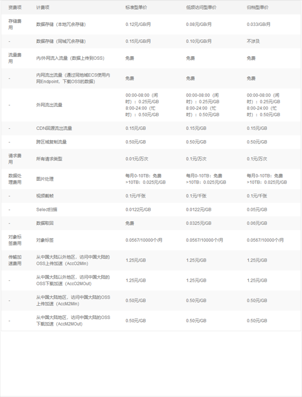
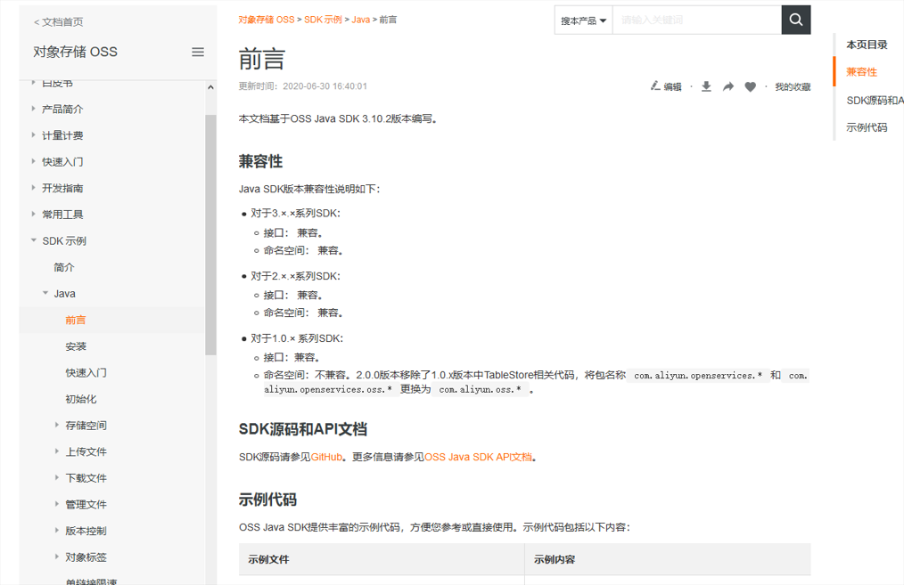

## 前言


## 对象存储OSS


为了解决海量数据存储和弹性扩容，项目中我们采用云存储的解决方案，阿里云的OSS存储


阿里的技术在国内是顶级的，所以在国内很多公司都会放到阿里OSS中


当然，OSS是收费的，但是没有达到一定的规模是不收费的，而且收费也非常便宜


## 开通申请


1、打开网站：[https://www.aliyun.com](https://www.aliyun.com)，登录/注册阿里云


2、最好在你的个人账户里充点钱，一两毛就行，要不然等会用不了会很尴尬

  


3、找到阿里的OSS


> 阿里云首页–>产品分类–>存储服务–>对象存储OSS
>


4、开通对象存储OSS

> 这个开通需要实名认证，它的简介很有意思
>
> 海量，安全，低成本，高可靠的云存储服务，提供99.9999999%的数据持久性，可以使用  RESTFUL API
>


5、收费标准




6、OSS管理控制台


> 1、首先创建Buckets，才能使用阿里云OSS，这个东西类似于建立文件夹

> 2、直接在控制台尝试传递文件

> 点击文件，会出现以上内容，有一个图片的下载地址，访问此网址即可下载
>


## 通过Java代码向OSS上传代码


1、创建OSS的许可证，阿里云会颁发ID和密钥


2、OSS文档查看


> [https://help.aliyun.com/document_detail/32008.html?spm=a2c4g.11186623.6.806.5f3f1c62Jakz63](https://help.aliyun.com/document_detail/32008.html?spm=a2c4g.11186623.6.806.5f3f1c62Jakz63)
>
> 
>


3、根据文档开始使用，首先安装依赖


```xml
<dependency>
    <groupId>com.aliyun.oss</groupId>
    <artifactId>aliyun-sdk-oss</artifactId>
    <version>3.10.2</version>
</dependency>
```


4、创建存储空间


```java
//你的bucket的地域节点
String endpoint = "https://oss-cn-hangzhou.aliyuncs.com";
// 阿里云主账号AccessKey拥有所有API的访问权限，风险很高。强烈建议您创建并使用RAM账号进行API访问或日常运维，请登录RAM控制台创建RAM账号。
String accessKeyId = "<yourAccessKeyId>";
String accessKeySecret = "<yourAccessKeySecret>";
String bucketName = "<yourBucketName>";

// 创建OSSClient实例。
OSS ossClient = new OSSClientBuilder().build(endpoint, accessKeyId, accessKeySecret);

// 创建存储空间。
ossClient.createBucket(bucketName);

// 关闭OSSClient。
ossClient.shutdown();
```


5、上传


```java
// Endpoint以杭州为例，其它Region请按实际情况填写。
String endpoint = "https://oss-cn-hangzhou.aliyuncs.com";
// 阿里云主账号AccessKey拥有所有API的访问权限，风险很高。强烈建议您创建并使用RAM账号进行API访问或日常运维，请登录RAM控制台创建RAM账号。
String accessKeyId = "<yourAccessKeyId>";
String accessKeySecret = "<yourAccessKeySecret>";
String bucketName = "<yourBucketName>";
// <yourObjectName>上传文件到OSS时需要指定包含文件后缀在内的完整路径，例如abc/efg/123.jpg。
String objectName = "<yourObjectName>";

// 创建OSSClient实例。
OSS ossClient = new OSSClientBuilder().build(endpoint, accessKeyId, accessKeySecret);

// 上传文件到指定的存储空间（bucketName）并将其保存为指定的文件名称（objectName）。
String content = "Hello OSS";
ossClient.putObject(bucketName, objectName, new ByteArrayInputStream(content.getBytes()));

// 关闭OSSClient。
ossClient.shutdown();
```


6、下载


```java
// Endpoint以杭州为例，其它Region请按实际情况填写。
String endpoint = "https://oss-cn-hangzhou.aliyuncs.com";
// 阿里云主账号AccessKey拥有所有API的访问权限，风险很高。强烈建议您创建并使用RAM账号进行API访问或日常运维，请登录RAM控制台创建RAM账号。
String accessKeyId = "<yourAccessKeyId>";
String accessKeySecret = "<yourAccessKeySecret>";
String bucketName = "<yourBucketName>";
// <yourObjectName>从OSS下载文件时需要指定包含文件后缀在内的完整路径，例如abc/efg/123.jpg。
String objectName = "<yourObjectName>";

// 创建OSSClient实例。
OSS ossClient = new OSSClientBuilder().build(endpoint, accessKeyId, accessKeySecret);

// 调用ossClient.getObject返回一个OSSObject实例，该实例包含文件内容及文件元信息。
OSSObject ossObject = ossClient.getObject(bucketName, objectName);
// 调用ossObject.getObjectContent获取文件输入流，可读取此输入流获取其内容。
InputStream content = ossObject.getObjectContent();
if (content != null) {
    BufferedReader reader = new BufferedReader(new InputStreamReader(content));
    while (true) {
        String line = reader.readLine();
        if (line == null) break;
        System.out.println("\n" + line);
    }
    // 数据读取完成后，获取的流必须关闭，否则会造成连接泄漏，导致请求无连接可用，程序无法正常工作。
    content.close();
}

// 关闭OSSClient。
ossClient.shutdown();
```


7、列举文件


```java
// Endpoint以杭州为例，其它Region请按实际情况填写。
String endpoint = "https://oss-cn-hangzhou.aliyuncs.com";
// 阿里云主账号AccessKey拥有所有API的访问权限，风险很高。强烈建议您创建并使用RAM账号进行API访问或日常运维，请登录RAM控制台创建RAM账号。
String accessKeyId = "<yourAccessKeyId>";
String accessKeySecret = "<yourAccessKeySecret>";
String bucketName = "<yourBucketName>";

// 创建OSSClient实例。
OSS ossClient = new OSSClientBuilder().build(endpoint, accessKeyId, accessKeySecret);

// ossClient.listObjects返回ObjectListing实例，包含此次listObject请求的返回结果。
ObjectListing objectListing = ossClient.listObjects(bucketName);
// objectListing.getObjectSummaries获取所有文件的描述信息。
for (OSSObjectSummary objectSummary : objectListing.getObjectSummaries()) {
    System.out.println(" - " + objectSummary.getKey() + "  " +
            "(size = " + objectSummary.getSize() + ")");
}

// 关闭OSSClient。
ossClient.shutdown();
```


8、删除


```java
// Endpoint以杭州为例，其它Region请按实际情况填写。
String endpoint = "https://oss-cn-hangzhou.aliyuncs.com";
// 阿里云主账号AccessKey拥有所有API的访问权限，风险很高。强烈建议您创建并使用RAM账号进行API访问或日常运维，请登录RAM控制台创建RAM账号。
String accessKeyId = "<yourAccessKeyId>";
String accessKeySecret = "<yourAccessKeySecret>";
String bucketName = "<yourBucketName>";
// <yourObjectName>表示删除OSS文件时需要指定包含文件后缀在内的完整路径，例如abc/efg/123.jpg。
String objectName = "<yourObjectName>";

// 创建OSSClient实例。
OSS ossClient = new OSSClientBuilder().build(endpoint, accessKeyId, accessKeySecret);

// 删除文件。
ossClient.deleteObject(bucketName, objectName);

// 关闭OSSClient。
ossClient.shutdown();
```

