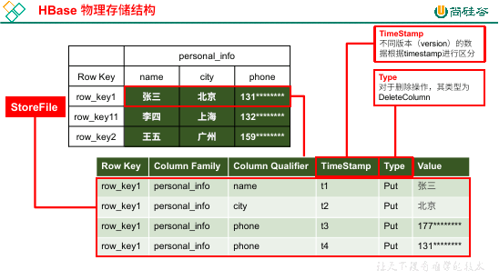
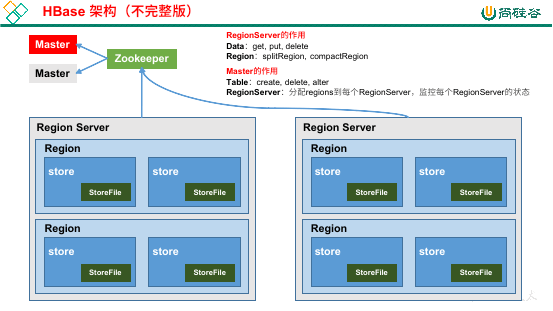

## HBase 简介

HBase 是分布式的、可扩展的、支持海量数据存储的 NoSQL 数据库（基于 Hadoop 的数据库），支持对数据进行大量、实时、随机读写的操作。

**HBase 的逻辑结构**

HBase 在表现上类似关系型数据库，但是在底层存储是 kv，更像是一个多维度 map，但是我们一般将其归类为列存储 NoSQL。

- 列族：

    HBase 和我们之前的关系型数据库不同的第一点就是列族，每一个列族下面可以任意指定列的数量。

    在 HBase 中，列不能单独存在，必须属于某一个列族。

- Row Key：

    row key，也叫做行键。

    在 HBase 中，每一行数据都有自己的 row key，这个 row key 是唯一的。

    row key 是会自动排序的，也就是说数据进入到 HBase 中会根据 row key 自动排序。

    排序规则是根据字典顺序来的，比如 `1 -> 11 -> 2`，而不是 `1 -> 2 -> …… -> 11`。

- region：

    在 HBase 中，横向将表进行切分，比如上图中，`row_key3、row_key4、row_key5` 对应行的数据为一个 region（分区）。

    切分的原因就是因为表太大了，不好维护，所以必须要进行切分，每一个 region 去单独维护。

    每一个 region 中的数据绝对会存储到一台机器上。

- store：

    我们横向切完之后会纵向切分 region，形成 store，比如上图中，`row_key1、row_key11、row_key2` 对应的 region 根据列族切分，形成了两个 store。

    store，存储，顾名思义，物理存储是以一个 store 为单位进行存储的。

    所以，每一个 region 的数据都会存到一个机器上，但是又会按照每一个列族都切分，每一个列族都会存到不同的文件中。

**物理存储结构**

我们以一个 store 为例子，说明物理存储方式。

对于 `row_key1` 对应的行来说，它有三个列：`name`、`city`、`phone`。那么这行中的每一列都会在物理上成为 kv 键值对。

k 包括 `row key`、`列族`、`列名称`、`时间戳`、`类型（PUT/DELETEColumn）`，value 就是当前对应的值，比如 name 为 `张三`。

在上图中，手机号存储了两次，时间戳和值都是不同的，这就代表着手机号有多个版本，也就是数据进行了修改操作（在 HBase 中，添加/修改都是 PUT 操作，删除是操作有多种标识，之后会涉及）。

HBase 号称是支持随机实时读写操作，但是也不能违背 HDFS 的规则。所以 HBase 会将我们的每一个操作都追加到文件末尾，给我们一种随机实时的假象。

也就是说 HBase 在一开始并没有真正的修改这条数据，而是又记录了一个新的内容，然后通过时间戳去判断应该使用哪一个。

但是 HBase 会在一段时间后删除之前版本的记录，留下最后的内容，防止垃圾数据太多，也就是先假后真。

**术语**

- Name Space：

    命名空间，类似关系型数据库的 database，每个 namespace 下有多个表，自带 default 和 hbase 内置表。

- Table：

    表，HBase 定义表只需要声明列族，不需要指定列。这意味着字段在写入时，可以动态指定。

- Row：

    每行数据都由一个 Row Key + 多个 Column（列） 组成，数据按照 Row Key 排序检索（一般我们会按照 Row Key 查询，假如按照别的字段查询，它没有索引，会扫描整张表，效率太低）。

- Column：

    列由列族（Column Family） + 列限定符（Column Qualifier、列名字）组成。

- Timestamp：时间戳
- Cell：

    Row Key、Column Family、Column Qualifier、Timestamp 唯一确定一个单元叫做 cell，cell 中的数据全部都是字节码形式存储。

## HBase 基本架构

1. Region Server：

    Region 的管理者，可以对数据实现增删改查的操作，可以对 Region 实现切分、合并（StoreFile 合并）的操作。

    每个 Region Server 中可以有多个 Region，这些 Region 不一定是来自同一张表，可能会来自不同的表。

    Region 划分的 Store 将会存储到机器的不同文件中，这些文件叫做 StoreFile（或者叫做 HFile）

1. Master：

    Region Server 的管理者，可以对表进行增删改的操作，可以对 Region Server 进行监控、分配 region、负载均衡、故障转移操作。

1. Zookeeper：

    HBase 通过 Zookeeper 实现 Master 高可用、Region Server 监控、元数据入口、集群配置等工作。

1. HDFS：

    底层存储服务，提供高可用支持。

## 环境搭建

TODO

## Shell 操作

**基本操作**

- 链接 hbase shell：`hbase shell`

---

- 列出 namespace：`list_namespace`

    default：默认空间

    hbase：系统使用的

- 创建 namespace：`create_namespace "test"`

    可以在创建 namespace 时给定属性值：`create_namespace "test01", {"author"=>"wyh", "create_time"=>"2020-03-10 08:08:08"}`

- 查看 namespace 详细情况：`describe_namespace "test01"`
- 修改 namespace：`alter_namespace "test01", {METHOD => 'set', 'author' => 'weiyunhui'}`

    通过 set 设置属性值，使用 unset 删除属性值。

- 删除 namespace：`drop_namespace "test01"`

    要删除的 namespace 必须是空的，下面必须没有表，有表存在是 drop 不掉的。

---

- 查看有哪些表：`list`

    此命令会将所有 namespace 下的，非系统创建的所有表列出。

- 创建表：`create 'student'`

    不指定 namespace 的话，默认使用 default，假如想要在某个 namespace 下建立，需要使用 `{namespace}:{table}`

    例如：`create 'ns1:t1'` 代表在 n1 这个 namespace 下创建了 t1 表。

    可以使用 NAME 语法指定属性：`create ns1:t1,{NAME=>'f1'}`，指定了 f1 这个列族。除了指定列族之外，还可以指定其他属性，例如 `VERSION` 版本。

    假如只想要指定列族属性，可以简化为：`create 'n1:t1','f1'`

- 查看表的详细信息：`describe 'student'`
- 变更表：`alter 'student',{NAME=>'f1',VERSIONS=>3},{NAME=>'f2',VERSIONS=>6}`

    如果需要对列族更改的话，如果需要加列族，直接写就可以了，删除使用 `alter 'student','delete'=>'f1'`

    在实际过程中，不回去搞很多列族，既然列族下面可以有 n 个列，在大部分情况下，按照业务分列族就够用了。

- 表的启动和下线：

    下线表：`disable 'student'`。启动表：`enable 'student'`。

- 删除表：`drop 'student'`

    HBase 中，如果需要删除一张表，需要先令表下线

---

- 插入数据：

    - `put 'namespace:表'， 'rowKey'，'列族:列', '值'`：`put 'stu' '1001', 'info:name', 'zhangsan'`

    插入数据时注意，我们平常说的 HBase 是一张大表，其实指的是逻辑结构，底层存储是 kv，所以 rowKey 可以对应任意的列数量，不需要和其他 rowKey 对应的列数量一致。

- 查询数据：

    - `get 'namespace:表', 'rowKey'`:`get 'stu', '1001'`

