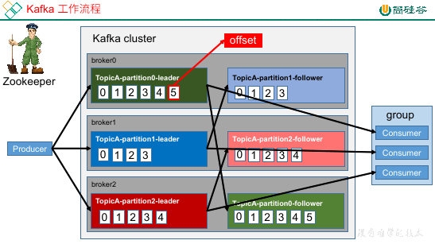
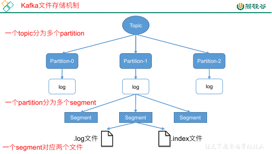
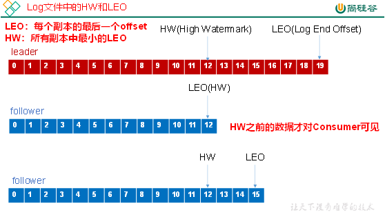
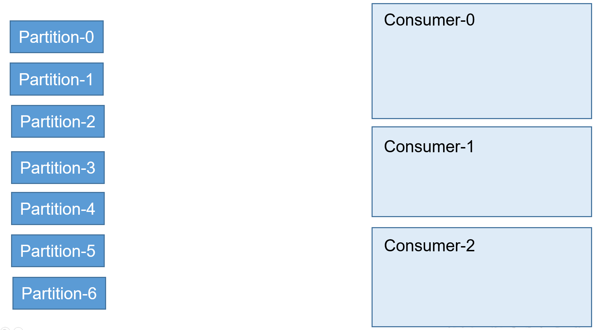
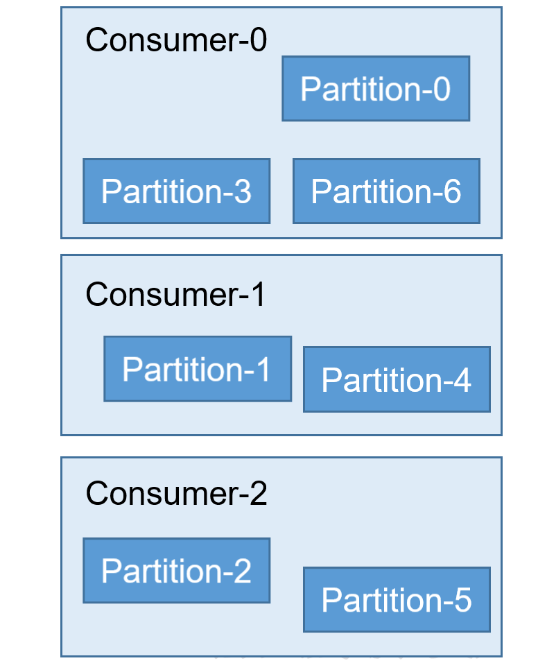
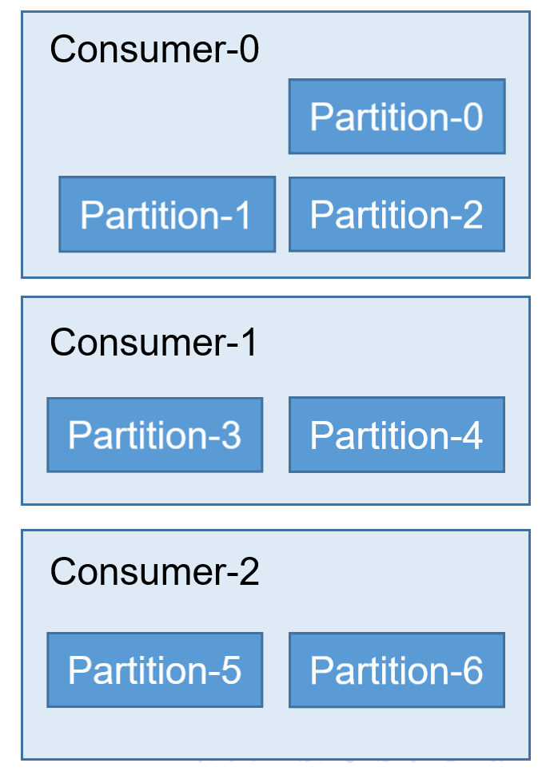
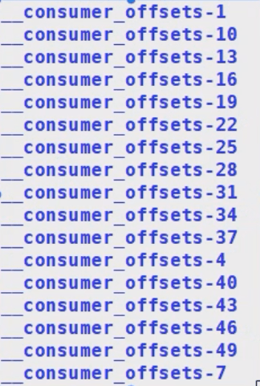
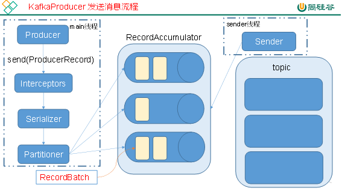

## 架构

### 工作流程和文件存储机制



**offset**

offset 的维护，就是根据 `group + topic + partition ` 来维护的。

**topic 和 partition 和 log**

topic 是逻辑上的概念，partition 是一个物理的存储。

每个分区都会有自己的分区文件夹，命名规则是 `topic-partition`，例如 first 这个 topic 有三个分区，那么对应文件夹为 `first-0`、`first-1`、`first-2`。

每一个 partition 都会对应一个 log 文件（直接存在分区文件夹中），这个文件存着 producer 生产的数据，producer 生产的数据会不断追加到这个文件中，并且每条数据都有自己的 offset（也就是说，kafka 虽然吞吐量高，但其实还是利用文件来存储的，而不是利用内存）。

消费者组中的每个消费者都会实时记录自己消费到了哪个 offset，在出错恢复时，会从上次的位置继续消费。

**segment**



为了防止 log 文件过大导致数据定位效率低，kafka 采取了分片 + 索引的机制。

当 log 文件过大时，会分为多个 segment，每个 partition 分为多个 `segment`，当分区不大那就只有一个 segment。

每个 segment 都对应两个文件：`.log`、`.index`。这两个文件也会放到分区文件夹下。

两个文件的命名也有规则，也就是 `${offset}.log`：

- 第一个 segment 的 offset 为 0，那么就是 `00000000000000000000.log`、`00000000000000000000.index`
- 第二个 segment 可能是 1000，那么就是 `0000……1000.log`、`0000……1000.index`

    每个 log 文件的开头都会是 offset 对应的消息，但是 `.index` 这个文件的索引的计数还是会从 0 开始。

    当我们需要找数据时，会首先根据 offset 找到对应的 index 文件，然后找到对应的数据索引。

    找到索引之后，offset 会减去 index 的文件名（因为文件名是 offset 的开头），得到在 log 文件中，真实数据的位置，这样就找到了最终的数据。

    总结一下就是：index 文件中存储的是逻辑上的数据位置，最终查找需要 offset 这个真实地址转化为 log 文件中的地址。

    之所以这样做，是为了防止数据太多，导致索引过长的问题。

我们之前说，每个消息都会有自己的 offset，这个是没有问题的，但是 kafka 并不会给每条消息都加一个 index，这样太浪费空间了。

kafka 会隔一段消息放一个 index，在根据 offset 寻找索引时，寻找的往往也是一个十分小的片段，然后在对应的片段中遍历查找消息。

### 生产者

#### 分区策略

topic 中会有多个 partition，分区的原因主要是可以提高并发、可以方便扩展。

首先说明一点，即使 kafka 的吞吐量相当快，它也会有一个上限，这个上限就是硬盘的读写速度，这是硬件的限制，没有办法。

当我们存在多个分区时，因为有副本的存在，我们在每台机器上都会有对应分区的存在。

kafka 在给分区选择 leader 时，会尽量分散到不同的机器上，这样就相当于每个分区的 leader 在不同的硬盘上。

我们写数据会向分区的 leader 中读写，这样就相当于多块硬盘一起工作，所以 kafka 的并发是十分重要的。

---

那么究竟是向哪个 partition 中放数据，这个是生产者来决定的，生产者中会有自己的一套分区策略，按照策略行事。

1. 直接指定了 partition：数据会放到指定的 partition 中。
1. 没有指定 partition，但是有 key：根据 key 的 hash 和 topic 做取余操作。
1. 没有 partition 和 key

    这是默认情况。也是粘性分区（Sticky Partition），它首先会随机选择一个分区，然后一直用，直到满足切换分区的条件后，会再换一个分区。

#### 数据可靠性

**producer 到 topic partition**

使用的是 ack（acknowledgement 确认收到）。

topic 中的每个 partition 收到 producer 发送到数据之后，都需要向 producer 发送 ack，如果 producer 收到 ack，就说明消息发送成功，否则会重新发送数据。

对于 partition 来讲，消息会首先到达 leader，然后 leader 会转给 follower，当 leader 发现全部的 follower 同步了，就会发送 ack。


zookeeper 的同步机制是半数以上，但是 kafka 做的是全部都同步。

其实这也就是一种策略的选择，半数以上的同步完成，那么说明机器最好的数量就是 `2n + 1` 台，而全部同步，机器就没什么限制了。


而全部都同步完的这种方案，代表也是延迟高。只要有一个节点挂了，那么相应的响应也就慢了。

**ISR**

为了解决 follower 迟迟不能同步完数据的这个问题，kafka 提出了一项技术，ISR。

leader 会维护一个动态的同步列表 `in-sync replication set（ISR）`，leader 和 follower 都会在这个列表中。

当 follower 在这个列表中，leader 就会向 follower 发送消息来同步数据。

当某个 follower 同步数据超时了，leader 会经这个 follower 从这个列表中踢出去。当 follower 恢复正常了（指定时间内可以同步数据），leader 会再将 follower 加到列表中。

当 leader 故障后，会从 ISR 中选择新的 leader。

时间阈值由 `replication.lag.time.max.ms` 参数设置。默认 10000ms，可以在 kafka 官网上看。

**ack 应答级别**

对于数据而言，不是所有数据都需要完整的保存下来，有些数据可能很重要，有些数据丢了就丢了无所谓。那么对应不同的数据，ack 也有不同的应答级别。

kafka 共提供了三种应答级别，用户可以自己权衡来挑选级别：

- `0`：提供了一个最低的延迟，只要 leader 收到了消息，在 leader 自己还没向磁盘写的时候就响应 ack。
- `1`：leader 落盘之后响应 ack。
- `-1`：leader 和 follower 全部落盘之后响应 ack，默认。注意，这种情况可能会导致数据重复。

**leader 和 follower 故障处理**



每个副本中最后一个 offset 叫做 LEO（Log End Offset），所有副本中最小的 LEO 叫做 HW（High Watermark）。

所以其实 HW 这个值保证的就是：这个水位对应的值在所有的副本中都存在，而且一定是响应过 ack 的，而且 HW 对应的值才可以被消费者消费。

- leader 故障：

    kafka 启动之后会自动维护一个副本的顺序，当 leader 故障了，他就会看下一个副本是否在 ISR 中，假如在 ISR 中说明可用，则直接使用这个副本作为新的 leader。

    新的 leader 上任之后，他会看当前的 HW，不管是自己还是其他 follower，全都扔掉 HW 之后的数据，然后等待生产者重新发送。

- follower 故障：

    这个 follower 不要了，回来之后会从他自己当时对应的 HW 的位置开始重新同步数据。

**Exactly Once**

精准一次，在 kafka 中解决数据同步且同步一次的问题，其实就是将重复数据放到 kafka 来做。也就是 `至少一次 + 幂等性操作` 来实现这个精准一次。

启用幂等性需要将 `Producer` 参数中的 `enable.idempotence` 设置为 true。

开启幂等性的 producer 会在初始化分配一个 PID，发往同一个 partition 的消息会附带 sequence number。

broker 端会对 `<PID, Partition, SeqNumber>` 做缓存，具有相同主键的数据提交时仅会持久化一条。

### 消费者

消费者会使用拉取方式来从 broker 中读取数据。假如拉取时没有数据可以被消费，就会停留一个时间，时间过了之后再去拉取。

**分区策略**

一个 consumer group 有多个 consumer，一个 topic 有多个 partition，所以必然涉及 partition 分配问题。

kafka 有三种分配策略：

- RoundRobin

    轮询，现在有一个消费者组中的三个消费者，一个 topic 中的七个 partition

    

    

    消费者个数发生变化时，所有 consumer 负责消费的 partition 会重新分配。

- Range

    默认使用的分区。

    范围分区，首先会使用分区数和消费者组中的消费者进行一个取余操作，假如能整除那就分成 n 份，每一份是一个范围，一个范围的分给一个 consumer。

    除不尽的话，会让最后一个 consumer 少一个，假如最后一个 consumer 少了还不行，那就让倒数第二个 consumer 少一个……

    

- Sticky

    粘性分区，第一次分区和 RoundRobin 比较像，当消费者个数减少时，原有的 consumer 负责的 partition 保持不变。

    如果还有新的 partition 会按照 RoundRobin 的方式重新分配。

    当消费者个数增加时，consumer 对应的 partition 会重新分配。

**offset 维护**

由于 consumer 在消费过程中可能会发生故障，因此 consumer 需要记录自己消费到了哪个 offset，便于故障恢复。

在 kafka 0.9 之后，consumer 默认将 offset 保存在内置的一个 topic 中，就是 `__consumer_offsets`



这是 kafka 自己创建维护的，而且每消费一个数据都需要维护一次 offset。

## kafka API

### Producer API

#### 简单发送

Kafka 的生产者可以同步发送消息，也可以异步发送消息，主要涉及到了两个线程：`main`、`sender`，涉及到了一个线程共享变量：`RecordAccumulator`。



在 main 线程中：

1. 生产者生产消息，经过了 `send()`
1. 消息发送给拦截器
1. 消息发送给序列化器
1. 消息发送给分区器
1. 消息交给共享变量对应的位置

在共享变量 RecordAccumulator 中：

1. 它会为每一个 topic 中的分区开辟一个缓冲
1. 消息会线发送到共享变量中的内容中
1. 假如消息达到了缓冲/超过指定时间，则发送给 topic 中的分区

在 sender 线程中：

1. 将消息从缓冲中拿出来，然后放到 topic 中

**环境搭建**

```xml
<dependencies>
    <dependency>
        <groupId>org.apache.kafka</groupId>
        <artifactId>kafka-clients</artifactId>
        <version>2.4.1</version>
    </dependency>
</dependencies>
```

**案例**

*异步发送*

异步发送，消息发送之后不阻塞，不等待 ack 回来就发送下一条消息。

```java
/**
 * 生产者异步发送，不带回调
 */
public class KafkaProducerDemo {
  public static void main(String[] args) {
    /*
      1. 创建配置对象

      配置类：

      - CommonClientConfigs：生产者和消费者通用的配置类
      - ProducerConfig：生产者配置类
      - ConsumerConfig：消费者配置类
     */
    Properties props = new Properties();
    // kafka 集群，broker-list 的位置
    props.put(CommonClientConfigs.BOOTSTRAP_SERVERS_CONFIG, "hadoop102:9092");
    // ack 的级别，all 就是 -1，默认情况下是 1
    props.put(ProducerConfig.ACKS_CONFIG, "all");
    // 重试次数，默认次数为 INTEGER.MAX
    props.put(CommonClientConfigs.RETRIES_CONFIG, 3);
    // 批次大小，这个批次大小指的是 main 线程攒一批多大的数据发送给线程共享变量
    props.put(ProducerConfig.BATCH_SIZE_CONFIG, 16384);
    // 指的是线程共享变量 RecordAccumulator 中，等待多长时间就发送给 sender 线程
    props.put(ProducerConfig.LINGER_MS_CONFIG, 1);
    // 指的是线程共享变量 RecordAccumulator 中，给 topic 每个分区开辟缓冲区的大小，32M
    props.put(ProducerConfig.BUFFER_MEMORY_CONFIG, 33554432);
    // kv 的序列化器，因为我们指定的 kv 都是字符串，所以这里就是字符串的序列化器
    props.put(ProducerConfig.KEY_SERIALIZER_CLASS_CONFIG, "org.apache.kafka.common.serialization.StringSerializer");
    props.put(ProducerConfig.VALUE_SERIALIZER_CLASS_CONFIG, "org.apache.kafka.common.serialization.StringSerializer");

    // 2. 创建生产者对象，泛型为：消息的 key 的类型、消息本身的类型
    KafkaProducer<String, String> kafkaProducer = new KafkaProducer<String, String>(props);

    // 3. 定义 ProducerRecord，包装一些信息，例如 topic、partition、timestamp 等，发送
    for (int i = 0; i < 10; i++) {
      kafkaProducer.send(new ProducerRecord<String, String>("topic-first", "value" + i));
    }

    // 4. 关闭对象
    kafkaProducer.close();
  }
}
```

```java
/**
 * 生产者异步发送，带回调
 */
public class KafkaProducerDemo {
  public static void main(String[] args) {
    Properties props = new Properties();
    KafkaProducer<String, String> kafkaProducer = new KafkaProducer<>(props);
    ProducerRecord<String, String> record = new ProducerRecord<>("topic-first", "value");
    kafkaProducer.send(record, new Callback() {
      /**
       * 消息发送完成后调用此方法
       * @param recordMetadata 消息元数据信息
       * @param e 消息发送后失败就会抛出异常
       */
      @Override
      public void onCompletion(RecordMetadata recordMetadata, Exception e) {
        if (Objects.nonNull(e)) {
          System.out.println(String.format("消息失败 %s", e.getMessage()));
          return;
        }
        System.out.println(
            String.format("消息发送成功 topic: %s partition: %s offset: %s",
                recordMetadata.topic(),
                recordMetadata.partition(),
                recordMetadata.offset()
            )
        );
      }
    });
    kafkaProducer.close();
  }
}
```

*同步发送*

同步发送，消息发送之后阻塞，等待 ack 回来之后才会发送下一条消息。

```java
/**
 * 生产者同步发送，带回调
 */
public class KafkaProducerDemo {
  public static void main(String[] args) throws ExecutionException, InterruptedException {
    Properties props = new Properties();
    KafkaProducer<String, String> kafkaProducer = new KafkaProducer<>(props);
    ProducerRecord<String, String> record = new ProducerRecord<>("topic-first", "value");
    // 接受返回值
    Future<RecordMetadata> future = kafkaProducer.send(record, (recordMetadata, e) -> {
      if (Objects.nonNull(e)) {
        System.out.println(String.format("消息失败 %s", e.getMessage()));
        return;
      }
      System.out.println(
          String.format("消息发送成功 topic: %s partition: %s offset: %s",
              recordMetadata.topic(),
              recordMetadata.partition(),
              recordMetadata.offset()
          )
      );
    });
    // 调用此方法之后就会阻塞当前线程，一直等到该方法的返回值返回为止，它会抛出 InterruptedException 异常，也就是打断异常
    future.get();
    kafkaProducer.close();
  }
}
```

#### 分区策略

**指定 key，根据 key 的 hash 取余**

```java
// 参数分别为：topic、key、value，根据 key 的 hash 取余来得到最终的 partition
new ProducerRecord<String, String>("topic-first",  "key", "1");
```

**手动指定分区**

```java
// 参数分别为：topic、partition、key、value，发送给 topic 的 0 号分区
new ProducerRecord<String, String>("topic-first", 0, "key", "1");
```

当手动指定了 partition 之后，key 这个字段就没用了

**粘性分区**

默认情况下（即仅指定 topic 和 value）就是粘性分区。

```java
new ProducerRecord<String, String>("topic-first", "value");
```

粘性分区下，首先会只使用一个 partition，满足条件（partition 满了/超过 `ProducerConfig.LINGER_MS_CONFIG` 时间）之后就会切换另外的 partition。

---

其实之前默认分区器是采用轮询的做法，也就是 main 线程到共享变量的缓冲区的这段是轮询的，但是这样有一个问题：

当数据量很小的时候，共享变量中的每一个缓冲区也都只放了一点点的数据，最后分给不同的 partition，这样是完全没有必要的。

所以之后改为了粘性分区，当数据量小的时候直接放到一个缓冲区，给到一个 partition，这样是比较合理的。

**自定义分区器**


对于分区器来讲，kafka 提供的共三个分区器：`DefaultPartitioner（默认，粘性分区器）`、`UniformStickyPartitioner（类似粘性分区器）`、`RoundRobinPartitioner（轮询分区器）`。

自定义分区器，实现 `Partitioner` 接口即可。

```java
/**
 * 自定义分区器
 */
public class CustPartitioner implements Partitioner {

  /**
   * 计算分区号码
   *
   * @param topic      发送的主题
   * @param key        当前消息的 Key
   * @param keyBytes   当前消息 key 序列化之后的字节数组
   * @param value      当前消息
   * @param valueBytes 当前消息序列化之后的字节数组
   * @param cluster    上下文
   * @return 分区号
   */
  @Override
  public int partition(String topic, Object key, byte[] keyBytes, Object value, byte[] valueBytes, Cluster cluster) {
    // 实现分区逻辑
    return 0;
  }

  @Override
  public void close() {
  }

  @Override
  public void configure(Map<String, ?> map) {
  }
}
```

```java
public class KafkaProducerDemo {
  public static void main(String[] args) throws ExecutionException, InterruptedException {
    Properties props = new Properties();
    // 手动设置分区器
    props.setProperty(ProducerConfig.PARTITIONER_CLASS_CONFIG,"producer.partitioner.CustPartitioner");
    KafkaProducer<String, String> kafkaProducer = new KafkaProducer<>(props);
    ProducerRecord<String, String> record = new ProducerRecord<>("topic-first", "value");
    kafkaProducer.send(record);
    kafkaProducer.close();
  }
}
```

### Consumer API

### 简单消费

```java
/**
 * Kafka 消费者
 */
public class KafkaConsumerDemo {
  public static void main(String[] args) {
    // 1. 配置类
    Properties props = new Properties();
    // Kafka 集群配置
    props.put(ConsumerConfig.BOOTSTRAP_SERVERS_CONFIG, "hadoop102:9092");
    // 消费者组 ID
    props.put(ConsumerConfig.GROUP_ID_CONFIG, "test");
    // 自动提交 offset
    props.put(ConsumerConfig.ENABLE_AUTO_COMMIT_CONFIG, "true");
    // offset 提交的间隔
    props.put(ConsumerConfig.AUTO_COMMIT_INTERVAL_MS_CONFIG, "1000");
    // kv 的反序列化
    props.put(ConsumerConfig.KEY_DESERIALIZER_CLASS_CONFIG, "org.apache.kafka.common.serialization.StringDeserializer");
    props.put(ConsumerConfig.VALUE_DESERIALIZER_CLASS_CONFIG, "org.apache.kafka.common.serialization.StringDeserializer");

    // 2. 消费者对象，泛型是生产者生产的数据的泛型
    KafkaConsumer<String, String> kafkaConsumer = new KafkaConsumer<>(props);

    /*
      3. 消费者指定多个 topic 来消费，首先需要订阅多个 topic。

      可以订阅不存在的 topic，会自动创建。但是这个自动创建的 topic 就只有一个分区一个副本。
     */
    kafkaConsumer.subscribe(Arrays.asList("first-topic", "second-topic"));

    // 4. 持续消费数据，正常来说不应该是一个死循环，现在就是意思一下
    while (true) {
      // 假如拉不到数据，那么就等待两秒钟
      ConsumerRecords<String, String> records = kafkaConsumer.poll(Duration.ofSeconds(10));
      records.forEach(record -> System.out.println(
              String.format("消费到 topic: %s partition: %s offset: %s key: %s value: %s",
                  record.topic(),
                  record.partition(),
                  record.offset(),
                  record.key(),
                  record.value()
              )
          )
      );
    }

    // 5. 关闭对象
    kafkaConsumer.close();
  }
}
```

### 维护 offset

**自动提交 offset**

在配置 properties 中指定自动提交 offset `props.put(ConsumerConfig.ENABLE_AUTO_COMMIT_CONFIG, "true")`

指定超时时间 `props.put(ConsumerConfig.AUTO_COMMIT_INTERVAL_MS_CONFIG, "1000");`

这个时候，我们的 offset 会自动重置，会自动重置到当前分区下最大的 offset，所以说之前的数据不可能被消费，只有新进来的数据才会被消费到。

**自动重置 offset**

自动重置由 `auto.offset.reset` 参数控制，有几个值：

- `earliest`: 重置到最开始位置（有些超过七天的数据可能被删掉了，所以最开始位置不一定是 0）。
- `latest`: 重置到最后位置，默认值。

自动重置的情况：

1. kafka 中没有一个 offset 时（没有消费记录时）。
1. 当前 offset 在 kafka 中已经不存在时（被删掉的数据）。

需要改变自动重置的规则，则需要在 properties 中指定 `props.put(ConsumerConfig.AUTO_OFFSET_RESET_CONFIG, "earliest");`。

**手动提交 offset**

首先在配置中禁用自动提交：`props.put(ConsumerConfig.ENABLE_AUTO_COMMIT_CONFIG, "false")`

这个时候我们没有设置有关手动提交的参数，所以当前 offset 只是维护在了 consumer 内存中，而没有提交给 kafka。

当前状态下持续消费没啥问题，但是只要 consumer 重启，因为 offset 没有提交到 kafka 中，所以会读取 kafka 保存的之前的 offset，然后开始消费。

手动提交 offset 也有两种方式：

- 同步提交 commitSync：消费完数据之后提交，提交完成之前不进行下次消费，提交失败则自动重试，直到成功为止。
- 异步提交 commitAsync：消费完数据之后提交，在提交过程中仍然进行下次消费，提交失败不重试，所以有可能失败。

无论是同步还是异步，都会将最高的 offset 提交给 kafka。

```java
public class KafkaConsumerDemo {
  public static void main(String[] args) {
    Properties props = new Properties();
    props.put(ConsumerConfig.BOOTSTRAP_SERVERS_CONFIG, "hadoop102:9092");
    props.put(ConsumerConfig.GROUP_ID_CONFIG, "test");
    // 禁用自动提交 offset
    props.put(ConsumerConfig.ENABLE_AUTO_COMMIT_CONFIG, "true");
    props.put(ConsumerConfig.KEY_DESERIALIZER_CLASS_CONFIG, "org.apache.kafka.common.serialization.StringDeserializer");
    props.put(ConsumerConfig.VALUE_DESERIALIZER_CLASS_CONFIG, "org.apache.kafka.common.serialization.StringDeserializer");

    KafkaConsumer<String, String> kafkaConsumer = new KafkaConsumer<>(props);

    kafkaConsumer.subscribe(Arrays.asList("first-topic", "second-topic"));
    while (true) {
      // 消费数据
      ConsumerRecords<String, String> records = kafkaConsumer.poll(Duration.ofSeconds(10));
      records.forEach(record -> System.out.println(
              String.format("消费到 topic: %s partition: %s offset: %s key: %s value: %s",
                  record.topic(),
                  record.partition(),
                  record.offset(),
                  record.key(),
                  record.value()
              )
          )
      );
      // 手动提交 offset，同步
      kafkaConsumer.commitSync();
      // 手动提交 offset，异步
      kafkaConsumer.commitAsync();
    }
  }
}
```

异步提交有一个回调方法，用于查看是成功还是失败：

```java
kafkaConsumer.commitAsync(new OffsetCommitCallback() {
  @Override
  public void onComplete(Map<TopicPartition, OffsetAndMetadata> offsets, Exception e) {
    if (Objects.nonNull(e)) {
      System.out.println("失败");
      return;
    }
    System.out.println(offsets);
  }
});
```

**漏消费和重复消费**

- 重复消费：假定我们先消费数据，然后提交 offset。

    假如我们在消费数据的过程中抛出了异常，那么 consumer 就执行失败了，offset 肯定也提交失败。等到下次给到的这一批同样的数据，其实已经有一些是已经消费过的。

- 漏消费：假定我们先提交 offset，然后再消费数据。

    假如我们在消费数据的过程抛出了异常，那么 consumer 就执行失败了。但是此时 offset 早已提交完成，等到下次就不会给到这批数据了。

假如我们想要实现精准一次消费，就要将消费和提交 offset 这两件事做成一个事务。kafka 是不能做到这种事情的，所以我们需要借助第三方可以实现事务的组件，比如 MySQL 等。

### 自定义拦截器

```java
/**
 * 自定义拦截器
 */
public class CustInterceptor implements ProducerInterceptor {

  /**
   * 将方法封装到 producer.send() 方法中，也就是说它运行在 main 线程中
   * <p>
   * 消息序列化和计算分区前会调用此方法
   */
  @Override
  public ProducerRecord onSend(ProducerRecord producerRecord) {
    return producerRecord;
  }

  /**
   * 线程间共享变量发送成功 / 失败时调用
   *
   * @param recordMetadata
   * @param e
   */
  @Override
  public void onAcknowledgement(RecordMetadata recordMetadata, Exception e) {

  }

  @Override
  public void close() {

  }

  /**
   * 获取配置信息，初始化使用
   *
   * @param configs 配置
   */
  @Override
  public void configure(Map<String, ?> configs) {

  }
}
```

```java
Properties props = new Properties();
props.put(ProducerConfig.INTERCEPTOR_CLASSES_CONFIG, Arrays.asList("interceptor.CustInterceptor"));
KafkaProducer<String, String> kafkaProducer = new KafkaProducer<>(props);
ProducerRecord<String, String> record = new ProducerRecord<>("topic-first", "value");
kafkaProducer.send(record);
kafkaProducer.close();
```

拦截器可以有多个，所以放一个 List 也是十分合理的。
