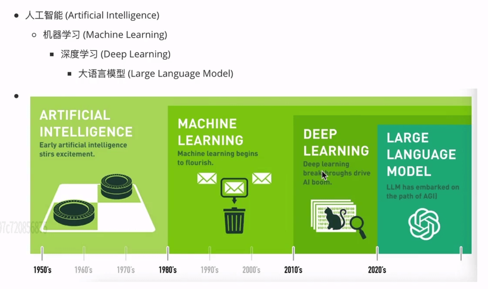
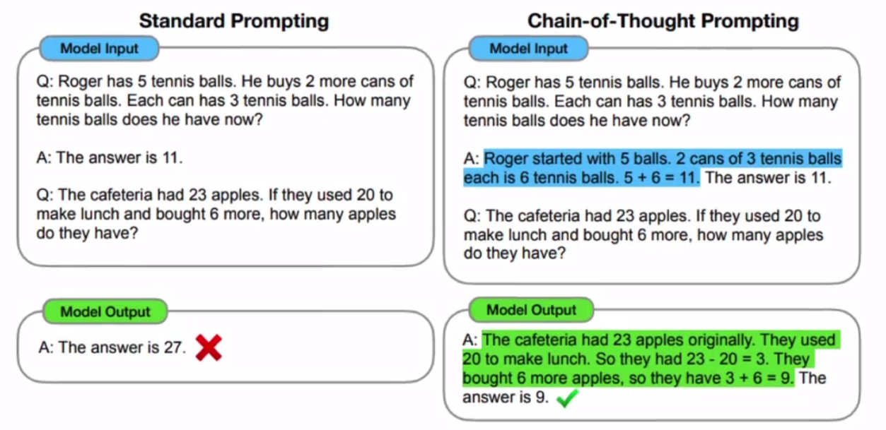
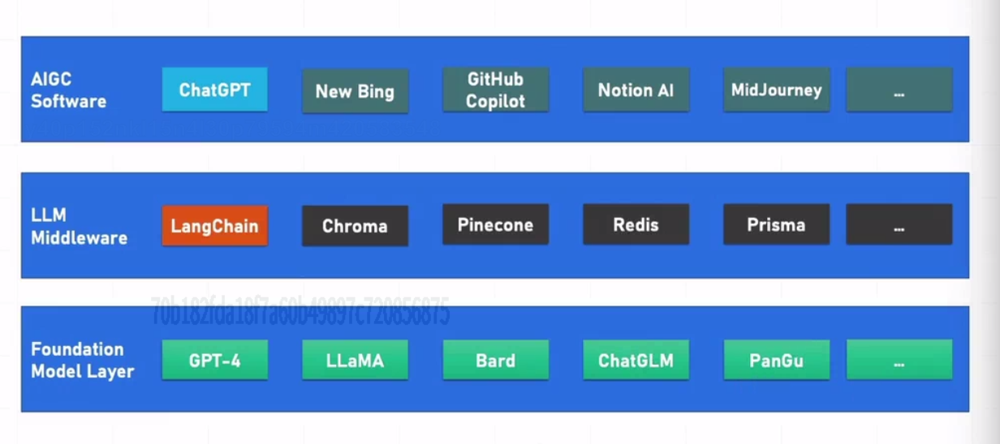
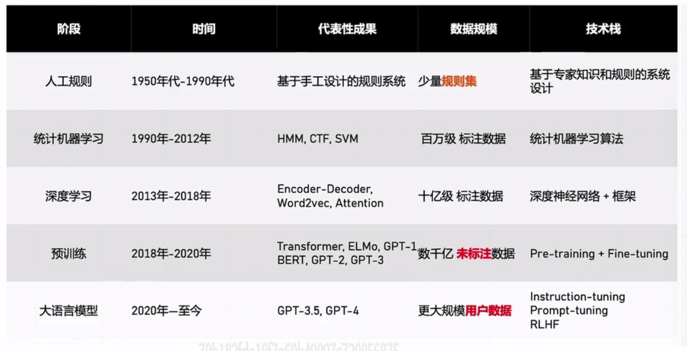
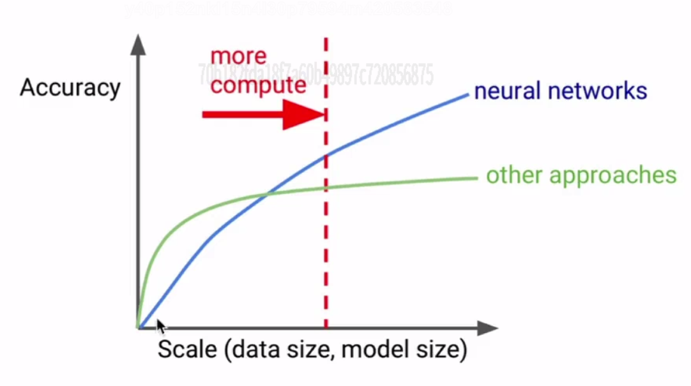
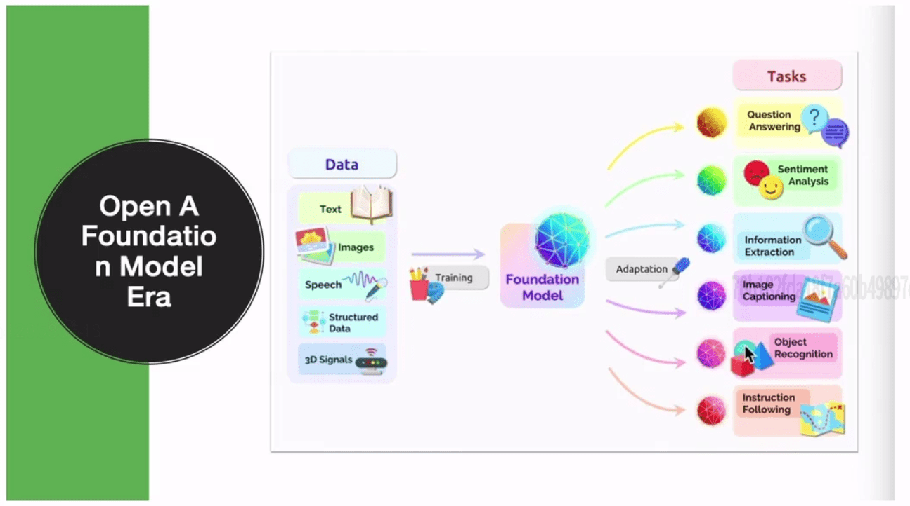
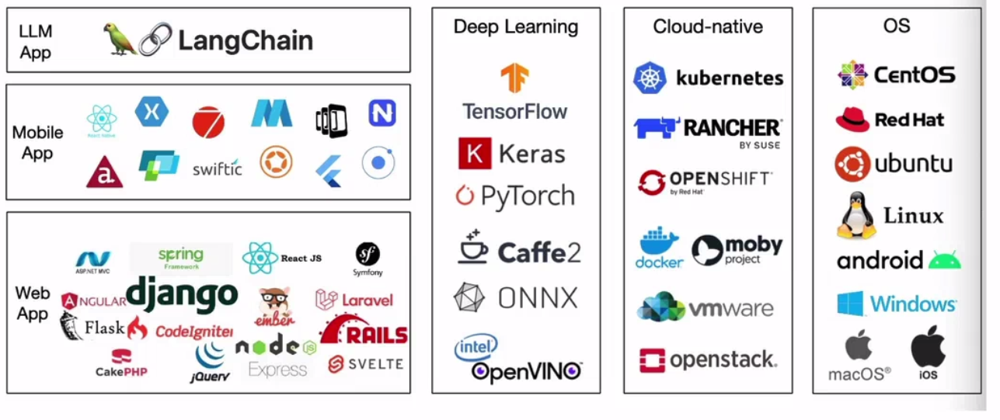

## 人工智能基础知识

### 人工智能关键词

人工智能关键词, 以下人工智能关键词为包含关系, 其中人工智能为最广义概念, 最精细的成果目前为大语言模型。

目前人工智能主要的技术方向有：

-   ASR：语音
-   CV：视觉
-   NLP：语言
-   MM：多模态
-   RS：搜广推
-   RL：强化学习

主流的就业方向有：

-   AI 算法工程师
-   AI 大模型工程师
-   AI 研发工程师
-   AI 应用开发工程师
-   AI 产品经理
-   AI 训练师
-   AI 数据标注师

### chatGPT 发展

-   2017 Transformer 横空出世
-   2018.6 gpt 参数量 1.1 亿, 磁盘存储约占用 450M, 核心点是基于 Transormer Decoder 的 masked multi-head self-attention
-   2019.2 gpt2 参数量 15 亿, 核心点是融合了 prompt leaerning, 省去了微调
-   2020.5 gpt3 参数量 1750 亿, 磁盘存储约占用 800+G, 核心点是通过 ICL( In-Context Learning ) 开启了 prompt 新范式
-   2021.7 Codex 基于 gpt3 进行了大量的代码训练产生的新模型 Codex, 使其具备了代码编写和代码推理能力
-   2021.10 OpenAI 内部发展出了 gpt3.5, 但是未对外公开（非开源）
-   2022.1 Google 提出思维链技术 GoT( Chain of Thought )

    

    上图, 左边是标准的 prompt 技术, 右边是思维链技术

    简单来说, 举例告诉 AI 怎么去思考, 后边 AI 会使用这个思考逻辑进行思考

-   2022.11.30 OpenAI 正式发布 chatgpt, 核心点是基于 GPT-3.5 模型, 融合了 Codex+ 强化学习的技术
-   2023.3 OpenAI 官方发布 gpt4, 增加多模态能力（即语音、文本、视频都能生成）
-   2024.2 OpenAI 官方发布 sora, 首次完成 60s 稳定、流畅、一致性的视频生成模型
-   2024.5 OpenAI 正式发布 gpt-4o, 流量地球 2 的电影场景第一次进入现实（实时交互、能看到现实场景、能了解人类的情感和情绪）

### Anaconda

[Anaconda](https://www.anaconda.com/download) 是一个开源的 python 和 R 语言发行版, 主要用于数据科学、机器学习、科学计算等领域。

它集成了大量常用的数据科学库（如 NumPy、Pandas、Matplotlib、Scikit-learn、Jupyter 等）, 并提供了一个强大的包管理器（conda）和环境管理系统, 帮助用户轻松安装、更新和隔离不同项目的依赖。

Anaconda 的主要组成部分：

-   Python 解释器：Anaconda 自带 Python（通常是最新稳定版）。
-   conda：一个跨平台的包管理和环境管理工具。
-   Anaconda Navigator：图形化界面, 用于启动 Jupyter Notebook、Spyder、VS Code 等工具。
-   预装库：包含 250+ 常用科学计算和数据分析库。
-   Jupyter Notebook / Lab：交互式编程环境, 非常适合教学和探索性数据分析。

注意, 在下载安装 anaconda, 官方推荐不要将 anaconda 加入到环境变量中（windows 中不要加入 PATH）, 因为可能会造成依赖冲突。

并且不需要卸载原有的 python 环境, 因为 anaconda 自带 python, 而且有环境隔离, 不会影响系统原有 python。

conda 可以管理 Python 包和非 Python 依赖（如 C 库）, 更适合科学计算。pip 只管理 Python 包。建议优先使用 conda install, 若包不在 conda 源中再用 pip install。

注意：火绒安全软件会阻拦 anaconda 的安装, 如果卡着不动则需要关闭。

### 主流大模型进展

-   基础大模型层

    底层 --> LLM 中间层 --> AIGC 软件层产品

    

    OpenAI

    百度文心大模型、阿里巴巴通义千问大模型、腾讯混元大模型、字节跳动云雀大模型、深度求索 deepseek 大模型

    科大讯飞星火大模型、智谱清言 ChatGLM 大模型、MiniMax AbAb 大模型、阶跃星辰 Step 大模型、月之暗面 Kimi 大模型

-   多模态大模型

    gpt4、快手可灵大模型、字节跳动即梦

### AI 时代生存法则

-   随着时代发展, 整个技术模式也不断发展

    

    随着模型数据规模增长, 除了神经网络的深度学习接近线性增长之外, 其余传统的机器学习都接近于停滞

    

    所以类似逻辑回归、线性回归、随机森林、决策树、支持向量机、朴素贝叶斯之类的算法了解基本原理即可, 未来公司几乎不用了, 逻辑回归、朴素贝叶斯还有少量使用。

    所有应用了神经网络 neural network 的都叫深度学习, 没有用神经网络的叫其他方法。

-   随着时代发展, 开发模式也有了更多变化

    

    以往是一个模型训练对应一个任务, 现在是海量的任务训练下游对应海量的任务

-   AI 大模型技术栈

    

    注意尽量在 linux 上进行训练

    linux + vim / VSCode / Pycharm / Jupyter Notebook（校园工具）

    anaconda + pytorch 1.6 2.0 2.1 2.2 + transformers 3.6 4.30 4.32

    免费 / 费用低 GPU 资源: [AutoDL](www.autodl.com)、[魔搭](www.modelscope.com)、[趋动云](www.virtaicloud.com)、[青云](www.qingcloud.com)、[青云 2](www.coreshub.cn)
