## 机器学习概述

机器学习 Machine Learning, 简单来说就是处理一项任务, 而这项任务需要大量的经验, 也就是需要大量的数据来做训练

然后对任务处理的好坏做出评判标准, 然后通过分析处理数据, 令任务完成地更好

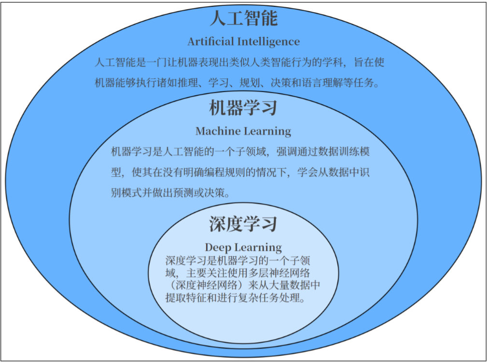

-   20 世纪 50 - 70 年代, 机器学习开始

    图灵提出图灵测试, 定义机器智能的基本标准

    弗兰克·罗森布拉特提出感知机算法, 这是最早的人工神经网络模型之一, 用于线性分类问题

    亚瑟·李·塞谬尔提出机器学习一词, 并设计了一个用于玩跳棋的学习算法

-   20 世纪 70 - 80 年代, 知识驱动与专家系统

    人类逐渐意识到仅靠推理无法实现人工智能, 那么要实现人工智能就必须使得机器拥有知识

    这一时代出现了众多专家系统, 也就是让机器拥有具体的某一类知识, 比如 MYCIN 用于医疗诊断

    引入了决策树, 如 ID3 算法

    统计理论成型, 如贝叶斯定理开始在机器学习中使用

-   20 世纪 80 - 21 世纪, 统计学方法逐渐成为核心

    在这一时代, 专家系统面临知识瓶颈

    好在基于硬件和数据量级的攀升, 使得统计方法逐渐形成可能

    决策树算法进一步发展, 如 C4.5 算法

    支持向量机 SVM 被提出, 成为强大的分类工具

    无监督学习方法开始成熟, 如 K-means 聚类

    随机森林和 Boosting 方法（如 AdaBoost）引入, 提升了集成学习的性能

-   21 世纪初, 深度学习

    随着计算机能力和数据规模的快速增长, 深度学习技术崛起

    深度神经网络主导, 突破了图像、语音、文本的性能瓶颈

    深度信念网络 DBN 被提出, 标志着深度学习研究的复兴

    AlexNext 在 ImageNet 像分类竞赛中获胜, 证明了卷积神经网络（CNN）的强大性能

    生成对抗网络（GAN）被提出, 用于生成图像和其他生成任务

    Transformer 架构在论文《Attention is All You Need》中提出, 彻底改变了自然语言处理领域, Transformer 也是当下大模型的基础

-   大模型与通用人工智能

    深度学习进入规模化应用阶段, 大语言模型和多模态模型的出现推动了机器学习的新高潮。模型参数规模空前, 技术以通用性和泛化能力为目标

    自然语言处理：如 OpenAI 的 GPT 系列模型、Google 的 BERT

    多模态模型：如 OpenAI 的 CLIP、DeepMind 的 Gato

    自监督学习成为重要方向, 降低了对人工标注数据的依赖

    强化学习和深度学习结合, 应用于 AlphaGo、AlphaFold 等项目

    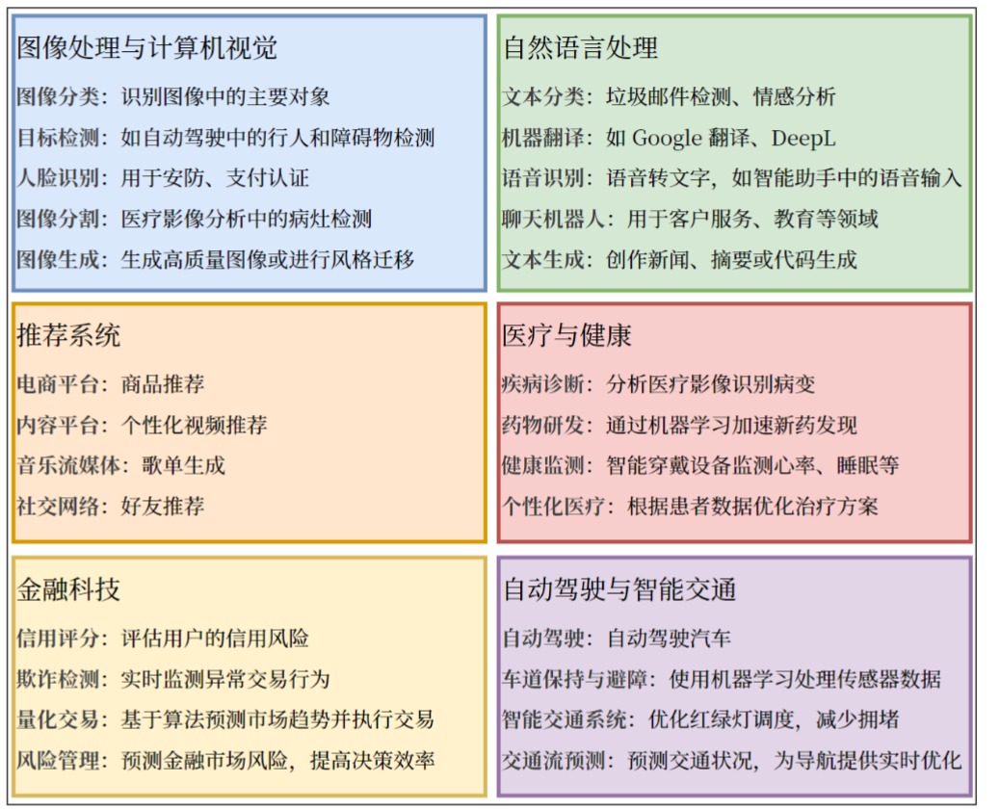

## 基本术语

其实机器学习就是一个输入一个输出, 简单来说就是函数 $f(x)$

-   数据集：多条数据的集合
    -   训练集 Traning Set 用于训练模型的数据
    -   测试集 Test Set 用于评估模型性能是否正确的数据
    -   验证集 Validation Set 用于调节超参数的数据
-   样本：数据集中的一条记录是关于一个事件或者对象的描述, 称为样本
-   特征：数据集中一列反映事件或对象在某方面的表现或性质的事项, 称为特征或属性
-   特征向量：将样本的所有特征表示为向量的形式, 输入到模型
-   标签：监督学习中每个样本的结果信息, 也称作目标值（target）, 就是函数最终结果
-   模型：个机器学习算法与训练后的参数集合, 用于进行预测或分类
-   参数：模型通过训练学习到的值, 例如线性回归中的权重和偏置
-   超参数：由用户设置的参数, 不能通过训练自动学习, 例如学习率、正则化系数等

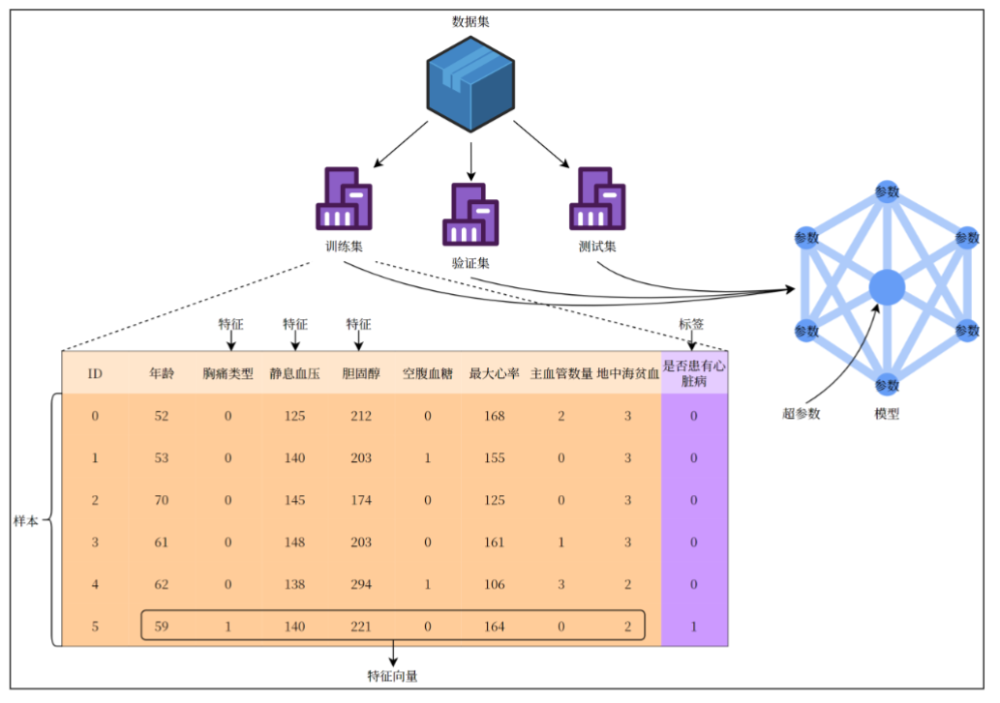

## 机器学习基本理论

### 基本理论

机器学习的方法一般由三部分组成：

-   模型 model：总结数据的内在规律, 用数学语言描述的参数系统
-   策略 strategy：最优模型的评价准则
-   算法 algorithm：选取最优模型的具体方法

机器学习的方法分类：

-   按照是否有监督分类：有监督学习（提供数据与结果）、无监督学习（提供数据不提供结果）、半监督学习、强化学习（通过与环境互动并且获取延迟返回而改进的学习过程）
-   按模型性质分类：概率模型 / 非概率模型、线性模型 / 非线性模型
-   按照学习技巧分类：贝叶斯学习、核方法

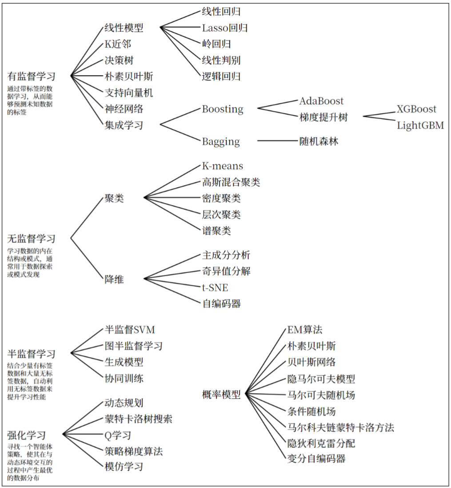

机器学习的具体过程

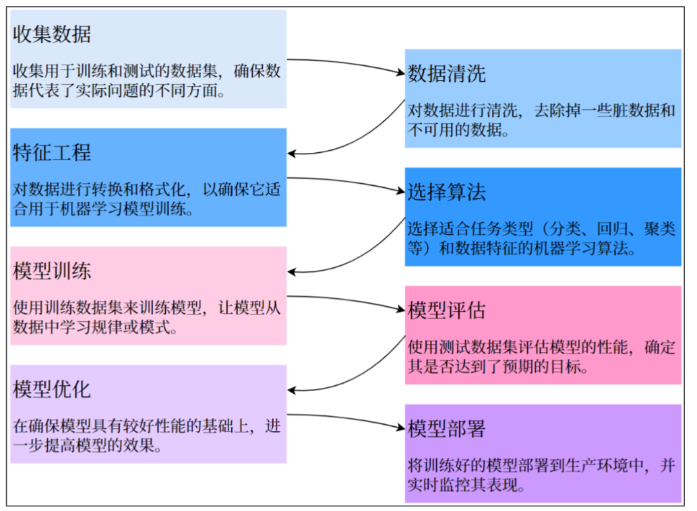

需要输入大量的数据来得到最终的模型（函数）, 而且最终的结果不是确定性的, 是围绕着函数的曲线在周围进行散列的

### 特征工程

特征工程, 就是从原始的数据中提取出与目标变量关系最密切的特征, 剔除冗余、无关或者噪音特征, 可以减少模型复杂度, 加速训练过程、减少过拟合的风险

特征选择法：不会创建新特征, 也不会概念数据结构

-   过滤法 Filter Method

    基于统计测试（低方差过滤法、卡方检验、相关系数、信息增益）来评估特征和目标变量之间的关系, 从而选择最相关的特征

    其实对于函数模型, 比如正态分布的函数曲线, 需要的其实是方差越大越好, 而不是方差越小越好

    这是因为如果方差太小, 那么数据都会集合在非常精确的曲线上, 对于预测不同数据产生的结果反而会起到反作用, 这就是过拟合了

    方差越大就代表着数据分布越广越不集中, 那么可以预测不同数据

-   包裹法 Wrapper Method

    使用模型（递归特征消除 RFE）来评估模型重要性, 并根据模型的表现进行特征选择

    比如说依次给特征添加噪音, 如果最终表现比之前更差, 则说明这个特征越重要, 如果最终表现没区别甚至更好, 说明这个特征不重要甚至是起到反作用

-   嵌入法 Embedded Method

    使用模型本身特征选择机制（如决策树的特征重要性, L1 正则化的特征选择）来选择更重要的特征

特征转换：对数据进行数学或者统计处理, 使其变得更加适合模型的输入要求

-   归一化 Normalization

    将特征缩放到指定范围内, 也就是存在最大值和最小值, 使用精准范围来使特征更精确

    适用于对尺度敏感的模型（如 KNN、SVM）

    比如电脑屏幕的颜色取值, 由 RGB 三原色组成, 每个颜色的取值为 0 - 255, 那么就确定了最大和最小值

    但是有些不可以, 比如正态分布曲线, 最大值和最小值无法确定

-   标准化 Standardization

    通过减去均值并且除以标准差, 使其分布具有均值, 标准差 1

    比如正态分布曲线, 最大值和最小值无法确定, 但是均值可以确定在峰值上

    那么此时减去均值然后除以方差, 最终结果就在 0 - 1 区间内

-   对数变换

    对于有偏态的数据, 比如收入和价格（有些收入和价格十分偏高）, 可以取对数

    比如说有人挣钱一万块, 有人挣钱一个亿, 正常来讲为 10^4 和 10^8, 取值对数

    以 10 为底的对数, 一个是 4 一个是 8, 这样就好多了

-   类别变量编码

    -   独热编码 One-Hot Encoding：将类别变量转换为二进制列, 常用于无序类别的特征
    -   标签编码 Label Encoding：将类别变量映射为整数, 常用于有序类型特征
    -   目标编码 Target Encoding：将类别变量的每个类别替换为其对应目标变量的平均值和其他统计量
    -   频率编码 Frequency Encoding：将类别变量映射为该数据在类别的出现频率

    是否对类别变量进行编码其实还是要看具体数据的样子, 比如如果使用 RGB 来进行编码, 那么其实对于某些情况就不适合标签编码

    如果 R 为 0、G 为 1、B 为 2, 那么在计算机进行计算时, 会看到 R 与 G 的距离为 1, R 与 B 的距离为 2, 那么在计算时就会有误差

    其实 RGB 并没有区别, 而是独立的变量, 那么就可以使用独热编码, 就是将 RGB 分开, R、G、B 一分为三, 改为三个特征, 那么此时在计算时就不会出现误差了

    但是对于位置可能没有区别, 比如给全国每个省份进行标签编码, 比如北京为 0 山东为 1, 那么北京到山东确实是有距离, 这个没有问题

特征构造：基于现有特征创建出全新特征

-   交互特征

    将两个特征通过某种方法组合为权限特征

-   统计特征

    从原始特征中提取统计值, 例如某个时间窗口的平均值、最大最小值等

-   日期和时间特征

    例如从日期时间提取星期几

特征降维：特征巨多时, 减少复杂度并且避免过拟合

-   主成分分析 PCA

    通过线性变换将原始特征映射到另一个空间, 通过最大化类间距离与类内距离的比率来降维

-   线性判别分析 LDA

    一种非线性的降维技术, 特别适合可视化高维数据

-   t-SNE

    一种神经网络模型, 通过压缩编码器来实现数据的降维

特征降维和过滤法不同, 过滤法虽然减少了特征的数量, 但是其他特征本身信息不会动, 特征降维是将原有信息转为新的信息

#### 常用方法

##### 低方差过滤法

对于特征的选择, 可以直接基于方差来进行判断, 这是最简单的

低方差也就意味着该特征的所有样本值几乎完全相同, 对预测结果来说没有任何帮助, 可以将其去掉

在 python 代码中, 需要用到大名鼎鼎的 sklearn 模块, 这个模块是非常著名的机器学习库, 里面存在各种机器学习模型, 以及特征工程特征选择的库全都有

<details>

```python
import numpy as np

# 构造特征, 默认情况下方差为 1, 所以随机生成出来的数据方差都会在 1 之间徘徊
a = np.random.randn(100)
# 打印方差 1.0431664440372672
print(np.var(a))
print(a)

# 默认情况下, μ 这个偏移量为 0, σ 这个标准差为 0.1, 所以 σ^2 这个方差也是 1
# 那么此时给到了一个 0.1 的乘积, 方差就会变为 0.01
b = np.random.randn(100) * 0.1
print(np.var(b))
# 或者直接调用方法, 指定偏移量为 5, 标准差为 0.1, size 即个数给 100 个, 最终方差还是 0.01
b = np.random.normal(5, 0.1, size=100)
print(np.var(b))
# 以上两者需要注意, 这只是程序模拟到的结果, 但是实际上生成的数据是约等于这个结果, 最终方差可能高于此结果, 也可能低于此结果, 这会影响最终低方差过滤的结果
print(b)

# 构造特征向量 X, 使用 vstack 将两组数据进行竖直方向的堆叠得到 2 行特征向量, 然后使用 .T 进行转置得到大量特征向量
X = np.vstack((a, b)).T
# (100, 2), 意思是 100 行 2 列的数据, 每一行都是一个特征
print(X.shape)
print(X)

# 低方差过滤
from sklearn.feature_selection import VarianceThreshold
vt = VarianceThreshold(0.01)
X_filtered = vt.fit_transform(X)
print(X_filtered.shape)
print(X_filtered)
```

</details>

##### 相关系数法（过滤法）

通过计算特征与目标变量或者特征之间的相关性, 筛选出高相关特征（与目标相关）保留或者剔除冗余特征（特征间高度相关）

##### 皮尔逊相关系数

皮尔逊相关系数用于衡量两个变量之间的线性相关性, 取值范围为 [-1, 1]

而且注意只能衡量线性关系, 不能衡量非线性关系, 比如 $y = x^2$ 呈现关系, 但在皮尔逊相关系数中的值约为 0

$$
r = \frac{\sum_{i=1}^n (x_i - \overline{x}) (y_i - \overline{y})}{\sqrt{\sum_{i=1}^n (x_i - \overline{x})^2} \sqrt{\sum_{i=1}^n (y_i - \overline{y})^2}}
$$

-   正相关: 值接近 1, 说明特征随目标变量增加而增加
-   负相关: 值接近 -1, 说明特征随目标变量增加而减少
-   无关: 值接近 0, 说明特征和目标变量无明显关系

公式推导中:

-   分子为协方差, x 与 y 的相关计算分别代表着 x 和 y 偏移均值的程度
-   分母为标准化因子, 归一化处理, 时计算结果位于 [-1, 1] 之间

举例为

| 学生 | 学习时间(x) | 成绩(y) |
| ---- | ----------- | ------- |
| A    | 2 小时      | 60 分   |
| B    | 4 小时      | 70 分   |
| C    | 6 小时      | 80 分   |
| D    | 8 小时      | 90 分   |

均值计算

$\overline{x} = \frac{2 + 4 + 6 + 8}{4} = 5$

$\overline{y} = \frac{60 + 70 + 80 + 90}{4} = 75$

计算离差

| $x$  | $y$ | $x - \overline{x}$ | $y - \overline{y}$ | 乘积 | $(x - \overline{x})^2$ | $(y - \overline{y})^2$ |
| ---- | --- | ------------------ | ------------------ | ---- | ---------------------- | ---------------------- |
| 2    | 60  | -3                 | -15                | 45   | 9                      | 225                    |
| 4    | 70  | -1                 | -5                 | 5    | 1                      | 25                     |
| 6    | 80  | 1                  | 5                  | 5    | 1                      | 25                     |
| 8    | 90  | 3                  | 15                 | 45   | 9                      | 225                    |
| 总和 |     |                    |                    | 100  | 20                     | 500                    |

代入公式

$$
r = \frac{100}{\sqrt{20 \times 500}} = 1
$$

<details>

```python
import pandas as pd

# 读取数据
advertising = pd.read_csv('../../data/advertising.csv')
'''
 Unnamed: 0     TV  Radio  Newspaper  Sales
0           1  230.1   37.8       69.2   22.1
1           2   44.5   39.3       45.1   10.4
2           3   17.2   45.9       69.3    9.3
3           4  151.5   41.3       58.5   18.5
4           5  180.8   10.8       58.4   12.9
'''
print(advertising.head())
'''
       Unnamed: 0          TV       Radio   Newspaper       Sales
count  200.000000  200.000000  200.000000  200.000000  200.000000
mean   100.500000  147.042500   23.264000   30.554000   14.022500
std     57.879185   85.854236   14.846809   21.778621    5.217457
min      1.000000    0.700000    0.000000    0.300000    1.600000
25%     50.750000   74.375000    9.975000   12.750000   10.375000
50%    100.500000  149.750000   22.900000   25.750000   12.900000
75%    150.250000  218.825000   36.525000   45.100000   17.400000
max    200.000000  296.400000   49.600000  114.000000   27.000000
'''
print(advertising.describe())
'''
(200, 5)
'''
print(advertising.shape)

# 数据预处理
# 去掉第一列 ID
advertising = advertising.drop(advertising.columns[0], axis=1)
# 去掉空值
advertising = advertising.dropna()
# 提取特征（向量组）和标签（目标值）
X = advertising.drop(columns='Sales', axis=1)
y = advertising['Sales']
# (200, 2)
print(X.shape)
# (200,)
print(y.shape)

# 计算相关系数（皮尔逊相关系数）
'''
使用 X 与 y 计算相关系数, 方法是皮尔逊
TV           0.782224
Radio        0.576223
Newspaper    0.228299
dtype: float64
'''
print(X.corrwith(y, method='pearson'))
'''
计算相关系数矩阵, 就是数据内部所有列的相关系数, 这样可以发现自己和自己的相关系数都是 1, 其余的关联度也能看
                 TV     Radio  Newspaper     Sales
TV         1.000000  0.054809   0.056648  0.782224
Radio      0.054809  1.000000   0.354104  0.576223
Newspaper  0.056648  0.354104   1.000000  0.228299
Sales      0.782224  0.576223   0.228299  1.000000
'''
corr_matrix = advertising.corr(method='pearson')
print(corr_matrix)

# 相关系数矩阵画出热力图
import seaborn as sns
import matplotlib.pyplot as plt

# 直接画出热力图, 红色越大代表热点越强, annot 代表带着数值一起展示, cmap 代表使用 coolwarm 冷热这个颜色来展示, fmt 代表小数点后 n 位
sns.heatmap(corr_matrix, annot=True, cmap='coolwarm', fmt='.2f')
plt.title('Feature Correlation Matrix')
plt.show()
```

</details>

###### 斯皮尔曼相关系数

斯皮尔曼相关系数 Spearman’s Rank Correlation Coefficient 是用来衡量两个变量之间的单调关系

也就是一个变量增加时, 另一个变量是否总是增加或者减少（不要求是线性关系）

适用于非线性关系或不符合正态分布的情况, 也就是适用于非精准数值而是等级或者顺序的情况

$$
r_s = 1 - \frac{6 \sum d_i^2}{n(n^2 - 1)}
$$

注意，上述的斯皮尔曼相关系数为简化后的结果，其中 6 是个常数，仅在无重复秩时严格成立，如果存在重复则需要使用原本斯皮尔曼相关系数严格计算

其中 $d_i$ 是两个变量之间的等级差, $n$ 是样本数

斯皮尔曼相关系数的取值范围为 [-1, 1], 其中:

-   取值为 1: 完全正相关（一个变量增加，另一个变量也总是增加）
-   取值为 -1: 完全负相关（一个变量增加，另一个变量总是减少）
-   取值为 0: 无相关性

例如使用水果的甜度和受欢迎程度进行排名

| 水果 | 甜度排名 | 受欢迎排名 |
| ---- | -------- | ---------- |
| 柠檬 | 1        | 1          |
| 苹果 | 2        | 2          |
| 西瓜 | 5        | 3          |
| 草莓 | 3        | 4          |
| 香蕉 | 4        | 5          |

计算每一对的秩次差 $d_i$

| 水果 | $R_x$ | $R_y$ | $d_i = R_x − R_y$ | $d_i^2$ |
| ---- | ----- | ----- | ----------------- | ------- |
| 柠檬 | 1     | 1     | 0                 | 0       |
| 苹果 | 2     | 2     | 0                 | 0       |
| 西瓜 | 5     | 3     | 2                 | 4       |
| 草莓 | 3     | 4     | -1                | 1       |
| 香蕉 | 4     | 5     | -1                | 1       |

代入公式得 $\sum d_i^2 = 0 + 0 + 4 + 1 + 1 = 6$, 样本数 $n = 5$

$r_s = 1 - \frac{6 \sum d_i^2}{n(n^2 - 1)} = 1 - \frac{6 \times 6}{5 \times (5^2 - 1)} = 0.7$

<details>

```python
import pandas as pd

# 定义数据
# 每周学习时长
X = [[5], [8], [10], [12], [15], [3], [7], [9], [14], [6]]
# 二维构建为 df
X = pd.DataFrame(X)
# (10, 1)
print(X.shape)
# 成绩
y = [55, 65, 70, 75, 85, 50, 60, 72, 80, 58]
# 一维构建为 Series 即可
y = pd.Series(y)
# (10,)
print(y.shape)

'''
计算斯皮尔曼相关系数，第一个 0 是列名，第二个是斯皮尔曼相关系数

0    0.987879
dtype: float64
'''
print(X.corrwith(y, method='spearman'))
```

</details>

##### 主成分分析 PCA

主成分分析是一种常用的降维技术，通过线性变换将高维数据投影到低维空间，同时保留数据的主要变化模式

简单来说，现在有三个特征，三个特征都由另外两个特征分别用某种规律组成，比如

-   A: X + Y
-   B: 2X + 3Y
-   C: X - Y

那么此时如果想要减少特征，那么三个特征数据都不太合适，而是应该提取三个特征的规律，形成新的特征 X 和 Y

这个就是特征降维，和之前的特征过滤法不同的是，之前并没有对特征进行转换，而 PCA 对特征进行了转换从而减少数据的计算


如上图，左图的直角坐标系中，由 Feature 1、Feature 2、Feature 3 三个特征组成数据集

而如果想要提取主成分，需要查看数据的分布情况，分布情况越广，方差越大的部分则是主成分

由此可以提取出 PC1 主成分，而与 PC1 正交（垂直）的即为 PC2 主成分（按照以上步骤，可以提取更多主成分信息）

那么根据 PC1 和 PC2 的正交，就获取了一个新的坐标系。并且如果 Feature 3 的重要程度不高的话，Feature 3 这个轴就可以砍掉了

那么这样就变换为了右图中的降维坐标轴

其实主成分分析是一种无监督的机器学习方法，在这里并没有给到标签数据，只是把数据全都收入进去而已

<details>

```python
import numpy as np
import matplotlib.pyplot as plt
from sklearn.decomposition import PCA

n = 1000
# 第一主成分，给定方差为 1
pc1 = np.random.normal(0, 1, n)
# 第二主成分，直接给定不同的方差
pc2 = np.random.normal(0, 0.2, n)
# 定义不重要的第三主成分，相当于一个噪声，给一个方差非常小的，分布非常集中的数据
noise = np.random.normal(0, 0.05, n)

# 构建 3 个特征的输入数据，形成 PCA 之前的数据
X = np.vstack((pc1 + pc2, pc1 - pc2, pc2 + noise)).T

'''
使用 PCA 进行降维，将 3 维数据降维为 2 维
n_components 给定为整数时，将会降维为指定纬度。给定为小数时，意思为保留指定数量的数据（业界一般认为 95% 或者 90% 为比较好的数据）
'''
pca = PCA(n_components=2)
X_pca = pca.fit_transform(X)
print(X_pca.shape)

'''
进行可视化输出，将 PCA 前和 PCA 后进行可视化展示
'''
fig = plt.figure(figsize=(12, 4))
# 添加子图 1，121 代表第一行一共两个子图，这是第一个
ax1 = fig.add_subplot(121, projection='3d')
ax1.scatter(X[:, 0], X[:, 1], X[:, 2], c='g')
ax1.set_title('Before PCA(3D)')
ax1.set_xlabel('feature 1')
ax1.set_ylabel('feature 2')
ax1.set_zlabel('feature 3')

# 添加子图 2，122 代表第一行一共两个子图，这是第二个
ax2 = fig.add_subplot(122)
ax2.scatter(X_pca[:, 0], X_pca[:, 1], c='g')
ax2.set_title('After PCA')
ax2.set_xlabel('principal component 1')
ax2.set_ylabel('principal component 2')
plt.show()
```

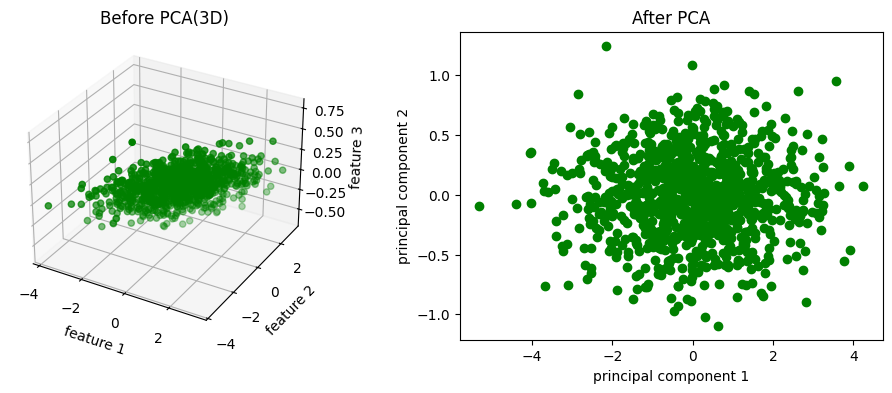

</details>

### 模型评估和模型选择

#### 损失函数

监督学习中有数据的原本标签可以和模型推测出来的标签做一个对比，用来判断模型预测的好坏

对于模型一次预测结果的好坏，需要有一个度量标准

给定输入 X 输出标签为 f(X)，真实标签为 Y，那么模型预测的 f(X) 和真实标签 Y 之间的偏差就用损失函数来度量，记作 $L(Y, f(X))$

损失函数是用于判断和原本标签的偏差程度，所以必须为非负值

常见的损失函数：

-   0 - 1 损失函数，通常用于非黑即白问题，因为只有俩值，要么成功要么失败

      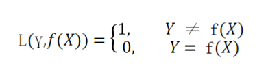

-   平方损失函数，通常用于预测与结果偏差多少

      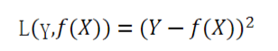

-   绝对值损失函数，通常用于预测与结果偏差多少

      

-   对数似然损失函数

      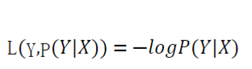

    之前有一个似然函数，就是由果推因，即从结果来判断最大可能性是什么原因导致的

    对数似然损失函数其实就是负的对数似然函数，用于判断模型预测结果和真实标签之间的偏差

    | 预测概率 p | 对数损失 −log(p) |                直观感受                |
    | :--------: | :--------------: | :------------------------------------: |
    |    0.9     |      0.105       |      轻微惩罚："模型很确定且正确"      |
    |    0.7     |      0.357       |     中等惩罚："模型有点犹豫但正确"     |
    |    0.5     |      0.693       |       较大惩罚："模型完全不确定"       |
    |    0.3     |      1.204       |     严重惩罚："模型很确定但错了！"     |
    |    0.1     |      2.303       | 极其严重惩罚："模型非常确定但完全错了" |

#### 经验误差

给定一个训练数据集，这个数据集的个数为 n，即 $T = {(x_1, y_1), ..., (x_n, y_n)}$

根据选取的损失函数，就可以计算出损失函数在这个数据集上的平均误差，称之为训练误差，也被称为经验误差、经验风险

$R_{emp}(f) = \frac{1}{n}\sum_{i=1}^n L(y_i, f(x_i))$

类似的，在测试数据集上的平均误差被称为测试误差或者泛化误差

一般情况下，考察一个模型的好坏的标准之一就是考察经验误差，如果经验误差很低就认为取到了最优秀的模型，这种策略被称为经验风险最小化 ERM - empirical risk minimization 

#### 欠拟合与过拟合

我们在最终目标是让测试误差越小，但是训练误差小和测试误差小其实是有区别的，训练的好不代表最终结果一定能好

**拟合**指的是机器学习模型在训练数据上学习到规律并生成预测结果的过程

理想情况下，模型能够准确捕捉训练数据的模式，并且在全新数据上（测试数据）也能有良好表现

也就是说模型具有良好的泛化能力，能够举一反三


**欠拟合**就是模型在训练数据上表现不佳，无法捕捉到我们的内在规律，这种模型在训练集和测试集上都表现很差


**过拟合**指的是模型在训练数据上表现很好，但是在测试数据或者新数据上表现不佳，也就是没有举一反三的能力

过拟合在模型上比较复杂，这种模型对训练数据的一些噪声和细节特别敏感，这样会导致把训练样本中的自身的一些特点当成了一致特点，从而失去了泛化能力

或者也可以理解为数据的样本不够大，不能涵盖所有的测试用例


发生欠拟合和过拟合的根本原因是模型的复杂度过低或者过高，从而导致测试误差偏大

比如识别猫的图片，如果提供的测试数据都是黑色或者白色的猫，等到了最后测验的时候

可能欠拟合就是识别有四条腿的都是猫（学的不够），过拟合就是识别四条腿、喵喵叫、黑色或者白色的才是猫（学的太多）


欠拟合原因与解决办法：

- 模型复杂度不足：模型（函数）过于简单，无法捕捉数据中的复杂关系，需要选择更加复杂的模型
- 特征不足：输入特征不充分，或者特征选择不恰当，导致模型无法充分学习数据的模式
- 训练不充分：训练过程中迭代次数太少，模型没有足够的时间学习数据的规律
- 过强的正则化：正则化项设置过大，强制模型过于简单，导致模型无法充分拟合数据

过拟合原因与解决办法：

- 模型复杂度过高：模型过于复杂，参数太多
- 训练数据不足：数据集太小，模型能记住训练数据的细节，但是无法泛化到新的数据
- 特征过多：特征太多，模型可能会记住训练集中的噪声，非数据的真正规律
- 训练时间过长：导致模型学到了训练数据中的噪声，而非数据的真正规律

---

泰勒展开式是一个函数的近似值，可以用来描述一个函数，就是可以逼近一个函数，就是在局部状态下，以无限的展开的变化趋势来模拟这一小段函数的变化

想象着画一条线，首先要决定一个起点，然后决定方向（导数），然后决定弯曲程度（二阶导），然后决定弯曲程度的变化（三阶导）……，每增加一个导就知道了一个变化细节

如果知道所有阶段的导数，就相当于预知了这个函数曲线在极短范围内的形状，这就是泰勒展开式

对于一元函数来说，泰勒展开式为


那么模仿欠拟合与过拟合，使用泰勒展开式就可以完美仿照，泰勒展开式展开项越多就越接近函数本身，展开越少就离函数越远，那么欠拟合就是少展开项，过拟合就是展开项太多

这次尝试模拟的函数为三角函数，因为三角函数可以无限次展开，即 $sin'(x) = cos(x)$ 且 $cos'(x) = -sin(x)$

---

<details>

```python
import numpy as np
import matplotlib.pyplot as plt
# 线性回归模型
from sklearn.linear_model import LinearRegression
# 构建多项式特征
from sklearn.preprocessing import PolynomialFeatures
# train_test_split 划分训练集和测试集
from sklearn.model_selection import train_test_split
# 损失函数，直接用均方误差损失函数
from sklearn.metrics import mean_squared_error

'''
1. 生成数据（包括特征工程选择等）
2. 划分训练集、测试集
3. 模型定义（线性回归模型）
4. 训练模型
5. 预测结果，计算损失
'''

'''
1. 生成数据（包括特征工程选择等）

使用 sin(x) 作为函数，加一点随机噪声，在 [-3, 3] 上做 300 个点，并使用 reshape 让这三百个点重新排列为一列

Y 值直接调用 sin(x)，添加一些随机噪声
'''
X = np.linspace(-3, 3, 300).reshape(-1, 1)
Y = np.sin(X) + np.random.uniform(low=-0.5, high=0.5, size=300).reshape(-1, 1)

# 画出散点图，需要三个图：欠拟合、拟合、过拟合
fig, ax = plt.subplots(1, 3, figsize=(15, 4))
ax[0].scatter(X, Y, c='y')
ax[1].scatter(X, Y, c='y')
ax[2].scatter(X, Y, c='y')

'''
2. 划分训练集、测试集

特征值全都给定，并且指定测试集的比例为 0.2，也可以给一个随机数种子 random_state，这个随机种子经常为 42，返回四个值 训练集 X、测试集 X、训练集 Y、测试集 Y
'''
train_X, test_X, train_Y, test_Y = train_test_split(X, Y, test_size=0.2, random_state=42)

'---------------------------------------------------------------------------------------'

'''
3. 模型定义（线性回归模型），这里用到的全都是线性回归，那么直接用线性回归即可

一、欠拟合（纯直线）
'''
model = LinearRegression()

x_tran1 = train_X
x_test1 = test_X
'''
4. 训练模型，使用欠拟合的训练集进行训练，并且打印系数（线性回归这里的系数是斜率）、截距
'''
model.fit(x_tran1, train_Y)
# [[0.33919315]]
print(model.coef_)
# [-0.01702797]
print(model.intercept_)

'''
5. 预测结果，计算损失，画出拟合曲线并写出训练误差与测试误差
'''
# 获得训练误差
train_loss_1 = mean_squared_error(train_Y, model.predict(x_tran1))
# 获得测试误差
y_pred_1 = model.predict(x_test1)
test_loss_1 = mean_squared_error(test_Y, y_pred_1)
# 画图
ax[0].plot(X, model.predict(X), 'r')
ax[0].text(-3, 1, f"测试误差：{test_loss_1:.4f}")
ax[0].text(-3, 1.3, f"训练误差：{train_loss_1:.4f}")

'---------------------------------------------------------------------------------------'

'''
3. 模型定义

二、恰好拟合（就定义一个 5 次多项式吧）
'''
# 使用特征工程处理数据，进行 5 次多项式，返回的应该是 6 个维度的特征（包括一个常数项）
poly5 = PolynomialFeatures(degree=5)
x_tran2 = poly5.fit_transform(train_X)
x_test2 = poly5.fit_transform(test_X)
# (240, 6)
print(x_tran2.shape)
# (60, 6)
print(x_test2.shape)

'''
4. 训练模型
'''
model.fit(x_tran2, train_Y)

'''
5. 预测结果
'''
# 获得训练误差
train_loss_2 = mean_squared_error(train_Y, model.predict(x_tran2))
# 获得测试误差
y_pred_2 = model.predict(x_test2)
test_loss_2 = mean_squared_error(test_Y, y_pred_2)
# 画图
ax[1].plot(X, model.predict(poly5.fit_transform(X)), 'r')
ax[1].text(-3, 1, f"测试误差：{test_loss_2:.4f}")
ax[1].text(-3, 1.3, f"训练误差：{train_loss_2:.4f}")

'---------------------------------------------------------------------------------------'

'''
3. 模型定义

二、过拟合（就定义一个 20 次多项式吧）
'''
# 使用特征工程处理数据，进行 5 次多项式，返回的应该是 6 个维度的特征（包括一个常数项）
poly20 = PolynomialFeatures(degree=20)
x_tran3 = poly20.fit_transform(train_X)
x_test3 = poly20.fit_transform(test_X)
print(x_tran3.shape)
print(x_test3.shape)

'''
4. 训练模型
'''
model.fit(x_tran3, train_Y)

'''
5. 预测结果
'''
# 获得训练误差
train_loss_3 = mean_squared_error(train_Y, model.predict(x_tran3))
# 获得测试误差
y_pred_3 = model.predict(x_test3)
test_loss_3 = mean_squared_error(test_Y, y_pred_3)
# 画图
ax[2].plot(X, model.predict(poly20.fit_transform(X)), 'r')
ax[2].text(-3, 1, f"测试误差：{test_loss_3:.4f}")
ax[2].text(-3, 1.3, f"训练误差：{train_loss_3:.4f}")

plt.rcParams['font.sans-serif'] = ['KaiTi']
plt.rcParams['axes.unicode_minus'] = False
plt.show()
```

</details>

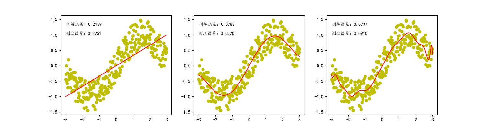

评价一个模型的好坏，最终还是看最终误差，在测试误差里，第一个很明显是 0.2 非常大，第三个要比第二个更大（学到了噪声），所以还是第二个比较好

接着来评价一下线性回归模型，对我们的数学公式而言，比如 $y = w_0x^0 + w_1x^1 + ... + w_nx^n$ 来说

将每个 $x$ 的 $n$ 次方都看成一个变量，那其实就是 $y = w_0 + w_1x_1 + w_2x_2 + ... + w_nx_n$ 的形式，也就是线性回归，看成的是 n 个特征

在上面的代码中

```python
poly5 = PolynomialFeatures(degree=5)
x_tran2 = poly5.fit_transform(train_X)
```

假如存在原始数据 `X = [ -1.0, 0.0, 1.0, 2.0 ]`，那么 变换后为

```
原始特征 X → 多项式特征 X_poly
[-1.0]  → [1, -1.0, 1.0, -1.0, 1.0, -1.0]  # 1, x, x², x³, x⁴, x⁵
[ 0.0]  → [1, 0.0, 0.0, 0.0, 0.0, 0.0]
[ 1.0]  → [1, 1.0, 1.0, 1.0, 1.0, 1.0]
[ 2.0]  → [1, 2.0, 4.0, 8.0, 16.0, 32.0]
```

这就把一维变为了六维，可以做线性回归了

- 对于标准的线性回归来说 $y = w_0 + w_1x$ 为拟合直线，特征向量为 $[1, x]$
- 对于多项式回归来说 $y = w_0 + w_1x + w_2x² + w_3x³ + w_4x⁴ + w_5x⁵$ 为拟合曲线，特征向量为 $[1, x, x², x³, x⁴, x⁵]$

对于 `LinearRegression()` 这个函数来说使用的是 $y = Xw$ 的形式，其中 $X$ 为特征矩阵

即 $[1, x]$ 和 $[1, x, x², x³, x⁴, x⁵]$ 都只是 $X$ 的不同构造方式

至于与泰勒展开式的关系，在泰勒展开式中 $sin(x) = x - \frac{x^3}{6} + \frac{x^5}{120} - \frac{x^7}{5040} + ...$

程序中的五次多项式拟合为 $y = w_0 + w_1x + w_2x² + w_3x³ + w_4x⁴ + w_5x⁵$

如果数据无噪声，那么应该得到：

- $w \approx 1$ => 对应 $x$ 项
- $w_2 \approx 0$ => $x^2$ 在泰勒展开式中不存在
- $w_3 \approx -1/6$ => 对应 $\frac{-x^3}{6}$ 项
- ……

#### 正则化

正则化（Regularization）是一种在训练机器学习模型时，在损失函数中添加额外项，来惩罚过大的参数，进而限制模型复杂度、避免过拟合，提高模型泛化能力的技术

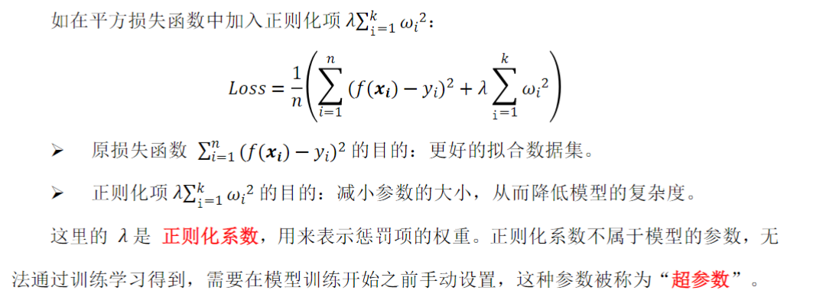