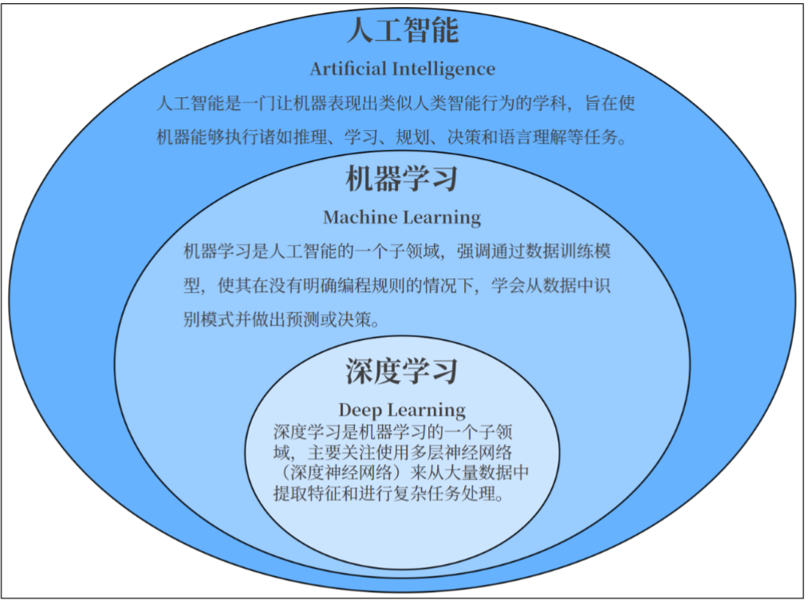
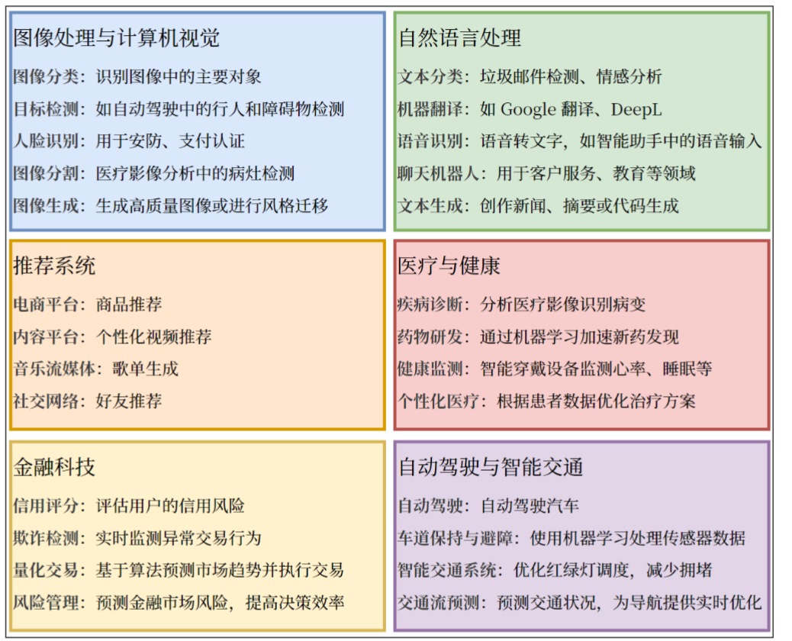
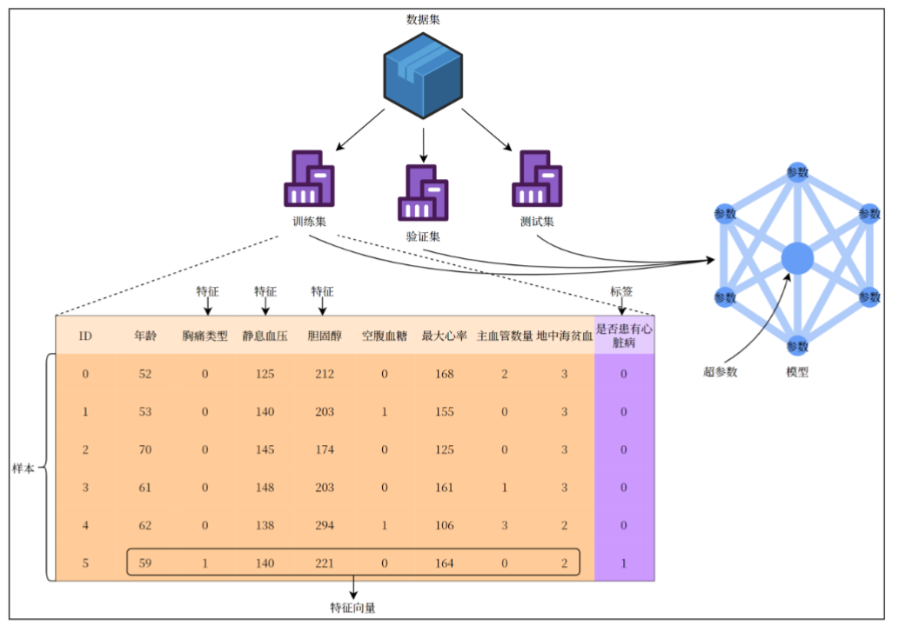
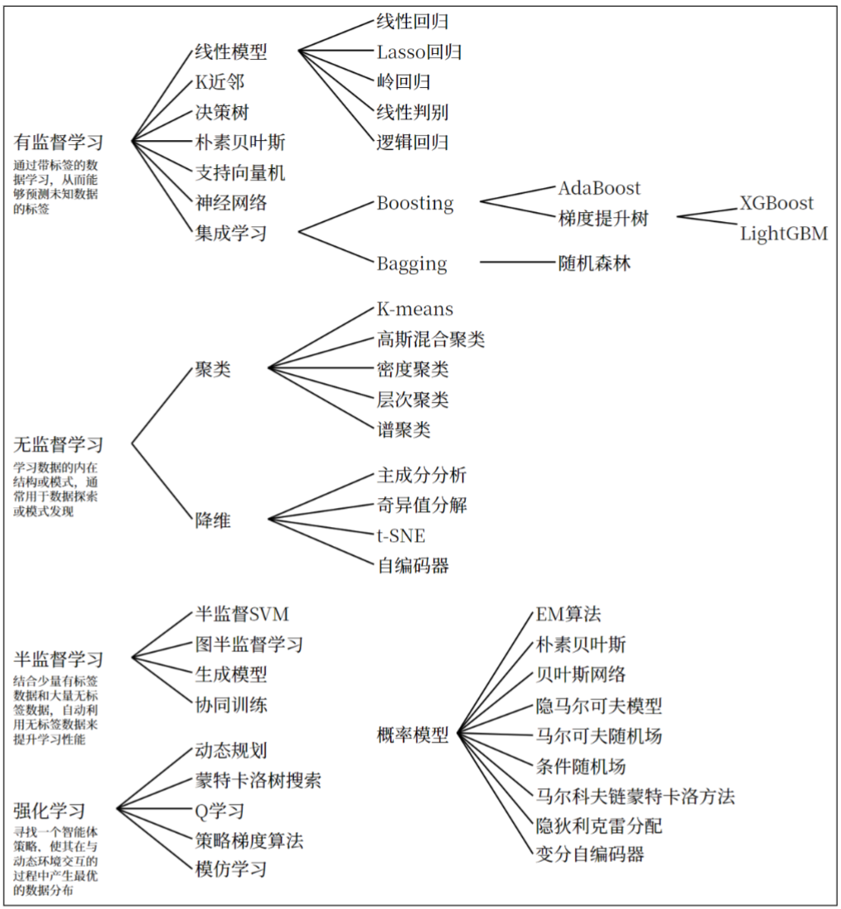
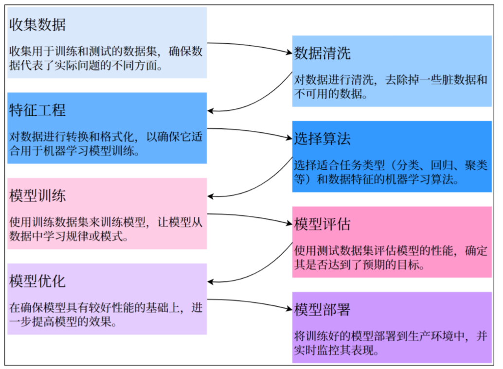

## 机器学习概述

机器学习 Machine Learning，简单来说就是处理一项任务，而这项任务需要大量的经验，也就是需要大量的数据来做训练

然后对任务处理的好坏做出评判标准，然后通过分析处理数据，令任务完成地更好

-   20 世纪 50 - 70 年代，机器学习开始

    图灵提出图灵测试，定义机器智能的基本标准

    弗兰克·罗森布拉特提出感知机算法，这是最早的人工神经网络模型之一，用于线性分类问题

    亚瑟·李·塞谬尔提出机器学习一词，并设计了一个用于玩跳棋的学习算法

-   20 世纪 70 - 80 年代，知识驱动与专家系统

    人类逐渐意识到仅靠推理无法实现人工智能，那么要实现人工智能就必须使得机器拥有知识

    这一时代出现了众多专家系统，也就是让机器拥有具体的某一类知识，比如 MYCIN 用于医疗诊断

    引入了决策树，如 ID3 算法

    统计理论成型，如贝叶斯定理开始在机器学习中使用

-   20 世纪 80 - 21 世纪，统计学方法逐渐成为核心

    在这一时代，专家系统面临知识瓶颈

    好在基于硬件和数据量级的攀升，使得统计方法逐渐形成可能

    决策树算法进一步发展，如 C4.5 算法

    支持向量机 SVM 被提出，成为强大的分类工具

    无监督学习方法开始成熟，如 K-means 聚类

    随机森林和 Boosting 方法（如 AdaBoost）引入，提升了集成学习的性能

-   21 世纪初，深度学习

    随着计算机能力和数据规模的快速增长，深度学习技术崛起

    深度神经网络主导，突破了图像、语音、文本的性能瓶颈

    深度信念网络 DBN 被提出，标志着深度学习研究的复兴

    AlexNext 在 ImageNet 像分类竞赛中获胜，证明了卷积神经网络（CNN）的强大性能

    生成对抗网络（GAN）被提出，用于生成图像和其他生成任务

    Transformer 架构在论文《Attention is All You Need》中提出，彻底改变了自然语言处理领域，Transformer 也是当下大模型的基础

-   大模型与通用人工智能

    深度学习进入规模化应用阶段，大语言模型和多模态模型的出现推动了机器学习的新高潮。模型参数规模空前，技术以通用性和泛化能力为目标

    自然语言处理：如 OpenAI 的 GPT 系列模型、Google 的 BERT

    多模态模型：如 OpenAI 的 CLIP、DeepMind 的 Gato

    自监督学习成为重要方向，降低了对人工标注数据的依赖

    强化学习和深度学习结合，应用于 AlphaGo、AlphaFold 等项目

    

## 基本术语

其实机器学习就是一个输入一个输出，简单来说就是函数 $f(x)$

-   数据集：多条数据的集合
    -   训练集 Traning Set 用于训练模型的数据
    -   测试集 Test Set 用于评估模型性能是否正确的数据
    -   验证集 Validation Set 用于调节超参数的数据
-   样本：数据集中的一条记录是关于一个事件或者对象的描述，称为样本
-   特征：数据集中一列反映事件或对象在某方面的表现或性质的事项，称为特征或属性
-   特征向量：将样本的所有特征表示为向量的形式，输入到模型
-   标签：监督学习中每个样本的结果信息，也称作目标值（target），就是函数最终结果
-   模型：个机器学习算法与训练后的参数集合，用于进行预测或分类
-   参数：模型通过训练学习到的值，例如线性回归中的权重和偏置
-   超参数：由用户设置的参数，不能通过训练自动学习，例如学习率、正则化系数等

## 机器学习基本理论

### 基本理论

机器学习的方法一般由三部分组成：

-   模型 model：总结数据的内在规律，用数学语言描述的参数系统
-   策略 strategy：最优模型的评价准则
-   算法 algorithm：选取最优模型的具体方法

机器学习的方法分类：

-   按照是否有监督分类：有监督学习（提供数据与结果）、无监督学习（提供数据不提供结果）、半监督学习、强化学习（通过与环境互动并且获取延迟返回而改进的学习过程）
-   按模型性质分类：概率模型 / 非概率模型、线性模型 / 非线性模型
-   按照学习技巧分类：贝叶斯学习、核方法

机器学习的具体过程

需要输入大量的数据来得到最终的模型（函数），而且最终的结果不是确定性的，是围绕着函数的曲线在周围进行散列的

### 特征工程

特征工程，就是从原始的数据中提取出与目标变量关系最密切的特征，剔除冗余、无关或者噪音特征，可以减少模型复杂度，加速训练过程、减少过拟合的风险

特征选择法：不会创建新特征，也不会概念数据结构

-   过滤法 Filter Method

    基于统计测试（低方差过滤法、卡方检验、相关系数、信息增益）来评估特征和目标变量之间的关系，从而选择最相关的特征

    其实对于函数模型，比如正态分布的函数曲线，需要的其实是方差越大越好，而不是方差越小越好

    这是因为如果方差太小，那么数据都会集合在非常精确的曲线上，对于预测不同数据产生的结果反而会起到反作用，这就是过拟合了

    方差越大就代表着数据分布越广越不集中，那么可以预测不同数据

-   包裹法 Wrapper Method

    使用模型（递归特征消除 RFE）来评估模型重要性，并根据模型的表现进行特征选择

    比如说依次给特征添加噪音，如果最终表现比之前更差，则说明这个特征越重要，如果最终表现没区别甚至更好，说明这个特征不重要甚至是起到反作用

-   嵌入法 Embedded Method

    使用模型本身特征选择机制（如决策树的特征重要性，L1 正则化的特征选择）来选择更重要的特征

特征转换：对数据进行数学或者统计处理，使其变得更加适合模型的输入要求

-   归一化 Normalization

    将特征缩放到指定范围内，也就是存在最大值和最小值，使用精准范围来使特征更精确

    适用于对尺度敏感的模型（如 KNN、SVM）

    比如电脑屏幕的颜色取值，由 RGB 三原色组成，每个颜色的取值为 0 - 255，那么就确定了最大和最小值

    但是有些不可以，比如正态分布曲线，最大值和最小值无法确定

-   标准化 Standardization

    通过减去均值并且除以标准差，使其分布具有均值，标准差 1

    比如正态分布曲线，最大值和最小值无法确定，但是均值可以确定在峰值上

    那么此时减去均值然后除以方差，最终结果就在 0 - 1 区间内

-   对数变换

    对于有偏态的数据，比如收入和价格（有些收入和价格十分偏高），可以取对数

    比如说有人挣钱一万块，有人挣钱一个亿，正常来讲为 10^4 和 10^8，取值对数

    以 10 为底的对数，一个是 4 一个是 8，这样就好多了

-   类别变量编码

    -   独热编码 One-Hot Encoding：将类别变量转换为二进制列，常用于无序类别的特征
    -   标签编码 Label Encoding：将类别变量映射为整数，常用于有序类型特征
    -   目标编码 Target Encoding：将类别变量的每个类别替换为其对应目标变量的平均值和其他统计量
    -   频率编码 Frequency Encoding：将类别变量映射为该数据在类别的出现频率

    是否对类别变量进行编码其实还是要看具体数据的样子，比如如果使用 RGB 来进行编码，那么其实对于某些情况就不适合标签编码

    如果 R 为 0、G 为 1、B 为 2，那么在计算机进行计算时，会看到 R 与 G 的距离为 1，R 与 B 的距离为 2，那么在计算时就会有误差

    其实 RGB 并没有区别，而是独立的变量，那么就可以使用独热编码，就是将 RGB 分开，R、G、B 一分为三，改为三个特征，那么此时在计算时就不会出现误差了

    但是对于位置可能没有区别，比如给全国每个省份进行标签编码，比如北京为 0 山东为 1，那么北京到山东确实是有距离，这个没有问题

特征构造：基于现有特征创建出全新特征

-   交互特征

    将两个特征通过某种方法组合为权限特征

-   统计特征

    从原始特征中提取统计值，例如某个时间窗口的平均值、最大最小值等

-   日期和时间特征

    例如从日期时间提取星期几

特征降维：特征巨多时，减少复杂度并且避免过拟合

-   主成分分析 PCA

      通过线性变换将原始特征映射到另一个空间，通过最大化类间距离与类内距离的比率来降维

-   线性判别分析 LDA

      一种非线性的降维技术，特别适合可视化高维数据

-   t-SNE

      一种神经网络模型，通过压缩编码器来实现数据的降维

特征降维和过滤法不同，过滤法虽然减少了特征的数量，但是其他特征本身信息不会动，特征降维是将原有信息转为新的信息
