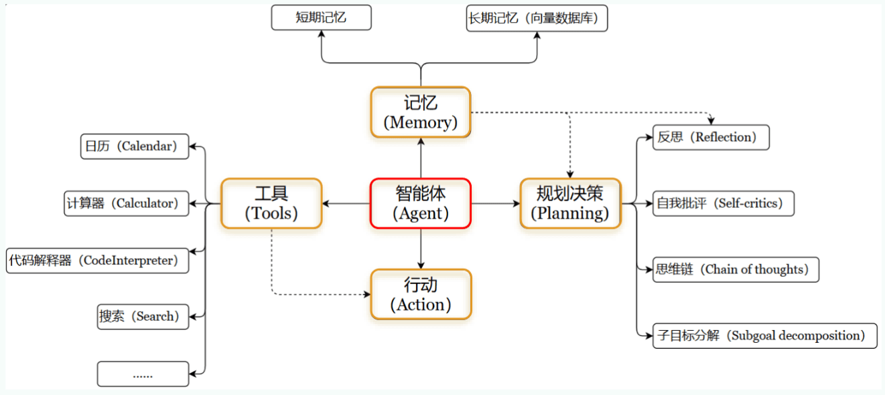
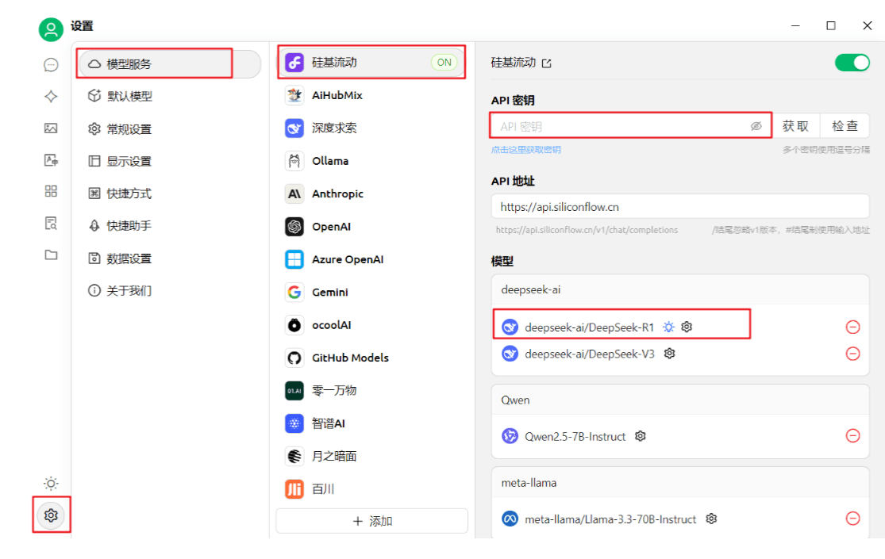
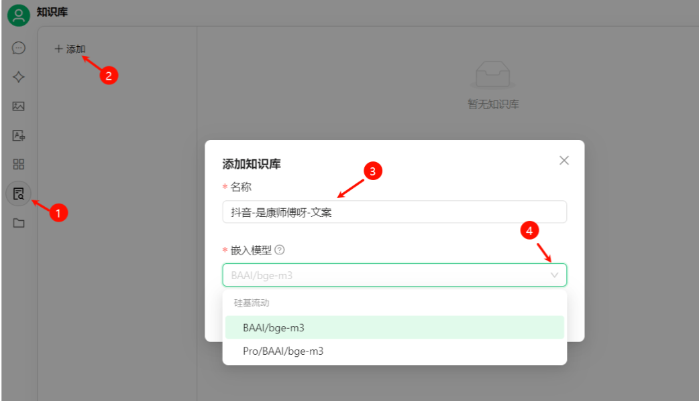
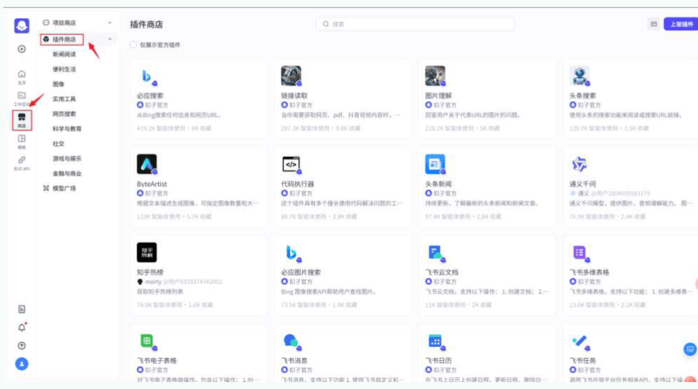
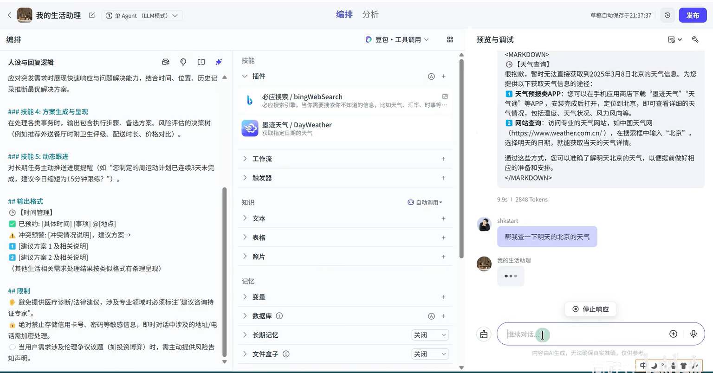
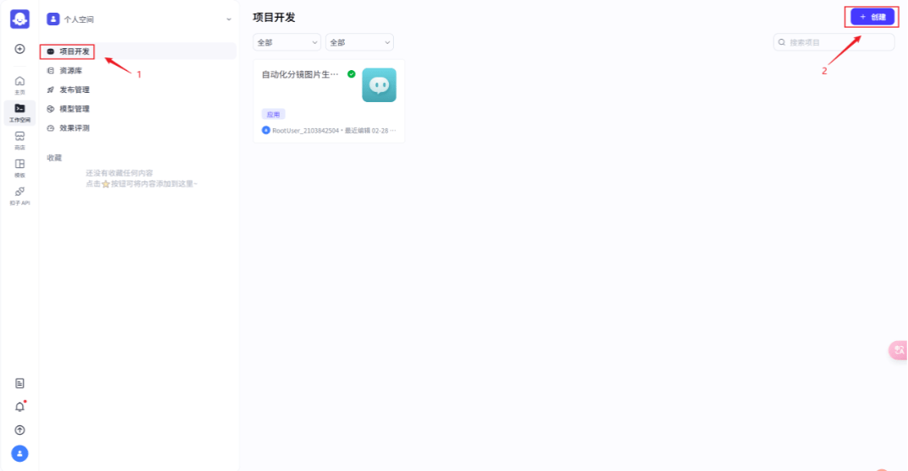
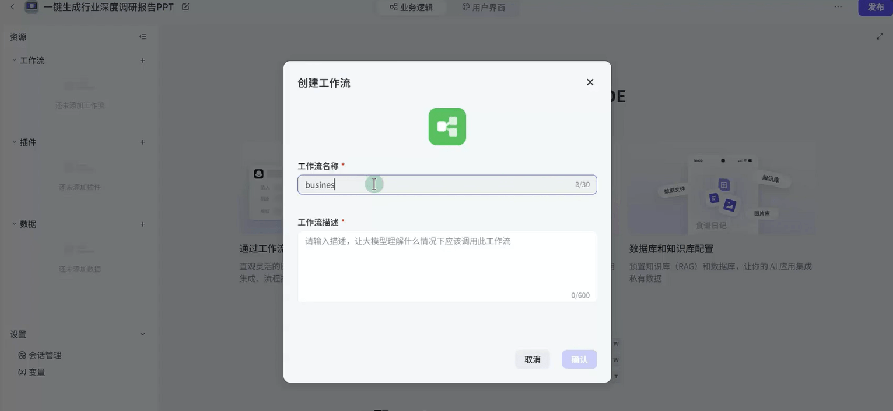
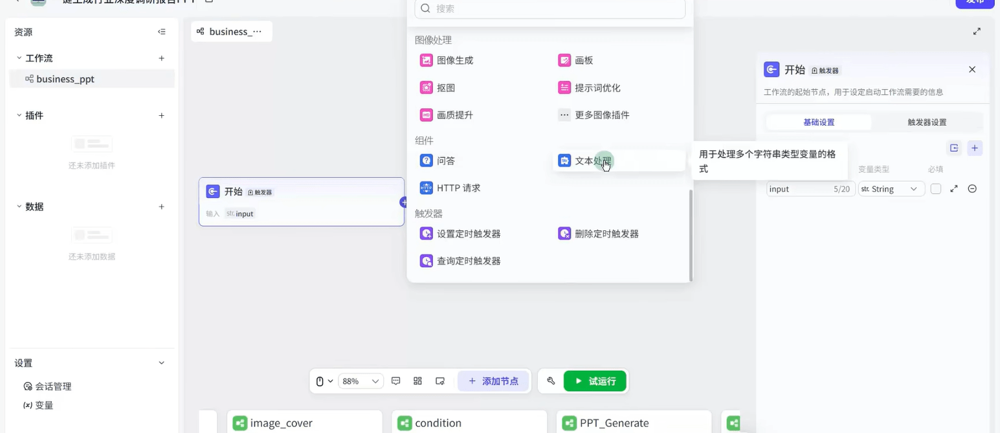
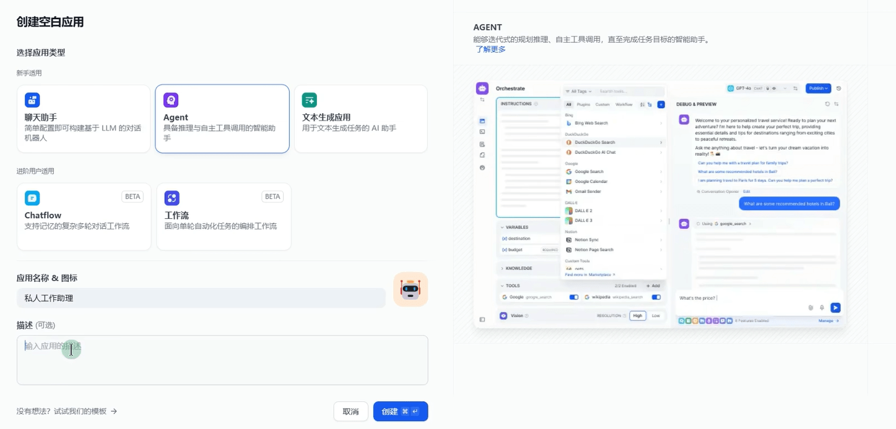

## 智能体

### 智能体概述

OpenAI 的元老翁丽莲于 2023 年 6 月在个人博客首次提出了现代 AI Agent 架构

### 个人知识库

RAG 是检索与增强生成，简单来说，因为训练语料可能缺失，导致最终生成的结果有差别

那么此时可以引入外部的新的数据源与原有知识源进行融合，让正确率飙升

联网搜索就是一种广义的 RAG，个人知识库是针对个人的 RAG

#### Cherry Studio

Cherry-Studio + 硅基流动 + DeepSeek-R1 搭建并使用个人知识库：

1. 注册[硅基流动](https://siliconflow.cn/)账号，创建 API 密钥
1. 下载 cherry studio 客户端并配置密钥

    

1. 在 cherry studio 中添加模型 bge-m3，这个模型可以将指定语料存储到向量数据库中

    

    

1. 创建知识库，选中知识库后进行提问

    

    

#### IMA

- 注册并下载 [IMA](ima.qq.com)
- 新建知识库

    

### 智能体搭建

简单智能体其实就是根据不同的提示词进行生成创建，好处就是每次不需要再输入提示词了，其余没区别

高阶智能体其实是根据人类的目标自动拆解生成

## Cline

Cline 是 vscode 的插件，可以调用 LLM 进行代码自动开发

## Coze

### 自调用智能体

Coze 是字节旗下的聊天机器人

可以在左侧进行人设调整，并且添加插件，右边进行测试，coze 会自动选择合适的插件来进行使用并回复

最后也可以进行发布

### 工作流

最后生成页面使用

## Dify

### 智能体

Dify（DefineModify）是一个开源的大语言模型 LLM 应用开发平台，由苏州语灵人工智能
推出

Dify 直观的界面结合了 AI 工作流、RAG 管道、Agent、模型管理、可观测性功能等，让用户可以快速从原型到生产，构建AI应用

Dify 为 AI Agent 提供了 50 多种内置工具，如谷歌搜索、DALL E、Stable Diffusion和 WolframAlpha 等

dify 是开源的，也可以下载到本地使用

### docker 自建工作流

1. dify [文档](https://docs.dify.ai/cn/use-dify/getting-started/introduction)，dify [github](https://github.com/langgenius/dify)
1. docker 中安装 dify
